cola Report for GDS3884
==================

**Date**: 2019-12-25 21:01:51 CET, **cola version**: 1.3.2

----------------------------------------------------------------

<style type='text/css'>

body, td, th {
   font-family: Arial,Helvetica,sans-serif;
   background-color: white;
   font-size: 13px;
  max-width: 800px;
  margin: auto;
  margin-left:210px;
  padding: 0px 10px 0px 10px;
  border-left: 1px solid #EEEEEE;
  line-height: 150%;
}

tt, code, pre {
   font-family: 'DejaVu Sans Mono', 'Droid Sans Mono', 'Lucida Console', Consolas, Monaco, 

monospace;
}

h1 {
   font-size:2.2em;
}

h2 {
   font-size:1.8em;
}

h3 {
   font-size:1.4em;
}

h4 {
   font-size:1.0em;
}

h5 {
   font-size:0.9em;
}

h6 {
   font-size:0.8em;
}

a {
  text-decoration: none;
  color: #0366d6;
}

a:hover {
  text-decoration: underline;
}

a:visited {
   color: #0366d6;
}

pre, img {
  max-width: 100%;
}
pre {
  overflow-x: auto;
}
pre code {
   display: block; padding: 0.5em;
}

code {
  font-size: 92%;
  border: 1px solid #ccc;
}

code[class] {
  background-color: #F8F8F8;
}

table, td, th {
  border: 1px solid #ccc;
}

blockquote {
   color:#666666;
   margin:0;
   padding-left: 1em;
   border-left: 0.5em #EEE solid;
}

hr {
   height: 0px;
   border-bottom: none;
   border-top-width: thin;
   border-top-style: dotted;
   border-top-color: #999999;
}

@media print {
   * {
      background: transparent !important;
      color: black !important;
      filter:none !important;
      -ms-filter: none !important;
   }

   body {
      font-size:12pt;
      max-width:100%;
   }

   a, a:visited {
      text-decoration: underline;
   }

   hr {
      visibility: hidden;
      page-break-before: always;
   }

   pre, blockquote {
      padding-right: 1em;
      page-break-inside: avoid;
   }

   tr, img {
      page-break-inside: avoid;
   }

   img {
      max-width: 100% !important;
   }

   @page :left {
      margin: 15mm 20mm 15mm 10mm;
   }

   @page :right {
      margin: 15mm 10mm 15mm 20mm;
   }

   p, h2, h3 {
      orphans: 3; widows: 3;
   }

   h2, h3 {
      page-break-after: avoid;
   }
}
</style>


## Summary


All available functions which can be applied to this `res_list` object:


```r
res_list
```

```
#> A 'ConsensusPartitionList' object with 24 methods.
#>   On a matrix with 51941 rows and 50 columns.
#>   Top rows are extracted by 'SD, CV, MAD, ATC' methods.
#>   Subgroups are detected by 'hclust, kmeans, skmeans, pam, mclust, NMF' method.
#>   Number of partitions are tried for k = 2, 3, 4, 5, 6.
#>   Performed in total 30000 partitions by row resampling.
#> 
#> Following methods can be applied to this 'ConsensusPartitionList' object:
#>  [1] "cola_report"           "collect_classes"       "collect_plots"         "collect_stats"        
#>  [5] "colnames"              "functional_enrichment" "get_anno_col"          "get_anno"             
#>  [9] "get_classes"           "get_matrix"            "get_membership"        "get_stats"            
#> [13] "is_best_k"             "is_stable_k"           "ncol"                  "nrow"                 
#> [17] "rownames"              "show"                  "suggest_best_k"        "test_to_known_factors"
#> [21] "top_rows_heatmap"      "top_rows_overlap"     
#> 
#> You can get result for a single method by, e.g. object["SD", "hclust"] or object["SD:hclust"]
#> or a subset of methods by object[c("SD", "CV")], c("hclust", "kmeans")]
```

The call of `run_all_consensus_partition_methods()` was:


```
#> run_all_consensus_partition_methods(data = mat, mc.cores = 4, anno = anno)
```

Dimension of the input matrix:


```r
mat = get_matrix(res_list)
dim(mat)
```

```
#> [1] 51941    50
```

### Density distribution

The density distribution for each sample is visualized as in one column in the
following heatmap. The clustering is based on the distance which is the
Kolmogorov-Smirnov statistic between two distributions.


```r
library(ComplexHeatmap)
densityHeatmap(mat, top_annotation = HeatmapAnnotation(df = get_anno(res_list), 
    col = get_anno_col(res_list)), ylab = "value", cluster_columns = TRUE, show_column_names = FALSE,
    mc.cores = 4)
```


### Suggest the best k


Folowing table shows the best `k` (number of partitions) for each combination
of top-value methods and partition methods. Clicking on the method name in
the table goes to the section for a single combination of methods.

[The cola vignette](http://bioconductor.org/packages/devel/bioc/vignettes/cola/inst/doc/cola.html#toc_13)
explains the definition of the metrics used for determining the best
number of partitions.


```r
suggest_best_k(res_list)
```


|                            | The best k| 1-PAC| Mean silhouette| Concordance|   |Optional k |
|:---------------------------|----------:|-----:|---------------:|-----------:|:--|:----------|
|[ATC:skmeans](#ATC-skmeans) |          2| 1.000|           0.986|       0.994|** |           |
|[ATC:pam](#ATC-pam)         |          3| 0.970|           0.943|       0.978|** |2          |
|[ATC:NMF](#ATC-NMF)         |          3| 0.970|           0.889|       0.961|** |           |
|[ATC:kmeans](#ATC-kmeans)   |          3| 0.947|           0.924|       0.972|*  |           |
|[SD:mclust](#SD-mclust)     |          4| 0.693|           0.787|       0.883|   |           |
|[ATC:mclust](#ATC-mclust)   |          4| 0.637|           0.729|       0.873|   |           |
|[MAD:mclust](#MAD-mclust)   |          4| 0.623|           0.777|       0.867|   |           |
|[CV:mclust](#CV-mclust)     |          4| 0.616|           0.718|       0.855|   |           |
|[MAD:NMF](#MAD-NMF)         |          2| 0.508|           0.852|       0.917|   |           |
|[ATC:hclust](#ATC-hclust)   |          4| 0.498|           0.692|       0.812|   |           |
|[SD:kmeans](#SD-kmeans)     |          4| 0.400|           0.705|       0.773|   |           |
|[CV:kmeans](#CV-kmeans)     |          4| 0.376|           0.612|       0.756|   |           |
|[SD:pam](#SD-pam)           |          4| 0.258|           0.503|       0.757|   |           |
|[MAD:pam](#MAD-pam)         |          2| 0.249|           0.784|       0.861|   |           |
|[CV:pam](#CV-pam)           |          2| 0.228|           0.731|       0.833|   |           |
|[CV:NMF](#CV-NMF)           |          2| 0.221|           0.693|       0.844|   |           |
|[MAD:hclust](#MAD-hclust)   |          6| 0.217|           0.426|       0.640|   |           |
|[MAD:kmeans](#MAD-kmeans)   |          2| 0.167|           0.711|       0.819|   |           |
|[SD:hclust](#SD-hclust)     |          2| 0.147|           0.722|       0.799|   |           |
|[SD:NMF](#SD-NMF)           |          2| 0.130|           0.452|       0.772|   |           |
|[CV:hclust](#CV-hclust)     |          3| 0.115|           0.497|       0.761|   |           |
|[MAD:skmeans](#MAD-skmeans) |          2| 0.021|           0.618|       0.781|   |           |
|[CV:skmeans](#CV-skmeans)   |          2| 0.006|           0.455|       0.731|   |           |
|[SD:skmeans](#SD-skmeans)   |          2| 0.003|           0.439|       0.727|   |           |

\*\*: 1-PAC > 0.95, \*: 1-PAC > 0.9


### CDF of consensus matrices

Cumulative distribution function curves of consensus matrix for all methods.


```r
collect_plots(res_list, fun = plot_ecdf)
```


### Consensus heatmap

Consensus heatmaps for all methods. ([What is a consensus heatmap?](http://bioconductor.org/packages/devel/bioc/vignettes/cola/inst/doc/cola.html#toc_9))


<style type='text/css'>


.ui-helper-hidden {
	display: none;
}
.ui-helper-hidden-accessible {
	border: 0;
	clip: rect(0 0 0 0);
	height: 1px;
	margin: -1px;
	overflow: hidden;
	padding: 0;
	position: absolute;
	width: 1px;
}
.ui-helper-reset {
	margin: 0;
	padding: 0;
	border: 0;
	outline: 0;
	line-height: 1.3;
	text-decoration: none;
	font-size: 100%;
	list-style: none;
}
.ui-helper-clearfix:before,
.ui-helper-clearfix:after {
	content: "";
	display: table;
	border-collapse: collapse;
}
.ui-helper-clearfix:after {
	clear: both;
}
.ui-helper-zfix {
	width: 100%;
	height: 100%;
	top: 0;
	left: 0;
	position: absolute;
	opacity: 0;
	filter:Alpha(Opacity=0); 
}

.ui-front {
	z-index: 100;
}


.ui-state-disabled {
	cursor: default !important;
	pointer-events: none;
}


.ui-icon {
	display: inline-block;
	vertical-align: middle;
	margin-top: -.25em;
	position: relative;
	text-indent: -99999px;
	overflow: hidden;
	background-repeat: no-repeat;
}

.ui-widget-icon-block {
	left: 50%;
	margin-left: -8px;
	display: block;
}


.ui-widget-overlay {
	position: fixed;
	top: 0;
	left: 0;
	width: 100%;
	height: 100%;
}
.ui-accordion .ui-accordion-header {
	display: block;
	cursor: pointer;
	position: relative;
	margin: 2px 0 0 0;
	padding: .5em .5em .5em .7em;
	font-size: 100%;
}
.ui-accordion .ui-accordion-content {
	padding: 1em 2.2em;
	border-top: 0;
	overflow: auto;
}
.ui-autocomplete {
	position: absolute;
	top: 0;
	left: 0;
	cursor: default;
}
.ui-menu {
	list-style: none;
	padding: 0;
	margin: 0;
	display: block;
	outline: 0;
}
.ui-menu .ui-menu {
	position: absolute;
}
.ui-menu .ui-menu-item {
	margin: 0;
	cursor: pointer;
	
	list-style-image: url("data:image/gif;base64,R0lGODlhAQABAIAAAAAAAP///yH5BAEAAAAALAAAAAABAAEAAAIBRAA7");
}
.ui-menu .ui-menu-item-wrapper {
	position: relative;
	padding: 3px 1em 3px .4em;
}
.ui-menu .ui-menu-divider {
	margin: 5px 0;
	height: 0;
	font-size: 0;
	line-height: 0;
	border-width: 1px 0 0 0;
}
.ui-menu .ui-state-focus,
.ui-menu .ui-state-active {
	margin: -1px;
}


.ui-menu-icons {
	position: relative;
}
.ui-menu-icons .ui-menu-item-wrapper {
	padding-left: 2em;
}


.ui-menu .ui-icon {
	position: absolute;
	top: 0;
	bottom: 0;
	left: .2em;
	margin: auto 0;
}


.ui-menu .ui-menu-icon {
	left: auto;
	right: 0;
}
.ui-button {
	padding: .4em 1em;
	display: inline-block;
	position: relative;
	line-height: normal;
	margin-right: .1em;
	cursor: pointer;
	vertical-align: middle;
	text-align: center;
	-webkit-user-select: none;
	-moz-user-select: none;
	-ms-user-select: none;
	user-select: none;

	
	overflow: visible;
}

.ui-button,
.ui-button:link,
.ui-button:visited,
.ui-button:hover,
.ui-button:active {
	text-decoration: none;
}


.ui-button-icon-only {
	width: 2em;
	box-sizing: border-box;
	text-indent: -9999px;
	white-space: nowrap;
}


input.ui-button.ui-button-icon-only {
	text-indent: 0;
}


.ui-button-icon-only .ui-icon {
	position: absolute;
	top: 50%;
	left: 50%;
	margin-top: -8px;
	margin-left: -8px;
}

.ui-button.ui-icon-notext .ui-icon {
	padding: 0;
	width: 2.1em;
	height: 2.1em;
	text-indent: -9999px;
	white-space: nowrap;

}

input.ui-button.ui-icon-notext .ui-icon {
	width: auto;
	height: auto;
	text-indent: 0;
	white-space: normal;
	padding: .4em 1em;
}


input.ui-button::-moz-focus-inner,
button.ui-button::-moz-focus-inner {
	border: 0;
	padding: 0;
}
.ui-controlgroup {
	vertical-align: middle;
	display: inline-block;
}
.ui-controlgroup > .ui-controlgroup-item {
	float: left;
	margin-left: 0;
	margin-right: 0;
}
.ui-controlgroup > .ui-controlgroup-item:focus,
.ui-controlgroup > .ui-controlgroup-item.ui-visual-focus {
	z-index: 9999;
}
.ui-controlgroup-vertical > .ui-controlgroup-item {
	display: block;
	float: none;
	width: 100%;
	margin-top: 0;
	margin-bottom: 0;
	text-align: left;
}
.ui-controlgroup-vertical .ui-controlgroup-item {
	box-sizing: border-box;
}
.ui-controlgroup .ui-controlgroup-label {
	padding: .4em 1em;
}
.ui-controlgroup .ui-controlgroup-label span {
	font-size: 80%;
}
.ui-controlgroup-horizontal .ui-controlgroup-label + .ui-controlgroup-item {
	border-left: none;
}
.ui-controlgroup-vertical .ui-controlgroup-label + .ui-controlgroup-item {
	border-top: none;
}
.ui-controlgroup-horizontal .ui-controlgroup-label.ui-widget-content {
	border-right: none;
}
.ui-controlgroup-vertical .ui-controlgroup-label.ui-widget-content {
	border-bottom: none;
}


.ui-controlgroup-vertical .ui-spinner-input {

	
	width: 75%;
	width: calc( 100% - 2.4em );
}
.ui-controlgroup-vertical .ui-spinner .ui-spinner-up {
	border-top-style: solid;
}

.ui-checkboxradio-label .ui-icon-background {
	box-shadow: inset 1px 1px 1px #ccc;
	border-radius: .12em;
	border: none;
}
.ui-checkboxradio-radio-label .ui-icon-background {
	width: 16px;
	height: 16px;
	border-radius: 1em;
	overflow: visible;
	border: none;
}
.ui-checkboxradio-radio-label.ui-checkboxradio-checked .ui-icon,
.ui-checkboxradio-radio-label.ui-checkboxradio-checked:hover .ui-icon {
	background-image: none;
	width: 8px;
	height: 8px;
	border-width: 4px;
	border-style: solid;
}
.ui-checkboxradio-disabled {
	pointer-events: none;
}
.ui-datepicker {
	width: 17em;
	padding: .2em .2em 0;
	display: none;
}
.ui-datepicker .ui-datepicker-header {
	position: relative;
	padding: .2em 0;
}
.ui-datepicker .ui-datepicker-prev,
.ui-datepicker .ui-datepicker-next {
	position: absolute;
	top: 2px;
	width: 1.8em;
	height: 1.8em;
}
.ui-datepicker .ui-datepicker-prev-hover,
.ui-datepicker .ui-datepicker-next-hover {
	top: 1px;
}
.ui-datepicker .ui-datepicker-prev {
	left: 2px;
}
.ui-datepicker .ui-datepicker-next {
	right: 2px;
}
.ui-datepicker .ui-datepicker-prev-hover {
	left: 1px;
}
.ui-datepicker .ui-datepicker-next-hover {
	right: 1px;
}
.ui-datepicker .ui-datepicker-prev span,
.ui-datepicker .ui-datepicker-next span {
	display: block;
	position: absolute;
	left: 50%;
	margin-left: -8px;
	top: 50%;
	margin-top: -8px;
}
.ui-datepicker .ui-datepicker-title {
	margin: 0 2.3em;
	line-height: 1.8em;
	text-align: center;
}
.ui-datepicker .ui-datepicker-title select {
	font-size: 1em;
	margin: 1px 0;
}
.ui-datepicker select.ui-datepicker-month,
.ui-datepicker select.ui-datepicker-year {
	width: 45%;
}
.ui-datepicker table {
	width: 100%;
	font-size: .9em;
	border-collapse: collapse;
	margin: 0 0 .4em;
}
.ui-datepicker th {
	padding: .7em .3em;
	text-align: center;
	font-weight: bold;
	border: 0;
}
.ui-datepicker td {
	border: 0;
	padding: 1px;
}
.ui-datepicker td span,
.ui-datepicker td a {
	display: block;
	padding: .2em;
	text-align: right;
	text-decoration: none;
}
.ui-datepicker .ui-datepicker-buttonpane {
	background-image: none;
	margin: .7em 0 0 0;
	padding: 0 .2em;
	border-left: 0;
	border-right: 0;
	border-bottom: 0;
}
.ui-datepicker .ui-datepicker-buttonpane button {
	float: right;
	margin: .5em .2em .4em;
	cursor: pointer;
	padding: .2em .6em .3em .6em;
	width: auto;
	overflow: visible;
}
.ui-datepicker .ui-datepicker-buttonpane button.ui-datepicker-current {
	float: left;
}


.ui-datepicker.ui-datepicker-multi {
	width: auto;
}
.ui-datepicker-multi .ui-datepicker-group {
	float: left;
}
.ui-datepicker-multi .ui-datepicker-group table {
	width: 95%;
	margin: 0 auto .4em;
}
.ui-datepicker-multi-2 .ui-datepicker-group {
	width: 50%;
}
.ui-datepicker-multi-3 .ui-datepicker-group {
	width: 33.3%;
}
.ui-datepicker-multi-4 .ui-datepicker-group {
	width: 25%;
}
.ui-datepicker-multi .ui-datepicker-group-last .ui-datepicker-header,
.ui-datepicker-multi .ui-datepicker-group-middle .ui-datepicker-header {
	border-left-width: 0;
}
.ui-datepicker-multi .ui-datepicker-buttonpane {
	clear: left;
}
.ui-datepicker-row-break {
	clear: both;
	width: 100%;
	font-size: 0;
}


.ui-datepicker-rtl {
	direction: rtl;
}
.ui-datepicker-rtl .ui-datepicker-prev {
	right: 2px;
	left: auto;
}
.ui-datepicker-rtl .ui-datepicker-next {
	left: 2px;
	right: auto;
}
.ui-datepicker-rtl .ui-datepicker-prev:hover {
	right: 1px;
	left: auto;
}
.ui-datepicker-rtl .ui-datepicker-next:hover {
	left: 1px;
	right: auto;
}
.ui-datepicker-rtl .ui-datepicker-buttonpane {
	clear: right;
}
.ui-datepicker-rtl .ui-datepicker-buttonpane button {
	float: left;
}
.ui-datepicker-rtl .ui-datepicker-buttonpane button.ui-datepicker-current,
.ui-datepicker-rtl .ui-datepicker-group {
	float: right;
}
.ui-datepicker-rtl .ui-datepicker-group-last .ui-datepicker-header,
.ui-datepicker-rtl .ui-datepicker-group-middle .ui-datepicker-header {
	border-right-width: 0;
	border-left-width: 1px;
}


.ui-datepicker .ui-icon {
	display: block;
	text-indent: -99999px;
	overflow: hidden;
	background-repeat: no-repeat;
	left: .5em;
	top: .3em;
}
.ui-dialog {
	position: absolute;
	top: 0;
	left: 0;
	padding: .2em;
	outline: 0;
}
.ui-dialog .ui-dialog-titlebar {
	padding: .4em 1em;
	position: relative;
}
.ui-dialog .ui-dialog-title {
	float: left;
	margin: .1em 0;
	white-space: nowrap;
	width: 90%;
	overflow: hidden;
	text-overflow: ellipsis;
}
.ui-dialog .ui-dialog-titlebar-close {
	position: absolute;
	right: .3em;
	top: 50%;
	width: 20px;
	margin: -10px 0 0 0;
	padding: 1px;
	height: 20px;
}
.ui-dialog .ui-dialog-content {
	position: relative;
	border: 0;
	padding: .5em 1em;
	background: none;
	overflow: auto;
}
.ui-dialog .ui-dialog-buttonpane {
	text-align: left;
	border-width: 1px 0 0 0;
	background-image: none;
	margin-top: .5em;
	padding: .3em 1em .5em .4em;
}
.ui-dialog .ui-dialog-buttonpane .ui-dialog-buttonset {
	float: right;
}
.ui-dialog .ui-dialog-buttonpane button {
	margin: .5em .4em .5em 0;
	cursor: pointer;
}
.ui-dialog .ui-resizable-n {
	height: 2px;
	top: 0;
}
.ui-dialog .ui-resizable-e {
	width: 2px;
	right: 0;
}
.ui-dialog .ui-resizable-s {
	height: 2px;
	bottom: 0;
}
.ui-dialog .ui-resizable-w {
	width: 2px;
	left: 0;
}
.ui-dialog .ui-resizable-se,
.ui-dialog .ui-resizable-sw,
.ui-dialog .ui-resizable-ne,
.ui-dialog .ui-resizable-nw {
	width: 7px;
	height: 7px;
}
.ui-dialog .ui-resizable-se {
	right: 0;
	bottom: 0;
}
.ui-dialog .ui-resizable-sw {
	left: 0;
	bottom: 0;
}
.ui-dialog .ui-resizable-ne {
	right: 0;
	top: 0;
}
.ui-dialog .ui-resizable-nw {
	left: 0;
	top: 0;
}
.ui-draggable .ui-dialog-titlebar {
	cursor: move;
}
.ui-draggable-handle {
	-ms-touch-action: none;
	touch-action: none;
}
.ui-resizable {
	position: relative;
}
.ui-resizable-handle {
	position: absolute;
	font-size: 0.1px;
	display: block;
	-ms-touch-action: none;
	touch-action: none;
}
.ui-resizable-disabled .ui-resizable-handle,
.ui-resizable-autohide .ui-resizable-handle {
	display: none;
}
.ui-resizable-n {
	cursor: n-resize;
	height: 7px;
	width: 100%;
	top: -5px;
	left: 0;
}
.ui-resizable-s {
	cursor: s-resize;
	height: 7px;
	width: 100%;
	bottom: -5px;
	left: 0;
}
.ui-resizable-e {
	cursor: e-resize;
	width: 7px;
	right: -5px;
	top: 0;
	height: 100%;
}
.ui-resizable-w {
	cursor: w-resize;
	width: 7px;
	left: -5px;
	top: 0;
	height: 100%;
}
.ui-resizable-se {
	cursor: se-resize;
	width: 12px;
	height: 12px;
	right: 1px;
	bottom: 1px;
}
.ui-resizable-sw {
	cursor: sw-resize;
	width: 9px;
	height: 9px;
	left: -5px;
	bottom: -5px;
}
.ui-resizable-nw {
	cursor: nw-resize;
	width: 9px;
	height: 9px;
	left: -5px;
	top: -5px;
}
.ui-resizable-ne {
	cursor: ne-resize;
	width: 9px;
	height: 9px;
	right: -5px;
	top: -5px;
}
.ui-progressbar {
	height: 2em;
	text-align: left;
	overflow: hidden;
}
.ui-progressbar .ui-progressbar-value {
	margin: -1px;
	height: 100%;
}
.ui-progressbar .ui-progressbar-overlay {
	background: url("data:image/gif;base64,R0lGODlhKAAoAIABAAAAAP///yH/C05FVFNDQVBFMi4wAwEAAAAh+QQJAQABACwAAAAAKAAoAAACkYwNqXrdC52DS06a7MFZI+4FHBCKoDeWKXqymPqGqxvJrXZbMx7Ttc+w9XgU2FB3lOyQRWET2IFGiU9m1frDVpxZZc6bfHwv4c1YXP6k1Vdy292Fb6UkuvFtXpvWSzA+HycXJHUXiGYIiMg2R6W459gnWGfHNdjIqDWVqemH2ekpObkpOlppWUqZiqr6edqqWQAAIfkECQEAAQAsAAAAACgAKAAAApSMgZnGfaqcg1E2uuzDmmHUBR8Qil95hiPKqWn3aqtLsS18y7G1SzNeowWBENtQd+T1JktP05nzPTdJZlR6vUxNWWjV+vUWhWNkWFwxl9VpZRedYcflIOLafaa28XdsH/ynlcc1uPVDZxQIR0K25+cICCmoqCe5mGhZOfeYSUh5yJcJyrkZWWpaR8doJ2o4NYq62lAAACH5BAkBAAEALAAAAAAoACgAAAKVDI4Yy22ZnINRNqosw0Bv7i1gyHUkFj7oSaWlu3ovC8GxNso5fluz3qLVhBVeT/Lz7ZTHyxL5dDalQWPVOsQWtRnuwXaFTj9jVVh8pma9JjZ4zYSj5ZOyma7uuolffh+IR5aW97cHuBUXKGKXlKjn+DiHWMcYJah4N0lYCMlJOXipGRr5qdgoSTrqWSq6WFl2ypoaUAAAIfkECQEAAQAsAAAAACgAKAAAApaEb6HLgd/iO7FNWtcFWe+ufODGjRfoiJ2akShbueb0wtI50zm02pbvwfWEMWBQ1zKGlLIhskiEPm9R6vRXxV4ZzWT2yHOGpWMyorblKlNp8HmHEb/lCXjcW7bmtXP8Xt229OVWR1fod2eWqNfHuMjXCPkIGNileOiImVmCOEmoSfn3yXlJWmoHGhqp6ilYuWYpmTqKUgAAIfkECQEAAQAsAAAAACgAKAAAApiEH6kb58biQ3FNWtMFWW3eNVcojuFGfqnZqSebuS06w5V80/X02pKe8zFwP6EFWOT1lDFk8rGERh1TTNOocQ61Hm4Xm2VexUHpzjymViHrFbiELsefVrn6XKfnt2Q9G/+Xdie499XHd2g4h7ioOGhXGJboGAnXSBnoBwKYyfioubZJ2Hn0RuRZaflZOil56Zp6iioKSXpUAAAh+QQJAQABACwAAAAAKAAoAAACkoQRqRvnxuI7kU1a1UU5bd5tnSeOZXhmn5lWK3qNTWvRdQxP8qvaC+/yaYQzXO7BMvaUEmJRd3TsiMAgswmNYrSgZdYrTX6tSHGZO73ezuAw2uxuQ+BbeZfMxsexY35+/Qe4J1inV0g4x3WHuMhIl2jXOKT2Q+VU5fgoSUI52VfZyfkJGkha6jmY+aaYdirq+lQAACH5BAkBAAEALAAAAAAoACgAAAKWBIKpYe0L3YNKToqswUlvznigd4wiR4KhZrKt9Upqip61i9E3vMvxRdHlbEFiEXfk9YARYxOZZD6VQ2pUunBmtRXo1Lf8hMVVcNl8JafV38aM2/Fu5V16Bn63r6xt97j09+MXSFi4BniGFae3hzbH9+hYBzkpuUh5aZmHuanZOZgIuvbGiNeomCnaxxap2upaCZsq+1kAACH5BAkBAAEALAAAAAAoACgAAAKXjI8By5zf4kOxTVrXNVlv1X0d8IGZGKLnNpYtm8Lr9cqVeuOSvfOW79D9aDHizNhDJidFZhNydEahOaDH6nomtJjp1tutKoNWkvA6JqfRVLHU/QUfau9l2x7G54d1fl995xcIGAdXqMfBNadoYrhH+Mg2KBlpVpbluCiXmMnZ2Sh4GBqJ+ckIOqqJ6LmKSllZmsoq6wpQAAAh+QQJAQABACwAAAAAKAAoAAAClYx/oLvoxuJDkU1a1YUZbJ59nSd2ZXhWqbRa2/gF8Gu2DY3iqs7yrq+xBYEkYvFSM8aSSObE+ZgRl1BHFZNr7pRCavZ5BW2142hY3AN/zWtsmf12p9XxxFl2lpLn1rseztfXZjdIWIf2s5dItwjYKBgo9yg5pHgzJXTEeGlZuenpyPmpGQoKOWkYmSpaSnqKileI2FAAACH5BAkBAAEALAAAAAAoACgAAAKVjB+gu+jG4kORTVrVhRlsnn2dJ3ZleFaptFrb+CXmO9OozeL5VfP99HvAWhpiUdcwkpBH3825AwYdU8xTqlLGhtCosArKMpvfa1mMRae9VvWZfeB2XfPkeLmm18lUcBj+p5dnN8jXZ3YIGEhYuOUn45aoCDkp16hl5IjYJvjWKcnoGQpqyPlpOhr3aElaqrq56Bq7VAAAOw==");
	height: 100%;
	filter: alpha(opacity=25); 
	opacity: 0.25;
}
.ui-progressbar-indeterminate .ui-progressbar-value {
	background-image: none;
}
.ui-selectable {
	-ms-touch-action: none;
	touch-action: none;
}
.ui-selectable-helper {
	position: absolute;
	z-index: 100;
	border: 1px dotted black;
}
.ui-selectmenu-menu {
	padding: 0;
	margin: 0;
	position: absolute;
	top: 0;
	left: 0;
	display: none;
}
.ui-selectmenu-menu .ui-menu {
	overflow: auto;
	overflow-x: hidden;
	padding-bottom: 1px;
}
.ui-selectmenu-menu .ui-menu .ui-selectmenu-optgroup {
	font-size: 1em;
	font-weight: bold;
	line-height: 1.5;
	padding: 2px 0.4em;
	margin: 0.5em 0 0 0;
	height: auto;
	border: 0;
}
.ui-selectmenu-open {
	display: block;
}
.ui-selectmenu-text {
	display: block;
	margin-right: 20px;
	overflow: hidden;
	text-overflow: ellipsis;
}
.ui-selectmenu-button.ui-button {
	text-align: left;
	white-space: nowrap;
	width: 14em;
}
.ui-selectmenu-icon.ui-icon {
	float: right;
	margin-top: 0;
}
.ui-slider {
	position: relative;
	text-align: left;
}
.ui-slider .ui-slider-handle {
	position: absolute;
	z-index: 2;
	width: 1.2em;
	height: 1.2em;
	cursor: default;
	-ms-touch-action: none;
	touch-action: none;
}
.ui-slider .ui-slider-range {
	position: absolute;
	z-index: 1;
	font-size: .7em;
	display: block;
	border: 0;
	background-position: 0 0;
}


.ui-slider.ui-state-disabled .ui-slider-handle,
.ui-slider.ui-state-disabled .ui-slider-range {
	filter: inherit;
}

.ui-slider-horizontal {
	height: .8em;
}
.ui-slider-horizontal .ui-slider-handle {
	top: -.3em;
	margin-left: -.6em;
}
.ui-slider-horizontal .ui-slider-range {
	top: 0;
	height: 100%;
}
.ui-slider-horizontal .ui-slider-range-min {
	left: 0;
}
.ui-slider-horizontal .ui-slider-range-max {
	right: 0;
}

.ui-slider-vertical {
	width: .8em;
	height: 100px;
}
.ui-slider-vertical .ui-slider-handle {
	left: -.3em;
	margin-left: 0;
	margin-bottom: -.6em;
}
.ui-slider-vertical .ui-slider-range {
	left: 0;
	width: 100%;
}
.ui-slider-vertical .ui-slider-range-min {
	bottom: 0;
}
.ui-slider-vertical .ui-slider-range-max {
	top: 0;
}
.ui-sortable-handle {
	-ms-touch-action: none;
	touch-action: none;
}
.ui-spinner {
	position: relative;
	display: inline-block;
	overflow: hidden;
	padding: 0;
	vertical-align: middle;
}
.ui-spinner-input {
	border: none;
	background: none;
	color: inherit;
	padding: .222em 0;
	margin: .2em 0;
	vertical-align: middle;
	margin-left: .4em;
	margin-right: 2em;
}
.ui-spinner-button {
	width: 1.6em;
	height: 50%;
	font-size: .5em;
	padding: 0;
	margin: 0;
	text-align: center;
	position: absolute;
	cursor: default;
	display: block;
	overflow: hidden;
	right: 0;
}

.ui-spinner a.ui-spinner-button {
	border-top-style: none;
	border-bottom-style: none;
	border-right-style: none;
}
.ui-spinner-up {
	top: 0;
}
.ui-spinner-down {
	bottom: 0;
}
.ui-tabs {
	position: relative;
	padding: .2em;
}
.ui-tabs .ui-tabs-nav {
	margin: 0;
	padding: .2em .2em 0;
}
.ui-tabs .ui-tabs-nav li {
	list-style: none;
	float: left;
	position: relative;
	top: 0;
	margin: 1px .2em 0 0;
	border-bottom-width: 0;
	padding: 0;
	white-space: nowrap;
}
.ui-tabs .ui-tabs-nav .ui-tabs-anchor {
	float: left;
	padding: .5em 1em;
	text-decoration: none;
}
.ui-tabs .ui-tabs-nav li.ui-tabs-active {
	margin-bottom: -1px;
	padding-bottom: 1px;
}
.ui-tabs .ui-tabs-nav li.ui-tabs-active .ui-tabs-anchor,
.ui-tabs .ui-tabs-nav li.ui-state-disabled .ui-tabs-anchor,
.ui-tabs .ui-tabs-nav li.ui-tabs-loading .ui-tabs-anchor {
	cursor: text;
}
.ui-tabs-collapsible .ui-tabs-nav li.ui-tabs-active .ui-tabs-anchor {
	cursor: pointer;
}
.ui-tabs .ui-tabs-panel {
	display: block;
	border-width: 0;
	padding: 1em 1.4em;
	background: none;
}
.ui-tooltip {
	padding: 8px;
	position: absolute;
	z-index: 9999;
	max-width: 300px;
}
body .ui-tooltip {
	border-width: 2px;
}

.ui-widget {
	font-family: Arial,Helvetica,sans-serif;
	font-size: 1em;
}
.ui-widget .ui-widget {
	font-size: 1em;
}
.ui-widget input,
.ui-widget select,
.ui-widget textarea,
.ui-widget button {
	font-family: Arial,Helvetica,sans-serif;
	font-size: 1em;
}
.ui-widget.ui-widget-content {
	border: 1px solid #c5c5c5;
}
.ui-widget-content {
	border: 1px solid #dddddd;
	background: #ffffff;
	color: #333333;
}
.ui-widget-content a {
	color: #333333;
}
.ui-widget-header {
	border: 1px solid #dddddd;
	background: #e9e9e9;
	color: #333333;
	font-weight: bold;
}
.ui-widget-header a {
	color: #333333;
}


.ui-state-default,
.ui-widget-content .ui-state-default,
.ui-widget-header .ui-state-default,
.ui-button,


html .ui-button.ui-state-disabled:hover,
html .ui-button.ui-state-disabled:active {
	border: 1px solid #c5c5c5;
	background: #f6f6f6;
	font-weight: normal;
	color: #454545;
}
.ui-state-default a,
.ui-state-default a:link,
.ui-state-default a:visited,
a.ui-button,
a:link.ui-button,
a:visited.ui-button,
.ui-button {
	color: #454545;
	text-decoration: none;
}
.ui-state-hover,
.ui-widget-content .ui-state-hover,
.ui-widget-header .ui-state-hover,
.ui-state-focus,
.ui-widget-content .ui-state-focus,
.ui-widget-header .ui-state-focus,
.ui-button:hover,
.ui-button:focus {
	border: 1px solid #cccccc;
	background: #ededed;
	font-weight: normal;
	color: #2b2b2b;
}
.ui-state-hover a,
.ui-state-hover a:hover,
.ui-state-hover a:link,
.ui-state-hover a:visited,
.ui-state-focus a,
.ui-state-focus a:hover,
.ui-state-focus a:link,
.ui-state-focus a:visited,
a.ui-button:hover,
a.ui-button:focus {
	color: #2b2b2b;
	text-decoration: none;
}

.ui-visual-focus {
	box-shadow: 0 0 3px 1px rgb(94, 158, 214);
}
.ui-state-active,
.ui-widget-content .ui-state-active,
.ui-widget-header .ui-state-active,
a.ui-button:active,
.ui-button:active,
.ui-button.ui-state-active:hover {
	border: 1px solid #003eff;
	background: #007fff;
	font-weight: normal;
	color: #ffffff;
}
.ui-icon-background,
.ui-state-active .ui-icon-background {
	border: #003eff;
	background-color: #ffffff;
}
.ui-state-active a,
.ui-state-active a:link,
.ui-state-active a:visited {
	color: #ffffff;
	text-decoration: none;
}


.ui-state-highlight,
.ui-widget-content .ui-state-highlight,
.ui-widget-header .ui-state-highlight {
	border: 1px solid #dad55e;
	background: #fffa90;
	color: #777620;
}
.ui-state-checked {
	border: 1px solid #dad55e;
	background: #fffa90;
}
.ui-state-highlight a,
.ui-widget-content .ui-state-highlight a,
.ui-widget-header .ui-state-highlight a {
	color: #777620;
}
.ui-state-error,
.ui-widget-content .ui-state-error,
.ui-widget-header .ui-state-error {
	border: 1px solid #f1a899;
	background: #fddfdf;
	color: #5f3f3f;
}
.ui-state-error a,
.ui-widget-content .ui-state-error a,
.ui-widget-header .ui-state-error a {
	color: #5f3f3f;
}
.ui-state-error-text,
.ui-widget-content .ui-state-error-text,
.ui-widget-header .ui-state-error-text {
	color: #5f3f3f;
}
.ui-priority-primary,
.ui-widget-content .ui-priority-primary,
.ui-widget-header .ui-priority-primary {
	font-weight: bold;
}
.ui-priority-secondary,
.ui-widget-content .ui-priority-secondary,
.ui-widget-header .ui-priority-secondary {
	opacity: .7;
	filter:Alpha(Opacity=70); 
	font-weight: normal;
}
.ui-state-disabled,
.ui-widget-content .ui-state-disabled,
.ui-widget-header .ui-state-disabled {
	opacity: .35;
	filter:Alpha(Opacity=35); 
	background-image: none;
}
.ui-state-disabled .ui-icon {
	filter:Alpha(Opacity=35); 
}


.ui-icon {
	width: 16px;
	height: 16px;
}
.ui-icon,
.ui-widget-content .ui-icon {
	background-image: url("images/ui-icons_444444_256x240.png");
}
.ui-widget-header .ui-icon {
	background-image: url("images/ui-icons_444444_256x240.png");
}
.ui-state-hover .ui-icon,
.ui-state-focus .ui-icon,
.ui-button:hover .ui-icon,
.ui-button:focus .ui-icon {
	background-image: url("images/ui-icons_555555_256x240.png");
}
.ui-state-active .ui-icon,
.ui-button:active .ui-icon {
	background-image: url("images/ui-icons_ffffff_256x240.png");
}
.ui-state-highlight .ui-icon,
.ui-button .ui-state-highlight.ui-icon {
	background-image: url("images/ui-icons_777620_256x240.png");
}
.ui-state-error .ui-icon,
.ui-state-error-text .ui-icon {
	background-image: url("images/ui-icons_cc0000_256x240.png");
}
.ui-button .ui-icon {
	background-image: url("images/ui-icons_777777_256x240.png");
}


.ui-icon-blank { background-position: 16px 16px; }
.ui-icon-caret-1-n { background-position: 0 0; }
.ui-icon-caret-1-ne { background-position: -16px 0; }
.ui-icon-caret-1-e { background-position: -32px 0; }
.ui-icon-caret-1-se { background-position: -48px 0; }
.ui-icon-caret-1-s { background-position: -65px 0; }
.ui-icon-caret-1-sw { background-position: -80px 0; }
.ui-icon-caret-1-w { background-position: -96px 0; }
.ui-icon-caret-1-nw { background-position: -112px 0; }
.ui-icon-caret-2-n-s { background-position: -128px 0; }
.ui-icon-caret-2-e-w { background-position: -144px 0; }
.ui-icon-triangle-1-n { background-position: 0 -16px; }
.ui-icon-triangle-1-ne { background-position: -16px -16px; }
.ui-icon-triangle-1-e { background-position: -32px -16px; }
.ui-icon-triangle-1-se { background-position: -48px -16px; }
.ui-icon-triangle-1-s { background-position: -65px -16px; }
.ui-icon-triangle-1-sw { background-position: -80px -16px; }
.ui-icon-triangle-1-w { background-position: -96px -16px; }
.ui-icon-triangle-1-nw { background-position: -112px -16px; }
.ui-icon-triangle-2-n-s { background-position: -128px -16px; }
.ui-icon-triangle-2-e-w { background-position: -144px -16px; }
.ui-icon-arrow-1-n { background-position: 0 -32px; }
.ui-icon-arrow-1-ne { background-position: -16px -32px; }
.ui-icon-arrow-1-e { background-position: -32px -32px; }
.ui-icon-arrow-1-se { background-position: -48px -32px; }
.ui-icon-arrow-1-s { background-position: -65px -32px; }
.ui-icon-arrow-1-sw { background-position: -80px -32px; }
.ui-icon-arrow-1-w { background-position: -96px -32px; }
.ui-icon-arrow-1-nw { background-position: -112px -32px; }
.ui-icon-arrow-2-n-s { background-position: -128px -32px; }
.ui-icon-arrow-2-ne-sw { background-position: -144px -32px; }
.ui-icon-arrow-2-e-w { background-position: -160px -32px; }
.ui-icon-arrow-2-se-nw { background-position: -176px -32px; }
.ui-icon-arrowstop-1-n { background-position: -192px -32px; }
.ui-icon-arrowstop-1-e { background-position: -208px -32px; }
.ui-icon-arrowstop-1-s { background-position: -224px -32px; }
.ui-icon-arrowstop-1-w { background-position: -240px -32px; }
.ui-icon-arrowthick-1-n { background-position: 1px -48px; }
.ui-icon-arrowthick-1-ne { background-position: -16px -48px; }
.ui-icon-arrowthick-1-e { background-position: -32px -48px; }
.ui-icon-arrowthick-1-se { background-position: -48px -48px; }
.ui-icon-arrowthick-1-s { background-position: -64px -48px; }
.ui-icon-arrowthick-1-sw { background-position: -80px -48px; }
.ui-icon-arrowthick-1-w { background-position: -96px -48px; }
.ui-icon-arrowthick-1-nw { background-position: -112px -48px; }
.ui-icon-arrowthick-2-n-s { background-position: -128px -48px; }
.ui-icon-arrowthick-2-ne-sw { background-position: -144px -48px; }
.ui-icon-arrowthick-2-e-w { background-position: -160px -48px; }
.ui-icon-arrowthick-2-se-nw { background-position: -176px -48px; }
.ui-icon-arrowthickstop-1-n { background-position: -192px -48px; }
.ui-icon-arrowthickstop-1-e { background-position: -208px -48px; }
.ui-icon-arrowthickstop-1-s { background-position: -224px -48px; }
.ui-icon-arrowthickstop-1-w { background-position: -240px -48px; }
.ui-icon-arrowreturnthick-1-w { background-position: 0 -64px; }
.ui-icon-arrowreturnthick-1-n { background-position: -16px -64px; }
.ui-icon-arrowreturnthick-1-e { background-position: -32px -64px; }
.ui-icon-arrowreturnthick-1-s { background-position: -48px -64px; }
.ui-icon-arrowreturn-1-w { background-position: -64px -64px; }
.ui-icon-arrowreturn-1-n { background-position: -80px -64px; }
.ui-icon-arrowreturn-1-e { background-position: -96px -64px; }
.ui-icon-arrowreturn-1-s { background-position: -112px -64px; }
.ui-icon-arrowrefresh-1-w { background-position: -128px -64px; }
.ui-icon-arrowrefresh-1-n { background-position: -144px -64px; }
.ui-icon-arrowrefresh-1-e { background-position: -160px -64px; }
.ui-icon-arrowrefresh-1-s { background-position: -176px -64px; }
.ui-icon-arrow-4 { background-position: 0 -80px; }
.ui-icon-arrow-4-diag { background-position: -16px -80px; }
.ui-icon-extlink { background-position: -32px -80px; }
.ui-icon-newwin { background-position: -48px -80px; }
.ui-icon-refresh { background-position: -64px -80px; }
.ui-icon-shuffle { background-position: -80px -80px; }
.ui-icon-transfer-e-w { background-position: -96px -80px; }
.ui-icon-transferthick-e-w { background-position: -112px -80px; }
.ui-icon-folder-collapsed { background-position: 0 -96px; }
.ui-icon-folder-open { background-position: -16px -96px; }
.ui-icon-document { background-position: -32px -96px; }
.ui-icon-document-b { background-position: -48px -96px; }
.ui-icon-note { background-position: -64px -96px; }
.ui-icon-mail-closed { background-position: -80px -96px; }
.ui-icon-mail-open { background-position: -96px -96px; }
.ui-icon-suitcase { background-position: -112px -96px; }
.ui-icon-comment { background-position: -128px -96px; }
.ui-icon-person { background-position: -144px -96px; }
.ui-icon-print { background-position: -160px -96px; }
.ui-icon-trash { background-position: -176px -96px; }
.ui-icon-locked { background-position: -192px -96px; }
.ui-icon-unlocked { background-position: -208px -96px; }
.ui-icon-bookmark { background-position: -224px -96px; }
.ui-icon-tag { background-position: -240px -96px; }
.ui-icon-home { background-position: 0 -112px; }
.ui-icon-flag { background-position: -16px -112px; }
.ui-icon-calendar { background-position: -32px -112px; }
.ui-icon-cart { background-position: -48px -112px; }
.ui-icon-pencil { background-position: -64px -112px; }
.ui-icon-clock { background-position: -80px -112px; }
.ui-icon-disk { background-position: -96px -112px; }
.ui-icon-calculator { background-position: -112px -112px; }
.ui-icon-zoomin { background-position: -128px -112px; }
.ui-icon-zoomout { background-position: -144px -112px; }
.ui-icon-search { background-position: -160px -112px; }
.ui-icon-wrench { background-position: -176px -112px; }
.ui-icon-gear { background-position: -192px -112px; }
.ui-icon-heart { background-position: -208px -112px; }
.ui-icon-star { background-position: -224px -112px; }
.ui-icon-link { background-position: -240px -112px; }
.ui-icon-cancel { background-position: 0 -128px; }
.ui-icon-plus { background-position: -16px -128px; }
.ui-icon-plusthick { background-position: -32px -128px; }
.ui-icon-minus { background-position: -48px -128px; }
.ui-icon-minusthick { background-position: -64px -128px; }
.ui-icon-close { background-position: -80px -128px; }
.ui-icon-closethick { background-position: -96px -128px; }
.ui-icon-key { background-position: -112px -128px; }
.ui-icon-lightbulb { background-position: -128px -128px; }
.ui-icon-scissors { background-position: -144px -128px; }
.ui-icon-clipboard { background-position: -160px -128px; }
.ui-icon-copy { background-position: -176px -128px; }
.ui-icon-contact { background-position: -192px -128px; }
.ui-icon-image { background-position: -208px -128px; }
.ui-icon-video { background-position: -224px -128px; }
.ui-icon-script { background-position: -240px -128px; }
.ui-icon-alert { background-position: 0 -144px; }
.ui-icon-info { background-position: -16px -144px; }
.ui-icon-notice { background-position: -32px -144px; }
.ui-icon-help { background-position: -48px -144px; }
.ui-icon-check { background-position: -64px -144px; }
.ui-icon-bullet { background-position: -80px -144px; }
.ui-icon-radio-on { background-position: -96px -144px; }
.ui-icon-radio-off { background-position: -112px -144px; }
.ui-icon-pin-w { background-position: -128px -144px; }
.ui-icon-pin-s { background-position: -144px -144px; }
.ui-icon-play { background-position: 0 -160px; }
.ui-icon-pause { background-position: -16px -160px; }
.ui-icon-seek-next { background-position: -32px -160px; }
.ui-icon-seek-prev { background-position: -48px -160px; }
.ui-icon-seek-end { background-position: -64px -160px; }
.ui-icon-seek-start { background-position: -80px -160px; }

.ui-icon-seek-first { background-position: -80px -160px; }
.ui-icon-stop { background-position: -96px -160px; }
.ui-icon-eject { background-position: -112px -160px; }
.ui-icon-volume-off { background-position: -128px -160px; }
.ui-icon-volume-on { background-position: -144px -160px; }
.ui-icon-power { background-position: 0 -176px; }
.ui-icon-signal-diag { background-position: -16px -176px; }
.ui-icon-signal { background-position: -32px -176px; }
.ui-icon-battery-0 { background-position: -48px -176px; }
.ui-icon-battery-1 { background-position: -64px -176px; }
.ui-icon-battery-2 { background-position: -80px -176px; }
.ui-icon-battery-3 { background-position: -96px -176px; }
.ui-icon-circle-plus { background-position: 0 -192px; }
.ui-icon-circle-minus { background-position: -16px -192px; }
.ui-icon-circle-close { background-position: -32px -192px; }
.ui-icon-circle-triangle-e { background-position: -48px -192px; }
.ui-icon-circle-triangle-s { background-position: -64px -192px; }
.ui-icon-circle-triangle-w { background-position: -80px -192px; }
.ui-icon-circle-triangle-n { background-position: -96px -192px; }
.ui-icon-circle-arrow-e { background-position: -112px -192px; }
.ui-icon-circle-arrow-s { background-position: -128px -192px; }
.ui-icon-circle-arrow-w { background-position: -144px -192px; }
.ui-icon-circle-arrow-n { background-position: -160px -192px; }
.ui-icon-circle-zoomin { background-position: -176px -192px; }
.ui-icon-circle-zoomout { background-position: -192px -192px; }
.ui-icon-circle-check { background-position: -208px -192px; }
.ui-icon-circlesmall-plus { background-position: 0 -208px; }
.ui-icon-circlesmall-minus { background-position: -16px -208px; }
.ui-icon-circlesmall-close { background-position: -32px -208px; }
.ui-icon-squaresmall-plus { background-position: -48px -208px; }
.ui-icon-squaresmall-minus { background-position: -64px -208px; }
.ui-icon-squaresmall-close { background-position: -80px -208px; }
.ui-icon-grip-dotted-vertical { background-position: 0 -224px; }
.ui-icon-grip-dotted-horizontal { background-position: -16px -224px; }
.ui-icon-grip-solid-vertical { background-position: -32px -224px; }
.ui-icon-grip-solid-horizontal { background-position: -48px -224px; }
.ui-icon-gripsmall-diagonal-se { background-position: -64px -224px; }
.ui-icon-grip-diagonal-se { background-position: -80px -224px; }


.ui-corner-all,
.ui-corner-top,
.ui-corner-left,
.ui-corner-tl {
	border-top-left-radius: 3px;
}
.ui-corner-all,
.ui-corner-top,
.ui-corner-right,
.ui-corner-tr {
	border-top-right-radius: 3px;
}
.ui-corner-all,
.ui-corner-bottom,
.ui-corner-left,
.ui-corner-bl {
	border-bottom-left-radius: 3px;
}
.ui-corner-all,
.ui-corner-bottom,
.ui-corner-right,
.ui-corner-br {
	border-bottom-right-radius: 3px;
}


.ui-widget-overlay {
	background: #aaaaaa;
	opacity: .3;
	filter: Alpha(Opacity=30); 
}
.ui-widget-shadow {
	-webkit-box-shadow: 0px 0px 5px #666666;
	box-shadow: 0px 0px 5px #666666;
} 
</style>
<script src='js/jquery-1.12.4.js'></script>
<script src='js/jquery-ui.js'></script>

<script>
$( function() {
	$( '#tabs-collect-consensus-heatmap' ).tabs();
} );
</script>
<div id='tabs-collect-consensus-heatmap'>
<ul>
<li><a href='#tab-collect-consensus-heatmap-1'>k = 2</a></li>
<li><a href='#tab-collect-consensus-heatmap-2'>k = 3</a></li>
<li><a href='#tab-collect-consensus-heatmap-3'>k = 4</a></li>
<li><a href='#tab-collect-consensus-heatmap-4'>k = 5</a></li>
<li><a href='#tab-collect-consensus-heatmap-5'>k = 6</a></li>
</ul>
<div id='tab-collect-consensus-heatmap-1'>
<pre><code class="r">collect_plots(res_list, k = 2, fun = consensus_heatmap, mc.cores = 4)
</code></pre>

<p></p>

</div>
<div id='tab-collect-consensus-heatmap-2'>
<pre><code class="r">collect_plots(res_list, k = 3, fun = consensus_heatmap, mc.cores = 4)
</code></pre>

<p></p>

</div>
<div id='tab-collect-consensus-heatmap-3'>
<pre><code class="r">collect_plots(res_list, k = 4, fun = consensus_heatmap, mc.cores = 4)
</code></pre>

<p></p>

</div>
<div id='tab-collect-consensus-heatmap-4'>
<pre><code class="r">collect_plots(res_list, k = 5, fun = consensus_heatmap, mc.cores = 4)
</code></pre>

<p></p>

</div>
<div id='tab-collect-consensus-heatmap-5'>
<pre><code class="r">collect_plots(res_list, k = 6, fun = consensus_heatmap, mc.cores = 4)
</code></pre>

<p></p>

</div>
</div>


### Membership heatmap

Membership heatmaps for all methods. ([What is a membership heatmap?](http://bioconductor.org/packages/devel/bioc/vignettes/cola/inst/doc/cola.html#toc_12))


<script>
$( function() {
	$( '#tabs-collect-membership-heatmap' ).tabs();
} );
</script>
<div id='tabs-collect-membership-heatmap'>
<ul>
<li><a href='#tab-collect-membership-heatmap-1'>k = 2</a></li>
<li><a href='#tab-collect-membership-heatmap-2'>k = 3</a></li>
<li><a href='#tab-collect-membership-heatmap-3'>k = 4</a></li>
<li><a href='#tab-collect-membership-heatmap-4'>k = 5</a></li>
<li><a href='#tab-collect-membership-heatmap-5'>k = 6</a></li>
</ul>
<div id='tab-collect-membership-heatmap-1'>
<pre><code class="r">collect_plots(res_list, k = 2, fun = membership_heatmap, mc.cores = 4)
</code></pre>

<p></p>

</div>
<div id='tab-collect-membership-heatmap-2'>
<pre><code class="r">collect_plots(res_list, k = 3, fun = membership_heatmap, mc.cores = 4)
</code></pre>

<p></p>

</div>
<div id='tab-collect-membership-heatmap-3'>
<pre><code class="r">collect_plots(res_list, k = 4, fun = membership_heatmap, mc.cores = 4)
</code></pre>

<p></p>

</div>
<div id='tab-collect-membership-heatmap-4'>
<pre><code class="r">collect_plots(res_list, k = 5, fun = membership_heatmap, mc.cores = 4)
</code></pre>

<p></p>

</div>
<div id='tab-collect-membership-heatmap-5'>
<pre><code class="r">collect_plots(res_list, k = 6, fun = membership_heatmap, mc.cores = 4)
</code></pre>

<p></p>

</div>
</div>


### Signature heatmap

Signature heatmaps for all methods. ([What is a signature heatmap?](http://bioconductor.org/packages/devel/bioc/vignettes/cola/inst/doc/cola.html#toc_22))


Note in following heatmaps, rows are scaled.


<script>
$( function() {
	$( '#tabs-collect-get-signatures' ).tabs();
} );
</script>
<div id='tabs-collect-get-signatures'>
<ul>
<li><a href='#tab-collect-get-signatures-1'>k = 2</a></li>
<li><a href='#tab-collect-get-signatures-2'>k = 3</a></li>
<li><a href='#tab-collect-get-signatures-3'>k = 4</a></li>
<li><a href='#tab-collect-get-signatures-4'>k = 5</a></li>
<li><a href='#tab-collect-get-signatures-5'>k = 6</a></li>
</ul>
<div id='tab-collect-get-signatures-1'>
<pre><code class="r">collect_plots(res_list, k = 2, fun = get_signatures, mc.cores = 4)
</code></pre>

<p></p>

</div>
<div id='tab-collect-get-signatures-2'>
<pre><code class="r">collect_plots(res_list, k = 3, fun = get_signatures, mc.cores = 4)
</code></pre>

<p></p>

</div>
<div id='tab-collect-get-signatures-3'>
<pre><code class="r">collect_plots(res_list, k = 4, fun = get_signatures, mc.cores = 4)
</code></pre>

<p></p>

</div>
<div id='tab-collect-get-signatures-4'>
<pre><code class="r">collect_plots(res_list, k = 5, fun = get_signatures, mc.cores = 4)
</code></pre>

<p></p>

</div>
<div id='tab-collect-get-signatures-5'>
<pre><code class="r">collect_plots(res_list, k = 6, fun = get_signatures, mc.cores = 4)
</code></pre>

<p>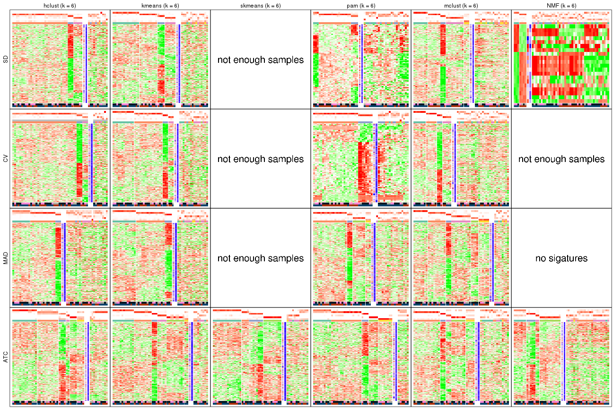</p>

</div>
</div>


### Statistics table

The statistics used for measuring the stability of consensus partitioning.
([How are they
defined?](http://bioconductor.org/packages/devel/bioc/vignettes/cola/inst/doc/cola.html#toc_13))


<script>
$( function() {
	$( '#tabs-get-stats-from-consensus-partition-list' ).tabs();
} );
</script>
<div id='tabs-get-stats-from-consensus-partition-list'>
<ul>
<li><a href='#tab-get-stats-from-consensus-partition-list-1'>k = 2</a></li>
<li><a href='#tab-get-stats-from-consensus-partition-list-2'>k = 3</a></li>
<li><a href='#tab-get-stats-from-consensus-partition-list-3'>k = 4</a></li>
<li><a href='#tab-get-stats-from-consensus-partition-list-4'>k = 5</a></li>
<li><a href='#tab-get-stats-from-consensus-partition-list-5'>k = 6</a></li>
</ul>
<div id='tab-get-stats-from-consensus-partition-list-1'>
<pre><code class="r">get_stats(res_list, k = 2)
</code></pre>

<pre><code>#&gt;             k   1-PAC mean_silhouette concordance area_increased  Rand Jaccard
#&gt; SD:NMF      2 0.12951           0.452       0.772          0.500 0.490   0.490
#&gt; CV:NMF      2 0.22109           0.693       0.844          0.501 0.491   0.491
#&gt; MAD:NMF     2 0.50786           0.852       0.917          0.504 0.491   0.491
#&gt; ATC:NMF     2 0.83534           0.892       0.956          0.414 0.589   0.589
#&gt; SD:skmeans  2 0.00278           0.439       0.727          0.506 0.491   0.491
#&gt; CV:skmeans  2 0.00648           0.455       0.731          0.508 0.493   0.493
#&gt; MAD:skmeans 2 0.02128           0.618       0.781          0.507 0.493   0.493
#&gt; ATC:skmeans 2 1.00000           0.986       0.994          0.484 0.519   0.519
#&gt; SD:mclust   2 0.35245           0.698       0.805          0.350 0.673   0.673
#&gt; CV:mclust   2 0.24977           0.619       0.814          0.328 0.754   0.754
#&gt; MAD:mclust  2 0.27105           0.656       0.733          0.376 0.530   0.530
#&gt; ATC:mclust  2 0.20537           0.314       0.684          0.418 0.497   0.497
#&gt; SD:kmeans   2 0.11193           0.303       0.712          0.429 0.510   0.510
#&gt; CV:kmeans   2 0.11748           0.472       0.726          0.432 0.589   0.589
#&gt; MAD:kmeans  2 0.16744           0.711       0.819          0.468 0.490   0.490
#&gt; ATC:kmeans  2 0.80574           0.950       0.965          0.425 0.542   0.542
#&gt; SD:pam      2 0.13691           0.400       0.744          0.454 0.530   0.530
#&gt; CV:pam      2 0.22849           0.731       0.833          0.413 0.510   0.510
#&gt; MAD:pam     2 0.24884           0.784       0.861          0.411 0.607   0.607
#&gt; ATC:pam     2 1.00000           0.953       0.982          0.446 0.542   0.542
#&gt; SD:hclust   2 0.14709           0.722       0.799          0.302 0.726   0.726
#&gt; CV:hclust   2 0.25162           0.826       0.844          0.189 0.960   0.960
#&gt; MAD:hclust  2 0.17299           0.835       0.871          0.204 0.960   0.960
#&gt; ATC:hclust  2 0.59752           0.806       0.924          0.345 0.673   0.673
</code></pre>

</div>
<div id='tab-get-stats-from-consensus-partition-list-2'>
<pre><code class="r">get_stats(res_list, k = 3)
</code></pre>

<pre><code>#&gt;             k  1-PAC mean_silhouette concordance area_increased  Rand Jaccard
#&gt; SD:NMF      3 0.2128           0.404       0.668          0.321 0.628   0.372
#&gt; CV:NMF      3 0.1933           0.324       0.605          0.309 0.851   0.710
#&gt; MAD:NMF     3 0.3321           0.575       0.763          0.308 0.841   0.685
#&gt; ATC:NMF     3 0.9704           0.889       0.961          0.447 0.678   0.506
#&gt; SD:skmeans  3 0.0379           0.318       0.561          0.332 0.689   0.445
#&gt; CV:skmeans  3 0.0287           0.350       0.595          0.329 0.758   0.543
#&gt; MAD:skmeans 3 0.0472           0.369       0.601          0.327 0.776   0.572
#&gt; ATC:skmeans 3 0.6327           0.679       0.803          0.254 0.936   0.878
#&gt; SD:mclust   3 0.3774           0.651       0.800          0.779 0.567   0.393
#&gt; CV:mclust   3 0.3219           0.608       0.773          0.880 0.503   0.374
#&gt; MAD:mclust  3 0.3034           0.673       0.782          0.647 0.798   0.619
#&gt; ATC:mclust  3 0.4505           0.586       0.822          0.409 0.689   0.491
#&gt; SD:kmeans   3 0.2396           0.669       0.732          0.439 0.643   0.411
#&gt; CV:kmeans   3 0.2007           0.463       0.691          0.393 0.654   0.465
#&gt; MAD:kmeans  3 0.3377           0.537       0.739          0.355 0.794   0.606
#&gt; ATC:kmeans  3 0.9473           0.924       0.972          0.238 0.886   0.797
#&gt; SD:pam      3 0.2035           0.479       0.740          0.209 0.782   0.616
#&gt; CV:pam      3 0.2220           0.692       0.828          0.160 0.984   0.970
#&gt; MAD:pam     3 0.2655           0.693       0.819          0.199 0.971   0.952
#&gt; ATC:pam     3 0.9704           0.943       0.978          0.198 0.886   0.797
#&gt; SD:hclust   3 0.1008           0.670       0.766          0.310 0.994   0.992
#&gt; CV:hclust   3 0.1147           0.497       0.761          0.847 0.887   0.883
#&gt; MAD:hclust  3 0.1147           0.374       0.720          1.024 0.887   0.883
#&gt; ATC:hclust  3 0.3946           0.611       0.754          0.451 0.758   0.657
</code></pre>

</div>
<div id='tab-get-stats-from-consensus-partition-list-3'>
<pre><code class="r">get_stats(res_list, k = 4)
</code></pre>

<pre><code>#&gt;             k  1-PAC mean_silhouette concordance area_increased  Rand Jaccard
#&gt; SD:NMF      4 0.3340           0.406       0.656         0.1206 0.798   0.473
#&gt; CV:NMF      4 0.2664           0.338       0.618         0.1228 0.751   0.437
#&gt; MAD:NMF     4 0.3432           0.382       0.637         0.1243 0.875   0.670
#&gt; ATC:NMF     4 0.5893           0.583       0.804         0.1712 0.806   0.550
#&gt; SD:skmeans  4 0.1748           0.375       0.580         0.1210 0.863   0.610
#&gt; CV:skmeans  4 0.1332           0.309       0.558         0.1216 0.878   0.649
#&gt; MAD:skmeans 4 0.1573           0.304       0.551         0.1230 0.868   0.636
#&gt; ATC:skmeans 4 0.6947           0.747       0.845         0.1486 0.856   0.696
#&gt; SD:mclust   4 0.6929           0.787       0.883         0.1402 0.816   0.541
#&gt; CV:mclust   4 0.6161           0.718       0.855         0.1302 0.766   0.454
#&gt; MAD:mclust  4 0.6235           0.777       0.867         0.1489 0.904   0.727
#&gt; ATC:mclust  4 0.6374           0.729       0.873         0.1507 0.783   0.532
#&gt; SD:kmeans   4 0.3996           0.705       0.773         0.1168 0.938   0.821
#&gt; CV:kmeans   4 0.3756           0.612       0.756         0.1370 0.821   0.573
#&gt; MAD:kmeans  4 0.5606           0.684       0.810         0.1142 0.899   0.727
#&gt; ATC:kmeans  4 0.5902           0.637       0.649         0.2858 0.928   0.862
#&gt; SD:pam      4 0.2581           0.503       0.757         0.0646 0.961   0.901
#&gt; CV:pam      4 0.2738           0.692       0.852         0.0896 0.985   0.970
#&gt; MAD:pam     4 0.2405           0.535       0.761         0.1377 0.961   0.932
#&gt; ATC:pam     4 0.7715           0.823       0.871         0.1429 0.959   0.913
#&gt; SD:hclust   4 0.0833           0.592       0.723         0.2036 0.876   0.828
#&gt; CV:hclust   4 0.0786           0.684       0.744         0.2093 0.729   0.684
#&gt; MAD:hclust  4 0.0971           0.255       0.611         0.2605 0.700   0.651
#&gt; ATC:hclust  4 0.4982           0.692       0.812         0.2618 0.626   0.401
</code></pre>

</div>
<div id='tab-get-stats-from-consensus-partition-list-4'>
<pre><code class="r">get_stats(res_list, k = 5)
</code></pre>

<pre><code>#&gt;             k  1-PAC mean_silhouette concordance area_increased  Rand Jaccard
#&gt; SD:NMF      5 0.3904           0.311       0.591         0.0617 0.930   0.745
#&gt; CV:NMF      5 0.3950           0.282       0.577         0.0693 0.904   0.673
#&gt; MAD:NMF     5 0.4255           0.305       0.580         0.0635 0.918   0.721
#&gt; ATC:NMF     5 0.5569           0.497       0.737         0.0779 0.822   0.500
#&gt; SD:skmeans  5 0.3154           0.240       0.519         0.0659 0.932   0.752
#&gt; CV:skmeans  5 0.2729           0.213       0.489         0.0665 0.958   0.836
#&gt; MAD:skmeans 5 0.2951           0.244       0.478         0.0667 0.910   0.676
#&gt; ATC:skmeans 5 0.6772           0.758       0.851         0.0818 0.890   0.681
#&gt; SD:mclust   5 0.5976           0.591       0.790         0.0675 0.928   0.772
#&gt; CV:mclust   5 0.5689           0.638       0.763         0.0764 0.972   0.908
#&gt; MAD:mclust  5 0.5930           0.572       0.749         0.0814 0.951   0.827
#&gt; ATC:mclust  5 0.6809           0.680       0.850         0.1117 0.899   0.684
#&gt; SD:kmeans   5 0.5809           0.638       0.786         0.0747 0.992   0.972
#&gt; CV:kmeans   5 0.4783           0.559       0.755         0.0677 0.944   0.827
#&gt; MAD:kmeans  5 0.5449           0.610       0.782         0.0613 0.953   0.848
#&gt; ATC:kmeans  5 0.5902           0.640       0.734         0.1075 0.692   0.408
#&gt; SD:pam      5 0.2624           0.491       0.755         0.0487 0.963   0.901
#&gt; CV:pam      5 0.2562           0.663       0.830         0.0445 1.000   1.000
#&gt; MAD:pam     5 0.2377           0.548       0.759         0.0538 0.962   0.929
#&gt; ATC:pam     5 0.6122           0.424       0.752         0.1899 0.797   0.544
#&gt; SD:hclust   5 0.0925           0.606       0.717         0.1494 0.995   0.992
#&gt; CV:hclust   5 0.0666           0.639       0.735         0.2240 0.995   0.992
#&gt; MAD:hclust  5 0.1693           0.329       0.613         0.1388 0.736   0.562
#&gt; ATC:hclust  5 0.5291           0.604       0.783         0.1398 0.873   0.677
</code></pre>

</div>
<div id='tab-get-stats-from-consensus-partition-list-5'>
<pre><code class="r">get_stats(res_list, k = 6)
</code></pre>

<pre><code>#&gt;             k 1-PAC mean_silhouette concordance area_increased  Rand Jaccard
#&gt; SD:NMF      6 0.458           0.300       0.513         0.0412 0.905   0.643
#&gt; CV:NMF      6 0.434           0.223       0.543         0.0363 0.951   0.814
#&gt; MAD:NMF     6 0.465           0.255       0.533         0.0429 0.930   0.722
#&gt; ATC:NMF     6 0.555           0.540       0.690         0.0515 0.880   0.581
#&gt; SD:skmeans  6 0.435           0.237       0.482         0.0420 0.899   0.609
#&gt; CV:skmeans  6 0.399           0.203       0.482         0.0420 0.856   0.464
#&gt; MAD:skmeans 6 0.389           0.161       0.425         0.0422 0.916   0.619
#&gt; ATC:skmeans 6 0.714           0.668       0.811         0.0480 0.996   0.983
#&gt; SD:mclust   6 0.647           0.536       0.744         0.0697 0.869   0.536
#&gt; CV:mclust   6 0.611           0.431       0.694         0.0603 0.947   0.818
#&gt; MAD:mclust  6 0.639           0.628       0.768         0.0599 0.913   0.649
#&gt; ATC:mclust  6 0.657           0.503       0.717         0.0428 0.900   0.639
#&gt; SD:kmeans   6 0.621           0.554       0.764         0.0432 0.977   0.918
#&gt; CV:kmeans   6 0.557           0.536       0.753         0.0498 0.950   0.833
#&gt; MAD:kmeans  6 0.611           0.532       0.721         0.0458 0.968   0.885
#&gt; ATC:kmeans  6 0.660           0.610       0.765         0.0677 0.891   0.593
#&gt; SD:pam      6 0.211           0.489       0.740         0.0367 0.971   0.919
#&gt; CV:pam      6 0.325           0.545       0.812         0.0381 0.973   0.944
#&gt; MAD:pam     6 0.308           0.439       0.754         0.0499 0.924   0.850
#&gt; ATC:pam     6 0.652           0.688       0.816         0.0584 0.805   0.442
#&gt; SD:hclust   6 0.228           0.525       0.692         0.0799 0.962   0.937
#&gt; CV:hclust   6 0.146           0.612       0.695         0.0962 0.995   0.992
#&gt; MAD:hclust  6 0.217           0.426       0.640         0.0908 0.880   0.696
#&gt; ATC:hclust  6 0.582           0.654       0.784         0.0447 0.962   0.870
</code></pre>

</div>
</div>

Following heatmap plots the partition for each combination of methods and the
lightness correspond to the silhouette scores for samples in each method. On
top the consensus subgroup is inferred from all methods by taking the mean
silhouette scores as weight.


<script>
$( function() {
	$( '#tabs-collect-stats-from-consensus-partition-list' ).tabs();
} );
</script>
<div id='tabs-collect-stats-from-consensus-partition-list'>
<ul>
<li><a href='#tab-collect-stats-from-consensus-partition-list-1'>k = 2</a></li>
<li><a href='#tab-collect-stats-from-consensus-partition-list-2'>k = 3</a></li>
<li><a href='#tab-collect-stats-from-consensus-partition-list-3'>k = 4</a></li>
<li><a href='#tab-collect-stats-from-consensus-partition-list-4'>k = 5</a></li>
<li><a href='#tab-collect-stats-from-consensus-partition-list-5'>k = 6</a></li>
</ul>
<div id='tab-collect-stats-from-consensus-partition-list-1'>
<pre><code class="r">collect_stats(res_list, k = 2)
</code></pre>

<p></p>

</div>
<div id='tab-collect-stats-from-consensus-partition-list-2'>
<pre><code class="r">collect_stats(res_list, k = 3)
</code></pre>

<p></p>

</div>
<div id='tab-collect-stats-from-consensus-partition-list-3'>
<pre><code class="r">collect_stats(res_list, k = 4)
</code></pre>

<p>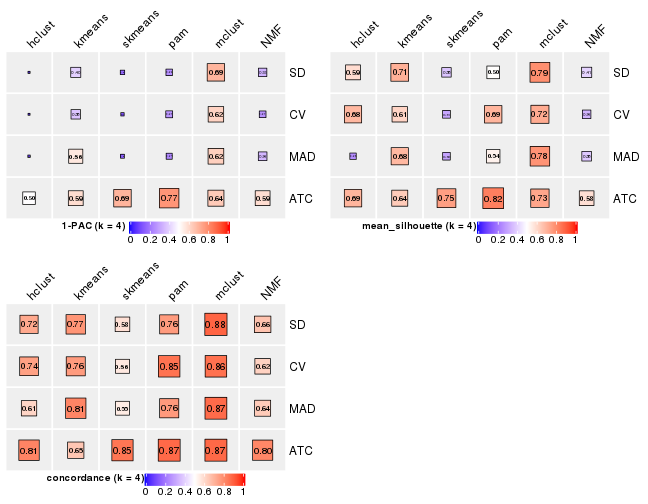</p>

</div>
<div id='tab-collect-stats-from-consensus-partition-list-4'>
<pre><code class="r">collect_stats(res_list, k = 5)
</code></pre>

<p></p>

</div>
<div id='tab-collect-stats-from-consensus-partition-list-5'>
<pre><code class="r">collect_stats(res_list, k = 6)
</code></pre>

<p></p>

</div>
</div>

### Partition from all methods


Collect partitions from all methods:


<script>
$( function() {
	$( '#tabs-collect-classes-from-consensus-partition-list' ).tabs();
} );
</script>
<div id='tabs-collect-classes-from-consensus-partition-list'>
<ul>
<li><a href='#tab-collect-classes-from-consensus-partition-list-1'>k = 2</a></li>
<li><a href='#tab-collect-classes-from-consensus-partition-list-2'>k = 3</a></li>
<li><a href='#tab-collect-classes-from-consensus-partition-list-3'>k = 4</a></li>
<li><a href='#tab-collect-classes-from-consensus-partition-list-4'>k = 5</a></li>
<li><a href='#tab-collect-classes-from-consensus-partition-list-5'>k = 6</a></li>
</ul>
<div id='tab-collect-classes-from-consensus-partition-list-1'>
<pre><code class="r">collect_classes(res_list, k = 2)
</code></pre>

<p></p>

</div>
<div id='tab-collect-classes-from-consensus-partition-list-2'>
<pre><code class="r">collect_classes(res_list, k = 3)
</code></pre>

<p></p>

</div>
<div id='tab-collect-classes-from-consensus-partition-list-3'>
<pre><code class="r">collect_classes(res_list, k = 4)
</code></pre>

<p></p>

</div>
<div id='tab-collect-classes-from-consensus-partition-list-4'>
<pre><code class="r">collect_classes(res_list, k = 5)
</code></pre>

<p></p>

</div>
<div id='tab-collect-classes-from-consensus-partition-list-5'>
<pre><code class="r">collect_classes(res_list, k = 6)
</code></pre>

<p></p>

</div>
</div>


### Top rows overlap


Overlap of top rows from different top-row methods:


<script>
$( function() {
	$( '#tabs-top-rows-overlap-by-euler' ).tabs();
} );
</script>
<div id='tabs-top-rows-overlap-by-euler'>
<ul>
<li><a href='#tab-top-rows-overlap-by-euler-1'>top_n = 1000</a></li>
<li><a href='#tab-top-rows-overlap-by-euler-2'>top_n = 2000</a></li>
<li><a href='#tab-top-rows-overlap-by-euler-3'>top_n = 3000</a></li>
<li><a href='#tab-top-rows-overlap-by-euler-4'>top_n = 4000</a></li>
<li><a href='#tab-top-rows-overlap-by-euler-5'>top_n = 5000</a></li>
</ul>
<div id='tab-top-rows-overlap-by-euler-1'>
<pre><code class="r">top_rows_overlap(res_list, top_n = 1000, method = &quot;euler&quot;)
</code></pre>

<p></p>

</div>
<div id='tab-top-rows-overlap-by-euler-2'>
<pre><code class="r">top_rows_overlap(res_list, top_n = 2000, method = &quot;euler&quot;)
</code></pre>

<p></p>

</div>
<div id='tab-top-rows-overlap-by-euler-3'>
<pre><code class="r">top_rows_overlap(res_list, top_n = 3000, method = &quot;euler&quot;)
</code></pre>

<p></p>

</div>
<div id='tab-top-rows-overlap-by-euler-4'>
<pre><code class="r">top_rows_overlap(res_list, top_n = 4000, method = &quot;euler&quot;)
</code></pre>

<p></p>

</div>
<div id='tab-top-rows-overlap-by-euler-5'>
<pre><code class="r">top_rows_overlap(res_list, top_n = 5000, method = &quot;euler&quot;)
</code></pre>

<p></p>

</div>
</div>

Also visualize the correspondance of rankings between different top-row methods:


<script>
$( function() {
	$( '#tabs-top-rows-overlap-by-correspondance' ).tabs();
} );
</script>
<div id='tabs-top-rows-overlap-by-correspondance'>
<ul>
<li><a href='#tab-top-rows-overlap-by-correspondance-1'>top_n = 1000</a></li>
<li><a href='#tab-top-rows-overlap-by-correspondance-2'>top_n = 2000</a></li>
<li><a href='#tab-top-rows-overlap-by-correspondance-3'>top_n = 3000</a></li>
<li><a href='#tab-top-rows-overlap-by-correspondance-4'>top_n = 4000</a></li>
<li><a href='#tab-top-rows-overlap-by-correspondance-5'>top_n = 5000</a></li>
</ul>
<div id='tab-top-rows-overlap-by-correspondance-1'>
<pre><code class="r">top_rows_overlap(res_list, top_n = 1000, method = &quot;correspondance&quot;)
</code></pre>

<p></p>

</div>
<div id='tab-top-rows-overlap-by-correspondance-2'>
<pre><code class="r">top_rows_overlap(res_list, top_n = 2000, method = &quot;correspondance&quot;)
</code></pre>

<p></p>

</div>
<div id='tab-top-rows-overlap-by-correspondance-3'>
<pre><code class="r">top_rows_overlap(res_list, top_n = 3000, method = &quot;correspondance&quot;)
</code></pre>

<p></p>

</div>
<div id='tab-top-rows-overlap-by-correspondance-4'>
<pre><code class="r">top_rows_overlap(res_list, top_n = 4000, method = &quot;correspondance&quot;)
</code></pre>

<p></p>

</div>
<div id='tab-top-rows-overlap-by-correspondance-5'>
<pre><code class="r">top_rows_overlap(res_list, top_n = 5000, method = &quot;correspondance&quot;)
</code></pre>

<p></p>

</div>
</div>


Heatmaps of the top rows:


<script>
$( function() {
	$( '#tabs-top-rows-heatmap' ).tabs();
} );
</script>
<div id='tabs-top-rows-heatmap'>
<ul>
<li><a href='#tab-top-rows-heatmap-1'>top_n = 1000</a></li>
<li><a href='#tab-top-rows-heatmap-2'>top_n = 2000</a></li>
<li><a href='#tab-top-rows-heatmap-3'>top_n = 3000</a></li>
<li><a href='#tab-top-rows-heatmap-4'>top_n = 4000</a></li>
<li><a href='#tab-top-rows-heatmap-5'>top_n = 5000</a></li>
</ul>
<div id='tab-top-rows-heatmap-1'>
<pre><code class="r">top_rows_heatmap(res_list, top_n = 1000)
</code></pre>

<p></p>

</div>
<div id='tab-top-rows-heatmap-2'>
<pre><code class="r">top_rows_heatmap(res_list, top_n = 2000)
</code></pre>

<p></p>

</div>
<div id='tab-top-rows-heatmap-3'>
<pre><code class="r">top_rows_heatmap(res_list, top_n = 3000)
</code></pre>

<p></p>

</div>
<div id='tab-top-rows-heatmap-4'>
<pre><code class="r">top_rows_heatmap(res_list, top_n = 4000)
</code></pre>

<p></p>

</div>
<div id='tab-top-rows-heatmap-5'>
<pre><code class="r">top_rows_heatmap(res_list, top_n = 5000)
</code></pre>

<p></p>

</div>
</div>


### Test to known annotations


Test correlation between subgroups and known annotations. If the known
annotation is numeric, one-way ANOVA test is applied, and if the known
annotation is discrete, chi-squared contingency table test is applied.


<script>
$( function() {
	$( '#tabs-test-to-known-factors-from-consensus-partition-list' ).tabs();
} );
</script>
<div id='tabs-test-to-known-factors-from-consensus-partition-list'>
<ul>
<li><a href='#tab-test-to-known-factors-from-consensus-partition-list-1'>k = 2</a></li>
<li><a href='#tab-test-to-known-factors-from-consensus-partition-list-2'>k = 3</a></li>
<li><a href='#tab-test-to-known-factors-from-consensus-partition-list-3'>k = 4</a></li>
<li><a href='#tab-test-to-known-factors-from-consensus-partition-list-4'>k = 5</a></li>
<li><a href='#tab-test-to-known-factors-from-consensus-partition-list-5'>k = 6</a></li>
</ul>
<div id='tab-test-to-known-factors-from-consensus-partition-list-1'>
<pre><code class="r">test_to_known_factors(res_list, k = 2)
</code></pre>

<pre><code>#&gt;              n disease.state(p) gender(p) k
#&gt; SD:NMF      28           0.7686  0.001823 2
#&gt; CV:NMF      44           0.4075  0.002582 2
#&gt; MAD:NMF     49           0.5752  0.035104 2
#&gt; ATC:NMF     47           0.7769  0.390751 2
#&gt; SD:skmeans  28           0.6917  0.001823 2
#&gt; CV:skmeans  27           0.8299  0.002922 2
#&gt; MAD:skmeans 39           0.7223  0.079282 2
#&gt; ATC:skmeans 50           0.8439  0.093211 2
#&gt; SD:mclust   46           0.6998  0.051828 2
#&gt; CV:mclust   39           0.7416  0.110784 2
#&gt; MAD:mclust  48           0.7179  0.354539 2
#&gt; ATC:mclust  21           0.0569  0.612346 2
#&gt; SD:kmeans   20           0.3299  0.103777 2
#&gt; CV:kmeans   27           0.4379  0.836401 2
#&gt; MAD:kmeans  45           0.7383  0.111135 2
#&gt; ATC:kmeans  50           0.8367  0.233722 2
#&gt; SD:pam      25           0.3290  0.004916 2
#&gt; CV:pam      42           0.2896  0.000162 2
#&gt; MAD:pam     48           0.4605  0.090969 2
#&gt; ATC:pam     48           0.6299  0.390154 2
#&gt; SD:hclust   49           0.9052  0.955511 2
#&gt; CV:hclust   49               NA        NA 2
#&gt; MAD:hclust  49               NA        NA 2
#&gt; ATC:hclust  45           0.6367  1.000000 2
</code></pre>

</div>
<div id='tab-test-to-known-factors-from-consensus-partition-list-2'>
<pre><code class="r">test_to_known_factors(res_list, k = 3)
</code></pre>

<pre><code>#&gt;              n disease.state(p) gender(p) k
#&gt; SD:NMF      21            0.458  6.22e-04 3
#&gt; CV:NMF      11               NA        NA 3
#&gt; MAD:NMF     36            0.822  8.91e-03 3
#&gt; ATC:NMF     46            0.842  6.17e-01 3
#&gt; SD:skmeans  13               NA        NA 3
#&gt; CV:skmeans  14            0.823  1.58e-03 3
#&gt; MAD:skmeans 16            0.497  6.19e-02 3
#&gt; ATC:skmeans 44            0.729  4.82e-01 3
#&gt; SD:mclust   42            0.825  1.12e-02 3
#&gt; CV:mclust   40            0.738  3.22e-02 3
#&gt; MAD:mclust  43            0.898  8.51e-02 3
#&gt; ATC:mclust  39            0.224  9.09e-01 3
#&gt; SD:kmeans   44            0.856  7.47e-02 3
#&gt; CV:kmeans   32            0.892  2.25e-03 3
#&gt; MAD:kmeans  31            0.547  3.05e-02 3
#&gt; ATC:kmeans  49            0.838  1.11e-01 3
#&gt; SD:pam      36            0.740  1.47e-05 3
#&gt; CV:pam      42            0.290  1.62e-04 3
#&gt; MAD:pam     44            0.604  7.18e-02 3
#&gt; ATC:pam     50            0.786  2.70e-01 3
#&gt; SD:hclust   47            0.648  4.71e-01 3
#&gt; CV:hclust   40            0.498  1.00e+00 3
#&gt; MAD:hclust  26            0.113  1.00e+00 3
#&gt; ATC:hclust  41            0.296  6.05e-01 3
</code></pre>

</div>
<div id='tab-test-to-known-factors-from-consensus-partition-list-3'>
<pre><code class="r">test_to_known_factors(res_list, k = 4)
</code></pre>

<pre><code>#&gt;              n disease.state(p) gender(p) k
#&gt; SD:NMF      17            0.878  2.03e-04 4
#&gt; CV:NMF      13            0.692  2.31e-03 4
#&gt; MAD:NMF     18            0.955  5.02e-04 4
#&gt; ATC:NMF     35            0.108  8.63e-02 4
#&gt; SD:skmeans  13            0.164  9.84e-02 4
#&gt; CV:skmeans   6               NA        NA 4
#&gt; MAD:skmeans  3               NA        NA 4
#&gt; ATC:skmeans 44            0.605  2.78e-01 4
#&gt; SD:mclust   45            0.958  5.87e-02 4
#&gt; CV:mclust   43            0.840  5.92e-02 4
#&gt; MAD:mclust  47            0.635  2.02e-01 4
#&gt; ATC:mclust  42            0.232  4.53e-01 4
#&gt; SD:kmeans   48            0.845  1.03e-01 4
#&gt; CV:kmeans   38            0.795  5.22e-02 4
#&gt; MAD:kmeans  42            0.710  6.87e-02 4
#&gt; ATC:kmeans  45            0.721  2.85e-01 4
#&gt; SD:pam      35            0.484  8.92e-05 4
#&gt; CV:pam      42            0.290  1.62e-04 4
#&gt; MAD:pam     34            0.339  7.48e-02 4
#&gt; ATC:pam     49            0.291  4.71e-01 4
#&gt; SD:hclust   43            0.702  3.93e-01 4
#&gt; CV:hclust   48            0.688  4.13e-01 4
#&gt; MAD:hclust   9            0.687  8.13e-01 4
#&gt; ATC:hclust  43            0.433  7.70e-01 4
</code></pre>

</div>
<div id='tab-test-to-known-factors-from-consensus-partition-list-4'>
<pre><code class="r">test_to_known_factors(res_list, k = 5)
</code></pre>

<pre><code>#&gt;              n disease.state(p) gender(p) k
#&gt; SD:NMF      10            0.435  1.23e-02 5
#&gt; CV:NMF       7               NA        NA 5
#&gt; MAD:NMF     11            0.529  1.73e-02 5
#&gt; ATC:NMF     24            0.602  8.79e-02 5
#&gt; SD:skmeans   1               NA        NA 5
#&gt; CV:skmeans   0               NA        NA 5
#&gt; MAD:skmeans  0               NA        NA 5
#&gt; ATC:skmeans 44            0.972  2.60e-01 5
#&gt; SD:mclust   37            0.980  6.23e-02 5
#&gt; CV:mclust   41            0.627  5.60e-02 5
#&gt; MAD:mclust  37            0.847  8.77e-02 5
#&gt; ATC:mclust  41            0.439  7.71e-01 5
#&gt; SD:kmeans   42            0.923  1.09e-02 5
#&gt; CV:kmeans   36            0.904  2.10e-02 5
#&gt; MAD:kmeans  35            0.514  3.81e-02 5
#&gt; ATC:kmeans  42            0.783  4.95e-01 5
#&gt; SD:pam      25            0.556  2.06e-03 5
#&gt; CV:pam      40            0.199  8.88e-05 5
#&gt; MAD:pam     30            0.673  1.00e+00 5
#&gt; ATC:pam     18            0.197  5.77e-01 5
#&gt; SD:hclust   42            0.859  2.01e-01 5
#&gt; CV:hclust   46            0.763  2.07e-01 5
#&gt; MAD:hclust  24            0.946  1.95e-02 5
#&gt; ATC:hclust  37            0.652  6.93e-01 5
</code></pre>

</div>
<div id='tab-test-to-known-factors-from-consensus-partition-list-5'>
<pre><code class="r">test_to_known_factors(res_list, k = 6)
</code></pre>

<pre><code>#&gt;              n disease.state(p) gender(p) k
#&gt; SD:NMF       7            0.327  0.060920 6
#&gt; CV:NMF       6               NA        NA 6
#&gt; MAD:NMF      5            0.659  0.192106 6
#&gt; ATC:NMF     26            0.849  0.304584 6
#&gt; SD:skmeans   0               NA        NA 6
#&gt; CV:skmeans   0               NA        NA 6
#&gt; MAD:skmeans  0               NA        NA 6
#&gt; ATC:skmeans 38            0.928  0.571445 6
#&gt; SD:mclust   31            0.979  0.001237 6
#&gt; CV:mclust   21            0.861  0.022795 6
#&gt; MAD:mclust  42            0.806  0.039046 6
#&gt; ATC:mclust  34            0.426  0.838381 6
#&gt; SD:kmeans   35            0.850  0.021828 6
#&gt; CV:kmeans   34            0.802  0.042807 6
#&gt; MAD:kmeans  33            0.480  0.036420 6
#&gt; ATC:kmeans  42            0.860  0.180411 6
#&gt; SD:pam      25            0.527  0.009758 6
#&gt; CV:pam      33            0.707  0.000739 6
#&gt; MAD:pam     32            0.657  0.024470 6
#&gt; ATC:pam     44            0.275  0.160146 6
#&gt; SD:hclust   39            0.922  0.301256 6
#&gt; CV:hclust   42            0.869  0.691826 6
#&gt; MAD:hclust  28            0.976  0.070091 6
#&gt; ATC:hclust  40            0.273  0.577870 6
</code></pre>

</div>
</div>


 
## Results for each method


---------------------------------------------------


### SD:hclust


The object with results only for a single top-value method and a single partition method 
can be extracted as:

```r
res = res_list["SD", "hclust"]
# you can also extract it by
# res = res_list["SD:hclust"]
```

A summary of `res` and all the functions that can be applied to it:

```r
res
```

```
#> A 'ConsensusPartition' object with k = 2, 3, 4, 5, 6.
#>   On a matrix with 51941 rows and 50 columns.
#>   Top rows (1000, 2000, 3000, 4000, 5000) are extracted by 'SD' method.
#>   Subgroups are detected by 'hclust' method.
#>   Performed in total 1250 partitions by row resampling.
#>   Best k for subgroups seems to be 2.
#> 
#> Following methods can be applied to this 'ConsensusPartition' object:
#>  [1] "cola_report"             "collect_classes"         "collect_plots"          
#>  [4] "collect_stats"           "colnames"                "compare_signatures"     
#>  [7] "consensus_heatmap"       "dimension_reduction"     "functional_enrichment"  
#> [10] "get_anno_col"            "get_anno"                "get_classes"            
#> [13] "get_consensus"           "get_matrix"              "get_membership"         
#> [16] "get_param"               "get_signatures"          "get_stats"              
#> [19] "is_best_k"               "is_stable_k"             "membership_heatmap"     
#> [22] "ncol"                    "nrow"                    "plot_ecdf"              
#> [25] "rownames"                "select_partition_number" "show"                   
#> [28] "suggest_best_k"          "test_to_known_factors"
```

`collect_plots()` function collects all the plots made from `res` for all `k` (number of partitions)
into one single page to provide an easy and fast comparison between different `k`.

```r
collect_plots(res)
```


The plots are:

- The first row: a plot of the ECDF (empirical cumulative distribution
  function) curves of the consensus matrix for each `k` and the heatmap of
  predicted classes for each `k`.
- The second row: heatmaps of the consensus matrix for each `k`.
- The third row: heatmaps of the membership matrix for each `k`.
- The fouth row: heatmaps of the signatures for each `k`.

All the plots in panels can be made by individual functions and they are
plotted later in this section.

`select_partition_number()` produces several plots showing different
statistics for choosing "optimized" `k`. There are following statistics:

- ECDF curves of the consensus matrix for each `k`;
- 1-PAC. [The PAC
  score](https://en.wikipedia.org/wiki/Consensus_clustering#Over-interpretation_potential_of_consensus_clustering)
  measures the proportion of the ambiguous subgrouping.
- Mean silhouette score.
- Concordance. The mean probability of fiting the consensus class ids in all
  partitions.
- Area increased. Denote $A_k$ as the area under the ECDF curve for current
  `k`, the area increased is defined as $A_k - A_{k-1}$.
- Rand index. The percent of pairs of samples that are both in a same cluster
  or both are not in a same cluster in the partition of k and k-1.
- Jaccard index. The ratio of pairs of samples are both in a same cluster in
  the partition of k and k-1 and the pairs of samples are both in a same
  cluster in the partition k or k-1.

The detailed explanations of these statistics can be found in [the _cola_
vignette](http://bioconductor.org/packages/devel/bioc/vignettes/cola/inst/doc/cola.html#toc_13).

Generally speaking, lower PAC score, higher mean silhouette score or higher
concordance corresponds to better partition. Rand index and Jaccard index
measure how similar the current partition is compared to partition with `k-1`.
If they are too similar, we won't accept `k` is better than `k-1`.

```r
select_partition_number(res)
```


The numeric values for all these statistics can be obtained by `get_stats()`.

```r
get_stats(res)
```

```
#>   k  1-PAC mean_silhouette concordance area_increased  Rand Jaccard
#> 2 2 0.1471           0.722       0.799         0.3025 0.726   0.726
#> 3 3 0.1008           0.670       0.766         0.3095 0.994   0.992
#> 4 4 0.0833           0.592       0.723         0.2036 0.876   0.828
#> 5 5 0.0925           0.606       0.717         0.1494 0.995   0.992
#> 6 6 0.2279           0.525       0.692         0.0799 0.962   0.937
```

`suggest_best_k()` suggests the best $k$ based on these statistics. The rules are as follows:

- All $k$ with Jaccard index larger than 0.95 are removed because increasing
  $k$ does not provide enough extra information. If all $k$ are removed, it is
  marked as no subgroup is detected.
- For all $k$ with 1-PAC score larger than 0.9, the maximal $k$ is taken as
  the best $k$, and other $k$ are marked as optional $k$.
- If it does not fit the second rule. The $k$ with the maximal vote of the
  highest 1-PAC score, highest mean silhouette, and highest concordance is
  taken as the best $k$.

```r
suggest_best_k(res)
```

```
#> [1] 2
```


Following shows the table of the partitions (You need to click the **show/hide
code output** link to see it). The membership matrix (columns with name `p*`)
is inferred by
[`clue::cl_consensus()`](https://www.rdocumentation.org/link/cl_consensus?package=clue)
function with the `SE` method. Basically the value in the membership matrix
represents the probability to belong to a certain group. The finall class
label for an item is determined with the group with highest probability it
belongs to.

In `get_classes()` function, the entropy is calculated from the membership
matrix and the silhouette score is calculated from the consensus matrix.


<script>
$( function() {
	$( '#tabs-SD-hclust-get-classes' ).tabs();
} );
</script>
<div id='tabs-SD-hclust-get-classes'>
<ul>
<li><a href='#tab-SD-hclust-get-classes-1'>k = 2</a></li>
<li><a href='#tab-SD-hclust-get-classes-2'>k = 3</a></li>
<li><a href='#tab-SD-hclust-get-classes-3'>k = 4</a></li>
<li><a href='#tab-SD-hclust-get-classes-4'>k = 5</a></li>
<li><a href='#tab-SD-hclust-get-classes-5'>k = 6</a></li>
</ul>

<div id='tab-SD-hclust-get-classes-1'>
<p><a id='tab-SD-hclust-get-classes-1-a' style='color:#0366d6' href='#'>show/hide code output</a></p>
<pre><code class="r">cbind(get_classes(res, k = 2), get_membership(res, k = 2))
</code></pre>

<pre><code>#&gt;           class entropy silhouette    p1    p2
#&gt; GSM624962     2   0.795      0.639 0.240 0.760
#&gt; GSM624963     2   0.738      0.632 0.208 0.792
#&gt; GSM624967     1   0.990      0.855 0.560 0.440
#&gt; GSM624968     1   0.991      0.858 0.556 0.444
#&gt; GSM624969     2   0.494      0.758 0.108 0.892
#&gt; GSM624970     2   0.653      0.717 0.168 0.832
#&gt; GSM624961     2   0.574      0.720 0.136 0.864
#&gt; GSM624964     2   0.714      0.648 0.196 0.804
#&gt; GSM624965     2   0.671      0.679 0.176 0.824
#&gt; GSM624966     2   0.541      0.738 0.124 0.876
#&gt; GSM624925     2   0.506      0.754 0.112 0.888
#&gt; GSM624927     2   0.518      0.752 0.116 0.884
#&gt; GSM624929     2   0.430      0.772 0.088 0.912
#&gt; GSM624930     2   0.574      0.738 0.136 0.864
#&gt; GSM624931     2   0.482      0.756 0.104 0.896
#&gt; GSM624935     2   0.625      0.687 0.156 0.844
#&gt; GSM624936     2   0.469      0.770 0.100 0.900
#&gt; GSM624937     1   0.781      0.628 0.768 0.232
#&gt; GSM624926     1   0.993      0.853 0.548 0.452
#&gt; GSM624928     2   0.552      0.729 0.128 0.872
#&gt; GSM624932     2   0.738      0.704 0.208 0.792
#&gt; GSM624933     2   0.697      0.663 0.188 0.812
#&gt; GSM624934     2   0.469      0.770 0.100 0.900
#&gt; GSM624971     2   0.722      0.652 0.200 0.800
#&gt; GSM624973     2   0.615      0.747 0.152 0.848
#&gt; GSM624938     2   0.730      0.647 0.204 0.796
#&gt; GSM624940     2   0.827      0.581 0.260 0.740
#&gt; GSM624941     2   0.506      0.749 0.112 0.888
#&gt; GSM624942     2   0.482      0.757 0.104 0.896
#&gt; GSM624943     2   0.469      0.762 0.100 0.900
#&gt; GSM624945     2   0.443      0.763 0.092 0.908
#&gt; GSM624946     2   0.730      0.647 0.204 0.796
#&gt; GSM624949     2   0.706      0.644 0.192 0.808
#&gt; GSM624951     2   0.605      0.730 0.148 0.852
#&gt; GSM624952     2   0.482      0.757 0.104 0.896
#&gt; GSM624955     1   0.929      0.748 0.656 0.344
#&gt; GSM624956     2   0.494      0.757 0.108 0.892
#&gt; GSM624957     2   0.644      0.740 0.164 0.836
#&gt; GSM624974     2   0.563      0.746 0.132 0.868
#&gt; GSM624939     2   0.563      0.748 0.132 0.868
#&gt; GSM624944     1   0.991      0.857 0.556 0.444
#&gt; GSM624947     2   0.871      0.352 0.292 0.708
#&gt; GSM624948     2   0.706      0.656 0.192 0.808
#&gt; GSM624950     1   0.996      0.828 0.536 0.464
#&gt; GSM624953     2   0.552      0.728 0.128 0.872
#&gt; GSM624954     2   0.494      0.767 0.108 0.892
#&gt; GSM624958     2   0.738      0.614 0.208 0.792
#&gt; GSM624959     2   0.605      0.709 0.148 0.852
#&gt; GSM624960     1   0.994      0.853 0.544 0.456
#&gt; GSM624972     2   0.541      0.731 0.124 0.876
</code></pre>

<script>
$('#tab-SD-hclust-get-classes-1-a').parent().next().next().hide();
$('#tab-SD-hclust-get-classes-1-a').click(function(){
  $('#tab-SD-hclust-get-classes-1-a').parent().next().next().toggle();
  return(false);
});
</script>
</div>

<div id='tab-SD-hclust-get-classes-2'>
<p><a id='tab-SD-hclust-get-classes-2-a' style='color:#0366d6' href='#'>show/hide code output</a></p>
<pre><code class="r">cbind(get_classes(res, k = 3), get_membership(res, k = 3))
</code></pre>

<pre><code>#&gt;           class entropy silhouette    p1    p2    p3
#&gt; GSM624962     2   0.758      0.579 0.056 0.604 0.340
#&gt; GSM624963     2   0.734      0.592 0.056 0.644 0.300
#&gt; GSM624967     3   0.808      0.822 0.112 0.260 0.628
#&gt; GSM624968     3   0.638      0.882 0.032 0.256 0.712
#&gt; GSM624969     2   0.298      0.721 0.024 0.920 0.056
#&gt; GSM624970     2   0.474      0.695 0.028 0.836 0.136
#&gt; GSM624961     2   0.528      0.689 0.004 0.752 0.244
#&gt; GSM624964     2   0.613      0.597 0.016 0.700 0.284
#&gt; GSM624965     2   0.614      0.639 0.012 0.684 0.304
#&gt; GSM624966     2   0.529      0.709 0.008 0.764 0.228
#&gt; GSM624925     2   0.536      0.722 0.032 0.800 0.168
#&gt; GSM624927     2   0.264      0.725 0.020 0.932 0.048
#&gt; GSM624929     2   0.489      0.742 0.040 0.836 0.124
#&gt; GSM624930     2   0.328      0.715 0.024 0.908 0.068
#&gt; GSM624931     2   0.298      0.719 0.024 0.920 0.056
#&gt; GSM624935     2   0.656      0.641 0.048 0.720 0.232
#&gt; GSM624936     2   0.400      0.741 0.016 0.868 0.116
#&gt; GSM624937     1   0.341      0.000 0.900 0.020 0.080
#&gt; GSM624926     3   0.660      0.879 0.036 0.268 0.696
#&gt; GSM624928     2   0.569      0.700 0.020 0.756 0.224
#&gt; GSM624932     2   0.546      0.675 0.020 0.776 0.204
#&gt; GSM624933     2   0.618      0.607 0.008 0.660 0.332
#&gt; GSM624934     2   0.304      0.738 0.008 0.908 0.084
#&gt; GSM624971     2   0.712      0.530 0.040 0.636 0.324
#&gt; GSM624973     2   0.598      0.697 0.020 0.728 0.252
#&gt; GSM624938     2   0.711      0.531 0.044 0.648 0.308
#&gt; GSM624940     2   0.645      0.502 0.036 0.712 0.252
#&gt; GSM624941     2   0.288      0.717 0.024 0.924 0.052
#&gt; GSM624942     2   0.277      0.724 0.024 0.928 0.048
#&gt; GSM624943     2   0.301      0.731 0.028 0.920 0.052
#&gt; GSM624945     2   0.524      0.730 0.032 0.808 0.160
#&gt; GSM624946     2   0.711      0.531 0.044 0.648 0.308
#&gt; GSM624949     2   0.703      0.605 0.052 0.676 0.272
#&gt; GSM624951     2   0.375      0.699 0.020 0.884 0.096
#&gt; GSM624952     2   0.530      0.724 0.036 0.808 0.156
#&gt; GSM624955     3   0.685      0.487 0.136 0.124 0.740
#&gt; GSM624956     2   0.547      0.723 0.036 0.796 0.168
#&gt; GSM624957     2   0.400      0.719 0.016 0.868 0.116
#&gt; GSM624974     2   0.309      0.718 0.016 0.912 0.072
#&gt; GSM624939     2   0.327      0.719 0.016 0.904 0.080
#&gt; GSM624944     3   0.723      0.872 0.064 0.264 0.672
#&gt; GSM624947     2   0.700      0.268 0.024 0.588 0.388
#&gt; GSM624948     2   0.601      0.610 0.004 0.664 0.332
#&gt; GSM624950     3   0.659      0.858 0.032 0.280 0.688
#&gt; GSM624953     2   0.520      0.695 0.004 0.760 0.236
#&gt; GSM624954     2   0.377      0.731 0.012 0.876 0.112
#&gt; GSM624958     2   0.618      0.578 0.008 0.660 0.332
#&gt; GSM624959     2   0.529      0.673 0.000 0.732 0.268
#&gt; GSM624960     3   0.696      0.880 0.052 0.264 0.684
#&gt; GSM624972     2   0.516      0.698 0.004 0.764 0.232
</code></pre>

<script>
$('#tab-SD-hclust-get-classes-2-a').parent().next().next().hide();
$('#tab-SD-hclust-get-classes-2-a').click(function(){
  $('#tab-SD-hclust-get-classes-2-a').parent().next().next().toggle();
  return(false);
});
</script>
</div>

<div id='tab-SD-hclust-get-classes-3'>
<p><a id='tab-SD-hclust-get-classes-3-a' style='color:#0366d6' href='#'>show/hide code output</a></p>
<pre><code class="r">cbind(get_classes(res, k = 4), get_membership(res, k = 4))
</code></pre>

<pre><code>#&gt;           class entropy silhouette    p1    p2    p3    p4
#&gt; GSM624962     2  0.7722    0.09453 0.012 0.464 0.364 0.160
#&gt; GSM624963     2  0.7518    0.46771 0.008 0.540 0.244 0.208
#&gt; GSM624967     4  0.8286    0.69956 0.068 0.252 0.148 0.532
#&gt; GSM624968     4  0.4542    0.81083 0.000 0.228 0.020 0.752
#&gt; GSM624969     2  0.2019    0.63354 0.004 0.940 0.032 0.024
#&gt; GSM624970     2  0.4954    0.52592 0.004 0.784 0.120 0.092
#&gt; GSM624961     2  0.5998    0.63132 0.000 0.684 0.116 0.200
#&gt; GSM624964     2  0.5168    0.59192 0.000 0.712 0.040 0.248
#&gt; GSM624965     2  0.6705    0.58697 0.000 0.608 0.148 0.244
#&gt; GSM624966     2  0.5972    0.63308 0.000 0.692 0.132 0.176
#&gt; GSM624925     2  0.5470    0.63385 0.000 0.732 0.168 0.100
#&gt; GSM624927     2  0.1575    0.62886 0.004 0.956 0.028 0.012
#&gt; GSM624929     2  0.4735    0.66004 0.000 0.784 0.148 0.068
#&gt; GSM624930     2  0.2441    0.60205 0.004 0.916 0.068 0.012
#&gt; GSM624931     2  0.1771    0.62356 0.004 0.948 0.036 0.012
#&gt; GSM624935     2  0.6255    0.56830 0.004 0.680 0.152 0.164
#&gt; GSM624936     2  0.4318    0.64886 0.000 0.816 0.116 0.068
#&gt; GSM624937     1  0.0844    0.00000 0.980 0.004 0.004 0.012
#&gt; GSM624926     4  0.4420    0.81013 0.000 0.240 0.012 0.748
#&gt; GSM624928     2  0.6025    0.63639 0.000 0.688 0.140 0.172
#&gt; GSM624932     2  0.6165    0.10427 0.004 0.640 0.284 0.072
#&gt; GSM624933     2  0.6814    0.56906 0.000 0.584 0.140 0.276
#&gt; GSM624934     2  0.2549    0.65739 0.004 0.916 0.024 0.056
#&gt; GSM624971     3  0.5943    0.86700 0.000 0.360 0.592 0.048
#&gt; GSM624973     2  0.6567    0.33999 0.000 0.616 0.256 0.128
#&gt; GSM624938     3  0.5400    0.89178 0.000 0.372 0.608 0.020
#&gt; GSM624940     3  0.5451    0.72128 0.004 0.464 0.524 0.008
#&gt; GSM624941     2  0.1610    0.62476 0.000 0.952 0.032 0.016
#&gt; GSM624942     2  0.1724    0.63492 0.000 0.948 0.032 0.020
#&gt; GSM624943     2  0.1888    0.64226 0.000 0.940 0.044 0.016
#&gt; GSM624945     2  0.5304    0.65021 0.000 0.748 0.148 0.104
#&gt; GSM624946     3  0.5400    0.89178 0.000 0.372 0.608 0.020
#&gt; GSM624949     2  0.6863    0.50376 0.004 0.616 0.196 0.184
#&gt; GSM624951     2  0.3102    0.52097 0.004 0.872 0.116 0.008
#&gt; GSM624952     2  0.5292    0.63259 0.000 0.744 0.168 0.088
#&gt; GSM624955     4  0.7018    0.00369 0.032 0.060 0.352 0.556
#&gt; GSM624956     2  0.5436    0.62720 0.000 0.732 0.176 0.092
#&gt; GSM624957     2  0.3805    0.63195 0.004 0.856 0.068 0.072
#&gt; GSM624974     2  0.2441    0.61310 0.004 0.920 0.056 0.020
#&gt; GSM624939     2  0.2652    0.61677 0.004 0.912 0.056 0.028
#&gt; GSM624944     4  0.6203    0.79719 0.020 0.248 0.060 0.672
#&gt; GSM624947     2  0.5613    0.29712 0.000 0.592 0.028 0.380
#&gt; GSM624948     2  0.6773    0.57168 0.000 0.588 0.136 0.276
#&gt; GSM624950     4  0.4955    0.78462 0.000 0.268 0.024 0.708
#&gt; GSM624953     2  0.6001    0.63355 0.000 0.688 0.128 0.184
#&gt; GSM624954     2  0.3077    0.65412 0.004 0.892 0.036 0.068
#&gt; GSM624958     2  0.6516    0.54328 0.000 0.592 0.100 0.308
#&gt; GSM624959     2  0.6147    0.62392 0.000 0.664 0.112 0.224
#&gt; GSM624960     4  0.5698    0.80759 0.004 0.244 0.060 0.692
#&gt; GSM624972     2  0.5962    0.63436 0.000 0.692 0.128 0.180
</code></pre>

<script>
$('#tab-SD-hclust-get-classes-3-a').parent().next().next().hide();
$('#tab-SD-hclust-get-classes-3-a').click(function(){
  $('#tab-SD-hclust-get-classes-3-a').parent().next().next().toggle();
  return(false);
});
</script>
</div>

<div id='tab-SD-hclust-get-classes-4'>
<p><a id='tab-SD-hclust-get-classes-4-a' style='color:#0366d6' href='#'>show/hide code output</a></p>
<pre><code class="r">cbind(get_classes(res, k = 5), get_membership(res, k = 5))
</code></pre>

<pre><code>#&gt;           class entropy silhouette    p1    p2    p3    p4    p5
#&gt; GSM624962     2  0.7569      0.162 0.000 0.396 0.384 0.096 0.124
#&gt; GSM624963     2  0.7628      0.481 0.000 0.484 0.260 0.124 0.132
#&gt; GSM624967     4  0.8130      0.495 0.044 0.176 0.088 0.512 0.180
#&gt; GSM624968     4  0.3805      0.815 0.000 0.108 0.020 0.828 0.044
#&gt; GSM624969     2  0.2116      0.666 0.000 0.924 0.040 0.028 0.008
#&gt; GSM624970     2  0.5485      0.530 0.004 0.716 0.152 0.096 0.032
#&gt; GSM624961     2  0.5901      0.656 0.000 0.652 0.156 0.172 0.020
#&gt; GSM624964     2  0.4705      0.592 0.000 0.692 0.040 0.264 0.004
#&gt; GSM624965     2  0.6656      0.608 0.000 0.568 0.172 0.228 0.032
#&gt; GSM624966     2  0.5934      0.645 0.000 0.640 0.192 0.152 0.016
#&gt; GSM624925     2  0.5603      0.663 0.000 0.692 0.192 0.056 0.060
#&gt; GSM624927     2  0.1921      0.661 0.000 0.932 0.044 0.012 0.012
#&gt; GSM624929     2  0.4897      0.688 0.000 0.748 0.164 0.048 0.040
#&gt; GSM624930     2  0.2747      0.635 0.000 0.884 0.088 0.012 0.016
#&gt; GSM624931     2  0.1836      0.657 0.000 0.936 0.040 0.016 0.008
#&gt; GSM624935     2  0.6358      0.596 0.000 0.640 0.156 0.144 0.060
#&gt; GSM624936     2  0.4410      0.681 0.000 0.776 0.160 0.036 0.028
#&gt; GSM624937     1  0.0162      0.000 0.996 0.000 0.000 0.004 0.000
#&gt; GSM624926     4  0.3627      0.820 0.000 0.120 0.016 0.832 0.032
#&gt; GSM624928     2  0.6038      0.661 0.000 0.656 0.164 0.144 0.036
#&gt; GSM624932     2  0.5687      0.261 0.000 0.580 0.348 0.052 0.020
#&gt; GSM624933     2  0.6718      0.576 0.000 0.544 0.168 0.260 0.028
#&gt; GSM624934     2  0.2584      0.684 0.000 0.900 0.040 0.052 0.008
#&gt; GSM624971     3  0.4181      0.828 0.000 0.172 0.780 0.032 0.016
#&gt; GSM624973     2  0.6276      0.339 0.000 0.540 0.312 0.140 0.008
#&gt; GSM624938     3  0.3381      0.856 0.000 0.176 0.808 0.000 0.016
#&gt; GSM624940     3  0.4768      0.640 0.000 0.304 0.656 0.000 0.040
#&gt; GSM624941     2  0.1686      0.660 0.000 0.944 0.028 0.020 0.008
#&gt; GSM624942     2  0.1978      0.666 0.000 0.932 0.032 0.024 0.012
#&gt; GSM624943     2  0.2170      0.672 0.000 0.924 0.036 0.020 0.020
#&gt; GSM624945     2  0.5262      0.680 0.000 0.724 0.168 0.064 0.044
#&gt; GSM624946     3  0.3381      0.856 0.000 0.176 0.808 0.000 0.016
#&gt; GSM624949     2  0.7060      0.538 0.000 0.556 0.204 0.172 0.068
#&gt; GSM624951     2  0.3300      0.572 0.000 0.836 0.140 0.012 0.012
#&gt; GSM624952     2  0.5506      0.663 0.000 0.696 0.196 0.048 0.060
#&gt; GSM624955     5  0.3148      0.000 0.000 0.004 0.060 0.072 0.864
#&gt; GSM624956     2  0.5666      0.659 0.000 0.684 0.200 0.056 0.060
#&gt; GSM624957     2  0.3852      0.663 0.000 0.828 0.084 0.072 0.016
#&gt; GSM624974     2  0.2878      0.647 0.000 0.880 0.084 0.024 0.012
#&gt; GSM624939     2  0.3049      0.648 0.000 0.872 0.084 0.032 0.012
#&gt; GSM624944     4  0.4570      0.779 0.012 0.104 0.024 0.796 0.064
#&gt; GSM624947     2  0.5280      0.318 0.000 0.560 0.036 0.396 0.008
#&gt; GSM624948     2  0.6653      0.581 0.000 0.548 0.172 0.256 0.024
#&gt; GSM624950     4  0.4159      0.785 0.000 0.160 0.032 0.788 0.020
#&gt; GSM624953     2  0.5867      0.659 0.000 0.656 0.168 0.156 0.020
#&gt; GSM624954     2  0.2775      0.683 0.000 0.888 0.036 0.068 0.008
#&gt; GSM624958     2  0.6462      0.544 0.000 0.548 0.124 0.304 0.024
#&gt; GSM624959     2  0.6070      0.652 0.000 0.636 0.148 0.192 0.024
#&gt; GSM624960     4  0.4079      0.799 0.000 0.108 0.008 0.804 0.080
#&gt; GSM624972     2  0.5865      0.658 0.000 0.656 0.172 0.152 0.020
</code></pre>

<script>
$('#tab-SD-hclust-get-classes-4-a').parent().next().next().hide();
$('#tab-SD-hclust-get-classes-4-a').click(function(){
  $('#tab-SD-hclust-get-classes-4-a').parent().next().next().toggle();
  return(false);
});
</script>
</div>

<div id='tab-SD-hclust-get-classes-5'>
<p><a id='tab-SD-hclust-get-classes-5-a' style='color:#0366d6' href='#'>show/hide code output</a></p>
<pre><code class="r">cbind(get_classes(res, k = 6), get_membership(res, k = 6))
</code></pre>

<pre><code>#&gt;           class entropy silhouette    p1    p2    p3    p4    p5    p6
#&gt; GSM624962     3   0.718     -0.138 0.000 0.332 0.344 0.028 0.028 0.268
#&gt; GSM624963     2   0.730      0.353 0.000 0.420 0.200 0.056 0.028 0.296
#&gt; GSM624967     6   0.615      0.000 0.008 0.108 0.004 0.196 0.068 0.616
#&gt; GSM624968     4   0.281      0.761 0.000 0.068 0.004 0.876 0.012 0.040
#&gt; GSM624969     2   0.169      0.626 0.000 0.932 0.020 0.004 0.000 0.044
#&gt; GSM624970     2   0.506      0.439 0.000 0.668 0.100 0.004 0.012 0.216
#&gt; GSM624961     2   0.630      0.605 0.000 0.588 0.156 0.124 0.000 0.132
#&gt; GSM624964     2   0.518      0.581 0.000 0.676 0.044 0.212 0.004 0.064
#&gt; GSM624965     2   0.694      0.539 0.000 0.488 0.164 0.128 0.000 0.220
#&gt; GSM624966     2   0.627      0.598 0.000 0.584 0.184 0.100 0.000 0.132
#&gt; GSM624925     2   0.589      0.606 0.000 0.620 0.192 0.032 0.012 0.144
#&gt; GSM624927     2   0.155      0.626 0.000 0.936 0.020 0.000 0.000 0.044
#&gt; GSM624929     2   0.511      0.642 0.000 0.700 0.136 0.032 0.004 0.128
#&gt; GSM624930     2   0.233      0.599 0.000 0.896 0.060 0.004 0.000 0.040
#&gt; GSM624931     2   0.134      0.621 0.000 0.948 0.028 0.000 0.000 0.024
#&gt; GSM624935     2   0.641      0.521 0.000 0.608 0.112 0.084 0.024 0.172
#&gt; GSM624936     2   0.484      0.637 0.000 0.712 0.152 0.016 0.004 0.116
#&gt; GSM624937     1   0.000      0.000 1.000 0.000 0.000 0.000 0.000 0.000
#&gt; GSM624926     4   0.280      0.763 0.000 0.080 0.008 0.872 0.004 0.036
#&gt; GSM624928     2   0.634      0.609 0.000 0.592 0.160 0.104 0.004 0.140
#&gt; GSM624932     2   0.574      0.168 0.000 0.512 0.316 0.004 0.000 0.168
#&gt; GSM624933     2   0.717      0.522 0.000 0.472 0.152 0.160 0.004 0.212
#&gt; GSM624934     2   0.294      0.651 0.000 0.868 0.060 0.024 0.000 0.048
#&gt; GSM624971     3   0.270      0.608 0.000 0.104 0.864 0.028 0.000 0.004
#&gt; GSM624973     2   0.631      0.253 0.000 0.496 0.344 0.096 0.004 0.060
#&gt; GSM624938     3   0.181      0.631 0.000 0.100 0.900 0.000 0.000 0.000
#&gt; GSM624940     3   0.536      0.420 0.000 0.272 0.620 0.000 0.036 0.072
#&gt; GSM624941     2   0.109      0.624 0.000 0.960 0.016 0.000 0.000 0.024
#&gt; GSM624942     2   0.156      0.627 0.000 0.940 0.024 0.000 0.004 0.032
#&gt; GSM624943     2   0.193      0.631 0.000 0.920 0.032 0.000 0.004 0.044
#&gt; GSM624945     2   0.543      0.634 0.000 0.668 0.148 0.036 0.004 0.144
#&gt; GSM624946     3   0.181      0.631 0.000 0.100 0.900 0.000 0.000 0.000
#&gt; GSM624949     2   0.718      0.433 0.000 0.504 0.192 0.108 0.020 0.176
#&gt; GSM624951     2   0.277      0.536 0.000 0.852 0.116 0.000 0.000 0.032
#&gt; GSM624952     2   0.577      0.605 0.000 0.624 0.200 0.024 0.012 0.140
#&gt; GSM624955     5   0.269      0.000 0.000 0.000 0.048 0.044 0.884 0.024
#&gt; GSM624956     2   0.593      0.597 0.000 0.608 0.204 0.028 0.012 0.148
#&gt; GSM624957     2   0.394      0.612 0.000 0.804 0.048 0.028 0.008 0.112
#&gt; GSM624974     2   0.267      0.617 0.000 0.868 0.080 0.000 0.000 0.052
#&gt; GSM624939     2   0.282      0.617 0.000 0.864 0.076 0.004 0.000 0.056
#&gt; GSM624944     4   0.497      0.568 0.004 0.064 0.004 0.720 0.044 0.164
#&gt; GSM624947     2   0.564      0.374 0.000 0.544 0.040 0.356 0.004 0.056
#&gt; GSM624948     2   0.703      0.526 0.000 0.476 0.152 0.152 0.000 0.220
#&gt; GSM624950     4   0.385      0.687 0.000 0.120 0.024 0.808 0.012 0.036
#&gt; GSM624953     2   0.622      0.609 0.000 0.596 0.152 0.108 0.000 0.144
#&gt; GSM624954     2   0.283      0.649 0.000 0.876 0.040 0.028 0.000 0.056
#&gt; GSM624958     2   0.699      0.517 0.000 0.480 0.136 0.224 0.000 0.160
#&gt; GSM624959     2   0.643      0.599 0.000 0.572 0.148 0.136 0.000 0.144
#&gt; GSM624960     4   0.395      0.692 0.000 0.056 0.000 0.800 0.044 0.100
#&gt; GSM624972     2   0.621      0.608 0.000 0.596 0.156 0.104 0.000 0.144
</code></pre>

<script>
$('#tab-SD-hclust-get-classes-5-a').parent().next().next().hide();
$('#tab-SD-hclust-get-classes-5-a').click(function(){
  $('#tab-SD-hclust-get-classes-5-a').parent().next().next().toggle();
  return(false);
});
</script>
</div>
</div>

Heatmaps for the consensus matrix. It visualizes the probability of two
samples to be in a same group.


<script>
$( function() {
	$( '#tabs-SD-hclust-consensus-heatmap' ).tabs();
} );
</script>
<div id='tabs-SD-hclust-consensus-heatmap'>
<ul>
<li><a href='#tab-SD-hclust-consensus-heatmap-1'>k = 2</a></li>
<li><a href='#tab-SD-hclust-consensus-heatmap-2'>k = 3</a></li>
<li><a href='#tab-SD-hclust-consensus-heatmap-3'>k = 4</a></li>
<li><a href='#tab-SD-hclust-consensus-heatmap-4'>k = 5</a></li>
<li><a href='#tab-SD-hclust-consensus-heatmap-5'>k = 6</a></li>
</ul>
<div id='tab-SD-hclust-consensus-heatmap-1'>
<pre><code class="r">consensus_heatmap(res, k = 2)
</code></pre>

<p></p>

</div>
<div id='tab-SD-hclust-consensus-heatmap-2'>
<pre><code class="r">consensus_heatmap(res, k = 3)
</code></pre>

<p></p>

</div>
<div id='tab-SD-hclust-consensus-heatmap-3'>
<pre><code class="r">consensus_heatmap(res, k = 4)
</code></pre>

<p></p>

</div>
<div id='tab-SD-hclust-consensus-heatmap-4'>
<pre><code class="r">consensus_heatmap(res, k = 5)
</code></pre>

<p></p>

</div>
<div id='tab-SD-hclust-consensus-heatmap-5'>
<pre><code class="r">consensus_heatmap(res, k = 6)
</code></pre>

<p></p>

</div>
</div>

Heatmaps for the membership of samples in all partitions to see how consistent they are:


<script>
$( function() {
	$( '#tabs-SD-hclust-membership-heatmap' ).tabs();
} );
</script>
<div id='tabs-SD-hclust-membership-heatmap'>
<ul>
<li><a href='#tab-SD-hclust-membership-heatmap-1'>k = 2</a></li>
<li><a href='#tab-SD-hclust-membership-heatmap-2'>k = 3</a></li>
<li><a href='#tab-SD-hclust-membership-heatmap-3'>k = 4</a></li>
<li><a href='#tab-SD-hclust-membership-heatmap-4'>k = 5</a></li>
<li><a href='#tab-SD-hclust-membership-heatmap-5'>k = 6</a></li>
</ul>
<div id='tab-SD-hclust-membership-heatmap-1'>
<pre><code class="r">membership_heatmap(res, k = 2)
</code></pre>

<p>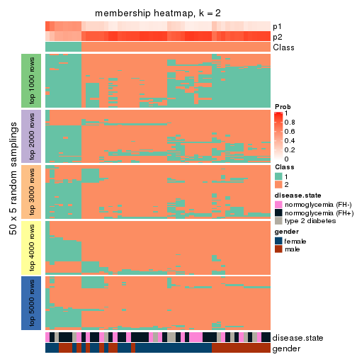</p>

</div>
<div id='tab-SD-hclust-membership-heatmap-2'>
<pre><code class="r">membership_heatmap(res, k = 3)
</code></pre>

<p></p>

</div>
<div id='tab-SD-hclust-membership-heatmap-3'>
<pre><code class="r">membership_heatmap(res, k = 4)
</code></pre>

<p></p>

</div>
<div id='tab-SD-hclust-membership-heatmap-4'>
<pre><code class="r">membership_heatmap(res, k = 5)
</code></pre>

<p></p>

</div>
<div id='tab-SD-hclust-membership-heatmap-5'>
<pre><code class="r">membership_heatmap(res, k = 6)
</code></pre>

<p></p>

</div>
</div>

As soon as we have had the classes for columns, we can look for signatures
which are significantly different between classes which can be candidate marks
for certain classes. Following are the heatmaps for signatures.


Signature heatmaps where rows are scaled:


<script>
$( function() {
	$( '#tabs-SD-hclust-get-signatures' ).tabs();
} );
</script>
<div id='tabs-SD-hclust-get-signatures'>
<ul>
<li><a href='#tab-SD-hclust-get-signatures-1'>k = 2</a></li>
<li><a href='#tab-SD-hclust-get-signatures-2'>k = 3</a></li>
<li><a href='#tab-SD-hclust-get-signatures-3'>k = 4</a></li>
<li><a href='#tab-SD-hclust-get-signatures-4'>k = 5</a></li>
<li><a href='#tab-SD-hclust-get-signatures-5'>k = 6</a></li>
</ul>
<div id='tab-SD-hclust-get-signatures-1'>
<pre><code class="r">get_signatures(res, k = 2)
</code></pre>

<p></p>

</div>
<div id='tab-SD-hclust-get-signatures-2'>
<pre><code class="r">get_signatures(res, k = 3)
</code></pre>

<p></p>

</div>
<div id='tab-SD-hclust-get-signatures-3'>
<pre><code class="r">get_signatures(res, k = 4)
</code></pre>

<p></p>

</div>
<div id='tab-SD-hclust-get-signatures-4'>
<pre><code class="r">get_signatures(res, k = 5)
</code></pre>

<p></p>

</div>
<div id='tab-SD-hclust-get-signatures-5'>
<pre><code class="r">get_signatures(res, k = 6)
</code></pre>

<p>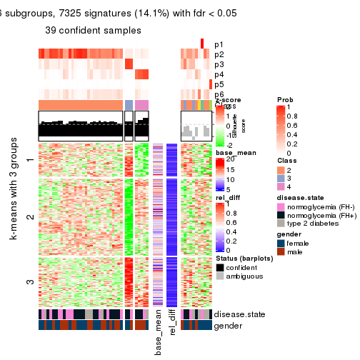</p>

</div>
</div>


Signature heatmaps where rows are not scaled:


<script>
$( function() {
	$( '#tabs-SD-hclust-get-signatures-no-scale' ).tabs();
} );
</script>
<div id='tabs-SD-hclust-get-signatures-no-scale'>
<ul>
<li><a href='#tab-SD-hclust-get-signatures-no-scale-1'>k = 2</a></li>
<li><a href='#tab-SD-hclust-get-signatures-no-scale-2'>k = 3</a></li>
<li><a href='#tab-SD-hclust-get-signatures-no-scale-3'>k = 4</a></li>
<li><a href='#tab-SD-hclust-get-signatures-no-scale-4'>k = 5</a></li>
<li><a href='#tab-SD-hclust-get-signatures-no-scale-5'>k = 6</a></li>
</ul>
<div id='tab-SD-hclust-get-signatures-no-scale-1'>
<pre><code class="r">get_signatures(res, k = 2, scale_rows = FALSE)
</code></pre>

<p></p>

</div>
<div id='tab-SD-hclust-get-signatures-no-scale-2'>
<pre><code class="r">get_signatures(res, k = 3, scale_rows = FALSE)
</code></pre>

<p></p>

</div>
<div id='tab-SD-hclust-get-signatures-no-scale-3'>
<pre><code class="r">get_signatures(res, k = 4, scale_rows = FALSE)
</code></pre>

<p></p>

</div>
<div id='tab-SD-hclust-get-signatures-no-scale-4'>
<pre><code class="r">get_signatures(res, k = 5, scale_rows = FALSE)
</code></pre>

<p></p>

</div>
<div id='tab-SD-hclust-get-signatures-no-scale-5'>
<pre><code class="r">get_signatures(res, k = 6, scale_rows = FALSE)
</code></pre>

<p></p>

</div>
</div>


Compare the overlap of signatures from different k:

```r
compare_signatures(res)
```


`get_signature()` returns a data frame invisibly. TO get the list of signatures, the function
call should be assigned to a variable explicitly. In following code, if `plot` argument is set
to `FALSE`, no heatmap is plotted while only the differential analysis is performed.

```r
# code only for demonstration
tb = get_signature(res, k = ..., plot = FALSE)
```

An example of the output of `tb` is:

```
#>   which_row         fdr    mean_1    mean_2 scaled_mean_1 scaled_mean_2 km
#> 1        38 0.042760348  8.373488  9.131774    -0.5533452     0.5164555  1
#> 2        40 0.018707592  7.106213  8.469186    -0.6173731     0.5762149  1
#> 3        55 0.019134737 10.221463 11.207825    -0.6159697     0.5749050  1
#> 4        59 0.006059896  5.921854  7.869574    -0.6899429     0.6439467  1
#> 5        60 0.018055526  8.928898 10.211722    -0.6204761     0.5791110  1
#> 6        98 0.009384629 15.714769 14.887706     0.6635654    -0.6193277  2
...
```

The columns in `tb` are:

1. `which_row`: row indices corresponding to the input matrix.
2. `fdr`: FDR for the differential test. 
3. `mean_x`: The mean value in group x.
4. `scaled_mean_x`: The mean value in group x after rows are scaled.
5. `km`: Row groups if k-means clustering is applied to rows.


UMAP plot which shows how samples are separated.


<script>
$( function() {
	$( '#tabs-SD-hclust-dimension-reduction' ).tabs();
} );
</script>
<div id='tabs-SD-hclust-dimension-reduction'>
<ul>
<li><a href='#tab-SD-hclust-dimension-reduction-1'>k = 2</a></li>
<li><a href='#tab-SD-hclust-dimension-reduction-2'>k = 3</a></li>
<li><a href='#tab-SD-hclust-dimension-reduction-3'>k = 4</a></li>
<li><a href='#tab-SD-hclust-dimension-reduction-4'>k = 5</a></li>
<li><a href='#tab-SD-hclust-dimension-reduction-5'>k = 6</a></li>
</ul>
<div id='tab-SD-hclust-dimension-reduction-1'>
<pre><code class="r">dimension_reduction(res, k = 2, method = &quot;UMAP&quot;)
</code></pre>

<p></p>

</div>
<div id='tab-SD-hclust-dimension-reduction-2'>
<pre><code class="r">dimension_reduction(res, k = 3, method = &quot;UMAP&quot;)
</code></pre>

<p></p>

</div>
<div id='tab-SD-hclust-dimension-reduction-3'>
<pre><code class="r">dimension_reduction(res, k = 4, method = &quot;UMAP&quot;)
</code></pre>

<p></p>

</div>
<div id='tab-SD-hclust-dimension-reduction-4'>
<pre><code class="r">dimension_reduction(res, k = 5, method = &quot;UMAP&quot;)
</code></pre>

<p></p>

</div>
<div id='tab-SD-hclust-dimension-reduction-5'>
<pre><code class="r">dimension_reduction(res, k = 6, method = &quot;UMAP&quot;)
</code></pre>

<p></p>

</div>
</div>


Following heatmap shows how subgroups are split when increasing `k`:

```r
collect_classes(res)
```


Test correlation between subgroups and known annotations. If the known
annotation is numeric, one-way ANOVA test is applied, and if the known
annotation is discrete, chi-squared contingency table test is applied.

```r
test_to_known_factors(res)
```

```
#>            n disease.state(p) gender(p) k
#> SD:hclust 49            0.905     0.956 2
#> SD:hclust 47            0.648     0.471 3
#> SD:hclust 43            0.702     0.393 4
#> SD:hclust 42            0.859     0.201 5
#> SD:hclust 39            0.922     0.301 6
```


If matrix rows can be associated to genes, consider to use `functional_enrichment(res,
...)` to perform function enrichment for the signature genes. See [this vignette](http://bioconductor.org/packages/devel/bioc/vignettes/cola/inst/doc/functional_enrichment.html) for more detailed explanations.


 

---------------------------------------------------


### SD:kmeans


The object with results only for a single top-value method and a single partition method 
can be extracted as:

```r
res = res_list["SD", "kmeans"]
# you can also extract it by
# res = res_list["SD:kmeans"]
```

A summary of `res` and all the functions that can be applied to it:

```r
res
```

```
#> A 'ConsensusPartition' object with k = 2, 3, 4, 5, 6.
#>   On a matrix with 51941 rows and 50 columns.
#>   Top rows (1000, 2000, 3000, 4000, 5000) are extracted by 'SD' method.
#>   Subgroups are detected by 'kmeans' method.
#>   Performed in total 1250 partitions by row resampling.
#>   Best k for subgroups seems to be 4.
#> 
#> Following methods can be applied to this 'ConsensusPartition' object:
#>  [1] "cola_report"             "collect_classes"         "collect_plots"          
#>  [4] "collect_stats"           "colnames"                "compare_signatures"     
#>  [7] "consensus_heatmap"       "dimension_reduction"     "functional_enrichment"  
#> [10] "get_anno_col"            "get_anno"                "get_classes"            
#> [13] "get_consensus"           "get_matrix"              "get_membership"         
#> [16] "get_param"               "get_signatures"          "get_stats"              
#> [19] "is_best_k"               "is_stable_k"             "membership_heatmap"     
#> [22] "ncol"                    "nrow"                    "plot_ecdf"              
#> [25] "rownames"                "select_partition_number" "show"                   
#> [28] "suggest_best_k"          "test_to_known_factors"
```

`collect_plots()` function collects all the plots made from `res` for all `k` (number of partitions)
into one single page to provide an easy and fast comparison between different `k`.

```r
collect_plots(res)
```


The plots are:

- The first row: a plot of the ECDF (empirical cumulative distribution
  function) curves of the consensus matrix for each `k` and the heatmap of
  predicted classes for each `k`.
- The second row: heatmaps of the consensus matrix for each `k`.
- The third row: heatmaps of the membership matrix for each `k`.
- The fouth row: heatmaps of the signatures for each `k`.

All the plots in panels can be made by individual functions and they are
plotted later in this section.

`select_partition_number()` produces several plots showing different
statistics for choosing "optimized" `k`. There are following statistics:

- ECDF curves of the consensus matrix for each `k`;
- 1-PAC. [The PAC
  score](https://en.wikipedia.org/wiki/Consensus_clustering#Over-interpretation_potential_of_consensus_clustering)
  measures the proportion of the ambiguous subgrouping.
- Mean silhouette score.
- Concordance. The mean probability of fiting the consensus class ids in all
  partitions.
- Area increased. Denote $A_k$ as the area under the ECDF curve for current
  `k`, the area increased is defined as $A_k - A_{k-1}$.
- Rand index. The percent of pairs of samples that are both in a same cluster
  or both are not in a same cluster in the partition of k and k-1.
- Jaccard index. The ratio of pairs of samples are both in a same cluster in
  the partition of k and k-1 and the pairs of samples are both in a same
  cluster in the partition k or k-1.

The detailed explanations of these statistics can be found in [the _cola_
vignette](http://bioconductor.org/packages/devel/bioc/vignettes/cola/inst/doc/cola.html#toc_13).

Generally speaking, lower PAC score, higher mean silhouette score or higher
concordance corresponds to better partition. Rand index and Jaccard index
measure how similar the current partition is compared to partition with `k-1`.
If they are too similar, we won't accept `k` is better than `k-1`.

```r
select_partition_number(res)
```


The numeric values for all these statistics can be obtained by `get_stats()`.

```r
get_stats(res)
```

```
#>   k 1-PAC mean_silhouette concordance area_increased  Rand Jaccard
#> 2 2 0.112           0.303       0.712         0.4291 0.510   0.510
#> 3 3 0.240           0.669       0.732         0.4389 0.643   0.411
#> 4 4 0.400           0.705       0.773         0.1168 0.938   0.821
#> 5 5 0.581           0.638       0.786         0.0747 0.992   0.972
#> 6 6 0.621           0.554       0.764         0.0432 0.977   0.918
```

`suggest_best_k()` suggests the best $k$ based on these statistics. The rules are as follows:

- All $k$ with Jaccard index larger than 0.95 are removed because increasing
  $k$ does not provide enough extra information. If all $k$ are removed, it is
  marked as no subgroup is detected.
- For all $k$ with 1-PAC score larger than 0.9, the maximal $k$ is taken as
  the best $k$, and other $k$ are marked as optional $k$.
- If it does not fit the second rule. The $k$ with the maximal vote of the
  highest 1-PAC score, highest mean silhouette, and highest concordance is
  taken as the best $k$.

```r
suggest_best_k(res)
```

```
#> [1] 4
```


Following shows the table of the partitions (You need to click the **show/hide
code output** link to see it). The membership matrix (columns with name `p*`)
is inferred by
[`clue::cl_consensus()`](https://www.rdocumentation.org/link/cl_consensus?package=clue)
function with the `SE` method. Basically the value in the membership matrix
represents the probability to belong to a certain group. The finall class
label for an item is determined with the group with highest probability it
belongs to.

In `get_classes()` function, the entropy is calculated from the membership
matrix and the silhouette score is calculated from the consensus matrix.


<script>
$( function() {
	$( '#tabs-SD-kmeans-get-classes' ).tabs();
} );
</script>
<div id='tabs-SD-kmeans-get-classes'>
<ul>
<li><a href='#tab-SD-kmeans-get-classes-1'>k = 2</a></li>
<li><a href='#tab-SD-kmeans-get-classes-2'>k = 3</a></li>
<li><a href='#tab-SD-kmeans-get-classes-3'>k = 4</a></li>
<li><a href='#tab-SD-kmeans-get-classes-4'>k = 5</a></li>
<li><a href='#tab-SD-kmeans-get-classes-5'>k = 6</a></li>
</ul>

<div id='tab-SD-kmeans-get-classes-1'>
<p><a id='tab-SD-kmeans-get-classes-1-a' style='color:#0366d6' href='#'>show/hide code output</a></p>
<pre><code class="r">cbind(get_classes(res, k = 2), get_membership(res, k = 2))
</code></pre>

<pre><code>#&gt;           class entropy silhouette    p1    p2
#&gt; GSM624962     1   0.990     0.0923 0.560 0.440
#&gt; GSM624963     1   0.998     0.0856 0.524 0.476
#&gt; GSM624967     1   0.821     0.5256 0.744 0.256
#&gt; GSM624968     1   0.574     0.5007 0.864 0.136
#&gt; GSM624969     2   0.402     0.5303 0.080 0.920
#&gt; GSM624970     2   0.913     0.1043 0.328 0.672
#&gt; GSM624961     2   0.988     0.1301 0.436 0.564
#&gt; GSM624964     1   0.946     0.4259 0.636 0.364
#&gt; GSM624965     2   1.000    -0.0188 0.492 0.508
#&gt; GSM624966     1   0.996     0.0403 0.536 0.464
#&gt; GSM624925     2   1.000    -0.0513 0.496 0.504
#&gt; GSM624927     2   0.358     0.5316 0.068 0.932
#&gt; GSM624929     2   0.958     0.1816 0.380 0.620
#&gt; GSM624930     2   0.295     0.5335 0.052 0.948
#&gt; GSM624931     2   0.242     0.5357 0.040 0.960
#&gt; GSM624935     1   0.946     0.4568 0.636 0.364
#&gt; GSM624936     2   0.388     0.5179 0.076 0.924
#&gt; GSM624937     1   0.917     0.4301 0.668 0.332
#&gt; GSM624926     1   0.644     0.5282 0.836 0.164
#&gt; GSM624928     2   0.988     0.1301 0.436 0.564
#&gt; GSM624932     2   0.518     0.4997 0.116 0.884
#&gt; GSM624933     1   0.981     0.1660 0.580 0.420
#&gt; GSM624934     2   0.430     0.5265 0.088 0.912
#&gt; GSM624971     1   0.987     0.0945 0.568 0.432
#&gt; GSM624973     2   0.998    -0.0390 0.472 0.528
#&gt; GSM624938     1   0.998     0.0626 0.528 0.472
#&gt; GSM624940     2   0.584     0.4197 0.140 0.860
#&gt; GSM624941     2   0.402     0.5282 0.080 0.920
#&gt; GSM624942     2   0.402     0.5282 0.080 0.920
#&gt; GSM624943     2   0.416     0.5298 0.084 0.916
#&gt; GSM624945     2   0.969     0.1494 0.396 0.604
#&gt; GSM624946     1   0.998     0.0611 0.524 0.476
#&gt; GSM624949     2   1.000    -0.1050 0.496 0.504
#&gt; GSM624951     2   0.494     0.4940 0.108 0.892
#&gt; GSM624952     1   1.000    -0.0110 0.500 0.500
#&gt; GSM624955     1   0.443     0.4698 0.908 0.092
#&gt; GSM624956     2   1.000    -0.0653 0.496 0.504
#&gt; GSM624957     2   0.402     0.5288 0.080 0.920
#&gt; GSM624974     2   0.242     0.5333 0.040 0.960
#&gt; GSM624939     2   0.260     0.5326 0.044 0.956
#&gt; GSM624944     1   0.808     0.5221 0.752 0.248
#&gt; GSM624947     1   0.814     0.5177 0.748 0.252
#&gt; GSM624948     2   1.000    -0.0396 0.500 0.500
#&gt; GSM624950     1   0.781     0.5275 0.768 0.232
#&gt; GSM624953     2   0.991     0.1115 0.444 0.556
#&gt; GSM624954     2   0.529     0.5193 0.120 0.880
#&gt; GSM624958     1   0.992     0.1137 0.552 0.448
#&gt; GSM624959     2   0.991     0.1189 0.444 0.556
#&gt; GSM624960     1   0.706     0.5334 0.808 0.192
#&gt; GSM624972     2   0.990     0.1280 0.440 0.560
</code></pre>

<script>
$('#tab-SD-kmeans-get-classes-1-a').parent().next().next().hide();
$('#tab-SD-kmeans-get-classes-1-a').click(function(){
  $('#tab-SD-kmeans-get-classes-1-a').parent().next().next().toggle();
  return(false);
});
</script>
</div>

<div id='tab-SD-kmeans-get-classes-2'>
<p><a id='tab-SD-kmeans-get-classes-2-a' style='color:#0366d6' href='#'>show/hide code output</a></p>
<pre><code class="r">cbind(get_classes(res, k = 3), get_membership(res, k = 3))
</code></pre>

<pre><code>#&gt;           class entropy silhouette    p1    p2    p3
#&gt; GSM624962     2   0.474      0.657 0.136 0.836 0.028
#&gt; GSM624963     2   0.615      0.675 0.160 0.772 0.068
#&gt; GSM624967     3   0.724      0.759 0.092 0.208 0.700
#&gt; GSM624968     3   0.621      0.747 0.052 0.192 0.756
#&gt; GSM624969     1   0.308      0.822 0.916 0.060 0.024
#&gt; GSM624970     1   0.625      0.527 0.744 0.044 0.212
#&gt; GSM624961     2   0.884      0.730 0.208 0.580 0.212
#&gt; GSM624964     3   0.825      0.390 0.352 0.088 0.560
#&gt; GSM624965     2   0.873      0.706 0.168 0.584 0.248
#&gt; GSM624966     2   0.861      0.726 0.192 0.604 0.204
#&gt; GSM624925     2   0.611      0.715 0.184 0.764 0.052
#&gt; GSM624927     1   0.266      0.824 0.932 0.044 0.024
#&gt; GSM624929     2   0.703      0.696 0.272 0.676 0.052
#&gt; GSM624930     1   0.188      0.826 0.956 0.032 0.012
#&gt; GSM624931     1   0.141      0.816 0.964 0.036 0.000
#&gt; GSM624935     3   0.956      0.551 0.252 0.264 0.484
#&gt; GSM624936     1   0.548      0.514 0.732 0.264 0.004
#&gt; GSM624937     3   0.821      0.728 0.140 0.228 0.632
#&gt; GSM624926     3   0.384      0.721 0.012 0.116 0.872
#&gt; GSM624928     2   0.888      0.729 0.216 0.576 0.208
#&gt; GSM624932     2   0.729      0.254 0.480 0.492 0.028
#&gt; GSM624933     2   0.905      0.630 0.160 0.528 0.312
#&gt; GSM624934     1   0.595      0.656 0.764 0.196 0.040
#&gt; GSM624971     2   0.942      0.403 0.224 0.504 0.272
#&gt; GSM624973     1   0.998     -0.263 0.356 0.344 0.300
#&gt; GSM624938     2   0.821      0.372 0.240 0.628 0.132
#&gt; GSM624940     1   0.528      0.685 0.820 0.128 0.052
#&gt; GSM624941     1   0.264      0.825 0.932 0.048 0.020
#&gt; GSM624942     1   0.264      0.825 0.932 0.048 0.020
#&gt; GSM624943     1   0.298      0.822 0.920 0.056 0.024
#&gt; GSM624945     2   0.654      0.716 0.220 0.728 0.052
#&gt; GSM624946     2   0.827      0.369 0.240 0.624 0.136
#&gt; GSM624949     2   0.775      0.620 0.260 0.648 0.092
#&gt; GSM624951     1   0.234      0.784 0.940 0.048 0.012
#&gt; GSM624952     2   0.470      0.692 0.180 0.812 0.008
#&gt; GSM624955     3   0.667      0.679 0.036 0.276 0.688
#&gt; GSM624956     2   0.465      0.694 0.176 0.816 0.008
#&gt; GSM624957     1   0.409      0.797 0.880 0.068 0.052
#&gt; GSM624974     1   0.321      0.795 0.912 0.060 0.028
#&gt; GSM624939     1   0.280      0.799 0.924 0.060 0.016
#&gt; GSM624944     3   0.500      0.780 0.092 0.068 0.840
#&gt; GSM624947     3   0.456      0.781 0.100 0.044 0.856
#&gt; GSM624948     2   0.870      0.706 0.168 0.588 0.244
#&gt; GSM624950     3   0.429      0.780 0.092 0.040 0.868
#&gt; GSM624953     2   0.869      0.730 0.208 0.596 0.196
#&gt; GSM624954     1   0.512      0.758 0.832 0.108 0.060
#&gt; GSM624958     2   0.877      0.701 0.168 0.580 0.252
#&gt; GSM624959     2   0.884      0.722 0.200 0.580 0.220
#&gt; GSM624960     3   0.425      0.760 0.048 0.080 0.872
#&gt; GSM624972     2   0.873      0.729 0.208 0.592 0.200
</code></pre>

<script>
$('#tab-SD-kmeans-get-classes-2-a').parent().next().next().hide();
$('#tab-SD-kmeans-get-classes-2-a').click(function(){
  $('#tab-SD-kmeans-get-classes-2-a').parent().next().next().toggle();
  return(false);
});
</script>
</div>

<div id='tab-SD-kmeans-get-classes-3'>
<p><a id='tab-SD-kmeans-get-classes-3-a' style='color:#0366d6' href='#'>show/hide code output</a></p>
<pre><code class="r">cbind(get_classes(res, k = 4), get_membership(res, k = 4))
</code></pre>

<pre><code>#&gt;           class entropy silhouette    p1    p2    p3    p4
#&gt; GSM624962     2   0.641      0.506 0.032 0.664 0.248 0.056
#&gt; GSM624963     2   0.693      0.545 0.048 0.660 0.200 0.092
#&gt; GSM624967     4   0.411      0.712 0.028 0.012 0.128 0.832
#&gt; GSM624968     4   0.252      0.730 0.000 0.016 0.076 0.908
#&gt; GSM624969     1   0.310      0.864 0.872 0.116 0.008 0.004
#&gt; GSM624970     1   0.516      0.664 0.788 0.020 0.096 0.096
#&gt; GSM624961     2   0.158      0.744 0.048 0.948 0.004 0.000
#&gt; GSM624964     4   0.832      0.291 0.316 0.248 0.020 0.416
#&gt; GSM624965     2   0.230      0.726 0.032 0.932 0.024 0.012
#&gt; GSM624966     2   0.287      0.722 0.044 0.908 0.036 0.012
#&gt; GSM624925     2   0.600      0.645 0.048 0.732 0.164 0.056
#&gt; GSM624927     1   0.290      0.864 0.880 0.112 0.004 0.004
#&gt; GSM624929     2   0.555      0.699 0.104 0.776 0.056 0.064
#&gt; GSM624930     1   0.293      0.865 0.888 0.096 0.012 0.004
#&gt; GSM624931     1   0.241      0.854 0.908 0.084 0.008 0.000
#&gt; GSM624935     4   0.916      0.303 0.244 0.164 0.136 0.456
#&gt; GSM624936     1   0.484      0.624 0.688 0.300 0.012 0.000
#&gt; GSM624937     4   0.553      0.602 0.064 0.000 0.236 0.700
#&gt; GSM624926     4   0.368      0.759 0.004 0.132 0.020 0.844
#&gt; GSM624928     2   0.166      0.743 0.052 0.944 0.000 0.004
#&gt; GSM624932     2   0.522      0.503 0.244 0.712 0.044 0.000
#&gt; GSM624933     2   0.540      0.564 0.088 0.780 0.032 0.100
#&gt; GSM624934     1   0.525      0.720 0.684 0.284 0.032 0.000
#&gt; GSM624971     3   0.683      0.772 0.084 0.332 0.572 0.012
#&gt; GSM624973     3   0.749      0.601 0.156 0.388 0.452 0.004
#&gt; GSM624938     3   0.687      0.796 0.092 0.232 0.644 0.032
#&gt; GSM624940     1   0.420      0.713 0.808 0.036 0.156 0.000
#&gt; GSM624941     1   0.284      0.866 0.884 0.108 0.004 0.004
#&gt; GSM624942     1   0.284      0.866 0.884 0.108 0.004 0.004
#&gt; GSM624943     1   0.375      0.856 0.852 0.112 0.008 0.028
#&gt; GSM624945     2   0.577      0.702 0.084 0.764 0.096 0.056
#&gt; GSM624946     3   0.687      0.796 0.092 0.232 0.644 0.032
#&gt; GSM624949     2   0.765      0.507 0.084 0.608 0.216 0.092
#&gt; GSM624951     1   0.310      0.784 0.876 0.020 0.104 0.000
#&gt; GSM624952     2   0.638      0.580 0.044 0.688 0.212 0.056
#&gt; GSM624955     4   0.436      0.630 0.000 0.020 0.208 0.772
#&gt; GSM624956     2   0.630      0.577 0.040 0.692 0.212 0.056
#&gt; GSM624957     1   0.353      0.854 0.864 0.104 0.024 0.008
#&gt; GSM624974     1   0.482      0.800 0.780 0.144 0.076 0.000
#&gt; GSM624939     1   0.457      0.814 0.800 0.124 0.076 0.000
#&gt; GSM624944     4   0.405      0.762 0.012 0.124 0.028 0.836
#&gt; GSM624947     4   0.334      0.766 0.020 0.120 0.000 0.860
#&gt; GSM624948     2   0.230      0.726 0.032 0.932 0.024 0.012
#&gt; GSM624950     4   0.356      0.765 0.012 0.120 0.012 0.856
#&gt; GSM624953     2   0.248      0.740 0.052 0.916 0.032 0.000
#&gt; GSM624954     1   0.492      0.784 0.740 0.228 0.028 0.004
#&gt; GSM624958     2   0.320      0.717 0.036 0.892 0.012 0.060
#&gt; GSM624959     2   0.240      0.737 0.052 0.924 0.012 0.012
#&gt; GSM624960     4   0.317      0.766 0.004 0.112 0.012 0.872
#&gt; GSM624972     2   0.267      0.739 0.052 0.912 0.032 0.004
</code></pre>

<script>
$('#tab-SD-kmeans-get-classes-3-a').parent().next().next().hide();
$('#tab-SD-kmeans-get-classes-3-a').click(function(){
  $('#tab-SD-kmeans-get-classes-3-a').parent().next().next().toggle();
  return(false);
});
</script>
</div>

<div id='tab-SD-kmeans-get-classes-4'>
<p><a id='tab-SD-kmeans-get-classes-4-a' style='color:#0366d6' href='#'>show/hide code output</a></p>
<pre><code class="r">cbind(get_classes(res, k = 5), get_membership(res, k = 5))
</code></pre>

<pre><code>#&gt;           class entropy silhouette    p1    p2    p3    p4    p5
#&gt; GSM624962     2   0.623     0.4958 0.012 0.580 0.296 0.008 0.104
#&gt; GSM624963     2   0.727     0.4703 0.024 0.540 0.188 0.028 0.220
#&gt; GSM624967     4   0.512     0.1362 0.000 0.008 0.060 0.672 0.260
#&gt; GSM624968     4   0.293     0.5118 0.004 0.012 0.056 0.888 0.040
#&gt; GSM624969     1   0.155     0.8563 0.944 0.040 0.000 0.000 0.016
#&gt; GSM624970     1   0.543     0.6013 0.700 0.008 0.060 0.024 0.208
#&gt; GSM624961     2   0.112     0.7480 0.028 0.964 0.004 0.004 0.000
#&gt; GSM624964     4   0.774     0.1221 0.308 0.212 0.012 0.424 0.044
#&gt; GSM624965     2   0.356     0.6947 0.016 0.860 0.020 0.032 0.072
#&gt; GSM624966     2   0.317     0.7271 0.036 0.876 0.068 0.012 0.008
#&gt; GSM624925     2   0.548     0.6439 0.036 0.688 0.228 0.008 0.040
#&gt; GSM624927     1   0.173     0.8559 0.940 0.036 0.004 0.000 0.020
#&gt; GSM624929     2   0.458     0.7189 0.088 0.804 0.036 0.016 0.056
#&gt; GSM624930     1   0.243     0.8580 0.912 0.028 0.008 0.004 0.048
#&gt; GSM624931     1   0.187     0.8586 0.936 0.036 0.012 0.000 0.016
#&gt; GSM624935     4   0.928    -0.0334 0.180 0.144 0.080 0.372 0.224
#&gt; GSM624936     1   0.467     0.6751 0.724 0.228 0.008 0.004 0.036
#&gt; GSM624937     5   0.479     0.0000 0.016 0.000 0.020 0.292 0.672
#&gt; GSM624926     4   0.273     0.5853 0.000 0.084 0.004 0.884 0.028
#&gt; GSM624928     2   0.133     0.7479 0.032 0.956 0.004 0.008 0.000
#&gt; GSM624932     2   0.576     0.5357 0.192 0.688 0.020 0.016 0.084
#&gt; GSM624933     2   0.595     0.5637 0.064 0.716 0.024 0.112 0.084
#&gt; GSM624934     1   0.548     0.6753 0.676 0.240 0.012 0.012 0.060
#&gt; GSM624971     3   0.405     0.7881 0.024 0.168 0.792 0.008 0.008
#&gt; GSM624973     3   0.630     0.6059 0.048 0.300 0.596 0.020 0.036
#&gt; GSM624938     3   0.260     0.7968 0.024 0.092 0.884 0.000 0.000
#&gt; GSM624940     1   0.468     0.7577 0.768 0.008 0.136 0.008 0.080
#&gt; GSM624941     1   0.146     0.8581 0.952 0.032 0.008 0.000 0.008
#&gt; GSM624942     1   0.165     0.8586 0.944 0.036 0.008 0.000 0.012
#&gt; GSM624943     1   0.286     0.8421 0.892 0.040 0.004 0.012 0.052
#&gt; GSM624945     2   0.492     0.7224 0.060 0.788 0.076 0.020 0.056
#&gt; GSM624946     3   0.254     0.7940 0.024 0.088 0.888 0.000 0.000
#&gt; GSM624949     2   0.827     0.4232 0.076 0.500 0.216 0.068 0.140
#&gt; GSM624951     1   0.334     0.8039 0.852 0.000 0.068 0.004 0.076
#&gt; GSM624952     2   0.561     0.6059 0.036 0.652 0.268 0.004 0.040
#&gt; GSM624955     4   0.564     0.2170 0.004 0.004 0.244 0.644 0.104
#&gt; GSM624956     2   0.555     0.6080 0.032 0.652 0.272 0.004 0.040
#&gt; GSM624957     1   0.296     0.8483 0.892 0.024 0.012 0.020 0.052
#&gt; GSM624974     1   0.519     0.8002 0.768 0.084 0.064 0.016 0.068
#&gt; GSM624939     1   0.484     0.8139 0.792 0.060 0.064 0.016 0.068
#&gt; GSM624944     4   0.374     0.5343 0.000 0.068 0.008 0.828 0.096
#&gt; GSM624947     4   0.309     0.5866 0.040 0.076 0.000 0.872 0.012
#&gt; GSM624948     2   0.357     0.6917 0.016 0.860 0.024 0.028 0.072
#&gt; GSM624950     4   0.294     0.5884 0.012 0.064 0.008 0.888 0.028
#&gt; GSM624953     2   0.191     0.7433 0.036 0.932 0.028 0.004 0.000
#&gt; GSM624954     1   0.447     0.7701 0.764 0.168 0.000 0.012 0.056
#&gt; GSM624958     2   0.321     0.7311 0.028 0.880 0.012 0.056 0.024
#&gt; GSM624959     2   0.205     0.7411 0.028 0.932 0.012 0.024 0.004
#&gt; GSM624960     4   0.271     0.5866 0.000 0.064 0.008 0.892 0.036
#&gt; GSM624972     2   0.223     0.7430 0.040 0.920 0.028 0.012 0.000
</code></pre>

<script>
$('#tab-SD-kmeans-get-classes-4-a').parent().next().next().hide();
$('#tab-SD-kmeans-get-classes-4-a').click(function(){
  $('#tab-SD-kmeans-get-classes-4-a').parent().next().next().toggle();
  return(false);
});
</script>
</div>

<div id='tab-SD-kmeans-get-classes-5'>
<p><a id='tab-SD-kmeans-get-classes-5-a' style='color:#0366d6' href='#'>show/hide code output</a></p>
<pre><code class="r">cbind(get_classes(res, k = 6), get_membership(res, k = 6))
</code></pre>

<pre><code>#&gt;           class entropy silhouette    p1    p2    p3    p4    p5    p6
#&gt; GSM624962     2  0.6295     0.2290 0.004 0.520 0.224 0.008 0.012 0.232
#&gt; GSM624963     6  0.6513    -0.0817 0.004 0.344 0.124 0.024 0.020 0.484
#&gt; GSM624967     4  0.6410     0.1967 0.004 0.008 0.032 0.536 0.260 0.160
#&gt; GSM624968     4  0.2467     0.6143 0.000 0.000 0.020 0.896 0.036 0.048
#&gt; GSM624969     1  0.2885     0.8063 0.884 0.024 0.004 0.012 0.024 0.052
#&gt; GSM624970     1  0.6523     0.1639 0.432 0.004 0.012 0.032 0.120 0.400
#&gt; GSM624961     2  0.0891     0.6813 0.024 0.968 0.000 0.000 0.000 0.008
#&gt; GSM624964     4  0.7658     0.1011 0.280 0.200 0.004 0.408 0.032 0.076
#&gt; GSM624965     2  0.3704     0.4391 0.008 0.744 0.000 0.016 0.000 0.232
#&gt; GSM624966     2  0.1949     0.6735 0.020 0.924 0.020 0.000 0.000 0.036
#&gt; GSM624925     2  0.4962     0.5479 0.024 0.716 0.120 0.008 0.000 0.132
#&gt; GSM624927     1  0.2088     0.8150 0.920 0.016 0.000 0.004 0.024 0.036
#&gt; GSM624929     2  0.4406     0.6036 0.076 0.784 0.004 0.016 0.024 0.096
#&gt; GSM624930     1  0.1810     0.8107 0.932 0.008 0.004 0.000 0.020 0.036
#&gt; GSM624931     1  0.1579     0.8156 0.944 0.020 0.004 0.000 0.008 0.024
#&gt; GSM624935     6  0.7719    -0.0572 0.076 0.092 0.020 0.256 0.072 0.484
#&gt; GSM624936     1  0.4549     0.6062 0.708 0.228 0.008 0.000 0.016 0.040
#&gt; GSM624937     5  0.3090     0.0000 0.000 0.000 0.004 0.140 0.828 0.028
#&gt; GSM624926     4  0.2744     0.6513 0.000 0.052 0.000 0.876 0.012 0.060
#&gt; GSM624928     2  0.1003     0.6800 0.028 0.964 0.000 0.004 0.000 0.004
#&gt; GSM624932     2  0.5601     0.4023 0.196 0.644 0.004 0.000 0.040 0.116
#&gt; GSM624933     2  0.5525     0.1757 0.052 0.612 0.000 0.068 0.000 0.268
#&gt; GSM624934     1  0.5348     0.6013 0.652 0.216 0.000 0.000 0.040 0.092
#&gt; GSM624971     3  0.2100     0.7912 0.000 0.112 0.884 0.000 0.000 0.004
#&gt; GSM624973     3  0.4838     0.5611 0.024 0.292 0.652 0.004 0.008 0.020
#&gt; GSM624938     3  0.1075     0.7977 0.000 0.048 0.952 0.000 0.000 0.000
#&gt; GSM624940     1  0.4325     0.7089 0.768 0.000 0.064 0.000 0.044 0.124
#&gt; GSM624941     1  0.2269     0.8129 0.916 0.020 0.004 0.012 0.012 0.036
#&gt; GSM624942     1  0.2017     0.8144 0.928 0.020 0.004 0.008 0.012 0.028
#&gt; GSM624943     1  0.3634     0.7932 0.832 0.020 0.004 0.012 0.036 0.096
#&gt; GSM624945     2  0.4054     0.6340 0.044 0.816 0.032 0.008 0.016 0.084
#&gt; GSM624946     3  0.1219     0.7981 0.000 0.048 0.948 0.004 0.000 0.000
#&gt; GSM624949     2  0.7810    -0.2060 0.020 0.428 0.160 0.044 0.060 0.288
#&gt; GSM624951     1  0.3563     0.7530 0.828 0.004 0.032 0.000 0.036 0.100
#&gt; GSM624952     2  0.5468     0.4783 0.020 0.652 0.180 0.008 0.000 0.140
#&gt; GSM624955     4  0.5826     0.3589 0.000 0.004 0.148 0.636 0.056 0.156
#&gt; GSM624956     2  0.5426     0.4806 0.020 0.656 0.184 0.008 0.000 0.132
#&gt; GSM624957     1  0.3100     0.7916 0.840 0.008 0.004 0.000 0.024 0.124
#&gt; GSM624974     1  0.4235     0.7693 0.800 0.076 0.020 0.000 0.044 0.060
#&gt; GSM624939     1  0.3772     0.7853 0.832 0.048 0.020 0.000 0.044 0.056
#&gt; GSM624944     4  0.4337     0.5831 0.004 0.028 0.008 0.772 0.144 0.044
#&gt; GSM624947     4  0.2870     0.6529 0.052 0.040 0.000 0.880 0.012 0.016
#&gt; GSM624948     2  0.3977     0.4257 0.008 0.728 0.004 0.020 0.000 0.240
#&gt; GSM624950     4  0.2855     0.6594 0.012 0.036 0.000 0.884 0.032 0.036
#&gt; GSM624953     2  0.0972     0.6806 0.028 0.964 0.008 0.000 0.000 0.000
#&gt; GSM624954     1  0.5424     0.7001 0.692 0.164 0.004 0.012 0.044 0.084
#&gt; GSM624958     2  0.2993     0.6092 0.012 0.864 0.000 0.032 0.008 0.084
#&gt; GSM624959     2  0.1794     0.6731 0.028 0.932 0.000 0.016 0.000 0.024
#&gt; GSM624960     4  0.3442     0.6495 0.004 0.032 0.008 0.848 0.032 0.076
#&gt; GSM624972     2  0.1116     0.6804 0.028 0.960 0.008 0.004 0.000 0.000
</code></pre>

<script>
$('#tab-SD-kmeans-get-classes-5-a').parent().next().next().hide();
$('#tab-SD-kmeans-get-classes-5-a').click(function(){
  $('#tab-SD-kmeans-get-classes-5-a').parent().next().next().toggle();
  return(false);
});
</script>
</div>
</div>

Heatmaps for the consensus matrix. It visualizes the probability of two
samples to be in a same group.


<script>
$( function() {
	$( '#tabs-SD-kmeans-consensus-heatmap' ).tabs();
} );
</script>
<div id='tabs-SD-kmeans-consensus-heatmap'>
<ul>
<li><a href='#tab-SD-kmeans-consensus-heatmap-1'>k = 2</a></li>
<li><a href='#tab-SD-kmeans-consensus-heatmap-2'>k = 3</a></li>
<li><a href='#tab-SD-kmeans-consensus-heatmap-3'>k = 4</a></li>
<li><a href='#tab-SD-kmeans-consensus-heatmap-4'>k = 5</a></li>
<li><a href='#tab-SD-kmeans-consensus-heatmap-5'>k = 6</a></li>
</ul>
<div id='tab-SD-kmeans-consensus-heatmap-1'>
<pre><code class="r">consensus_heatmap(res, k = 2)
</code></pre>

<p></p>

</div>
<div id='tab-SD-kmeans-consensus-heatmap-2'>
<pre><code class="r">consensus_heatmap(res, k = 3)
</code></pre>

<p></p>

</div>
<div id='tab-SD-kmeans-consensus-heatmap-3'>
<pre><code class="r">consensus_heatmap(res, k = 4)
</code></pre>

<p></p>

</div>
<div id='tab-SD-kmeans-consensus-heatmap-4'>
<pre><code class="r">consensus_heatmap(res, k = 5)
</code></pre>

<p></p>

</div>
<div id='tab-SD-kmeans-consensus-heatmap-5'>
<pre><code class="r">consensus_heatmap(res, k = 6)
</code></pre>

<p></p>

</div>
</div>

Heatmaps for the membership of samples in all partitions to see how consistent they are:


<script>
$( function() {
	$( '#tabs-SD-kmeans-membership-heatmap' ).tabs();
} );
</script>
<div id='tabs-SD-kmeans-membership-heatmap'>
<ul>
<li><a href='#tab-SD-kmeans-membership-heatmap-1'>k = 2</a></li>
<li><a href='#tab-SD-kmeans-membership-heatmap-2'>k = 3</a></li>
<li><a href='#tab-SD-kmeans-membership-heatmap-3'>k = 4</a></li>
<li><a href='#tab-SD-kmeans-membership-heatmap-4'>k = 5</a></li>
<li><a href='#tab-SD-kmeans-membership-heatmap-5'>k = 6</a></li>
</ul>
<div id='tab-SD-kmeans-membership-heatmap-1'>
<pre><code class="r">membership_heatmap(res, k = 2)
</code></pre>

<p></p>

</div>
<div id='tab-SD-kmeans-membership-heatmap-2'>
<pre><code class="r">membership_heatmap(res, k = 3)
</code></pre>

<p></p>

</div>
<div id='tab-SD-kmeans-membership-heatmap-3'>
<pre><code class="r">membership_heatmap(res, k = 4)
</code></pre>

<p></p>

</div>
<div id='tab-SD-kmeans-membership-heatmap-4'>
<pre><code class="r">membership_heatmap(res, k = 5)
</code></pre>

<p></p>

</div>
<div id='tab-SD-kmeans-membership-heatmap-5'>
<pre><code class="r">membership_heatmap(res, k = 6)
</code></pre>

<p></p>

</div>
</div>

As soon as we have had the classes for columns, we can look for signatures
which are significantly different between classes which can be candidate marks
for certain classes. Following are the heatmaps for signatures.


Signature heatmaps where rows are scaled:


<script>
$( function() {
	$( '#tabs-SD-kmeans-get-signatures' ).tabs();
} );
</script>
<div id='tabs-SD-kmeans-get-signatures'>
<ul>
<li><a href='#tab-SD-kmeans-get-signatures-1'>k = 2</a></li>
<li><a href='#tab-SD-kmeans-get-signatures-2'>k = 3</a></li>
<li><a href='#tab-SD-kmeans-get-signatures-3'>k = 4</a></li>
<li><a href='#tab-SD-kmeans-get-signatures-4'>k = 5</a></li>
<li><a href='#tab-SD-kmeans-get-signatures-5'>k = 6</a></li>
</ul>
<div id='tab-SD-kmeans-get-signatures-1'>
<pre><code class="r">get_signatures(res, k = 2)
</code></pre>

<p></p>

</div>
<div id='tab-SD-kmeans-get-signatures-2'>
<pre><code class="r">get_signatures(res, k = 3)
</code></pre>

<p></p>

</div>
<div id='tab-SD-kmeans-get-signatures-3'>
<pre><code class="r">get_signatures(res, k = 4)
</code></pre>

<p></p>

</div>
<div id='tab-SD-kmeans-get-signatures-4'>
<pre><code class="r">get_signatures(res, k = 5)
</code></pre>

<p></p>

</div>
<div id='tab-SD-kmeans-get-signatures-5'>
<pre><code class="r">get_signatures(res, k = 6)
</code></pre>

<p></p>

</div>
</div>


Signature heatmaps where rows are not scaled:


<script>
$( function() {
	$( '#tabs-SD-kmeans-get-signatures-no-scale' ).tabs();
} );
</script>
<div id='tabs-SD-kmeans-get-signatures-no-scale'>
<ul>
<li><a href='#tab-SD-kmeans-get-signatures-no-scale-1'>k = 2</a></li>
<li><a href='#tab-SD-kmeans-get-signatures-no-scale-2'>k = 3</a></li>
<li><a href='#tab-SD-kmeans-get-signatures-no-scale-3'>k = 4</a></li>
<li><a href='#tab-SD-kmeans-get-signatures-no-scale-4'>k = 5</a></li>
<li><a href='#tab-SD-kmeans-get-signatures-no-scale-5'>k = 6</a></li>
</ul>
<div id='tab-SD-kmeans-get-signatures-no-scale-1'>
<pre><code class="r">get_signatures(res, k = 2, scale_rows = FALSE)
</code></pre>

<p>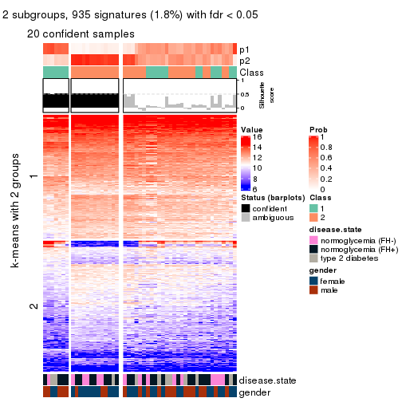</p>

</div>
<div id='tab-SD-kmeans-get-signatures-no-scale-2'>
<pre><code class="r">get_signatures(res, k = 3, scale_rows = FALSE)
</code></pre>

<p></p>

</div>
<div id='tab-SD-kmeans-get-signatures-no-scale-3'>
<pre><code class="r">get_signatures(res, k = 4, scale_rows = FALSE)
</code></pre>

<p></p>

</div>
<div id='tab-SD-kmeans-get-signatures-no-scale-4'>
<pre><code class="r">get_signatures(res, k = 5, scale_rows = FALSE)
</code></pre>

<p></p>

</div>
<div id='tab-SD-kmeans-get-signatures-no-scale-5'>
<pre><code class="r">get_signatures(res, k = 6, scale_rows = FALSE)
</code></pre>

<p>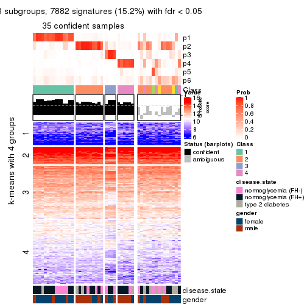</p>

</div>
</div>


Compare the overlap of signatures from different k:

```r
compare_signatures(res)
```

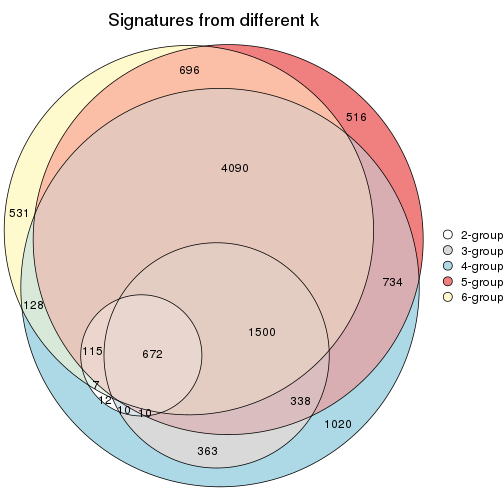

`get_signature()` returns a data frame invisibly. TO get the list of signatures, the function
call should be assigned to a variable explicitly. In following code, if `plot` argument is set
to `FALSE`, no heatmap is plotted while only the differential analysis is performed.

```r
# code only for demonstration
tb = get_signature(res, k = ..., plot = FALSE)
```

An example of the output of `tb` is:

```
#>   which_row         fdr    mean_1    mean_2 scaled_mean_1 scaled_mean_2 km
#> 1        38 0.042760348  8.373488  9.131774    -0.5533452     0.5164555  1
#> 2        40 0.018707592  7.106213  8.469186    -0.6173731     0.5762149  1
#> 3        55 0.019134737 10.221463 11.207825    -0.6159697     0.5749050  1
#> 4        59 0.006059896  5.921854  7.869574    -0.6899429     0.6439467  1
#> 5        60 0.018055526  8.928898 10.211722    -0.6204761     0.5791110  1
#> 6        98 0.009384629 15.714769 14.887706     0.6635654    -0.6193277  2
...
```

The columns in `tb` are:

1. `which_row`: row indices corresponding to the input matrix.
2. `fdr`: FDR for the differential test. 
3. `mean_x`: The mean value in group x.
4. `scaled_mean_x`: The mean value in group x after rows are scaled.
5. `km`: Row groups if k-means clustering is applied to rows.


UMAP plot which shows how samples are separated.


<script>
$( function() {
	$( '#tabs-SD-kmeans-dimension-reduction' ).tabs();
} );
</script>
<div id='tabs-SD-kmeans-dimension-reduction'>
<ul>
<li><a href='#tab-SD-kmeans-dimension-reduction-1'>k = 2</a></li>
<li><a href='#tab-SD-kmeans-dimension-reduction-2'>k = 3</a></li>
<li><a href='#tab-SD-kmeans-dimension-reduction-3'>k = 4</a></li>
<li><a href='#tab-SD-kmeans-dimension-reduction-4'>k = 5</a></li>
<li><a href='#tab-SD-kmeans-dimension-reduction-5'>k = 6</a></li>
</ul>
<div id='tab-SD-kmeans-dimension-reduction-1'>
<pre><code class="r">dimension_reduction(res, k = 2, method = &quot;UMAP&quot;)
</code></pre>

<p></p>

</div>
<div id='tab-SD-kmeans-dimension-reduction-2'>
<pre><code class="r">dimension_reduction(res, k = 3, method = &quot;UMAP&quot;)
</code></pre>

<p></p>

</div>
<div id='tab-SD-kmeans-dimension-reduction-3'>
<pre><code class="r">dimension_reduction(res, k = 4, method = &quot;UMAP&quot;)
</code></pre>

<p></p>

</div>
<div id='tab-SD-kmeans-dimension-reduction-4'>
<pre><code class="r">dimension_reduction(res, k = 5, method = &quot;UMAP&quot;)
</code></pre>

<p></p>

</div>
<div id='tab-SD-kmeans-dimension-reduction-5'>
<pre><code class="r">dimension_reduction(res, k = 6, method = &quot;UMAP&quot;)
</code></pre>

<p></p>

</div>
</div>


Following heatmap shows how subgroups are split when increasing `k`:

```r
collect_classes(res)
```


Test correlation between subgroups and known annotations. If the known
annotation is numeric, one-way ANOVA test is applied, and if the known
annotation is discrete, chi-squared contingency table test is applied.

```r
test_to_known_factors(res)
```

```
#>            n disease.state(p) gender(p) k
#> SD:kmeans 20            0.330    0.1038 2
#> SD:kmeans 44            0.856    0.0747 3
#> SD:kmeans 48            0.845    0.1031 4
#> SD:kmeans 42            0.923    0.0109 5
#> SD:kmeans 35            0.850    0.0218 6
```


If matrix rows can be associated to genes, consider to use `functional_enrichment(res,
...)` to perform function enrichment for the signature genes. See [this vignette](http://bioconductor.org/packages/devel/bioc/vignettes/cola/inst/doc/functional_enrichment.html) for more detailed explanations.


 

---------------------------------------------------


### SD:skmeans


The object with results only for a single top-value method and a single partition method 
can be extracted as:

```r
res = res_list["SD", "skmeans"]
# you can also extract it by
# res = res_list["SD:skmeans"]
```

A summary of `res` and all the functions that can be applied to it:

```r
res
```

```
#> A 'ConsensusPartition' object with k = 2, 3, 4, 5, 6.
#>   On a matrix with 51941 rows and 50 columns.
#>   Top rows (1000, 2000, 3000, 4000, 5000) are extracted by 'SD' method.
#>   Subgroups are detected by 'skmeans' method.
#>   Performed in total 1250 partitions by row resampling.
#>   Best k for subgroups seems to be 2.
#> 
#> Following methods can be applied to this 'ConsensusPartition' object:
#>  [1] "cola_report"             "collect_classes"         "collect_plots"          
#>  [4] "collect_stats"           "colnames"                "compare_signatures"     
#>  [7] "consensus_heatmap"       "dimension_reduction"     "functional_enrichment"  
#> [10] "get_anno_col"            "get_anno"                "get_classes"            
#> [13] "get_consensus"           "get_matrix"              "get_membership"         
#> [16] "get_param"               "get_signatures"          "get_stats"              
#> [19] "is_best_k"               "is_stable_k"             "membership_heatmap"     
#> [22] "ncol"                    "nrow"                    "plot_ecdf"              
#> [25] "rownames"                "select_partition_number" "show"                   
#> [28] "suggest_best_k"          "test_to_known_factors"
```

`collect_plots()` function collects all the plots made from `res` for all `k` (number of partitions)
into one single page to provide an easy and fast comparison between different `k`.

```r
collect_plots(res)
```


The plots are:

- The first row: a plot of the ECDF (empirical cumulative distribution
  function) curves of the consensus matrix for each `k` and the heatmap of
  predicted classes for each `k`.
- The second row: heatmaps of the consensus matrix for each `k`.
- The third row: heatmaps of the membership matrix for each `k`.
- The fouth row: heatmaps of the signatures for each `k`.

All the plots in panels can be made by individual functions and they are
plotted later in this section.

`select_partition_number()` produces several plots showing different
statistics for choosing "optimized" `k`. There are following statistics:

- ECDF curves of the consensus matrix for each `k`;
- 1-PAC. [The PAC
  score](https://en.wikipedia.org/wiki/Consensus_clustering#Over-interpretation_potential_of_consensus_clustering)
  measures the proportion of the ambiguous subgrouping.
- Mean silhouette score.
- Concordance. The mean probability of fiting the consensus class ids in all
  partitions.
- Area increased. Denote $A_k$ as the area under the ECDF curve for current
  `k`, the area increased is defined as $A_k - A_{k-1}$.
- Rand index. The percent of pairs of samples that are both in a same cluster
  or both are not in a same cluster in the partition of k and k-1.
- Jaccard index. The ratio of pairs of samples are both in a same cluster in
  the partition of k and k-1 and the pairs of samples are both in a same
  cluster in the partition k or k-1.

The detailed explanations of these statistics can be found in [the _cola_
vignette](http://bioconductor.org/packages/devel/bioc/vignettes/cola/inst/doc/cola.html#toc_13).

Generally speaking, lower PAC score, higher mean silhouette score or higher
concordance corresponds to better partition. Rand index and Jaccard index
measure how similar the current partition is compared to partition with `k-1`.
If they are too similar, we won't accept `k` is better than `k-1`.

```r
select_partition_number(res)
```


The numeric values for all these statistics can be obtained by `get_stats()`.

```r
get_stats(res)
```

```
#>   k   1-PAC mean_silhouette concordance area_increased  Rand Jaccard
#> 2 2 0.00278           0.439       0.727         0.5063 0.491   0.491
#> 3 3 0.03793           0.318       0.561         0.3322 0.689   0.445
#> 4 4 0.17484           0.375       0.580         0.1210 0.863   0.610
#> 5 5 0.31545           0.240       0.519         0.0659 0.932   0.752
#> 6 6 0.43478           0.237       0.482         0.0420 0.899   0.609
```

`suggest_best_k()` suggests the best $k$ based on these statistics. The rules are as follows:

- All $k$ with Jaccard index larger than 0.95 are removed because increasing
  $k$ does not provide enough extra information. If all $k$ are removed, it is
  marked as no subgroup is detected.
- For all $k$ with 1-PAC score larger than 0.9, the maximal $k$ is taken as
  the best $k$, and other $k$ are marked as optional $k$.
- If it does not fit the second rule. The $k$ with the maximal vote of the
  highest 1-PAC score, highest mean silhouette, and highest concordance is
  taken as the best $k$.

```r
suggest_best_k(res)
```

```
#> [1] 2
```


Following shows the table of the partitions (You need to click the **show/hide
code output** link to see it). The membership matrix (columns with name `p*`)
is inferred by
[`clue::cl_consensus()`](https://www.rdocumentation.org/link/cl_consensus?package=clue)
function with the `SE` method. Basically the value in the membership matrix
represents the probability to belong to a certain group. The finall class
label for an item is determined with the group with highest probability it
belongs to.

In `get_classes()` function, the entropy is calculated from the membership
matrix and the silhouette score is calculated from the consensus matrix.


<script>
$( function() {
	$( '#tabs-SD-skmeans-get-classes' ).tabs();
} );
</script>
<div id='tabs-SD-skmeans-get-classes'>
<ul>
<li><a href='#tab-SD-skmeans-get-classes-1'>k = 2</a></li>
<li><a href='#tab-SD-skmeans-get-classes-2'>k = 3</a></li>
<li><a href='#tab-SD-skmeans-get-classes-3'>k = 4</a></li>
<li><a href='#tab-SD-skmeans-get-classes-4'>k = 5</a></li>
<li><a href='#tab-SD-skmeans-get-classes-5'>k = 6</a></li>
</ul>

<div id='tab-SD-skmeans-get-classes-1'>
<p><a id='tab-SD-skmeans-get-classes-1-a' style='color:#0366d6' href='#'>show/hide code output</a></p>
<pre><code class="r">cbind(get_classes(res, k = 2), get_membership(res, k = 2))
</code></pre>

<pre><code>#&gt;           class entropy silhouette    p1    p2
#&gt; GSM624962     2   0.821    0.52504 0.256 0.744
#&gt; GSM624963     2   0.913    0.48304 0.328 0.672
#&gt; GSM624967     1   0.978    0.13853 0.588 0.412
#&gt; GSM624968     2   0.998    0.18948 0.472 0.528
#&gt; GSM624969     1   0.595    0.62426 0.856 0.144
#&gt; GSM624970     1   0.456    0.62535 0.904 0.096
#&gt; GSM624961     2   0.469    0.63087 0.100 0.900
#&gt; GSM624964     1   0.909    0.36499 0.676 0.324
#&gt; GSM624965     2   0.595    0.63655 0.144 0.856
#&gt; GSM624966     2   0.615    0.60050 0.152 0.848
#&gt; GSM624925     2   0.722    0.60909 0.200 0.800
#&gt; GSM624927     1   0.584    0.62593 0.860 0.140
#&gt; GSM624929     2   0.999    0.04978 0.484 0.516
#&gt; GSM624930     1   0.456    0.63466 0.904 0.096
#&gt; GSM624931     1   0.506    0.61576 0.888 0.112
#&gt; GSM624935     1   0.969    0.24251 0.604 0.396
#&gt; GSM624936     1   0.975    0.28895 0.592 0.408
#&gt; GSM624937     1   0.839    0.49292 0.732 0.268
#&gt; GSM624926     2   0.760    0.55829 0.220 0.780
#&gt; GSM624928     2   0.456    0.63450 0.096 0.904
#&gt; GSM624932     2   0.996   -0.04719 0.464 0.536
#&gt; GSM624933     2   0.871    0.48919 0.292 0.708
#&gt; GSM624934     1   0.990    0.27817 0.560 0.440
#&gt; GSM624971     2   0.850    0.51104 0.276 0.724
#&gt; GSM624973     1   1.000    0.00362 0.508 0.492
#&gt; GSM624938     2   0.994    0.12656 0.456 0.544
#&gt; GSM624940     1   0.689    0.57523 0.816 0.184
#&gt; GSM624941     1   0.358    0.63194 0.932 0.068
#&gt; GSM624942     1   0.358    0.63214 0.932 0.068
#&gt; GSM624943     1   0.738    0.59343 0.792 0.208
#&gt; GSM624945     2   0.891    0.42885 0.308 0.692
#&gt; GSM624946     1   0.998   -0.00472 0.524 0.476
#&gt; GSM624949     2   0.999    0.12852 0.480 0.520
#&gt; GSM624951     1   0.311    0.62177 0.944 0.056
#&gt; GSM624952     2   0.753    0.56762 0.216 0.784
#&gt; GSM624955     2   0.971    0.34092 0.400 0.600
#&gt; GSM624956     2   0.714    0.58424 0.196 0.804
#&gt; GSM624957     1   0.760    0.58859 0.780 0.220
#&gt; GSM624974     1   0.827    0.54653 0.740 0.260
#&gt; GSM624939     1   0.821    0.55357 0.744 0.256
#&gt; GSM624944     2   0.990    0.19923 0.440 0.560
#&gt; GSM624947     1   0.997   -0.00203 0.532 0.468
#&gt; GSM624948     2   0.494    0.62924 0.108 0.892
#&gt; GSM624950     1   0.999   -0.01993 0.520 0.480
#&gt; GSM624953     2   0.456    0.63193 0.096 0.904
#&gt; GSM624954     1   0.929    0.45137 0.656 0.344
#&gt; GSM624958     2   0.662    0.61467 0.172 0.828
#&gt; GSM624959     2   0.574    0.63278 0.136 0.864
#&gt; GSM624960     2   0.886    0.48219 0.304 0.696
#&gt; GSM624972     2   0.680    0.61980 0.180 0.820
</code></pre>

<script>
$('#tab-SD-skmeans-get-classes-1-a').parent().next().next().hide();
$('#tab-SD-skmeans-get-classes-1-a').click(function(){
  $('#tab-SD-skmeans-get-classes-1-a').parent().next().next().toggle();
  return(false);
});
</script>
</div>

<div id='tab-SD-skmeans-get-classes-2'>
<p><a id='tab-SD-skmeans-get-classes-2-a' style='color:#0366d6' href='#'>show/hide code output</a></p>
<pre><code class="r">cbind(get_classes(res, k = 3), get_membership(res, k = 3))
</code></pre>

<pre><code>#&gt;           class entropy silhouette    p1    p2    p3
#&gt; GSM624962     3   0.858   -0.03281 0.108 0.356 0.536
#&gt; GSM624963     2   0.914    0.09759 0.144 0.456 0.400
#&gt; GSM624967     3   0.939    0.22018 0.328 0.188 0.484
#&gt; GSM624968     3   0.706    0.37606 0.164 0.112 0.724
#&gt; GSM624969     1   0.766    0.56754 0.684 0.144 0.172
#&gt; GSM624970     1   0.750    0.51536 0.652 0.072 0.276
#&gt; GSM624961     2   0.440    0.49608 0.044 0.864 0.092
#&gt; GSM624964     1   0.987   -0.12381 0.392 0.260 0.348
#&gt; GSM624965     2   0.615    0.44456 0.076 0.776 0.148
#&gt; GSM624966     2   0.896    0.18596 0.132 0.492 0.376
#&gt; GSM624925     2   0.857    0.14850 0.096 0.480 0.424
#&gt; GSM624927     1   0.632    0.62688 0.772 0.120 0.108
#&gt; GSM624929     2   0.917    0.20973 0.332 0.504 0.164
#&gt; GSM624930     1   0.524    0.64305 0.828 0.100 0.072
#&gt; GSM624931     1   0.563    0.63500 0.800 0.056 0.144
#&gt; GSM624935     3   0.995    0.12329 0.288 0.336 0.376
#&gt; GSM624936     1   0.873    0.32000 0.568 0.288 0.144
#&gt; GSM624937     3   0.854    0.00468 0.408 0.096 0.496
#&gt; GSM624926     3   0.781    0.09165 0.052 0.436 0.512
#&gt; GSM624928     2   0.478    0.48986 0.036 0.840 0.124
#&gt; GSM624932     2   0.936    0.10998 0.368 0.460 0.172
#&gt; GSM624933     2   0.825    0.22750 0.128 0.620 0.252
#&gt; GSM624934     2   0.846   -0.07428 0.448 0.464 0.088
#&gt; GSM624971     3   0.917    0.17827 0.212 0.248 0.540
#&gt; GSM624973     3   0.946    0.14683 0.340 0.192 0.468
#&gt; GSM624938     3   0.915    0.14440 0.236 0.220 0.544
#&gt; GSM624940     1   0.668    0.51290 0.724 0.060 0.216
#&gt; GSM624941     1   0.530    0.62785 0.808 0.036 0.156
#&gt; GSM624942     1   0.499    0.64763 0.836 0.052 0.112
#&gt; GSM624943     1   0.817    0.55339 0.644 0.176 0.180
#&gt; GSM624945     2   0.867    0.31632 0.152 0.584 0.264
#&gt; GSM624946     3   0.792    0.26209 0.248 0.108 0.644
#&gt; GSM624949     3   0.914    0.22053 0.196 0.264 0.540
#&gt; GSM624951     1   0.420    0.63754 0.864 0.024 0.112
#&gt; GSM624952     3   0.878   -0.13912 0.112 0.420 0.468
#&gt; GSM624955     3   0.483    0.35159 0.068 0.084 0.848
#&gt; GSM624956     2   0.873    0.16064 0.108 0.476 0.416
#&gt; GSM624957     1   0.741    0.58208 0.700 0.124 0.176
#&gt; GSM624974     1   0.748    0.54026 0.692 0.192 0.116
#&gt; GSM624939     1   0.722    0.55292 0.716 0.152 0.132
#&gt; GSM624944     3   0.927    0.15979 0.160 0.384 0.456
#&gt; GSM624947     3   0.961    0.27181 0.288 0.240 0.472
#&gt; GSM624948     2   0.414    0.47826 0.032 0.872 0.096
#&gt; GSM624950     3   0.915    0.31634 0.224 0.232 0.544
#&gt; GSM624953     2   0.615    0.47594 0.068 0.772 0.160
#&gt; GSM624954     1   0.908    0.21884 0.488 0.368 0.144
#&gt; GSM624958     2   0.726    0.33562 0.072 0.680 0.248
#&gt; GSM624959     2   0.418    0.49424 0.052 0.876 0.072
#&gt; GSM624960     3   0.862    0.18920 0.108 0.368 0.524
#&gt; GSM624972     2   0.804    0.36659 0.136 0.648 0.216
</code></pre>

<script>
$('#tab-SD-skmeans-get-classes-2-a').parent().next().next().hide();
$('#tab-SD-skmeans-get-classes-2-a').click(function(){
  $('#tab-SD-skmeans-get-classes-2-a').parent().next().next().toggle();
  return(false);
});
</script>
</div>

<div id='tab-SD-skmeans-get-classes-3'>
<p><a id='tab-SD-skmeans-get-classes-3-a' style='color:#0366d6' href='#'>show/hide code output</a></p>
<pre><code class="r">cbind(get_classes(res, k = 4), get_membership(res, k = 4))
</code></pre>

<pre><code>#&gt;           class entropy silhouette    p1    p2    p3    p4
#&gt; GSM624962     3   0.678     0.3525 0.028 0.288 0.616 0.068
#&gt; GSM624963     2   0.944     0.0874 0.108 0.348 0.316 0.228
#&gt; GSM624967     4   0.751     0.5213 0.088 0.128 0.144 0.640
#&gt; GSM624968     4   0.708     0.4495 0.048 0.072 0.260 0.620
#&gt; GSM624969     1   0.830     0.4397 0.548 0.116 0.100 0.236
#&gt; GSM624970     1   0.785     0.3809 0.520 0.044 0.112 0.324
#&gt; GSM624961     2   0.511     0.4567 0.040 0.800 0.096 0.064
#&gt; GSM624964     4   0.872     0.3725 0.196 0.168 0.116 0.520
#&gt; GSM624965     2   0.704     0.4382 0.032 0.636 0.112 0.220
#&gt; GSM624966     3   0.883     0.1094 0.076 0.368 0.396 0.160
#&gt; GSM624925     2   0.843    -0.1910 0.068 0.412 0.400 0.120
#&gt; GSM624927     1   0.630     0.5852 0.728 0.068 0.076 0.128
#&gt; GSM624929     2   0.831     0.3040 0.272 0.528 0.104 0.096
#&gt; GSM624930     1   0.590     0.6177 0.756 0.084 0.060 0.100
#&gt; GSM624931     1   0.696     0.5720 0.672 0.064 0.172 0.092
#&gt; GSM624935     4   0.941     0.2316 0.152 0.240 0.184 0.424
#&gt; GSM624936     1   0.829     0.4239 0.548 0.200 0.180 0.072
#&gt; GSM624937     4   0.814     0.4185 0.204 0.076 0.152 0.568
#&gt; GSM624926     4   0.720     0.3976 0.028 0.292 0.096 0.584
#&gt; GSM624928     2   0.491     0.4872 0.048 0.812 0.048 0.092
#&gt; GSM624932     2   0.923    -0.0141 0.328 0.348 0.244 0.080
#&gt; GSM624933     2   0.873     0.1161 0.108 0.472 0.120 0.300
#&gt; GSM624934     1   0.886     0.1324 0.416 0.356 0.112 0.116
#&gt; GSM624971     3   0.755     0.4544 0.112 0.108 0.640 0.140
#&gt; GSM624973     3   0.918     0.2914 0.240 0.180 0.452 0.128
#&gt; GSM624938     3   0.641     0.4832 0.136 0.096 0.716 0.052
#&gt; GSM624940     1   0.647     0.4718 0.612 0.020 0.316 0.052
#&gt; GSM624941     1   0.572     0.5831 0.736 0.024 0.060 0.180
#&gt; GSM624942     1   0.519     0.6206 0.796 0.044 0.064 0.096
#&gt; GSM624943     1   0.823     0.4890 0.576 0.108 0.148 0.168
#&gt; GSM624945     2   0.798     0.2240 0.104 0.560 0.260 0.076
#&gt; GSM624946     3   0.677     0.4633 0.124 0.056 0.692 0.128
#&gt; GSM624949     3   0.890     0.1569 0.108 0.148 0.468 0.276
#&gt; GSM624951     1   0.477     0.6028 0.792 0.004 0.136 0.068
#&gt; GSM624952     3   0.695     0.2765 0.032 0.352 0.560 0.056
#&gt; GSM624955     4   0.684     0.2045 0.028 0.044 0.432 0.496
#&gt; GSM624956     3   0.727     0.1132 0.040 0.444 0.460 0.056
#&gt; GSM624957     1   0.818     0.5141 0.584 0.140 0.152 0.124
#&gt; GSM624974     1   0.735     0.5338 0.644 0.108 0.176 0.072
#&gt; GSM624939     1   0.724     0.5459 0.656 0.092 0.168 0.084
#&gt; GSM624944     4   0.577     0.5318 0.048 0.180 0.036 0.736
#&gt; GSM624947     4   0.792     0.5099 0.172 0.140 0.088 0.600
#&gt; GSM624948     2   0.624     0.4705 0.040 0.720 0.088 0.152
#&gt; GSM624950     4   0.625     0.5671 0.084 0.092 0.088 0.736
#&gt; GSM624953     2   0.629     0.3767 0.044 0.716 0.160 0.080
#&gt; GSM624954     1   0.877     0.0391 0.412 0.340 0.060 0.188
#&gt; GSM624958     2   0.795     0.2588 0.060 0.524 0.100 0.316
#&gt; GSM624959     2   0.570     0.4809 0.060 0.764 0.056 0.120
#&gt; GSM624960     4   0.621     0.4828 0.016 0.236 0.072 0.676
#&gt; GSM624972     2   0.822     0.3330 0.104 0.576 0.160 0.160
</code></pre>

<script>
$('#tab-SD-skmeans-get-classes-3-a').parent().next().next().hide();
$('#tab-SD-skmeans-get-classes-3-a').click(function(){
  $('#tab-SD-skmeans-get-classes-3-a').parent().next().next().toggle();
  return(false);
});
</script>
</div>

<div id='tab-SD-skmeans-get-classes-4'>
<p><a id='tab-SD-skmeans-get-classes-4-a' style='color:#0366d6' href='#'>show/hide code output</a></p>
<pre><code class="r">cbind(get_classes(res, k = 5), get_membership(res, k = 5))
</code></pre>

<pre><code>#&gt;           class entropy silhouette    p1    p2    p3    p4    p5
#&gt; GSM624962     3   0.728    0.35567 0.040 0.204 0.584 0.048 0.124
#&gt; GSM624963     3   0.941   -0.00667 0.060 0.256 0.284 0.168 0.232
#&gt; GSM624967     4   0.789    0.44838 0.064 0.096 0.124 0.564 0.152
#&gt; GSM624968     4   0.676    0.44025 0.020 0.044 0.216 0.612 0.108
#&gt; GSM624969     1   0.812   -0.15443 0.404 0.116 0.052 0.060 0.368
#&gt; GSM624970     1   0.793    0.15861 0.496 0.032 0.060 0.220 0.192
#&gt; GSM624961     2   0.574    0.44553 0.028 0.736 0.080 0.088 0.068
#&gt; GSM624964     4   0.860   -0.12259 0.200 0.056 0.060 0.372 0.312
#&gt; GSM624965     2   0.794    0.38173 0.036 0.532 0.100 0.192 0.140
#&gt; GSM624966     3   0.884    0.11721 0.088 0.328 0.372 0.100 0.112
#&gt; GSM624925     3   0.858    0.07635 0.056 0.340 0.352 0.060 0.192
#&gt; GSM624927     1   0.650    0.18109 0.592 0.068 0.000 0.080 0.260
#&gt; GSM624929     2   0.832    0.14935 0.144 0.468 0.092 0.044 0.252
#&gt; GSM624930     1   0.596    0.29549 0.700 0.052 0.032 0.048 0.168
#&gt; GSM624931     1   0.711    0.26218 0.608 0.048 0.156 0.036 0.152
#&gt; GSM624935     4   0.919    0.03887 0.124 0.196 0.064 0.324 0.292
#&gt; GSM624936     1   0.872    0.12024 0.432 0.144 0.192 0.040 0.192
#&gt; GSM624937     4   0.827    0.33421 0.184 0.044 0.116 0.504 0.152
#&gt; GSM624926     4   0.613    0.37458 0.008 0.176 0.056 0.672 0.088
#&gt; GSM624928     2   0.517    0.45673 0.028 0.772 0.040 0.072 0.088
#&gt; GSM624932     1   0.879   -0.04791 0.352 0.300 0.160 0.028 0.160
#&gt; GSM624933     2   0.871    0.10135 0.052 0.316 0.060 0.292 0.280
#&gt; GSM624934     1   0.894   -0.12026 0.312 0.304 0.056 0.084 0.244
#&gt; GSM624971     3   0.664    0.39084 0.096 0.040 0.672 0.108 0.084
#&gt; GSM624973     3   0.917    0.15303 0.240 0.172 0.384 0.084 0.120
#&gt; GSM624938     3   0.480    0.44780 0.100 0.036 0.792 0.044 0.028
#&gt; GSM624940     1   0.628    0.29781 0.624 0.020 0.252 0.024 0.080
#&gt; GSM624941     1   0.693    0.10057 0.556 0.024 0.060 0.060 0.300
#&gt; GSM624942     1   0.585    0.23048 0.648 0.020 0.036 0.032 0.264
#&gt; GSM624943     1   0.819   -0.03917 0.388 0.064 0.056 0.112 0.380
#&gt; GSM624945     2   0.798    0.17352 0.068 0.476 0.240 0.024 0.192
#&gt; GSM624946     3   0.512    0.40111 0.080 0.028 0.768 0.100 0.024
#&gt; GSM624949     3   0.883    0.15467 0.084 0.108 0.452 0.180 0.176
#&gt; GSM624951     1   0.519    0.33616 0.764 0.012 0.088 0.056 0.080
#&gt; GSM624952     3   0.687    0.33081 0.012 0.224 0.584 0.040 0.140
#&gt; GSM624955     4   0.786    0.16691 0.036 0.048 0.364 0.420 0.132
#&gt; GSM624956     3   0.736    0.20510 0.016 0.328 0.464 0.028 0.164
#&gt; GSM624957     1   0.753    0.17299 0.532 0.044 0.064 0.084 0.276
#&gt; GSM624974     1   0.738    0.18481 0.596 0.120 0.112 0.028 0.144
#&gt; GSM624939     1   0.686    0.25500 0.648 0.072 0.116 0.036 0.128
#&gt; GSM624944     4   0.626    0.46584 0.048 0.116 0.028 0.688 0.120
#&gt; GSM624947     4   0.755    0.44061 0.104 0.092 0.068 0.600 0.136
#&gt; GSM624948     2   0.709    0.43641 0.032 0.612 0.056 0.152 0.148
#&gt; GSM624950     4   0.585    0.50406 0.056 0.036 0.072 0.728 0.108
#&gt; GSM624953     2   0.692    0.40114 0.040 0.648 0.116 0.084 0.112
#&gt; GSM624954     5   0.861    0.00000 0.300 0.264 0.020 0.100 0.316
#&gt; GSM624958     2   0.828    0.22507 0.032 0.404 0.084 0.332 0.148
#&gt; GSM624959     2   0.600    0.45812 0.032 0.704 0.032 0.128 0.104
#&gt; GSM624960     4   0.560    0.48467 0.032 0.084 0.064 0.748 0.072
#&gt; GSM624972     2   0.821    0.31231 0.036 0.500 0.112 0.160 0.192
</code></pre>

<script>
$('#tab-SD-skmeans-get-classes-4-a').parent().next().next().hide();
$('#tab-SD-skmeans-get-classes-4-a').click(function(){
  $('#tab-SD-skmeans-get-classes-4-a').parent().next().next().toggle();
  return(false);
});
</script>
</div>

<div id='tab-SD-skmeans-get-classes-5'>
<p><a id='tab-SD-skmeans-get-classes-5-a' style='color:#0366d6' href='#'>show/hide code output</a></p>
<pre><code class="r">cbind(get_classes(res, k = 6), get_membership(res, k = 6))
</code></pre>

<pre><code>#&gt;           class entropy silhouette    p1    p2    p3    p4    p5    p6
#&gt; GSM624962     5   0.582    0.23692 0.016 0.076 0.088 0.048 0.708 0.064
#&gt; GSM624963     5   0.897   -0.01410 0.060 0.208 0.072 0.100 0.356 0.204
#&gt; GSM624967     4   0.712    0.43440 0.048 0.060 0.072 0.612 0.100 0.108
#&gt; GSM624968     4   0.605    0.45822 0.008 0.020 0.116 0.660 0.132 0.064
#&gt; GSM624969     1   0.804    0.23501 0.480 0.056 0.092 0.096 0.048 0.228
#&gt; GSM624970     1   0.767    0.18190 0.468 0.048 0.056 0.132 0.024 0.272
#&gt; GSM624961     2   0.557    0.39060 0.016 0.680 0.124 0.004 0.144 0.032
#&gt; GSM624964     4   0.875    0.12553 0.180 0.076 0.216 0.356 0.020 0.152
#&gt; GSM624965     2   0.695    0.28045 0.024 0.604 0.056 0.088 0.068 0.160
#&gt; GSM624966     3   0.884    0.08064 0.052 0.216 0.332 0.076 0.252 0.072
#&gt; GSM624925     5   0.763    0.19100 0.048 0.248 0.056 0.084 0.508 0.056
#&gt; GSM624927     1   0.766    0.28618 0.488 0.068 0.056 0.056 0.056 0.276
#&gt; GSM624929     2   0.928    0.07116 0.112 0.316 0.136 0.052 0.160 0.224
#&gt; GSM624930     1   0.723    0.32985 0.548 0.028 0.100 0.036 0.068 0.220
#&gt; GSM624931     1   0.670    0.39984 0.620 0.028 0.152 0.024 0.084 0.092
#&gt; GSM624935     6   0.832    0.02208 0.080 0.152 0.044 0.252 0.052 0.420
#&gt; GSM624936     5   0.869   -0.03698 0.272 0.088 0.100 0.020 0.332 0.188
#&gt; GSM624937     4   0.732    0.36086 0.132 0.016 0.068 0.548 0.052 0.184
#&gt; GSM624926     4   0.646    0.36078 0.008 0.228 0.048 0.592 0.028 0.096
#&gt; GSM624928     2   0.623    0.42207 0.016 0.676 0.092 0.060 0.088 0.068
#&gt; GSM624932     3   0.912   -0.02178 0.160 0.224 0.264 0.012 0.180 0.160
#&gt; GSM624933     2   0.813    0.00749 0.052 0.432 0.060 0.160 0.040 0.256
#&gt; GSM624934     6   0.873    0.02929 0.208 0.260 0.156 0.024 0.048 0.304
#&gt; GSM624971     3   0.698    0.24815 0.040 0.040 0.536 0.068 0.280 0.036
#&gt; GSM624973     3   0.759    0.27087 0.152 0.076 0.560 0.056 0.100 0.056
#&gt; GSM624938     5   0.628   -0.16559 0.080 0.012 0.336 0.016 0.528 0.028
#&gt; GSM624940     1   0.660    0.31672 0.544 0.004 0.212 0.000 0.152 0.088
#&gt; GSM624941     1   0.586    0.39122 0.688 0.028 0.044 0.044 0.040 0.156
#&gt; GSM624942     1   0.545    0.41033 0.708 0.020 0.044 0.032 0.032 0.164
#&gt; GSM624943     1   0.734    0.20566 0.468 0.044 0.036 0.068 0.052 0.332
#&gt; GSM624945     5   0.864   -0.00687 0.052 0.324 0.100 0.056 0.332 0.136
#&gt; GSM624946     3   0.681    0.13922 0.056 0.008 0.448 0.068 0.388 0.032
#&gt; GSM624949     3   0.914    0.05422 0.036 0.096 0.288 0.152 0.264 0.164
#&gt; GSM624951     1   0.544    0.41135 0.704 0.008 0.140 0.028 0.024 0.096
#&gt; GSM624952     5   0.514    0.27611 0.012 0.100 0.072 0.016 0.744 0.056
#&gt; GSM624955     4   0.721    0.27850 0.024 0.024 0.176 0.492 0.252 0.032
#&gt; GSM624956     5   0.495    0.32787 0.000 0.196 0.016 0.036 0.708 0.044
#&gt; GSM624957     1   0.847    0.11102 0.380 0.064 0.064 0.072 0.112 0.308
#&gt; GSM624974     1   0.775    0.23355 0.412 0.072 0.332 0.036 0.024 0.124
#&gt; GSM624939     1   0.732    0.26498 0.456 0.032 0.324 0.020 0.048 0.120
#&gt; GSM624944     4   0.635    0.41121 0.016 0.164 0.068 0.632 0.016 0.104
#&gt; GSM624947     4   0.697    0.43846 0.076 0.104 0.064 0.624 0.040 0.092
#&gt; GSM624948     2   0.610    0.32222 0.004 0.652 0.024 0.100 0.072 0.148
#&gt; GSM624950     4   0.592    0.44951 0.048 0.032 0.088 0.700 0.032 0.100
#&gt; GSM624953     2   0.771    0.29023 0.012 0.504 0.136 0.076 0.196 0.076
#&gt; GSM624954     1   0.915   -0.03846 0.272 0.224 0.156 0.088 0.032 0.228
#&gt; GSM624958     2   0.755    0.29290 0.020 0.528 0.080 0.208 0.068 0.096
#&gt; GSM624959     2   0.634    0.38215 0.032 0.676 0.072 0.064 0.092 0.064
#&gt; GSM624960     4   0.646    0.41860 0.012 0.104 0.072 0.648 0.052 0.112
#&gt; GSM624972     2   0.876    0.26613 0.032 0.396 0.204 0.112 0.148 0.108
</code></pre>

<script>
$('#tab-SD-skmeans-get-classes-5-a').parent().next().next().hide();
$('#tab-SD-skmeans-get-classes-5-a').click(function(){
  $('#tab-SD-skmeans-get-classes-5-a').parent().next().next().toggle();
  return(false);
});
</script>
</div>
</div>

Heatmaps for the consensus matrix. It visualizes the probability of two
samples to be in a same group.


<script>
$( function() {
	$( '#tabs-SD-skmeans-consensus-heatmap' ).tabs();
} );
</script>
<div id='tabs-SD-skmeans-consensus-heatmap'>
<ul>
<li><a href='#tab-SD-skmeans-consensus-heatmap-1'>k = 2</a></li>
<li><a href='#tab-SD-skmeans-consensus-heatmap-2'>k = 3</a></li>
<li><a href='#tab-SD-skmeans-consensus-heatmap-3'>k = 4</a></li>
<li><a href='#tab-SD-skmeans-consensus-heatmap-4'>k = 5</a></li>
<li><a href='#tab-SD-skmeans-consensus-heatmap-5'>k = 6</a></li>
</ul>
<div id='tab-SD-skmeans-consensus-heatmap-1'>
<pre><code class="r">consensus_heatmap(res, k = 2)
</code></pre>

<p></p>

</div>
<div id='tab-SD-skmeans-consensus-heatmap-2'>
<pre><code class="r">consensus_heatmap(res, k = 3)
</code></pre>

<p></p>

</div>
<div id='tab-SD-skmeans-consensus-heatmap-3'>
<pre><code class="r">consensus_heatmap(res, k = 4)
</code></pre>

<p></p>

</div>
<div id='tab-SD-skmeans-consensus-heatmap-4'>
<pre><code class="r">consensus_heatmap(res, k = 5)
</code></pre>

<p></p>

</div>
<div id='tab-SD-skmeans-consensus-heatmap-5'>
<pre><code class="r">consensus_heatmap(res, k = 6)
</code></pre>

<p>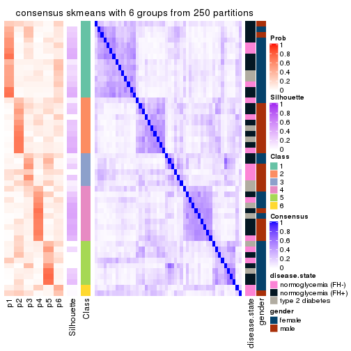</p>

</div>
</div>

Heatmaps for the membership of samples in all partitions to see how consistent they are:


<script>
$( function() {
	$( '#tabs-SD-skmeans-membership-heatmap' ).tabs();
} );
</script>
<div id='tabs-SD-skmeans-membership-heatmap'>
<ul>
<li><a href='#tab-SD-skmeans-membership-heatmap-1'>k = 2</a></li>
<li><a href='#tab-SD-skmeans-membership-heatmap-2'>k = 3</a></li>
<li><a href='#tab-SD-skmeans-membership-heatmap-3'>k = 4</a></li>
<li><a href='#tab-SD-skmeans-membership-heatmap-4'>k = 5</a></li>
<li><a href='#tab-SD-skmeans-membership-heatmap-5'>k = 6</a></li>
</ul>
<div id='tab-SD-skmeans-membership-heatmap-1'>
<pre><code class="r">membership_heatmap(res, k = 2)
</code></pre>

<p>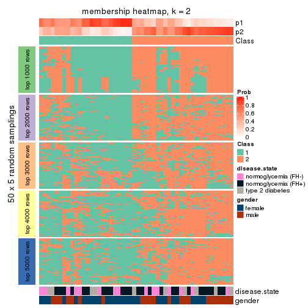</p>

</div>
<div id='tab-SD-skmeans-membership-heatmap-2'>
<pre><code class="r">membership_heatmap(res, k = 3)
</code></pre>

<p></p>

</div>
<div id='tab-SD-skmeans-membership-heatmap-3'>
<pre><code class="r">membership_heatmap(res, k = 4)
</code></pre>

<p></p>

</div>
<div id='tab-SD-skmeans-membership-heatmap-4'>
<pre><code class="r">membership_heatmap(res, k = 5)
</code></pre>

<p></p>

</div>
<div id='tab-SD-skmeans-membership-heatmap-5'>
<pre><code class="r">membership_heatmap(res, k = 6)
</code></pre>

<p></p>

</div>
</div>

As soon as we have had the classes for columns, we can look for signatures
which are significantly different between classes which can be candidate marks
for certain classes. Following are the heatmaps for signatures.


Signature heatmaps where rows are scaled:


<script>
$( function() {
	$( '#tabs-SD-skmeans-get-signatures' ).tabs();
} );
</script>
<div id='tabs-SD-skmeans-get-signatures'>
<ul>
<li><a href='#tab-SD-skmeans-get-signatures-1'>k = 2</a></li>
<li><a href='#tab-SD-skmeans-get-signatures-2'>k = 3</a></li>
<li><a href='#tab-SD-skmeans-get-signatures-3'>k = 4</a></li>
<li><a href='#tab-SD-skmeans-get-signatures-4'>k = 5</a></li>
<li><a href='#tab-SD-skmeans-get-signatures-5'>k = 6</a></li>
</ul>
<div id='tab-SD-skmeans-get-signatures-1'>
<pre><code class="r">get_signatures(res, k = 2)
</code></pre>

<p></p>

</div>
<div id='tab-SD-skmeans-get-signatures-2'>
<pre><code class="r">get_signatures(res, k = 3)
</code></pre>

<p></p>

</div>
<div id='tab-SD-skmeans-get-signatures-3'>
<pre><code class="r">get_signatures(res, k = 4)
</code></pre>

<p></p>

</div>
<div id='tab-SD-skmeans-get-signatures-4'>
<pre><code class="r">get_signatures(res, k = 5)
</code></pre>

<p></p>

</div>
<div id='tab-SD-skmeans-get-signatures-5'>
<pre><code class="r">get_signatures(res, k = 6)
</code></pre>

<p></p>

</div>
</div>


Signature heatmaps where rows are not scaled:


<script>
$( function() {
	$( '#tabs-SD-skmeans-get-signatures-no-scale' ).tabs();
} );
</script>
<div id='tabs-SD-skmeans-get-signatures-no-scale'>
<ul>
<li><a href='#tab-SD-skmeans-get-signatures-no-scale-1'>k = 2</a></li>
<li><a href='#tab-SD-skmeans-get-signatures-no-scale-2'>k = 3</a></li>
<li><a href='#tab-SD-skmeans-get-signatures-no-scale-3'>k = 4</a></li>
<li><a href='#tab-SD-skmeans-get-signatures-no-scale-4'>k = 5</a></li>
<li><a href='#tab-SD-skmeans-get-signatures-no-scale-5'>k = 6</a></li>
</ul>
<div id='tab-SD-skmeans-get-signatures-no-scale-1'>
<pre><code class="r">get_signatures(res, k = 2, scale_rows = FALSE)
</code></pre>

<p></p>

</div>
<div id='tab-SD-skmeans-get-signatures-no-scale-2'>
<pre><code class="r">get_signatures(res, k = 3, scale_rows = FALSE)
</code></pre>

<p></p>

</div>
<div id='tab-SD-skmeans-get-signatures-no-scale-3'>
<pre><code class="r">get_signatures(res, k = 4, scale_rows = FALSE)
</code></pre>

<p></p>

</div>
<div id='tab-SD-skmeans-get-signatures-no-scale-4'>
<pre><code class="r">get_signatures(res, k = 5, scale_rows = FALSE)
</code></pre>

<p></p>

</div>
<div id='tab-SD-skmeans-get-signatures-no-scale-5'>
<pre><code class="r">get_signatures(res, k = 6, scale_rows = FALSE)
</code></pre>

<p></p>

</div>
</div>


Compare the overlap of signatures from different k:

```r
compare_signatures(res)
```


`get_signature()` returns a data frame invisibly. TO get the list of signatures, the function
call should be assigned to a variable explicitly. In following code, if `plot` argument is set
to `FALSE`, no heatmap is plotted while only the differential analysis is performed.

```r
# code only for demonstration
tb = get_signature(res, k = ..., plot = FALSE)
```

An example of the output of `tb` is:

```
#>   which_row         fdr    mean_1    mean_2 scaled_mean_1 scaled_mean_2 km
#> 1        38 0.042760348  8.373488  9.131774    -0.5533452     0.5164555  1
#> 2        40 0.018707592  7.106213  8.469186    -0.6173731     0.5762149  1
#> 3        55 0.019134737 10.221463 11.207825    -0.6159697     0.5749050  1
#> 4        59 0.006059896  5.921854  7.869574    -0.6899429     0.6439467  1
#> 5        60 0.018055526  8.928898 10.211722    -0.6204761     0.5791110  1
#> 6        98 0.009384629 15.714769 14.887706     0.6635654    -0.6193277  2
...
```

The columns in `tb` are:

1. `which_row`: row indices corresponding to the input matrix.
2. `fdr`: FDR for the differential test. 
3. `mean_x`: The mean value in group x.
4. `scaled_mean_x`: The mean value in group x after rows are scaled.
5. `km`: Row groups if k-means clustering is applied to rows.


UMAP plot which shows how samples are separated.


<script>
$( function() {
	$( '#tabs-SD-skmeans-dimension-reduction' ).tabs();
} );
</script>
<div id='tabs-SD-skmeans-dimension-reduction'>
<ul>
<li><a href='#tab-SD-skmeans-dimension-reduction-1'>k = 2</a></li>
<li><a href='#tab-SD-skmeans-dimension-reduction-2'>k = 3</a></li>
<li><a href='#tab-SD-skmeans-dimension-reduction-3'>k = 4</a></li>
<li><a href='#tab-SD-skmeans-dimension-reduction-4'>k = 5</a></li>
<li><a href='#tab-SD-skmeans-dimension-reduction-5'>k = 6</a></li>
</ul>
<div id='tab-SD-skmeans-dimension-reduction-1'>
<pre><code class="r">dimension_reduction(res, k = 2, method = &quot;UMAP&quot;)
</code></pre>

<p></p>

</div>
<div id='tab-SD-skmeans-dimension-reduction-2'>
<pre><code class="r">dimension_reduction(res, k = 3, method = &quot;UMAP&quot;)
</code></pre>

<p></p>

</div>
<div id='tab-SD-skmeans-dimension-reduction-3'>
<pre><code class="r">dimension_reduction(res, k = 4, method = &quot;UMAP&quot;)
</code></pre>

<p></p>

</div>
<div id='tab-SD-skmeans-dimension-reduction-4'>
<pre><code class="r">dimension_reduction(res, k = 5, method = &quot;UMAP&quot;)
</code></pre>

<p>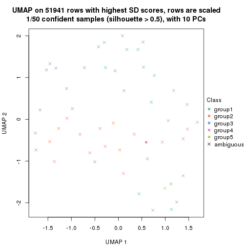</p>

</div>
<div id='tab-SD-skmeans-dimension-reduction-5'>
<pre><code class="r">dimension_reduction(res, k = 6, method = &quot;UMAP&quot;)
</code></pre>

<p></p>

</div>
</div>


Following heatmap shows how subgroups are split when increasing `k`:

```r
collect_classes(res)
```


Test correlation between subgroups and known annotations. If the known
annotation is numeric, one-way ANOVA test is applied, and if the known
annotation is discrete, chi-squared contingency table test is applied.

```r
test_to_known_factors(res)
```

```
#>             n disease.state(p) gender(p) k
#> SD:skmeans 28            0.692   0.00182 2
#> SD:skmeans 13               NA        NA 3
#> SD:skmeans 13            0.164   0.09842 4
#> SD:skmeans  1               NA        NA 5
#> SD:skmeans  0               NA        NA 6
```


If matrix rows can be associated to genes, consider to use `functional_enrichment(res,
...)` to perform function enrichment for the signature genes. See [this vignette](http://bioconductor.org/packages/devel/bioc/vignettes/cola/inst/doc/functional_enrichment.html) for more detailed explanations.


 

---------------------------------------------------


### SD:pam


The object with results only for a single top-value method and a single partition method 
can be extracted as:

```r
res = res_list["SD", "pam"]
# you can also extract it by
# res = res_list["SD:pam"]
```

A summary of `res` and all the functions that can be applied to it:

```r
res
```

```
#> A 'ConsensusPartition' object with k = 2, 3, 4, 5, 6.
#>   On a matrix with 51941 rows and 50 columns.
#>   Top rows (1000, 2000, 3000, 4000, 5000) are extracted by 'SD' method.
#>   Subgroups are detected by 'pam' method.
#>   Performed in total 1250 partitions by row resampling.
#>   Best k for subgroups seems to be 4.
#> 
#> Following methods can be applied to this 'ConsensusPartition' object:
#>  [1] "cola_report"             "collect_classes"         "collect_plots"          
#>  [4] "collect_stats"           "colnames"                "compare_signatures"     
#>  [7] "consensus_heatmap"       "dimension_reduction"     "functional_enrichment"  
#> [10] "get_anno_col"            "get_anno"                "get_classes"            
#> [13] "get_consensus"           "get_matrix"              "get_membership"         
#> [16] "get_param"               "get_signatures"          "get_stats"              
#> [19] "is_best_k"               "is_stable_k"             "membership_heatmap"     
#> [22] "ncol"                    "nrow"                    "plot_ecdf"              
#> [25] "rownames"                "select_partition_number" "show"                   
#> [28] "suggest_best_k"          "test_to_known_factors"
```

`collect_plots()` function collects all the plots made from `res` for all `k` (number of partitions)
into one single page to provide an easy and fast comparison between different `k`.

```r
collect_plots(res)
```


The plots are:

- The first row: a plot of the ECDF (empirical cumulative distribution
  function) curves of the consensus matrix for each `k` and the heatmap of
  predicted classes for each `k`.
- The second row: heatmaps of the consensus matrix for each `k`.
- The third row: heatmaps of the membership matrix for each `k`.
- The fouth row: heatmaps of the signatures for each `k`.

All the plots in panels can be made by individual functions and they are
plotted later in this section.

`select_partition_number()` produces several plots showing different
statistics for choosing "optimized" `k`. There are following statistics:

- ECDF curves of the consensus matrix for each `k`;
- 1-PAC. [The PAC
  score](https://en.wikipedia.org/wiki/Consensus_clustering#Over-interpretation_potential_of_consensus_clustering)
  measures the proportion of the ambiguous subgrouping.
- Mean silhouette score.
- Concordance. The mean probability of fiting the consensus class ids in all
  partitions.
- Area increased. Denote $A_k$ as the area under the ECDF curve for current
  `k`, the area increased is defined as $A_k - A_{k-1}$.
- Rand index. The percent of pairs of samples that are both in a same cluster
  or both are not in a same cluster in the partition of k and k-1.
- Jaccard index. The ratio of pairs of samples are both in a same cluster in
  the partition of k and k-1 and the pairs of samples are both in a same
  cluster in the partition k or k-1.

The detailed explanations of these statistics can be found in [the _cola_
vignette](http://bioconductor.org/packages/devel/bioc/vignettes/cola/inst/doc/cola.html#toc_13).

Generally speaking, lower PAC score, higher mean silhouette score or higher
concordance corresponds to better partition. Rand index and Jaccard index
measure how similar the current partition is compared to partition with `k-1`.
If they are too similar, we won't accept `k` is better than `k-1`.

```r
select_partition_number(res)
```


The numeric values for all these statistics can be obtained by `get_stats()`.

```r
get_stats(res)
```

```
#>   k 1-PAC mean_silhouette concordance area_increased  Rand Jaccard
#> 2 2 0.137           0.400       0.744         0.4538 0.530   0.530
#> 3 3 0.204           0.479       0.740         0.2087 0.782   0.616
#> 4 4 0.258           0.503       0.757         0.0646 0.961   0.901
#> 5 5 0.262           0.491       0.755         0.0487 0.963   0.901
#> 6 6 0.211           0.489       0.740         0.0367 0.971   0.919
```

`suggest_best_k()` suggests the best $k$ based on these statistics. The rules are as follows:

- All $k$ with Jaccard index larger than 0.95 are removed because increasing
  $k$ does not provide enough extra information. If all $k$ are removed, it is
  marked as no subgroup is detected.
- For all $k$ with 1-PAC score larger than 0.9, the maximal $k$ is taken as
  the best $k$, and other $k$ are marked as optional $k$.
- If it does not fit the second rule. The $k$ with the maximal vote of the
  highest 1-PAC score, highest mean silhouette, and highest concordance is
  taken as the best $k$.

```r
suggest_best_k(res)
```

```
#> [1] 4
```


Following shows the table of the partitions (You need to click the **show/hide
code output** link to see it). The membership matrix (columns with name `p*`)
is inferred by
[`clue::cl_consensus()`](https://www.rdocumentation.org/link/cl_consensus?package=clue)
function with the `SE` method. Basically the value in the membership matrix
represents the probability to belong to a certain group. The finall class
label for an item is determined with the group with highest probability it
belongs to.

In `get_classes()` function, the entropy is calculated from the membership
matrix and the silhouette score is calculated from the consensus matrix.


<script>
$( function() {
	$( '#tabs-SD-pam-get-classes' ).tabs();
} );
</script>
<div id='tabs-SD-pam-get-classes'>
<ul>
<li><a href='#tab-SD-pam-get-classes-1'>k = 2</a></li>
<li><a href='#tab-SD-pam-get-classes-2'>k = 3</a></li>
<li><a href='#tab-SD-pam-get-classes-3'>k = 4</a></li>
<li><a href='#tab-SD-pam-get-classes-4'>k = 5</a></li>
<li><a href='#tab-SD-pam-get-classes-5'>k = 6</a></li>
</ul>

<div id='tab-SD-pam-get-classes-1'>
<p><a id='tab-SD-pam-get-classes-1-a' style='color:#0366d6' href='#'>show/hide code output</a></p>
<pre><code class="r">cbind(get_classes(res, k = 2), get_membership(res, k = 2))
</code></pre>

<pre><code>#&gt;           class entropy silhouette    p1    p2
#&gt; GSM624962     1  0.9323     0.4786 0.652 0.348
#&gt; GSM624963     1  0.9427     0.4708 0.640 0.360
#&gt; GSM624967     1  0.9996     0.2575 0.512 0.488
#&gt; GSM624968     2  0.6623     0.5364 0.172 0.828
#&gt; GSM624969     2  0.9775    -0.0485 0.412 0.588
#&gt; GSM624970     1  0.9608     0.1289 0.616 0.384
#&gt; GSM624961     2  0.9170     0.1498 0.332 0.668
#&gt; GSM624964     2  0.0938     0.6651 0.012 0.988
#&gt; GSM624965     2  0.1184     0.6658 0.016 0.984
#&gt; GSM624966     2  0.3431     0.6583 0.064 0.936
#&gt; GSM624925     2  0.9998    -0.2832 0.492 0.508
#&gt; GSM624927     1  0.6712     0.4613 0.824 0.176
#&gt; GSM624929     2  0.2423     0.6640 0.040 0.960
#&gt; GSM624930     1  0.9996    -0.0562 0.512 0.488
#&gt; GSM624931     2  0.7602     0.5182 0.220 0.780
#&gt; GSM624935     2  0.8443     0.3669 0.272 0.728
#&gt; GSM624936     1  0.1633     0.5196 0.976 0.024
#&gt; GSM624937     1  0.9552     0.4634 0.624 0.376
#&gt; GSM624926     2  0.2043     0.6650 0.032 0.968
#&gt; GSM624928     2  0.0938     0.6689 0.012 0.988
#&gt; GSM624932     2  0.9833     0.1411 0.424 0.576
#&gt; GSM624933     2  0.0672     0.6684 0.008 0.992
#&gt; GSM624934     2  0.9248     0.2795 0.340 0.660
#&gt; GSM624971     2  0.5946     0.5822 0.144 0.856
#&gt; GSM624973     2  0.6531     0.5165 0.168 0.832
#&gt; GSM624938     1  0.9427     0.4685 0.640 0.360
#&gt; GSM624940     1  0.1843     0.5171 0.972 0.028
#&gt; GSM624941     1  0.5178     0.5305 0.884 0.116
#&gt; GSM624942     1  0.9866     0.3089 0.568 0.432
#&gt; GSM624943     2  0.9909    -0.0848 0.444 0.556
#&gt; GSM624945     2  0.5408     0.6045 0.124 0.876
#&gt; GSM624946     1  0.9522     0.4145 0.628 0.372
#&gt; GSM624949     2  0.9248     0.2280 0.340 0.660
#&gt; GSM624951     1  0.2603     0.5121 0.956 0.044
#&gt; GSM624952     1  0.8763     0.5144 0.704 0.296
#&gt; GSM624955     2  0.9998    -0.2817 0.492 0.508
#&gt; GSM624956     1  0.9866     0.3607 0.568 0.432
#&gt; GSM624957     1  0.9977     0.0522 0.528 0.472
#&gt; GSM624974     2  0.9635     0.1996 0.388 0.612
#&gt; GSM624939     2  0.9248     0.2705 0.340 0.660
#&gt; GSM624944     2  0.3431     0.6482 0.064 0.936
#&gt; GSM624947     2  0.5737     0.5854 0.136 0.864
#&gt; GSM624948     1  0.9998     0.2719 0.508 0.492
#&gt; GSM624950     2  0.2948     0.6609 0.052 0.948
#&gt; GSM624953     2  0.0000     0.6678 0.000 1.000
#&gt; GSM624954     2  0.0938     0.6679 0.012 0.988
#&gt; GSM624958     2  0.0376     0.6685 0.004 0.996
#&gt; GSM624959     2  0.2043     0.6671 0.032 0.968
#&gt; GSM624960     2  0.9998    -0.2659 0.492 0.508
#&gt; GSM624972     2  0.0000     0.6678 0.000 1.000
</code></pre>

<script>
$('#tab-SD-pam-get-classes-1-a').parent().next().next().hide();
$('#tab-SD-pam-get-classes-1-a').click(function(){
  $('#tab-SD-pam-get-classes-1-a').parent().next().next().toggle();
  return(false);
});
</script>
</div>

<div id='tab-SD-pam-get-classes-2'>
<p><a id='tab-SD-pam-get-classes-2-a' style='color:#0366d6' href='#'>show/hide code output</a></p>
<pre><code class="r">cbind(get_classes(res, k = 3), get_membership(res, k = 3))
</code></pre>

<pre><code>#&gt;           class entropy silhouette    p1    p2    p3
#&gt; GSM624962     3  0.7124     0.6753 0.056 0.272 0.672
#&gt; GSM624963     3  0.7097     0.6757 0.052 0.280 0.668
#&gt; GSM624967     3  0.6286     0.5349 0.000 0.464 0.536
#&gt; GSM624968     2  0.4399     0.5432 0.000 0.812 0.188
#&gt; GSM624969     2  0.6617    -0.3287 0.008 0.556 0.436
#&gt; GSM624970     1  0.2810     0.6637 0.928 0.036 0.036
#&gt; GSM624961     2  0.5926    -0.0251 0.000 0.644 0.356
#&gt; GSM624964     2  0.0424     0.7167 0.008 0.992 0.000
#&gt; GSM624965     2  0.1315     0.7158 0.008 0.972 0.020
#&gt; GSM624966     2  0.3434     0.6910 0.032 0.904 0.064
#&gt; GSM624925     3  0.6302     0.5064 0.000 0.480 0.520
#&gt; GSM624927     1  0.6510     0.6459 0.756 0.088 0.156
#&gt; GSM624929     2  0.4349     0.6324 0.128 0.852 0.020
#&gt; GSM624930     1  0.3682     0.6806 0.876 0.116 0.008
#&gt; GSM624931     2  0.7044     0.4843 0.168 0.724 0.108
#&gt; GSM624935     2  0.5656     0.3030 0.004 0.712 0.284
#&gt; GSM624936     3  0.6816    -0.1983 0.472 0.012 0.516
#&gt; GSM624937     3  0.7536    -0.1364 0.292 0.068 0.640
#&gt; GSM624926     2  0.1643     0.7096 0.000 0.956 0.044
#&gt; GSM624928     2  0.0661     0.7176 0.004 0.988 0.008
#&gt; GSM624932     2  0.7993    -0.2993 0.456 0.484 0.060
#&gt; GSM624933     2  0.0237     0.7172 0.000 0.996 0.004
#&gt; GSM624934     2  0.6672    -0.2644 0.472 0.520 0.008
#&gt; GSM624971     2  0.5344     0.6046 0.084 0.824 0.092
#&gt; GSM624973     2  0.4842     0.5028 0.224 0.776 0.000
#&gt; GSM624938     3  0.7523     0.6606 0.080 0.260 0.660
#&gt; GSM624940     1  0.5406     0.6165 0.764 0.012 0.224
#&gt; GSM624941     1  0.7222     0.5604 0.684 0.072 0.244
#&gt; GSM624942     1  0.8939     0.2448 0.520 0.340 0.140
#&gt; GSM624943     2  0.8995    -0.0349 0.372 0.492 0.136
#&gt; GSM624945     2  0.3340     0.6485 0.000 0.880 0.120
#&gt; GSM624946     3  0.8479     0.5583 0.120 0.300 0.580
#&gt; GSM624949     2  0.6204    -0.1448 0.000 0.576 0.424
#&gt; GSM624951     1  0.3846     0.6625 0.876 0.016 0.108
#&gt; GSM624952     3  0.7569     0.6628 0.092 0.240 0.668
#&gt; GSM624955     3  0.6291     0.5298 0.000 0.468 0.532
#&gt; GSM624956     3  0.6228     0.6631 0.012 0.316 0.672
#&gt; GSM624957     1  0.9241     0.3683 0.456 0.388 0.156
#&gt; GSM624974     1  0.5690     0.6029 0.708 0.288 0.004
#&gt; GSM624939     1  0.6678     0.2745 0.512 0.480 0.008
#&gt; GSM624944     2  0.2301     0.6980 0.004 0.936 0.060
#&gt; GSM624947     2  0.4062     0.5910 0.000 0.836 0.164
#&gt; GSM624948     3  0.7366     0.5522 0.032 0.444 0.524
#&gt; GSM624950     2  0.2550     0.7062 0.024 0.936 0.040
#&gt; GSM624953     2  0.0424     0.7176 0.000 0.992 0.008
#&gt; GSM624954     2  0.0237     0.7168 0.000 0.996 0.004
#&gt; GSM624958     2  0.0475     0.7176 0.004 0.992 0.004
#&gt; GSM624959     2  0.1525     0.7153 0.004 0.964 0.032
#&gt; GSM624960     3  0.6305     0.4840 0.000 0.484 0.516
#&gt; GSM624972     2  0.0424     0.7169 0.000 0.992 0.008
</code></pre>

<script>
$('#tab-SD-pam-get-classes-2-a').parent().next().next().hide();
$('#tab-SD-pam-get-classes-2-a').click(function(){
  $('#tab-SD-pam-get-classes-2-a').parent().next().next().toggle();
  return(false);
});
</script>
</div>

<div id='tab-SD-pam-get-classes-3'>
<p><a id='tab-SD-pam-get-classes-3-a' style='color:#0366d6' href='#'>show/hide code output</a></p>
<pre><code class="r">cbind(get_classes(res, k = 4), get_membership(res, k = 4))
</code></pre>

<pre><code>#&gt;           class entropy silhouette    p1    p2    p3    p4
#&gt; GSM624962     4  0.4761     0.7179 0.044 0.192 0.000 0.764
#&gt; GSM624963     4  0.4887     0.7236 0.036 0.204 0.004 0.756
#&gt; GSM624967     4  0.5126     0.5457 0.000 0.444 0.004 0.552
#&gt; GSM624968     2  0.3444     0.5937 0.000 0.816 0.000 0.184
#&gt; GSM624969     2  0.5415    -0.2741 0.008 0.552 0.004 0.436
#&gt; GSM624970     1  0.5027     0.2662 0.752 0.008 0.036 0.204
#&gt; GSM624961     2  0.5055    -0.0234 0.000 0.624 0.008 0.368
#&gt; GSM624964     2  0.0469     0.7410 0.000 0.988 0.012 0.000
#&gt; GSM624965     2  0.1697     0.7390 0.004 0.952 0.016 0.028
#&gt; GSM624966     2  0.3174     0.7058 0.028 0.888 0.008 0.076
#&gt; GSM624925     4  0.4981     0.5118 0.000 0.464 0.000 0.536
#&gt; GSM624927     1  0.5104     0.5417 0.772 0.068 0.008 0.152
#&gt; GSM624929     2  0.3400     0.6737 0.128 0.856 0.004 0.012
#&gt; GSM624930     1  0.2586     0.5502 0.900 0.092 0.004 0.004
#&gt; GSM624931     2  0.5575     0.5535 0.156 0.736 0.004 0.104
#&gt; GSM624935     2  0.4955     0.3862 0.004 0.708 0.016 0.272
#&gt; GSM624936     4  0.5201     0.0329 0.400 0.004 0.004 0.592
#&gt; GSM624937     3  0.1610     0.0000 0.032 0.000 0.952 0.016
#&gt; GSM624926     2  0.1302     0.7378 0.000 0.956 0.000 0.044
#&gt; GSM624928     2  0.0859     0.7427 0.004 0.980 0.008 0.008
#&gt; GSM624932     1  0.6506     0.3303 0.480 0.460 0.008 0.052
#&gt; GSM624933     2  0.0336     0.7417 0.000 0.992 0.008 0.000
#&gt; GSM624934     2  0.5679    -0.3520 0.488 0.492 0.016 0.004
#&gt; GSM624971     2  0.5159     0.5669 0.064 0.772 0.012 0.152
#&gt; GSM624973     2  0.4284     0.4873 0.224 0.764 0.012 0.000
#&gt; GSM624938     4  0.4979     0.6770 0.064 0.176 0.000 0.760
#&gt; GSM624940     1  0.3945     0.5142 0.780 0.004 0.000 0.216
#&gt; GSM624941     1  0.5417     0.5075 0.704 0.056 0.000 0.240
#&gt; GSM624942     1  0.6893     0.3574 0.564 0.300 0.000 0.136
#&gt; GSM624943     2  0.7101     0.0707 0.360 0.504 0.000 0.136
#&gt; GSM624945     2  0.3032     0.6798 0.000 0.868 0.008 0.124
#&gt; GSM624946     4  0.6103     0.5855 0.084 0.228 0.008 0.680
#&gt; GSM624949     2  0.5388    -0.1955 0.000 0.532 0.012 0.456
#&gt; GSM624951     1  0.2342     0.5216 0.912 0.008 0.000 0.080
#&gt; GSM624952     4  0.5030     0.7124 0.060 0.188 0.000 0.752
#&gt; GSM624955     4  0.4907     0.5828 0.000 0.420 0.000 0.580
#&gt; GSM624956     4  0.4188     0.7159 0.004 0.244 0.000 0.752
#&gt; GSM624957     1  0.7704     0.3591 0.440 0.364 0.004 0.192
#&gt; GSM624974     1  0.4567     0.5587 0.716 0.276 0.008 0.000
#&gt; GSM624939     1  0.5728     0.4056 0.544 0.432 0.020 0.004
#&gt; GSM624944     2  0.2156     0.7269 0.004 0.928 0.008 0.060
#&gt; GSM624947     2  0.3219     0.6323 0.000 0.836 0.000 0.164
#&gt; GSM624948     4  0.5953     0.5686 0.020 0.420 0.012 0.548
#&gt; GSM624950     2  0.2284     0.7322 0.020 0.932 0.012 0.036
#&gt; GSM624953     2  0.0657     0.7428 0.000 0.984 0.004 0.012
#&gt; GSM624954     2  0.0657     0.7439 0.000 0.984 0.012 0.004
#&gt; GSM624958     2  0.0524     0.7417 0.004 0.988 0.008 0.000
#&gt; GSM624959     2  0.1892     0.7398 0.004 0.944 0.016 0.036
#&gt; GSM624960     4  0.5143     0.4988 0.000 0.456 0.004 0.540
#&gt; GSM624972     2  0.0336     0.7420 0.000 0.992 0.000 0.008
</code></pre>

<script>
$('#tab-SD-pam-get-classes-3-a').parent().next().next().hide();
$('#tab-SD-pam-get-classes-3-a').click(function(){
  $('#tab-SD-pam-get-classes-3-a').parent().next().next().toggle();
  return(false);
});
</script>
</div>

<div id='tab-SD-pam-get-classes-4'>
<p><a id='tab-SD-pam-get-classes-4-a' style='color:#0366d6' href='#'>show/hide code output</a></p>
<pre><code class="r">cbind(get_classes(res, k = 5), get_membership(res, k = 5))
</code></pre>

<pre><code>#&gt;           class entropy silhouette    p1    p2 p3    p4    p5
#&gt; GSM624962     4  0.4125     0.6722 0.056 0.172  0 0.772 0.000
#&gt; GSM624963     4  0.4270     0.6803 0.040 0.188  0 0.764 0.008
#&gt; GSM624967     4  0.5229     0.4338 0.004 0.432  0 0.528 0.036
#&gt; GSM624968     2  0.3003     0.6197 0.000 0.812  0 0.188 0.000
#&gt; GSM624969     2  0.4714    -0.0532 0.012 0.576  0 0.408 0.004
#&gt; GSM624970     5  0.3554     0.0000 0.216 0.004  0 0.004 0.776
#&gt; GSM624961     2  0.4836     0.1643 0.000 0.628  0 0.336 0.036
#&gt; GSM624964     2  0.0771     0.7537 0.000 0.976  0 0.004 0.020
#&gt; GSM624965     2  0.2067     0.7461 0.004 0.924  0 0.028 0.044
#&gt; GSM624966     2  0.3182     0.7071 0.028 0.864  0 0.092 0.016
#&gt; GSM624925     4  0.4305     0.3339 0.000 0.488  0 0.512 0.000
#&gt; GSM624927     1  0.4815     0.3834 0.768 0.064  0 0.124 0.044
#&gt; GSM624929     2  0.3053     0.6911 0.128 0.852  0 0.012 0.008
#&gt; GSM624930     1  0.1883     0.4030 0.932 0.048  0 0.008 0.012
#&gt; GSM624931     2  0.4878     0.5681 0.164 0.728  0 0.104 0.004
#&gt; GSM624935     2  0.4774     0.4214 0.004 0.688  0 0.264 0.044
#&gt; GSM624936     4  0.4599     0.1110 0.384 0.000  0 0.600 0.016
#&gt; GSM624937     3  0.0000     0.0000 0.000 0.000  1 0.000 0.000
#&gt; GSM624926     2  0.1121     0.7529 0.000 0.956  0 0.044 0.000
#&gt; GSM624928     2  0.0613     0.7558 0.004 0.984  0 0.004 0.008
#&gt; GSM624932     1  0.5921     0.4481 0.504 0.420  0 0.052 0.024
#&gt; GSM624933     2  0.0290     0.7548 0.000 0.992  0 0.000 0.008
#&gt; GSM624934     1  0.5366     0.3750 0.492 0.464  0 0.008 0.036
#&gt; GSM624971     2  0.5731     0.3961 0.072 0.660  0 0.232 0.036
#&gt; GSM624973     2  0.4141     0.4097 0.248 0.728  0 0.000 0.024
#&gt; GSM624938     4  0.4943     0.5475 0.060 0.112  0 0.764 0.064
#&gt; GSM624940     1  0.2852     0.3871 0.828 0.000  0 0.172 0.000
#&gt; GSM624941     1  0.4712     0.4010 0.724 0.064  0 0.208 0.004
#&gt; GSM624942     1  0.5885     0.3402 0.572 0.296  0 0.132 0.000
#&gt; GSM624943     2  0.6218     0.0469 0.364 0.488  0 0.148 0.000
#&gt; GSM624945     2  0.2825     0.7000 0.000 0.860  0 0.124 0.016
#&gt; GSM624946     4  0.5749     0.4889 0.060 0.168  0 0.692 0.080
#&gt; GSM624949     2  0.4743    -0.1792 0.000 0.512  0 0.472 0.016
#&gt; GSM624951     1  0.1121     0.3651 0.956 0.000  0 0.044 0.000
#&gt; GSM624952     4  0.4276     0.6674 0.068 0.168  0 0.764 0.000
#&gt; GSM624955     4  0.5559     0.5606 0.004 0.304  0 0.608 0.084
#&gt; GSM624956     4  0.3579     0.6683 0.004 0.240  0 0.756 0.000
#&gt; GSM624957     1  0.6898     0.2966 0.444 0.328  0 0.216 0.012
#&gt; GSM624974     1  0.3934     0.5056 0.740 0.244  0 0.000 0.016
#&gt; GSM624939     1  0.5118     0.4734 0.584 0.376  0 0.004 0.036
#&gt; GSM624944     2  0.2381     0.7389 0.004 0.908  0 0.052 0.036
#&gt; GSM624947     2  0.2970     0.6526 0.000 0.828  0 0.168 0.004
#&gt; GSM624948     4  0.5745     0.4074 0.020 0.440  0 0.496 0.044
#&gt; GSM624950     2  0.2053     0.7471 0.016 0.928  0 0.040 0.016
#&gt; GSM624953     2  0.0798     0.7555 0.000 0.976  0 0.016 0.008
#&gt; GSM624954     2  0.0833     0.7567 0.004 0.976  0 0.004 0.016
#&gt; GSM624958     2  0.0566     0.7536 0.004 0.984  0 0.000 0.012
#&gt; GSM624959     2  0.2227     0.7462 0.004 0.916  0 0.032 0.048
#&gt; GSM624960     4  0.5219     0.4314 0.016 0.420  0 0.544 0.020
#&gt; GSM624972     2  0.0404     0.7543 0.000 0.988  0 0.012 0.000
</code></pre>

<script>
$('#tab-SD-pam-get-classes-4-a').parent().next().next().hide();
$('#tab-SD-pam-get-classes-4-a').click(function(){
  $('#tab-SD-pam-get-classes-4-a').parent().next().next().toggle();
  return(false);
});
</script>
</div>

<div id='tab-SD-pam-get-classes-5'>
<p><a id='tab-SD-pam-get-classes-5-a' style='color:#0366d6' href='#'>show/hide code output</a></p>
<pre><code class="r">cbind(get_classes(res, k = 6), get_membership(res, k = 6))
</code></pre>

<pre><code>#&gt;           class entropy silhouette    p1    p2    p3 p4    p5    p6
#&gt; GSM624962     3  0.3712     0.6484 0.052 0.180 0.768  0 0.000 0.000
#&gt; GSM624963     3  0.4241     0.6503 0.036 0.192 0.748  0 0.012 0.012
#&gt; GSM624967     3  0.5833     0.3307 0.008 0.376 0.512  0 0.028 0.076
#&gt; GSM624968     2  0.2730     0.6427 0.000 0.808 0.192  0 0.000 0.000
#&gt; GSM624969     2  0.4234     0.1785 0.012 0.576 0.408  0 0.004 0.000
#&gt; GSM624970     5  0.1700     0.0000 0.080 0.004 0.000  0 0.916 0.000
#&gt; GSM624961     2  0.4546     0.3560 0.000 0.644 0.312  0 0.024 0.020
#&gt; GSM624964     2  0.0692     0.7452 0.000 0.976 0.004  0 0.000 0.020
#&gt; GSM624965     2  0.2026     0.7415 0.004 0.924 0.020  0 0.024 0.028
#&gt; GSM624966     2  0.2807     0.7070 0.028 0.868 0.088  0 0.000 0.016
#&gt; GSM624925     2  0.3869    -0.1306 0.000 0.500 0.500  0 0.000 0.000
#&gt; GSM624927     1  0.4882     0.4836 0.752 0.064 0.112  0 0.036 0.036
#&gt; GSM624929     2  0.3008     0.6961 0.120 0.848 0.012  0 0.008 0.012
#&gt; GSM624930     1  0.1973     0.5041 0.924 0.036 0.004  0 0.008 0.028
#&gt; GSM624931     2  0.4550     0.5931 0.160 0.728 0.100  0 0.004 0.008
#&gt; GSM624935     2  0.4608     0.4967 0.004 0.684 0.256  0 0.040 0.016
#&gt; GSM624936     3  0.4718     0.1238 0.384 0.000 0.572  0 0.008 0.036
#&gt; GSM624937     4  0.0000     0.0000 0.000 0.000 0.000  1 0.000 0.000
#&gt; GSM624926     2  0.1007     0.7479 0.000 0.956 0.044  0 0.000 0.000
#&gt; GSM624928     2  0.0696     0.7479 0.004 0.980 0.004  0 0.008 0.004
#&gt; GSM624932     1  0.5407     0.4901 0.520 0.404 0.048  0 0.008 0.020
#&gt; GSM624933     2  0.0508     0.7476 0.000 0.984 0.000  0 0.004 0.012
#&gt; GSM624934     1  0.5214     0.4355 0.512 0.428 0.008  0 0.024 0.028
#&gt; GSM624971     2  0.5516     0.2761 0.028 0.608 0.260  0 0.000 0.104
#&gt; GSM624973     2  0.3789     0.3783 0.260 0.716 0.000  0 0.000 0.024
#&gt; GSM624938     3  0.5044     0.3970 0.028 0.076 0.696  0 0.008 0.192
#&gt; GSM624940     1  0.3236     0.4773 0.820 0.000 0.140  0 0.004 0.036
#&gt; GSM624941     1  0.4489     0.4852 0.724 0.064 0.196  0 0.004 0.012
#&gt; GSM624942     1  0.5282     0.3306 0.584 0.296 0.116  0 0.000 0.004
#&gt; GSM624943     2  0.5778     0.1228 0.368 0.496 0.124  0 0.004 0.008
#&gt; GSM624945     2  0.2834     0.7049 0.000 0.848 0.128  0 0.008 0.016
#&gt; GSM624946     3  0.5576     0.3471 0.032 0.108 0.644  0 0.008 0.208
#&gt; GSM624949     2  0.4381     0.0158 0.000 0.524 0.456  0 0.004 0.016
#&gt; GSM624951     1  0.0935     0.4780 0.964 0.000 0.032  0 0.000 0.004
#&gt; GSM624952     3  0.3819     0.6440 0.064 0.172 0.764  0 0.000 0.000
#&gt; GSM624955     3  0.5681     0.3697 0.000 0.156 0.428  0 0.000 0.416
#&gt; GSM624956     3  0.3189     0.6148 0.004 0.236 0.760  0 0.000 0.000
#&gt; GSM624957     1  0.6738     0.3013 0.436 0.312 0.212  0 0.012 0.028
#&gt; GSM624974     1  0.3786     0.5724 0.748 0.220 0.000  0 0.008 0.024
#&gt; GSM624939     1  0.4671     0.5347 0.608 0.344 0.000  0 0.008 0.040
#&gt; GSM624944     2  0.2859     0.7251 0.008 0.880 0.056  0 0.032 0.024
#&gt; GSM624947     2  0.2700     0.6825 0.000 0.836 0.156  0 0.004 0.004
#&gt; GSM624948     3  0.5594     0.1922 0.020 0.444 0.476  0 0.032 0.028
#&gt; GSM624950     2  0.1844     0.7404 0.016 0.928 0.040  0 0.000 0.016
#&gt; GSM624953     2  0.0717     0.7479 0.000 0.976 0.016  0 0.000 0.008
#&gt; GSM624954     2  0.0748     0.7486 0.004 0.976 0.004  0 0.016 0.000
#&gt; GSM624958     2  0.0665     0.7460 0.004 0.980 0.000  0 0.008 0.008
#&gt; GSM624959     2  0.2570     0.7363 0.004 0.896 0.032  0 0.036 0.032
#&gt; GSM624960     3  0.6681     0.4071 0.016 0.300 0.468  0 0.028 0.188
#&gt; GSM624972     2  0.0363     0.7463 0.000 0.988 0.012  0 0.000 0.000
</code></pre>

<script>
$('#tab-SD-pam-get-classes-5-a').parent().next().next().hide();
$('#tab-SD-pam-get-classes-5-a').click(function(){
  $('#tab-SD-pam-get-classes-5-a').parent().next().next().toggle();
  return(false);
});
</script>
</div>
</div>

Heatmaps for the consensus matrix. It visualizes the probability of two
samples to be in a same group.


<script>
$( function() {
	$( '#tabs-SD-pam-consensus-heatmap' ).tabs();
} );
</script>
<div id='tabs-SD-pam-consensus-heatmap'>
<ul>
<li><a href='#tab-SD-pam-consensus-heatmap-1'>k = 2</a></li>
<li><a href='#tab-SD-pam-consensus-heatmap-2'>k = 3</a></li>
<li><a href='#tab-SD-pam-consensus-heatmap-3'>k = 4</a></li>
<li><a href='#tab-SD-pam-consensus-heatmap-4'>k = 5</a></li>
<li><a href='#tab-SD-pam-consensus-heatmap-5'>k = 6</a></li>
</ul>
<div id='tab-SD-pam-consensus-heatmap-1'>
<pre><code class="r">consensus_heatmap(res, k = 2)
</code></pre>

<p></p>

</div>
<div id='tab-SD-pam-consensus-heatmap-2'>
<pre><code class="r">consensus_heatmap(res, k = 3)
</code></pre>

<p></p>

</div>
<div id='tab-SD-pam-consensus-heatmap-3'>
<pre><code class="r">consensus_heatmap(res, k = 4)
</code></pre>

<p></p>

</div>
<div id='tab-SD-pam-consensus-heatmap-4'>
<pre><code class="r">consensus_heatmap(res, k = 5)
</code></pre>

<p></p>

</div>
<div id='tab-SD-pam-consensus-heatmap-5'>
<pre><code class="r">consensus_heatmap(res, k = 6)
</code></pre>

<p></p>

</div>
</div>

Heatmaps for the membership of samples in all partitions to see how consistent they are:


<script>
$( function() {
	$( '#tabs-SD-pam-membership-heatmap' ).tabs();
} );
</script>
<div id='tabs-SD-pam-membership-heatmap'>
<ul>
<li><a href='#tab-SD-pam-membership-heatmap-1'>k = 2</a></li>
<li><a href='#tab-SD-pam-membership-heatmap-2'>k = 3</a></li>
<li><a href='#tab-SD-pam-membership-heatmap-3'>k = 4</a></li>
<li><a href='#tab-SD-pam-membership-heatmap-4'>k = 5</a></li>
<li><a href='#tab-SD-pam-membership-heatmap-5'>k = 6</a></li>
</ul>
<div id='tab-SD-pam-membership-heatmap-1'>
<pre><code class="r">membership_heatmap(res, k = 2)
</code></pre>

<p></p>

</div>
<div id='tab-SD-pam-membership-heatmap-2'>
<pre><code class="r">membership_heatmap(res, k = 3)
</code></pre>

<p></p>

</div>
<div id='tab-SD-pam-membership-heatmap-3'>
<pre><code class="r">membership_heatmap(res, k = 4)
</code></pre>

<p></p>

</div>
<div id='tab-SD-pam-membership-heatmap-4'>
<pre><code class="r">membership_heatmap(res, k = 5)
</code></pre>

<p></p>

</div>
<div id='tab-SD-pam-membership-heatmap-5'>
<pre><code class="r">membership_heatmap(res, k = 6)
</code></pre>

<p></p>

</div>
</div>

As soon as we have had the classes for columns, we can look for signatures
which are significantly different between classes which can be candidate marks
for certain classes. Following are the heatmaps for signatures.


Signature heatmaps where rows are scaled:


<script>
$( function() {
	$( '#tabs-SD-pam-get-signatures' ).tabs();
} );
</script>
<div id='tabs-SD-pam-get-signatures'>
<ul>
<li><a href='#tab-SD-pam-get-signatures-1'>k = 2</a></li>
<li><a href='#tab-SD-pam-get-signatures-2'>k = 3</a></li>
<li><a href='#tab-SD-pam-get-signatures-3'>k = 4</a></li>
<li><a href='#tab-SD-pam-get-signatures-4'>k = 5</a></li>
<li><a href='#tab-SD-pam-get-signatures-5'>k = 6</a></li>
</ul>
<div id='tab-SD-pam-get-signatures-1'>
<pre><code class="r">get_signatures(res, k = 2)
</code></pre>

<p></p>

</div>
<div id='tab-SD-pam-get-signatures-2'>
<pre><code class="r">get_signatures(res, k = 3)
</code></pre>

<p></p>

</div>
<div id='tab-SD-pam-get-signatures-3'>
<pre><code class="r">get_signatures(res, k = 4)
</code></pre>

<p></p>

</div>
<div id='tab-SD-pam-get-signatures-4'>
<pre><code class="r">get_signatures(res, k = 5)
</code></pre>

<p></p>

</div>
<div id='tab-SD-pam-get-signatures-5'>
<pre><code class="r">get_signatures(res, k = 6)
</code></pre>

<p></p>

</div>
</div>


Signature heatmaps where rows are not scaled:


<script>
$( function() {
	$( '#tabs-SD-pam-get-signatures-no-scale' ).tabs();
} );
</script>
<div id='tabs-SD-pam-get-signatures-no-scale'>
<ul>
<li><a href='#tab-SD-pam-get-signatures-no-scale-1'>k = 2</a></li>
<li><a href='#tab-SD-pam-get-signatures-no-scale-2'>k = 3</a></li>
<li><a href='#tab-SD-pam-get-signatures-no-scale-3'>k = 4</a></li>
<li><a href='#tab-SD-pam-get-signatures-no-scale-4'>k = 5</a></li>
<li><a href='#tab-SD-pam-get-signatures-no-scale-5'>k = 6</a></li>
</ul>
<div id='tab-SD-pam-get-signatures-no-scale-1'>
<pre><code class="r">get_signatures(res, k = 2, scale_rows = FALSE)
</code></pre>

<p></p>

</div>
<div id='tab-SD-pam-get-signatures-no-scale-2'>
<pre><code class="r">get_signatures(res, k = 3, scale_rows = FALSE)
</code></pre>

<p></p>

</div>
<div id='tab-SD-pam-get-signatures-no-scale-3'>
<pre><code class="r">get_signatures(res, k = 4, scale_rows = FALSE)
</code></pre>

<p></p>

</div>
<div id='tab-SD-pam-get-signatures-no-scale-4'>
<pre><code class="r">get_signatures(res, k = 5, scale_rows = FALSE)
</code></pre>

<p></p>

</div>
<div id='tab-SD-pam-get-signatures-no-scale-5'>
<pre><code class="r">get_signatures(res, k = 6, scale_rows = FALSE)
</code></pre>

<p></p>

</div>
</div>


Compare the overlap of signatures from different k:

```r
compare_signatures(res)
```


`get_signature()` returns a data frame invisibly. TO get the list of signatures, the function
call should be assigned to a variable explicitly. In following code, if `plot` argument is set
to `FALSE`, no heatmap is plotted while only the differential analysis is performed.

```r
# code only for demonstration
tb = get_signature(res, k = ..., plot = FALSE)
```

An example of the output of `tb` is:

```
#>   which_row         fdr    mean_1    mean_2 scaled_mean_1 scaled_mean_2 km
#> 1        38 0.042760348  8.373488  9.131774    -0.5533452     0.5164555  1
#> 2        40 0.018707592  7.106213  8.469186    -0.6173731     0.5762149  1
#> 3        55 0.019134737 10.221463 11.207825    -0.6159697     0.5749050  1
#> 4        59 0.006059896  5.921854  7.869574    -0.6899429     0.6439467  1
#> 5        60 0.018055526  8.928898 10.211722    -0.6204761     0.5791110  1
#> 6        98 0.009384629 15.714769 14.887706     0.6635654    -0.6193277  2
...
```

The columns in `tb` are:

1. `which_row`: row indices corresponding to the input matrix.
2. `fdr`: FDR for the differential test. 
3. `mean_x`: The mean value in group x.
4. `scaled_mean_x`: The mean value in group x after rows are scaled.
5. `km`: Row groups if k-means clustering is applied to rows.


UMAP plot which shows how samples are separated.


<script>
$( function() {
	$( '#tabs-SD-pam-dimension-reduction' ).tabs();
} );
</script>
<div id='tabs-SD-pam-dimension-reduction'>
<ul>
<li><a href='#tab-SD-pam-dimension-reduction-1'>k = 2</a></li>
<li><a href='#tab-SD-pam-dimension-reduction-2'>k = 3</a></li>
<li><a href='#tab-SD-pam-dimension-reduction-3'>k = 4</a></li>
<li><a href='#tab-SD-pam-dimension-reduction-4'>k = 5</a></li>
<li><a href='#tab-SD-pam-dimension-reduction-5'>k = 6</a></li>
</ul>
<div id='tab-SD-pam-dimension-reduction-1'>
<pre><code class="r">dimension_reduction(res, k = 2, method = &quot;UMAP&quot;)
</code></pre>

<p></p>

</div>
<div id='tab-SD-pam-dimension-reduction-2'>
<pre><code class="r">dimension_reduction(res, k = 3, method = &quot;UMAP&quot;)
</code></pre>

<p></p>

</div>
<div id='tab-SD-pam-dimension-reduction-3'>
<pre><code class="r">dimension_reduction(res, k = 4, method = &quot;UMAP&quot;)
</code></pre>

<p></p>

</div>
<div id='tab-SD-pam-dimension-reduction-4'>
<pre><code class="r">dimension_reduction(res, k = 5, method = &quot;UMAP&quot;)
</code></pre>

<p></p>

</div>
<div id='tab-SD-pam-dimension-reduction-5'>
<pre><code class="r">dimension_reduction(res, k = 6, method = &quot;UMAP&quot;)
</code></pre>

<p></p>

</div>
</div>


Following heatmap shows how subgroups are split when increasing `k`:

```r
collect_classes(res)
```


Test correlation between subgroups and known annotations. If the known
annotation is numeric, one-way ANOVA test is applied, and if the known
annotation is discrete, chi-squared contingency table test is applied.

```r
test_to_known_factors(res)
```

```
#>         n disease.state(p) gender(p) k
#> SD:pam 25            0.329  4.92e-03 2
#> SD:pam 36            0.740  1.47e-05 3
#> SD:pam 35            0.484  8.92e-05 4
#> SD:pam 25            0.556  2.06e-03 5
#> SD:pam 25            0.527  9.76e-03 6
```


If matrix rows can be associated to genes, consider to use `functional_enrichment(res,
...)` to perform function enrichment for the signature genes. See [this vignette](http://bioconductor.org/packages/devel/bioc/vignettes/cola/inst/doc/functional_enrichment.html) for more detailed explanations.


 

---------------------------------------------------


### SD:mclust


The object with results only for a single top-value method and a single partition method 
can be extracted as:

```r
res = res_list["SD", "mclust"]
# you can also extract it by
# res = res_list["SD:mclust"]
```

A summary of `res` and all the functions that can be applied to it:

```r
res
```

```
#> A 'ConsensusPartition' object with k = 2, 3, 4, 5, 6.
#>   On a matrix with 51941 rows and 50 columns.
#>   Top rows (1000, 2000, 3000, 4000, 5000) are extracted by 'SD' method.
#>   Subgroups are detected by 'mclust' method.
#>   Performed in total 1250 partitions by row resampling.
#>   Best k for subgroups seems to be 4.
#> 
#> Following methods can be applied to this 'ConsensusPartition' object:
#>  [1] "cola_report"             "collect_classes"         "collect_plots"          
#>  [4] "collect_stats"           "colnames"                "compare_signatures"     
#>  [7] "consensus_heatmap"       "dimension_reduction"     "functional_enrichment"  
#> [10] "get_anno_col"            "get_anno"                "get_classes"            
#> [13] "get_consensus"           "get_matrix"              "get_membership"         
#> [16] "get_param"               "get_signatures"          "get_stats"              
#> [19] "is_best_k"               "is_stable_k"             "membership_heatmap"     
#> [22] "ncol"                    "nrow"                    "plot_ecdf"              
#> [25] "rownames"                "select_partition_number" "show"                   
#> [28] "suggest_best_k"          "test_to_known_factors"
```

`collect_plots()` function collects all the plots made from `res` for all `k` (number of partitions)
into one single page to provide an easy and fast comparison between different `k`.

```r
collect_plots(res)
```


The plots are:

- The first row: a plot of the ECDF (empirical cumulative distribution
  function) curves of the consensus matrix for each `k` and the heatmap of
  predicted classes for each `k`.
- The second row: heatmaps of the consensus matrix for each `k`.
- The third row: heatmaps of the membership matrix for each `k`.
- The fouth row: heatmaps of the signatures for each `k`.

All the plots in panels can be made by individual functions and they are
plotted later in this section.

`select_partition_number()` produces several plots showing different
statistics for choosing "optimized" `k`. There are following statistics:

- ECDF curves of the consensus matrix for each `k`;
- 1-PAC. [The PAC
  score](https://en.wikipedia.org/wiki/Consensus_clustering#Over-interpretation_potential_of_consensus_clustering)
  measures the proportion of the ambiguous subgrouping.
- Mean silhouette score.
- Concordance. The mean probability of fiting the consensus class ids in all
  partitions.
- Area increased. Denote $A_k$ as the area under the ECDF curve for current
  `k`, the area increased is defined as $A_k - A_{k-1}$.
- Rand index. The percent of pairs of samples that are both in a same cluster
  or both are not in a same cluster in the partition of k and k-1.
- Jaccard index. The ratio of pairs of samples are both in a same cluster in
  the partition of k and k-1 and the pairs of samples are both in a same
  cluster in the partition k or k-1.

The detailed explanations of these statistics can be found in [the _cola_
vignette](http://bioconductor.org/packages/devel/bioc/vignettes/cola/inst/doc/cola.html#toc_13).

Generally speaking, lower PAC score, higher mean silhouette score or higher
concordance corresponds to better partition. Rand index and Jaccard index
measure how similar the current partition is compared to partition with `k-1`.
If they are too similar, we won't accept `k` is better than `k-1`.

```r
select_partition_number(res)
```


The numeric values for all these statistics can be obtained by `get_stats()`.

```r
get_stats(res)
```

```
#>   k 1-PAC mean_silhouette concordance area_increased  Rand Jaccard
#> 2 2 0.352           0.698       0.805         0.3497 0.673   0.673
#> 3 3 0.377           0.651       0.800         0.7794 0.567   0.393
#> 4 4 0.693           0.787       0.883         0.1402 0.816   0.541
#> 5 5 0.598           0.591       0.790         0.0675 0.928   0.772
#> 6 6 0.647           0.536       0.744         0.0697 0.869   0.536
```

`suggest_best_k()` suggests the best $k$ based on these statistics. The rules are as follows:

- All $k$ with Jaccard index larger than 0.95 are removed because increasing
  $k$ does not provide enough extra information. If all $k$ are removed, it is
  marked as no subgroup is detected.
- For all $k$ with 1-PAC score larger than 0.9, the maximal $k$ is taken as
  the best $k$, and other $k$ are marked as optional $k$.
- If it does not fit the second rule. The $k$ with the maximal vote of the
  highest 1-PAC score, highest mean silhouette, and highest concordance is
  taken as the best $k$.

```r
suggest_best_k(res)
```

```
#> [1] 4
```


Following shows the table of the partitions (You need to click the **show/hide
code output** link to see it). The membership matrix (columns with name `p*`)
is inferred by
[`clue::cl_consensus()`](https://www.rdocumentation.org/link/cl_consensus?package=clue)
function with the `SE` method. Basically the value in the membership matrix
represents the probability to belong to a certain group. The finall class
label for an item is determined with the group with highest probability it
belongs to.

In `get_classes()` function, the entropy is calculated from the membership
matrix and the silhouette score is calculated from the consensus matrix.


<script>
$( function() {
	$( '#tabs-SD-mclust-get-classes' ).tabs();
} );
</script>
<div id='tabs-SD-mclust-get-classes'>
<ul>
<li><a href='#tab-SD-mclust-get-classes-1'>k = 2</a></li>
<li><a href='#tab-SD-mclust-get-classes-2'>k = 3</a></li>
<li><a href='#tab-SD-mclust-get-classes-3'>k = 4</a></li>
<li><a href='#tab-SD-mclust-get-classes-4'>k = 5</a></li>
<li><a href='#tab-SD-mclust-get-classes-5'>k = 6</a></li>
</ul>

<div id='tab-SD-mclust-get-classes-1'>
<p><a id='tab-SD-mclust-get-classes-1-a' style='color:#0366d6' href='#'>show/hide code output</a></p>
<pre><code class="r">cbind(get_classes(res, k = 2), get_membership(res, k = 2))
</code></pre>

<pre><code>#&gt;           class entropy silhouette    p1    p2
#&gt; GSM624962     1  0.1633     0.8076 0.976 0.024
#&gt; GSM624963     1  0.9881    -0.4733 0.564 0.436
#&gt; GSM624967     1  0.0000     0.8192 1.000 0.000
#&gt; GSM624968     1  0.0000     0.8192 1.000 0.000
#&gt; GSM624969     1  0.8016     0.6818 0.756 0.244
#&gt; GSM624970     1  0.6887     0.7345 0.816 0.184
#&gt; GSM624961     2  0.8327     0.8696 0.264 0.736
#&gt; GSM624964     1  0.1633     0.8159 0.976 0.024
#&gt; GSM624965     2  0.8081     0.8646 0.248 0.752
#&gt; GSM624966     1  0.2423     0.8052 0.960 0.040
#&gt; GSM624925     1  0.9795    -0.3826 0.584 0.416
#&gt; GSM624927     1  0.7528     0.7104 0.784 0.216
#&gt; GSM624929     2  0.9993     0.6369 0.484 0.516
#&gt; GSM624930     1  0.7950     0.6864 0.760 0.240
#&gt; GSM624931     1  0.7299     0.7194 0.796 0.204
#&gt; GSM624935     1  0.0000     0.8192 1.000 0.000
#&gt; GSM624936     1  0.4431     0.7940 0.908 0.092
#&gt; GSM624937     1  0.0000     0.8192 1.000 0.000
#&gt; GSM624926     1  0.1184     0.8165 0.984 0.016
#&gt; GSM624928     2  0.8081     0.8646 0.248 0.752
#&gt; GSM624932     1  0.6048     0.7125 0.852 0.148
#&gt; GSM624933     1  0.6048     0.6697 0.852 0.148
#&gt; GSM624934     1  0.3274     0.8155 0.940 0.060
#&gt; GSM624971     1  0.1843     0.8152 0.972 0.028
#&gt; GSM624973     1  0.2778     0.7979 0.952 0.048
#&gt; GSM624938     1  0.0938     0.8187 0.988 0.012
#&gt; GSM624940     1  0.1843     0.8178 0.972 0.028
#&gt; GSM624941     1  0.7745     0.6984 0.772 0.228
#&gt; GSM624942     1  0.7950     0.6864 0.760 0.240
#&gt; GSM624943     1  0.7139     0.7263 0.804 0.196
#&gt; GSM624945     2  0.9909     0.7197 0.444 0.556
#&gt; GSM624946     1  0.0938     0.8187 0.988 0.012
#&gt; GSM624949     1  0.0000     0.8192 1.000 0.000
#&gt; GSM624951     1  0.6887     0.7353 0.816 0.184
#&gt; GSM624952     1  0.9000     0.0804 0.684 0.316
#&gt; GSM624955     1  0.0000     0.8192 1.000 0.000
#&gt; GSM624956     1  0.9815    -0.3948 0.580 0.420
#&gt; GSM624957     1  0.7883     0.6910 0.764 0.236
#&gt; GSM624974     1  0.3584     0.8133 0.932 0.068
#&gt; GSM624939     1  0.3274     0.8155 0.940 0.060
#&gt; GSM624944     1  0.1184     0.8165 0.984 0.016
#&gt; GSM624947     1  0.1184     0.8165 0.984 0.016
#&gt; GSM624948     2  0.9552     0.7859 0.376 0.624
#&gt; GSM624950     1  0.1184     0.8165 0.984 0.016
#&gt; GSM624953     2  0.8081     0.8646 0.248 0.752
#&gt; GSM624954     1  0.3274     0.8162 0.940 0.060
#&gt; GSM624958     2  0.9881     0.7297 0.436 0.564
#&gt; GSM624959     2  0.8327     0.8698 0.264 0.736
#&gt; GSM624960     1  0.1184     0.8165 0.984 0.016
#&gt; GSM624972     2  0.8813     0.8590 0.300 0.700
</code></pre>

<script>
$('#tab-SD-mclust-get-classes-1-a').parent().next().next().hide();
$('#tab-SD-mclust-get-classes-1-a').click(function(){
  $('#tab-SD-mclust-get-classes-1-a').parent().next().next().toggle();
  return(false);
});
</script>
</div>

<div id='tab-SD-mclust-get-classes-2'>
<p><a id='tab-SD-mclust-get-classes-2-a' style='color:#0366d6' href='#'>show/hide code output</a></p>
<pre><code class="r">cbind(get_classes(res, k = 3), get_membership(res, k = 3))
</code></pre>

<pre><code>#&gt;           class entropy silhouette    p1    p2    p3
#&gt; GSM624962     3  0.5397      0.642 0.000 0.280 0.720
#&gt; GSM624963     2  0.6786      0.279 0.012 0.540 0.448
#&gt; GSM624967     3  0.2050      0.826 0.028 0.020 0.952
#&gt; GSM624968     3  0.0661      0.820 0.008 0.004 0.988
#&gt; GSM624969     1  0.0000      0.718 1.000 0.000 0.000
#&gt; GSM624970     1  0.6244      0.350 0.560 0.000 0.440
#&gt; GSM624961     2  0.3850      0.699 0.088 0.884 0.028
#&gt; GSM624964     3  0.5181      0.765 0.084 0.084 0.832
#&gt; GSM624965     2  0.0592      0.712 0.012 0.988 0.000
#&gt; GSM624966     3  0.6500      0.158 0.004 0.464 0.532
#&gt; GSM624925     2  0.6404      0.526 0.012 0.644 0.344
#&gt; GSM624927     1  0.1031      0.729 0.976 0.000 0.024
#&gt; GSM624929     2  0.9471      0.466 0.208 0.484 0.308
#&gt; GSM624930     1  0.1267      0.729 0.972 0.004 0.024
#&gt; GSM624931     1  0.3112      0.730 0.900 0.004 0.096
#&gt; GSM624935     3  0.3802      0.817 0.032 0.080 0.888
#&gt; GSM624936     1  0.8212      0.579 0.640 0.168 0.192
#&gt; GSM624937     3  0.2152      0.822 0.036 0.016 0.948
#&gt; GSM624926     3  0.2200      0.830 0.004 0.056 0.940
#&gt; GSM624928     2  0.3038      0.666 0.104 0.896 0.000
#&gt; GSM624932     1  0.9871      0.121 0.412 0.308 0.280
#&gt; GSM624933     2  0.5982      0.622 0.028 0.744 0.228
#&gt; GSM624934     1  0.8896      0.494 0.564 0.172 0.264
#&gt; GSM624971     3  0.4702      0.743 0.000 0.212 0.788
#&gt; GSM624973     3  0.6200      0.656 0.012 0.312 0.676
#&gt; GSM624938     3  0.4504      0.743 0.000 0.196 0.804
#&gt; GSM624940     1  0.6825      0.259 0.496 0.012 0.492
#&gt; GSM624941     1  0.1289      0.732 0.968 0.000 0.032
#&gt; GSM624942     1  0.0829      0.725 0.984 0.004 0.012
#&gt; GSM624943     1  0.2229      0.730 0.944 0.012 0.044
#&gt; GSM624945     2  0.8543      0.575 0.128 0.580 0.292
#&gt; GSM624946     3  0.4504      0.743 0.000 0.196 0.804
#&gt; GSM624949     3  0.6026      0.701 0.024 0.244 0.732
#&gt; GSM624951     1  0.5365      0.658 0.744 0.004 0.252
#&gt; GSM624952     2  0.6416      0.475 0.008 0.616 0.376
#&gt; GSM624955     3  0.0000      0.817 0.000 0.000 1.000
#&gt; GSM624956     2  0.6359      0.500 0.008 0.628 0.364
#&gt; GSM624957     1  0.0237      0.718 0.996 0.004 0.000
#&gt; GSM624974     1  0.7337      0.604 0.644 0.056 0.300
#&gt; GSM624939     1  0.7442      0.586 0.628 0.056 0.316
#&gt; GSM624944     3  0.2173      0.830 0.008 0.048 0.944
#&gt; GSM624947     3  0.2339      0.831 0.012 0.048 0.940
#&gt; GSM624948     2  0.1919      0.719 0.020 0.956 0.024
#&gt; GSM624950     3  0.2116      0.829 0.012 0.040 0.948
#&gt; GSM624953     2  0.1525      0.714 0.032 0.964 0.004
#&gt; GSM624954     1  0.6646      0.641 0.712 0.048 0.240
#&gt; GSM624958     2  0.4861      0.682 0.012 0.808 0.180
#&gt; GSM624959     2  0.4217      0.689 0.100 0.868 0.032
#&gt; GSM624960     3  0.2200      0.830 0.004 0.056 0.940
#&gt; GSM624972     2  0.0848      0.714 0.008 0.984 0.008
</code></pre>

<script>
$('#tab-SD-mclust-get-classes-2-a').parent().next().next().hide();
$('#tab-SD-mclust-get-classes-2-a').click(function(){
  $('#tab-SD-mclust-get-classes-2-a').parent().next().next().toggle();
  return(false);
});
</script>
</div>

<div id='tab-SD-mclust-get-classes-3'>
<p><a id='tab-SD-mclust-get-classes-3-a' style='color:#0366d6' href='#'>show/hide code output</a></p>
<pre><code class="r">cbind(get_classes(res, k = 4), get_membership(res, k = 4))
</code></pre>

<pre><code>#&gt;           class entropy silhouette    p1    p2    p3    p4
#&gt; GSM624962     2  0.5691     0.4127 0.000 0.564 0.408 0.028
#&gt; GSM624963     2  0.5383     0.7383 0.000 0.740 0.160 0.100
#&gt; GSM624967     4  0.1640     0.9184 0.012 0.012 0.020 0.956
#&gt; GSM624968     4  0.1674     0.9146 0.012 0.004 0.032 0.952
#&gt; GSM624969     1  0.0188     0.8756 0.996 0.000 0.000 0.004
#&gt; GSM624970     1  0.2888     0.7799 0.872 0.004 0.000 0.124
#&gt; GSM624961     2  0.0188     0.8368 0.000 0.996 0.004 0.000
#&gt; GSM624964     1  0.7471     0.0982 0.456 0.124 0.012 0.408
#&gt; GSM624965     2  0.0336     0.8359 0.000 0.992 0.008 0.000
#&gt; GSM624966     2  0.2329     0.8293 0.000 0.916 0.012 0.072
#&gt; GSM624925     2  0.4475     0.8049 0.004 0.816 0.100 0.080
#&gt; GSM624927     1  0.0000     0.8752 1.000 0.000 0.000 0.000
#&gt; GSM624929     2  0.4807     0.8030 0.068 0.812 0.024 0.096
#&gt; GSM624930     1  0.0000     0.8752 1.000 0.000 0.000 0.000
#&gt; GSM624931     1  0.0000     0.8752 1.000 0.000 0.000 0.000
#&gt; GSM624935     4  0.3105     0.8718 0.032 0.060 0.012 0.896
#&gt; GSM624936     1  0.5127     0.4354 0.668 0.316 0.008 0.008
#&gt; GSM624937     4  0.1843     0.9178 0.028 0.016 0.008 0.948
#&gt; GSM624926     4  0.1635     0.9213 0.000 0.044 0.008 0.948
#&gt; GSM624928     2  0.0336     0.8359 0.000 0.992 0.008 0.000
#&gt; GSM624932     2  0.4431     0.7485 0.128 0.820 0.032 0.020
#&gt; GSM624933     2  0.1109     0.8385 0.004 0.968 0.000 0.028
#&gt; GSM624934     2  0.6505     0.1629 0.416 0.528 0.032 0.024
#&gt; GSM624971     3  0.3474     0.7697 0.000 0.068 0.868 0.064
#&gt; GSM624973     3  0.7873     0.4872 0.160 0.312 0.504 0.024
#&gt; GSM624938     3  0.1284     0.7969 0.000 0.012 0.964 0.024
#&gt; GSM624940     1  0.2465     0.8480 0.924 0.020 0.044 0.012
#&gt; GSM624941     1  0.0188     0.8756 0.996 0.000 0.000 0.004
#&gt; GSM624942     1  0.0188     0.8756 0.996 0.000 0.000 0.004
#&gt; GSM624943     1  0.0657     0.8731 0.984 0.004 0.000 0.012
#&gt; GSM624945     2  0.4233     0.8206 0.036 0.844 0.032 0.088
#&gt; GSM624946     3  0.1284     0.7969 0.000 0.012 0.964 0.024
#&gt; GSM624949     2  0.5113     0.7797 0.032 0.784 0.040 0.144
#&gt; GSM624951     1  0.0188     0.8747 0.996 0.004 0.000 0.000
#&gt; GSM624952     2  0.4459     0.7651 0.000 0.780 0.188 0.032
#&gt; GSM624955     4  0.4158     0.7180 0.000 0.008 0.224 0.768
#&gt; GSM624956     2  0.4508     0.7663 0.000 0.780 0.184 0.036
#&gt; GSM624957     1  0.0188     0.8756 0.996 0.000 0.000 0.004
#&gt; GSM624974     1  0.3703     0.8107 0.868 0.080 0.032 0.020
#&gt; GSM624939     1  0.3633     0.8142 0.872 0.076 0.032 0.020
#&gt; GSM624944     4  0.1677     0.9238 0.000 0.040 0.012 0.948
#&gt; GSM624947     4  0.1822     0.9188 0.008 0.044 0.004 0.944
#&gt; GSM624948     2  0.0524     0.8368 0.000 0.988 0.008 0.004
#&gt; GSM624950     4  0.1398     0.9228 0.000 0.040 0.004 0.956
#&gt; GSM624953     2  0.0336     0.8359 0.000 0.992 0.008 0.000
#&gt; GSM624954     1  0.4635     0.7499 0.812 0.128 0.032 0.028
#&gt; GSM624958     2  0.2805     0.8222 0.000 0.888 0.012 0.100
#&gt; GSM624959     2  0.0376     0.8379 0.000 0.992 0.004 0.004
#&gt; GSM624960     4  0.1042     0.9246 0.000 0.020 0.008 0.972
#&gt; GSM624972     2  0.0336     0.8359 0.000 0.992 0.008 0.000
</code></pre>

<script>
$('#tab-SD-mclust-get-classes-3-a').parent().next().next().hide();
$('#tab-SD-mclust-get-classes-3-a').click(function(){
  $('#tab-SD-mclust-get-classes-3-a').parent().next().next().toggle();
  return(false);
});
</script>
</div>

<div id='tab-SD-mclust-get-classes-4'>
<p><a id='tab-SD-mclust-get-classes-4-a' style='color:#0366d6' href='#'>show/hide code output</a></p>
<pre><code class="r">cbind(get_classes(res, k = 5), get_membership(res, k = 5))
</code></pre>

<pre><code>#&gt;           class entropy silhouette    p1    p2    p3    p4    p5
#&gt; GSM624962     2  0.6125     0.3551 0.000 0.464 0.440 0.016 0.080
#&gt; GSM624963     2  0.7062     0.6522 0.000 0.576 0.176 0.148 0.100
#&gt; GSM624967     4  0.0771     0.8599 0.000 0.000 0.020 0.976 0.004
#&gt; GSM624968     4  0.2654     0.8363 0.000 0.000 0.048 0.888 0.064
#&gt; GSM624969     1  0.0404     0.6192 0.988 0.000 0.000 0.000 0.012
#&gt; GSM624970     1  0.3462     0.4198 0.792 0.000 0.000 0.196 0.012
#&gt; GSM624961     2  0.0486     0.7567 0.000 0.988 0.004 0.004 0.004
#&gt; GSM624964     4  0.6326     0.0988 0.400 0.068 0.004 0.500 0.028
#&gt; GSM624965     2  0.1430     0.7422 0.000 0.944 0.000 0.004 0.052
#&gt; GSM624966     2  0.6003     0.7095 0.000 0.668 0.048 0.120 0.164
#&gt; GSM624925     2  0.6787     0.6806 0.000 0.612 0.136 0.112 0.140
#&gt; GSM624927     1  0.1043     0.6094 0.960 0.000 0.000 0.000 0.040
#&gt; GSM624929     2  0.6570     0.6877 0.064 0.660 0.028 0.160 0.088
#&gt; GSM624930     1  0.0963     0.6157 0.964 0.000 0.000 0.000 0.036
#&gt; GSM624931     1  0.3395     0.3896 0.764 0.000 0.000 0.000 0.236
#&gt; GSM624935     4  0.3728     0.8016 0.036 0.028 0.020 0.856 0.060
#&gt; GSM624936     1  0.6581    -0.0718 0.448 0.384 0.008 0.000 0.160
#&gt; GSM624937     4  0.1082     0.8609 0.008 0.000 0.028 0.964 0.000
#&gt; GSM624926     4  0.2568     0.8554 0.000 0.032 0.016 0.904 0.048
#&gt; GSM624928     2  0.0609     0.7507 0.000 0.980 0.000 0.000 0.020
#&gt; GSM624932     2  0.6324     0.3237 0.164 0.528 0.004 0.000 0.304
#&gt; GSM624933     2  0.4005     0.7355 0.004 0.812 0.004 0.104 0.076
#&gt; GSM624934     1  0.6942    -0.1487 0.420 0.264 0.000 0.008 0.308
#&gt; GSM624971     3  0.2727     0.8071 0.000 0.016 0.868 0.116 0.000
#&gt; GSM624973     5  0.9089    -0.0107 0.108 0.196 0.248 0.072 0.376
#&gt; GSM624938     3  0.0290     0.9066 0.000 0.000 0.992 0.008 0.000
#&gt; GSM624940     1  0.5831    -0.2180 0.492 0.000 0.056 0.016 0.436
#&gt; GSM624941     1  0.0963     0.6154 0.964 0.000 0.000 0.000 0.036
#&gt; GSM624942     1  0.0510     0.6207 0.984 0.000 0.000 0.000 0.016
#&gt; GSM624943     1  0.0833     0.6181 0.976 0.016 0.000 0.004 0.004
#&gt; GSM624945     2  0.5609     0.7347 0.004 0.720 0.056 0.128 0.092
#&gt; GSM624946     3  0.0290     0.9066 0.000 0.000 0.992 0.008 0.000
#&gt; GSM624949     2  0.7125     0.6196 0.024 0.564 0.060 0.264 0.088
#&gt; GSM624951     1  0.4060     0.1375 0.640 0.000 0.000 0.000 0.360
#&gt; GSM624952     2  0.6587     0.6343 0.000 0.584 0.220 0.036 0.160
#&gt; GSM624955     4  0.4252     0.7107 0.000 0.000 0.172 0.764 0.064
#&gt; GSM624956     2  0.6708     0.6400 0.000 0.584 0.208 0.048 0.160
#&gt; GSM624957     1  0.0609     0.6191 0.980 0.000 0.000 0.000 0.020
#&gt; GSM624974     5  0.4219     0.3335 0.416 0.000 0.000 0.000 0.584
#&gt; GSM624939     5  0.4088     0.3959 0.368 0.000 0.000 0.000 0.632
#&gt; GSM624944     4  0.1116     0.8640 0.000 0.028 0.004 0.964 0.004
#&gt; GSM624947     4  0.1087     0.8660 0.008 0.016 0.000 0.968 0.008
#&gt; GSM624948     2  0.1608     0.7335 0.000 0.928 0.000 0.000 0.072
#&gt; GSM624950     4  0.0771     0.8658 0.000 0.020 0.004 0.976 0.000
#&gt; GSM624953     2  0.0727     0.7562 0.000 0.980 0.004 0.004 0.012
#&gt; GSM624954     1  0.4577     0.1749 0.676 0.004 0.000 0.024 0.296
#&gt; GSM624958     2  0.4173     0.7305 0.000 0.784 0.004 0.148 0.064
#&gt; GSM624959     2  0.1251     0.7503 0.000 0.956 0.000 0.008 0.036
#&gt; GSM624960     4  0.2072     0.8627 0.000 0.020 0.016 0.928 0.036
#&gt; GSM624972     2  0.1026     0.7572 0.000 0.968 0.004 0.004 0.024
</code></pre>

<script>
$('#tab-SD-mclust-get-classes-4-a').parent().next().next().hide();
$('#tab-SD-mclust-get-classes-4-a').click(function(){
  $('#tab-SD-mclust-get-classes-4-a').parent().next().next().toggle();
  return(false);
});
</script>
</div>

<div id='tab-SD-mclust-get-classes-5'>
<p><a id='tab-SD-mclust-get-classes-5-a' style='color:#0366d6' href='#'>show/hide code output</a></p>
<pre><code class="r">cbind(get_classes(res, k = 6), get_membership(res, k = 6))
</code></pre>

<pre><code>#&gt;           class entropy silhouette    p1    p2    p3    p4    p5    p6
#&gt; GSM624962     6  0.5399     0.4395 0.000 0.100 0.348 0.008 0.000 0.544
#&gt; GSM624963     2  0.6078     0.2011 0.000 0.608 0.148 0.088 0.000 0.156
#&gt; GSM624967     4  0.2858     0.7784 0.000 0.000 0.032 0.844 0.000 0.124
#&gt; GSM624968     4  0.5040     0.7113 0.000 0.000 0.104 0.692 0.032 0.172
#&gt; GSM624969     1  0.0146     0.8083 0.996 0.000 0.000 0.000 0.000 0.004
#&gt; GSM624970     1  0.3925     0.6050 0.764 0.000 0.004 0.168 0.064 0.000
#&gt; GSM624961     2  0.3151     0.5236 0.000 0.748 0.000 0.000 0.000 0.252
#&gt; GSM624964     4  0.6265     0.2117 0.372 0.056 0.012 0.504 0.040 0.016
#&gt; GSM624965     2  0.0547     0.6618 0.000 0.980 0.000 0.000 0.000 0.020
#&gt; GSM624966     6  0.4842     0.4669 0.000 0.268 0.012 0.068 0.000 0.652
#&gt; GSM624925     6  0.4958     0.5700 0.000 0.216 0.060 0.040 0.000 0.684
#&gt; GSM624927     1  0.1152     0.7946 0.952 0.000 0.000 0.000 0.044 0.004
#&gt; GSM624929     2  0.7139     0.0117 0.052 0.448 0.004 0.032 0.132 0.332
#&gt; GSM624930     1  0.1141     0.8078 0.948 0.000 0.000 0.000 0.052 0.000
#&gt; GSM624931     1  0.3890     0.2048 0.596 0.000 0.000 0.000 0.400 0.004
#&gt; GSM624935     4  0.6059     0.6669 0.048 0.112 0.024 0.644 0.004 0.168
#&gt; GSM624936     6  0.7508    -0.0167 0.284 0.140 0.000 0.000 0.252 0.324
#&gt; GSM624937     4  0.3676     0.7763 0.020 0.000 0.064 0.812 0.000 0.104
#&gt; GSM624926     4  0.3709     0.7682 0.000 0.052 0.040 0.832 0.012 0.064
#&gt; GSM624928     2  0.2454     0.6164 0.000 0.840 0.000 0.000 0.000 0.160
#&gt; GSM624932     5  0.6548    -0.3330 0.036 0.204 0.000 0.000 0.428 0.332
#&gt; GSM624933     2  0.2429     0.6202 0.004 0.896 0.008 0.064 0.000 0.028
#&gt; GSM624934     5  0.6476     0.0517 0.384 0.148 0.000 0.000 0.420 0.048
#&gt; GSM624971     3  0.3287     0.8472 0.000 0.060 0.852 0.028 0.004 0.056
#&gt; GSM624973     5  0.7842     0.1603 0.020 0.184 0.116 0.044 0.492 0.144
#&gt; GSM624938     3  0.1327     0.9198 0.000 0.000 0.936 0.000 0.000 0.064
#&gt; GSM624940     5  0.5008     0.2734 0.308 0.000 0.040 0.004 0.624 0.024
#&gt; GSM624941     1  0.1843     0.7866 0.912 0.000 0.004 0.000 0.080 0.004
#&gt; GSM624942     1  0.0935     0.8111 0.964 0.000 0.000 0.000 0.032 0.004
#&gt; GSM624943     1  0.1413     0.8101 0.948 0.004 0.000 0.008 0.036 0.004
#&gt; GSM624945     6  0.5767     0.0511 0.004 0.428 0.008 0.036 0.044 0.480
#&gt; GSM624946     3  0.1555     0.9195 0.000 0.000 0.932 0.004 0.004 0.060
#&gt; GSM624949     6  0.5950     0.4012 0.004 0.204 0.024 0.168 0.004 0.596
#&gt; GSM624951     5  0.3944     0.0911 0.428 0.000 0.000 0.000 0.568 0.004
#&gt; GSM624952     6  0.4409     0.6023 0.000 0.136 0.120 0.008 0.000 0.736
#&gt; GSM624955     4  0.5554     0.6209 0.000 0.000 0.208 0.632 0.036 0.124
#&gt; GSM624956     6  0.4649     0.6039 0.000 0.152 0.120 0.012 0.000 0.716
#&gt; GSM624957     1  0.0551     0.8085 0.984 0.000 0.000 0.004 0.008 0.004
#&gt; GSM624974     5  0.2595     0.4375 0.160 0.004 0.000 0.000 0.836 0.000
#&gt; GSM624939     5  0.2234     0.4598 0.124 0.004 0.000 0.000 0.872 0.000
#&gt; GSM624944     4  0.1519     0.7925 0.004 0.028 0.008 0.948 0.004 0.008
#&gt; GSM624947     4  0.2044     0.7873 0.016 0.032 0.008 0.924 0.000 0.020
#&gt; GSM624948     2  0.0000     0.6551 0.000 1.000 0.000 0.000 0.000 0.000
#&gt; GSM624950     4  0.1149     0.7932 0.000 0.024 0.008 0.960 0.000 0.008
#&gt; GSM624953     2  0.3515     0.4032 0.000 0.676 0.000 0.000 0.000 0.324
#&gt; GSM624954     1  0.4034     0.3486 0.648 0.000 0.000 0.012 0.336 0.004
#&gt; GSM624958     2  0.2501     0.6070 0.000 0.872 0.004 0.108 0.000 0.016
#&gt; GSM624959     2  0.1364     0.6649 0.004 0.944 0.000 0.004 0.000 0.048
#&gt; GSM624960     4  0.2697     0.7846 0.000 0.012 0.032 0.888 0.012 0.056
#&gt; GSM624972     2  0.3601     0.4237 0.000 0.684 0.000 0.004 0.000 0.312
</code></pre>

<script>
$('#tab-SD-mclust-get-classes-5-a').parent().next().next().hide();
$('#tab-SD-mclust-get-classes-5-a').click(function(){
  $('#tab-SD-mclust-get-classes-5-a').parent().next().next().toggle();
  return(false);
});
</script>
</div>
</div>

Heatmaps for the consensus matrix. It visualizes the probability of two
samples to be in a same group.


<script>
$( function() {
	$( '#tabs-SD-mclust-consensus-heatmap' ).tabs();
} );
</script>
<div id='tabs-SD-mclust-consensus-heatmap'>
<ul>
<li><a href='#tab-SD-mclust-consensus-heatmap-1'>k = 2</a></li>
<li><a href='#tab-SD-mclust-consensus-heatmap-2'>k = 3</a></li>
<li><a href='#tab-SD-mclust-consensus-heatmap-3'>k = 4</a></li>
<li><a href='#tab-SD-mclust-consensus-heatmap-4'>k = 5</a></li>
<li><a href='#tab-SD-mclust-consensus-heatmap-5'>k = 6</a></li>
</ul>
<div id='tab-SD-mclust-consensus-heatmap-1'>
<pre><code class="r">consensus_heatmap(res, k = 2)
</code></pre>

<p></p>

</div>
<div id='tab-SD-mclust-consensus-heatmap-2'>
<pre><code class="r">consensus_heatmap(res, k = 3)
</code></pre>

<p></p>

</div>
<div id='tab-SD-mclust-consensus-heatmap-3'>
<pre><code class="r">consensus_heatmap(res, k = 4)
</code></pre>

<p></p>

</div>
<div id='tab-SD-mclust-consensus-heatmap-4'>
<pre><code class="r">consensus_heatmap(res, k = 5)
</code></pre>

<p></p>

</div>
<div id='tab-SD-mclust-consensus-heatmap-5'>
<pre><code class="r">consensus_heatmap(res, k = 6)
</code></pre>

<p></p>

</div>
</div>

Heatmaps for the membership of samples in all partitions to see how consistent they are:


<script>
$( function() {
	$( '#tabs-SD-mclust-membership-heatmap' ).tabs();
} );
</script>
<div id='tabs-SD-mclust-membership-heatmap'>
<ul>
<li><a href='#tab-SD-mclust-membership-heatmap-1'>k = 2</a></li>
<li><a href='#tab-SD-mclust-membership-heatmap-2'>k = 3</a></li>
<li><a href='#tab-SD-mclust-membership-heatmap-3'>k = 4</a></li>
<li><a href='#tab-SD-mclust-membership-heatmap-4'>k = 5</a></li>
<li><a href='#tab-SD-mclust-membership-heatmap-5'>k = 6</a></li>
</ul>
<div id='tab-SD-mclust-membership-heatmap-1'>
<pre><code class="r">membership_heatmap(res, k = 2)
</code></pre>

<p></p>

</div>
<div id='tab-SD-mclust-membership-heatmap-2'>
<pre><code class="r">membership_heatmap(res, k = 3)
</code></pre>

<p>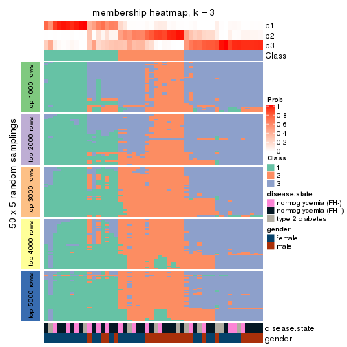</p>

</div>
<div id='tab-SD-mclust-membership-heatmap-3'>
<pre><code class="r">membership_heatmap(res, k = 4)
</code></pre>

<p></p>

</div>
<div id='tab-SD-mclust-membership-heatmap-4'>
<pre><code class="r">membership_heatmap(res, k = 5)
</code></pre>

<p></p>

</div>
<div id='tab-SD-mclust-membership-heatmap-5'>
<pre><code class="r">membership_heatmap(res, k = 6)
</code></pre>

<p></p>

</div>
</div>

As soon as we have had the classes for columns, we can look for signatures
which are significantly different between classes which can be candidate marks
for certain classes. Following are the heatmaps for signatures.


Signature heatmaps where rows are scaled:


<script>
$( function() {
	$( '#tabs-SD-mclust-get-signatures' ).tabs();
} );
</script>
<div id='tabs-SD-mclust-get-signatures'>
<ul>
<li><a href='#tab-SD-mclust-get-signatures-1'>k = 2</a></li>
<li><a href='#tab-SD-mclust-get-signatures-2'>k = 3</a></li>
<li><a href='#tab-SD-mclust-get-signatures-3'>k = 4</a></li>
<li><a href='#tab-SD-mclust-get-signatures-4'>k = 5</a></li>
<li><a href='#tab-SD-mclust-get-signatures-5'>k = 6</a></li>
</ul>
<div id='tab-SD-mclust-get-signatures-1'>
<pre><code class="r">get_signatures(res, k = 2)
</code></pre>

<p></p>

</div>
<div id='tab-SD-mclust-get-signatures-2'>
<pre><code class="r">get_signatures(res, k = 3)
</code></pre>

<p>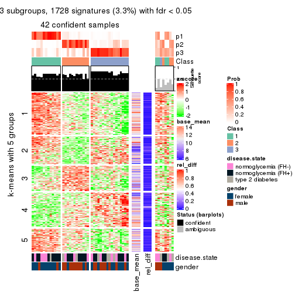</p>

</div>
<div id='tab-SD-mclust-get-signatures-3'>
<pre><code class="r">get_signatures(res, k = 4)
</code></pre>

<p></p>

</div>
<div id='tab-SD-mclust-get-signatures-4'>
<pre><code class="r">get_signatures(res, k = 5)
</code></pre>

<p></p>

</div>
<div id='tab-SD-mclust-get-signatures-5'>
<pre><code class="r">get_signatures(res, k = 6)
</code></pre>

<p></p>

</div>
</div>


Signature heatmaps where rows are not scaled:


<script>
$( function() {
	$( '#tabs-SD-mclust-get-signatures-no-scale' ).tabs();
} );
</script>
<div id='tabs-SD-mclust-get-signatures-no-scale'>
<ul>
<li><a href='#tab-SD-mclust-get-signatures-no-scale-1'>k = 2</a></li>
<li><a href='#tab-SD-mclust-get-signatures-no-scale-2'>k = 3</a></li>
<li><a href='#tab-SD-mclust-get-signatures-no-scale-3'>k = 4</a></li>
<li><a href='#tab-SD-mclust-get-signatures-no-scale-4'>k = 5</a></li>
<li><a href='#tab-SD-mclust-get-signatures-no-scale-5'>k = 6</a></li>
</ul>
<div id='tab-SD-mclust-get-signatures-no-scale-1'>
<pre><code class="r">get_signatures(res, k = 2, scale_rows = FALSE)
</code></pre>

<p></p>

</div>
<div id='tab-SD-mclust-get-signatures-no-scale-2'>
<pre><code class="r">get_signatures(res, k = 3, scale_rows = FALSE)
</code></pre>

<p>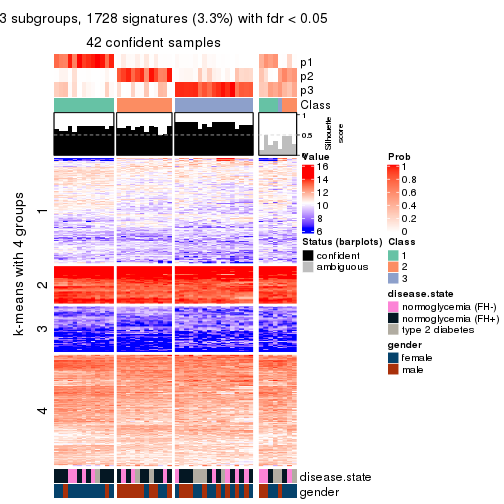</p>

</div>
<div id='tab-SD-mclust-get-signatures-no-scale-3'>
<pre><code class="r">get_signatures(res, k = 4, scale_rows = FALSE)
</code></pre>

<p></p>

</div>
<div id='tab-SD-mclust-get-signatures-no-scale-4'>
<pre><code class="r">get_signatures(res, k = 5, scale_rows = FALSE)
</code></pre>

<p>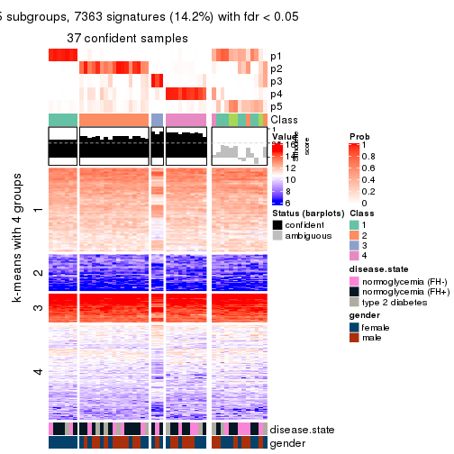</p>

</div>
<div id='tab-SD-mclust-get-signatures-no-scale-5'>
<pre><code class="r">get_signatures(res, k = 6, scale_rows = FALSE)
</code></pre>

<p></p>

</div>
</div>


Compare the overlap of signatures from different k:

```r
compare_signatures(res)
```


`get_signature()` returns a data frame invisibly. TO get the list of signatures, the function
call should be assigned to a variable explicitly. In following code, if `plot` argument is set
to `FALSE`, no heatmap is plotted while only the differential analysis is performed.

```r
# code only for demonstration
tb = get_signature(res, k = ..., plot = FALSE)
```

An example of the output of `tb` is:

```
#>   which_row         fdr    mean_1    mean_2 scaled_mean_1 scaled_mean_2 km
#> 1        38 0.042760348  8.373488  9.131774    -0.5533452     0.5164555  1
#> 2        40 0.018707592  7.106213  8.469186    -0.6173731     0.5762149  1
#> 3        55 0.019134737 10.221463 11.207825    -0.6159697     0.5749050  1
#> 4        59 0.006059896  5.921854  7.869574    -0.6899429     0.6439467  1
#> 5        60 0.018055526  8.928898 10.211722    -0.6204761     0.5791110  1
#> 6        98 0.009384629 15.714769 14.887706     0.6635654    -0.6193277  2
...
```

The columns in `tb` are:

1. `which_row`: row indices corresponding to the input matrix.
2. `fdr`: FDR for the differential test. 
3. `mean_x`: The mean value in group x.
4. `scaled_mean_x`: The mean value in group x after rows are scaled.
5. `km`: Row groups if k-means clustering is applied to rows.


UMAP plot which shows how samples are separated.


<script>
$( function() {
	$( '#tabs-SD-mclust-dimension-reduction' ).tabs();
} );
</script>
<div id='tabs-SD-mclust-dimension-reduction'>
<ul>
<li><a href='#tab-SD-mclust-dimension-reduction-1'>k = 2</a></li>
<li><a href='#tab-SD-mclust-dimension-reduction-2'>k = 3</a></li>
<li><a href='#tab-SD-mclust-dimension-reduction-3'>k = 4</a></li>
<li><a href='#tab-SD-mclust-dimension-reduction-4'>k = 5</a></li>
<li><a href='#tab-SD-mclust-dimension-reduction-5'>k = 6</a></li>
</ul>
<div id='tab-SD-mclust-dimension-reduction-1'>
<pre><code class="r">dimension_reduction(res, k = 2, method = &quot;UMAP&quot;)
</code></pre>

<p></p>

</div>
<div id='tab-SD-mclust-dimension-reduction-2'>
<pre><code class="r">dimension_reduction(res, k = 3, method = &quot;UMAP&quot;)
</code></pre>

<p></p>

</div>
<div id='tab-SD-mclust-dimension-reduction-3'>
<pre><code class="r">dimension_reduction(res, k = 4, method = &quot;UMAP&quot;)
</code></pre>

<p></p>

</div>
<div id='tab-SD-mclust-dimension-reduction-4'>
<pre><code class="r">dimension_reduction(res, k = 5, method = &quot;UMAP&quot;)
</code></pre>

<p></p>

</div>
<div id='tab-SD-mclust-dimension-reduction-5'>
<pre><code class="r">dimension_reduction(res, k = 6, method = &quot;UMAP&quot;)
</code></pre>

<p></p>

</div>
</div>


Following heatmap shows how subgroups are split when increasing `k`:

```r
collect_classes(res)
```


Test correlation between subgroups and known annotations. If the known
annotation is numeric, one-way ANOVA test is applied, and if the known
annotation is discrete, chi-squared contingency table test is applied.

```r
test_to_known_factors(res)
```

```
#>            n disease.state(p) gender(p) k
#> SD:mclust 46            0.700   0.05183 2
#> SD:mclust 42            0.825   0.01116 3
#> SD:mclust 45            0.958   0.05868 4
#> SD:mclust 37            0.980   0.06235 5
#> SD:mclust 31            0.979   0.00124 6
```


If matrix rows can be associated to genes, consider to use `functional_enrichment(res,
...)` to perform function enrichment for the signature genes. See [this vignette](http://bioconductor.org/packages/devel/bioc/vignettes/cola/inst/doc/functional_enrichment.html) for more detailed explanations.


 

---------------------------------------------------


### SD:NMF


The object with results only for a single top-value method and a single partition method 
can be extracted as:

```r
res = res_list["SD", "NMF"]
# you can also extract it by
# res = res_list["SD:NMF"]
```

A summary of `res` and all the functions that can be applied to it:

```r
res
```

```
#> A 'ConsensusPartition' object with k = 2, 3, 4, 5, 6.
#>   On a matrix with 51941 rows and 50 columns.
#>   Top rows (1000, 2000, 3000, 4000, 5000) are extracted by 'SD' method.
#>   Subgroups are detected by 'NMF' method.
#>   Performed in total 1250 partitions by row resampling.
#>   Best k for subgroups seems to be 2.
#> 
#> Following methods can be applied to this 'ConsensusPartition' object:
#>  [1] "cola_report"             "collect_classes"         "collect_plots"          
#>  [4] "collect_stats"           "colnames"                "compare_signatures"     
#>  [7] "consensus_heatmap"       "dimension_reduction"     "functional_enrichment"  
#> [10] "get_anno_col"            "get_anno"                "get_classes"            
#> [13] "get_consensus"           "get_matrix"              "get_membership"         
#> [16] "get_param"               "get_signatures"          "get_stats"              
#> [19] "is_best_k"               "is_stable_k"             "membership_heatmap"     
#> [22] "ncol"                    "nrow"                    "plot_ecdf"              
#> [25] "rownames"                "select_partition_number" "show"                   
#> [28] "suggest_best_k"          "test_to_known_factors"
```

`collect_plots()` function collects all the plots made from `res` for all `k` (number of partitions)
into one single page to provide an easy and fast comparison between different `k`.

```r
collect_plots(res)
```


The plots are:

- The first row: a plot of the ECDF (empirical cumulative distribution
  function) curves of the consensus matrix for each `k` and the heatmap of
  predicted classes for each `k`.
- The second row: heatmaps of the consensus matrix for each `k`.
- The third row: heatmaps of the membership matrix for each `k`.
- The fouth row: heatmaps of the signatures for each `k`.

All the plots in panels can be made by individual functions and they are
plotted later in this section.

`select_partition_number()` produces several plots showing different
statistics for choosing "optimized" `k`. There are following statistics:

- ECDF curves of the consensus matrix for each `k`;
- 1-PAC. [The PAC
  score](https://en.wikipedia.org/wiki/Consensus_clustering#Over-interpretation_potential_of_consensus_clustering)
  measures the proportion of the ambiguous subgrouping.
- Mean silhouette score.
- Concordance. The mean probability of fiting the consensus class ids in all
  partitions.
- Area increased. Denote $A_k$ as the area under the ECDF curve for current
  `k`, the area increased is defined as $A_k - A_{k-1}$.
- Rand index. The percent of pairs of samples that are both in a same cluster
  or both are not in a same cluster in the partition of k and k-1.
- Jaccard index. The ratio of pairs of samples are both in a same cluster in
  the partition of k and k-1 and the pairs of samples are both in a same
  cluster in the partition k or k-1.

The detailed explanations of these statistics can be found in [the _cola_
vignette](http://bioconductor.org/packages/devel/bioc/vignettes/cola/inst/doc/cola.html#toc_13).

Generally speaking, lower PAC score, higher mean silhouette score or higher
concordance corresponds to better partition. Rand index and Jaccard index
measure how similar the current partition is compared to partition with `k-1`.
If they are too similar, we won't accept `k` is better than `k-1`.

```r
select_partition_number(res)
```


The numeric values for all these statistics can be obtained by `get_stats()`.

```r
get_stats(res)
```

```
#>   k 1-PAC mean_silhouette concordance area_increased  Rand Jaccard
#> 2 2 0.130           0.452       0.772         0.4999 0.490   0.490
#> 3 3 0.213           0.404       0.668         0.3211 0.628   0.372
#> 4 4 0.334           0.406       0.656         0.1206 0.798   0.473
#> 5 5 0.390           0.311       0.591         0.0617 0.930   0.745
#> 6 6 0.458           0.300       0.513         0.0412 0.905   0.643
```

`suggest_best_k()` suggests the best $k$ based on these statistics. The rules are as follows:

- All $k$ with Jaccard index larger than 0.95 are removed because increasing
  $k$ does not provide enough extra information. If all $k$ are removed, it is
  marked as no subgroup is detected.
- For all $k$ with 1-PAC score larger than 0.9, the maximal $k$ is taken as
  the best $k$, and other $k$ are marked as optional $k$.
- If it does not fit the second rule. The $k$ with the maximal vote of the
  highest 1-PAC score, highest mean silhouette, and highest concordance is
  taken as the best $k$.

```r
suggest_best_k(res)
```

```
#> [1] 2
```


Following shows the table of the partitions (You need to click the **show/hide
code output** link to see it). The membership matrix (columns with name `p*`)
is inferred by
[`clue::cl_consensus()`](https://www.rdocumentation.org/link/cl_consensus?package=clue)
function with the `SE` method. Basically the value in the membership matrix
represents the probability to belong to a certain group. The finall class
label for an item is determined with the group with highest probability it
belongs to.

In `get_classes()` function, the entropy is calculated from the membership
matrix and the silhouette score is calculated from the consensus matrix.


<script>
$( function() {
	$( '#tabs-SD-NMF-get-classes' ).tabs();
} );
</script>
<div id='tabs-SD-NMF-get-classes'>
<ul>
<li><a href='#tab-SD-NMF-get-classes-1'>k = 2</a></li>
<li><a href='#tab-SD-NMF-get-classes-2'>k = 3</a></li>
<li><a href='#tab-SD-NMF-get-classes-3'>k = 4</a></li>
<li><a href='#tab-SD-NMF-get-classes-4'>k = 5</a></li>
<li><a href='#tab-SD-NMF-get-classes-5'>k = 6</a></li>
</ul>

<div id='tab-SD-NMF-get-classes-1'>
<p><a id='tab-SD-NMF-get-classes-1-a' style='color:#0366d6' href='#'>show/hide code output</a></p>
<pre><code class="r">cbind(get_classes(res, k = 2), get_membership(res, k = 2))
</code></pre>

<pre><code>#&gt;           class entropy silhouette    p1    p2
#&gt; GSM624962     2   0.821     0.4601 0.256 0.744
#&gt; GSM624963     2   0.821     0.5796 0.256 0.744
#&gt; GSM624967     1   0.961     0.1912 0.616 0.384
#&gt; GSM624968     1   0.999    -0.0588 0.516 0.484
#&gt; GSM624969     1   0.163     0.6413 0.976 0.024
#&gt; GSM624970     1   0.141     0.6360 0.980 0.020
#&gt; GSM624961     2   0.224     0.6649 0.036 0.964
#&gt; GSM624964     1   0.886     0.3371 0.696 0.304
#&gt; GSM624965     2   0.416     0.6577 0.084 0.916
#&gt; GSM624966     2   0.224     0.6569 0.036 0.964
#&gt; GSM624925     2   0.343     0.6538 0.064 0.936
#&gt; GSM624927     1   0.242     0.6464 0.960 0.040
#&gt; GSM624929     2   0.994     0.1250 0.456 0.544
#&gt; GSM624930     1   0.529     0.6284 0.880 0.120
#&gt; GSM624931     1   0.738     0.5700 0.792 0.208
#&gt; GSM624935     1   0.814     0.4403 0.748 0.252
#&gt; GSM624936     1   0.992     0.2218 0.552 0.448
#&gt; GSM624937     1   0.388     0.6097 0.924 0.076
#&gt; GSM624926     2   0.866     0.4720 0.288 0.712
#&gt; GSM624928     2   0.260     0.6641 0.044 0.956
#&gt; GSM624932     2   0.952     0.2184 0.372 0.628
#&gt; GSM624933     2   0.738     0.5666 0.208 0.792
#&gt; GSM624934     1   0.998     0.0892 0.528 0.472
#&gt; GSM624971     2   0.671     0.5679 0.176 0.824
#&gt; GSM624973     2   0.985     0.0212 0.428 0.572
#&gt; GSM624938     1   0.994     0.1882 0.544 0.456
#&gt; GSM624940     1   0.850     0.5084 0.724 0.276
#&gt; GSM624941     1   0.141     0.6415 0.980 0.020
#&gt; GSM624942     1   0.184     0.6438 0.972 0.028
#&gt; GSM624943     1   0.327     0.6458 0.940 0.060
#&gt; GSM624945     2   0.855     0.4366 0.280 0.720
#&gt; GSM624946     1   0.932     0.4323 0.652 0.348
#&gt; GSM624949     2   1.000    -0.1045 0.496 0.504
#&gt; GSM624951     1   0.518     0.6187 0.884 0.116
#&gt; GSM624952     2   0.595     0.6049 0.144 0.856
#&gt; GSM624955     2   0.998     0.0493 0.476 0.524
#&gt; GSM624956     2   0.788     0.5033 0.236 0.764
#&gt; GSM624957     1   0.260     0.6470 0.956 0.044
#&gt; GSM624974     1   0.881     0.4986 0.700 0.300
#&gt; GSM624939     1   0.871     0.4909 0.708 0.292
#&gt; GSM624944     2   0.990     0.2029 0.440 0.560
#&gt; GSM624947     1   0.981     0.0930 0.580 0.420
#&gt; GSM624948     2   0.506     0.6448 0.112 0.888
#&gt; GSM624950     1   0.993     0.0210 0.548 0.452
#&gt; GSM624953     2   0.163     0.6610 0.024 0.976
#&gt; GSM624954     1   0.697     0.5685 0.812 0.188
#&gt; GSM624958     2   0.625     0.6126 0.156 0.844
#&gt; GSM624959     2   0.494     0.6572 0.108 0.892
#&gt; GSM624960     2   0.932     0.3829 0.348 0.652
#&gt; GSM624972     2   0.224     0.6660 0.036 0.964
</code></pre>

<script>
$('#tab-SD-NMF-get-classes-1-a').parent().next().next().hide();
$('#tab-SD-NMF-get-classes-1-a').click(function(){
  $('#tab-SD-NMF-get-classes-1-a').parent().next().next().toggle();
  return(false);
});
</script>
</div>

<div id='tab-SD-NMF-get-classes-2'>
<p><a id='tab-SD-NMF-get-classes-2-a' style='color:#0366d6' href='#'>show/hide code output</a></p>
<pre><code class="r">cbind(get_classes(res, k = 3), get_membership(res, k = 3))
</code></pre>

<pre><code>#&gt;           class entropy silhouette    p1    p2    p3
#&gt; GSM624962     3  0.8213     0.2327 0.344 0.088 0.568
#&gt; GSM624963     1  0.7558     0.4446 0.692 0.144 0.164
#&gt; GSM624967     2  0.4902     0.5406 0.092 0.844 0.064
#&gt; GSM624968     2  0.5473     0.4359 0.140 0.808 0.052
#&gt; GSM624969     2  0.6796     0.5507 0.024 0.632 0.344
#&gt; GSM624970     2  0.6553     0.5590 0.020 0.656 0.324
#&gt; GSM624961     1  0.3532     0.6603 0.884 0.008 0.108
#&gt; GSM624964     2  0.6950     0.5216 0.252 0.692 0.056
#&gt; GSM624965     1  0.1170     0.6859 0.976 0.016 0.008
#&gt; GSM624966     1  0.8830     0.0857 0.468 0.116 0.416
#&gt; GSM624925     3  0.9520    -0.0413 0.396 0.188 0.416
#&gt; GSM624927     2  0.8043     0.5474 0.084 0.592 0.324
#&gt; GSM624929     1  0.7995     0.2494 0.608 0.088 0.304
#&gt; GSM624930     2  0.7583     0.3935 0.040 0.492 0.468
#&gt; GSM624931     3  0.5812     0.1744 0.012 0.264 0.724
#&gt; GSM624935     2  0.9118     0.5100 0.220 0.548 0.232
#&gt; GSM624936     3  0.5538     0.5168 0.132 0.060 0.808
#&gt; GSM624937     2  0.6820     0.5730 0.052 0.700 0.248
#&gt; GSM624926     1  0.7156     0.3712 0.572 0.400 0.028
#&gt; GSM624928     1  0.2651     0.6812 0.928 0.012 0.060
#&gt; GSM624932     1  0.7724     0.1675 0.552 0.052 0.396
#&gt; GSM624933     1  0.3965     0.6228 0.860 0.132 0.008
#&gt; GSM624934     1  0.8016     0.4068 0.656 0.156 0.188
#&gt; GSM624971     3  0.8484     0.2903 0.196 0.188 0.616
#&gt; GSM624973     3  0.6606     0.3979 0.236 0.048 0.716
#&gt; GSM624938     3  0.2703     0.5416 0.056 0.016 0.928
#&gt; GSM624940     3  0.4209     0.4139 0.016 0.128 0.856
#&gt; GSM624941     2  0.6267     0.4459 0.000 0.548 0.452
#&gt; GSM624942     2  0.6676     0.4192 0.008 0.516 0.476
#&gt; GSM624943     2  0.7400     0.4992 0.036 0.552 0.412
#&gt; GSM624945     3  0.7186    -0.0041 0.476 0.024 0.500
#&gt; GSM624946     3  0.2446     0.5030 0.012 0.052 0.936
#&gt; GSM624949     3  0.9437     0.1512 0.208 0.300 0.492
#&gt; GSM624951     3  0.6286    -0.3704 0.000 0.464 0.536
#&gt; GSM624952     3  0.7391     0.3270 0.308 0.056 0.636
#&gt; GSM624955     2  0.6644     0.3769 0.140 0.752 0.108
#&gt; GSM624956     3  0.7981     0.2600 0.340 0.076 0.584
#&gt; GSM624957     2  0.7980     0.5297 0.072 0.572 0.356
#&gt; GSM624974     3  0.8408     0.4023 0.232 0.152 0.616
#&gt; GSM624939     3  0.7613     0.4436 0.204 0.116 0.680
#&gt; GSM624944     2  0.6647     0.2453 0.452 0.540 0.008
#&gt; GSM624947     2  0.5919     0.5129 0.260 0.724 0.016
#&gt; GSM624948     1  0.0983     0.6842 0.980 0.016 0.004
#&gt; GSM624950     2  0.5024     0.4879 0.220 0.776 0.004
#&gt; GSM624953     1  0.4862     0.6217 0.820 0.020 0.160
#&gt; GSM624954     2  0.8120     0.3493 0.396 0.532 0.072
#&gt; GSM624958     1  0.3784     0.6429 0.864 0.132 0.004
#&gt; GSM624959     1  0.1919     0.6811 0.956 0.020 0.024
#&gt; GSM624960     2  0.7063    -0.1393 0.464 0.516 0.020
#&gt; GSM624972     1  0.5508     0.5773 0.784 0.028 0.188
</code></pre>

<script>
$('#tab-SD-NMF-get-classes-2-a').parent().next().next().hide();
$('#tab-SD-NMF-get-classes-2-a').click(function(){
  $('#tab-SD-NMF-get-classes-2-a').parent().next().next().toggle();
  return(false);
});
</script>
</div>

<div id='tab-SD-NMF-get-classes-3'>
<p><a id='tab-SD-NMF-get-classes-3-a' style='color:#0366d6' href='#'>show/hide code output</a></p>
<pre><code class="r">cbind(get_classes(res, k = 4), get_membership(res, k = 4))
</code></pre>

<pre><code>#&gt;           class entropy silhouette    p1    p2    p3    p4
#&gt; GSM624962     3   0.809     0.4173 0.040 0.240 0.532 0.188
#&gt; GSM624963     2   0.839     0.2125 0.052 0.484 0.164 0.300
#&gt; GSM624967     4   0.681     0.2981 0.396 0.020 0.056 0.528
#&gt; GSM624968     4   0.498     0.4939 0.080 0.012 0.116 0.792
#&gt; GSM624969     1   0.400     0.6308 0.860 0.052 0.056 0.032
#&gt; GSM624970     1   0.396     0.5287 0.836 0.016 0.016 0.132
#&gt; GSM624961     2   0.260     0.6375 0.008 0.908 0.076 0.008
#&gt; GSM624964     1   0.718     0.2080 0.576 0.200 0.004 0.220
#&gt; GSM624965     2   0.280     0.6552 0.012 0.900 0.008 0.080
#&gt; GSM624966     3   0.777     0.2102 0.004 0.336 0.448 0.212
#&gt; GSM624925     3   0.773     0.3872 0.008 0.208 0.496 0.288
#&gt; GSM624927     1   0.415     0.6123 0.816 0.156 0.016 0.012
#&gt; GSM624929     2   0.630     0.4336 0.244 0.644 0.112 0.000
#&gt; GSM624930     1   0.467     0.6363 0.796 0.100 0.104 0.000
#&gt; GSM624931     1   0.576     0.2759 0.544 0.016 0.432 0.008
#&gt; GSM624935     1   0.807     0.1350 0.540 0.176 0.044 0.240
#&gt; GSM624936     3   0.773     0.2087 0.272 0.284 0.444 0.000
#&gt; GSM624937     1   0.609     0.1007 0.608 0.004 0.052 0.336
#&gt; GSM624926     4   0.445     0.4340 0.000 0.196 0.028 0.776
#&gt; GSM624928     2   0.287     0.6613 0.020 0.908 0.020 0.052
#&gt; GSM624932     2   0.614     0.3585 0.080 0.632 0.288 0.000
#&gt; GSM624933     2   0.525     0.5163 0.056 0.724 0.000 0.220
#&gt; GSM624934     2   0.562     0.4152 0.280 0.676 0.036 0.008
#&gt; GSM624971     3   0.631     0.3950 0.000 0.092 0.620 0.288
#&gt; GSM624973     3   0.680     0.4268 0.088 0.200 0.668 0.044
#&gt; GSM624938     3   0.330     0.5464 0.048 0.032 0.892 0.028
#&gt; GSM624940     3   0.500     0.1843 0.328 0.012 0.660 0.000
#&gt; GSM624941     1   0.437     0.6006 0.800 0.000 0.156 0.044
#&gt; GSM624942     1   0.381     0.6377 0.848 0.028 0.116 0.008
#&gt; GSM624943     1   0.520     0.6396 0.792 0.076 0.100 0.032
#&gt; GSM624945     2   0.695     0.1866 0.104 0.524 0.368 0.004
#&gt; GSM624946     3   0.513     0.4620 0.060 0.004 0.756 0.180
#&gt; GSM624949     4   0.819     0.0467 0.124 0.052 0.356 0.468
#&gt; GSM624951     1   0.505     0.5260 0.704 0.000 0.268 0.028
#&gt; GSM624952     3   0.653     0.4850 0.032 0.212 0.676 0.080
#&gt; GSM624955     4   0.474     0.3508 0.016 0.012 0.212 0.760
#&gt; GSM624956     3   0.759     0.4410 0.040 0.256 0.580 0.124
#&gt; GSM624957     1   0.556     0.6257 0.756 0.128 0.100 0.016
#&gt; GSM624974     1   0.789    -0.0381 0.360 0.288 0.352 0.000
#&gt; GSM624939     3   0.754     0.0658 0.320 0.208 0.472 0.000
#&gt; GSM624944     4   0.778     0.4150 0.228 0.272 0.008 0.492
#&gt; GSM624947     4   0.754     0.2263 0.412 0.144 0.008 0.436
#&gt; GSM624948     2   0.283     0.6423 0.000 0.876 0.004 0.120
#&gt; GSM624950     4   0.641     0.3804 0.364 0.076 0.000 0.560
#&gt; GSM624953     2   0.465     0.5805 0.008 0.796 0.152 0.044
#&gt; GSM624954     1   0.610     0.1171 0.488 0.472 0.004 0.036
#&gt; GSM624958     2   0.481     0.4416 0.008 0.676 0.000 0.316
#&gt; GSM624959     2   0.286     0.6574 0.048 0.904 0.004 0.044
#&gt; GSM624960     4   0.533     0.4411 0.040 0.228 0.008 0.724
#&gt; GSM624972     2   0.743     0.3507 0.020 0.584 0.224 0.172
</code></pre>

<script>
$('#tab-SD-NMF-get-classes-3-a').parent().next().next().hide();
$('#tab-SD-NMF-get-classes-3-a').click(function(){
  $('#tab-SD-NMF-get-classes-3-a').parent().next().next().toggle();
  return(false);
});
</script>
</div>

<div id='tab-SD-NMF-get-classes-4'>
<p><a id='tab-SD-NMF-get-classes-4-a' style='color:#0366d6' href='#'>show/hide code output</a></p>
<pre><code class="r">cbind(get_classes(res, k = 5), get_membership(res, k = 5))
</code></pre>

<pre><code>#&gt;           class entropy silhouette    p1    p2    p3    p4    p5
#&gt; GSM624962     3   0.866     0.2121 0.040 0.264 0.372 0.080 0.244
#&gt; GSM624963     2   0.875     0.1816 0.100 0.396 0.084 0.108 0.312
#&gt; GSM624967     4   0.773    -0.3632 0.216 0.028 0.024 0.432 0.300
#&gt; GSM624968     4   0.570     0.3294 0.016 0.000 0.128 0.664 0.192
#&gt; GSM624969     1   0.596     0.4344 0.720 0.084 0.040 0.048 0.108
#&gt; GSM624970     1   0.552     0.3467 0.728 0.016 0.040 0.064 0.152
#&gt; GSM624961     2   0.255     0.5720 0.004 0.908 0.048 0.016 0.024
#&gt; GSM624964     1   0.808    -0.1747 0.420 0.152 0.016 0.320 0.092
#&gt; GSM624965     2   0.438     0.5614 0.000 0.776 0.004 0.108 0.112
#&gt; GSM624966     3   0.725     0.1463 0.004 0.360 0.448 0.144 0.044
#&gt; GSM624925     3   0.818     0.3022 0.004 0.264 0.416 0.184 0.132
#&gt; GSM624927     1   0.403     0.4987 0.828 0.084 0.004 0.028 0.056
#&gt; GSM624929     2   0.642     0.3977 0.216 0.600 0.032 0.000 0.152
#&gt; GSM624930     1   0.544     0.5288 0.736 0.056 0.100 0.004 0.104
#&gt; GSM624931     1   0.634     0.2343 0.480 0.008 0.408 0.008 0.096
#&gt; GSM624935     1   0.745    -0.0184 0.556 0.112 0.008 0.152 0.172
#&gt; GSM624936     3   0.810     0.1435 0.236 0.240 0.404 0.000 0.120
#&gt; GSM624937     5   0.713     0.0000 0.344 0.004 0.008 0.264 0.380
#&gt; GSM624926     4   0.441     0.4415 0.000 0.124 0.036 0.792 0.048
#&gt; GSM624928     2   0.234     0.5896 0.020 0.916 0.024 0.040 0.000
#&gt; GSM624932     2   0.651     0.3150 0.044 0.612 0.236 0.008 0.100
#&gt; GSM624933     2   0.707     0.4304 0.096 0.576 0.008 0.228 0.092
#&gt; GSM624934     2   0.653     0.2649 0.340 0.544 0.032 0.012 0.072
#&gt; GSM624971     3   0.626     0.3831 0.004 0.092 0.660 0.172 0.072
#&gt; GSM624973     3   0.713     0.3829 0.072 0.168 0.624 0.076 0.060
#&gt; GSM624938     3   0.378     0.4712 0.028 0.040 0.856 0.048 0.028
#&gt; GSM624940     3   0.592     0.1548 0.272 0.012 0.616 0.004 0.096
#&gt; GSM624941     1   0.552     0.4777 0.720 0.008 0.132 0.028 0.112
#&gt; GSM624942     1   0.436     0.5337 0.808 0.024 0.096 0.008 0.064
#&gt; GSM624943     1   0.545     0.5084 0.744 0.064 0.056 0.016 0.120
#&gt; GSM624945     2   0.662     0.2819 0.068 0.580 0.276 0.004 0.072
#&gt; GSM624946     3   0.538     0.3764 0.024 0.000 0.712 0.136 0.128
#&gt; GSM624949     3   0.868     0.0197 0.084 0.036 0.348 0.288 0.244
#&gt; GSM624951     1   0.570     0.4323 0.652 0.000 0.228 0.016 0.104
#&gt; GSM624952     3   0.710     0.3448 0.024 0.232 0.560 0.028 0.156
#&gt; GSM624955     4   0.655     0.2940 0.016 0.008 0.168 0.584 0.224
#&gt; GSM624956     3   0.765     0.2500 0.028 0.316 0.472 0.044 0.140
#&gt; GSM624957     1   0.581     0.5248 0.720 0.060 0.116 0.016 0.088
#&gt; GSM624974     3   0.842     0.0178 0.300 0.252 0.344 0.016 0.088
#&gt; GSM624939     3   0.805     0.0654 0.296 0.176 0.428 0.012 0.088
#&gt; GSM624944     4   0.659     0.3349 0.104 0.176 0.004 0.632 0.084
#&gt; GSM624947     4   0.660     0.1568 0.244 0.064 0.004 0.600 0.088
#&gt; GSM624948     2   0.514     0.5521 0.008 0.724 0.004 0.120 0.144
#&gt; GSM624950     4   0.623     0.1122 0.256 0.032 0.008 0.620 0.084
#&gt; GSM624953     2   0.425     0.5467 0.020 0.820 0.096 0.040 0.024
#&gt; GSM624954     2   0.755     0.1235 0.348 0.460 0.016 0.104 0.072
#&gt; GSM624958     2   0.541     0.4394 0.000 0.624 0.008 0.304 0.064
#&gt; GSM624959     2   0.359     0.5973 0.028 0.844 0.000 0.096 0.032
#&gt; GSM624960     4   0.504     0.4133 0.024 0.156 0.008 0.748 0.064
#&gt; GSM624972     2   0.761     0.3713 0.052 0.552 0.120 0.224 0.052
</code></pre>

<script>
$('#tab-SD-NMF-get-classes-4-a').parent().next().next().hide();
$('#tab-SD-NMF-get-classes-4-a').click(function(){
  $('#tab-SD-NMF-get-classes-4-a').parent().next().next().toggle();
  return(false);
});
</script>
</div>

<div id='tab-SD-NMF-get-classes-5'>
<p><a id='tab-SD-NMF-get-classes-5-a' style='color:#0366d6' href='#'>show/hide code output</a></p>
<pre><code class="r">cbind(get_classes(res, k = 6), get_membership(res, k = 6))
</code></pre>

<pre><code>#&gt;           class entropy silhouette    p1    p2    p3    p4    p5    p6
#&gt; GSM624962     3   0.718   0.382402 0.012 0.212 0.532 0.020 0.112 0.112
#&gt; GSM624963     2   0.856  -0.003566 0.120 0.324 0.256 0.024 0.044 0.232
#&gt; GSM624967     4   0.762  -0.211312 0.108 0.020 0.080 0.404 0.032 0.356
#&gt; GSM624968     4   0.650   0.205020 0.024 0.000 0.320 0.512 0.044 0.100
#&gt; GSM624969     1   0.698   0.392003 0.560 0.044 0.016 0.036 0.152 0.192
#&gt; GSM624970     1   0.503   0.386852 0.732 0.004 0.008 0.052 0.076 0.128
#&gt; GSM624961     2   0.333   0.516814 0.000 0.856 0.052 0.024 0.052 0.016
#&gt; GSM624964     4   0.842   0.000874 0.312 0.084 0.012 0.340 0.152 0.100
#&gt; GSM624965     2   0.455   0.515644 0.032 0.788 0.028 0.080 0.008 0.064
#&gt; GSM624966     2   0.729  -0.119166 0.000 0.368 0.340 0.064 0.212 0.016
#&gt; GSM624925     3   0.746   0.362514 0.000 0.204 0.492 0.088 0.164 0.052
#&gt; GSM624927     1   0.483   0.535340 0.768 0.048 0.012 0.028 0.104 0.040
#&gt; GSM624929     2   0.731   0.364093 0.160 0.552 0.076 0.008 0.068 0.136
#&gt; GSM624930     1   0.517   0.523706 0.712 0.028 0.016 0.004 0.160 0.080
#&gt; GSM624931     5   0.611   0.019546 0.368 0.008 0.064 0.004 0.508 0.048
#&gt; GSM624935     1   0.689   0.195368 0.600 0.112 0.024 0.096 0.024 0.144
#&gt; GSM624936     5   0.747   0.228735 0.124 0.176 0.140 0.000 0.508 0.052
#&gt; GSM624937     6   0.646   0.000000 0.264 0.000 0.032 0.148 0.020 0.536
#&gt; GSM624926     4   0.427   0.431102 0.000 0.116 0.076 0.776 0.004 0.028
#&gt; GSM624928     2   0.322   0.537973 0.000 0.856 0.016 0.080 0.032 0.016
#&gt; GSM624932     2   0.558   0.268683 0.008 0.584 0.076 0.004 0.312 0.016
#&gt; GSM624933     2   0.692   0.267804 0.132 0.520 0.016 0.264 0.012 0.056
#&gt; GSM624934     2   0.695   0.194565 0.272 0.496 0.008 0.012 0.156 0.056
#&gt; GSM624971     3   0.673   0.305150 0.004 0.068 0.564 0.108 0.228 0.028
#&gt; GSM624973     5   0.759   0.034113 0.028 0.128 0.304 0.084 0.440 0.016
#&gt; GSM624938     3   0.553   0.305366 0.016 0.032 0.560 0.004 0.360 0.028
#&gt; GSM624940     5   0.548   0.349483 0.164 0.000 0.188 0.000 0.628 0.020
#&gt; GSM624941     1   0.658   0.419616 0.568 0.016 0.024 0.036 0.252 0.104
#&gt; GSM624942     1   0.561   0.487118 0.632 0.020 0.008 0.016 0.256 0.068
#&gt; GSM624943     1   0.459   0.528298 0.784 0.040 0.020 0.008 0.076 0.072
#&gt; GSM624945     2   0.714   0.171246 0.040 0.484 0.220 0.000 0.212 0.044
#&gt; GSM624946     3   0.529   0.378721 0.024 0.000 0.672 0.068 0.216 0.020
#&gt; GSM624949     3   0.761   0.311964 0.088 0.048 0.564 0.100 0.068 0.132
#&gt; GSM624951     1   0.577   0.298557 0.548 0.000 0.032 0.024 0.352 0.044
#&gt; GSM624952     3   0.656   0.380128 0.012 0.192 0.516 0.008 0.252 0.020
#&gt; GSM624955     3   0.685  -0.129525 0.020 0.000 0.464 0.336 0.064 0.116
#&gt; GSM624956     3   0.624   0.387394 0.008 0.256 0.548 0.008 0.164 0.016
#&gt; GSM624957     1   0.627   0.464478 0.644 0.044 0.020 0.032 0.176 0.084
#&gt; GSM624974     5   0.687   0.404555 0.184 0.212 0.028 0.024 0.536 0.016
#&gt; GSM624939     5   0.642   0.451656 0.176 0.152 0.048 0.012 0.600 0.012
#&gt; GSM624944     4   0.587   0.386594 0.052 0.132 0.000 0.672 0.040 0.104
#&gt; GSM624947     4   0.664   0.362174 0.120 0.028 0.052 0.644 0.076 0.080
#&gt; GSM624948     2   0.494   0.497964 0.024 0.764 0.052 0.064 0.012 0.084
#&gt; GSM624950     4   0.620   0.353726 0.184 0.036 0.036 0.652 0.036 0.056
#&gt; GSM624953     2   0.532   0.494067 0.000 0.724 0.060 0.064 0.112 0.040
#&gt; GSM624954     2   0.818  -0.096080 0.304 0.340 0.000 0.112 0.172 0.072
#&gt; GSM624958     2   0.571   0.306250 0.012 0.576 0.032 0.332 0.016 0.032
#&gt; GSM624959     2   0.413   0.512303 0.028 0.792 0.004 0.132 0.016 0.028
#&gt; GSM624960     4   0.570   0.398171 0.048 0.136 0.040 0.704 0.016 0.056
#&gt; GSM624972     2   0.782   0.255794 0.032 0.444 0.068 0.264 0.164 0.028
</code></pre>

<script>
$('#tab-SD-NMF-get-classes-5-a').parent().next().next().hide();
$('#tab-SD-NMF-get-classes-5-a').click(function(){
  $('#tab-SD-NMF-get-classes-5-a').parent().next().next().toggle();
  return(false);
});
</script>
</div>
</div>

Heatmaps for the consensus matrix. It visualizes the probability of two
samples to be in a same group.


<script>
$( function() {
	$( '#tabs-SD-NMF-consensus-heatmap' ).tabs();
} );
</script>
<div id='tabs-SD-NMF-consensus-heatmap'>
<ul>
<li><a href='#tab-SD-NMF-consensus-heatmap-1'>k = 2</a></li>
<li><a href='#tab-SD-NMF-consensus-heatmap-2'>k = 3</a></li>
<li><a href='#tab-SD-NMF-consensus-heatmap-3'>k = 4</a></li>
<li><a href='#tab-SD-NMF-consensus-heatmap-4'>k = 5</a></li>
<li><a href='#tab-SD-NMF-consensus-heatmap-5'>k = 6</a></li>
</ul>
<div id='tab-SD-NMF-consensus-heatmap-1'>
<pre><code class="r">consensus_heatmap(res, k = 2)
</code></pre>

<p></p>

</div>
<div id='tab-SD-NMF-consensus-heatmap-2'>
<pre><code class="r">consensus_heatmap(res, k = 3)
</code></pre>

<p></p>

</div>
<div id='tab-SD-NMF-consensus-heatmap-3'>
<pre><code class="r">consensus_heatmap(res, k = 4)
</code></pre>

<p></p>

</div>
<div id='tab-SD-NMF-consensus-heatmap-4'>
<pre><code class="r">consensus_heatmap(res, k = 5)
</code></pre>

<p></p>

</div>
<div id='tab-SD-NMF-consensus-heatmap-5'>
<pre><code class="r">consensus_heatmap(res, k = 6)
</code></pre>

<p></p>

</div>
</div>

Heatmaps for the membership of samples in all partitions to see how consistent they are:


<script>
$( function() {
	$( '#tabs-SD-NMF-membership-heatmap' ).tabs();
} );
</script>
<div id='tabs-SD-NMF-membership-heatmap'>
<ul>
<li><a href='#tab-SD-NMF-membership-heatmap-1'>k = 2</a></li>
<li><a href='#tab-SD-NMF-membership-heatmap-2'>k = 3</a></li>
<li><a href='#tab-SD-NMF-membership-heatmap-3'>k = 4</a></li>
<li><a href='#tab-SD-NMF-membership-heatmap-4'>k = 5</a></li>
<li><a href='#tab-SD-NMF-membership-heatmap-5'>k = 6</a></li>
</ul>
<div id='tab-SD-NMF-membership-heatmap-1'>
<pre><code class="r">membership_heatmap(res, k = 2)
</code></pre>

<p></p>

</div>
<div id='tab-SD-NMF-membership-heatmap-2'>
<pre><code class="r">membership_heatmap(res, k = 3)
</code></pre>

<p></p>

</div>
<div id='tab-SD-NMF-membership-heatmap-3'>
<pre><code class="r">membership_heatmap(res, k = 4)
</code></pre>

<p>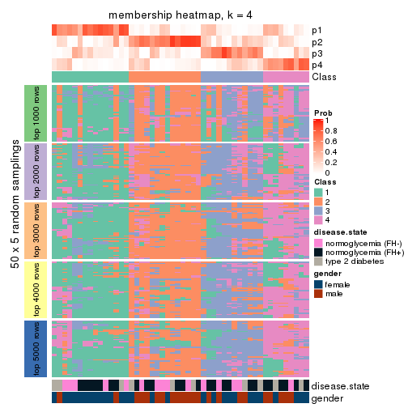</p>

</div>
<div id='tab-SD-NMF-membership-heatmap-4'>
<pre><code class="r">membership_heatmap(res, k = 5)
</code></pre>

<p></p>

</div>
<div id='tab-SD-NMF-membership-heatmap-5'>
<pre><code class="r">membership_heatmap(res, k = 6)
</code></pre>

<p></p>

</div>
</div>

As soon as we have had the classes for columns, we can look for signatures
which are significantly different between classes which can be candidate marks
for certain classes. Following are the heatmaps for signatures.


Signature heatmaps where rows are scaled:


<script>
$( function() {
	$( '#tabs-SD-NMF-get-signatures' ).tabs();
} );
</script>
<div id='tabs-SD-NMF-get-signatures'>
<ul>
<li><a href='#tab-SD-NMF-get-signatures-1'>k = 2</a></li>
<li><a href='#tab-SD-NMF-get-signatures-2'>k = 3</a></li>
<li><a href='#tab-SD-NMF-get-signatures-3'>k = 4</a></li>
<li><a href='#tab-SD-NMF-get-signatures-4'>k = 5</a></li>
<li><a href='#tab-SD-NMF-get-signatures-5'>k = 6</a></li>
</ul>
<div id='tab-SD-NMF-get-signatures-1'>
<pre><code class="r">get_signatures(res, k = 2)
</code></pre>

<p></p>

</div>
<div id='tab-SD-NMF-get-signatures-2'>
<pre><code class="r">get_signatures(res, k = 3)
</code></pre>

<p></p>

</div>
<div id='tab-SD-NMF-get-signatures-3'>
<pre><code class="r">get_signatures(res, k = 4)
</code></pre>

<p></p>

</div>
<div id='tab-SD-NMF-get-signatures-4'>
<pre><code class="r">get_signatures(res, k = 5)
</code></pre>

<p></p>

</div>
<div id='tab-SD-NMF-get-signatures-5'>
<pre><code class="r">get_signatures(res, k = 6)
</code></pre>

<p></p>

</div>
</div>


Signature heatmaps where rows are not scaled:


<script>
$( function() {
	$( '#tabs-SD-NMF-get-signatures-no-scale' ).tabs();
} );
</script>
<div id='tabs-SD-NMF-get-signatures-no-scale'>
<ul>
<li><a href='#tab-SD-NMF-get-signatures-no-scale-1'>k = 2</a></li>
<li><a href='#tab-SD-NMF-get-signatures-no-scale-2'>k = 3</a></li>
<li><a href='#tab-SD-NMF-get-signatures-no-scale-3'>k = 4</a></li>
<li><a href='#tab-SD-NMF-get-signatures-no-scale-4'>k = 5</a></li>
<li><a href='#tab-SD-NMF-get-signatures-no-scale-5'>k = 6</a></li>
</ul>
<div id='tab-SD-NMF-get-signatures-no-scale-1'>
<pre><code class="r">get_signatures(res, k = 2, scale_rows = FALSE)
</code></pre>

<p></p>

</div>
<div id='tab-SD-NMF-get-signatures-no-scale-2'>
<pre><code class="r">get_signatures(res, k = 3, scale_rows = FALSE)
</code></pre>

<p>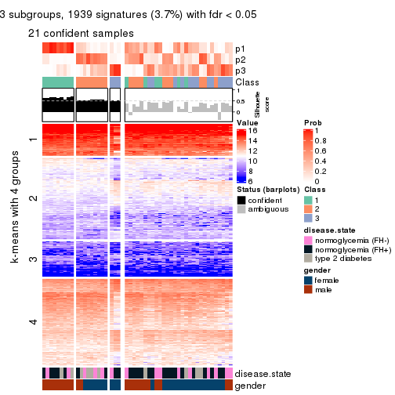</p>

</div>
<div id='tab-SD-NMF-get-signatures-no-scale-3'>
<pre><code class="r">get_signatures(res, k = 4, scale_rows = FALSE)
</code></pre>

<p></p>

</div>
<div id='tab-SD-NMF-get-signatures-no-scale-4'>
<pre><code class="r">get_signatures(res, k = 5, scale_rows = FALSE)
</code></pre>

<p></p>

</div>
<div id='tab-SD-NMF-get-signatures-no-scale-5'>
<pre><code class="r">get_signatures(res, k = 6, scale_rows = FALSE)
</code></pre>

<p></p>

</div>
</div>


Compare the overlap of signatures from different k:

```r
compare_signatures(res)
```


`get_signature()` returns a data frame invisibly. TO get the list of signatures, the function
call should be assigned to a variable explicitly. In following code, if `plot` argument is set
to `FALSE`, no heatmap is plotted while only the differential analysis is performed.

```r
# code only for demonstration
tb = get_signature(res, k = ..., plot = FALSE)
```

An example of the output of `tb` is:

```
#>   which_row         fdr    mean_1    mean_2 scaled_mean_1 scaled_mean_2 km
#> 1        38 0.042760348  8.373488  9.131774    -0.5533452     0.5164555  1
#> 2        40 0.018707592  7.106213  8.469186    -0.6173731     0.5762149  1
#> 3        55 0.019134737 10.221463 11.207825    -0.6159697     0.5749050  1
#> 4        59 0.006059896  5.921854  7.869574    -0.6899429     0.6439467  1
#> 5        60 0.018055526  8.928898 10.211722    -0.6204761     0.5791110  1
#> 6        98 0.009384629 15.714769 14.887706     0.6635654    -0.6193277  2
...
```

The columns in `tb` are:

1. `which_row`: row indices corresponding to the input matrix.
2. `fdr`: FDR for the differential test. 
3. `mean_x`: The mean value in group x.
4. `scaled_mean_x`: The mean value in group x after rows are scaled.
5. `km`: Row groups if k-means clustering is applied to rows.


UMAP plot which shows how samples are separated.


<script>
$( function() {
	$( '#tabs-SD-NMF-dimension-reduction' ).tabs();
} );
</script>
<div id='tabs-SD-NMF-dimension-reduction'>
<ul>
<li><a href='#tab-SD-NMF-dimension-reduction-1'>k = 2</a></li>
<li><a href='#tab-SD-NMF-dimension-reduction-2'>k = 3</a></li>
<li><a href='#tab-SD-NMF-dimension-reduction-3'>k = 4</a></li>
<li><a href='#tab-SD-NMF-dimension-reduction-4'>k = 5</a></li>
<li><a href='#tab-SD-NMF-dimension-reduction-5'>k = 6</a></li>
</ul>
<div id='tab-SD-NMF-dimension-reduction-1'>
<pre><code class="r">dimension_reduction(res, k = 2, method = &quot;UMAP&quot;)
</code></pre>

<p></p>

</div>
<div id='tab-SD-NMF-dimension-reduction-2'>
<pre><code class="r">dimension_reduction(res, k = 3, method = &quot;UMAP&quot;)
</code></pre>

<p></p>

</div>
<div id='tab-SD-NMF-dimension-reduction-3'>
<pre><code class="r">dimension_reduction(res, k = 4, method = &quot;UMAP&quot;)
</code></pre>

<p></p>

</div>
<div id='tab-SD-NMF-dimension-reduction-4'>
<pre><code class="r">dimension_reduction(res, k = 5, method = &quot;UMAP&quot;)
</code></pre>

<p></p>

</div>
<div id='tab-SD-NMF-dimension-reduction-5'>
<pre><code class="r">dimension_reduction(res, k = 6, method = &quot;UMAP&quot;)
</code></pre>

<p></p>

</div>
</div>


Following heatmap shows how subgroups are split when increasing `k`:

```r
collect_classes(res)
```


Test correlation between subgroups and known annotations. If the known
annotation is numeric, one-way ANOVA test is applied, and if the known
annotation is discrete, chi-squared contingency table test is applied.

```r
test_to_known_factors(res)
```

```
#>         n disease.state(p) gender(p) k
#> SD:NMF 28            0.769  0.001823 2
#> SD:NMF 21            0.458  0.000622 3
#> SD:NMF 17            0.878  0.000203 4
#> SD:NMF 10            0.435  0.012298 5
#> SD:NMF  7            0.327  0.060920 6
```


If matrix rows can be associated to genes, consider to use `functional_enrichment(res,
...)` to perform function enrichment for the signature genes. See [this vignette](http://bioconductor.org/packages/devel/bioc/vignettes/cola/inst/doc/functional_enrichment.html) for more detailed explanations.


 

---------------------------------------------------


### CV:hclust


The object with results only for a single top-value method and a single partition method 
can be extracted as:

```r
res = res_list["CV", "hclust"]
# you can also extract it by
# res = res_list["CV:hclust"]
```

A summary of `res` and all the functions that can be applied to it:

```r
res
```

```
#> A 'ConsensusPartition' object with k = 2, 3, 4, 5, 6.
#>   On a matrix with 51941 rows and 50 columns.
#>   Top rows (1000, 2000, 3000, 4000, 5000) are extracted by 'CV' method.
#>   Subgroups are detected by 'hclust' method.
#>   Performed in total 1250 partitions by row resampling.
#>   Best k for subgroups seems to be 3.
#> 
#> Following methods can be applied to this 'ConsensusPartition' object:
#>  [1] "cola_report"             "collect_classes"         "collect_plots"          
#>  [4] "collect_stats"           "colnames"                "compare_signatures"     
#>  [7] "consensus_heatmap"       "dimension_reduction"     "functional_enrichment"  
#> [10] "get_anno_col"            "get_anno"                "get_classes"            
#> [13] "get_consensus"           "get_matrix"              "get_membership"         
#> [16] "get_param"               "get_signatures"          "get_stats"              
#> [19] "is_best_k"               "is_stable_k"             "membership_heatmap"     
#> [22] "ncol"                    "nrow"                    "plot_ecdf"              
#> [25] "rownames"                "select_partition_number" "show"                   
#> [28] "suggest_best_k"          "test_to_known_factors"
```

`collect_plots()` function collects all the plots made from `res` for all `k` (number of partitions)
into one single page to provide an easy and fast comparison between different `k`.

```r
collect_plots(res)
```


The plots are:

- The first row: a plot of the ECDF (empirical cumulative distribution
  function) curves of the consensus matrix for each `k` and the heatmap of
  predicted classes for each `k`.
- The second row: heatmaps of the consensus matrix for each `k`.
- The third row: heatmaps of the membership matrix for each `k`.
- The fouth row: heatmaps of the signatures for each `k`.

All the plots in panels can be made by individual functions and they are
plotted later in this section.

`select_partition_number()` produces several plots showing different
statistics for choosing "optimized" `k`. There are following statistics:

- ECDF curves of the consensus matrix for each `k`;
- 1-PAC. [The PAC
  score](https://en.wikipedia.org/wiki/Consensus_clustering#Over-interpretation_potential_of_consensus_clustering)
  measures the proportion of the ambiguous subgrouping.
- Mean silhouette score.
- Concordance. The mean probability of fiting the consensus class ids in all
  partitions.
- Area increased. Denote $A_k$ as the area under the ECDF curve for current
  `k`, the area increased is defined as $A_k - A_{k-1}$.
- Rand index. The percent of pairs of samples that are both in a same cluster
  or both are not in a same cluster in the partition of k and k-1.
- Jaccard index. The ratio of pairs of samples are both in a same cluster in
  the partition of k and k-1 and the pairs of samples are both in a same
  cluster in the partition k or k-1.

The detailed explanations of these statistics can be found in [the _cola_
vignette](http://bioconductor.org/packages/devel/bioc/vignettes/cola/inst/doc/cola.html#toc_13).

Generally speaking, lower PAC score, higher mean silhouette score or higher
concordance corresponds to better partition. Rand index and Jaccard index
measure how similar the current partition is compared to partition with `k-1`.
If they are too similar, we won't accept `k` is better than `k-1`.

```r
select_partition_number(res)
```


The numeric values for all these statistics can be obtained by `get_stats()`.

```r
get_stats(res)
```

```
#>   k  1-PAC mean_silhouette concordance area_increased  Rand Jaccard
#> 2 2 0.2516           0.826       0.844         0.1895 0.960   0.960
#> 3 3 0.1147           0.497       0.761         0.8469 0.887   0.883
#> 4 4 0.0786           0.684       0.744         0.2093 0.729   0.684
#> 5 5 0.0666           0.639       0.735         0.2240 0.995   0.992
#> 6 6 0.1462           0.612       0.695         0.0962 0.995   0.992
```

`suggest_best_k()` suggests the best $k$ based on these statistics. The rules are as follows:

- All $k$ with Jaccard index larger than 0.95 are removed because increasing
  $k$ does not provide enough extra information. If all $k$ are removed, it is
  marked as no subgroup is detected.
- For all $k$ with 1-PAC score larger than 0.9, the maximal $k$ is taken as
  the best $k$, and other $k$ are marked as optional $k$.
- If it does not fit the second rule. The $k$ with the maximal vote of the
  highest 1-PAC score, highest mean silhouette, and highest concordance is
  taken as the best $k$.

```r
suggest_best_k(res)
```

```
#> [1] 3
```


Following shows the table of the partitions (You need to click the **show/hide
code output** link to see it). The membership matrix (columns with name `p*`)
is inferred by
[`clue::cl_consensus()`](https://www.rdocumentation.org/link/cl_consensus?package=clue)
function with the `SE` method. Basically the value in the membership matrix
represents the probability to belong to a certain group. The finall class
label for an item is determined with the group with highest probability it
belongs to.

In `get_classes()` function, the entropy is calculated from the membership
matrix and the silhouette score is calculated from the consensus matrix.


<script>
$( function() {
	$( '#tabs-CV-hclust-get-classes' ).tabs();
} );
</script>
<div id='tabs-CV-hclust-get-classes'>
<ul>
<li><a href='#tab-CV-hclust-get-classes-1'>k = 2</a></li>
<li><a href='#tab-CV-hclust-get-classes-2'>k = 3</a></li>
<li><a href='#tab-CV-hclust-get-classes-3'>k = 4</a></li>
<li><a href='#tab-CV-hclust-get-classes-4'>k = 5</a></li>
<li><a href='#tab-CV-hclust-get-classes-5'>k = 6</a></li>
</ul>

<div id='tab-CV-hclust-get-classes-1'>
<p><a id='tab-CV-hclust-get-classes-1-a' style='color:#0366d6' href='#'>show/hide code output</a></p>
<pre><code class="r">cbind(get_classes(res, k = 2), get_membership(res, k = 2))
</code></pre>

<pre><code>#&gt;           class entropy silhouette    p1    p2
#&gt; GSM624962     2   0.518      0.877 0.116 0.884
#&gt; GSM624963     2   0.518      0.877 0.116 0.884
#&gt; GSM624967     2   0.855      0.674 0.280 0.720
#&gt; GSM624968     2   0.781      0.740 0.232 0.768
#&gt; GSM624969     2   0.430      0.864 0.088 0.912
#&gt; GSM624970     2   0.595      0.837 0.144 0.856
#&gt; GSM624961     2   0.343      0.878 0.064 0.936
#&gt; GSM624964     2   0.430      0.879 0.088 0.912
#&gt; GSM624965     2   0.373      0.882 0.072 0.928
#&gt; GSM624966     2   0.416      0.873 0.084 0.916
#&gt; GSM624925     2   0.430      0.885 0.088 0.912
#&gt; GSM624927     2   0.482      0.856 0.104 0.896
#&gt; GSM624929     2   0.327      0.883 0.060 0.940
#&gt; GSM624930     2   0.506      0.853 0.112 0.888
#&gt; GSM624931     2   0.443      0.862 0.092 0.908
#&gt; GSM624935     2   0.494      0.880 0.108 0.892
#&gt; GSM624936     2   0.373      0.877 0.072 0.928
#&gt; GSM624937     1   0.714      0.000 0.804 0.196
#&gt; GSM624926     2   0.802      0.732 0.244 0.756
#&gt; GSM624928     2   0.311      0.880 0.056 0.944
#&gt; GSM624932     2   0.469      0.873 0.100 0.900
#&gt; GSM624933     2   0.494      0.874 0.108 0.892
#&gt; GSM624934     2   0.343      0.882 0.064 0.936
#&gt; GSM624971     2   0.605      0.826 0.148 0.852
#&gt; GSM624973     2   0.416      0.880 0.084 0.916
#&gt; GSM624938     2   0.634      0.816 0.160 0.840
#&gt; GSM624940     2   0.730      0.772 0.204 0.796
#&gt; GSM624941     2   0.443      0.862 0.092 0.908
#&gt; GSM624942     2   0.430      0.872 0.088 0.912
#&gt; GSM624943     2   0.402      0.873 0.080 0.920
#&gt; GSM624945     2   0.311      0.882 0.056 0.944
#&gt; GSM624946     2   0.634      0.816 0.160 0.840
#&gt; GSM624949     2   0.541      0.867 0.124 0.876
#&gt; GSM624951     2   0.529      0.851 0.120 0.880
#&gt; GSM624952     2   0.343      0.883 0.064 0.936
#&gt; GSM624955     2   0.861      0.679 0.284 0.716
#&gt; GSM624956     2   0.373      0.885 0.072 0.928
#&gt; GSM624957     2   0.482      0.859 0.104 0.896
#&gt; GSM624974     2   0.295      0.883 0.052 0.948
#&gt; GSM624939     2   0.469      0.883 0.100 0.900
#&gt; GSM624944     2   0.844      0.682 0.272 0.728
#&gt; GSM624947     2   0.552      0.851 0.128 0.872
#&gt; GSM624948     2   0.416      0.879 0.084 0.916
#&gt; GSM624950     2   0.821      0.715 0.256 0.744
#&gt; GSM624953     2   0.373      0.875 0.072 0.928
#&gt; GSM624954     2   0.311      0.883 0.056 0.944
#&gt; GSM624958     2   0.615      0.843 0.152 0.848
#&gt; GSM624959     2   0.327      0.882 0.060 0.940
#&gt; GSM624960     2   0.821      0.703 0.256 0.744
#&gt; GSM624972     2   0.388      0.875 0.076 0.924
</code></pre>

<script>
$('#tab-CV-hclust-get-classes-1-a').parent().next().next().hide();
$('#tab-CV-hclust-get-classes-1-a').click(function(){
  $('#tab-CV-hclust-get-classes-1-a').parent().next().next().toggle();
  return(false);
});
</script>
</div>

<div id='tab-CV-hclust-get-classes-2'>
<p><a id='tab-CV-hclust-get-classes-2-a' style='color:#0366d6' href='#'>show/hide code output</a></p>
<pre><code class="r">cbind(get_classes(res, k = 3), get_membership(res, k = 3))
</code></pre>

<pre><code>#&gt;           class entropy silhouette    p1    p2    p3
#&gt; GSM624962     2   0.545      0.596 0.012 0.760 0.228
#&gt; GSM624963     2   0.522      0.621 0.012 0.780 0.208
#&gt; GSM624967     3   0.774      0.717 0.048 0.444 0.508
#&gt; GSM624968     2   0.748     -0.632 0.036 0.512 0.452
#&gt; GSM624969     2   0.390      0.671 0.008 0.864 0.128
#&gt; GSM624970     2   0.553      0.619 0.036 0.792 0.172
#&gt; GSM624961     2   0.375      0.667 0.020 0.884 0.096
#&gt; GSM624964     2   0.468      0.648 0.028 0.840 0.132
#&gt; GSM624965     2   0.434      0.662 0.016 0.848 0.136
#&gt; GSM624966     2   0.448      0.654 0.024 0.848 0.128
#&gt; GSM624925     2   0.385      0.681 0.016 0.876 0.108
#&gt; GSM624927     2   0.435      0.660 0.008 0.836 0.156
#&gt; GSM624929     2   0.296      0.698 0.008 0.912 0.080
#&gt; GSM624930     2   0.484      0.640 0.016 0.816 0.168
#&gt; GSM624931     2   0.423      0.664 0.008 0.844 0.148
#&gt; GSM624935     2   0.454      0.655 0.016 0.836 0.148
#&gt; GSM624936     2   0.285      0.695 0.012 0.920 0.068
#&gt; GSM624937     1   0.165      0.000 0.960 0.036 0.004
#&gt; GSM624926     2   0.773     -0.625 0.048 0.516 0.436
#&gt; GSM624928     2   0.361      0.670 0.016 0.888 0.096
#&gt; GSM624932     2   0.495      0.638 0.016 0.808 0.176
#&gt; GSM624933     2   0.487      0.647 0.032 0.832 0.136
#&gt; GSM624934     2   0.277      0.699 0.004 0.916 0.080
#&gt; GSM624971     2   0.679      0.158 0.012 0.540 0.448
#&gt; GSM624973     2   0.486      0.652 0.020 0.820 0.160
#&gt; GSM624938     2   0.693      0.159 0.016 0.528 0.456
#&gt; GSM624940     2   0.737      0.168 0.032 0.520 0.448
#&gt; GSM624941     2   0.390      0.670 0.008 0.864 0.128
#&gt; GSM624942     2   0.375      0.679 0.008 0.872 0.120
#&gt; GSM624943     2   0.361      0.682 0.008 0.880 0.112
#&gt; GSM624945     2   0.312      0.676 0.012 0.908 0.080
#&gt; GSM624946     2   0.693      0.159 0.016 0.528 0.456
#&gt; GSM624949     2   0.507      0.572 0.012 0.792 0.196
#&gt; GSM624951     2   0.502      0.626 0.012 0.796 0.192
#&gt; GSM624952     2   0.303      0.695 0.012 0.912 0.076
#&gt; GSM624955     3   0.690      0.585 0.040 0.292 0.668
#&gt; GSM624956     2   0.304      0.694 0.008 0.908 0.084
#&gt; GSM624957     2   0.420      0.672 0.012 0.852 0.136
#&gt; GSM624974     2   0.304      0.689 0.000 0.896 0.104
#&gt; GSM624939     2   0.416      0.675 0.008 0.848 0.144
#&gt; GSM624944     3   0.828      0.651 0.076 0.460 0.464
#&gt; GSM624947     2   0.625      0.492 0.044 0.744 0.212
#&gt; GSM624948     2   0.426      0.654 0.012 0.848 0.140
#&gt; GSM624950     2   0.746     -0.625 0.036 0.524 0.440
#&gt; GSM624953     2   0.375      0.661 0.020 0.884 0.096
#&gt; GSM624954     2   0.288      0.690 0.000 0.904 0.096
#&gt; GSM624958     2   0.611      0.542 0.048 0.760 0.192
#&gt; GSM624959     2   0.346      0.676 0.024 0.900 0.076
#&gt; GSM624960     2   0.833     -0.696 0.080 0.480 0.440
#&gt; GSM624972     2   0.383      0.660 0.020 0.880 0.100
</code></pre>

<script>
$('#tab-CV-hclust-get-classes-2-a').parent().next().next().hide();
$('#tab-CV-hclust-get-classes-2-a').click(function(){
  $('#tab-CV-hclust-get-classes-2-a').parent().next().next().toggle();
  return(false);
});
</script>
</div>

<div id='tab-CV-hclust-get-classes-3'>
<p><a id='tab-CV-hclust-get-classes-3-a' style='color:#0366d6' href='#'>show/hide code output</a></p>
<pre><code class="r">cbind(get_classes(res, k = 4), get_membership(res, k = 4))
</code></pre>

<pre><code>#&gt;           class entropy silhouette    p1    p2    p3    p4
#&gt; GSM624962     2  0.5936    0.57455 0.004 0.708 0.160 0.128
#&gt; GSM624963     2  0.5760    0.61446 0.004 0.724 0.140 0.132
#&gt; GSM624967     4  0.7938    0.59874 0.020 0.312 0.180 0.488
#&gt; GSM624968     4  0.6096    0.68689 0.004 0.376 0.044 0.576
#&gt; GSM624969     2  0.4171    0.72492 0.000 0.824 0.116 0.060
#&gt; GSM624970     2  0.5626    0.57041 0.012 0.724 0.204 0.060
#&gt; GSM624961     2  0.3266    0.74037 0.000 0.876 0.040 0.084
#&gt; GSM624964     2  0.4423    0.72407 0.000 0.788 0.036 0.176
#&gt; GSM624965     2  0.4203    0.71533 0.000 0.824 0.068 0.108
#&gt; GSM624966     2  0.4100    0.74565 0.000 0.816 0.036 0.148
#&gt; GSM624925     2  0.3156    0.75799 0.000 0.884 0.048 0.068
#&gt; GSM624927     2  0.4532    0.70272 0.000 0.792 0.156 0.052
#&gt; GSM624929     2  0.2750    0.76828 0.004 0.908 0.056 0.032
#&gt; GSM624930     2  0.4900    0.65538 0.004 0.768 0.180 0.048
#&gt; GSM624931     2  0.4586    0.71184 0.000 0.796 0.136 0.068
#&gt; GSM624935     2  0.5100    0.72149 0.004 0.772 0.088 0.136
#&gt; GSM624936     2  0.2256    0.76284 0.000 0.924 0.056 0.020
#&gt; GSM624937     1  0.0592    0.00000 0.984 0.016 0.000 0.000
#&gt; GSM624926     4  0.5770    0.67216 0.008 0.392 0.020 0.580
#&gt; GSM624928     2  0.3216    0.74456 0.000 0.880 0.044 0.076
#&gt; GSM624932     2  0.4857    0.58020 0.004 0.764 0.192 0.040
#&gt; GSM624933     2  0.4237    0.72814 0.000 0.808 0.040 0.152
#&gt; GSM624934     2  0.3088    0.76438 0.000 0.888 0.060 0.052
#&gt; GSM624971     3  0.5716    0.89152 0.000 0.420 0.552 0.028
#&gt; GSM624973     2  0.5361    0.67467 0.000 0.744 0.108 0.148
#&gt; GSM624938     3  0.5310    0.92192 0.000 0.412 0.576 0.012
#&gt; GSM624940     3  0.5152    0.81423 0.004 0.384 0.608 0.004
#&gt; GSM624941     2  0.4150    0.72609 0.000 0.824 0.120 0.056
#&gt; GSM624942     2  0.4188    0.73833 0.000 0.824 0.112 0.064
#&gt; GSM624943     2  0.4071    0.74159 0.000 0.832 0.104 0.064
#&gt; GSM624945     2  0.2797    0.75460 0.000 0.900 0.032 0.068
#&gt; GSM624946     3  0.5310    0.92192 0.000 0.412 0.576 0.012
#&gt; GSM624949     2  0.5548    0.62447 0.004 0.736 0.096 0.164
#&gt; GSM624951     2  0.5022    0.60697 0.000 0.736 0.220 0.044
#&gt; GSM624952     2  0.2751    0.76533 0.000 0.904 0.056 0.040
#&gt; GSM624955     4  0.7239   -0.00895 0.016 0.128 0.280 0.576
#&gt; GSM624956     2  0.2844    0.76623 0.000 0.900 0.052 0.048
#&gt; GSM624957     2  0.4513    0.73652 0.000 0.804 0.120 0.076
#&gt; GSM624974     2  0.3691    0.75471 0.000 0.856 0.068 0.076
#&gt; GSM624939     2  0.4359    0.74515 0.000 0.816 0.084 0.100
#&gt; GSM624944     4  0.7314    0.67547 0.016 0.340 0.112 0.532
#&gt; GSM624947     2  0.5392    0.53624 0.000 0.680 0.040 0.280
#&gt; GSM624948     2  0.4071    0.71864 0.000 0.832 0.064 0.104
#&gt; GSM624950     4  0.6289    0.62241 0.004 0.432 0.048 0.516
#&gt; GSM624953     2  0.3117    0.74200 0.000 0.880 0.028 0.092
#&gt; GSM624954     2  0.3453    0.76045 0.000 0.868 0.052 0.080
#&gt; GSM624958     2  0.5471    0.59815 0.004 0.724 0.064 0.208
#&gt; GSM624959     2  0.2892    0.75055 0.000 0.896 0.036 0.068
#&gt; GSM624960     4  0.7169    0.63649 0.008 0.336 0.120 0.536
#&gt; GSM624972     2  0.3215    0.74291 0.000 0.876 0.032 0.092
</code></pre>

<script>
$('#tab-CV-hclust-get-classes-3-a').parent().next().next().hide();
$('#tab-CV-hclust-get-classes-3-a').click(function(){
  $('#tab-CV-hclust-get-classes-3-a').parent().next().next().toggle();
  return(false);
});
</script>
</div>

<div id='tab-CV-hclust-get-classes-4'>
<p><a id='tab-CV-hclust-get-classes-4-a' style='color:#0366d6' href='#'>show/hide code output</a></p>
<pre><code class="r">cbind(get_classes(res, k = 5), get_membership(res, k = 5))
</code></pre>

<pre><code>#&gt;           class entropy silhouette    p1    p2    p3    p4    p5
#&gt; GSM624962     2   0.625      0.579 0.004 0.664 0.140 0.060 0.132
#&gt; GSM624963     2   0.620      0.588 0.004 0.672 0.120 0.068 0.136
#&gt; GSM624967     4   0.800      0.094 0.000 0.180 0.120 0.408 0.292
#&gt; GSM624968     4   0.619      0.653 0.000 0.248 0.032 0.612 0.108
#&gt; GSM624969     2   0.417      0.692 0.000 0.672 0.008 0.000 0.320
#&gt; GSM624970     2   0.648      0.527 0.004 0.528 0.076 0.036 0.356
#&gt; GSM624961     2   0.241      0.704 0.000 0.912 0.028 0.044 0.016
#&gt; GSM624964     2   0.539      0.668 0.000 0.684 0.012 0.100 0.204
#&gt; GSM624965     2   0.414      0.670 0.000 0.820 0.056 0.048 0.076
#&gt; GSM624966     2   0.410      0.709 0.000 0.816 0.024 0.076 0.084
#&gt; GSM624925     2   0.242      0.728 0.000 0.912 0.016 0.032 0.040
#&gt; GSM624927     2   0.486      0.675 0.000 0.636 0.040 0.000 0.324
#&gt; GSM624929     2   0.249      0.749 0.004 0.896 0.020 0.000 0.080
#&gt; GSM624930     2   0.542      0.648 0.004 0.608 0.068 0.000 0.320
#&gt; GSM624931     2   0.495      0.676 0.000 0.636 0.024 0.012 0.328
#&gt; GSM624935     2   0.574      0.670 0.000 0.656 0.040 0.064 0.240
#&gt; GSM624936     2   0.250      0.746 0.000 0.880 0.004 0.004 0.112
#&gt; GSM624937     1   0.000      0.000 1.000 0.000 0.000 0.000 0.000
#&gt; GSM624926     4   0.576      0.681 0.000 0.280 0.016 0.620 0.084
#&gt; GSM624928     2   0.199      0.714 0.000 0.932 0.020 0.032 0.016
#&gt; GSM624932     2   0.561      0.587 0.004 0.688 0.120 0.016 0.172
#&gt; GSM624933     2   0.440      0.699 0.000 0.792 0.024 0.072 0.112
#&gt; GSM624934     2   0.377      0.749 0.000 0.808 0.020 0.016 0.156
#&gt; GSM624971     3   0.466      0.823 0.000 0.268 0.692 0.004 0.036
#&gt; GSM624973     2   0.618      0.640 0.000 0.664 0.108 0.076 0.152
#&gt; GSM624938     3   0.450      0.854 0.000 0.244 0.712 0.000 0.044
#&gt; GSM624940     3   0.543      0.587 0.000 0.120 0.648 0.000 0.232
#&gt; GSM624941     2   0.437      0.691 0.000 0.664 0.016 0.000 0.320
#&gt; GSM624942     2   0.453      0.701 0.000 0.680 0.012 0.012 0.296
#&gt; GSM624943     2   0.446      0.706 0.000 0.692 0.012 0.012 0.284
#&gt; GSM624945     2   0.170      0.722 0.000 0.944 0.012 0.028 0.016
#&gt; GSM624946     3   0.450      0.854 0.000 0.244 0.712 0.000 0.044
#&gt; GSM624949     2   0.622      0.591 0.000 0.660 0.072 0.124 0.144
#&gt; GSM624951     2   0.572      0.621 0.000 0.584 0.112 0.000 0.304
#&gt; GSM624952     2   0.295      0.744 0.000 0.884 0.028 0.024 0.064
#&gt; GSM624955     5   0.682      0.000 0.000 0.032 0.148 0.308 0.512
#&gt; GSM624956     2   0.260      0.742 0.000 0.904 0.028 0.024 0.044
#&gt; GSM624957     2   0.481      0.699 0.000 0.668 0.020 0.016 0.296
#&gt; GSM624974     2   0.464      0.729 0.000 0.756 0.040 0.028 0.176
#&gt; GSM624939     2   0.522      0.710 0.000 0.704 0.032 0.052 0.212
#&gt; GSM624944     4   0.673      0.566 0.000 0.212 0.064 0.592 0.132
#&gt; GSM624947     2   0.645      0.494 0.000 0.580 0.020 0.204 0.196
#&gt; GSM624948     2   0.387      0.682 0.000 0.836 0.044 0.048 0.072
#&gt; GSM624950     4   0.588      0.652 0.000 0.320 0.008 0.576 0.096
#&gt; GSM624953     2   0.192      0.708 0.000 0.932 0.012 0.044 0.012
#&gt; GSM624954     2   0.417      0.727 0.000 0.748 0.016 0.012 0.224
#&gt; GSM624958     2   0.478      0.579 0.000 0.756 0.032 0.160 0.052
#&gt; GSM624959     2   0.205      0.717 0.000 0.928 0.020 0.040 0.012
#&gt; GSM624960     4   0.651      0.517 0.000 0.204 0.088 0.620 0.088
#&gt; GSM624972     2   0.203      0.710 0.000 0.928 0.012 0.044 0.016
</code></pre>

<script>
$('#tab-CV-hclust-get-classes-4-a').parent().next().next().hide();
$('#tab-CV-hclust-get-classes-4-a').click(function(){
  $('#tab-CV-hclust-get-classes-4-a').parent().next().next().toggle();
  return(false);
});
</script>
</div>

<div id='tab-CV-hclust-get-classes-5'>
<p><a id='tab-CV-hclust-get-classes-5-a' style='color:#0366d6' href='#'>show/hide code output</a></p>
<pre><code class="r">cbind(get_classes(res, k = 6), get_membership(res, k = 6))
</code></pre>

<pre><code>#&gt;           class entropy silhouette p1    p2    p3    p4    p5 p6
#&gt; GSM624962     2   0.608     0.5643  0 0.628 0.144 0.016 0.056 NA
#&gt; GSM624963     2   0.604     0.5748  0 0.636 0.124 0.020 0.056 NA
#&gt; GSM624967     5   0.650     0.0672  0 0.136 0.028 0.164 0.600 NA
#&gt; GSM624968     4   0.681     0.5738  0 0.176 0.028 0.568 0.096 NA
#&gt; GSM624969     2   0.401     0.6736  0 0.616 0.012 0.000 0.000 NA
#&gt; GSM624970     2   0.533     0.4806  0 0.464 0.052 0.016 0.004 NA
#&gt; GSM624961     2   0.240     0.6873  0 0.904 0.020 0.036 0.004 NA
#&gt; GSM624964     2   0.496     0.6493  0 0.648 0.004 0.112 0.000 NA
#&gt; GSM624965     2   0.399     0.6518  0 0.800 0.040 0.036 0.008 NA
#&gt; GSM624966     2   0.413     0.6894  0 0.780 0.016 0.084 0.004 NA
#&gt; GSM624925     2   0.242     0.7176  0 0.900 0.016 0.024 0.004 NA
#&gt; GSM624927     2   0.454     0.6554  0 0.576 0.040 0.000 0.000 NA
#&gt; GSM624929     2   0.279     0.7352  0 0.864 0.032 0.000 0.008 NA
#&gt; GSM624930     2   0.508     0.6308  0 0.544 0.072 0.004 0.000 NA
#&gt; GSM624931     2   0.468     0.6572  0 0.580 0.024 0.016 0.000 NA
#&gt; GSM624935     2   0.567     0.6595  0 0.592 0.040 0.044 0.020 NA
#&gt; GSM624936     2   0.268     0.7337  0 0.852 0.008 0.008 0.000 NA
#&gt; GSM624937     1   0.000     0.0000  1 0.000 0.000 0.000 0.000 NA
#&gt; GSM624926     4   0.581     0.6212  0 0.204 0.012 0.632 0.040 NA
#&gt; GSM624928     2   0.192     0.6989  0 0.928 0.012 0.028 0.004 NA
#&gt; GSM624932     2   0.507     0.5760  0 0.668 0.124 0.008 0.004 NA
#&gt; GSM624933     2   0.409     0.6876  0 0.772 0.016 0.076 0.000 NA
#&gt; GSM624934     2   0.369     0.7354  0 0.788 0.012 0.020 0.008 NA
#&gt; GSM624971     3   0.368     0.7718  0 0.228 0.748 0.008 0.000 NA
#&gt; GSM624973     2   0.578     0.6253  0 0.632 0.100 0.080 0.000 NA
#&gt; GSM624938     3   0.317     0.8180  0 0.192 0.792 0.000 0.000 NA
#&gt; GSM624940     3   0.508     0.4776  0 0.060 0.656 0.020 0.008 NA
#&gt; GSM624941     2   0.438     0.6707  0 0.604 0.024 0.004 0.000 NA
#&gt; GSM624942     2   0.450     0.6821  0 0.624 0.012 0.012 0.008 NA
#&gt; GSM624943     2   0.437     0.6858  0 0.632 0.016 0.004 0.008 NA
#&gt; GSM624945     2   0.171     0.7094  0 0.936 0.016 0.024 0.000 NA
#&gt; GSM624946     3   0.317     0.8180  0 0.192 0.792 0.000 0.000 NA
#&gt; GSM624949     2   0.640     0.5963  0 0.612 0.072 0.096 0.036 NA
#&gt; GSM624951     2   0.553     0.6027  0 0.524 0.112 0.008 0.000 NA
#&gt; GSM624952     2   0.331     0.7306  0 0.848 0.048 0.012 0.012 NA
#&gt; GSM624955     5   0.511     0.0647  0 0.008 0.020 0.060 0.652 NA
#&gt; GSM624956     2   0.297     0.7278  0 0.872 0.048 0.012 0.012 NA
#&gt; GSM624957     2   0.444     0.6856  0 0.620 0.012 0.020 0.000 NA
#&gt; GSM624974     2   0.455     0.7126  0 0.720 0.036 0.032 0.004 NA
#&gt; GSM624939     2   0.488     0.6912  0 0.664 0.028 0.052 0.000 NA
#&gt; GSM624944     4   0.638     0.3577  0 0.116 0.024 0.608 0.176 NA
#&gt; GSM624947     2   0.620     0.4828  0 0.532 0.012 0.220 0.012 NA
#&gt; GSM624948     2   0.346     0.6743  0 0.832 0.032 0.044 0.000 NA
#&gt; GSM624950     4   0.621     0.5729  0 0.244 0.008 0.568 0.044 NA
#&gt; GSM624953     2   0.190     0.6947  0 0.928 0.008 0.032 0.004 NA
#&gt; GSM624954     2   0.411     0.7134  0 0.708 0.012 0.016 0.004 NA
#&gt; GSM624958     2   0.449     0.5909  0 0.748 0.016 0.152 0.008 NA
#&gt; GSM624959     2   0.209     0.7029  0 0.920 0.016 0.036 0.004 NA
#&gt; GSM624960     4   0.484     0.3179  0 0.080 0.072 0.748 0.008 NA
#&gt; GSM624972     2   0.197     0.6966  0 0.924 0.008 0.036 0.004 NA
</code></pre>

<script>
$('#tab-CV-hclust-get-classes-5-a').parent().next().next().hide();
$('#tab-CV-hclust-get-classes-5-a').click(function(){
  $('#tab-CV-hclust-get-classes-5-a').parent().next().next().toggle();
  return(false);
});
</script>
</div>
</div>

Heatmaps for the consensus matrix. It visualizes the probability of two
samples to be in a same group.


<script>
$( function() {
	$( '#tabs-CV-hclust-consensus-heatmap' ).tabs();
} );
</script>
<div id='tabs-CV-hclust-consensus-heatmap'>
<ul>
<li><a href='#tab-CV-hclust-consensus-heatmap-1'>k = 2</a></li>
<li><a href='#tab-CV-hclust-consensus-heatmap-2'>k = 3</a></li>
<li><a href='#tab-CV-hclust-consensus-heatmap-3'>k = 4</a></li>
<li><a href='#tab-CV-hclust-consensus-heatmap-4'>k = 5</a></li>
<li><a href='#tab-CV-hclust-consensus-heatmap-5'>k = 6</a></li>
</ul>
<div id='tab-CV-hclust-consensus-heatmap-1'>
<pre><code class="r">consensus_heatmap(res, k = 2)
</code></pre>

<p></p>

</div>
<div id='tab-CV-hclust-consensus-heatmap-2'>
<pre><code class="r">consensus_heatmap(res, k = 3)
</code></pre>

<p></p>

</div>
<div id='tab-CV-hclust-consensus-heatmap-3'>
<pre><code class="r">consensus_heatmap(res, k = 4)
</code></pre>

<p></p>

</div>
<div id='tab-CV-hclust-consensus-heatmap-4'>
<pre><code class="r">consensus_heatmap(res, k = 5)
</code></pre>

<p></p>

</div>
<div id='tab-CV-hclust-consensus-heatmap-5'>
<pre><code class="r">consensus_heatmap(res, k = 6)
</code></pre>

<p></p>

</div>
</div>

Heatmaps for the membership of samples in all partitions to see how consistent they are:


<script>
$( function() {
	$( '#tabs-CV-hclust-membership-heatmap' ).tabs();
} );
</script>
<div id='tabs-CV-hclust-membership-heatmap'>
<ul>
<li><a href='#tab-CV-hclust-membership-heatmap-1'>k = 2</a></li>
<li><a href='#tab-CV-hclust-membership-heatmap-2'>k = 3</a></li>
<li><a href='#tab-CV-hclust-membership-heatmap-3'>k = 4</a></li>
<li><a href='#tab-CV-hclust-membership-heatmap-4'>k = 5</a></li>
<li><a href='#tab-CV-hclust-membership-heatmap-5'>k = 6</a></li>
</ul>
<div id='tab-CV-hclust-membership-heatmap-1'>
<pre><code class="r">membership_heatmap(res, k = 2)
</code></pre>

<p></p>

</div>
<div id='tab-CV-hclust-membership-heatmap-2'>
<pre><code class="r">membership_heatmap(res, k = 3)
</code></pre>

<p></p>

</div>
<div id='tab-CV-hclust-membership-heatmap-3'>
<pre><code class="r">membership_heatmap(res, k = 4)
</code></pre>

<p></p>

</div>
<div id='tab-CV-hclust-membership-heatmap-4'>
<pre><code class="r">membership_heatmap(res, k = 5)
</code></pre>

<p></p>

</div>
<div id='tab-CV-hclust-membership-heatmap-5'>
<pre><code class="r">membership_heatmap(res, k = 6)
</code></pre>

<p></p>

</div>
</div>

As soon as we have had the classes for columns, we can look for signatures
which are significantly different between classes which can be candidate marks
for certain classes. Following are the heatmaps for signatures.


Signature heatmaps where rows are scaled:


<script>
$( function() {
	$( '#tabs-CV-hclust-get-signatures' ).tabs();
} );
</script>
<div id='tabs-CV-hclust-get-signatures'>
<ul>
<li><a href='#tab-CV-hclust-get-signatures-1'>k = 2</a></li>
<li><a href='#tab-CV-hclust-get-signatures-2'>k = 3</a></li>
<li><a href='#tab-CV-hclust-get-signatures-3'>k = 4</a></li>
<li><a href='#tab-CV-hclust-get-signatures-4'>k = 5</a></li>
<li><a href='#tab-CV-hclust-get-signatures-5'>k = 6</a></li>
</ul>
<div id='tab-CV-hclust-get-signatures-1'>
<pre><code class="r">get_signatures(res, k = 2)
</code></pre>

<p></p>

</div>
<div id='tab-CV-hclust-get-signatures-2'>
<pre><code class="r">get_signatures(res, k = 3)
</code></pre>

<p></p>

</div>
<div id='tab-CV-hclust-get-signatures-3'>
<pre><code class="r">get_signatures(res, k = 4)
</code></pre>

<p></p>

</div>
<div id='tab-CV-hclust-get-signatures-4'>
<pre><code class="r">get_signatures(res, k = 5)
</code></pre>

<p></p>

</div>
<div id='tab-CV-hclust-get-signatures-5'>
<pre><code class="r">get_signatures(res, k = 6)
</code></pre>

<p></p>

</div>
</div>


Signature heatmaps where rows are not scaled:


<script>
$( function() {
	$( '#tabs-CV-hclust-get-signatures-no-scale' ).tabs();
} );
</script>
<div id='tabs-CV-hclust-get-signatures-no-scale'>
<ul>
<li><a href='#tab-CV-hclust-get-signatures-no-scale-1'>k = 2</a></li>
<li><a href='#tab-CV-hclust-get-signatures-no-scale-2'>k = 3</a></li>
<li><a href='#tab-CV-hclust-get-signatures-no-scale-3'>k = 4</a></li>
<li><a href='#tab-CV-hclust-get-signatures-no-scale-4'>k = 5</a></li>
<li><a href='#tab-CV-hclust-get-signatures-no-scale-5'>k = 6</a></li>
</ul>
<div id='tab-CV-hclust-get-signatures-no-scale-1'>
<pre><code class="r">get_signatures(res, k = 2, scale_rows = FALSE)
</code></pre>

<p></p>

</div>
<div id='tab-CV-hclust-get-signatures-no-scale-2'>
<pre><code class="r">get_signatures(res, k = 3, scale_rows = FALSE)
</code></pre>

<p></p>

</div>
<div id='tab-CV-hclust-get-signatures-no-scale-3'>
<pre><code class="r">get_signatures(res, k = 4, scale_rows = FALSE)
</code></pre>

<p></p>

</div>
<div id='tab-CV-hclust-get-signatures-no-scale-4'>
<pre><code class="r">get_signatures(res, k = 5, scale_rows = FALSE)
</code></pre>

<p></p>

</div>
<div id='tab-CV-hclust-get-signatures-no-scale-5'>
<pre><code class="r">get_signatures(res, k = 6, scale_rows = FALSE)
</code></pre>

<p></p>

</div>
</div>


Compare the overlap of signatures from different k:

```r
compare_signatures(res)
```


`get_signature()` returns a data frame invisibly. TO get the list of signatures, the function
call should be assigned to a variable explicitly. In following code, if `plot` argument is set
to `FALSE`, no heatmap is plotted while only the differential analysis is performed.

```r
# code only for demonstration
tb = get_signature(res, k = ..., plot = FALSE)
```

An example of the output of `tb` is:

```
#>   which_row         fdr    mean_1    mean_2 scaled_mean_1 scaled_mean_2 km
#> 1        38 0.042760348  8.373488  9.131774    -0.5533452     0.5164555  1
#> 2        40 0.018707592  7.106213  8.469186    -0.6173731     0.5762149  1
#> 3        55 0.019134737 10.221463 11.207825    -0.6159697     0.5749050  1
#> 4        59 0.006059896  5.921854  7.869574    -0.6899429     0.6439467  1
#> 5        60 0.018055526  8.928898 10.211722    -0.6204761     0.5791110  1
#> 6        98 0.009384629 15.714769 14.887706     0.6635654    -0.6193277  2
...
```

The columns in `tb` are:

1. `which_row`: row indices corresponding to the input matrix.
2. `fdr`: FDR for the differential test. 
3. `mean_x`: The mean value in group x.
4. `scaled_mean_x`: The mean value in group x after rows are scaled.
5. `km`: Row groups if k-means clustering is applied to rows.


UMAP plot which shows how samples are separated.


<script>
$( function() {
	$( '#tabs-CV-hclust-dimension-reduction' ).tabs();
} );
</script>
<div id='tabs-CV-hclust-dimension-reduction'>
<ul>
<li><a href='#tab-CV-hclust-dimension-reduction-1'>k = 2</a></li>
<li><a href='#tab-CV-hclust-dimension-reduction-2'>k = 3</a></li>
<li><a href='#tab-CV-hclust-dimension-reduction-3'>k = 4</a></li>
<li><a href='#tab-CV-hclust-dimension-reduction-4'>k = 5</a></li>
<li><a href='#tab-CV-hclust-dimension-reduction-5'>k = 6</a></li>
</ul>
<div id='tab-CV-hclust-dimension-reduction-1'>
<pre><code class="r">dimension_reduction(res, k = 2, method = &quot;UMAP&quot;)
</code></pre>

<p></p>

</div>
<div id='tab-CV-hclust-dimension-reduction-2'>
<pre><code class="r">dimension_reduction(res, k = 3, method = &quot;UMAP&quot;)
</code></pre>

<p></p>

</div>
<div id='tab-CV-hclust-dimension-reduction-3'>
<pre><code class="r">dimension_reduction(res, k = 4, method = &quot;UMAP&quot;)
</code></pre>

<p></p>

</div>
<div id='tab-CV-hclust-dimension-reduction-4'>
<pre><code class="r">dimension_reduction(res, k = 5, method = &quot;UMAP&quot;)
</code></pre>

<p></p>

</div>
<div id='tab-CV-hclust-dimension-reduction-5'>
<pre><code class="r">dimension_reduction(res, k = 6, method = &quot;UMAP&quot;)
</code></pre>

<p></p>

</div>
</div>


Following heatmap shows how subgroups are split when increasing `k`:

```r
collect_classes(res)
```


Test correlation between subgroups and known annotations. If the known
annotation is numeric, one-way ANOVA test is applied, and if the known
annotation is discrete, chi-squared contingency table test is applied.

```r
test_to_known_factors(res)
```

```
#>            n disease.state(p) gender(p) k
#> CV:hclust 49               NA        NA 2
#> CV:hclust 40            0.498     1.000 3
#> CV:hclust 48            0.688     0.413 4
#> CV:hclust 46            0.763     0.207 5
#> CV:hclust 42            0.869     0.692 6
```


If matrix rows can be associated to genes, consider to use `functional_enrichment(res,
...)` to perform function enrichment for the signature genes. See [this vignette](http://bioconductor.org/packages/devel/bioc/vignettes/cola/inst/doc/functional_enrichment.html) for more detailed explanations.


 

---------------------------------------------------


### CV:kmeans


The object with results only for a single top-value method and a single partition method 
can be extracted as:

```r
res = res_list["CV", "kmeans"]
# you can also extract it by
# res = res_list["CV:kmeans"]
```

A summary of `res` and all the functions that can be applied to it:

```r
res
```

```
#> A 'ConsensusPartition' object with k = 2, 3, 4, 5, 6.
#>   On a matrix with 51941 rows and 50 columns.
#>   Top rows (1000, 2000, 3000, 4000, 5000) are extracted by 'CV' method.
#>   Subgroups are detected by 'kmeans' method.
#>   Performed in total 1250 partitions by row resampling.
#>   Best k for subgroups seems to be 4.
#> 
#> Following methods can be applied to this 'ConsensusPartition' object:
#>  [1] "cola_report"             "collect_classes"         "collect_plots"          
#>  [4] "collect_stats"           "colnames"                "compare_signatures"     
#>  [7] "consensus_heatmap"       "dimension_reduction"     "functional_enrichment"  
#> [10] "get_anno_col"            "get_anno"                "get_classes"            
#> [13] "get_consensus"           "get_matrix"              "get_membership"         
#> [16] "get_param"               "get_signatures"          "get_stats"              
#> [19] "is_best_k"               "is_stable_k"             "membership_heatmap"     
#> [22] "ncol"                    "nrow"                    "plot_ecdf"              
#> [25] "rownames"                "select_partition_number" "show"                   
#> [28] "suggest_best_k"          "test_to_known_factors"
```

`collect_plots()` function collects all the plots made from `res` for all `k` (number of partitions)
into one single page to provide an easy and fast comparison between different `k`.

```r
collect_plots(res)
```


The plots are:

- The first row: a plot of the ECDF (empirical cumulative distribution
  function) curves of the consensus matrix for each `k` and the heatmap of
  predicted classes for each `k`.
- The second row: heatmaps of the consensus matrix for each `k`.
- The third row: heatmaps of the membership matrix for each `k`.
- The fouth row: heatmaps of the signatures for each `k`.

All the plots in panels can be made by individual functions and they are
plotted later in this section.

`select_partition_number()` produces several plots showing different
statistics for choosing "optimized" `k`. There are following statistics:

- ECDF curves of the consensus matrix for each `k`;
- 1-PAC. [The PAC
  score](https://en.wikipedia.org/wiki/Consensus_clustering#Over-interpretation_potential_of_consensus_clustering)
  measures the proportion of the ambiguous subgrouping.
- Mean silhouette score.
- Concordance. The mean probability of fiting the consensus class ids in all
  partitions.
- Area increased. Denote $A_k$ as the area under the ECDF curve for current
  `k`, the area increased is defined as $A_k - A_{k-1}$.
- Rand index. The percent of pairs of samples that are both in a same cluster
  or both are not in a same cluster in the partition of k and k-1.
- Jaccard index. The ratio of pairs of samples are both in a same cluster in
  the partition of k and k-1 and the pairs of samples are both in a same
  cluster in the partition k or k-1.

The detailed explanations of these statistics can be found in [the _cola_
vignette](http://bioconductor.org/packages/devel/bioc/vignettes/cola/inst/doc/cola.html#toc_13).

Generally speaking, lower PAC score, higher mean silhouette score or higher
concordance corresponds to better partition. Rand index and Jaccard index
measure how similar the current partition is compared to partition with `k-1`.
If they are too similar, we won't accept `k` is better than `k-1`.

```r
select_partition_number(res)
```


The numeric values for all these statistics can be obtained by `get_stats()`.

```r
get_stats(res)
```

```
#>   k 1-PAC mean_silhouette concordance area_increased  Rand Jaccard
#> 2 2 0.117           0.472       0.726         0.4322 0.589   0.589
#> 3 3 0.201           0.463       0.691         0.3932 0.654   0.465
#> 4 4 0.376           0.612       0.756         0.1370 0.821   0.573
#> 5 5 0.478           0.559       0.755         0.0677 0.944   0.827
#> 6 6 0.557           0.536       0.753         0.0498 0.950   0.833
```

`suggest_best_k()` suggests the best $k$ based on these statistics. The rules are as follows:

- All $k$ with Jaccard index larger than 0.95 are removed because increasing
  $k$ does not provide enough extra information. If all $k$ are removed, it is
  marked as no subgroup is detected.
- For all $k$ with 1-PAC score larger than 0.9, the maximal $k$ is taken as
  the best $k$, and other $k$ are marked as optional $k$.
- If it does not fit the second rule. The $k$ with the maximal vote of the
  highest 1-PAC score, highest mean silhouette, and highest concordance is
  taken as the best $k$.

```r
suggest_best_k(res)
```

```
#> [1] 4
```


Following shows the table of the partitions (You need to click the **show/hide
code output** link to see it). The membership matrix (columns with name `p*`)
is inferred by
[`clue::cl_consensus()`](https://www.rdocumentation.org/link/cl_consensus?package=clue)
function with the `SE` method. Basically the value in the membership matrix
represents the probability to belong to a certain group. The finall class
label for an item is determined with the group with highest probability it
belongs to.

In `get_classes()` function, the entropy is calculated from the membership
matrix and the silhouette score is calculated from the consensus matrix.


<script>
$( function() {
	$( '#tabs-CV-kmeans-get-classes' ).tabs();
} );
</script>
<div id='tabs-CV-kmeans-get-classes'>
<ul>
<li><a href='#tab-CV-kmeans-get-classes-1'>k = 2</a></li>
<li><a href='#tab-CV-kmeans-get-classes-2'>k = 3</a></li>
<li><a href='#tab-CV-kmeans-get-classes-3'>k = 4</a></li>
<li><a href='#tab-CV-kmeans-get-classes-4'>k = 5</a></li>
<li><a href='#tab-CV-kmeans-get-classes-5'>k = 6</a></li>
</ul>

<div id='tab-CV-kmeans-get-classes-1'>
<p><a id='tab-CV-kmeans-get-classes-1-a' style='color:#0366d6' href='#'>show/hide code output</a></p>
<pre><code class="r">cbind(get_classes(res, k = 2), get_membership(res, k = 2))
</code></pre>

<pre><code>#&gt;           class entropy silhouette    p1    p2
#&gt; GSM624962     2  0.9000      0.458 0.316 0.684
#&gt; GSM624963     2  0.8386      0.515 0.268 0.732
#&gt; GSM624967     1  0.6973      0.626 0.812 0.188
#&gt; GSM624968     1  0.4562      0.637 0.904 0.096
#&gt; GSM624969     2  0.7883      0.410 0.236 0.764
#&gt; GSM624970     1  0.9580      0.441 0.620 0.380
#&gt; GSM624961     2  0.8713      0.566 0.292 0.708
#&gt; GSM624964     1  0.8016      0.497 0.756 0.244
#&gt; GSM624965     2  0.8909      0.555 0.308 0.692
#&gt; GSM624966     2  0.9087      0.533 0.324 0.676
#&gt; GSM624925     2  0.7883      0.581 0.236 0.764
#&gt; GSM624927     2  0.7815      0.414 0.232 0.768
#&gt; GSM624929     2  0.6712      0.585 0.176 0.824
#&gt; GSM624930     2  0.7745      0.419 0.228 0.772
#&gt; GSM624931     2  0.7815      0.404 0.232 0.768
#&gt; GSM624935     1  0.9635      0.445 0.612 0.388
#&gt; GSM624936     2  0.0672      0.548 0.008 0.992
#&gt; GSM624937     1  0.8443      0.513 0.728 0.272
#&gt; GSM624926     1  0.8443      0.441 0.728 0.272
#&gt; GSM624928     2  0.8713      0.566 0.292 0.708
#&gt; GSM624932     2  0.5519      0.580 0.128 0.872
#&gt; GSM624933     2  0.9491      0.513 0.368 0.632
#&gt; GSM624934     2  0.5737      0.561 0.136 0.864
#&gt; GSM624971     1  0.9944     -0.314 0.544 0.456
#&gt; GSM624973     1  0.9977     -0.384 0.528 0.472
#&gt; GSM624938     2  0.9491      0.410 0.368 0.632
#&gt; GSM624940     2  0.8443      0.356 0.272 0.728
#&gt; GSM624941     2  0.8144      0.385 0.252 0.748
#&gt; GSM624942     2  0.7883      0.410 0.236 0.764
#&gt; GSM624943     2  0.7745      0.418 0.228 0.772
#&gt; GSM624945     2  0.7745      0.586 0.228 0.772
#&gt; GSM624946     2  0.9922      0.295 0.448 0.552
#&gt; GSM624949     2  0.9427      0.431 0.360 0.640
#&gt; GSM624951     2  0.8608      0.323 0.284 0.716
#&gt; GSM624952     2  0.7674      0.575 0.224 0.776
#&gt; GSM624955     1  0.4939      0.609 0.892 0.108
#&gt; GSM624956     2  0.7453      0.579 0.212 0.788
#&gt; GSM624957     2  0.7453      0.429 0.212 0.788
#&gt; GSM624974     2  0.8555      0.481 0.280 0.720
#&gt; GSM624939     2  0.8327      0.484 0.264 0.736
#&gt; GSM624944     1  0.4815      0.641 0.896 0.104
#&gt; GSM624947     1  0.6148      0.627 0.848 0.152
#&gt; GSM624948     2  0.8909      0.555 0.308 0.692
#&gt; GSM624950     1  0.4562      0.645 0.904 0.096
#&gt; GSM624953     2  0.8713      0.566 0.292 0.708
#&gt; GSM624954     2  0.9170      0.431 0.332 0.668
#&gt; GSM624958     2  0.9044      0.545 0.320 0.680
#&gt; GSM624959     2  0.8713      0.566 0.292 0.708
#&gt; GSM624960     1  0.6623      0.585 0.828 0.172
#&gt; GSM624972     2  0.8713      0.566 0.292 0.708
</code></pre>

<script>
$('#tab-CV-kmeans-get-classes-1-a').parent().next().next().hide();
$('#tab-CV-kmeans-get-classes-1-a').click(function(){
  $('#tab-CV-kmeans-get-classes-1-a').parent().next().next().toggle();
  return(false);
});
</script>
</div>

<div id='tab-CV-kmeans-get-classes-2'>
<p><a id='tab-CV-kmeans-get-classes-2-a' style='color:#0366d6' href='#'>show/hide code output</a></p>
<pre><code class="r">cbind(get_classes(res, k = 3), get_membership(res, k = 3))
</code></pre>

<pre><code>#&gt;           class entropy silhouette    p1    p2    p3
#&gt; GSM624962     2  0.9431     0.3716 0.280 0.500 0.220
#&gt; GSM624963     2  0.7677     0.5244 0.120 0.676 0.204
#&gt; GSM624967     3  0.4807     0.7084 0.092 0.060 0.848
#&gt; GSM624968     3  0.4964     0.6954 0.116 0.048 0.836
#&gt; GSM624969     1  0.6927     0.6479 0.664 0.296 0.040
#&gt; GSM624970     1  0.6984    -0.1379 0.560 0.020 0.420
#&gt; GSM624961     2  0.0592     0.6571 0.012 0.988 0.000
#&gt; GSM624964     2  0.9709    -0.1660 0.308 0.448 0.244
#&gt; GSM624965     2  0.1453     0.6534 0.024 0.968 0.008
#&gt; GSM624966     2  0.3644     0.6219 0.124 0.872 0.004
#&gt; GSM624925     2  0.6728     0.5829 0.128 0.748 0.124
#&gt; GSM624927     1  0.6927     0.6513 0.664 0.296 0.040
#&gt; GSM624929     2  0.5346     0.6038 0.088 0.824 0.088
#&gt; GSM624930     1  0.6771     0.6604 0.684 0.276 0.040
#&gt; GSM624931     1  0.5919     0.6531 0.724 0.260 0.016
#&gt; GSM624935     3  0.9980     0.0275 0.324 0.312 0.364
#&gt; GSM624936     2  0.6669    -0.1596 0.468 0.524 0.008
#&gt; GSM624937     3  0.5016     0.6014 0.240 0.000 0.760
#&gt; GSM624926     3  0.7438     0.5555 0.040 0.392 0.568
#&gt; GSM624928     2  0.0747     0.6562 0.016 0.984 0.000
#&gt; GSM624932     2  0.4834     0.5254 0.204 0.792 0.004
#&gt; GSM624933     2  0.3356     0.6117 0.056 0.908 0.036
#&gt; GSM624934     2  0.5926     0.0178 0.356 0.644 0.000
#&gt; GSM624971     2  0.9395     0.1616 0.396 0.432 0.172
#&gt; GSM624973     1  0.8208    -0.0344 0.476 0.452 0.072
#&gt; GSM624938     1  0.9822    -0.1366 0.428 0.292 0.280
#&gt; GSM624940     1  0.5174     0.4955 0.824 0.128 0.048
#&gt; GSM624941     1  0.6487     0.6623 0.700 0.268 0.032
#&gt; GSM624942     1  0.6522     0.6622 0.696 0.272 0.032
#&gt; GSM624943     1  0.6772     0.6488 0.664 0.304 0.032
#&gt; GSM624945     2  0.3973     0.6362 0.032 0.880 0.088
#&gt; GSM624946     1  0.9760    -0.1069 0.444 0.276 0.280
#&gt; GSM624949     2  0.9182     0.2732 0.260 0.536 0.204
#&gt; GSM624951     1  0.6380     0.6489 0.732 0.224 0.044
#&gt; GSM624952     2  0.8353     0.4966 0.192 0.628 0.180
#&gt; GSM624955     3  0.4615     0.6414 0.144 0.020 0.836
#&gt; GSM624956     2  0.8350     0.4966 0.196 0.628 0.176
#&gt; GSM624957     1  0.6962     0.6353 0.648 0.316 0.036
#&gt; GSM624974     1  0.6252     0.4321 0.556 0.444 0.000
#&gt; GSM624939     1  0.6154     0.4949 0.592 0.408 0.000
#&gt; GSM624944     3  0.6895     0.7252 0.072 0.212 0.716
#&gt; GSM624947     3  0.9557     0.4772 0.248 0.268 0.484
#&gt; GSM624948     2  0.1267     0.6545 0.024 0.972 0.004
#&gt; GSM624950     3  0.7482     0.7221 0.108 0.204 0.688
#&gt; GSM624953     2  0.0892     0.6562 0.020 0.980 0.000
#&gt; GSM624954     2  0.6955    -0.4024 0.488 0.496 0.016
#&gt; GSM624958     2  0.2947     0.6335 0.020 0.920 0.060
#&gt; GSM624959     2  0.0983     0.6519 0.016 0.980 0.004
#&gt; GSM624960     3  0.7015     0.7210 0.064 0.240 0.696
#&gt; GSM624972     2  0.0892     0.6562 0.020 0.980 0.000
</code></pre>

<script>
$('#tab-CV-kmeans-get-classes-2-a').parent().next().next().hide();
$('#tab-CV-kmeans-get-classes-2-a').click(function(){
  $('#tab-CV-kmeans-get-classes-2-a').parent().next().next().toggle();
  return(false);
});
</script>
</div>

<div id='tab-CV-kmeans-get-classes-3'>
<p><a id='tab-CV-kmeans-get-classes-3-a' style='color:#0366d6' href='#'>show/hide code output</a></p>
<pre><code class="r">cbind(get_classes(res, k = 4), get_membership(res, k = 4))
</code></pre>

<pre><code>#&gt;           class entropy silhouette    p1    p2    p3    p4
#&gt; GSM624962     2   0.644    0.28246 0.016 0.544 0.400 0.040
#&gt; GSM624963     2   0.662    0.50629 0.032 0.632 0.280 0.056
#&gt; GSM624967     4   0.446    0.67626 0.036 0.024 0.116 0.824
#&gt; GSM624968     4   0.488    0.67691 0.024 0.036 0.148 0.792
#&gt; GSM624969     1   0.304    0.74958 0.876 0.112 0.004 0.008
#&gt; GSM624970     1   0.628    0.30939 0.616 0.008 0.060 0.316
#&gt; GSM624961     2   0.154    0.78265 0.032 0.956 0.004 0.008
#&gt; GSM624964     1   0.833    0.00566 0.408 0.248 0.020 0.324
#&gt; GSM624965     2   0.196    0.76349 0.008 0.944 0.028 0.020
#&gt; GSM624966     2   0.257    0.76440 0.028 0.916 0.052 0.004
#&gt; GSM624925     2   0.520    0.70321 0.048 0.764 0.172 0.016
#&gt; GSM624927     1   0.296    0.74892 0.876 0.116 0.004 0.004
#&gt; GSM624929     2   0.445    0.73070 0.124 0.820 0.040 0.016
#&gt; GSM624930     1   0.305    0.74803 0.880 0.104 0.012 0.004
#&gt; GSM624931     1   0.320    0.74432 0.876 0.104 0.012 0.008
#&gt; GSM624935     1   0.916   -0.03910 0.380 0.212 0.084 0.324
#&gt; GSM624936     1   0.564    0.37700 0.584 0.392 0.020 0.004
#&gt; GSM624937     4   0.662    0.46491 0.176 0.000 0.196 0.628
#&gt; GSM624926     4   0.533    0.57319 0.008 0.292 0.020 0.680
#&gt; GSM624928     2   0.102    0.78203 0.032 0.968 0.000 0.000
#&gt; GSM624932     2   0.449    0.70979 0.124 0.820 0.028 0.028
#&gt; GSM624933     2   0.458    0.67489 0.072 0.824 0.020 0.084
#&gt; GSM624934     1   0.586    0.32289 0.508 0.464 0.004 0.024
#&gt; GSM624971     3   0.694    0.68789 0.068 0.248 0.636 0.048
#&gt; GSM624973     3   0.860    0.40380 0.248 0.304 0.412 0.036
#&gt; GSM624938     3   0.498    0.71898 0.072 0.136 0.784 0.008
#&gt; GSM624940     1   0.530    0.41964 0.696 0.008 0.272 0.024
#&gt; GSM624941     1   0.265    0.74650 0.896 0.096 0.004 0.004
#&gt; GSM624942     1   0.267    0.74811 0.892 0.100 0.000 0.008
#&gt; GSM624943     1   0.338    0.74616 0.864 0.116 0.008 0.012
#&gt; GSM624945     2   0.342    0.77206 0.052 0.884 0.048 0.016
#&gt; GSM624946     3   0.537    0.72097 0.084 0.132 0.768 0.016
#&gt; GSM624949     2   0.836    0.33727 0.200 0.540 0.188 0.072
#&gt; GSM624951     1   0.373    0.70994 0.868 0.068 0.048 0.016
#&gt; GSM624952     2   0.613    0.55661 0.044 0.640 0.300 0.016
#&gt; GSM624955     4   0.550    0.46199 0.020 0.004 0.352 0.624
#&gt; GSM624956     2   0.608    0.54811 0.040 0.640 0.304 0.016
#&gt; GSM624957     1   0.329    0.74720 0.868 0.112 0.016 0.004
#&gt; GSM624974     1   0.532    0.64393 0.708 0.256 0.016 0.020
#&gt; GSM624939     1   0.489    0.68552 0.760 0.204 0.016 0.020
#&gt; GSM624944     4   0.459    0.70811 0.032 0.132 0.024 0.812
#&gt; GSM624947     4   0.784    0.28131 0.320 0.164 0.020 0.496
#&gt; GSM624948     2   0.159    0.76630 0.008 0.956 0.028 0.008
#&gt; GSM624950     4   0.457    0.70846 0.036 0.124 0.024 0.816
#&gt; GSM624953     2   0.154    0.78212 0.032 0.956 0.004 0.008
#&gt; GSM624954     1   0.521    0.62152 0.680 0.296 0.004 0.020
#&gt; GSM624958     2   0.298    0.75845 0.024 0.900 0.012 0.064
#&gt; GSM624959     2   0.164    0.78028 0.036 0.952 0.004 0.008
#&gt; GSM624960     4   0.378    0.71481 0.012 0.136 0.012 0.840
#&gt; GSM624972     2   0.149    0.78098 0.036 0.956 0.004 0.004
</code></pre>

<script>
$('#tab-CV-kmeans-get-classes-3-a').parent().next().next().hide();
$('#tab-CV-kmeans-get-classes-3-a').click(function(){
  $('#tab-CV-kmeans-get-classes-3-a').parent().next().next().toggle();
  return(false);
});
</script>
</div>

<div id='tab-CV-kmeans-get-classes-4'>
<p><a id='tab-CV-kmeans-get-classes-4-a' style='color:#0366d6' href='#'>show/hide code output</a></p>
<pre><code class="r">cbind(get_classes(res, k = 5), get_membership(res, k = 5))
</code></pre>

<pre><code>#&gt;           class entropy silhouette    p1    p2    p3    p4    p5
#&gt; GSM624962     2  0.6545     0.2016 0.016 0.464 0.428 0.020 0.072
#&gt; GSM624963     2  0.7575     0.4243 0.028 0.540 0.232 0.064 0.136
#&gt; GSM624967     4  0.4728     0.3267 0.008 0.004 0.060 0.744 0.184
#&gt; GSM624968     4  0.4415     0.5381 0.024 0.024 0.096 0.812 0.044
#&gt; GSM624969     1  0.2551     0.7734 0.904 0.064 0.008 0.008 0.016
#&gt; GSM624970     1  0.7000     0.2052 0.548 0.012 0.028 0.168 0.244
#&gt; GSM624961     2  0.0880     0.7574 0.032 0.968 0.000 0.000 0.000
#&gt; GSM624964     4  0.7459     0.2137 0.360 0.188 0.012 0.412 0.028
#&gt; GSM624965     2  0.2815     0.7246 0.012 0.900 0.020 0.024 0.044
#&gt; GSM624966     2  0.2386     0.7448 0.032 0.912 0.048 0.004 0.004
#&gt; GSM624925     2  0.4526     0.7013 0.036 0.780 0.148 0.004 0.032
#&gt; GSM624927     1  0.2954     0.7699 0.876 0.064 0.004 0.000 0.056
#&gt; GSM624929     2  0.4369     0.7250 0.084 0.816 0.020 0.024 0.056
#&gt; GSM624930     1  0.3513     0.7569 0.852 0.048 0.004 0.012 0.084
#&gt; GSM624931     1  0.2166     0.7732 0.912 0.072 0.004 0.012 0.000
#&gt; GSM624935     1  0.8685    -0.0418 0.376 0.120 0.036 0.308 0.160
#&gt; GSM624936     1  0.5882     0.2327 0.524 0.388 0.008 0.000 0.080
#&gt; GSM624937     5  0.4694     0.0000 0.040 0.000 0.012 0.228 0.720
#&gt; GSM624926     4  0.4118     0.5103 0.000 0.176 0.012 0.780 0.032
#&gt; GSM624928     2  0.0794     0.7578 0.028 0.972 0.000 0.000 0.000
#&gt; GSM624932     2  0.4637     0.6973 0.092 0.796 0.016 0.024 0.072
#&gt; GSM624933     2  0.5413     0.6167 0.084 0.752 0.016 0.088 0.060
#&gt; GSM624934     2  0.6336    -0.2322 0.448 0.452 0.004 0.024 0.072
#&gt; GSM624971     3  0.3759     0.6749 0.020 0.120 0.832 0.016 0.012
#&gt; GSM624973     3  0.7436     0.3587 0.188 0.260 0.500 0.036 0.016
#&gt; GSM624938     3  0.1982     0.6874 0.024 0.036 0.932 0.004 0.004
#&gt; GSM624940     1  0.4986     0.5065 0.716 0.004 0.208 0.008 0.064
#&gt; GSM624941     1  0.2143     0.7721 0.920 0.060 0.008 0.008 0.004
#&gt; GSM624942     1  0.2387     0.7736 0.908 0.068 0.008 0.012 0.004
#&gt; GSM624943     1  0.3834     0.7690 0.844 0.072 0.008 0.028 0.048
#&gt; GSM624945     2  0.3354     0.7497 0.044 0.876 0.032 0.016 0.032
#&gt; GSM624946     3  0.1854     0.6911 0.020 0.036 0.936 0.008 0.000
#&gt; GSM624949     2  0.8998     0.2822 0.156 0.448 0.156 0.124 0.116
#&gt; GSM624951     1  0.2409     0.7359 0.916 0.020 0.020 0.004 0.040
#&gt; GSM624952     2  0.5766     0.5814 0.036 0.640 0.276 0.008 0.040
#&gt; GSM624955     4  0.6088     0.2314 0.016 0.004 0.336 0.564 0.080
#&gt; GSM624956     2  0.5874     0.5690 0.036 0.628 0.284 0.008 0.044
#&gt; GSM624957     1  0.3410     0.7526 0.860 0.040 0.004 0.016 0.080
#&gt; GSM624974     1  0.5062     0.6366 0.692 0.244 0.000 0.020 0.044
#&gt; GSM624939     1  0.4676     0.6848 0.744 0.192 0.000 0.020 0.044
#&gt; GSM624944     4  0.4954     0.4598 0.012 0.080 0.008 0.748 0.152
#&gt; GSM624947     4  0.6491     0.3812 0.292 0.096 0.012 0.576 0.024
#&gt; GSM624948     2  0.2470     0.7286 0.012 0.916 0.020 0.016 0.036
#&gt; GSM624950     4  0.3532     0.5692 0.032 0.060 0.012 0.864 0.032
#&gt; GSM624953     2  0.1041     0.7573 0.032 0.964 0.000 0.000 0.004
#&gt; GSM624954     1  0.5681     0.6288 0.668 0.244 0.012 0.032 0.044
#&gt; GSM624958     2  0.3244     0.7263 0.016 0.868 0.012 0.088 0.016
#&gt; GSM624959     2  0.1202     0.7574 0.032 0.960 0.004 0.004 0.000
#&gt; GSM624960     4  0.3760     0.5414 0.008 0.076 0.016 0.844 0.056
#&gt; GSM624972     2  0.1202     0.7571 0.032 0.960 0.000 0.004 0.004
</code></pre>

<script>
$('#tab-CV-kmeans-get-classes-4-a').parent().next().next().hide();
$('#tab-CV-kmeans-get-classes-4-a').click(function(){
  $('#tab-CV-kmeans-get-classes-4-a').parent().next().next().toggle();
  return(false);
});
</script>
</div>

<div id='tab-CV-kmeans-get-classes-5'>
<p><a id='tab-CV-kmeans-get-classes-5-a' style='color:#0366d6' href='#'>show/hide code output</a></p>
<pre><code class="r">cbind(get_classes(res, k = 6), get_membership(res, k = 6))
</code></pre>

<pre><code>#&gt;           class entropy silhouette    p1    p2    p3    p4    p5    p6
#&gt; GSM624962     2  0.7361     0.2721 0.004 0.408 0.296 0.020 0.216 0.056
#&gt; GSM624963     2  0.7428     0.3422 0.008 0.400 0.160 0.024 0.344 0.064
#&gt; GSM624967     4  0.5977     0.3620 0.000 0.004 0.024 0.572 0.228 0.172
#&gt; GSM624968     4  0.3019     0.5590 0.020 0.012 0.032 0.876 0.056 0.004
#&gt; GSM624969     1  0.1231     0.6996 0.960 0.012 0.000 0.004 0.012 0.012
#&gt; GSM624970     5  0.7149     0.3497 0.372 0.004 0.008 0.136 0.392 0.088
#&gt; GSM624961     2  0.0653     0.7591 0.012 0.980 0.000 0.004 0.004 0.000
#&gt; GSM624964     4  0.6654    -0.0877 0.360 0.144 0.004 0.436 0.056 0.000
#&gt; GSM624965     2  0.3352     0.6924 0.000 0.796 0.004 0.016 0.180 0.004
#&gt; GSM624966     2  0.2445     0.7428 0.016 0.904 0.052 0.016 0.008 0.004
#&gt; GSM624925     2  0.4025     0.7115 0.020 0.796 0.120 0.000 0.052 0.012
#&gt; GSM624927     1  0.1952     0.6922 0.920 0.016 0.000 0.000 0.052 0.012
#&gt; GSM624929     2  0.4248     0.7198 0.048 0.796 0.016 0.004 0.104 0.032
#&gt; GSM624930     1  0.2827     0.6738 0.848 0.008 0.004 0.000 0.132 0.008
#&gt; GSM624931     1  0.1551     0.6993 0.948 0.016 0.004 0.004 0.020 0.008
#&gt; GSM624935     5  0.8288     0.3111 0.228 0.112 0.008 0.264 0.340 0.048
#&gt; GSM624936     1  0.6115     0.1545 0.528 0.332 0.048 0.000 0.084 0.008
#&gt; GSM624937     6  0.1219     0.0000 0.004 0.000 0.000 0.048 0.000 0.948
#&gt; GSM624926     4  0.3880     0.4976 0.000 0.120 0.000 0.780 0.096 0.004
#&gt; GSM624928     2  0.0603     0.7589 0.016 0.980 0.000 0.004 0.000 0.000
#&gt; GSM624932     2  0.5099     0.6342 0.044 0.708 0.008 0.016 0.192 0.032
#&gt; GSM624933     2  0.5546     0.5062 0.048 0.652 0.000 0.148 0.152 0.000
#&gt; GSM624934     1  0.6188     0.0819 0.416 0.408 0.004 0.016 0.156 0.000
#&gt; GSM624971     3  0.2755     0.6664 0.000 0.068 0.876 0.040 0.016 0.000
#&gt; GSM624973     3  0.7368     0.2679 0.188 0.224 0.484 0.060 0.040 0.004
#&gt; GSM624938     3  0.0603     0.6909 0.000 0.016 0.980 0.000 0.004 0.000
#&gt; GSM624940     1  0.4990     0.4321 0.720 0.004 0.124 0.004 0.120 0.028
#&gt; GSM624941     1  0.1026     0.6997 0.968 0.012 0.000 0.008 0.008 0.004
#&gt; GSM624942     1  0.1204     0.6980 0.960 0.016 0.000 0.004 0.016 0.004
#&gt; GSM624943     1  0.2558     0.6716 0.884 0.016 0.000 0.004 0.084 0.012
#&gt; GSM624945     2  0.2798     0.7507 0.020 0.876 0.056 0.000 0.048 0.000
#&gt; GSM624946     3  0.0603     0.6902 0.000 0.016 0.980 0.000 0.004 0.000
#&gt; GSM624949     2  0.8769     0.1693 0.100 0.412 0.152 0.108 0.184 0.044
#&gt; GSM624951     1  0.2467     0.6302 0.880 0.000 0.004 0.008 0.100 0.008
#&gt; GSM624952     2  0.5324     0.5658 0.008 0.624 0.280 0.004 0.072 0.012
#&gt; GSM624955     4  0.6170     0.3397 0.012 0.000 0.192 0.592 0.164 0.040
#&gt; GSM624956     2  0.5402     0.5585 0.012 0.616 0.288 0.004 0.068 0.012
#&gt; GSM624957     1  0.3033     0.6508 0.836 0.020 0.004 0.004 0.136 0.000
#&gt; GSM624974     1  0.5084     0.5745 0.720 0.148 0.016 0.024 0.088 0.004
#&gt; GSM624939     1  0.4898     0.5952 0.740 0.128 0.016 0.024 0.088 0.004
#&gt; GSM624944     4  0.5273     0.4590 0.000 0.024 0.000 0.660 0.176 0.140
#&gt; GSM624947     4  0.5321     0.1900 0.292 0.032 0.004 0.624 0.040 0.008
#&gt; GSM624948     2  0.2420     0.7254 0.000 0.864 0.004 0.000 0.128 0.004
#&gt; GSM624950     4  0.2031     0.5664 0.016 0.012 0.004 0.928 0.028 0.012
#&gt; GSM624953     2  0.0881     0.7579 0.012 0.972 0.008 0.008 0.000 0.000
#&gt; GSM624954     1  0.5045     0.5231 0.688 0.184 0.000 0.032 0.096 0.000
#&gt; GSM624958     2  0.2901     0.7400 0.012 0.868 0.000 0.080 0.036 0.004
#&gt; GSM624959     2  0.1275     0.7579 0.016 0.956 0.000 0.012 0.016 0.000
#&gt; GSM624960     4  0.4192     0.5280 0.004 0.024 0.000 0.764 0.164 0.044
#&gt; GSM624972     2  0.1078     0.7573 0.016 0.964 0.008 0.012 0.000 0.000
</code></pre>

<script>
$('#tab-CV-kmeans-get-classes-5-a').parent().next().next().hide();
$('#tab-CV-kmeans-get-classes-5-a').click(function(){
  $('#tab-CV-kmeans-get-classes-5-a').parent().next().next().toggle();
  return(false);
});
</script>
</div>
</div>

Heatmaps for the consensus matrix. It visualizes the probability of two
samples to be in a same group.


<script>
$( function() {
	$( '#tabs-CV-kmeans-consensus-heatmap' ).tabs();
} );
</script>
<div id='tabs-CV-kmeans-consensus-heatmap'>
<ul>
<li><a href='#tab-CV-kmeans-consensus-heatmap-1'>k = 2</a></li>
<li><a href='#tab-CV-kmeans-consensus-heatmap-2'>k = 3</a></li>
<li><a href='#tab-CV-kmeans-consensus-heatmap-3'>k = 4</a></li>
<li><a href='#tab-CV-kmeans-consensus-heatmap-4'>k = 5</a></li>
<li><a href='#tab-CV-kmeans-consensus-heatmap-5'>k = 6</a></li>
</ul>
<div id='tab-CV-kmeans-consensus-heatmap-1'>
<pre><code class="r">consensus_heatmap(res, k = 2)
</code></pre>

<p></p>

</div>
<div id='tab-CV-kmeans-consensus-heatmap-2'>
<pre><code class="r">consensus_heatmap(res, k = 3)
</code></pre>

<p></p>

</div>
<div id='tab-CV-kmeans-consensus-heatmap-3'>
<pre><code class="r">consensus_heatmap(res, k = 4)
</code></pre>

<p></p>

</div>
<div id='tab-CV-kmeans-consensus-heatmap-4'>
<pre><code class="r">consensus_heatmap(res, k = 5)
</code></pre>

<p></p>

</div>
<div id='tab-CV-kmeans-consensus-heatmap-5'>
<pre><code class="r">consensus_heatmap(res, k = 6)
</code></pre>

<p></p>

</div>
</div>

Heatmaps for the membership of samples in all partitions to see how consistent they are:


<script>
$( function() {
	$( '#tabs-CV-kmeans-membership-heatmap' ).tabs();
} );
</script>
<div id='tabs-CV-kmeans-membership-heatmap'>
<ul>
<li><a href='#tab-CV-kmeans-membership-heatmap-1'>k = 2</a></li>
<li><a href='#tab-CV-kmeans-membership-heatmap-2'>k = 3</a></li>
<li><a href='#tab-CV-kmeans-membership-heatmap-3'>k = 4</a></li>
<li><a href='#tab-CV-kmeans-membership-heatmap-4'>k = 5</a></li>
<li><a href='#tab-CV-kmeans-membership-heatmap-5'>k = 6</a></li>
</ul>
<div id='tab-CV-kmeans-membership-heatmap-1'>
<pre><code class="r">membership_heatmap(res, k = 2)
</code></pre>

<p></p>

</div>
<div id='tab-CV-kmeans-membership-heatmap-2'>
<pre><code class="r">membership_heatmap(res, k = 3)
</code></pre>

<p></p>

</div>
<div id='tab-CV-kmeans-membership-heatmap-3'>
<pre><code class="r">membership_heatmap(res, k = 4)
</code></pre>

<p></p>

</div>
<div id='tab-CV-kmeans-membership-heatmap-4'>
<pre><code class="r">membership_heatmap(res, k = 5)
</code></pre>

<p></p>

</div>
<div id='tab-CV-kmeans-membership-heatmap-5'>
<pre><code class="r">membership_heatmap(res, k = 6)
</code></pre>

<p></p>

</div>
</div>

As soon as we have had the classes for columns, we can look for signatures
which are significantly different between classes which can be candidate marks
for certain classes. Following are the heatmaps for signatures.


Signature heatmaps where rows are scaled:


<script>
$( function() {
	$( '#tabs-CV-kmeans-get-signatures' ).tabs();
} );
</script>
<div id='tabs-CV-kmeans-get-signatures'>
<ul>
<li><a href='#tab-CV-kmeans-get-signatures-1'>k = 2</a></li>
<li><a href='#tab-CV-kmeans-get-signatures-2'>k = 3</a></li>
<li><a href='#tab-CV-kmeans-get-signatures-3'>k = 4</a></li>
<li><a href='#tab-CV-kmeans-get-signatures-4'>k = 5</a></li>
<li><a href='#tab-CV-kmeans-get-signatures-5'>k = 6</a></li>
</ul>
<div id='tab-CV-kmeans-get-signatures-1'>
<pre><code class="r">get_signatures(res, k = 2)
</code></pre>

<p></p>

</div>
<div id='tab-CV-kmeans-get-signatures-2'>
<pre><code class="r">get_signatures(res, k = 3)
</code></pre>

<p></p>

</div>
<div id='tab-CV-kmeans-get-signatures-3'>
<pre><code class="r">get_signatures(res, k = 4)
</code></pre>

<p></p>

</div>
<div id='tab-CV-kmeans-get-signatures-4'>
<pre><code class="r">get_signatures(res, k = 5)
</code></pre>

<p></p>

</div>
<div id='tab-CV-kmeans-get-signatures-5'>
<pre><code class="r">get_signatures(res, k = 6)
</code></pre>

<p></p>

</div>
</div>


Signature heatmaps where rows are not scaled:


<script>
$( function() {
	$( '#tabs-CV-kmeans-get-signatures-no-scale' ).tabs();
} );
</script>
<div id='tabs-CV-kmeans-get-signatures-no-scale'>
<ul>
<li><a href='#tab-CV-kmeans-get-signatures-no-scale-1'>k = 2</a></li>
<li><a href='#tab-CV-kmeans-get-signatures-no-scale-2'>k = 3</a></li>
<li><a href='#tab-CV-kmeans-get-signatures-no-scale-3'>k = 4</a></li>
<li><a href='#tab-CV-kmeans-get-signatures-no-scale-4'>k = 5</a></li>
<li><a href='#tab-CV-kmeans-get-signatures-no-scale-5'>k = 6</a></li>
</ul>
<div id='tab-CV-kmeans-get-signatures-no-scale-1'>
<pre><code class="r">get_signatures(res, k = 2, scale_rows = FALSE)
</code></pre>

<p></p>

</div>
<div id='tab-CV-kmeans-get-signatures-no-scale-2'>
<pre><code class="r">get_signatures(res, k = 3, scale_rows = FALSE)
</code></pre>

<p></p>

</div>
<div id='tab-CV-kmeans-get-signatures-no-scale-3'>
<pre><code class="r">get_signatures(res, k = 4, scale_rows = FALSE)
</code></pre>

<p></p>

</div>
<div id='tab-CV-kmeans-get-signatures-no-scale-4'>
<pre><code class="r">get_signatures(res, k = 5, scale_rows = FALSE)
</code></pre>

<p></p>

</div>
<div id='tab-CV-kmeans-get-signatures-no-scale-5'>
<pre><code class="r">get_signatures(res, k = 6, scale_rows = FALSE)
</code></pre>

<p>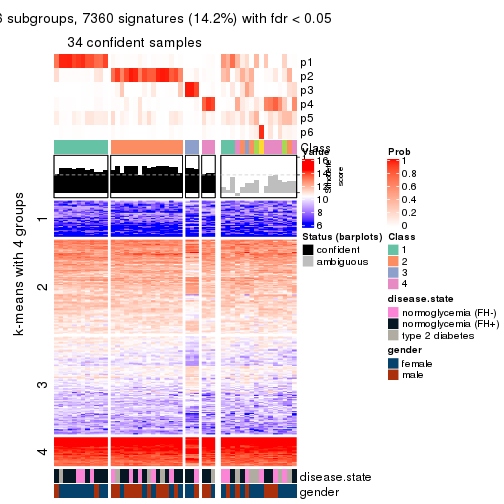</p>

</div>
</div>


Compare the overlap of signatures from different k:

```r
compare_signatures(res)
```


`get_signature()` returns a data frame invisibly. TO get the list of signatures, the function
call should be assigned to a variable explicitly. In following code, if `plot` argument is set
to `FALSE`, no heatmap is plotted while only the differential analysis is performed.

```r
# code only for demonstration
tb = get_signature(res, k = ..., plot = FALSE)
```

An example of the output of `tb` is:

```
#>   which_row         fdr    mean_1    mean_2 scaled_mean_1 scaled_mean_2 km
#> 1        38 0.042760348  8.373488  9.131774    -0.5533452     0.5164555  1
#> 2        40 0.018707592  7.106213  8.469186    -0.6173731     0.5762149  1
#> 3        55 0.019134737 10.221463 11.207825    -0.6159697     0.5749050  1
#> 4        59 0.006059896  5.921854  7.869574    -0.6899429     0.6439467  1
#> 5        60 0.018055526  8.928898 10.211722    -0.6204761     0.5791110  1
#> 6        98 0.009384629 15.714769 14.887706     0.6635654    -0.6193277  2
...
```

The columns in `tb` are:

1. `which_row`: row indices corresponding to the input matrix.
2. `fdr`: FDR for the differential test. 
3. `mean_x`: The mean value in group x.
4. `scaled_mean_x`: The mean value in group x after rows are scaled.
5. `km`: Row groups if k-means clustering is applied to rows.


UMAP plot which shows how samples are separated.


<script>
$( function() {
	$( '#tabs-CV-kmeans-dimension-reduction' ).tabs();
} );
</script>
<div id='tabs-CV-kmeans-dimension-reduction'>
<ul>
<li><a href='#tab-CV-kmeans-dimension-reduction-1'>k = 2</a></li>
<li><a href='#tab-CV-kmeans-dimension-reduction-2'>k = 3</a></li>
<li><a href='#tab-CV-kmeans-dimension-reduction-3'>k = 4</a></li>
<li><a href='#tab-CV-kmeans-dimension-reduction-4'>k = 5</a></li>
<li><a href='#tab-CV-kmeans-dimension-reduction-5'>k = 6</a></li>
</ul>
<div id='tab-CV-kmeans-dimension-reduction-1'>
<pre><code class="r">dimension_reduction(res, k = 2, method = &quot;UMAP&quot;)
</code></pre>

<p></p>

</div>
<div id='tab-CV-kmeans-dimension-reduction-2'>
<pre><code class="r">dimension_reduction(res, k = 3, method = &quot;UMAP&quot;)
</code></pre>

<p></p>

</div>
<div id='tab-CV-kmeans-dimension-reduction-3'>
<pre><code class="r">dimension_reduction(res, k = 4, method = &quot;UMAP&quot;)
</code></pre>

<p></p>

</div>
<div id='tab-CV-kmeans-dimension-reduction-4'>
<pre><code class="r">dimension_reduction(res, k = 5, method = &quot;UMAP&quot;)
</code></pre>

<p></p>

</div>
<div id='tab-CV-kmeans-dimension-reduction-5'>
<pre><code class="r">dimension_reduction(res, k = 6, method = &quot;UMAP&quot;)
</code></pre>

<p></p>

</div>
</div>


Following heatmap shows how subgroups are split when increasing `k`:

```r
collect_classes(res)
```


Test correlation between subgroups and known annotations. If the known
annotation is numeric, one-way ANOVA test is applied, and if the known
annotation is discrete, chi-squared contingency table test is applied.

```r
test_to_known_factors(res)
```

```
#>            n disease.state(p) gender(p) k
#> CV:kmeans 27            0.438   0.83640 2
#> CV:kmeans 32            0.892   0.00225 3
#> CV:kmeans 38            0.795   0.05217 4
#> CV:kmeans 36            0.904   0.02098 5
#> CV:kmeans 34            0.802   0.04281 6
```


If matrix rows can be associated to genes, consider to use `functional_enrichment(res,
...)` to perform function enrichment for the signature genes. See [this vignette](http://bioconductor.org/packages/devel/bioc/vignettes/cola/inst/doc/functional_enrichment.html) for more detailed explanations.


 

---------------------------------------------------


### CV:skmeans


The object with results only for a single top-value method and a single partition method 
can be extracted as:

```r
res = res_list["CV", "skmeans"]
# you can also extract it by
# res = res_list["CV:skmeans"]
```

A summary of `res` and all the functions that can be applied to it:

```r
res
```

```
#> A 'ConsensusPartition' object with k = 2, 3, 4, 5, 6.
#>   On a matrix with 51941 rows and 50 columns.
#>   Top rows (1000, 2000, 3000, 4000, 5000) are extracted by 'CV' method.
#>   Subgroups are detected by 'skmeans' method.
#>   Performed in total 1250 partitions by row resampling.
#>   Best k for subgroups seems to be 2.
#> 
#> Following methods can be applied to this 'ConsensusPartition' object:
#>  [1] "cola_report"             "collect_classes"         "collect_plots"          
#>  [4] "collect_stats"           "colnames"                "compare_signatures"     
#>  [7] "consensus_heatmap"       "dimension_reduction"     "functional_enrichment"  
#> [10] "get_anno_col"            "get_anno"                "get_classes"            
#> [13] "get_consensus"           "get_matrix"              "get_membership"         
#> [16] "get_param"               "get_signatures"          "get_stats"              
#> [19] "is_best_k"               "is_stable_k"             "membership_heatmap"     
#> [22] "ncol"                    "nrow"                    "plot_ecdf"              
#> [25] "rownames"                "select_partition_number" "show"                   
#> [28] "suggest_best_k"          "test_to_known_factors"
```

`collect_plots()` function collects all the plots made from `res` for all `k` (number of partitions)
into one single page to provide an easy and fast comparison between different `k`.

```r
collect_plots(res)
```


The plots are:

- The first row: a plot of the ECDF (empirical cumulative distribution
  function) curves of the consensus matrix for each `k` and the heatmap of
  predicted classes for each `k`.
- The second row: heatmaps of the consensus matrix for each `k`.
- The third row: heatmaps of the membership matrix for each `k`.
- The fouth row: heatmaps of the signatures for each `k`.

All the plots in panels can be made by individual functions and they are
plotted later in this section.

`select_partition_number()` produces several plots showing different
statistics for choosing "optimized" `k`. There are following statistics:

- ECDF curves of the consensus matrix for each `k`;
- 1-PAC. [The PAC
  score](https://en.wikipedia.org/wiki/Consensus_clustering#Over-interpretation_potential_of_consensus_clustering)
  measures the proportion of the ambiguous subgrouping.
- Mean silhouette score.
- Concordance. The mean probability of fiting the consensus class ids in all
  partitions.
- Area increased. Denote $A_k$ as the area under the ECDF curve for current
  `k`, the area increased is defined as $A_k - A_{k-1}$.
- Rand index. The percent of pairs of samples that are both in a same cluster
  or both are not in a same cluster in the partition of k and k-1.
- Jaccard index. The ratio of pairs of samples are both in a same cluster in
  the partition of k and k-1 and the pairs of samples are both in a same
  cluster in the partition k or k-1.

The detailed explanations of these statistics can be found in [the _cola_
vignette](http://bioconductor.org/packages/devel/bioc/vignettes/cola/inst/doc/cola.html#toc_13).

Generally speaking, lower PAC score, higher mean silhouette score or higher
concordance corresponds to better partition. Rand index and Jaccard index
measure how similar the current partition is compared to partition with `k-1`.
If they are too similar, we won't accept `k` is better than `k-1`.

```r
select_partition_number(res)
```


The numeric values for all these statistics can be obtained by `get_stats()`.

```r
get_stats(res)
```

```
#>   k   1-PAC mean_silhouette concordance area_increased  Rand Jaccard
#> 2 2 0.00648           0.455       0.731         0.5076 0.493   0.493
#> 3 3 0.02868           0.350       0.595         0.3290 0.758   0.543
#> 4 4 0.13321           0.309       0.558         0.1216 0.878   0.649
#> 5 5 0.27290           0.213       0.489         0.0665 0.958   0.836
#> 6 6 0.39870           0.203       0.482         0.0420 0.856   0.464
```

`suggest_best_k()` suggests the best $k$ based on these statistics. The rules are as follows:

- All $k$ with Jaccard index larger than 0.95 are removed because increasing
  $k$ does not provide enough extra information. If all $k$ are removed, it is
  marked as no subgroup is detected.
- For all $k$ with 1-PAC score larger than 0.9, the maximal $k$ is taken as
  the best $k$, and other $k$ are marked as optional $k$.
- If it does not fit the second rule. The $k$ with the maximal vote of the
  highest 1-PAC score, highest mean silhouette, and highest concordance is
  taken as the best $k$.

```r
suggest_best_k(res)
```

```
#> [1] 2
```


Following shows the table of the partitions (You need to click the **show/hide
code output** link to see it). The membership matrix (columns with name `p*`)
is inferred by
[`clue::cl_consensus()`](https://www.rdocumentation.org/link/cl_consensus?package=clue)
function with the `SE` method. Basically the value in the membership matrix
represents the probability to belong to a certain group. The finall class
label for an item is determined with the group with highest probability it
belongs to.

In `get_classes()` function, the entropy is calculated from the membership
matrix and the silhouette score is calculated from the consensus matrix.


<script>
$( function() {
	$( '#tabs-CV-skmeans-get-classes' ).tabs();
} );
</script>
<div id='tabs-CV-skmeans-get-classes'>
<ul>
<li><a href='#tab-CV-skmeans-get-classes-1'>k = 2</a></li>
<li><a href='#tab-CV-skmeans-get-classes-2'>k = 3</a></li>
<li><a href='#tab-CV-skmeans-get-classes-3'>k = 4</a></li>
<li><a href='#tab-CV-skmeans-get-classes-4'>k = 5</a></li>
<li><a href='#tab-CV-skmeans-get-classes-5'>k = 6</a></li>
</ul>

<div id='tab-CV-skmeans-get-classes-1'>
<p><a id='tab-CV-skmeans-get-classes-1-a' style='color:#0366d6' href='#'>show/hide code output</a></p>
<pre><code class="r">cbind(get_classes(res, k = 2), get_membership(res, k = 2))
</code></pre>

<pre><code>#&gt;           class entropy silhouette    p1    p2
#&gt; GSM624962     2   0.921     0.4096 0.336 0.664
#&gt; GSM624963     2   0.925     0.4067 0.340 0.660
#&gt; GSM624967     1   0.958     0.3971 0.620 0.380
#&gt; GSM624968     1   0.983     0.2353 0.576 0.424
#&gt; GSM624969     1   0.671     0.6110 0.824 0.176
#&gt; GSM624970     1   0.469     0.6118 0.900 0.100
#&gt; GSM624961     2   0.327     0.6418 0.060 0.940
#&gt; GSM624964     1   0.952     0.3666 0.628 0.372
#&gt; GSM624965     2   0.494     0.6451 0.108 0.892
#&gt; GSM624966     2   0.697     0.6037 0.188 0.812
#&gt; GSM624925     2   0.821     0.5628 0.256 0.744
#&gt; GSM624927     1   0.671     0.6009 0.824 0.176
#&gt; GSM624929     2   0.946     0.3473 0.364 0.636
#&gt; GSM624930     1   0.689     0.6014 0.816 0.184
#&gt; GSM624931     1   0.541     0.6080 0.876 0.124
#&gt; GSM624935     1   0.936     0.4652 0.648 0.352
#&gt; GSM624936     1   0.983     0.2466 0.576 0.424
#&gt; GSM624937     1   0.753     0.5852 0.784 0.216
#&gt; GSM624926     2   0.760     0.5477 0.220 0.780
#&gt; GSM624928     2   0.327     0.6411 0.060 0.940
#&gt; GSM624932     2   0.963     0.2428 0.388 0.612
#&gt; GSM624933     2   0.866     0.4500 0.288 0.712
#&gt; GSM624934     2   1.000    -0.0510 0.488 0.512
#&gt; GSM624971     2   0.975     0.2461 0.408 0.592
#&gt; GSM624973     1   0.993     0.1931 0.548 0.452
#&gt; GSM624938     1   0.997     0.0516 0.532 0.468
#&gt; GSM624940     1   0.671     0.5802 0.824 0.176
#&gt; GSM624941     1   0.388     0.6101 0.924 0.076
#&gt; GSM624942     1   0.430     0.6129 0.912 0.088
#&gt; GSM624943     1   0.839     0.5517 0.732 0.268
#&gt; GSM624945     2   0.738     0.5863 0.208 0.792
#&gt; GSM624946     1   0.943     0.3637 0.640 0.360
#&gt; GSM624949     1   0.987     0.2645 0.568 0.432
#&gt; GSM624951     1   0.163     0.5967 0.976 0.024
#&gt; GSM624952     2   0.839     0.5269 0.268 0.732
#&gt; GSM624955     1   0.943     0.3837 0.640 0.360
#&gt; GSM624956     2   0.788     0.5427 0.236 0.764
#&gt; GSM624957     1   0.788     0.5798 0.764 0.236
#&gt; GSM624974     1   0.955     0.3969 0.624 0.376
#&gt; GSM624939     1   0.881     0.5155 0.700 0.300
#&gt; GSM624944     2   0.997     0.0114 0.468 0.532
#&gt; GSM624947     1   0.961     0.3537 0.616 0.384
#&gt; GSM624948     2   0.260     0.6400 0.044 0.956
#&gt; GSM624950     1   0.973     0.3044 0.596 0.404
#&gt; GSM624953     2   0.430     0.6452 0.088 0.912
#&gt; GSM624954     1   0.990     0.2564 0.560 0.440
#&gt; GSM624958     2   0.653     0.6040 0.168 0.832
#&gt; GSM624959     2   0.469     0.6387 0.100 0.900
#&gt; GSM624960     2   0.949     0.3509 0.368 0.632
#&gt; GSM624972     2   0.760     0.5750 0.220 0.780
</code></pre>

<script>
$('#tab-CV-skmeans-get-classes-1-a').parent().next().next().hide();
$('#tab-CV-skmeans-get-classes-1-a').click(function(){
  $('#tab-CV-skmeans-get-classes-1-a').parent().next().next().toggle();
  return(false);
});
</script>
</div>

<div id='tab-CV-skmeans-get-classes-2'>
<p><a id='tab-CV-skmeans-get-classes-2-a' style='color:#0366d6' href='#'>show/hide code output</a></p>
<pre><code class="r">cbind(get_classes(res, k = 3), get_membership(res, k = 3))
</code></pre>

<pre><code>#&gt;           class entropy silhouette    p1    p2    p3
#&gt; GSM624962     3   0.880    -0.1311 0.116 0.396 0.488
#&gt; GSM624963     2   0.915     0.2353 0.152 0.484 0.364
#&gt; GSM624967     3   0.941     0.3052 0.316 0.196 0.488
#&gt; GSM624968     3   0.753     0.4150 0.228 0.096 0.676
#&gt; GSM624969     1   0.668     0.5261 0.748 0.100 0.152
#&gt; GSM624970     1   0.753     0.3020 0.600 0.052 0.348
#&gt; GSM624961     2   0.324     0.5369 0.032 0.912 0.056
#&gt; GSM624964     3   0.981     0.1910 0.372 0.240 0.388
#&gt; GSM624965     2   0.679     0.4920 0.076 0.728 0.196
#&gt; GSM624966     2   0.821     0.3442 0.088 0.568 0.344
#&gt; GSM624925     2   0.844     0.3766 0.124 0.592 0.284
#&gt; GSM624927     1   0.618     0.5658 0.780 0.100 0.120
#&gt; GSM624929     2   0.908     0.2637 0.320 0.520 0.160
#&gt; GSM624930     1   0.618     0.5808 0.780 0.108 0.112
#&gt; GSM624931     1   0.706     0.5389 0.708 0.080 0.212
#&gt; GSM624935     3   0.960     0.1170 0.400 0.200 0.400
#&gt; GSM624936     1   0.888     0.3072 0.540 0.316 0.144
#&gt; GSM624937     1   0.847    -0.1086 0.456 0.088 0.456
#&gt; GSM624926     2   0.821     0.0783 0.076 0.520 0.404
#&gt; GSM624928     2   0.437     0.5326 0.040 0.864 0.096
#&gt; GSM624932     2   0.953     0.2026 0.308 0.476 0.216
#&gt; GSM624933     2   0.939     0.1568 0.192 0.488 0.320
#&gt; GSM624934     2   0.883     0.0385 0.416 0.468 0.116
#&gt; GSM624971     3   0.839     0.2587 0.148 0.236 0.616
#&gt; GSM624973     3   0.988     0.1759 0.324 0.272 0.404
#&gt; GSM624938     3   0.960     0.1051 0.248 0.276 0.476
#&gt; GSM624940     1   0.648     0.5022 0.716 0.040 0.244
#&gt; GSM624941     1   0.478     0.5699 0.840 0.036 0.124
#&gt; GSM624942     1   0.563     0.5777 0.804 0.064 0.132
#&gt; GSM624943     1   0.756     0.5132 0.692 0.148 0.160
#&gt; GSM624945     2   0.778     0.4610 0.116 0.664 0.220
#&gt; GSM624946     3   0.826     0.3246 0.216 0.152 0.632
#&gt; GSM624949     3   0.908     0.3081 0.212 0.236 0.552
#&gt; GSM624951     1   0.493     0.5756 0.820 0.024 0.156
#&gt; GSM624952     2   0.811     0.2716 0.068 0.508 0.424
#&gt; GSM624955     3   0.613     0.4353 0.136 0.084 0.780
#&gt; GSM624956     2   0.853     0.3113 0.112 0.556 0.332
#&gt; GSM624957     1   0.785     0.4868 0.668 0.144 0.188
#&gt; GSM624974     1   0.879     0.3348 0.580 0.244 0.176
#&gt; GSM624939     1   0.826     0.4416 0.636 0.184 0.180
#&gt; GSM624944     3   0.952     0.3367 0.232 0.280 0.488
#&gt; GSM624947     3   0.966     0.3283 0.308 0.236 0.456
#&gt; GSM624948     2   0.511     0.5235 0.036 0.820 0.144
#&gt; GSM624950     3   0.874     0.3852 0.232 0.180 0.588
#&gt; GSM624953     2   0.526     0.5303 0.080 0.828 0.092
#&gt; GSM624954     1   0.896     0.2630 0.540 0.304 0.156
#&gt; GSM624958     2   0.718     0.4027 0.060 0.672 0.268
#&gt; GSM624959     2   0.552     0.5223 0.068 0.812 0.120
#&gt; GSM624960     3   0.852     0.2899 0.128 0.288 0.584
#&gt; GSM624972     2   0.804     0.3930 0.136 0.648 0.216
</code></pre>

<script>
$('#tab-CV-skmeans-get-classes-2-a').parent().next().next().hide();
$('#tab-CV-skmeans-get-classes-2-a').click(function(){
  $('#tab-CV-skmeans-get-classes-2-a').parent().next().next().toggle();
  return(false);
});
</script>
</div>

<div id='tab-CV-skmeans-get-classes-3'>
<p><a id='tab-CV-skmeans-get-classes-3-a' style='color:#0366d6' href='#'>show/hide code output</a></p>
<pre><code class="r">cbind(get_classes(res, k = 4), get_membership(res, k = 4))
</code></pre>

<pre><code>#&gt;           class entropy silhouette    p1    p2    p3    p4
#&gt; GSM624962     3   0.755    0.29953 0.040 0.264 0.580 0.116
#&gt; GSM624963     2   0.897    0.01203 0.068 0.380 0.344 0.208
#&gt; GSM624967     4   0.745    0.41323 0.104 0.108 0.140 0.648
#&gt; GSM624968     4   0.830    0.33020 0.080 0.108 0.308 0.504
#&gt; GSM624969     1   0.647    0.49281 0.692 0.056 0.056 0.196
#&gt; GSM624970     1   0.808    0.19005 0.440 0.040 0.128 0.392
#&gt; GSM624961     2   0.472    0.41023 0.020 0.812 0.112 0.056
#&gt; GSM624964     4   0.948    0.26629 0.280 0.184 0.144 0.392
#&gt; GSM624965     2   0.790    0.35648 0.056 0.576 0.148 0.220
#&gt; GSM624966     2   0.878    0.06859 0.080 0.456 0.300 0.164
#&gt; GSM624925     2   0.865    0.03194 0.116 0.488 0.288 0.108
#&gt; GSM624927     1   0.696    0.53608 0.684 0.080 0.104 0.132
#&gt; GSM624929     2   0.949    0.17903 0.224 0.416 0.196 0.164
#&gt; GSM624930     1   0.772    0.54106 0.612 0.068 0.156 0.164
#&gt; GSM624931     1   0.620    0.55407 0.720 0.036 0.156 0.088
#&gt; GSM624935     4   0.966    0.09928 0.264 0.220 0.152 0.364
#&gt; GSM624936     1   0.905    0.29980 0.452 0.212 0.240 0.096
#&gt; GSM624937     4   0.827    0.24235 0.288 0.036 0.192 0.484
#&gt; GSM624926     4   0.797    0.11735 0.028 0.368 0.144 0.460
#&gt; GSM624928     2   0.609    0.43296 0.064 0.744 0.084 0.108
#&gt; GSM624932     2   0.963    0.09276 0.224 0.356 0.280 0.140
#&gt; GSM624933     2   0.897    0.02222 0.136 0.412 0.108 0.344
#&gt; GSM624934     2   0.914   -0.06801 0.368 0.368 0.112 0.152
#&gt; GSM624971     3   0.784    0.31714 0.080 0.136 0.604 0.180
#&gt; GSM624973     3   0.967    0.09473 0.232 0.216 0.380 0.172
#&gt; GSM624938     3   0.686    0.42454 0.124 0.104 0.692 0.080
#&gt; GSM624940     1   0.680    0.48206 0.608 0.020 0.292 0.080
#&gt; GSM624941     1   0.583    0.52535 0.736 0.028 0.068 0.168
#&gt; GSM624942     1   0.514    0.57108 0.796 0.036 0.064 0.104
#&gt; GSM624943     1   0.797    0.43721 0.592 0.080 0.168 0.160
#&gt; GSM624945     2   0.733    0.30488 0.056 0.616 0.240 0.088
#&gt; GSM624946     3   0.658    0.34012 0.120 0.044 0.700 0.136
#&gt; GSM624949     3   0.909   -0.00119 0.108 0.152 0.400 0.340
#&gt; GSM624951     1   0.607    0.56601 0.712 0.012 0.144 0.132
#&gt; GSM624952     3   0.783    0.10581 0.036 0.412 0.444 0.108
#&gt; GSM624955     4   0.807    0.14581 0.100 0.056 0.404 0.440
#&gt; GSM624956     3   0.785    0.03615 0.056 0.416 0.448 0.080
#&gt; GSM624957     1   0.896    0.40520 0.492 0.128 0.208 0.172
#&gt; GSM624974     1   0.794    0.45733 0.584 0.144 0.204 0.068
#&gt; GSM624939     1   0.758    0.49807 0.628 0.096 0.180 0.096
#&gt; GSM624944     4   0.696    0.45440 0.084 0.184 0.064 0.668
#&gt; GSM624947     4   0.878    0.36102 0.208 0.108 0.176 0.508
#&gt; GSM624948     2   0.603    0.41079 0.032 0.736 0.120 0.112
#&gt; GSM624950     4   0.779    0.43608 0.120 0.116 0.144 0.620
#&gt; GSM624953     2   0.530    0.41018 0.048 0.788 0.108 0.056
#&gt; GSM624954     1   0.896    0.27903 0.480 0.236 0.116 0.168
#&gt; GSM624958     2   0.785    0.30897 0.064 0.576 0.116 0.244
#&gt; GSM624959     2   0.602    0.43818 0.056 0.744 0.072 0.128
#&gt; GSM624960     4   0.725    0.41457 0.028 0.196 0.156 0.620
#&gt; GSM624972     2   0.775    0.32750 0.096 0.620 0.156 0.128
</code></pre>

<script>
$('#tab-CV-skmeans-get-classes-3-a').parent().next().next().hide();
$('#tab-CV-skmeans-get-classes-3-a').click(function(){
  $('#tab-CV-skmeans-get-classes-3-a').parent().next().next().toggle();
  return(false);
});
</script>
</div>

<div id='tab-CV-skmeans-get-classes-4'>
<p><a id='tab-CV-skmeans-get-classes-4-a' style='color:#0366d6' href='#'>show/hide code output</a></p>
<pre><code class="r">cbind(get_classes(res, k = 5), get_membership(res, k = 5))
</code></pre>

<pre><code>#&gt;           class entropy silhouette    p1    p2    p3    p4    p5
#&gt; GSM624962     3   0.713     0.3276 0.020 0.188 0.600 0.084 0.108
#&gt; GSM624963     2   0.948     0.0588 0.068 0.276 0.264 0.172 0.220
#&gt; GSM624967     4   0.693     0.4083 0.104 0.076 0.068 0.656 0.096
#&gt; GSM624968     4   0.756     0.3869 0.072 0.052 0.204 0.572 0.100
#&gt; GSM624969     1   0.772     0.1907 0.544 0.044 0.056 0.160 0.196
#&gt; GSM624970     1   0.817     0.0950 0.388 0.012 0.092 0.328 0.180
#&gt; GSM624961     2   0.504     0.3460 0.036 0.784 0.056 0.044 0.080
#&gt; GSM624964     4   0.919     0.0978 0.204 0.120 0.068 0.348 0.260
#&gt; GSM624965     2   0.820     0.2142 0.036 0.472 0.080 0.168 0.244
#&gt; GSM624966     3   0.909     0.0692 0.068 0.324 0.324 0.116 0.168
#&gt; GSM624925     2   0.884    -0.0472 0.080 0.384 0.304 0.084 0.148
#&gt; GSM624927     1   0.713     0.2550 0.600 0.036 0.064 0.092 0.208
#&gt; GSM624929     2   0.935     0.0516 0.152 0.348 0.164 0.084 0.252
#&gt; GSM624930     1   0.774     0.2559 0.524 0.036 0.088 0.096 0.256
#&gt; GSM624931     1   0.691     0.3036 0.648 0.048 0.140 0.080 0.084
#&gt; GSM624935     4   0.946    -0.0050 0.172 0.128 0.104 0.300 0.296
#&gt; GSM624936     1   0.906     0.0520 0.352 0.200 0.228 0.036 0.184
#&gt; GSM624937     4   0.732     0.3183 0.208 0.016 0.104 0.572 0.100
#&gt; GSM624926     4   0.760     0.2307 0.028 0.256 0.048 0.516 0.152
#&gt; GSM624928     2   0.493     0.3737 0.008 0.780 0.072 0.072 0.068
#&gt; GSM624932     2   0.909    -0.0778 0.156 0.320 0.184 0.044 0.296
#&gt; GSM624933     2   0.864     0.0242 0.076 0.344 0.036 0.260 0.284
#&gt; GSM624934     5   0.887     0.1940 0.232 0.288 0.056 0.080 0.344
#&gt; GSM624971     3   0.786     0.2996 0.072 0.100 0.572 0.132 0.124
#&gt; GSM624973     3   0.951     0.0950 0.184 0.148 0.352 0.112 0.204
#&gt; GSM624938     3   0.463     0.4134 0.036 0.076 0.804 0.020 0.064
#&gt; GSM624940     1   0.739     0.2665 0.532 0.056 0.280 0.028 0.104
#&gt; GSM624941     1   0.590     0.3225 0.704 0.008 0.060 0.120 0.108
#&gt; GSM624942     1   0.587     0.3484 0.724 0.028 0.056 0.088 0.104
#&gt; GSM624943     1   0.749     0.2113 0.584 0.064 0.068 0.088 0.196
#&gt; GSM624945     2   0.783     0.2036 0.052 0.500 0.276 0.048 0.124
#&gt; GSM624946     3   0.550     0.3672 0.096 0.024 0.744 0.100 0.036
#&gt; GSM624949     3   0.946     0.0880 0.120 0.144 0.364 0.216 0.156
#&gt; GSM624951     1   0.658     0.3383 0.648 0.008 0.140 0.088 0.116
#&gt; GSM624952     3   0.707     0.2375 0.040 0.312 0.540 0.044 0.064
#&gt; GSM624955     4   0.827     0.0800 0.084 0.044 0.376 0.380 0.116
#&gt; GSM624956     3   0.736     0.1540 0.032 0.356 0.480 0.048 0.084
#&gt; GSM624957     1   0.826     0.1492 0.432 0.044 0.096 0.108 0.320
#&gt; GSM624974     1   0.881    -0.1537 0.352 0.180 0.116 0.040 0.312
#&gt; GSM624939     1   0.816     0.1148 0.460 0.080 0.156 0.032 0.272
#&gt; GSM624944     4   0.649     0.4123 0.072 0.136 0.048 0.680 0.064
#&gt; GSM624947     4   0.855     0.2988 0.140 0.088 0.084 0.480 0.208
#&gt; GSM624948     2   0.687     0.3451 0.008 0.608 0.092 0.096 0.196
#&gt; GSM624950     4   0.683     0.4257 0.068 0.060 0.076 0.656 0.140
#&gt; GSM624953     2   0.614     0.3360 0.040 0.704 0.076 0.052 0.128
#&gt; GSM624954     5   0.890     0.1591 0.284 0.216 0.032 0.132 0.336
#&gt; GSM624958     2   0.813     0.1535 0.056 0.468 0.040 0.228 0.208
#&gt; GSM624959     2   0.600     0.3159 0.020 0.692 0.056 0.060 0.172
#&gt; GSM624960     4   0.650     0.4017 0.028 0.116 0.076 0.676 0.104
#&gt; GSM624972     2   0.816     0.1561 0.068 0.492 0.068 0.116 0.256
</code></pre>

<script>
$('#tab-CV-skmeans-get-classes-4-a').parent().next().next().hide();
$('#tab-CV-skmeans-get-classes-4-a').click(function(){
  $('#tab-CV-skmeans-get-classes-4-a').parent().next().next().toggle();
  return(false);
});
</script>
</div>

<div id='tab-CV-skmeans-get-classes-5'>
<p><a id='tab-CV-skmeans-get-classes-5-a' style='color:#0366d6' href='#'>show/hide code output</a></p>
<pre><code class="r">cbind(get_classes(res, k = 6), get_membership(res, k = 6))
</code></pre>

<pre><code>#&gt;           class entropy silhouette    p1    p2    p3    p4    p5    p6
#&gt; GSM624962     3   0.662    0.29315 0.024 0.112 0.640 0.040 0.076 0.108
#&gt; GSM624963     6   0.828    0.09109 0.032 0.184 0.220 0.068 0.068 0.428
#&gt; GSM624967     4   0.800    0.27978 0.088 0.084 0.080 0.536 0.108 0.104
#&gt; GSM624968     4   0.822    0.28968 0.072 0.056 0.152 0.492 0.084 0.144
#&gt; GSM624969     1   0.641    0.32621 0.668 0.052 0.032 0.100 0.064 0.084
#&gt; GSM624970     1   0.791    0.15116 0.372 0.008 0.024 0.240 0.100 0.256
#&gt; GSM624961     2   0.583    0.41749 0.032 0.708 0.088 0.028 0.060 0.084
#&gt; GSM624964     4   0.890    0.12893 0.248 0.084 0.028 0.328 0.184 0.128
#&gt; GSM624965     2   0.826    0.15437 0.024 0.412 0.088 0.104 0.092 0.280
#&gt; GSM624966     2   0.894    0.05421 0.056 0.312 0.248 0.104 0.224 0.056
#&gt; GSM624925     3   0.773    0.01146 0.060 0.364 0.404 0.040 0.084 0.048
#&gt; GSM624927     1   0.771    0.25749 0.520 0.048 0.044 0.056 0.164 0.168
#&gt; GSM624929     2   0.813    0.00581 0.124 0.384 0.072 0.040 0.048 0.332
#&gt; GSM624930     1   0.791    0.13522 0.408 0.044 0.048 0.032 0.304 0.164
#&gt; GSM624931     1   0.613    0.23906 0.628 0.024 0.060 0.032 0.228 0.028
#&gt; GSM624935     6   0.801    0.17713 0.164 0.084 0.048 0.136 0.060 0.508
#&gt; GSM624936     3   0.850   -0.03956 0.208 0.136 0.340 0.004 0.236 0.076
#&gt; GSM624937     4   0.783    0.23966 0.152 0.012 0.088 0.496 0.076 0.176
#&gt; GSM624926     4   0.793    0.16158 0.012 0.220 0.048 0.444 0.088 0.188
#&gt; GSM624928     2   0.610    0.40958 0.012 0.672 0.068 0.072 0.040 0.136
#&gt; GSM624932     5   0.926    0.10032 0.096 0.200 0.180 0.048 0.316 0.160
#&gt; GSM624933     6   0.826    0.12942 0.040 0.220 0.052 0.228 0.056 0.404
#&gt; GSM624934     5   0.887    0.09908 0.168 0.236 0.044 0.048 0.336 0.168
#&gt; GSM624971     3   0.816    0.13248 0.036 0.040 0.412 0.116 0.288 0.108
#&gt; GSM624973     5   0.877    0.10168 0.104 0.092 0.228 0.112 0.404 0.060
#&gt; GSM624938     3   0.618    0.32330 0.052 0.040 0.676 0.032 0.132 0.068
#&gt; GSM624940     1   0.812    0.08218 0.388 0.020 0.200 0.044 0.272 0.076
#&gt; GSM624941     1   0.545    0.32202 0.732 0.028 0.036 0.092 0.084 0.028
#&gt; GSM624942     1   0.645    0.29511 0.644 0.040 0.028 0.040 0.144 0.104
#&gt; GSM624943     1   0.790    0.23687 0.476 0.096 0.016 0.060 0.136 0.216
#&gt; GSM624945     2   0.725    0.23687 0.036 0.524 0.232 0.012 0.072 0.124
#&gt; GSM624946     3   0.614    0.30103 0.032 0.008 0.620 0.052 0.232 0.056
#&gt; GSM624949     6   0.931    0.06542 0.100 0.088 0.276 0.156 0.092 0.288
#&gt; GSM624951     1   0.631    0.23583 0.588 0.008 0.040 0.080 0.256 0.028
#&gt; GSM624952     3   0.552    0.34037 0.024 0.180 0.692 0.020 0.024 0.060
#&gt; GSM624955     3   0.825   -0.07335 0.052 0.028 0.364 0.332 0.108 0.116
#&gt; GSM624956     3   0.613    0.29659 0.016 0.224 0.628 0.024 0.052 0.056
#&gt; GSM624957     1   0.915    0.11734 0.296 0.064 0.100 0.076 0.228 0.236
#&gt; GSM624974     5   0.726    0.12932 0.256 0.088 0.032 0.044 0.528 0.052
#&gt; GSM624939     5   0.711    0.02628 0.336 0.072 0.048 0.036 0.480 0.028
#&gt; GSM624944     4   0.637    0.35927 0.076 0.088 0.024 0.668 0.052 0.092
#&gt; GSM624947     4   0.848    0.26669 0.160 0.056 0.060 0.456 0.136 0.132
#&gt; GSM624948     2   0.703    0.23895 0.008 0.540 0.072 0.068 0.060 0.252
#&gt; GSM624950     4   0.612    0.38274 0.084 0.012 0.048 0.680 0.080 0.096
#&gt; GSM624953     2   0.623    0.41202 0.028 0.680 0.088 0.048 0.096 0.060
#&gt; GSM624954     1   0.854    0.03275 0.396 0.172 0.028 0.080 0.232 0.092
#&gt; GSM624958     2   0.814    0.14101 0.044 0.412 0.032 0.236 0.064 0.212
#&gt; GSM624959     2   0.630    0.38683 0.024 0.676 0.068 0.076 0.068 0.088
#&gt; GSM624960     4   0.640    0.31492 0.032 0.056 0.056 0.652 0.048 0.156
#&gt; GSM624972     2   0.785    0.32640 0.076 0.540 0.100 0.076 0.148 0.060
</code></pre>

<script>
$('#tab-CV-skmeans-get-classes-5-a').parent().next().next().hide();
$('#tab-CV-skmeans-get-classes-5-a').click(function(){
  $('#tab-CV-skmeans-get-classes-5-a').parent().next().next().toggle();
  return(false);
});
</script>
</div>
</div>

Heatmaps for the consensus matrix. It visualizes the probability of two
samples to be in a same group.


<script>
$( function() {
	$( '#tabs-CV-skmeans-consensus-heatmap' ).tabs();
} );
</script>
<div id='tabs-CV-skmeans-consensus-heatmap'>
<ul>
<li><a href='#tab-CV-skmeans-consensus-heatmap-1'>k = 2</a></li>
<li><a href='#tab-CV-skmeans-consensus-heatmap-2'>k = 3</a></li>
<li><a href='#tab-CV-skmeans-consensus-heatmap-3'>k = 4</a></li>
<li><a href='#tab-CV-skmeans-consensus-heatmap-4'>k = 5</a></li>
<li><a href='#tab-CV-skmeans-consensus-heatmap-5'>k = 6</a></li>
</ul>
<div id='tab-CV-skmeans-consensus-heatmap-1'>
<pre><code class="r">consensus_heatmap(res, k = 2)
</code></pre>

<p></p>

</div>
<div id='tab-CV-skmeans-consensus-heatmap-2'>
<pre><code class="r">consensus_heatmap(res, k = 3)
</code></pre>

<p>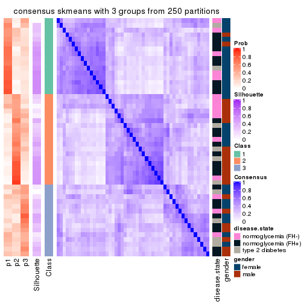</p>

</div>
<div id='tab-CV-skmeans-consensus-heatmap-3'>
<pre><code class="r">consensus_heatmap(res, k = 4)
</code></pre>

<p></p>

</div>
<div id='tab-CV-skmeans-consensus-heatmap-4'>
<pre><code class="r">consensus_heatmap(res, k = 5)
</code></pre>

<p></p>

</div>
<div id='tab-CV-skmeans-consensus-heatmap-5'>
<pre><code class="r">consensus_heatmap(res, k = 6)
</code></pre>

<p></p>

</div>
</div>

Heatmaps for the membership of samples in all partitions to see how consistent they are:


<script>
$( function() {
	$( '#tabs-CV-skmeans-membership-heatmap' ).tabs();
} );
</script>
<div id='tabs-CV-skmeans-membership-heatmap'>
<ul>
<li><a href='#tab-CV-skmeans-membership-heatmap-1'>k = 2</a></li>
<li><a href='#tab-CV-skmeans-membership-heatmap-2'>k = 3</a></li>
<li><a href='#tab-CV-skmeans-membership-heatmap-3'>k = 4</a></li>
<li><a href='#tab-CV-skmeans-membership-heatmap-4'>k = 5</a></li>
<li><a href='#tab-CV-skmeans-membership-heatmap-5'>k = 6</a></li>
</ul>
<div id='tab-CV-skmeans-membership-heatmap-1'>
<pre><code class="r">membership_heatmap(res, k = 2)
</code></pre>

<p></p>

</div>
<div id='tab-CV-skmeans-membership-heatmap-2'>
<pre><code class="r">membership_heatmap(res, k = 3)
</code></pre>

<p></p>

</div>
<div id='tab-CV-skmeans-membership-heatmap-3'>
<pre><code class="r">membership_heatmap(res, k = 4)
</code></pre>

<p></p>

</div>
<div id='tab-CV-skmeans-membership-heatmap-4'>
<pre><code class="r">membership_heatmap(res, k = 5)
</code></pre>

<p></p>

</div>
<div id='tab-CV-skmeans-membership-heatmap-5'>
<pre><code class="r">membership_heatmap(res, k = 6)
</code></pre>

<p></p>

</div>
</div>

As soon as we have had the classes for columns, we can look for signatures
which are significantly different between classes which can be candidate marks
for certain classes. Following are the heatmaps for signatures.


Signature heatmaps where rows are scaled:


<script>
$( function() {
	$( '#tabs-CV-skmeans-get-signatures' ).tabs();
} );
</script>
<div id='tabs-CV-skmeans-get-signatures'>
<ul>
<li><a href='#tab-CV-skmeans-get-signatures-1'>k = 2</a></li>
<li><a href='#tab-CV-skmeans-get-signatures-2'>k = 3</a></li>
<li><a href='#tab-CV-skmeans-get-signatures-3'>k = 4</a></li>
<li><a href='#tab-CV-skmeans-get-signatures-4'>k = 5</a></li>
<li><a href='#tab-CV-skmeans-get-signatures-5'>k = 6</a></li>
</ul>
<div id='tab-CV-skmeans-get-signatures-1'>
<pre><code class="r">get_signatures(res, k = 2)
</code></pre>

<p></p>

</div>
<div id='tab-CV-skmeans-get-signatures-2'>
<pre><code class="r">get_signatures(res, k = 3)
</code></pre>

<p></p>

</div>
<div id='tab-CV-skmeans-get-signatures-3'>
<pre><code class="r">get_signatures(res, k = 4)
</code></pre>

<p></p>

</div>
<div id='tab-CV-skmeans-get-signatures-4'>
<pre><code class="r">get_signatures(res, k = 5)
</code></pre>

<p></p>

</div>
<div id='tab-CV-skmeans-get-signatures-5'>
<pre><code class="r">get_signatures(res, k = 6)
</code></pre>

<p></p>

</div>
</div>


Signature heatmaps where rows are not scaled:


<script>
$( function() {
	$( '#tabs-CV-skmeans-get-signatures-no-scale' ).tabs();
} );
</script>
<div id='tabs-CV-skmeans-get-signatures-no-scale'>
<ul>
<li><a href='#tab-CV-skmeans-get-signatures-no-scale-1'>k = 2</a></li>
<li><a href='#tab-CV-skmeans-get-signatures-no-scale-2'>k = 3</a></li>
<li><a href='#tab-CV-skmeans-get-signatures-no-scale-3'>k = 4</a></li>
<li><a href='#tab-CV-skmeans-get-signatures-no-scale-4'>k = 5</a></li>
<li><a href='#tab-CV-skmeans-get-signatures-no-scale-5'>k = 6</a></li>
</ul>
<div id='tab-CV-skmeans-get-signatures-no-scale-1'>
<pre><code class="r">get_signatures(res, k = 2, scale_rows = FALSE)
</code></pre>

<p></p>

</div>
<div id='tab-CV-skmeans-get-signatures-no-scale-2'>
<pre><code class="r">get_signatures(res, k = 3, scale_rows = FALSE)
</code></pre>

<p></p>

</div>
<div id='tab-CV-skmeans-get-signatures-no-scale-3'>
<pre><code class="r">get_signatures(res, k = 4, scale_rows = FALSE)
</code></pre>

<p></p>

</div>
<div id='tab-CV-skmeans-get-signatures-no-scale-4'>
<pre><code class="r">get_signatures(res, k = 5, scale_rows = FALSE)
</code></pre>

<p></p>

</div>
<div id='tab-CV-skmeans-get-signatures-no-scale-5'>
<pre><code class="r">get_signatures(res, k = 6, scale_rows = FALSE)
</code></pre>

<p></p>

</div>
</div>


Compare the overlap of signatures from different k:

```r
compare_signatures(res)
```


`get_signature()` returns a data frame invisibly. TO get the list of signatures, the function
call should be assigned to a variable explicitly. In following code, if `plot` argument is set
to `FALSE`, no heatmap is plotted while only the differential analysis is performed.

```r
# code only for demonstration
tb = get_signature(res, k = ..., plot = FALSE)
```

An example of the output of `tb` is:

```
#>   which_row         fdr    mean_1    mean_2 scaled_mean_1 scaled_mean_2 km
#> 1        38 0.042760348  8.373488  9.131774    -0.5533452     0.5164555  1
#> 2        40 0.018707592  7.106213  8.469186    -0.6173731     0.5762149  1
#> 3        55 0.019134737 10.221463 11.207825    -0.6159697     0.5749050  1
#> 4        59 0.006059896  5.921854  7.869574    -0.6899429     0.6439467  1
#> 5        60 0.018055526  8.928898 10.211722    -0.6204761     0.5791110  1
#> 6        98 0.009384629 15.714769 14.887706     0.6635654    -0.6193277  2
...
```

The columns in `tb` are:

1. `which_row`: row indices corresponding to the input matrix.
2. `fdr`: FDR for the differential test. 
3. `mean_x`: The mean value in group x.
4. `scaled_mean_x`: The mean value in group x after rows are scaled.
5. `km`: Row groups if k-means clustering is applied to rows.


UMAP plot which shows how samples are separated.


<script>
$( function() {
	$( '#tabs-CV-skmeans-dimension-reduction' ).tabs();
} );
</script>
<div id='tabs-CV-skmeans-dimension-reduction'>
<ul>
<li><a href='#tab-CV-skmeans-dimension-reduction-1'>k = 2</a></li>
<li><a href='#tab-CV-skmeans-dimension-reduction-2'>k = 3</a></li>
<li><a href='#tab-CV-skmeans-dimension-reduction-3'>k = 4</a></li>
<li><a href='#tab-CV-skmeans-dimension-reduction-4'>k = 5</a></li>
<li><a href='#tab-CV-skmeans-dimension-reduction-5'>k = 6</a></li>
</ul>
<div id='tab-CV-skmeans-dimension-reduction-1'>
<pre><code class="r">dimension_reduction(res, k = 2, method = &quot;UMAP&quot;)
</code></pre>

<p></p>

</div>
<div id='tab-CV-skmeans-dimension-reduction-2'>
<pre><code class="r">dimension_reduction(res, k = 3, method = &quot;UMAP&quot;)
</code></pre>

<p></p>

</div>
<div id='tab-CV-skmeans-dimension-reduction-3'>
<pre><code class="r">dimension_reduction(res, k = 4, method = &quot;UMAP&quot;)
</code></pre>

<p>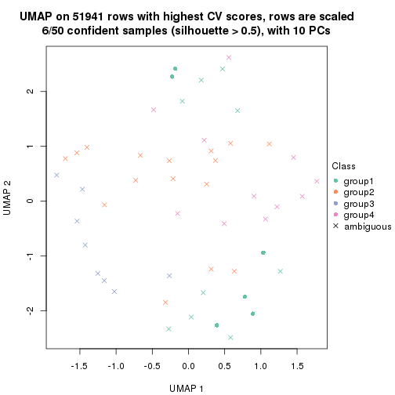</p>

</div>
<div id='tab-CV-skmeans-dimension-reduction-4'>
<pre><code class="r">dimension_reduction(res, k = 5, method = &quot;UMAP&quot;)
</code></pre>

<p></p>

</div>
<div id='tab-CV-skmeans-dimension-reduction-5'>
<pre><code class="r">dimension_reduction(res, k = 6, method = &quot;UMAP&quot;)
</code></pre>

<p></p>

</div>
</div>


Following heatmap shows how subgroups are split when increasing `k`:

```r
collect_classes(res)
```


Test correlation between subgroups and known annotations. If the known
annotation is numeric, one-way ANOVA test is applied, and if the known
annotation is discrete, chi-squared contingency table test is applied.

```r
test_to_known_factors(res)
```

```
#>             n disease.state(p) gender(p) k
#> CV:skmeans 27            0.830   0.00292 2
#> CV:skmeans 14            0.823   0.00158 3
#> CV:skmeans  6               NA        NA 4
#> CV:skmeans  0               NA        NA 5
#> CV:skmeans  0               NA        NA 6
```


If matrix rows can be associated to genes, consider to use `functional_enrichment(res,
...)` to perform function enrichment for the signature genes. See [this vignette](http://bioconductor.org/packages/devel/bioc/vignettes/cola/inst/doc/functional_enrichment.html) for more detailed explanations.


 

---------------------------------------------------


### CV:pam


The object with results only for a single top-value method and a single partition method 
can be extracted as:

```r
res = res_list["CV", "pam"]
# you can also extract it by
# res = res_list["CV:pam"]
```

A summary of `res` and all the functions that can be applied to it:

```r
res
```

```
#> A 'ConsensusPartition' object with k = 2, 3, 4, 5, 6.
#>   On a matrix with 51941 rows and 50 columns.
#>   Top rows (1000, 2000, 3000, 4000, 5000) are extracted by 'CV' method.
#>   Subgroups are detected by 'pam' method.
#>   Performed in total 1250 partitions by row resampling.
#>   Best k for subgroups seems to be 2.
#> 
#> Following methods can be applied to this 'ConsensusPartition' object:
#>  [1] "cola_report"             "collect_classes"         "collect_plots"          
#>  [4] "collect_stats"           "colnames"                "compare_signatures"     
#>  [7] "consensus_heatmap"       "dimension_reduction"     "functional_enrichment"  
#> [10] "get_anno_col"            "get_anno"                "get_classes"            
#> [13] "get_consensus"           "get_matrix"              "get_membership"         
#> [16] "get_param"               "get_signatures"          "get_stats"              
#> [19] "is_best_k"               "is_stable_k"             "membership_heatmap"     
#> [22] "ncol"                    "nrow"                    "plot_ecdf"              
#> [25] "rownames"                "select_partition_number" "show"                   
#> [28] "suggest_best_k"          "test_to_known_factors"
```

`collect_plots()` function collects all the plots made from `res` for all `k` (number of partitions)
into one single page to provide an easy and fast comparison between different `k`.

```r
collect_plots(res)
```


The plots are:

- The first row: a plot of the ECDF (empirical cumulative distribution
  function) curves of the consensus matrix for each `k` and the heatmap of
  predicted classes for each `k`.
- The second row: heatmaps of the consensus matrix for each `k`.
- The third row: heatmaps of the membership matrix for each `k`.
- The fouth row: heatmaps of the signatures for each `k`.

All the plots in panels can be made by individual functions and they are
plotted later in this section.

`select_partition_number()` produces several plots showing different
statistics for choosing "optimized" `k`. There are following statistics:

- ECDF curves of the consensus matrix for each `k`;
- 1-PAC. [The PAC
  score](https://en.wikipedia.org/wiki/Consensus_clustering#Over-interpretation_potential_of_consensus_clustering)
  measures the proportion of the ambiguous subgrouping.
- Mean silhouette score.
- Concordance. The mean probability of fiting the consensus class ids in all
  partitions.
- Area increased. Denote $A_k$ as the area under the ECDF curve for current
  `k`, the area increased is defined as $A_k - A_{k-1}$.
- Rand index. The percent of pairs of samples that are both in a same cluster
  or both are not in a same cluster in the partition of k and k-1.
- Jaccard index. The ratio of pairs of samples are both in a same cluster in
  the partition of k and k-1 and the pairs of samples are both in a same
  cluster in the partition k or k-1.

The detailed explanations of these statistics can be found in [the _cola_
vignette](http://bioconductor.org/packages/devel/bioc/vignettes/cola/inst/doc/cola.html#toc_13).

Generally speaking, lower PAC score, higher mean silhouette score or higher
concordance corresponds to better partition. Rand index and Jaccard index
measure how similar the current partition is compared to partition with `k-1`.
If they are too similar, we won't accept `k` is better than `k-1`.

```r
select_partition_number(res)
```


The numeric values for all these statistics can be obtained by `get_stats()`.

```r
get_stats(res)
```

```
#>   k 1-PAC mean_silhouette concordance area_increased  Rand Jaccard
#> 2 2 0.228           0.731       0.833         0.4134 0.510   0.510
#> 3 3 0.222           0.692       0.828         0.1598 0.984   0.970
#> 4 4 0.274           0.692       0.852         0.0896 0.985   0.970
#> 5 5 0.256           0.663       0.830         0.0445 1.000   1.000
#> 6 6 0.325           0.545       0.812         0.0381 0.973   0.944
```

`suggest_best_k()` suggests the best $k$ based on these statistics. The rules are as follows:

- All $k$ with Jaccard index larger than 0.95 are removed because increasing
  $k$ does not provide enough extra information. If all $k$ are removed, it is
  marked as no subgroup is detected.
- For all $k$ with 1-PAC score larger than 0.9, the maximal $k$ is taken as
  the best $k$, and other $k$ are marked as optional $k$.
- If it does not fit the second rule. The $k$ with the maximal vote of the
  highest 1-PAC score, highest mean silhouette, and highest concordance is
  taken as the best $k$.

```r
suggest_best_k(res)
```

```
#> [1] 2
```


Following shows the table of the partitions (You need to click the **show/hide
code output** link to see it). The membership matrix (columns with name `p*`)
is inferred by
[`clue::cl_consensus()`](https://www.rdocumentation.org/link/cl_consensus?package=clue)
function with the `SE` method. Basically the value in the membership matrix
represents the probability to belong to a certain group. The finall class
label for an item is determined with the group with highest probability it
belongs to.

In `get_classes()` function, the entropy is calculated from the membership
matrix and the silhouette score is calculated from the consensus matrix.


<script>
$( function() {
	$( '#tabs-CV-pam-get-classes' ).tabs();
} );
</script>
<div id='tabs-CV-pam-get-classes'>
<ul>
<li><a href='#tab-CV-pam-get-classes-1'>k = 2</a></li>
<li><a href='#tab-CV-pam-get-classes-2'>k = 3</a></li>
<li><a href='#tab-CV-pam-get-classes-3'>k = 4</a></li>
<li><a href='#tab-CV-pam-get-classes-4'>k = 5</a></li>
<li><a href='#tab-CV-pam-get-classes-5'>k = 6</a></li>
</ul>

<div id='tab-CV-pam-get-classes-1'>
<p><a id='tab-CV-pam-get-classes-1-a' style='color:#0366d6' href='#'>show/hide code output</a></p>
<pre><code class="r">cbind(get_classes(res, k = 2), get_membership(res, k = 2))
</code></pre>

<pre><code>#&gt;           class entropy silhouette    p1    p2
#&gt; GSM624962     1  0.6973     0.8620 0.812 0.188
#&gt; GSM624963     1  0.7299     0.8691 0.796 0.204
#&gt; GSM624967     1  0.8327     0.8543 0.736 0.264
#&gt; GSM624968     2  0.0672     0.8526 0.008 0.992
#&gt; GSM624969     2  0.9209     0.3627 0.336 0.664
#&gt; GSM624970     1  0.9954     0.4482 0.540 0.460
#&gt; GSM624961     1  0.9983     0.4803 0.524 0.476
#&gt; GSM624964     2  0.0000     0.8520 0.000 1.000
#&gt; GSM624965     2  0.1184     0.8518 0.016 0.984
#&gt; GSM624966     2  0.4431     0.8030 0.092 0.908
#&gt; GSM624925     1  0.7883     0.8674 0.764 0.236
#&gt; GSM624927     1  0.9963     0.4610 0.536 0.464
#&gt; GSM624929     2  0.1633     0.8501 0.024 0.976
#&gt; GSM624930     2  0.9087     0.3747 0.324 0.676
#&gt; GSM624931     2  0.4690     0.7990 0.100 0.900
#&gt; GSM624935     2  0.7376     0.6598 0.208 0.792
#&gt; GSM624936     1  0.6801     0.8602 0.820 0.180
#&gt; GSM624937     1  0.5059     0.6571 0.888 0.112
#&gt; GSM624926     2  0.0000     0.8520 0.000 1.000
#&gt; GSM624928     2  0.0672     0.8528 0.008 0.992
#&gt; GSM624932     2  0.2603     0.8420 0.044 0.956
#&gt; GSM624933     2  0.0000     0.8520 0.000 1.000
#&gt; GSM624934     2  0.0938     0.8480 0.012 0.988
#&gt; GSM624971     2  0.5178     0.7726 0.116 0.884
#&gt; GSM624973     2  0.0376     0.8514 0.004 0.996
#&gt; GSM624938     1  0.7674     0.8694 0.776 0.224
#&gt; GSM624940     1  0.7453     0.8684 0.788 0.212
#&gt; GSM624941     1  0.7674     0.8641 0.776 0.224
#&gt; GSM624942     1  0.9209     0.7727 0.664 0.336
#&gt; GSM624943     2  0.9933    -0.1937 0.452 0.548
#&gt; GSM624945     2  0.5294     0.7801 0.120 0.880
#&gt; GSM624946     1  0.7453     0.8682 0.788 0.212
#&gt; GSM624949     2  0.9993    -0.3352 0.484 0.516
#&gt; GSM624951     1  0.7815     0.8620 0.768 0.232
#&gt; GSM624952     1  0.7056     0.8654 0.808 0.192
#&gt; GSM624955     1  0.7376     0.8691 0.792 0.208
#&gt; GSM624956     1  0.7219     0.8665 0.800 0.200
#&gt; GSM624957     2  0.9661     0.0421 0.392 0.608
#&gt; GSM624974     2  0.4939     0.7995 0.108 0.892
#&gt; GSM624939     2  0.1843     0.8481 0.028 0.972
#&gt; GSM624944     2  0.1414     0.8510 0.020 0.980
#&gt; GSM624947     2  0.7139     0.6725 0.196 0.804
#&gt; GSM624948     1  0.9286     0.7718 0.656 0.344
#&gt; GSM624950     2  0.0376     0.8526 0.004 0.996
#&gt; GSM624953     2  0.0000     0.8520 0.000 1.000
#&gt; GSM624954     2  0.0000     0.8520 0.000 1.000
#&gt; GSM624958     2  0.0000     0.8520 0.000 1.000
#&gt; GSM624959     2  0.1633     0.8502 0.024 0.976
#&gt; GSM624960     1  0.8555     0.8424 0.720 0.280
#&gt; GSM624972     2  0.0000     0.8520 0.000 1.000
</code></pre>

<script>
$('#tab-CV-pam-get-classes-1-a').parent().next().next().hide();
$('#tab-CV-pam-get-classes-1-a').click(function(){
  $('#tab-CV-pam-get-classes-1-a').parent().next().next().toggle();
  return(false);
});
</script>
</div>

<div id='tab-CV-pam-get-classes-2'>
<p><a id='tab-CV-pam-get-classes-2-a' style='color:#0366d6' href='#'>show/hide code output</a></p>
<pre><code class="r">cbind(get_classes(res, k = 3), get_membership(res, k = 3))
</code></pre>

<pre><code>#&gt;           class entropy silhouette    p1    p2    p3
#&gt; GSM624962     1  0.3752     0.8127 0.856 0.144 0.000
#&gt; GSM624963     1  0.3941     0.8174 0.844 0.156 0.000
#&gt; GSM624967     1  0.4784     0.8161 0.796 0.200 0.004
#&gt; GSM624968     2  0.0424     0.8503 0.008 0.992 0.000
#&gt; GSM624969     2  0.7279     0.4345 0.292 0.652 0.056
#&gt; GSM624970     1  0.9191     0.2443 0.536 0.256 0.208
#&gt; GSM624961     1  0.6509     0.3721 0.524 0.472 0.004
#&gt; GSM624964     2  0.0000     0.8493 0.000 1.000 0.000
#&gt; GSM624965     2  0.0747     0.8499 0.016 0.984 0.000
#&gt; GSM624966     2  0.2796     0.8077 0.092 0.908 0.000
#&gt; GSM624925     1  0.4750     0.8133 0.784 0.216 0.000
#&gt; GSM624927     1  0.8973     0.5035 0.500 0.364 0.136
#&gt; GSM624929     2  0.2527     0.8358 0.020 0.936 0.044
#&gt; GSM624930     2  0.8835     0.2337 0.268 0.568 0.164
#&gt; GSM624931     2  0.4805     0.7273 0.012 0.812 0.176
#&gt; GSM624935     2  0.6087     0.6956 0.144 0.780 0.076
#&gt; GSM624936     1  0.4068     0.7988 0.864 0.120 0.016
#&gt; GSM624937     3  0.1860     0.0000 0.052 0.000 0.948
#&gt; GSM624926     2  0.0000     0.8493 0.000 1.000 0.000
#&gt; GSM624928     2  0.0424     0.8504 0.008 0.992 0.000
#&gt; GSM624932     2  0.2301     0.8344 0.060 0.936 0.004
#&gt; GSM624933     2  0.0237     0.8496 0.000 0.996 0.004
#&gt; GSM624934     2  0.0983     0.8449 0.016 0.980 0.004
#&gt; GSM624971     2  0.3192     0.7824 0.112 0.888 0.000
#&gt; GSM624973     2  0.0475     0.8494 0.004 0.992 0.004
#&gt; GSM624938     1  0.4351     0.8197 0.828 0.168 0.004
#&gt; GSM624940     1  0.7485     0.7248 0.696 0.132 0.172
#&gt; GSM624941     1  0.6646     0.7882 0.740 0.184 0.076
#&gt; GSM624942     1  0.9045     0.6736 0.552 0.256 0.192
#&gt; GSM624943     2  0.9392    -0.0945 0.312 0.492 0.196
#&gt; GSM624945     2  0.3193     0.8026 0.100 0.896 0.004
#&gt; GSM624946     1  0.3941     0.8177 0.844 0.156 0.000
#&gt; GSM624949     2  0.7814    -0.1846 0.436 0.512 0.052
#&gt; GSM624951     1  0.8527     0.6993 0.612 0.196 0.192
#&gt; GSM624952     1  0.3619     0.8102 0.864 0.136 0.000
#&gt; GSM624955     1  0.3816     0.8147 0.852 0.148 0.000
#&gt; GSM624956     1  0.3752     0.8127 0.856 0.144 0.000
#&gt; GSM624957     2  0.6973    -0.0457 0.416 0.564 0.020
#&gt; GSM624974     2  0.3500     0.8062 0.116 0.880 0.004
#&gt; GSM624939     2  0.1647     0.8395 0.036 0.960 0.004
#&gt; GSM624944     2  0.1267     0.8482 0.024 0.972 0.004
#&gt; GSM624947     2  0.4178     0.7302 0.172 0.828 0.000
#&gt; GSM624948     1  0.5845     0.7323 0.688 0.308 0.004
#&gt; GSM624950     2  0.0592     0.8503 0.012 0.988 0.000
#&gt; GSM624953     2  0.0000     0.8493 0.000 1.000 0.000
#&gt; GSM624954     2  0.0000     0.8493 0.000 1.000 0.000
#&gt; GSM624958     2  0.0000     0.8493 0.000 1.000 0.000
#&gt; GSM624959     2  0.1950     0.8424 0.040 0.952 0.008
#&gt; GSM624960     1  0.5058     0.7977 0.756 0.244 0.000
#&gt; GSM624972     2  0.0000     0.8493 0.000 1.000 0.000
</code></pre>

<script>
$('#tab-CV-pam-get-classes-2-a').parent().next().next().hide();
$('#tab-CV-pam-get-classes-2-a').click(function(){
  $('#tab-CV-pam-get-classes-2-a').parent().next().next().toggle();
  return(false);
});
</script>
</div>

<div id='tab-CV-pam-get-classes-3'>
<p><a id='tab-CV-pam-get-classes-3-a' style='color:#0366d6' href='#'>show/hide code output</a></p>
<pre><code class="r">cbind(get_classes(res, k = 4), get_membership(res, k = 4))
</code></pre>

<pre><code>#&gt;           class entropy silhouette    p1    p2    p3    p4
#&gt; GSM624962     1  0.1940     0.7985 0.924 0.076 0.000 0.000
#&gt; GSM624963     1  0.2469     0.8097 0.892 0.108 0.000 0.000
#&gt; GSM624967     1  0.3257     0.8033 0.844 0.152 0.004 0.000
#&gt; GSM624968     2  0.0336     0.8564 0.008 0.992 0.000 0.000
#&gt; GSM624969     2  0.6059     0.4560 0.300 0.636 0.060 0.004
#&gt; GSM624970     3  0.0592     0.0000 0.016 0.000 0.984 0.000
#&gt; GSM624961     1  0.5112     0.3972 0.560 0.436 0.004 0.000
#&gt; GSM624964     2  0.0000     0.8552 0.000 1.000 0.000 0.000
#&gt; GSM624965     2  0.0592     0.8564 0.016 0.984 0.000 0.000
#&gt; GSM624966     2  0.2345     0.8120 0.100 0.900 0.000 0.000
#&gt; GSM624925     1  0.3266     0.8027 0.832 0.168 0.000 0.000
#&gt; GSM624927     1  0.7354     0.5061 0.528 0.320 0.144 0.008
#&gt; GSM624929     2  0.1913     0.8464 0.020 0.940 0.040 0.000
#&gt; GSM624930     2  0.7329     0.2675 0.272 0.544 0.180 0.004
#&gt; GSM624931     2  0.3946     0.7500 0.012 0.812 0.172 0.004
#&gt; GSM624935     2  0.4841     0.7212 0.140 0.780 0.080 0.000
#&gt; GSM624936     1  0.2360     0.7820 0.924 0.052 0.020 0.004
#&gt; GSM624937     4  0.0376     0.0000 0.004 0.000 0.004 0.992
#&gt; GSM624926     2  0.0000     0.8552 0.000 1.000 0.000 0.000
#&gt; GSM624928     2  0.0336     0.8565 0.008 0.992 0.000 0.000
#&gt; GSM624932     2  0.1743     0.8465 0.056 0.940 0.004 0.000
#&gt; GSM624933     2  0.0188     0.8557 0.000 0.996 0.004 0.000
#&gt; GSM624934     2  0.1297     0.8482 0.016 0.964 0.020 0.000
#&gt; GSM624971     2  0.2647     0.7888 0.120 0.880 0.000 0.000
#&gt; GSM624973     2  0.0779     0.8539 0.004 0.980 0.016 0.000
#&gt; GSM624938     1  0.2654     0.8097 0.888 0.108 0.004 0.000
#&gt; GSM624940     1  0.4979     0.7009 0.760 0.064 0.176 0.000
#&gt; GSM624941     1  0.5321     0.7613 0.752 0.160 0.084 0.004
#&gt; GSM624942     1  0.7153     0.6111 0.556 0.248 0.196 0.000
#&gt; GSM624943     2  0.7443     0.0285 0.312 0.492 0.196 0.000
#&gt; GSM624945     2  0.2530     0.8145 0.100 0.896 0.004 0.000
#&gt; GSM624946     1  0.2281     0.8071 0.904 0.096 0.000 0.000
#&gt; GSM624949     2  0.6192    -0.0680 0.436 0.512 0.052 0.000
#&gt; GSM624951     1  0.6783     0.6505 0.624 0.168 0.204 0.004
#&gt; GSM624952     1  0.1792     0.7958 0.932 0.068 0.000 0.000
#&gt; GSM624955     1  0.1767     0.7603 0.944 0.044 0.012 0.000
#&gt; GSM624956     1  0.2011     0.8000 0.920 0.080 0.000 0.000
#&gt; GSM624957     2  0.5535     0.0652 0.420 0.560 0.020 0.000
#&gt; GSM624974     2  0.3278     0.8106 0.116 0.864 0.020 0.000
#&gt; GSM624939     2  0.1820     0.8422 0.036 0.944 0.020 0.000
#&gt; GSM624944     2  0.0895     0.8561 0.020 0.976 0.004 0.000
#&gt; GSM624947     2  0.3266     0.7529 0.168 0.832 0.000 0.000
#&gt; GSM624948     1  0.4509     0.7119 0.708 0.288 0.004 0.000
#&gt; GSM624950     2  0.0657     0.8567 0.012 0.984 0.004 0.000
#&gt; GSM624953     2  0.0000     0.8552 0.000 1.000 0.000 0.000
#&gt; GSM624954     2  0.0188     0.8555 0.000 0.996 0.004 0.000
#&gt; GSM624958     2  0.0000     0.8552 0.000 1.000 0.000 0.000
#&gt; GSM624959     2  0.1545     0.8503 0.040 0.952 0.008 0.000
#&gt; GSM624960     1  0.3942     0.7583 0.764 0.236 0.000 0.000
#&gt; GSM624972     2  0.0000     0.8552 0.000 1.000 0.000 0.000
</code></pre>

<script>
$('#tab-CV-pam-get-classes-3-a').parent().next().next().hide();
$('#tab-CV-pam-get-classes-3-a').click(function(){
  $('#tab-CV-pam-get-classes-3-a').parent().next().next().toggle();
  return(false);
});
</script>
</div>

<div id='tab-CV-pam-get-classes-4'>
<p><a id='tab-CV-pam-get-classes-4-a' style='color:#0366d6' href='#'>show/hide code output</a></p>
<pre><code class="r">cbind(get_classes(res, k = 5), get_membership(res, k = 5))
</code></pre>

<pre><code>#&gt;           class entropy silhouette    p1    p2 p3    p4 p5
#&gt; GSM624962     1  0.1544     0.7566 0.932 0.068  0 0.000 NA
#&gt; GSM624963     1  0.2416     0.7674 0.888 0.100  0 0.000 NA
#&gt; GSM624967     1  0.5568     0.6025 0.644 0.116  0 0.004 NA
#&gt; GSM624968     2  0.0290     0.8445 0.008 0.992  0 0.000 NA
#&gt; GSM624969     2  0.5303     0.4597 0.304 0.636  0 0.044 NA
#&gt; GSM624970     4  0.0000     0.0000 0.000 0.000  0 1.000 NA
#&gt; GSM624961     1  0.4782     0.3569 0.544 0.440  0 0.008 NA
#&gt; GSM624964     2  0.0000     0.8429 0.000 1.000  0 0.000 NA
#&gt; GSM624965     2  0.0833     0.8455 0.016 0.976  0 0.004 NA
#&gt; GSM624966     2  0.2020     0.8083 0.100 0.900  0 0.000 NA
#&gt; GSM624925     1  0.3048     0.7559 0.820 0.176  0 0.000 NA
#&gt; GSM624927     1  0.6914     0.4691 0.508 0.324  0 0.116 NA
#&gt; GSM624929     2  0.2124     0.8351 0.020 0.924  0 0.044 NA
#&gt; GSM624930     2  0.7187     0.2420 0.268 0.524  0 0.128 NA
#&gt; GSM624931     2  0.3711     0.7626 0.012 0.820  0 0.136 NA
#&gt; GSM624935     2  0.4422     0.7346 0.124 0.784  0 0.076 NA
#&gt; GSM624936     1  0.2305     0.7434 0.916 0.044  0 0.012 NA
#&gt; GSM624937     3  0.0000     0.0000 0.000 0.000  1 0.000 NA
#&gt; GSM624926     2  0.0000     0.8429 0.000 1.000  0 0.000 NA
#&gt; GSM624928     2  0.0290     0.8444 0.008 0.992  0 0.000 NA
#&gt; GSM624932     2  0.1628     0.8376 0.056 0.936  0 0.008 NA
#&gt; GSM624933     2  0.0798     0.8431 0.000 0.976  0 0.016 NA
#&gt; GSM624934     2  0.1731     0.8322 0.012 0.940  0 0.008 NA
#&gt; GSM624971     2  0.2329     0.7843 0.124 0.876  0 0.000 NA
#&gt; GSM624973     2  0.1205     0.8381 0.004 0.956  0 0.000 NA
#&gt; GSM624938     1  0.2408     0.7670 0.892 0.096  0 0.004 NA
#&gt; GSM624940     1  0.5606     0.6617 0.704 0.068  0 0.064 NA
#&gt; GSM624941     1  0.5103     0.7227 0.736 0.160  0 0.068 NA
#&gt; GSM624942     1  0.6880     0.5937 0.544 0.256  0 0.156 NA
#&gt; GSM624943     2  0.7175     0.0210 0.312 0.484  0 0.152 NA
#&gt; GSM624945     2  0.2720     0.8074 0.096 0.880  0 0.004 NA
#&gt; GSM624946     1  0.2068     0.7667 0.904 0.092  0 0.000 NA
#&gt; GSM624949     2  0.5562    -0.0200 0.428 0.516  0 0.044 NA
#&gt; GSM624951     1  0.6848     0.6154 0.592 0.172  0 0.160 NA
#&gt; GSM624952     1  0.1571     0.7547 0.936 0.060  0 0.000 NA
#&gt; GSM624955     1  0.2448     0.6829 0.892 0.020  0 0.000 NA
#&gt; GSM624956     1  0.1768     0.7588 0.924 0.072  0 0.004 NA
#&gt; GSM624957     2  0.5283     0.0831 0.408 0.552  0 0.020 NA
#&gt; GSM624974     2  0.3548     0.7924 0.112 0.836  0 0.008 NA
#&gt; GSM624939     2  0.2283     0.8226 0.036 0.916  0 0.008 NA
#&gt; GSM624944     2  0.3463     0.7753 0.020 0.836  0 0.016 NA
#&gt; GSM624947     2  0.3403     0.7530 0.160 0.820  0 0.008 NA
#&gt; GSM624948     1  0.4337     0.6716 0.696 0.284  0 0.016 NA
#&gt; GSM624950     2  0.0693     0.8457 0.012 0.980  0 0.008 NA
#&gt; GSM624953     2  0.0000     0.8429 0.000 1.000  0 0.000 NA
#&gt; GSM624954     2  0.0566     0.8445 0.000 0.984  0 0.012 NA
#&gt; GSM624958     2  0.0000     0.8429 0.000 1.000  0 0.000 NA
#&gt; GSM624959     2  0.2170     0.8367 0.036 0.924  0 0.020 NA
#&gt; GSM624960     1  0.6275     0.4039 0.480 0.156  0 0.000 NA
#&gt; GSM624972     2  0.0000     0.8429 0.000 1.000  0 0.000 NA
</code></pre>

<script>
$('#tab-CV-pam-get-classes-4-a').parent().next().next().hide();
$('#tab-CV-pam-get-classes-4-a').click(function(){
  $('#tab-CV-pam-get-classes-4-a').parent().next().next().toggle();
  return(false);
});
</script>
</div>

<div id='tab-CV-pam-get-classes-5'>
<p><a id='tab-CV-pam-get-classes-5-a' style='color:#0366d6' href='#'>show/hide code output</a></p>
<pre><code class="r">cbind(get_classes(res, k = 6), get_membership(res, k = 6))
</code></pre>

<pre><code>#&gt;           class entropy silhouette    p1    p2    p3    p4    p5 p6
#&gt; GSM624962     3  0.1387     0.5447 0.000 0.068 0.932 0.000 0.000  0
#&gt; GSM624963     3  0.2350     0.5573 0.000 0.100 0.880 0.020 0.000  0
#&gt; GSM624967     4  0.5286     0.0000 0.004 0.072 0.440 0.480 0.004  0
#&gt; GSM624968     2  0.0260     0.8260 0.000 0.992 0.008 0.000 0.000  0
#&gt; GSM624969     2  0.4835     0.4743 0.032 0.640 0.296 0.032 0.000  0
#&gt; GSM624970     1  0.0000     0.0000 1.000 0.000 0.000 0.000 0.000  0
#&gt; GSM624961     3  0.4420     0.2309 0.012 0.444 0.536 0.004 0.004  0
#&gt; GSM624964     2  0.0000     0.8242 0.000 1.000 0.000 0.000 0.000  0
#&gt; GSM624965     2  0.1059     0.8281 0.004 0.964 0.016 0.016 0.000  0
#&gt; GSM624966     2  0.1814     0.7952 0.000 0.900 0.100 0.000 0.000  0
#&gt; GSM624925     3  0.2902     0.5250 0.000 0.196 0.800 0.000 0.004  0
#&gt; GSM624927     3  0.6612     0.2090 0.072 0.320 0.468 0.140 0.000  0
#&gt; GSM624929     2  0.2188     0.8151 0.036 0.912 0.020 0.032 0.000  0
#&gt; GSM624930     2  0.6637     0.1812 0.068 0.492 0.264 0.176 0.000  0
#&gt; GSM624931     2  0.3566     0.7489 0.080 0.820 0.016 0.084 0.000  0
#&gt; GSM624935     2  0.4367     0.7161 0.060 0.772 0.120 0.044 0.004  0
#&gt; GSM624936     3  0.2213     0.5107 0.004 0.044 0.904 0.048 0.000  0
#&gt; GSM624937     6  0.0000     0.0000 0.000 0.000 0.000 0.000 0.000  1
#&gt; GSM624926     2  0.0000     0.8242 0.000 1.000 0.000 0.000 0.000  0
#&gt; GSM624928     2  0.0260     0.8259 0.000 0.992 0.008 0.000 0.000  0
#&gt; GSM624932     2  0.1738     0.8201 0.004 0.928 0.052 0.016 0.000  0
#&gt; GSM624933     2  0.0993     0.8235 0.024 0.964 0.000 0.012 0.000  0
#&gt; GSM624934     2  0.1838     0.8070 0.000 0.916 0.016 0.068 0.000  0
#&gt; GSM624971     2  0.2092     0.7757 0.000 0.876 0.124 0.000 0.000  0
#&gt; GSM624973     2  0.1219     0.8185 0.000 0.948 0.004 0.048 0.000  0
#&gt; GSM624938     3  0.2255     0.5525 0.000 0.088 0.892 0.016 0.004  0
#&gt; GSM624940     3  0.5866     0.3184 0.028 0.064 0.668 0.140 0.100  0
#&gt; GSM624941     3  0.4925     0.4894 0.040 0.164 0.716 0.076 0.004  0
#&gt; GSM624942     3  0.6345     0.3556 0.108 0.252 0.548 0.092 0.000  0
#&gt; GSM624943     2  0.6577     0.0481 0.104 0.488 0.308 0.100 0.000  0
#&gt; GSM624945     2  0.2462     0.7937 0.000 0.876 0.096 0.028 0.000  0
#&gt; GSM624946     3  0.1866     0.5531 0.000 0.084 0.908 0.000 0.008  0
#&gt; GSM624949     2  0.5300    -0.0652 0.036 0.496 0.432 0.036 0.000  0
#&gt; GSM624951     3  0.6595     0.3349 0.104 0.164 0.568 0.156 0.008  0
#&gt; GSM624952     3  0.1411     0.5422 0.000 0.060 0.936 0.000 0.004  0
#&gt; GSM624955     3  0.3652     0.0701 0.000 0.000 0.768 0.044 0.188  0
#&gt; GSM624956     3  0.1588     0.5482 0.004 0.072 0.924 0.000 0.000  0
#&gt; GSM624957     2  0.4727     0.0959 0.012 0.552 0.408 0.028 0.000  0
#&gt; GSM624974     2  0.3393     0.7672 0.000 0.820 0.108 0.068 0.004  0
#&gt; GSM624939     2  0.2179     0.7970 0.000 0.900 0.036 0.064 0.000  0
#&gt; GSM624944     2  0.5274     0.5081 0.024 0.664 0.008 0.216 0.088  0
#&gt; GSM624947     2  0.3123     0.7485 0.008 0.824 0.152 0.012 0.004  0
#&gt; GSM624948     3  0.4478     0.3816 0.024 0.296 0.660 0.020 0.000  0
#&gt; GSM624950     2  0.1026     0.8277 0.004 0.968 0.012 0.008 0.008  0
#&gt; GSM624953     2  0.0000     0.8242 0.000 1.000 0.000 0.000 0.000  0
#&gt; GSM624954     2  0.0725     0.8262 0.012 0.976 0.000 0.012 0.000  0
#&gt; GSM624958     2  0.0000     0.8242 0.000 1.000 0.000 0.000 0.000  0
#&gt; GSM624959     2  0.2411     0.8136 0.024 0.900 0.032 0.044 0.000  0
#&gt; GSM624960     5  0.4971     0.0000 0.000 0.096 0.300 0.000 0.604  0
#&gt; GSM624972     2  0.0000     0.8242 0.000 1.000 0.000 0.000 0.000  0
</code></pre>

<script>
$('#tab-CV-pam-get-classes-5-a').parent().next().next().hide();
$('#tab-CV-pam-get-classes-5-a').click(function(){
  $('#tab-CV-pam-get-classes-5-a').parent().next().next().toggle();
  return(false);
});
</script>
</div>
</div>

Heatmaps for the consensus matrix. It visualizes the probability of two
samples to be in a same group.


<script>
$( function() {
	$( '#tabs-CV-pam-consensus-heatmap' ).tabs();
} );
</script>
<div id='tabs-CV-pam-consensus-heatmap'>
<ul>
<li><a href='#tab-CV-pam-consensus-heatmap-1'>k = 2</a></li>
<li><a href='#tab-CV-pam-consensus-heatmap-2'>k = 3</a></li>
<li><a href='#tab-CV-pam-consensus-heatmap-3'>k = 4</a></li>
<li><a href='#tab-CV-pam-consensus-heatmap-4'>k = 5</a></li>
<li><a href='#tab-CV-pam-consensus-heatmap-5'>k = 6</a></li>
</ul>
<div id='tab-CV-pam-consensus-heatmap-1'>
<pre><code class="r">consensus_heatmap(res, k = 2)
</code></pre>

<p>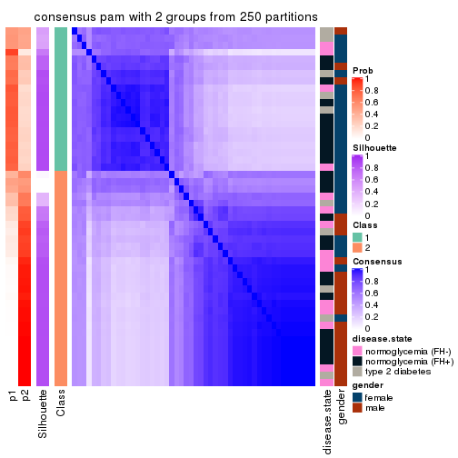</p>

</div>
<div id='tab-CV-pam-consensus-heatmap-2'>
<pre><code class="r">consensus_heatmap(res, k = 3)
</code></pre>

<p></p>

</div>
<div id='tab-CV-pam-consensus-heatmap-3'>
<pre><code class="r">consensus_heatmap(res, k = 4)
</code></pre>

<p></p>

</div>
<div id='tab-CV-pam-consensus-heatmap-4'>
<pre><code class="r">consensus_heatmap(res, k = 5)
</code></pre>

<p></p>

</div>
<div id='tab-CV-pam-consensus-heatmap-5'>
<pre><code class="r">consensus_heatmap(res, k = 6)
</code></pre>

<p></p>

</div>
</div>

Heatmaps for the membership of samples in all partitions to see how consistent they are:


<script>
$( function() {
	$( '#tabs-CV-pam-membership-heatmap' ).tabs();
} );
</script>
<div id='tabs-CV-pam-membership-heatmap'>
<ul>
<li><a href='#tab-CV-pam-membership-heatmap-1'>k = 2</a></li>
<li><a href='#tab-CV-pam-membership-heatmap-2'>k = 3</a></li>
<li><a href='#tab-CV-pam-membership-heatmap-3'>k = 4</a></li>
<li><a href='#tab-CV-pam-membership-heatmap-4'>k = 5</a></li>
<li><a href='#tab-CV-pam-membership-heatmap-5'>k = 6</a></li>
</ul>
<div id='tab-CV-pam-membership-heatmap-1'>
<pre><code class="r">membership_heatmap(res, k = 2)
</code></pre>

<p></p>

</div>
<div id='tab-CV-pam-membership-heatmap-2'>
<pre><code class="r">membership_heatmap(res, k = 3)
</code></pre>

<p></p>

</div>
<div id='tab-CV-pam-membership-heatmap-3'>
<pre><code class="r">membership_heatmap(res, k = 4)
</code></pre>

<p></p>

</div>
<div id='tab-CV-pam-membership-heatmap-4'>
<pre><code class="r">membership_heatmap(res, k = 5)
</code></pre>

<p></p>

</div>
<div id='tab-CV-pam-membership-heatmap-5'>
<pre><code class="r">membership_heatmap(res, k = 6)
</code></pre>

<p></p>

</div>
</div>

As soon as we have had the classes for columns, we can look for signatures
which are significantly different between classes which can be candidate marks
for certain classes. Following are the heatmaps for signatures.


Signature heatmaps where rows are scaled:


<script>
$( function() {
	$( '#tabs-CV-pam-get-signatures' ).tabs();
} );
</script>
<div id='tabs-CV-pam-get-signatures'>
<ul>
<li><a href='#tab-CV-pam-get-signatures-1'>k = 2</a></li>
<li><a href='#tab-CV-pam-get-signatures-2'>k = 3</a></li>
<li><a href='#tab-CV-pam-get-signatures-3'>k = 4</a></li>
<li><a href='#tab-CV-pam-get-signatures-4'>k = 5</a></li>
<li><a href='#tab-CV-pam-get-signatures-5'>k = 6</a></li>
</ul>
<div id='tab-CV-pam-get-signatures-1'>
<pre><code class="r">get_signatures(res, k = 2)
</code></pre>

<p></p>

</div>
<div id='tab-CV-pam-get-signatures-2'>
<pre><code class="r">get_signatures(res, k = 3)
</code></pre>

<p></p>

</div>
<div id='tab-CV-pam-get-signatures-3'>
<pre><code class="r">get_signatures(res, k = 4)
</code></pre>

<p></p>

</div>
<div id='tab-CV-pam-get-signatures-4'>
<pre><code class="r">get_signatures(res, k = 5)
</code></pre>

<p></p>

</div>
<div id='tab-CV-pam-get-signatures-5'>
<pre><code class="r">get_signatures(res, k = 6)
</code></pre>

<p></p>

</div>
</div>


Signature heatmaps where rows are not scaled:


<script>
$( function() {
	$( '#tabs-CV-pam-get-signatures-no-scale' ).tabs();
} );
</script>
<div id='tabs-CV-pam-get-signatures-no-scale'>
<ul>
<li><a href='#tab-CV-pam-get-signatures-no-scale-1'>k = 2</a></li>
<li><a href='#tab-CV-pam-get-signatures-no-scale-2'>k = 3</a></li>
<li><a href='#tab-CV-pam-get-signatures-no-scale-3'>k = 4</a></li>
<li><a href='#tab-CV-pam-get-signatures-no-scale-4'>k = 5</a></li>
<li><a href='#tab-CV-pam-get-signatures-no-scale-5'>k = 6</a></li>
</ul>
<div id='tab-CV-pam-get-signatures-no-scale-1'>
<pre><code class="r">get_signatures(res, k = 2, scale_rows = FALSE)
</code></pre>

<p></p>

</div>
<div id='tab-CV-pam-get-signatures-no-scale-2'>
<pre><code class="r">get_signatures(res, k = 3, scale_rows = FALSE)
</code></pre>

<p></p>

</div>
<div id='tab-CV-pam-get-signatures-no-scale-3'>
<pre><code class="r">get_signatures(res, k = 4, scale_rows = FALSE)
</code></pre>

<p></p>

</div>
<div id='tab-CV-pam-get-signatures-no-scale-4'>
<pre><code class="r">get_signatures(res, k = 5, scale_rows = FALSE)
</code></pre>

<p></p>

</div>
<div id='tab-CV-pam-get-signatures-no-scale-5'>
<pre><code class="r">get_signatures(res, k = 6, scale_rows = FALSE)
</code></pre>

<p></p>

</div>
</div>


Compare the overlap of signatures from different k:

```r
compare_signatures(res)
```


`get_signature()` returns a data frame invisibly. TO get the list of signatures, the function
call should be assigned to a variable explicitly. In following code, if `plot` argument is set
to `FALSE`, no heatmap is plotted while only the differential analysis is performed.

```r
# code only for demonstration
tb = get_signature(res, k = ..., plot = FALSE)
```

An example of the output of `tb` is:

```
#>   which_row         fdr    mean_1    mean_2 scaled_mean_1 scaled_mean_2 km
#> 1        38 0.042760348  8.373488  9.131774    -0.5533452     0.5164555  1
#> 2        40 0.018707592  7.106213  8.469186    -0.6173731     0.5762149  1
#> 3        55 0.019134737 10.221463 11.207825    -0.6159697     0.5749050  1
#> 4        59 0.006059896  5.921854  7.869574    -0.6899429     0.6439467  1
#> 5        60 0.018055526  8.928898 10.211722    -0.6204761     0.5791110  1
#> 6        98 0.009384629 15.714769 14.887706     0.6635654    -0.6193277  2
...
```

The columns in `tb` are:

1. `which_row`: row indices corresponding to the input matrix.
2. `fdr`: FDR for the differential test. 
3. `mean_x`: The mean value in group x.
4. `scaled_mean_x`: The mean value in group x after rows are scaled.
5. `km`: Row groups if k-means clustering is applied to rows.


UMAP plot which shows how samples are separated.


<script>
$( function() {
	$( '#tabs-CV-pam-dimension-reduction' ).tabs();
} );
</script>
<div id='tabs-CV-pam-dimension-reduction'>
<ul>
<li><a href='#tab-CV-pam-dimension-reduction-1'>k = 2</a></li>
<li><a href='#tab-CV-pam-dimension-reduction-2'>k = 3</a></li>
<li><a href='#tab-CV-pam-dimension-reduction-3'>k = 4</a></li>
<li><a href='#tab-CV-pam-dimension-reduction-4'>k = 5</a></li>
<li><a href='#tab-CV-pam-dimension-reduction-5'>k = 6</a></li>
</ul>
<div id='tab-CV-pam-dimension-reduction-1'>
<pre><code class="r">dimension_reduction(res, k = 2, method = &quot;UMAP&quot;)
</code></pre>

<p></p>

</div>
<div id='tab-CV-pam-dimension-reduction-2'>
<pre><code class="r">dimension_reduction(res, k = 3, method = &quot;UMAP&quot;)
</code></pre>

<p></p>

</div>
<div id='tab-CV-pam-dimension-reduction-3'>
<pre><code class="r">dimension_reduction(res, k = 4, method = &quot;UMAP&quot;)
</code></pre>

<p></p>

</div>
<div id='tab-CV-pam-dimension-reduction-4'>
<pre><code class="r">dimension_reduction(res, k = 5, method = &quot;UMAP&quot;)
</code></pre>

<p></p>

</div>
<div id='tab-CV-pam-dimension-reduction-5'>
<pre><code class="r">dimension_reduction(res, k = 6, method = &quot;UMAP&quot;)
</code></pre>

<p></p>

</div>
</div>


Following heatmap shows how subgroups are split when increasing `k`:

```r
collect_classes(res)
```


Test correlation between subgroups and known annotations. If the known
annotation is numeric, one-way ANOVA test is applied, and if the known
annotation is discrete, chi-squared contingency table test is applied.

```r
test_to_known_factors(res)
```

```
#>         n disease.state(p) gender(p) k
#> CV:pam 42            0.290  1.62e-04 2
#> CV:pam 42            0.290  1.62e-04 3
#> CV:pam 42            0.290  1.62e-04 4
#> CV:pam 40            0.199  8.88e-05 5
#> CV:pam 33            0.707  7.39e-04 6
```


If matrix rows can be associated to genes, consider to use `functional_enrichment(res,
...)` to perform function enrichment for the signature genes. See [this vignette](http://bioconductor.org/packages/devel/bioc/vignettes/cola/inst/doc/functional_enrichment.html) for more detailed explanations.


 

---------------------------------------------------


### CV:mclust


The object with results only for a single top-value method and a single partition method 
can be extracted as:

```r
res = res_list["CV", "mclust"]
# you can also extract it by
# res = res_list["CV:mclust"]
```

A summary of `res` and all the functions that can be applied to it:

```r
res
```

```
#> A 'ConsensusPartition' object with k = 2, 3, 4, 5, 6.
#>   On a matrix with 51941 rows and 50 columns.
#>   Top rows (1000, 2000, 3000, 4000, 5000) are extracted by 'CV' method.
#>   Subgroups are detected by 'mclust' method.
#>   Performed in total 1250 partitions by row resampling.
#>   Best k for subgroups seems to be 4.
#> 
#> Following methods can be applied to this 'ConsensusPartition' object:
#>  [1] "cola_report"             "collect_classes"         "collect_plots"          
#>  [4] "collect_stats"           "colnames"                "compare_signatures"     
#>  [7] "consensus_heatmap"       "dimension_reduction"     "functional_enrichment"  
#> [10] "get_anno_col"            "get_anno"                "get_classes"            
#> [13] "get_consensus"           "get_matrix"              "get_membership"         
#> [16] "get_param"               "get_signatures"          "get_stats"              
#> [19] "is_best_k"               "is_stable_k"             "membership_heatmap"     
#> [22] "ncol"                    "nrow"                    "plot_ecdf"              
#> [25] "rownames"                "select_partition_number" "show"                   
#> [28] "suggest_best_k"          "test_to_known_factors"
```

`collect_plots()` function collects all the plots made from `res` for all `k` (number of partitions)
into one single page to provide an easy and fast comparison between different `k`.

```r
collect_plots(res)
```


The plots are:

- The first row: a plot of the ECDF (empirical cumulative distribution
  function) curves of the consensus matrix for each `k` and the heatmap of
  predicted classes for each `k`.
- The second row: heatmaps of the consensus matrix for each `k`.
- The third row: heatmaps of the membership matrix for each `k`.
- The fouth row: heatmaps of the signatures for each `k`.

All the plots in panels can be made by individual functions and they are
plotted later in this section.

`select_partition_number()` produces several plots showing different
statistics for choosing "optimized" `k`. There are following statistics:

- ECDF curves of the consensus matrix for each `k`;
- 1-PAC. [The PAC
  score](https://en.wikipedia.org/wiki/Consensus_clustering#Over-interpretation_potential_of_consensus_clustering)
  measures the proportion of the ambiguous subgrouping.
- Mean silhouette score.
- Concordance. The mean probability of fiting the consensus class ids in all
  partitions.
- Area increased. Denote $A_k$ as the area under the ECDF curve for current
  `k`, the area increased is defined as $A_k - A_{k-1}$.
- Rand index. The percent of pairs of samples that are both in a same cluster
  or both are not in a same cluster in the partition of k and k-1.
- Jaccard index. The ratio of pairs of samples are both in a same cluster in
  the partition of k and k-1 and the pairs of samples are both in a same
  cluster in the partition k or k-1.

The detailed explanations of these statistics can be found in [the _cola_
vignette](http://bioconductor.org/packages/devel/bioc/vignettes/cola/inst/doc/cola.html#toc_13).

Generally speaking, lower PAC score, higher mean silhouette score or higher
concordance corresponds to better partition. Rand index and Jaccard index
measure how similar the current partition is compared to partition with `k-1`.
If they are too similar, we won't accept `k` is better than `k-1`.

```r
select_partition_number(res)
```


The numeric values for all these statistics can be obtained by `get_stats()`.

```r
get_stats(res)
```

```
#>   k 1-PAC mean_silhouette concordance area_increased  Rand Jaccard
#> 2 2 0.250           0.619       0.814         0.3280 0.754   0.754
#> 3 3 0.322           0.608       0.773         0.8796 0.503   0.374
#> 4 4 0.616           0.718       0.855         0.1302 0.766   0.454
#> 5 5 0.569           0.638       0.763         0.0764 0.972   0.908
#> 6 6 0.611           0.431       0.694         0.0603 0.947   0.818
```

`suggest_best_k()` suggests the best $k$ based on these statistics. The rules are as follows:

- All $k$ with Jaccard index larger than 0.95 are removed because increasing
  $k$ does not provide enough extra information. If all $k$ are removed, it is
  marked as no subgroup is detected.
- For all $k$ with 1-PAC score larger than 0.9, the maximal $k$ is taken as
  the best $k$, and other $k$ are marked as optional $k$.
- If it does not fit the second rule. The $k$ with the maximal vote of the
  highest 1-PAC score, highest mean silhouette, and highest concordance is
  taken as the best $k$.

```r
suggest_best_k(res)
```

```
#> [1] 4
```


Following shows the table of the partitions (You need to click the **show/hide
code output** link to see it). The membership matrix (columns with name `p*`)
is inferred by
[`clue::cl_consensus()`](https://www.rdocumentation.org/link/cl_consensus?package=clue)
function with the `SE` method. Basically the value in the membership matrix
represents the probability to belong to a certain group. The finall class
label for an item is determined with the group with highest probability it
belongs to.

In `get_classes()` function, the entropy is calculated from the membership
matrix and the silhouette score is calculated from the consensus matrix.


<script>
$( function() {
	$( '#tabs-CV-mclust-get-classes' ).tabs();
} );
</script>
<div id='tabs-CV-mclust-get-classes'>
<ul>
<li><a href='#tab-CV-mclust-get-classes-1'>k = 2</a></li>
<li><a href='#tab-CV-mclust-get-classes-2'>k = 3</a></li>
<li><a href='#tab-CV-mclust-get-classes-3'>k = 4</a></li>
<li><a href='#tab-CV-mclust-get-classes-4'>k = 5</a></li>
<li><a href='#tab-CV-mclust-get-classes-5'>k = 6</a></li>
</ul>

<div id='tab-CV-mclust-get-classes-1'>
<p><a id='tab-CV-mclust-get-classes-1-a' style='color:#0366d6' href='#'>show/hide code output</a></p>
<pre><code class="r">cbind(get_classes(res, k = 2), get_membership(res, k = 2))
</code></pre>

<pre><code>#&gt;           class entropy silhouette    p1    p2
#&gt; GSM624962     2  0.1633    0.74549 0.024 0.976
#&gt; GSM624963     2  0.4939    0.65389 0.108 0.892
#&gt; GSM624967     2  0.1184    0.74745 0.016 0.984
#&gt; GSM624968     2  0.1843    0.74453 0.028 0.972
#&gt; GSM624969     2  0.9491    0.48541 0.368 0.632
#&gt; GSM624970     2  0.0376    0.74711 0.004 0.996
#&gt; GSM624961     1  0.9460    0.91400 0.636 0.364
#&gt; GSM624964     2  0.1414    0.74427 0.020 0.980
#&gt; GSM624965     1  0.9922    0.83415 0.552 0.448
#&gt; GSM624966     2  0.3274    0.71618 0.060 0.940
#&gt; GSM624925     2  0.8763    0.06046 0.296 0.704
#&gt; GSM624927     2  0.9427    0.49498 0.360 0.640
#&gt; GSM624929     2  0.9963   -0.66110 0.464 0.536
#&gt; GSM624930     2  0.9491    0.48739 0.368 0.632
#&gt; GSM624931     2  0.9286    0.51221 0.344 0.656
#&gt; GSM624935     2  0.0000    0.74580 0.000 1.000
#&gt; GSM624936     2  0.4939    0.69348 0.108 0.892
#&gt; GSM624937     2  0.1633    0.74556 0.024 0.976
#&gt; GSM624926     2  0.0938    0.74398 0.012 0.988
#&gt; GSM624928     1  0.9460    0.91400 0.636 0.364
#&gt; GSM624932     2  0.9000    0.00887 0.316 0.684
#&gt; GSM624933     2  0.2948    0.72775 0.052 0.948
#&gt; GSM624934     2  0.5946    0.64070 0.144 0.856
#&gt; GSM624971     2  0.2236    0.74298 0.036 0.964
#&gt; GSM624973     2  0.2423    0.74194 0.040 0.960
#&gt; GSM624938     2  0.1843    0.74453 0.028 0.972
#&gt; GSM624940     2  0.4939    0.70893 0.108 0.892
#&gt; GSM624941     2  0.9044    0.53341 0.320 0.680
#&gt; GSM624942     2  0.9460    0.49227 0.364 0.636
#&gt; GSM624943     2  0.8555    0.57067 0.280 0.720
#&gt; GSM624945     1  0.9998    0.72870 0.508 0.492
#&gt; GSM624946     2  0.1843    0.74453 0.028 0.972
#&gt; GSM624949     2  0.1184    0.74591 0.016 0.984
#&gt; GSM624951     2  0.7883    0.60492 0.236 0.764
#&gt; GSM624952     2  0.7139    0.44771 0.196 0.804
#&gt; GSM624955     2  0.1843    0.74453 0.028 0.972
#&gt; GSM624956     2  0.8144    0.28883 0.252 0.748
#&gt; GSM624957     2  0.9427    0.49649 0.360 0.640
#&gt; GSM624974     2  0.6343    0.68153 0.160 0.840
#&gt; GSM624939     2  0.5629    0.70148 0.132 0.868
#&gt; GSM624944     2  0.1184    0.74636 0.016 0.984
#&gt; GSM624947     2  0.0938    0.74633 0.012 0.988
#&gt; GSM624948     2  0.9393   -0.17000 0.356 0.644
#&gt; GSM624950     2  0.1414    0.74659 0.020 0.980
#&gt; GSM624953     1  0.9460    0.91400 0.636 0.364
#&gt; GSM624954     2  0.4298    0.72835 0.088 0.912
#&gt; GSM624958     2  0.7056    0.51077 0.192 0.808
#&gt; GSM624959     1  0.9635    0.91352 0.612 0.388
#&gt; GSM624960     2  0.0672    0.74452 0.008 0.992
#&gt; GSM624972     1  0.9686    0.90790 0.604 0.396
</code></pre>

<script>
$('#tab-CV-mclust-get-classes-1-a').parent().next().next().hide();
$('#tab-CV-mclust-get-classes-1-a').click(function(){
  $('#tab-CV-mclust-get-classes-1-a').parent().next().next().toggle();
  return(false);
});
</script>
</div>

<div id='tab-CV-mclust-get-classes-2'>
<p><a id='tab-CV-mclust-get-classes-2-a' style='color:#0366d6' href='#'>show/hide code output</a></p>
<pre><code class="r">cbind(get_classes(res, k = 3), get_membership(res, k = 3))
</code></pre>

<pre><code>#&gt;           class entropy silhouette    p1    p2    p3
#&gt; GSM624962     3  0.2165    0.77575 0.000 0.064 0.936
#&gt; GSM624963     3  0.5541    0.50624 0.008 0.252 0.740
#&gt; GSM624967     3  0.2187    0.79184 0.024 0.028 0.948
#&gt; GSM624968     3  0.1315    0.78746 0.008 0.020 0.972
#&gt; GSM624969     1  0.0424    0.75614 0.992 0.000 0.008
#&gt; GSM624970     3  0.3349    0.76394 0.108 0.004 0.888
#&gt; GSM624961     2  0.1491    0.70910 0.016 0.968 0.016
#&gt; GSM624964     3  0.8231    0.49940 0.208 0.156 0.636
#&gt; GSM624965     2  0.4953    0.72027 0.016 0.808 0.176
#&gt; GSM624966     2  0.6617    0.36691 0.008 0.556 0.436
#&gt; GSM624925     2  0.6398    0.58070 0.008 0.620 0.372
#&gt; GSM624927     1  0.0661    0.75661 0.988 0.004 0.008
#&gt; GSM624929     2  0.7226    0.67824 0.076 0.688 0.236
#&gt; GSM624930     1  0.0475    0.75424 0.992 0.004 0.004
#&gt; GSM624931     1  0.0892    0.75727 0.980 0.000 0.020
#&gt; GSM624935     3  0.3499    0.78378 0.072 0.028 0.900
#&gt; GSM624936     1  0.9575    0.10390 0.464 0.320 0.216
#&gt; GSM624937     3  0.3276    0.78256 0.068 0.024 0.908
#&gt; GSM624926     3  0.2878    0.78130 0.000 0.096 0.904
#&gt; GSM624928     2  0.1636    0.71242 0.016 0.964 0.020
#&gt; GSM624932     2  0.7543    0.67176 0.104 0.680 0.216
#&gt; GSM624933     2  0.7181    0.26554 0.024 0.508 0.468
#&gt; GSM624934     1  0.9464    0.00503 0.416 0.404 0.180
#&gt; GSM624971     3  0.2066    0.78425 0.000 0.060 0.940
#&gt; GSM624973     3  0.7216    0.61944 0.112 0.176 0.712
#&gt; GSM624938     3  0.1964    0.77792 0.000 0.056 0.944
#&gt; GSM624940     3  0.6192    0.20308 0.420 0.000 0.580
#&gt; GSM624941     1  0.3686    0.71107 0.860 0.000 0.140
#&gt; GSM624942     1  0.0424    0.75592 0.992 0.000 0.008
#&gt; GSM624943     1  0.2774    0.74819 0.920 0.008 0.072
#&gt; GSM624945     2  0.5731    0.71424 0.020 0.752 0.228
#&gt; GSM624946     3  0.2096    0.77886 0.004 0.052 0.944
#&gt; GSM624949     3  0.4845    0.75647 0.052 0.104 0.844
#&gt; GSM624951     1  0.6154    0.25385 0.592 0.000 0.408
#&gt; GSM624952     3  0.6521   -0.33157 0.004 0.496 0.500
#&gt; GSM624955     3  0.0747    0.78212 0.000 0.016 0.984
#&gt; GSM624956     3  0.6307   -0.32440 0.000 0.488 0.512
#&gt; GSM624957     1  0.0661    0.75678 0.988 0.004 0.008
#&gt; GSM624974     1  0.7453    0.61550 0.700 0.148 0.152
#&gt; GSM624939     1  0.7524    0.61831 0.692 0.128 0.180
#&gt; GSM624944     3  0.2878    0.77862 0.000 0.096 0.904
#&gt; GSM624947     3  0.4479    0.76726 0.044 0.096 0.860
#&gt; GSM624948     2  0.6096    0.59268 0.016 0.704 0.280
#&gt; GSM624950     3  0.2959    0.77944 0.000 0.100 0.900
#&gt; GSM624953     2  0.1781    0.71080 0.020 0.960 0.020
#&gt; GSM624954     1  0.8220    0.55496 0.636 0.152 0.212
#&gt; GSM624958     2  0.6769    0.47491 0.016 0.592 0.392
#&gt; GSM624959     2  0.3234    0.73409 0.020 0.908 0.072
#&gt; GSM624960     3  0.2796    0.78204 0.000 0.092 0.908
#&gt; GSM624972     2  0.1491    0.70910 0.016 0.968 0.016
</code></pre>

<script>
$('#tab-CV-mclust-get-classes-2-a').parent().next().next().hide();
$('#tab-CV-mclust-get-classes-2-a').click(function(){
  $('#tab-CV-mclust-get-classes-2-a').parent().next().next().toggle();
  return(false);
});
</script>
</div>

<div id='tab-CV-mclust-get-classes-3'>
<p><a id='tab-CV-mclust-get-classes-3-a' style='color:#0366d6' href='#'>show/hide code output</a></p>
<pre><code class="r">cbind(get_classes(res, k = 4), get_membership(res, k = 4))
</code></pre>

<pre><code>#&gt;           class entropy silhouette    p1    p2    p3    p4
#&gt; GSM624962     3  0.5452      0.294 0.000 0.360 0.616 0.024
#&gt; GSM624963     2  0.5627      0.712 0.004 0.720 0.196 0.080
#&gt; GSM624967     4  0.3072      0.715 0.008 0.024 0.076 0.892
#&gt; GSM624968     4  0.1389      0.724 0.000 0.000 0.048 0.952
#&gt; GSM624969     1  0.0188      0.804 0.996 0.000 0.000 0.004
#&gt; GSM624970     4  0.4855      0.467 0.352 0.000 0.004 0.644
#&gt; GSM624961     2  0.0188      0.879 0.000 0.996 0.000 0.004
#&gt; GSM624964     1  0.7164      0.471 0.556 0.240 0.000 0.204
#&gt; GSM624965     2  0.1118      0.883 0.000 0.964 0.000 0.036
#&gt; GSM624966     2  0.1978      0.881 0.000 0.928 0.004 0.068
#&gt; GSM624925     2  0.3245      0.867 0.000 0.880 0.064 0.056
#&gt; GSM624927     1  0.0188      0.804 0.996 0.000 0.000 0.004
#&gt; GSM624929     2  0.3565      0.869 0.032 0.880 0.032 0.056
#&gt; GSM624930     1  0.0000      0.804 1.000 0.000 0.000 0.000
#&gt; GSM624931     1  0.0000      0.804 1.000 0.000 0.000 0.000
#&gt; GSM624935     4  0.6030      0.511 0.068 0.252 0.008 0.672
#&gt; GSM624936     1  0.6230      0.171 0.528 0.428 0.012 0.032
#&gt; GSM624937     4  0.1585      0.731 0.040 0.004 0.004 0.952
#&gt; GSM624926     4  0.5112      0.336 0.000 0.384 0.008 0.608
#&gt; GSM624928     2  0.0188      0.879 0.000 0.996 0.000 0.004
#&gt; GSM624932     2  0.3378      0.859 0.060 0.884 0.012 0.044
#&gt; GSM624933     2  0.2149      0.871 0.000 0.912 0.000 0.088
#&gt; GSM624934     2  0.5331      0.622 0.224 0.728 0.012 0.036
#&gt; GSM624971     3  0.3764      0.673 0.000 0.076 0.852 0.072
#&gt; GSM624973     1  0.7850      0.451 0.508 0.348 0.084 0.060
#&gt; GSM624938     3  0.0336      0.743 0.000 0.000 0.992 0.008
#&gt; GSM624940     1  0.3320      0.755 0.876 0.000 0.068 0.056
#&gt; GSM624941     1  0.0817      0.799 0.976 0.000 0.000 0.024
#&gt; GSM624942     1  0.0188      0.804 0.996 0.000 0.000 0.004
#&gt; GSM624943     1  0.0804      0.804 0.980 0.008 0.000 0.012
#&gt; GSM624945     2  0.2586      0.876 0.000 0.912 0.048 0.040
#&gt; GSM624946     3  0.0336      0.743 0.000 0.000 0.992 0.008
#&gt; GSM624949     2  0.5892      0.744 0.048 0.736 0.048 0.168
#&gt; GSM624951     1  0.0895      0.799 0.976 0.000 0.004 0.020
#&gt; GSM624952     2  0.4868      0.731 0.000 0.748 0.212 0.040
#&gt; GSM624955     4  0.4331      0.522 0.000 0.000 0.288 0.712
#&gt; GSM624956     2  0.4986      0.724 0.000 0.740 0.216 0.044
#&gt; GSM624957     1  0.0000      0.804 1.000 0.000 0.000 0.000
#&gt; GSM624974     1  0.5515      0.635 0.688 0.272 0.012 0.028
#&gt; GSM624939     1  0.4730      0.709 0.780 0.180 0.012 0.028
#&gt; GSM624944     4  0.1474      0.736 0.000 0.052 0.000 0.948
#&gt; GSM624947     4  0.6160      0.393 0.316 0.072 0.000 0.612
#&gt; GSM624948     2  0.0469      0.881 0.000 0.988 0.000 0.012
#&gt; GSM624950     4  0.1211      0.737 0.000 0.040 0.000 0.960
#&gt; GSM624953     2  0.0188      0.879 0.000 0.996 0.000 0.004
#&gt; GSM624954     1  0.5760      0.621 0.672 0.276 0.008 0.044
#&gt; GSM624958     2  0.1940      0.877 0.000 0.924 0.000 0.076
#&gt; GSM624959     2  0.0592      0.882 0.000 0.984 0.000 0.016
#&gt; GSM624960     4  0.1109      0.737 0.000 0.028 0.004 0.968
#&gt; GSM624972     2  0.0188      0.879 0.000 0.996 0.000 0.004
</code></pre>

<script>
$('#tab-CV-mclust-get-classes-3-a').parent().next().next().hide();
$('#tab-CV-mclust-get-classes-3-a').click(function(){
  $('#tab-CV-mclust-get-classes-3-a').parent().next().next().toggle();
  return(false);
});
</script>
</div>

<div id='tab-CV-mclust-get-classes-4'>
<p><a id='tab-CV-mclust-get-classes-4-a' style='color:#0366d6' href='#'>show/hide code output</a></p>
<pre><code class="r">cbind(get_classes(res, k = 5), get_membership(res, k = 5))
</code></pre>

<pre><code>#&gt;           class entropy silhouette    p1    p2    p3    p4    p5
#&gt; GSM624962     3  0.6295      0.292 0.000 0.296 0.580 0.040 0.084
#&gt; GSM624963     2  0.7869      0.466 0.000 0.460 0.184 0.124 0.232
#&gt; GSM624967     4  0.3734      0.694 0.004 0.012 0.100 0.836 0.048
#&gt; GSM624968     4  0.2569      0.709 0.000 0.000 0.068 0.892 0.040
#&gt; GSM624969     1  0.0865      0.817 0.972 0.000 0.000 0.004 0.024
#&gt; GSM624970     4  0.4786      0.546 0.260 0.000 0.024 0.696 0.020
#&gt; GSM624961     2  0.0510      0.693 0.000 0.984 0.000 0.000 0.016
#&gt; GSM624964     1  0.6188      0.308 0.548 0.056 0.000 0.352 0.044
#&gt; GSM624965     2  0.2654      0.696 0.000 0.888 0.000 0.048 0.064
#&gt; GSM624966     2  0.4503      0.694 0.000 0.768 0.008 0.140 0.084
#&gt; GSM624925     2  0.6199      0.661 0.000 0.660 0.096 0.080 0.164
#&gt; GSM624927     1  0.1197      0.817 0.952 0.000 0.000 0.000 0.048
#&gt; GSM624929     2  0.6607      0.666 0.044 0.672 0.072 0.080 0.132
#&gt; GSM624930     1  0.0290      0.816 0.992 0.000 0.000 0.000 0.008
#&gt; GSM624931     1  0.1124      0.813 0.960 0.000 0.000 0.004 0.036
#&gt; GSM624935     4  0.7109      0.496 0.036 0.068 0.040 0.504 0.352
#&gt; GSM624936     2  0.7307      0.289 0.352 0.452 0.032 0.012 0.152
#&gt; GSM624937     4  0.2617      0.717 0.032 0.000 0.036 0.904 0.028
#&gt; GSM624926     4  0.6004      0.454 0.000 0.120 0.000 0.508 0.372
#&gt; GSM624928     2  0.0609      0.692 0.000 0.980 0.000 0.000 0.020
#&gt; GSM624932     2  0.5967      0.639 0.040 0.652 0.020 0.040 0.248
#&gt; GSM624933     2  0.6158      0.554 0.004 0.580 0.000 0.212 0.204
#&gt; GSM624934     2  0.6590      0.350 0.248 0.464 0.000 0.000 0.288
#&gt; GSM624971     3  0.3798      0.637 0.000 0.060 0.816 0.120 0.004
#&gt; GSM624973     1  0.9249      0.279 0.392 0.160 0.116 0.112 0.220
#&gt; GSM624938     3  0.0404      0.745 0.000 0.000 0.988 0.012 0.000
#&gt; GSM624940     1  0.5474      0.676 0.716 0.000 0.116 0.040 0.128
#&gt; GSM624941     1  0.1306      0.812 0.960 0.000 0.016 0.008 0.016
#&gt; GSM624942     1  0.0613      0.814 0.984 0.000 0.008 0.004 0.004
#&gt; GSM624943     1  0.2973      0.802 0.880 0.008 0.016 0.012 0.084
#&gt; GSM624945     2  0.5073      0.696 0.000 0.756 0.076 0.060 0.108
#&gt; GSM624946     3  0.0609      0.744 0.000 0.000 0.980 0.020 0.000
#&gt; GSM624949     2  0.7448      0.554 0.032 0.556 0.072 0.240 0.100
#&gt; GSM624951     1  0.2445      0.797 0.908 0.000 0.016 0.020 0.056
#&gt; GSM624952     2  0.6621      0.575 0.000 0.588 0.200 0.040 0.172
#&gt; GSM624955     4  0.4104      0.593 0.000 0.000 0.220 0.748 0.032
#&gt; GSM624956     2  0.6531      0.593 0.000 0.604 0.196 0.044 0.156
#&gt; GSM624957     1  0.1544      0.815 0.932 0.000 0.000 0.000 0.068
#&gt; GSM624974     1  0.4919      0.693 0.652 0.040 0.000 0.004 0.304
#&gt; GSM624939     1  0.4437      0.704 0.664 0.020 0.000 0.000 0.316
#&gt; GSM624944     4  0.1579      0.720 0.000 0.032 0.000 0.944 0.024
#&gt; GSM624947     4  0.5555      0.387 0.320 0.040 0.000 0.612 0.028
#&gt; GSM624948     2  0.2843      0.637 0.000 0.848 0.000 0.008 0.144
#&gt; GSM624950     4  0.0703      0.720 0.000 0.024 0.000 0.976 0.000
#&gt; GSM624953     2  0.0771      0.693 0.000 0.976 0.000 0.004 0.020
#&gt; GSM624954     1  0.5277      0.698 0.660 0.036 0.000 0.028 0.276
#&gt; GSM624958     2  0.5372      0.600 0.000 0.668 0.000 0.152 0.180
#&gt; GSM624959     2  0.1893      0.708 0.000 0.928 0.000 0.048 0.024
#&gt; GSM624960     4  0.3882      0.659 0.000 0.020 0.000 0.756 0.224
#&gt; GSM624972     2  0.0609      0.691 0.000 0.980 0.000 0.000 0.020
</code></pre>

<script>
$('#tab-CV-mclust-get-classes-4-a').parent().next().next().hide();
$('#tab-CV-mclust-get-classes-4-a').click(function(){
  $('#tab-CV-mclust-get-classes-4-a').parent().next().next().toggle();
  return(false);
});
</script>
</div>

<div id='tab-CV-mclust-get-classes-5'>
<p><a id='tab-CV-mclust-get-classes-5-a' style='color:#0366d6' href='#'>show/hide code output</a></p>
<pre><code class="r">cbind(get_classes(res, k = 6), get_membership(res, k = 6))
</code></pre>

<pre><code>#&gt;           class entropy silhouette    p1    p2    p3    p4    p5    p6
#&gt; GSM624962     3  0.6800     0.2878 0.000 0.240 0.528 0.012 0.112 0.108
#&gt; GSM624963     6  0.7183     0.0912 0.000 0.268 0.172 0.084 0.016 0.460
#&gt; GSM624967     4  0.3928     0.5574 0.004 0.000 0.072 0.792 0.012 0.120
#&gt; GSM624968     4  0.4421     0.5800 0.000 0.000 0.068 0.764 0.052 0.116
#&gt; GSM624969     1  0.0458     0.6736 0.984 0.000 0.000 0.000 0.016 0.000
#&gt; GSM624970     4  0.5794     0.3820 0.256 0.000 0.000 0.596 0.092 0.056
#&gt; GSM624961     2  0.0260     0.5809 0.000 0.992 0.000 0.000 0.000 0.008
#&gt; GSM624964     1  0.6341     0.1293 0.528 0.056 0.000 0.324 0.068 0.024
#&gt; GSM624965     2  0.3213     0.4698 0.000 0.808 0.000 0.032 0.000 0.160
#&gt; GSM624966     2  0.5135     0.4820 0.000 0.676 0.000 0.088 0.036 0.200
#&gt; GSM624925     2  0.6034     0.4544 0.000 0.568 0.076 0.016 0.044 0.296
#&gt; GSM624927     1  0.0632     0.6767 0.976 0.000 0.000 0.000 0.024 0.000
#&gt; GSM624929     2  0.6774     0.4959 0.048 0.636 0.064 0.040 0.112 0.100
#&gt; GSM624930     1  0.0508     0.6733 0.984 0.000 0.000 0.000 0.012 0.004
#&gt; GSM624931     1  0.3290     0.4335 0.744 0.000 0.004 0.000 0.252 0.000
#&gt; GSM624935     6  0.7278     0.2311 0.060 0.040 0.032 0.332 0.064 0.472
#&gt; GSM624936     2  0.6448     0.1018 0.396 0.436 0.012 0.012 0.132 0.012
#&gt; GSM624937     4  0.4697     0.5930 0.060 0.000 0.012 0.756 0.052 0.120
#&gt; GSM624926     6  0.5860     0.2992 0.000 0.104 0.000 0.368 0.028 0.500
#&gt; GSM624928     2  0.0405     0.5799 0.000 0.988 0.000 0.004 0.000 0.008
#&gt; GSM624932     2  0.5917     0.4746 0.044 0.628 0.012 0.016 0.240 0.060
#&gt; GSM624933     2  0.6283    -0.0423 0.008 0.484 0.000 0.176 0.016 0.316
#&gt; GSM624934     2  0.6531     0.0125 0.336 0.348 0.000 0.004 0.300 0.012
#&gt; GSM624971     3  0.3901     0.5875 0.000 0.064 0.808 0.072 0.000 0.056
#&gt; GSM624973     5  0.8989     0.3183 0.120 0.160 0.084 0.088 0.408 0.140
#&gt; GSM624938     3  0.0146     0.7103 0.000 0.000 0.996 0.000 0.000 0.004
#&gt; GSM624940     5  0.6134     0.2103 0.384 0.004 0.092 0.028 0.484 0.008
#&gt; GSM624941     1  0.2346     0.6005 0.868 0.000 0.000 0.000 0.124 0.008
#&gt; GSM624942     1  0.1204     0.6522 0.944 0.000 0.000 0.000 0.056 0.000
#&gt; GSM624943     1  0.1787     0.6608 0.920 0.000 0.000 0.004 0.068 0.008
#&gt; GSM624945     2  0.4596     0.5544 0.000 0.772 0.056 0.024 0.044 0.104
#&gt; GSM624946     3  0.0000     0.7098 0.000 0.000 1.000 0.000 0.000 0.000
#&gt; GSM624949     2  0.7313     0.3094 0.008 0.504 0.060 0.156 0.040 0.232
#&gt; GSM624951     1  0.4009     0.1827 0.632 0.000 0.004 0.000 0.356 0.008
#&gt; GSM624952     2  0.6743     0.3255 0.000 0.452 0.160 0.004 0.060 0.324
#&gt; GSM624955     4  0.5260     0.4727 0.000 0.000 0.268 0.632 0.052 0.048
#&gt; GSM624956     2  0.6549     0.3602 0.000 0.480 0.156 0.004 0.048 0.312
#&gt; GSM624957     1  0.0865     0.6751 0.964 0.000 0.000 0.000 0.036 0.000
#&gt; GSM624974     1  0.4214     0.3258 0.528 0.008 0.000 0.004 0.460 0.000
#&gt; GSM624939     1  0.4091     0.3106 0.520 0.008 0.000 0.000 0.472 0.000
#&gt; GSM624944     4  0.2001     0.5740 0.000 0.040 0.000 0.912 0.000 0.048
#&gt; GSM624947     4  0.5939     0.2358 0.288 0.044 0.000 0.588 0.048 0.032
#&gt; GSM624948     2  0.3650     0.2869 0.000 0.716 0.000 0.004 0.008 0.272
#&gt; GSM624950     4  0.0622     0.6028 0.000 0.012 0.000 0.980 0.000 0.008
#&gt; GSM624953     2  0.0291     0.5810 0.000 0.992 0.000 0.000 0.004 0.004
#&gt; GSM624954     1  0.4330     0.4737 0.684 0.008 0.000 0.028 0.276 0.004
#&gt; GSM624958     2  0.5082     0.1520 0.000 0.600 0.000 0.080 0.008 0.312
#&gt; GSM624959     2  0.2252     0.5687 0.000 0.908 0.000 0.028 0.020 0.044
#&gt; GSM624960     4  0.4304     0.3196 0.000 0.020 0.000 0.704 0.028 0.248
#&gt; GSM624972     2  0.0725     0.5822 0.000 0.976 0.000 0.000 0.012 0.012
</code></pre>

<script>
$('#tab-CV-mclust-get-classes-5-a').parent().next().next().hide();
$('#tab-CV-mclust-get-classes-5-a').click(function(){
  $('#tab-CV-mclust-get-classes-5-a').parent().next().next().toggle();
  return(false);
});
</script>
</div>
</div>

Heatmaps for the consensus matrix. It visualizes the probability of two
samples to be in a same group.


<script>
$( function() {
	$( '#tabs-CV-mclust-consensus-heatmap' ).tabs();
} );
</script>
<div id='tabs-CV-mclust-consensus-heatmap'>
<ul>
<li><a href='#tab-CV-mclust-consensus-heatmap-1'>k = 2</a></li>
<li><a href='#tab-CV-mclust-consensus-heatmap-2'>k = 3</a></li>
<li><a href='#tab-CV-mclust-consensus-heatmap-3'>k = 4</a></li>
<li><a href='#tab-CV-mclust-consensus-heatmap-4'>k = 5</a></li>
<li><a href='#tab-CV-mclust-consensus-heatmap-5'>k = 6</a></li>
</ul>
<div id='tab-CV-mclust-consensus-heatmap-1'>
<pre><code class="r">consensus_heatmap(res, k = 2)
</code></pre>

<p></p>

</div>
<div id='tab-CV-mclust-consensus-heatmap-2'>
<pre><code class="r">consensus_heatmap(res, k = 3)
</code></pre>

<p></p>

</div>
<div id='tab-CV-mclust-consensus-heatmap-3'>
<pre><code class="r">consensus_heatmap(res, k = 4)
</code></pre>

<p></p>

</div>
<div id='tab-CV-mclust-consensus-heatmap-4'>
<pre><code class="r">consensus_heatmap(res, k = 5)
</code></pre>

<p></p>

</div>
<div id='tab-CV-mclust-consensus-heatmap-5'>
<pre><code class="r">consensus_heatmap(res, k = 6)
</code></pre>

<p></p>

</div>
</div>

Heatmaps for the membership of samples in all partitions to see how consistent they are:


<script>
$( function() {
	$( '#tabs-CV-mclust-membership-heatmap' ).tabs();
} );
</script>
<div id='tabs-CV-mclust-membership-heatmap'>
<ul>
<li><a href='#tab-CV-mclust-membership-heatmap-1'>k = 2</a></li>
<li><a href='#tab-CV-mclust-membership-heatmap-2'>k = 3</a></li>
<li><a href='#tab-CV-mclust-membership-heatmap-3'>k = 4</a></li>
<li><a href='#tab-CV-mclust-membership-heatmap-4'>k = 5</a></li>
<li><a href='#tab-CV-mclust-membership-heatmap-5'>k = 6</a></li>
</ul>
<div id='tab-CV-mclust-membership-heatmap-1'>
<pre><code class="r">membership_heatmap(res, k = 2)
</code></pre>

<p></p>

</div>
<div id='tab-CV-mclust-membership-heatmap-2'>
<pre><code class="r">membership_heatmap(res, k = 3)
</code></pre>

<p></p>

</div>
<div id='tab-CV-mclust-membership-heatmap-3'>
<pre><code class="r">membership_heatmap(res, k = 4)
</code></pre>

<p></p>

</div>
<div id='tab-CV-mclust-membership-heatmap-4'>
<pre><code class="r">membership_heatmap(res, k = 5)
</code></pre>

<p></p>

</div>
<div id='tab-CV-mclust-membership-heatmap-5'>
<pre><code class="r">membership_heatmap(res, k = 6)
</code></pre>

<p></p>

</div>
</div>

As soon as we have had the classes for columns, we can look for signatures
which are significantly different between classes which can be candidate marks
for certain classes. Following are the heatmaps for signatures.


Signature heatmaps where rows are scaled:


<script>
$( function() {
	$( '#tabs-CV-mclust-get-signatures' ).tabs();
} );
</script>
<div id='tabs-CV-mclust-get-signatures'>
<ul>
<li><a href='#tab-CV-mclust-get-signatures-1'>k = 2</a></li>
<li><a href='#tab-CV-mclust-get-signatures-2'>k = 3</a></li>
<li><a href='#tab-CV-mclust-get-signatures-3'>k = 4</a></li>
<li><a href='#tab-CV-mclust-get-signatures-4'>k = 5</a></li>
<li><a href='#tab-CV-mclust-get-signatures-5'>k = 6</a></li>
</ul>
<div id='tab-CV-mclust-get-signatures-1'>
<pre><code class="r">get_signatures(res, k = 2)
</code></pre>

<p></p>

</div>
<div id='tab-CV-mclust-get-signatures-2'>
<pre><code class="r">get_signatures(res, k = 3)
</code></pre>

<p></p>

</div>
<div id='tab-CV-mclust-get-signatures-3'>
<pre><code class="r">get_signatures(res, k = 4)
</code></pre>

<p></p>

</div>
<div id='tab-CV-mclust-get-signatures-4'>
<pre><code class="r">get_signatures(res, k = 5)
</code></pre>

<p></p>

</div>
<div id='tab-CV-mclust-get-signatures-5'>
<pre><code class="r">get_signatures(res, k = 6)
</code></pre>

<p></p>

</div>
</div>


Signature heatmaps where rows are not scaled:


<script>
$( function() {
	$( '#tabs-CV-mclust-get-signatures-no-scale' ).tabs();
} );
</script>
<div id='tabs-CV-mclust-get-signatures-no-scale'>
<ul>
<li><a href='#tab-CV-mclust-get-signatures-no-scale-1'>k = 2</a></li>
<li><a href='#tab-CV-mclust-get-signatures-no-scale-2'>k = 3</a></li>
<li><a href='#tab-CV-mclust-get-signatures-no-scale-3'>k = 4</a></li>
<li><a href='#tab-CV-mclust-get-signatures-no-scale-4'>k = 5</a></li>
<li><a href='#tab-CV-mclust-get-signatures-no-scale-5'>k = 6</a></li>
</ul>
<div id='tab-CV-mclust-get-signatures-no-scale-1'>
<pre><code class="r">get_signatures(res, k = 2, scale_rows = FALSE)
</code></pre>

<p></p>

</div>
<div id='tab-CV-mclust-get-signatures-no-scale-2'>
<pre><code class="r">get_signatures(res, k = 3, scale_rows = FALSE)
</code></pre>

<p></p>

</div>
<div id='tab-CV-mclust-get-signatures-no-scale-3'>
<pre><code class="r">get_signatures(res, k = 4, scale_rows = FALSE)
</code></pre>

<p></p>

</div>
<div id='tab-CV-mclust-get-signatures-no-scale-4'>
<pre><code class="r">get_signatures(res, k = 5, scale_rows = FALSE)
</code></pre>

<p></p>

</div>
<div id='tab-CV-mclust-get-signatures-no-scale-5'>
<pre><code class="r">get_signatures(res, k = 6, scale_rows = FALSE)
</code></pre>

<p></p>

</div>
</div>


Compare the overlap of signatures from different k:

```r
compare_signatures(res)
```


`get_signature()` returns a data frame invisibly. TO get the list of signatures, the function
call should be assigned to a variable explicitly. In following code, if `plot` argument is set
to `FALSE`, no heatmap is plotted while only the differential analysis is performed.

```r
# code only for demonstration
tb = get_signature(res, k = ..., plot = FALSE)
```

An example of the output of `tb` is:

```
#>   which_row         fdr    mean_1    mean_2 scaled_mean_1 scaled_mean_2 km
#> 1        38 0.042760348  8.373488  9.131774    -0.5533452     0.5164555  1
#> 2        40 0.018707592  7.106213  8.469186    -0.6173731     0.5762149  1
#> 3        55 0.019134737 10.221463 11.207825    -0.6159697     0.5749050  1
#> 4        59 0.006059896  5.921854  7.869574    -0.6899429     0.6439467  1
#> 5        60 0.018055526  8.928898 10.211722    -0.6204761     0.5791110  1
#> 6        98 0.009384629 15.714769 14.887706     0.6635654    -0.6193277  2
...
```

The columns in `tb` are:

1. `which_row`: row indices corresponding to the input matrix.
2. `fdr`: FDR for the differential test. 
3. `mean_x`: The mean value in group x.
4. `scaled_mean_x`: The mean value in group x after rows are scaled.
5. `km`: Row groups if k-means clustering is applied to rows.


UMAP plot which shows how samples are separated.


<script>
$( function() {
	$( '#tabs-CV-mclust-dimension-reduction' ).tabs();
} );
</script>
<div id='tabs-CV-mclust-dimension-reduction'>
<ul>
<li><a href='#tab-CV-mclust-dimension-reduction-1'>k = 2</a></li>
<li><a href='#tab-CV-mclust-dimension-reduction-2'>k = 3</a></li>
<li><a href='#tab-CV-mclust-dimension-reduction-3'>k = 4</a></li>
<li><a href='#tab-CV-mclust-dimension-reduction-4'>k = 5</a></li>
<li><a href='#tab-CV-mclust-dimension-reduction-5'>k = 6</a></li>
</ul>
<div id='tab-CV-mclust-dimension-reduction-1'>
<pre><code class="r">dimension_reduction(res, k = 2, method = &quot;UMAP&quot;)
</code></pre>

<p></p>

</div>
<div id='tab-CV-mclust-dimension-reduction-2'>
<pre><code class="r">dimension_reduction(res, k = 3, method = &quot;UMAP&quot;)
</code></pre>

<p></p>

</div>
<div id='tab-CV-mclust-dimension-reduction-3'>
<pre><code class="r">dimension_reduction(res, k = 4, method = &quot;UMAP&quot;)
</code></pre>

<p></p>

</div>
<div id='tab-CV-mclust-dimension-reduction-4'>
<pre><code class="r">dimension_reduction(res, k = 5, method = &quot;UMAP&quot;)
</code></pre>

<p></p>

</div>
<div id='tab-CV-mclust-dimension-reduction-5'>
<pre><code class="r">dimension_reduction(res, k = 6, method = &quot;UMAP&quot;)
</code></pre>

<p></p>

</div>
</div>


Following heatmap shows how subgroups are split when increasing `k`:

```r
collect_classes(res)
```


Test correlation between subgroups and known annotations. If the known
annotation is numeric, one-way ANOVA test is applied, and if the known
annotation is discrete, chi-squared contingency table test is applied.

```r
test_to_known_factors(res)
```

```
#>            n disease.state(p) gender(p) k
#> CV:mclust 39            0.742    0.1108 2
#> CV:mclust 40            0.738    0.0322 3
#> CV:mclust 43            0.840    0.0592 4
#> CV:mclust 41            0.627    0.0560 5
#> CV:mclust 21            0.861    0.0228 6
```


If matrix rows can be associated to genes, consider to use `functional_enrichment(res,
...)` to perform function enrichment for the signature genes. See [this vignette](http://bioconductor.org/packages/devel/bioc/vignettes/cola/inst/doc/functional_enrichment.html) for more detailed explanations.


 

---------------------------------------------------


### CV:NMF


The object with results only for a single top-value method and a single partition method 
can be extracted as:

```r
res = res_list["CV", "NMF"]
# you can also extract it by
# res = res_list["CV:NMF"]
```

A summary of `res` and all the functions that can be applied to it:

```r
res
```

```
#> A 'ConsensusPartition' object with k = 2, 3, 4, 5, 6.
#>   On a matrix with 51941 rows and 50 columns.
#>   Top rows (1000, 2000, 3000, 4000, 5000) are extracted by 'CV' method.
#>   Subgroups are detected by 'NMF' method.
#>   Performed in total 1250 partitions by row resampling.
#>   Best k for subgroups seems to be 2.
#> 
#> Following methods can be applied to this 'ConsensusPartition' object:
#>  [1] "cola_report"             "collect_classes"         "collect_plots"          
#>  [4] "collect_stats"           "colnames"                "compare_signatures"     
#>  [7] "consensus_heatmap"       "dimension_reduction"     "functional_enrichment"  
#> [10] "get_anno_col"            "get_anno"                "get_classes"            
#> [13] "get_consensus"           "get_matrix"              "get_membership"         
#> [16] "get_param"               "get_signatures"          "get_stats"              
#> [19] "is_best_k"               "is_stable_k"             "membership_heatmap"     
#> [22] "ncol"                    "nrow"                    "plot_ecdf"              
#> [25] "rownames"                "select_partition_number" "show"                   
#> [28] "suggest_best_k"          "test_to_known_factors"
```

`collect_plots()` function collects all the plots made from `res` for all `k` (number of partitions)
into one single page to provide an easy and fast comparison between different `k`.

```r
collect_plots(res)
```


The plots are:

- The first row: a plot of the ECDF (empirical cumulative distribution
  function) curves of the consensus matrix for each `k` and the heatmap of
  predicted classes for each `k`.
- The second row: heatmaps of the consensus matrix for each `k`.
- The third row: heatmaps of the membership matrix for each `k`.
- The fouth row: heatmaps of the signatures for each `k`.

All the plots in panels can be made by individual functions and they are
plotted later in this section.

`select_partition_number()` produces several plots showing different
statistics for choosing "optimized" `k`. There are following statistics:

- ECDF curves of the consensus matrix for each `k`;
- 1-PAC. [The PAC
  score](https://en.wikipedia.org/wiki/Consensus_clustering#Over-interpretation_potential_of_consensus_clustering)
  measures the proportion of the ambiguous subgrouping.
- Mean silhouette score.
- Concordance. The mean probability of fiting the consensus class ids in all
  partitions.
- Area increased. Denote $A_k$ as the area under the ECDF curve for current
  `k`, the area increased is defined as $A_k - A_{k-1}$.
- Rand index. The percent of pairs of samples that are both in a same cluster
  or both are not in a same cluster in the partition of k and k-1.
- Jaccard index. The ratio of pairs of samples are both in a same cluster in
  the partition of k and k-1 and the pairs of samples are both in a same
  cluster in the partition k or k-1.

The detailed explanations of these statistics can be found in [the _cola_
vignette](http://bioconductor.org/packages/devel/bioc/vignettes/cola/inst/doc/cola.html#toc_13).

Generally speaking, lower PAC score, higher mean silhouette score or higher
concordance corresponds to better partition. Rand index and Jaccard index
measure how similar the current partition is compared to partition with `k-1`.
If they are too similar, we won't accept `k` is better than `k-1`.

```r
select_partition_number(res)
```


The numeric values for all these statistics can be obtained by `get_stats()`.

```r
get_stats(res)
```

```
#>   k 1-PAC mean_silhouette concordance area_increased  Rand Jaccard
#> 2 2 0.221           0.693       0.844         0.5010 0.491   0.491
#> 3 3 0.193           0.324       0.605         0.3092 0.851   0.710
#> 4 4 0.266           0.338       0.618         0.1228 0.751   0.437
#> 5 5 0.395           0.282       0.577         0.0693 0.904   0.673
#> 6 6 0.434           0.223       0.543         0.0363 0.951   0.814
```

`suggest_best_k()` suggests the best $k$ based on these statistics. The rules are as follows:

- All $k$ with Jaccard index larger than 0.95 are removed because increasing
  $k$ does not provide enough extra information. If all $k$ are removed, it is
  marked as no subgroup is detected.
- For all $k$ with 1-PAC score larger than 0.9, the maximal $k$ is taken as
  the best $k$, and other $k$ are marked as optional $k$.
- If it does not fit the second rule. The $k$ with the maximal vote of the
  highest 1-PAC score, highest mean silhouette, and highest concordance is
  taken as the best $k$.

```r
suggest_best_k(res)
```

```
#> [1] 2
```


Following shows the table of the partitions (You need to click the **show/hide
code output** link to see it). The membership matrix (columns with name `p*`)
is inferred by
[`clue::cl_consensus()`](https://www.rdocumentation.org/link/cl_consensus?package=clue)
function with the `SE` method. Basically the value in the membership matrix
represents the probability to belong to a certain group. The finall class
label for an item is determined with the group with highest probability it
belongs to.

In `get_classes()` function, the entropy is calculated from the membership
matrix and the silhouette score is calculated from the consensus matrix.


<script>
$( function() {
	$( '#tabs-CV-NMF-get-classes' ).tabs();
} );
</script>
<div id='tabs-CV-NMF-get-classes'>
<ul>
<li><a href='#tab-CV-NMF-get-classes-1'>k = 2</a></li>
<li><a href='#tab-CV-NMF-get-classes-2'>k = 3</a></li>
<li><a href='#tab-CV-NMF-get-classes-3'>k = 4</a></li>
<li><a href='#tab-CV-NMF-get-classes-4'>k = 5</a></li>
<li><a href='#tab-CV-NMF-get-classes-5'>k = 6</a></li>
</ul>

<div id='tab-CV-NMF-get-classes-1'>
<p><a id='tab-CV-NMF-get-classes-1-a' style='color:#0366d6' href='#'>show/hide code output</a></p>
<pre><code class="r">cbind(get_classes(res, k = 2), get_membership(res, k = 2))
</code></pre>

<pre><code>#&gt;           class entropy silhouette    p1    p2
#&gt; GSM624962     2  0.7528      0.712 0.216 0.784
#&gt; GSM624963     2  0.8327      0.671 0.264 0.736
#&gt; GSM624967     1  0.6148      0.755 0.848 0.152
#&gt; GSM624968     1  0.8909      0.608 0.692 0.308
#&gt; GSM624969     1  0.0000      0.787 1.000 0.000
#&gt; GSM624970     1  0.0376      0.787 0.996 0.004
#&gt; GSM624961     2  0.0376      0.802 0.004 0.996
#&gt; GSM624964     1  0.8813      0.617 0.700 0.300
#&gt; GSM624965     2  0.0672      0.802 0.008 0.992
#&gt; GSM624966     2  0.0938      0.802 0.012 0.988
#&gt; GSM624925     2  0.3733      0.801 0.072 0.928
#&gt; GSM624927     1  0.2236      0.790 0.964 0.036
#&gt; GSM624929     2  0.8499      0.651 0.276 0.724
#&gt; GSM624930     1  0.3584      0.780 0.932 0.068
#&gt; GSM624931     1  0.2423      0.788 0.960 0.040
#&gt; GSM624935     1  0.4298      0.780 0.912 0.088
#&gt; GSM624936     2  0.9970      0.265 0.468 0.532
#&gt; GSM624937     1  0.0376      0.787 0.996 0.004
#&gt; GSM624926     2  0.5519      0.721 0.128 0.872
#&gt; GSM624928     2  0.0000      0.802 0.000 1.000
#&gt; GSM624932     2  0.5519      0.777 0.128 0.872
#&gt; GSM624933     2  0.4562      0.756 0.096 0.904
#&gt; GSM624934     2  0.9323      0.536 0.348 0.652
#&gt; GSM624971     2  0.5629      0.723 0.132 0.868
#&gt; GSM624973     1  0.9850      0.475 0.572 0.428
#&gt; GSM624938     2  0.9881      0.359 0.436 0.564
#&gt; GSM624940     1  0.6712      0.701 0.824 0.176
#&gt; GSM624941     1  0.0376      0.787 0.996 0.004
#&gt; GSM624942     1  0.0938      0.789 0.988 0.012
#&gt; GSM624943     1  0.2423      0.789 0.960 0.040
#&gt; GSM624945     2  0.3879      0.799 0.076 0.924
#&gt; GSM624946     1  0.8555      0.539 0.720 0.280
#&gt; GSM624949     1  0.8081      0.646 0.752 0.248
#&gt; GSM624951     1  0.0672      0.788 0.992 0.008
#&gt; GSM624952     2  0.6048      0.764 0.148 0.852
#&gt; GSM624955     1  0.6623      0.736 0.828 0.172
#&gt; GSM624956     2  0.7602      0.713 0.220 0.780
#&gt; GSM624957     1  0.6712      0.702 0.824 0.176
#&gt; GSM624974     1  0.8955      0.638 0.688 0.312
#&gt; GSM624939     1  0.7602      0.670 0.780 0.220
#&gt; GSM624944     1  0.9815      0.420 0.580 0.420
#&gt; GSM624947     1  0.8499      0.645 0.724 0.276
#&gt; GSM624948     2  0.0938      0.801 0.012 0.988
#&gt; GSM624950     1  0.9710      0.463 0.600 0.400
#&gt; GSM624953     2  0.0376      0.802 0.004 0.996
#&gt; GSM624954     1  0.6148      0.765 0.848 0.152
#&gt; GSM624958     2  0.2236      0.793 0.036 0.964
#&gt; GSM624959     2  0.0672      0.802 0.008 0.992
#&gt; GSM624960     2  0.9552      0.179 0.376 0.624
#&gt; GSM624972     2  0.1184      0.803 0.016 0.984
</code></pre>

<script>
$('#tab-CV-NMF-get-classes-1-a').parent().next().next().hide();
$('#tab-CV-NMF-get-classes-1-a').click(function(){
  $('#tab-CV-NMF-get-classes-1-a').parent().next().next().toggle();
  return(false);
});
</script>
</div>

<div id='tab-CV-NMF-get-classes-2'>
<p><a id='tab-CV-NMF-get-classes-2-a' style='color:#0366d6' href='#'>show/hide code output</a></p>
<pre><code class="r">cbind(get_classes(res, k = 3), get_membership(res, k = 3))
</code></pre>

<pre><code>#&gt;           class entropy silhouette    p1    p2    p3
#&gt; GSM624962     2   0.817     0.5300 0.188 0.644 0.168
#&gt; GSM624963     2   0.901     0.4740 0.204 0.560 0.236
#&gt; GSM624967     1   0.668    -0.1058 0.496 0.008 0.496
#&gt; GSM624968     3   0.836     0.1739 0.412 0.084 0.504
#&gt; GSM624969     1   0.392     0.4455 0.856 0.004 0.140
#&gt; GSM624970     1   0.506     0.3571 0.756 0.000 0.244
#&gt; GSM624961     2   0.348     0.5759 0.000 0.872 0.128
#&gt; GSM624964     1   0.951    -0.2499 0.464 0.200 0.336
#&gt; GSM624965     2   0.463     0.5146 0.004 0.808 0.188
#&gt; GSM624966     2   0.654     0.4856 0.028 0.684 0.288
#&gt; GSM624925     2   0.860     0.4766 0.124 0.564 0.312
#&gt; GSM624927     1   0.601     0.4351 0.768 0.048 0.184
#&gt; GSM624929     2   0.892     0.4628 0.268 0.560 0.172
#&gt; GSM624930     1   0.526     0.4857 0.828 0.080 0.092
#&gt; GSM624931     1   0.464     0.4800 0.848 0.036 0.116
#&gt; GSM624935     3   0.759    -0.0556 0.480 0.040 0.480
#&gt; GSM624936     2   0.884     0.0907 0.436 0.448 0.116
#&gt; GSM624937     1   0.603     0.2308 0.660 0.004 0.336
#&gt; GSM624926     3   0.694    -0.0731 0.020 0.404 0.576
#&gt; GSM624928     2   0.502     0.5408 0.004 0.776 0.220
#&gt; GSM624932     2   0.428     0.5671 0.072 0.872 0.056
#&gt; GSM624933     2   0.764    -0.0474 0.044 0.520 0.436
#&gt; GSM624934     2   0.835     0.4049 0.192 0.628 0.180
#&gt; GSM624971     2   0.927     0.2557 0.188 0.512 0.300
#&gt; GSM624973     1   0.989     0.1527 0.380 0.356 0.264
#&gt; GSM624938     1   0.976    -0.0587 0.408 0.360 0.232
#&gt; GSM624940     1   0.744     0.4201 0.700 0.136 0.164
#&gt; GSM624941     1   0.216     0.4815 0.936 0.000 0.064
#&gt; GSM624942     1   0.183     0.4991 0.956 0.008 0.036
#&gt; GSM624943     1   0.420     0.4845 0.864 0.024 0.112
#&gt; GSM624945     2   0.653     0.5707 0.152 0.756 0.092
#&gt; GSM624946     1   0.904     0.3173 0.544 0.176 0.280
#&gt; GSM624949     1   0.890     0.1305 0.500 0.128 0.372
#&gt; GSM624951     1   0.188     0.4979 0.952 0.004 0.044
#&gt; GSM624952     2   0.771     0.5407 0.176 0.680 0.144
#&gt; GSM624955     1   0.717    -0.0216 0.516 0.024 0.460
#&gt; GSM624956     2   0.849     0.4743 0.236 0.608 0.156
#&gt; GSM624957     1   0.683     0.4279 0.736 0.096 0.168
#&gt; GSM624974     1   0.902     0.2888 0.528 0.316 0.156
#&gt; GSM624939     1   0.911     0.3094 0.532 0.292 0.176
#&gt; GSM624944     3   0.941     0.4614 0.248 0.244 0.508
#&gt; GSM624947     1   0.947    -0.2527 0.452 0.188 0.360
#&gt; GSM624948     2   0.473     0.5158 0.004 0.800 0.196
#&gt; GSM624950     3   0.954     0.3336 0.360 0.196 0.444
#&gt; GSM624953     2   0.226     0.5797 0.000 0.932 0.068
#&gt; GSM624954     1   0.971    -0.0895 0.448 0.244 0.308
#&gt; GSM624958     2   0.666     0.2536 0.008 0.528 0.464
#&gt; GSM624959     2   0.490     0.5236 0.016 0.812 0.172
#&gt; GSM624960     3   0.838     0.3574 0.096 0.352 0.552
#&gt; GSM624972     2   0.530     0.5258 0.032 0.804 0.164
</code></pre>

<script>
$('#tab-CV-NMF-get-classes-2-a').parent().next().next().hide();
$('#tab-CV-NMF-get-classes-2-a').click(function(){
  $('#tab-CV-NMF-get-classes-2-a').parent().next().next().toggle();
  return(false);
});
</script>
</div>

<div id='tab-CV-NMF-get-classes-3'>
<p><a id='tab-CV-NMF-get-classes-3-a' style='color:#0366d6' href='#'>show/hide code output</a></p>
<pre><code class="r">cbind(get_classes(res, k = 4), get_membership(res, k = 4))
</code></pre>

<pre><code>#&gt;           class entropy silhouette    p1    p2    p3    p4
#&gt; GSM624962     3   0.775    0.16270 0.036 0.380 0.480 0.104
#&gt; GSM624963     2   0.861    0.20987 0.108 0.524 0.224 0.144
#&gt; GSM624967     4   0.774    0.23477 0.392 0.032 0.108 0.468
#&gt; GSM624968     4   0.680    0.49960 0.136 0.012 0.216 0.636
#&gt; GSM624969     1   0.468    0.56321 0.804 0.036 0.140 0.020
#&gt; GSM624970     1   0.446    0.41686 0.804 0.012 0.028 0.156
#&gt; GSM624961     2   0.310    0.58652 0.012 0.896 0.060 0.032
#&gt; GSM624964     1   0.849   -0.13156 0.468 0.164 0.056 0.312
#&gt; GSM624965     2   0.278    0.59835 0.004 0.900 0.016 0.080
#&gt; GSM624966     2   0.834   -0.06873 0.016 0.360 0.348 0.276
#&gt; GSM624925     3   0.675    0.38751 0.044 0.272 0.632 0.052
#&gt; GSM624927     1   0.531    0.55298 0.776 0.140 0.052 0.032
#&gt; GSM624929     2   0.751    0.31343 0.212 0.584 0.180 0.024
#&gt; GSM624930     1   0.621    0.54298 0.700 0.152 0.136 0.012
#&gt; GSM624931     1   0.629    0.21529 0.508 0.020 0.448 0.024
#&gt; GSM624935     1   0.788    0.23087 0.584 0.172 0.056 0.188
#&gt; GSM624936     3   0.830    0.09098 0.256 0.348 0.380 0.016
#&gt; GSM624937     1   0.722    0.00457 0.532 0.024 0.084 0.360
#&gt; GSM624926     4   0.714    0.26345 0.036 0.252 0.096 0.616
#&gt; GSM624928     2   0.372    0.59675 0.012 0.864 0.040 0.084
#&gt; GSM624932     2   0.510    0.49732 0.088 0.784 0.116 0.012
#&gt; GSM624933     2   0.726    0.33716 0.156 0.580 0.012 0.252
#&gt; GSM624934     2   0.656    0.35737 0.284 0.632 0.056 0.028
#&gt; GSM624971     3   0.784    0.25805 0.020 0.244 0.528 0.208
#&gt; GSM624973     3   0.845    0.26895 0.156 0.220 0.536 0.088
#&gt; GSM624938     3   0.533    0.47274 0.088 0.124 0.772 0.016
#&gt; GSM624940     3   0.609    0.03856 0.360 0.024 0.596 0.020
#&gt; GSM624941     1   0.480    0.51230 0.760 0.000 0.196 0.044
#&gt; GSM624942     1   0.490    0.56179 0.772 0.024 0.184 0.020
#&gt; GSM624943     1   0.533    0.56942 0.776 0.088 0.116 0.020
#&gt; GSM624945     2   0.730    0.26265 0.072 0.580 0.300 0.048
#&gt; GSM624946     3   0.555    0.34460 0.100 0.012 0.752 0.136
#&gt; GSM624949     4   0.896    0.18154 0.220 0.064 0.328 0.388
#&gt; GSM624951     1   0.537    0.49810 0.712 0.008 0.244 0.036
#&gt; GSM624952     3   0.704    0.15978 0.036 0.412 0.504 0.048
#&gt; GSM624955     4   0.725    0.36708 0.132 0.008 0.324 0.536
#&gt; GSM624956     3   0.721    0.27608 0.052 0.360 0.540 0.048
#&gt; GSM624957     1   0.597    0.53579 0.720 0.184 0.072 0.024
#&gt; GSM624974     1   0.869    0.00359 0.328 0.316 0.324 0.032
#&gt; GSM624939     3   0.854   -0.08061 0.344 0.232 0.392 0.032
#&gt; GSM624944     4   0.711    0.46703 0.220 0.176 0.008 0.596
#&gt; GSM624947     4   0.866    0.17679 0.392 0.136 0.076 0.396
#&gt; GSM624948     2   0.349    0.58757 0.008 0.860 0.016 0.116
#&gt; GSM624950     4   0.729    0.43354 0.300 0.076 0.044 0.580
#&gt; GSM624953     2   0.332    0.56425 0.008 0.872 0.104 0.016
#&gt; GSM624954     1   0.718    0.30855 0.532 0.360 0.020 0.088
#&gt; GSM624958     2   0.632    0.40799 0.040 0.608 0.020 0.332
#&gt; GSM624959     2   0.309    0.59467 0.060 0.888 0.000 0.052
#&gt; GSM624960     4   0.631    0.42268 0.060 0.236 0.028 0.676
#&gt; GSM624972     2   0.868    0.24711 0.088 0.508 0.196 0.208
</code></pre>

<script>
$('#tab-CV-NMF-get-classes-3-a').parent().next().next().hide();
$('#tab-CV-NMF-get-classes-3-a').click(function(){
  $('#tab-CV-NMF-get-classes-3-a').parent().next().next().toggle();
  return(false);
});
</script>
</div>

<div id='tab-CV-NMF-get-classes-4'>
<p><a id='tab-CV-NMF-get-classes-4-a' style='color:#0366d6' href='#'>show/hide code output</a></p>
<pre><code class="r">cbind(get_classes(res, k = 5), get_membership(res, k = 5))
</code></pre>

<pre><code>#&gt;           class entropy silhouette    p1    p2    p3    p4    p5
#&gt; GSM624962     3   0.708     0.3110 0.004 0.276 0.520 0.040 0.160
#&gt; GSM624963     2   0.810     0.1136 0.048 0.436 0.232 0.032 0.252
#&gt; GSM624967     4   0.808    -0.2767 0.176 0.012 0.092 0.428 0.292
#&gt; GSM624968     4   0.667     0.3125 0.068 0.008 0.252 0.596 0.076
#&gt; GSM624969     1   0.441     0.3891 0.816 0.016 0.060 0.036 0.072
#&gt; GSM624970     1   0.551    -0.0708 0.612 0.004 0.000 0.080 0.304
#&gt; GSM624961     2   0.224     0.6036 0.004 0.920 0.036 0.036 0.004
#&gt; GSM624964     1   0.736    -0.1815 0.436 0.088 0.016 0.396 0.064
#&gt; GSM624965     2   0.281     0.6081 0.008 0.892 0.004 0.056 0.040
#&gt; GSM624966     3   0.802     0.1064 0.012 0.316 0.356 0.264 0.052
#&gt; GSM624925     3   0.634     0.4658 0.020 0.164 0.672 0.076 0.068
#&gt; GSM624927     1   0.587     0.3673 0.716 0.088 0.040 0.028 0.128
#&gt; GSM624929     2   0.759     0.3256 0.196 0.504 0.108 0.000 0.192
#&gt; GSM624930     1   0.624     0.2902 0.620 0.100 0.044 0.000 0.236
#&gt; GSM624931     1   0.648     0.3257 0.584 0.004 0.240 0.020 0.152
#&gt; GSM624935     1   0.833    -0.2405 0.432 0.128 0.016 0.168 0.256
#&gt; GSM624936     1   0.853     0.0503 0.288 0.264 0.264 0.000 0.184
#&gt; GSM624937     5   0.705     0.0000 0.280 0.000 0.028 0.208 0.484
#&gt; GSM624926     4   0.539     0.4191 0.000 0.208 0.060 0.696 0.036
#&gt; GSM624928     2   0.389     0.5997 0.016 0.824 0.040 0.116 0.004
#&gt; GSM624932     2   0.564     0.5040 0.072 0.728 0.108 0.008 0.084
#&gt; GSM624933     2   0.715     0.2293 0.092 0.496 0.004 0.332 0.076
#&gt; GSM624934     2   0.638     0.2643 0.276 0.588 0.016 0.012 0.108
#&gt; GSM624971     3   0.666     0.3888 0.020 0.100 0.648 0.160 0.072
#&gt; GSM624973     3   0.913     0.1692 0.180 0.160 0.424 0.112 0.124
#&gt; GSM624938     3   0.363     0.4961 0.040 0.048 0.856 0.004 0.052
#&gt; GSM624940     3   0.685    -0.1661 0.400 0.012 0.420 0.004 0.164
#&gt; GSM624941     1   0.519     0.3436 0.748 0.004 0.076 0.044 0.128
#&gt; GSM624942     1   0.320     0.3893 0.860 0.000 0.056 0.004 0.080
#&gt; GSM624943     1   0.599     0.3387 0.708 0.044 0.068 0.036 0.144
#&gt; GSM624945     2   0.726     0.2890 0.072 0.536 0.288 0.020 0.084
#&gt; GSM624946     3   0.435     0.4581 0.044 0.004 0.812 0.076 0.064
#&gt; GSM624949     3   0.870    -0.0409 0.120 0.036 0.396 0.176 0.272
#&gt; GSM624951     1   0.549     0.3568 0.720 0.000 0.100 0.052 0.128
#&gt; GSM624952     3   0.594     0.3583 0.004 0.272 0.624 0.024 0.076
#&gt; GSM624955     3   0.699    -0.0114 0.040 0.008 0.472 0.376 0.104
#&gt; GSM624956     3   0.572     0.3475 0.008 0.284 0.632 0.016 0.060
#&gt; GSM624957     1   0.652     0.3522 0.664 0.120 0.044 0.032 0.140
#&gt; GSM624974     1   0.852     0.2934 0.420 0.280 0.112 0.036 0.152
#&gt; GSM624939     1   0.853     0.2960 0.448 0.172 0.188 0.028 0.164
#&gt; GSM624944     4   0.623     0.4257 0.088 0.140 0.004 0.672 0.096
#&gt; GSM624947     4   0.744     0.2456 0.324 0.060 0.040 0.504 0.072
#&gt; GSM624948     2   0.358     0.5887 0.000 0.848 0.020 0.068 0.064
#&gt; GSM624950     4   0.582     0.3530 0.220 0.036 0.016 0.676 0.052
#&gt; GSM624953     2   0.492     0.5690 0.036 0.784 0.084 0.076 0.020
#&gt; GSM624954     1   0.718     0.3020 0.520 0.276 0.000 0.124 0.080
#&gt; GSM624958     2   0.584     0.1988 0.008 0.504 0.008 0.428 0.052
#&gt; GSM624959     2   0.329     0.6116 0.056 0.864 0.000 0.064 0.016
#&gt; GSM624960     4   0.466     0.4488 0.004 0.128 0.032 0.780 0.056
#&gt; GSM624972     2   0.865     0.1956 0.112 0.452 0.120 0.244 0.072
</code></pre>

<script>
$('#tab-CV-NMF-get-classes-4-a').parent().next().next().hide();
$('#tab-CV-NMF-get-classes-4-a').click(function(){
  $('#tab-CV-NMF-get-classes-4-a').parent().next().next().toggle();
  return(false);
});
</script>
</div>

<div id='tab-CV-NMF-get-classes-5'>
<p><a id='tab-CV-NMF-get-classes-5-a' style='color:#0366d6' href='#'>show/hide code output</a></p>
<pre><code class="r">cbind(get_classes(res, k = 6), get_membership(res, k = 6))
</code></pre>

<pre><code>#&gt;           class entropy silhouette    p1    p2    p3    p4    p5    p6
#&gt; GSM624962     3   0.741     0.2060 0.016 0.236 0.452 0.000 0.172 0.124
#&gt; GSM624963     2   0.875     0.0425 0.064 0.320 0.184 0.028 0.280 0.124
#&gt; GSM624967     4   0.795    -0.1888 0.112 0.012 0.076 0.428 0.288 0.084
#&gt; GSM624968     4   0.744    -0.4323 0.072 0.004 0.164 0.452 0.032 0.276
#&gt; GSM624969     1   0.575     0.4202 0.716 0.024 0.072 0.044 0.056 0.088
#&gt; GSM624970     1   0.655     0.1071 0.588 0.016 0.012 0.072 0.220 0.092
#&gt; GSM624961     2   0.312     0.5444 0.000 0.868 0.044 0.020 0.016 0.052
#&gt; GSM624964     1   0.696    -0.1487 0.380 0.056 0.000 0.372 0.008 0.184
#&gt; GSM624965     2   0.439     0.5425 0.024 0.800 0.012 0.028 0.060 0.076
#&gt; GSM624966     2   0.833    -0.0118 0.012 0.320 0.296 0.196 0.036 0.140
#&gt; GSM624925     3   0.682     0.2012 0.020 0.168 0.564 0.040 0.020 0.188
#&gt; GSM624927     1   0.574     0.3799 0.700 0.088 0.044 0.012 0.120 0.036
#&gt; GSM624929     2   0.755     0.2800 0.176 0.468 0.080 0.000 0.224 0.052
#&gt; GSM624930     1   0.624     0.2810 0.632 0.072 0.028 0.004 0.180 0.084
#&gt; GSM624931     1   0.697     0.3174 0.472 0.016 0.216 0.004 0.040 0.252
#&gt; GSM624935     1   0.798     0.0362 0.468 0.088 0.016 0.084 0.228 0.116
#&gt; GSM624936     3   0.859     0.0709 0.224 0.244 0.292 0.000 0.088 0.152
#&gt; GSM624937     5   0.536     0.0000 0.168 0.004 0.004 0.144 0.664 0.016
#&gt; GSM624926     4   0.574     0.2693 0.000 0.176 0.024 0.644 0.020 0.136
#&gt; GSM624928     2   0.305     0.5575 0.008 0.872 0.024 0.064 0.004 0.028
#&gt; GSM624932     2   0.611     0.4546 0.052 0.672 0.096 0.004 0.080 0.096
#&gt; GSM624933     2   0.788     0.1058 0.132 0.420 0.004 0.284 0.064 0.096
#&gt; GSM624934     2   0.722     0.2396 0.256 0.512 0.016 0.024 0.080 0.112
#&gt; GSM624971     3   0.666    -0.0583 0.016 0.100 0.612 0.104 0.020 0.148
#&gt; GSM624973     3   0.781     0.0139 0.100 0.104 0.440 0.076 0.004 0.276
#&gt; GSM624938     3   0.309     0.2569 0.036 0.024 0.868 0.000 0.012 0.060
#&gt; GSM624940     3   0.688     0.0159 0.280 0.016 0.404 0.000 0.024 0.276
#&gt; GSM624941     1   0.594     0.3936 0.680 0.004 0.080 0.048 0.060 0.128
#&gt; GSM624942     1   0.484     0.4286 0.764 0.008 0.072 0.016 0.052 0.088
#&gt; GSM624943     1   0.536     0.3421 0.724 0.036 0.044 0.016 0.140 0.040
#&gt; GSM624945     2   0.681     0.2990 0.076 0.548 0.252 0.008 0.024 0.092
#&gt; GSM624946     3   0.418     0.0131 0.016 0.000 0.784 0.048 0.020 0.132
#&gt; GSM624949     3   0.869    -0.2183 0.140 0.032 0.348 0.100 0.292 0.088
#&gt; GSM624951     1   0.598     0.3999 0.632 0.004 0.116 0.024 0.028 0.196
#&gt; GSM624952     3   0.622     0.2985 0.032 0.268 0.580 0.000 0.048 0.072
#&gt; GSM624955     6   0.792     0.0000 0.040 0.004 0.312 0.228 0.080 0.336
#&gt; GSM624956     3   0.581     0.3221 0.020 0.228 0.636 0.004 0.036 0.076
#&gt; GSM624957     1   0.652     0.3347 0.648 0.088 0.040 0.024 0.124 0.076
#&gt; GSM624974     1   0.793     0.2240 0.336 0.312 0.096 0.020 0.012 0.224
#&gt; GSM624939     1   0.806     0.2230 0.324 0.156 0.180 0.020 0.008 0.312
#&gt; GSM624944     4   0.445     0.4020 0.040 0.088 0.000 0.788 0.044 0.040
#&gt; GSM624947     4   0.677     0.2229 0.276 0.024 0.020 0.484 0.004 0.192
#&gt; GSM624948     2   0.507     0.5185 0.020 0.760 0.036 0.032 0.076 0.076
#&gt; GSM624950     4   0.695     0.2903 0.188 0.032 0.020 0.576 0.056 0.128
#&gt; GSM624953     2   0.517     0.5194 0.024 0.748 0.076 0.060 0.012 0.080
#&gt; GSM624954     1   0.745     0.2958 0.448 0.252 0.004 0.124 0.012 0.160
#&gt; GSM624958     2   0.593     0.2207 0.004 0.516 0.024 0.372 0.012 0.072
#&gt; GSM624959     2   0.340     0.5627 0.032 0.848 0.000 0.068 0.008 0.044
#&gt; GSM624960     4   0.489     0.3743 0.016 0.132 0.012 0.748 0.024 0.068
#&gt; GSM624972     2   0.767     0.1974 0.056 0.460 0.080 0.248 0.004 0.152
</code></pre>

<script>
$('#tab-CV-NMF-get-classes-5-a').parent().next().next().hide();
$('#tab-CV-NMF-get-classes-5-a').click(function(){
  $('#tab-CV-NMF-get-classes-5-a').parent().next().next().toggle();
  return(false);
});
</script>
</div>
</div>

Heatmaps for the consensus matrix. It visualizes the probability of two
samples to be in a same group.


<script>
$( function() {
	$( '#tabs-CV-NMF-consensus-heatmap' ).tabs();
} );
</script>
<div id='tabs-CV-NMF-consensus-heatmap'>
<ul>
<li><a href='#tab-CV-NMF-consensus-heatmap-1'>k = 2</a></li>
<li><a href='#tab-CV-NMF-consensus-heatmap-2'>k = 3</a></li>
<li><a href='#tab-CV-NMF-consensus-heatmap-3'>k = 4</a></li>
<li><a href='#tab-CV-NMF-consensus-heatmap-4'>k = 5</a></li>
<li><a href='#tab-CV-NMF-consensus-heatmap-5'>k = 6</a></li>
</ul>
<div id='tab-CV-NMF-consensus-heatmap-1'>
<pre><code class="r">consensus_heatmap(res, k = 2)
</code></pre>

<p></p>

</div>
<div id='tab-CV-NMF-consensus-heatmap-2'>
<pre><code class="r">consensus_heatmap(res, k = 3)
</code></pre>

<p></p>

</div>
<div id='tab-CV-NMF-consensus-heatmap-3'>
<pre><code class="r">consensus_heatmap(res, k = 4)
</code></pre>

<p></p>

</div>
<div id='tab-CV-NMF-consensus-heatmap-4'>
<pre><code class="r">consensus_heatmap(res, k = 5)
</code></pre>

<p></p>

</div>
<div id='tab-CV-NMF-consensus-heatmap-5'>
<pre><code class="r">consensus_heatmap(res, k = 6)
</code></pre>

<p></p>

</div>
</div>

Heatmaps for the membership of samples in all partitions to see how consistent they are:


<script>
$( function() {
	$( '#tabs-CV-NMF-membership-heatmap' ).tabs();
} );
</script>
<div id='tabs-CV-NMF-membership-heatmap'>
<ul>
<li><a href='#tab-CV-NMF-membership-heatmap-1'>k = 2</a></li>
<li><a href='#tab-CV-NMF-membership-heatmap-2'>k = 3</a></li>
<li><a href='#tab-CV-NMF-membership-heatmap-3'>k = 4</a></li>
<li><a href='#tab-CV-NMF-membership-heatmap-4'>k = 5</a></li>
<li><a href='#tab-CV-NMF-membership-heatmap-5'>k = 6</a></li>
</ul>
<div id='tab-CV-NMF-membership-heatmap-1'>
<pre><code class="r">membership_heatmap(res, k = 2)
</code></pre>

<p></p>

</div>
<div id='tab-CV-NMF-membership-heatmap-2'>
<pre><code class="r">membership_heatmap(res, k = 3)
</code></pre>

<p></p>

</div>
<div id='tab-CV-NMF-membership-heatmap-3'>
<pre><code class="r">membership_heatmap(res, k = 4)
</code></pre>

<p></p>

</div>
<div id='tab-CV-NMF-membership-heatmap-4'>
<pre><code class="r">membership_heatmap(res, k = 5)
</code></pre>

<p></p>

</div>
<div id='tab-CV-NMF-membership-heatmap-5'>
<pre><code class="r">membership_heatmap(res, k = 6)
</code></pre>

<p></p>

</div>
</div>

As soon as we have had the classes for columns, we can look for signatures
which are significantly different between classes which can be candidate marks
for certain classes. Following are the heatmaps for signatures.


Signature heatmaps where rows are scaled:


<script>
$( function() {
	$( '#tabs-CV-NMF-get-signatures' ).tabs();
} );
</script>
<div id='tabs-CV-NMF-get-signatures'>
<ul>
<li><a href='#tab-CV-NMF-get-signatures-1'>k = 2</a></li>
<li><a href='#tab-CV-NMF-get-signatures-2'>k = 3</a></li>
<li><a href='#tab-CV-NMF-get-signatures-3'>k = 4</a></li>
<li><a href='#tab-CV-NMF-get-signatures-4'>k = 5</a></li>
<li><a href='#tab-CV-NMF-get-signatures-5'>k = 6</a></li>
</ul>
<div id='tab-CV-NMF-get-signatures-1'>
<pre><code class="r">get_signatures(res, k = 2)
</code></pre>

<p></p>

</div>
<div id='tab-CV-NMF-get-signatures-2'>
<pre><code class="r">get_signatures(res, k = 3)
</code></pre>

<p></p>

</div>
<div id='tab-CV-NMF-get-signatures-3'>
<pre><code class="r">get_signatures(res, k = 4)
</code></pre>

<p></p>

</div>
<div id='tab-CV-NMF-get-signatures-4'>
<pre><code class="r">get_signatures(res, k = 5)
</code></pre>

<p></p>

</div>
<div id='tab-CV-NMF-get-signatures-5'>
<pre><code class="r">get_signatures(res, k = 6)
</code></pre>

<p></p>

</div>
</div>


Signature heatmaps where rows are not scaled:


<script>
$( function() {
	$( '#tabs-CV-NMF-get-signatures-no-scale' ).tabs();
} );
</script>
<div id='tabs-CV-NMF-get-signatures-no-scale'>
<ul>
<li><a href='#tab-CV-NMF-get-signatures-no-scale-1'>k = 2</a></li>
<li><a href='#tab-CV-NMF-get-signatures-no-scale-2'>k = 3</a></li>
<li><a href='#tab-CV-NMF-get-signatures-no-scale-3'>k = 4</a></li>
<li><a href='#tab-CV-NMF-get-signatures-no-scale-4'>k = 5</a></li>
<li><a href='#tab-CV-NMF-get-signatures-no-scale-5'>k = 6</a></li>
</ul>
<div id='tab-CV-NMF-get-signatures-no-scale-1'>
<pre><code class="r">get_signatures(res, k = 2, scale_rows = FALSE)
</code></pre>

<p></p>

</div>
<div id='tab-CV-NMF-get-signatures-no-scale-2'>
<pre><code class="r">get_signatures(res, k = 3, scale_rows = FALSE)
</code></pre>

<p></p>

</div>
<div id='tab-CV-NMF-get-signatures-no-scale-3'>
<pre><code class="r">get_signatures(res, k = 4, scale_rows = FALSE)
</code></pre>

<p>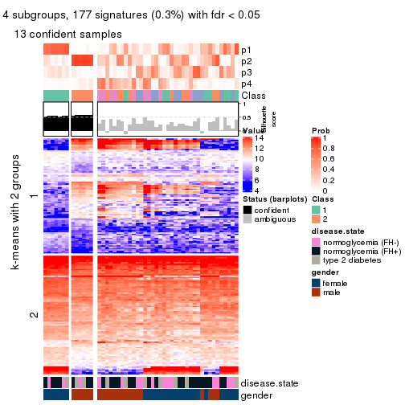</p>

</div>
<div id='tab-CV-NMF-get-signatures-no-scale-4'>
<pre><code class="r">get_signatures(res, k = 5, scale_rows = FALSE)
</code></pre>

<p></p>

</div>
<div id='tab-CV-NMF-get-signatures-no-scale-5'>
<pre><code class="r">get_signatures(res, k = 6, scale_rows = FALSE)
</code></pre>

<p></p>

</div>
</div>


Compare the overlap of signatures from different k:

```r
compare_signatures(res)
```


`get_signature()` returns a data frame invisibly. TO get the list of signatures, the function
call should be assigned to a variable explicitly. In following code, if `plot` argument is set
to `FALSE`, no heatmap is plotted while only the differential analysis is performed.

```r
# code only for demonstration
tb = get_signature(res, k = ..., plot = FALSE)
```

An example of the output of `tb` is:

```
#>   which_row         fdr    mean_1    mean_2 scaled_mean_1 scaled_mean_2 km
#> 1        38 0.042760348  8.373488  9.131774    -0.5533452     0.5164555  1
#> 2        40 0.018707592  7.106213  8.469186    -0.6173731     0.5762149  1
#> 3        55 0.019134737 10.221463 11.207825    -0.6159697     0.5749050  1
#> 4        59 0.006059896  5.921854  7.869574    -0.6899429     0.6439467  1
#> 5        60 0.018055526  8.928898 10.211722    -0.6204761     0.5791110  1
#> 6        98 0.009384629 15.714769 14.887706     0.6635654    -0.6193277  2
...
```

The columns in `tb` are:

1. `which_row`: row indices corresponding to the input matrix.
2. `fdr`: FDR for the differential test. 
3. `mean_x`: The mean value in group x.
4. `scaled_mean_x`: The mean value in group x after rows are scaled.
5. `km`: Row groups if k-means clustering is applied to rows.


UMAP plot which shows how samples are separated.


<script>
$( function() {
	$( '#tabs-CV-NMF-dimension-reduction' ).tabs();
} );
</script>
<div id='tabs-CV-NMF-dimension-reduction'>
<ul>
<li><a href='#tab-CV-NMF-dimension-reduction-1'>k = 2</a></li>
<li><a href='#tab-CV-NMF-dimension-reduction-2'>k = 3</a></li>
<li><a href='#tab-CV-NMF-dimension-reduction-3'>k = 4</a></li>
<li><a href='#tab-CV-NMF-dimension-reduction-4'>k = 5</a></li>
<li><a href='#tab-CV-NMF-dimension-reduction-5'>k = 6</a></li>
</ul>
<div id='tab-CV-NMF-dimension-reduction-1'>
<pre><code class="r">dimension_reduction(res, k = 2, method = &quot;UMAP&quot;)
</code></pre>

<p></p>

</div>
<div id='tab-CV-NMF-dimension-reduction-2'>
<pre><code class="r">dimension_reduction(res, k = 3, method = &quot;UMAP&quot;)
</code></pre>

<p></p>

</div>
<div id='tab-CV-NMF-dimension-reduction-3'>
<pre><code class="r">dimension_reduction(res, k = 4, method = &quot;UMAP&quot;)
</code></pre>

<p></p>

</div>
<div id='tab-CV-NMF-dimension-reduction-4'>
<pre><code class="r">dimension_reduction(res, k = 5, method = &quot;UMAP&quot;)
</code></pre>

<p></p>

</div>
<div id='tab-CV-NMF-dimension-reduction-5'>
<pre><code class="r">dimension_reduction(res, k = 6, method = &quot;UMAP&quot;)
</code></pre>

<p></p>

</div>
</div>


Following heatmap shows how subgroups are split when increasing `k`:

```r
collect_classes(res)
```


Test correlation between subgroups and known annotations. If the known
annotation is numeric, one-way ANOVA test is applied, and if the known
annotation is discrete, chi-squared contingency table test is applied.

```r
test_to_known_factors(res)
```

```
#>         n disease.state(p) gender(p) k
#> CV:NMF 44            0.407   0.00258 2
#> CV:NMF 11               NA        NA 3
#> CV:NMF 13            0.692   0.00231 4
#> CV:NMF  7               NA        NA 5
#> CV:NMF  6               NA        NA 6
```


If matrix rows can be associated to genes, consider to use `functional_enrichment(res,
...)` to perform function enrichment for the signature genes. See [this vignette](http://bioconductor.org/packages/devel/bioc/vignettes/cola/inst/doc/functional_enrichment.html) for more detailed explanations.


 

---------------------------------------------------


### MAD:hclust


The object with results only for a single top-value method and a single partition method 
can be extracted as:

```r
res = res_list["MAD", "hclust"]
# you can also extract it by
# res = res_list["MAD:hclust"]
```

A summary of `res` and all the functions that can be applied to it:

```r
res
```

```
#> A 'ConsensusPartition' object with k = 2, 3, 4, 5, 6.
#>   On a matrix with 51941 rows and 50 columns.
#>   Top rows (1000, 2000, 3000, 4000, 5000) are extracted by 'MAD' method.
#>   Subgroups are detected by 'hclust' method.
#>   Performed in total 1250 partitions by row resampling.
#>   Best k for subgroups seems to be 6.
#> 
#> Following methods can be applied to this 'ConsensusPartition' object:
#>  [1] "cola_report"             "collect_classes"         "collect_plots"          
#>  [4] "collect_stats"           "colnames"                "compare_signatures"     
#>  [7] "consensus_heatmap"       "dimension_reduction"     "functional_enrichment"  
#> [10] "get_anno_col"            "get_anno"                "get_classes"            
#> [13] "get_consensus"           "get_matrix"              "get_membership"         
#> [16] "get_param"               "get_signatures"          "get_stats"              
#> [19] "is_best_k"               "is_stable_k"             "membership_heatmap"     
#> [22] "ncol"                    "nrow"                    "plot_ecdf"              
#> [25] "rownames"                "select_partition_number" "show"                   
#> [28] "suggest_best_k"          "test_to_known_factors"
```

`collect_plots()` function collects all the plots made from `res` for all `k` (number of partitions)
into one single page to provide an easy and fast comparison between different `k`.

```r
collect_plots(res)
```


The plots are:

- The first row: a plot of the ECDF (empirical cumulative distribution
  function) curves of the consensus matrix for each `k` and the heatmap of
  predicted classes for each `k`.
- The second row: heatmaps of the consensus matrix for each `k`.
- The third row: heatmaps of the membership matrix for each `k`.
- The fouth row: heatmaps of the signatures for each `k`.

All the plots in panels can be made by individual functions and they are
plotted later in this section.

`select_partition_number()` produces several plots showing different
statistics for choosing "optimized" `k`. There are following statistics:

- ECDF curves of the consensus matrix for each `k`;
- 1-PAC. [The PAC
  score](https://en.wikipedia.org/wiki/Consensus_clustering#Over-interpretation_potential_of_consensus_clustering)
  measures the proportion of the ambiguous subgrouping.
- Mean silhouette score.
- Concordance. The mean probability of fiting the consensus class ids in all
  partitions.
- Area increased. Denote $A_k$ as the area under the ECDF curve for current
  `k`, the area increased is defined as $A_k - A_{k-1}$.
- Rand index. The percent of pairs of samples that are both in a same cluster
  or both are not in a same cluster in the partition of k and k-1.
- Jaccard index. The ratio of pairs of samples are both in a same cluster in
  the partition of k and k-1 and the pairs of samples are both in a same
  cluster in the partition k or k-1.

The detailed explanations of these statistics can be found in [the _cola_
vignette](http://bioconductor.org/packages/devel/bioc/vignettes/cola/inst/doc/cola.html#toc_13).

Generally speaking, lower PAC score, higher mean silhouette score or higher
concordance corresponds to better partition. Rand index and Jaccard index
measure how similar the current partition is compared to partition with `k-1`.
If they are too similar, we won't accept `k` is better than `k-1`.

```r
select_partition_number(res)
```


The numeric values for all these statistics can be obtained by `get_stats()`.

```r
get_stats(res)
```

```
#>   k  1-PAC mean_silhouette concordance area_increased  Rand Jaccard
#> 2 2 0.1730           0.835       0.871         0.2043 0.960   0.960
#> 3 3 0.1147           0.374       0.720         1.0244 0.887   0.883
#> 4 4 0.0971           0.255       0.611         0.2605 0.700   0.651
#> 5 5 0.1693           0.329       0.613         0.1388 0.736   0.562
#> 6 6 0.2174           0.426       0.640         0.0908 0.880   0.696
```

`suggest_best_k()` suggests the best $k$ based on these statistics. The rules are as follows:

- All $k$ with Jaccard index larger than 0.95 are removed because increasing
  $k$ does not provide enough extra information. If all $k$ are removed, it is
  marked as no subgroup is detected.
- For all $k$ with 1-PAC score larger than 0.9, the maximal $k$ is taken as
  the best $k$, and other $k$ are marked as optional $k$.
- If it does not fit the second rule. The $k$ with the maximal vote of the
  highest 1-PAC score, highest mean silhouette, and highest concordance is
  taken as the best $k$.

```r
suggest_best_k(res)
```

```
#> [1] 6
```


Following shows the table of the partitions (You need to click the **show/hide
code output** link to see it). The membership matrix (columns with name `p*`)
is inferred by
[`clue::cl_consensus()`](https://www.rdocumentation.org/link/cl_consensus?package=clue)
function with the `SE` method. Basically the value in the membership matrix
represents the probability to belong to a certain group. The finall class
label for an item is determined with the group with highest probability it
belongs to.

In `get_classes()` function, the entropy is calculated from the membership
matrix and the silhouette score is calculated from the consensus matrix.


<script>
$( function() {
	$( '#tabs-MAD-hclust-get-classes' ).tabs();
} );
</script>
<div id='tabs-MAD-hclust-get-classes'>
<ul>
<li><a href='#tab-MAD-hclust-get-classes-1'>k = 2</a></li>
<li><a href='#tab-MAD-hclust-get-classes-2'>k = 3</a></li>
<li><a href='#tab-MAD-hclust-get-classes-3'>k = 4</a></li>
<li><a href='#tab-MAD-hclust-get-classes-4'>k = 5</a></li>
<li><a href='#tab-MAD-hclust-get-classes-5'>k = 6</a></li>
</ul>

<div id='tab-MAD-hclust-get-classes-1'>
<p><a id='tab-MAD-hclust-get-classes-1-a' style='color:#0366d6' href='#'>show/hide code output</a></p>
<pre><code class="r">cbind(get_classes(res, k = 2), get_membership(res, k = 2))
</code></pre>

<pre><code>#&gt;           class entropy silhouette    p1    p2
#&gt; GSM624962     2   0.518      0.882 0.116 0.884
#&gt; GSM624963     2   0.494      0.882 0.108 0.892
#&gt; GSM624967     2   0.881      0.611 0.300 0.700
#&gt; GSM624968     2   0.839      0.760 0.268 0.732
#&gt; GSM624969     2   0.443      0.878 0.092 0.908
#&gt; GSM624970     2   0.680      0.849 0.180 0.820
#&gt; GSM624961     2   0.260      0.885 0.044 0.956
#&gt; GSM624964     2   0.615      0.869 0.152 0.848
#&gt; GSM624965     2   0.373      0.884 0.072 0.928
#&gt; GSM624966     2   0.402      0.892 0.080 0.920
#&gt; GSM624925     2   0.278      0.886 0.048 0.952
#&gt; GSM624927     2   0.456      0.879 0.096 0.904
#&gt; GSM624929     2   0.327      0.886 0.060 0.940
#&gt; GSM624930     2   0.541      0.875 0.124 0.876
#&gt; GSM624931     2   0.494      0.877 0.108 0.892
#&gt; GSM624935     2   0.634      0.873 0.160 0.840
#&gt; GSM624936     2   0.388      0.890 0.076 0.924
#&gt; GSM624937     1   0.625      0.000 0.844 0.156
#&gt; GSM624926     2   0.855      0.748 0.280 0.720
#&gt; GSM624928     2   0.343      0.884 0.064 0.936
#&gt; GSM624932     2   0.443      0.886 0.092 0.908
#&gt; GSM624933     2   0.584      0.874 0.140 0.860
#&gt; GSM624934     2   0.358      0.892 0.068 0.932
#&gt; GSM624971     2   0.605      0.862 0.148 0.852
#&gt; GSM624973     2   0.605      0.867 0.148 0.852
#&gt; GSM624938     2   0.605      0.859 0.148 0.852
#&gt; GSM624940     2   0.552      0.866 0.128 0.872
#&gt; GSM624941     2   0.430      0.878 0.088 0.912
#&gt; GSM624942     2   0.443      0.878 0.092 0.908
#&gt; GSM624943     2   0.469      0.879 0.100 0.900
#&gt; GSM624945     2   0.373      0.886 0.072 0.928
#&gt; GSM624946     2   0.605      0.859 0.148 0.852
#&gt; GSM624949     2   0.605      0.879 0.148 0.852
#&gt; GSM624951     2   0.552      0.871 0.128 0.872
#&gt; GSM624952     2   0.358      0.885 0.068 0.932
#&gt; GSM624955     2   0.802      0.789 0.244 0.756
#&gt; GSM624956     2   0.343      0.885 0.064 0.936
#&gt; GSM624957     2   0.563      0.879 0.132 0.868
#&gt; GSM624974     2   0.373      0.890 0.072 0.928
#&gt; GSM624939     2   0.373      0.890 0.072 0.928
#&gt; GSM624944     2   0.886      0.688 0.304 0.696
#&gt; GSM624947     2   0.730      0.819 0.204 0.796
#&gt; GSM624948     2   0.358      0.885 0.068 0.932
#&gt; GSM624950     2   0.866      0.743 0.288 0.712
#&gt; GSM624953     2   0.260      0.885 0.044 0.956
#&gt; GSM624954     2   0.430      0.883 0.088 0.912
#&gt; GSM624958     2   0.469      0.881 0.100 0.900
#&gt; GSM624959     2   0.311      0.885 0.056 0.944
#&gt; GSM624960     2   0.946      0.570 0.364 0.636
#&gt; GSM624972     2   0.278      0.885 0.048 0.952
</code></pre>

<script>
$('#tab-MAD-hclust-get-classes-1-a').parent().next().next().hide();
$('#tab-MAD-hclust-get-classes-1-a').click(function(){
  $('#tab-MAD-hclust-get-classes-1-a').parent().next().next().toggle();
  return(false);
});
</script>
</div>

<div id='tab-MAD-hclust-get-classes-2'>
<p><a id='tab-MAD-hclust-get-classes-2-a' style='color:#0366d6' href='#'>show/hide code output</a></p>
<pre><code class="r">cbind(get_classes(res, k = 3), get_membership(res, k = 3))
</code></pre>

<pre><code>#&gt;           class entropy silhouette    p1    p2    p3
#&gt; GSM624962     2  0.6437      0.442 0.220 0.732 0.048
#&gt; GSM624963     2  0.6337      0.450 0.220 0.736 0.044
#&gt; GSM624967     2  0.9641     -0.503 0.356 0.432 0.212
#&gt; GSM624968     1  0.8310      0.628 0.500 0.420 0.080
#&gt; GSM624969     2  0.6205      0.512 0.336 0.656 0.008
#&gt; GSM624970     2  0.7806      0.431 0.352 0.584 0.064
#&gt; GSM624961     2  0.1031      0.554 0.024 0.976 0.000
#&gt; GSM624964     2  0.6794      0.369 0.324 0.648 0.028
#&gt; GSM624965     2  0.2796      0.536 0.092 0.908 0.000
#&gt; GSM624966     2  0.4808      0.566 0.188 0.804 0.008
#&gt; GSM624925     2  0.0892      0.557 0.020 0.980 0.000
#&gt; GSM624927     2  0.6427      0.509 0.348 0.640 0.012
#&gt; GSM624929     2  0.2902      0.559 0.064 0.920 0.016
#&gt; GSM624930     2  0.7050      0.485 0.372 0.600 0.028
#&gt; GSM624931     2  0.6490      0.499 0.360 0.628 0.012
#&gt; GSM624935     2  0.7013      0.372 0.324 0.640 0.036
#&gt; GSM624936     2  0.3375      0.578 0.100 0.892 0.008
#&gt; GSM624937     3  0.4475      0.000 0.072 0.064 0.864
#&gt; GSM624926     2  0.8426     -0.411 0.384 0.524 0.092
#&gt; GSM624928     2  0.2116      0.543 0.040 0.948 0.012
#&gt; GSM624932     2  0.6633      0.443 0.260 0.700 0.040
#&gt; GSM624933     2  0.6264      0.428 0.256 0.716 0.028
#&gt; GSM624934     2  0.5461      0.573 0.244 0.748 0.008
#&gt; GSM624971     2  0.7240      0.175 0.432 0.540 0.028
#&gt; GSM624973     2  0.7366      0.286 0.400 0.564 0.036
#&gt; GSM624938     2  0.7319      0.182 0.420 0.548 0.032
#&gt; GSM624940     2  0.7581      0.280 0.408 0.548 0.044
#&gt; GSM624941     2  0.6155      0.516 0.328 0.664 0.008
#&gt; GSM624942     2  0.6307      0.517 0.328 0.660 0.012
#&gt; GSM624943     2  0.6307      0.523 0.328 0.660 0.012
#&gt; GSM624945     2  0.2339      0.560 0.048 0.940 0.012
#&gt; GSM624946     2  0.7319      0.182 0.420 0.548 0.032
#&gt; GSM624949     2  0.7057      0.383 0.264 0.680 0.056
#&gt; GSM624951     2  0.7001      0.467 0.388 0.588 0.024
#&gt; GSM624952     2  0.2663      0.560 0.044 0.932 0.024
#&gt; GSM624955     1  0.8496      0.478 0.564 0.324 0.112
#&gt; GSM624956     2  0.2297      0.557 0.036 0.944 0.020
#&gt; GSM624957     2  0.6769      0.510 0.320 0.652 0.028
#&gt; GSM624974     2  0.5763      0.554 0.276 0.716 0.008
#&gt; GSM624939     2  0.5728      0.554 0.272 0.720 0.008
#&gt; GSM624944     2  0.8963     -0.417 0.404 0.468 0.128
#&gt; GSM624947     2  0.8045     -0.480 0.432 0.504 0.064
#&gt; GSM624948     2  0.2584      0.543 0.064 0.928 0.008
#&gt; GSM624950     1  0.8628      0.436 0.472 0.428 0.100
#&gt; GSM624953     2  0.0747      0.557 0.016 0.984 0.000
#&gt; GSM624954     2  0.6200      0.525 0.312 0.676 0.012
#&gt; GSM624958     2  0.3966      0.520 0.100 0.876 0.024
#&gt; GSM624959     2  0.1751      0.548 0.028 0.960 0.012
#&gt; GSM624960     2  0.9439     -0.495 0.376 0.444 0.180
#&gt; GSM624972     2  0.0892      0.556 0.020 0.980 0.000
</code></pre>

<script>
$('#tab-MAD-hclust-get-classes-2-a').parent().next().next().hide();
$('#tab-MAD-hclust-get-classes-2-a').click(function(){
  $('#tab-MAD-hclust-get-classes-2-a').parent().next().next().toggle();
  return(false);
});
</script>
</div>

<div id='tab-MAD-hclust-get-classes-3'>
<p><a id='tab-MAD-hclust-get-classes-3-a' style='color:#0366d6' href='#'>show/hide code output</a></p>
<pre><code class="r">cbind(get_classes(res, k = 4), get_membership(res, k = 4))
</code></pre>

<pre><code>#&gt;           class entropy silhouette    p1    p2    p3    p4
#&gt; GSM624962     2  0.7095    0.15375 0.024 0.632 0.188 0.156
#&gt; GSM624963     2  0.7027    0.19519 0.024 0.640 0.160 0.176
#&gt; GSM624967     2  0.9509   -0.25838 0.136 0.388 0.208 0.268
#&gt; GSM624968     4  0.8432    0.13168 0.024 0.264 0.304 0.408
#&gt; GSM624969     2  0.4967    0.18623 0.000 0.548 0.000 0.452
#&gt; GSM624970     4  0.7500   -0.00781 0.028 0.408 0.092 0.472
#&gt; GSM624961     2  0.1114    0.50304 0.008 0.972 0.016 0.004
#&gt; GSM624964     2  0.6130    0.14444 0.004 0.584 0.048 0.364
#&gt; GSM624965     2  0.3245    0.47697 0.008 0.884 0.028 0.080
#&gt; GSM624966     2  0.5534    0.38828 0.004 0.724 0.072 0.200
#&gt; GSM624925     2  0.1297    0.50227 0.000 0.964 0.020 0.016
#&gt; GSM624927     2  0.5161    0.14523 0.000 0.520 0.004 0.476
#&gt; GSM624929     2  0.3103    0.49801 0.016 0.892 0.016 0.076
#&gt; GSM624930     4  0.6305   -0.16174 0.008 0.472 0.040 0.480
#&gt; GSM624931     2  0.5565    0.13989 0.004 0.520 0.012 0.464
#&gt; GSM624935     2  0.6556    0.12334 0.016 0.548 0.048 0.388
#&gt; GSM624936     2  0.3624    0.49666 0.016 0.860 0.016 0.108
#&gt; GSM624937     1  0.2032    0.00000 0.936 0.036 0.000 0.028
#&gt; GSM624926     2  0.8022   -0.41361 0.036 0.420 0.128 0.416
#&gt; GSM624928     2  0.1843    0.49534 0.008 0.948 0.016 0.028
#&gt; GSM624932     2  0.7302    0.02101 0.020 0.600 0.216 0.164
#&gt; GSM624933     2  0.5683    0.24303 0.012 0.648 0.024 0.316
#&gt; GSM624934     2  0.5536    0.37492 0.008 0.680 0.032 0.280
#&gt; GSM624971     3  0.7427    0.64985 0.004 0.328 0.504 0.164
#&gt; GSM624973     2  0.7906   -0.35059 0.004 0.392 0.372 0.232
#&gt; GSM624938     3  0.7122    0.67663 0.000 0.340 0.516 0.144
#&gt; GSM624940     2  0.8377   -0.44376 0.016 0.344 0.340 0.300
#&gt; GSM624941     2  0.4948    0.20655 0.000 0.560 0.000 0.440
#&gt; GSM624942     2  0.5119    0.20803 0.004 0.556 0.000 0.440
#&gt; GSM624943     2  0.5276    0.22304 0.004 0.560 0.004 0.432
#&gt; GSM624945     2  0.2473    0.50194 0.016 0.924 0.016 0.044
#&gt; GSM624946     3  0.7122    0.67663 0.000 0.340 0.516 0.144
#&gt; GSM624949     2  0.6815    0.22289 0.024 0.624 0.084 0.268
#&gt; GSM624951     4  0.6628   -0.12837 0.008 0.456 0.060 0.476
#&gt; GSM624952     2  0.3122    0.49596 0.024 0.900 0.036 0.040
#&gt; GSM624955     3  0.8017   -0.15063 0.036 0.180 0.532 0.252
#&gt; GSM624956     2  0.2920    0.49501 0.020 0.908 0.040 0.032
#&gt; GSM624957     2  0.5974    0.18111 0.012 0.536 0.020 0.432
#&gt; GSM624974     2  0.6027    0.29440 0.008 0.624 0.044 0.324
#&gt; GSM624939     2  0.6008    0.29628 0.008 0.628 0.044 0.320
#&gt; GSM624944     4  0.8219    0.43123 0.060 0.332 0.120 0.488
#&gt; GSM624947     4  0.7816    0.38054 0.012 0.352 0.176 0.460
#&gt; GSM624948     2  0.2797    0.48826 0.012 0.908 0.020 0.060
#&gt; GSM624950     4  0.8152    0.43908 0.048 0.300 0.144 0.508
#&gt; GSM624953     2  0.0927    0.50297 0.000 0.976 0.016 0.008
#&gt; GSM624954     2  0.5355    0.23602 0.008 0.580 0.004 0.408
#&gt; GSM624958     2  0.3841    0.44256 0.016 0.852 0.024 0.108
#&gt; GSM624959     2  0.1174    0.50023 0.000 0.968 0.012 0.020
#&gt; GSM624960     4  0.8852    0.38886 0.088 0.300 0.160 0.452
#&gt; GSM624972     2  0.1174    0.50093 0.000 0.968 0.020 0.012
</code></pre>

<script>
$('#tab-MAD-hclust-get-classes-3-a').parent().next().next().hide();
$('#tab-MAD-hclust-get-classes-3-a').click(function(){
  $('#tab-MAD-hclust-get-classes-3-a').parent().next().next().toggle();
  return(false);
});
</script>
</div>

<div id='tab-MAD-hclust-get-classes-4'>
<p><a id='tab-MAD-hclust-get-classes-4-a' style='color:#0366d6' href='#'>show/hide code output</a></p>
<pre><code class="r">cbind(get_classes(res, k = 5), get_membership(res, k = 5))
</code></pre>

<pre><code>#&gt;           class entropy silhouette    p1    p2    p3    p4    p5
#&gt; GSM624962     2  0.6672     0.1468 0.104 0.584 0.264 0.036 0.012
#&gt; GSM624963     2  0.6686     0.2072 0.132 0.596 0.228 0.032 0.012
#&gt; GSM624967     2  0.9311    -0.2817 0.248 0.360 0.136 0.168 0.088
#&gt; GSM624968     4  0.7012     0.4838 0.128 0.176 0.080 0.604 0.012
#&gt; GSM624969     1  0.4268     0.6817 0.556 0.444 0.000 0.000 0.000
#&gt; GSM624970     1  0.6339     0.4009 0.604 0.276 0.064 0.048 0.008
#&gt; GSM624961     2  0.1173     0.5568 0.004 0.964 0.020 0.012 0.000
#&gt; GSM624964     2  0.6320    -0.2223 0.316 0.540 0.012 0.132 0.000
#&gt; GSM624965     2  0.3197     0.5336 0.080 0.868 0.024 0.028 0.000
#&gt; GSM624966     2  0.5734     0.3292 0.164 0.688 0.108 0.040 0.000
#&gt; GSM624925     2  0.1243     0.5561 0.008 0.960 0.028 0.004 0.000
#&gt; GSM624927     1  0.4597     0.6839 0.564 0.424 0.012 0.000 0.000
#&gt; GSM624929     2  0.3195     0.5251 0.072 0.876 0.024 0.016 0.012
#&gt; GSM624930     1  0.5616     0.6338 0.564 0.368 0.060 0.004 0.004
#&gt; GSM624931     1  0.5068     0.6807 0.564 0.408 0.016 0.008 0.004
#&gt; GSM624935     2  0.6611    -0.2978 0.372 0.504 0.020 0.092 0.012
#&gt; GSM624936     2  0.3818     0.4685 0.128 0.824 0.028 0.012 0.008
#&gt; GSM624937     5  0.0693     0.0000 0.012 0.008 0.000 0.000 0.980
#&gt; GSM624926     2  0.7902    -0.4500 0.260 0.368 0.060 0.308 0.004
#&gt; GSM624928     2  0.1623     0.5558 0.016 0.948 0.016 0.020 0.000
#&gt; GSM624932     2  0.6333    -0.0788 0.112 0.544 0.328 0.008 0.008
#&gt; GSM624933     2  0.5753     0.0113 0.288 0.612 0.012 0.088 0.000
#&gt; GSM624934     2  0.5349     0.0762 0.300 0.636 0.048 0.016 0.000
#&gt; GSM624971     3  0.4811     0.7251 0.052 0.216 0.720 0.012 0.000
#&gt; GSM624973     3  0.7195     0.4555 0.152 0.300 0.492 0.056 0.000
#&gt; GSM624938     3  0.4608     0.7328 0.048 0.212 0.732 0.008 0.000
#&gt; GSM624940     3  0.7094     0.4352 0.376 0.156 0.436 0.028 0.004
#&gt; GSM624941     1  0.4287     0.6697 0.540 0.460 0.000 0.000 0.000
#&gt; GSM624942     1  0.4580     0.6646 0.532 0.460 0.004 0.004 0.000
#&gt; GSM624943     1  0.4702     0.6314 0.512 0.476 0.008 0.004 0.000
#&gt; GSM624945     2  0.2648     0.5314 0.052 0.904 0.024 0.012 0.008
#&gt; GSM624946     3  0.4608     0.7328 0.048 0.212 0.732 0.008 0.000
#&gt; GSM624949     2  0.7051     0.0126 0.252 0.568 0.068 0.100 0.012
#&gt; GSM624951     1  0.5701     0.5876 0.580 0.328 0.088 0.000 0.004
#&gt; GSM624952     2  0.3361     0.5270 0.040 0.872 0.056 0.020 0.012
#&gt; GSM624955     4  0.6739    -0.1459 0.092 0.068 0.200 0.624 0.016
#&gt; GSM624956     2  0.3006     0.5348 0.028 0.888 0.056 0.020 0.008
#&gt; GSM624957     1  0.5889     0.5241 0.496 0.440 0.028 0.028 0.008
#&gt; GSM624974     2  0.5877    -0.1937 0.352 0.568 0.044 0.036 0.000
#&gt; GSM624939     2  0.5877    -0.1978 0.352 0.568 0.044 0.036 0.000
#&gt; GSM624944     1  0.8533    -0.4685 0.340 0.296 0.076 0.260 0.028
#&gt; GSM624947     4  0.7054     0.4703 0.196 0.280 0.024 0.496 0.004
#&gt; GSM624948     2  0.2605     0.5443 0.060 0.900 0.016 0.024 0.000
#&gt; GSM624950     4  0.7728     0.4570 0.284 0.244 0.028 0.424 0.020
#&gt; GSM624953     2  0.0865     0.5555 0.004 0.972 0.024 0.000 0.000
#&gt; GSM624954     2  0.4800    -0.5943 0.476 0.508 0.004 0.012 0.000
#&gt; GSM624958     2  0.3507     0.4921 0.088 0.844 0.008 0.060 0.000
#&gt; GSM624959     2  0.1059     0.5551 0.020 0.968 0.008 0.004 0.000
#&gt; GSM624960     4  0.8910     0.4473 0.292 0.244 0.092 0.324 0.048
#&gt; GSM624972     2  0.1116     0.5557 0.004 0.964 0.028 0.004 0.000
</code></pre>

<script>
$('#tab-MAD-hclust-get-classes-4-a').parent().next().next().hide();
$('#tab-MAD-hclust-get-classes-4-a').click(function(){
  $('#tab-MAD-hclust-get-classes-4-a').parent().next().next().toggle();
  return(false);
});
</script>
</div>

<div id='tab-MAD-hclust-get-classes-5'>
<p><a id='tab-MAD-hclust-get-classes-5-a' style='color:#0366d6' href='#'>show/hide code output</a></p>
<pre><code class="r">cbind(get_classes(res, k = 6), get_membership(res, k = 6))
</code></pre>

<pre><code>#&gt;           class entropy silhouette    p1    p2    p3    p4    p5    p6
#&gt; GSM624962     2  0.6806     0.2556 0.116 0.556 0.236 0.052 0.032 0.008
#&gt; GSM624963     2  0.6706     0.2983 0.144 0.564 0.212 0.052 0.020 0.008
#&gt; GSM624967     4  0.8743    -0.0204 0.224 0.236 0.060 0.336 0.112 0.032
#&gt; GSM624968     5  0.7523    -0.1513 0.084 0.144 0.036 0.288 0.444 0.004
#&gt; GSM624969     1  0.3742     0.7844 0.648 0.348 0.004 0.000 0.000 0.000
#&gt; GSM624970     1  0.6382     0.3286 0.620 0.192 0.080 0.072 0.028 0.008
#&gt; GSM624961     2  0.0837     0.6400 0.000 0.972 0.020 0.004 0.004 0.000
#&gt; GSM624964     2  0.6422    -0.4012 0.384 0.456 0.008 0.096 0.056 0.000
#&gt; GSM624965     2  0.3403     0.6021 0.096 0.840 0.032 0.024 0.008 0.000
#&gt; GSM624966     2  0.5948     0.3418 0.192 0.628 0.124 0.036 0.020 0.000
#&gt; GSM624925     2  0.1509     0.6398 0.008 0.948 0.024 0.012 0.008 0.000
#&gt; GSM624927     1  0.4410     0.7798 0.640 0.328 0.020 0.004 0.008 0.000
#&gt; GSM624929     2  0.3292     0.6091 0.072 0.860 0.024 0.024 0.012 0.008
#&gt; GSM624930     1  0.5406     0.7098 0.612 0.288 0.076 0.008 0.012 0.004
#&gt; GSM624931     1  0.4380     0.7752 0.652 0.312 0.024 0.000 0.012 0.000
#&gt; GSM624935     1  0.6473     0.4341 0.444 0.416 0.016 0.064 0.052 0.008
#&gt; GSM624936     2  0.3939     0.5373 0.148 0.792 0.032 0.012 0.012 0.004
#&gt; GSM624937     6  0.0260     0.0000 0.008 0.000 0.000 0.000 0.000 0.992
#&gt; GSM624926     4  0.7253     0.4703 0.148 0.336 0.032 0.420 0.064 0.000
#&gt; GSM624928     2  0.1476     0.6389 0.012 0.948 0.008 0.028 0.004 0.000
#&gt; GSM624932     2  0.6410     0.0402 0.144 0.512 0.304 0.024 0.012 0.004
#&gt; GSM624933     2  0.6060    -0.1117 0.316 0.552 0.020 0.076 0.036 0.000
#&gt; GSM624934     2  0.5157     0.0208 0.356 0.568 0.060 0.016 0.000 0.000
#&gt; GSM624971     3  0.3116     0.6788 0.016 0.132 0.836 0.012 0.004 0.000
#&gt; GSM624973     3  0.6405     0.3859 0.148 0.224 0.564 0.052 0.012 0.000
#&gt; GSM624938     3  0.2703     0.6847 0.016 0.116 0.860 0.000 0.008 0.000
#&gt; GSM624940     3  0.6304     0.3440 0.360 0.072 0.508 0.028 0.024 0.008
#&gt; GSM624941     1  0.3620     0.7803 0.648 0.352 0.000 0.000 0.000 0.000
#&gt; GSM624942     1  0.3892     0.7774 0.640 0.352 0.004 0.004 0.000 0.000
#&gt; GSM624943     1  0.4065     0.7608 0.624 0.364 0.004 0.004 0.004 0.000
#&gt; GSM624945     2  0.2595     0.6206 0.040 0.900 0.028 0.016 0.012 0.004
#&gt; GSM624946     3  0.2703     0.6847 0.016 0.116 0.860 0.000 0.008 0.000
#&gt; GSM624949     2  0.7085    -0.0403 0.280 0.512 0.072 0.068 0.064 0.004
#&gt; GSM624951     1  0.5279     0.6406 0.636 0.240 0.108 0.000 0.012 0.004
#&gt; GSM624952     2  0.3267     0.6128 0.028 0.864 0.064 0.020 0.016 0.008
#&gt; GSM624955     5  0.1937     0.0484 0.012 0.012 0.048 0.004 0.924 0.000
#&gt; GSM624956     2  0.2933     0.6200 0.016 0.880 0.064 0.016 0.016 0.008
#&gt; GSM624957     1  0.5915     0.6468 0.544 0.352 0.040 0.032 0.028 0.004
#&gt; GSM624974     2  0.5794    -0.2932 0.396 0.500 0.064 0.032 0.008 0.000
#&gt; GSM624939     2  0.5794    -0.2941 0.396 0.500 0.064 0.032 0.008 0.000
#&gt; GSM624944     4  0.6736     0.5116 0.220 0.252 0.028 0.484 0.012 0.004
#&gt; GSM624947     4  0.8117     0.2962 0.196 0.220 0.024 0.292 0.268 0.000
#&gt; GSM624948     2  0.2600     0.6224 0.060 0.892 0.020 0.020 0.008 0.000
#&gt; GSM624950     4  0.7849     0.4603 0.220 0.216 0.016 0.404 0.136 0.008
#&gt; GSM624953     2  0.1036     0.6387 0.004 0.964 0.024 0.008 0.000 0.000
#&gt; GSM624954     1  0.4351     0.6961 0.564 0.416 0.008 0.012 0.000 0.000
#&gt; GSM624958     2  0.3717     0.5664 0.076 0.820 0.024 0.076 0.004 0.000
#&gt; GSM624959     2  0.1251     0.6385 0.012 0.956 0.008 0.024 0.000 0.000
#&gt; GSM624960     4  0.6017     0.3695 0.136 0.192 0.024 0.624 0.012 0.012
#&gt; GSM624972     2  0.1363     0.6389 0.004 0.952 0.028 0.012 0.004 0.000
</code></pre>

<script>
$('#tab-MAD-hclust-get-classes-5-a').parent().next().next().hide();
$('#tab-MAD-hclust-get-classes-5-a').click(function(){
  $('#tab-MAD-hclust-get-classes-5-a').parent().next().next().toggle();
  return(false);
});
</script>
</div>
</div>

Heatmaps for the consensus matrix. It visualizes the probability of two
samples to be in a same group.


<script>
$( function() {
	$( '#tabs-MAD-hclust-consensus-heatmap' ).tabs();
} );
</script>
<div id='tabs-MAD-hclust-consensus-heatmap'>
<ul>
<li><a href='#tab-MAD-hclust-consensus-heatmap-1'>k = 2</a></li>
<li><a href='#tab-MAD-hclust-consensus-heatmap-2'>k = 3</a></li>
<li><a href='#tab-MAD-hclust-consensus-heatmap-3'>k = 4</a></li>
<li><a href='#tab-MAD-hclust-consensus-heatmap-4'>k = 5</a></li>
<li><a href='#tab-MAD-hclust-consensus-heatmap-5'>k = 6</a></li>
</ul>
<div id='tab-MAD-hclust-consensus-heatmap-1'>
<pre><code class="r">consensus_heatmap(res, k = 2)
</code></pre>

<p></p>

</div>
<div id='tab-MAD-hclust-consensus-heatmap-2'>
<pre><code class="r">consensus_heatmap(res, k = 3)
</code></pre>

<p></p>

</div>
<div id='tab-MAD-hclust-consensus-heatmap-3'>
<pre><code class="r">consensus_heatmap(res, k = 4)
</code></pre>

<p></p>

</div>
<div id='tab-MAD-hclust-consensus-heatmap-4'>
<pre><code class="r">consensus_heatmap(res, k = 5)
</code></pre>

<p>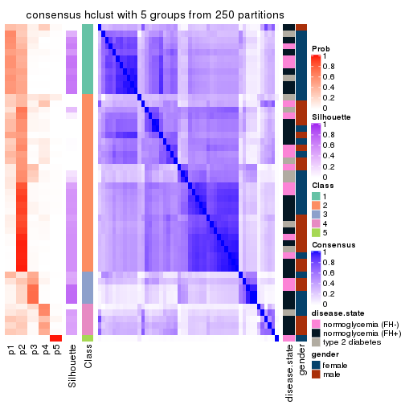</p>

</div>
<div id='tab-MAD-hclust-consensus-heatmap-5'>
<pre><code class="r">consensus_heatmap(res, k = 6)
</code></pre>

<p></p>

</div>
</div>

Heatmaps for the membership of samples in all partitions to see how consistent they are:


<script>
$( function() {
	$( '#tabs-MAD-hclust-membership-heatmap' ).tabs();
} );
</script>
<div id='tabs-MAD-hclust-membership-heatmap'>
<ul>
<li><a href='#tab-MAD-hclust-membership-heatmap-1'>k = 2</a></li>
<li><a href='#tab-MAD-hclust-membership-heatmap-2'>k = 3</a></li>
<li><a href='#tab-MAD-hclust-membership-heatmap-3'>k = 4</a></li>
<li><a href='#tab-MAD-hclust-membership-heatmap-4'>k = 5</a></li>
<li><a href='#tab-MAD-hclust-membership-heatmap-5'>k = 6</a></li>
</ul>
<div id='tab-MAD-hclust-membership-heatmap-1'>
<pre><code class="r">membership_heatmap(res, k = 2)
</code></pre>

<p></p>

</div>
<div id='tab-MAD-hclust-membership-heatmap-2'>
<pre><code class="r">membership_heatmap(res, k = 3)
</code></pre>

<p></p>

</div>
<div id='tab-MAD-hclust-membership-heatmap-3'>
<pre><code class="r">membership_heatmap(res, k = 4)
</code></pre>

<p></p>

</div>
<div id='tab-MAD-hclust-membership-heatmap-4'>
<pre><code class="r">membership_heatmap(res, k = 5)
</code></pre>

<p></p>

</div>
<div id='tab-MAD-hclust-membership-heatmap-5'>
<pre><code class="r">membership_heatmap(res, k = 6)
</code></pre>

<p></p>

</div>
</div>

As soon as we have had the classes for columns, we can look for signatures
which are significantly different between classes which can be candidate marks
for certain classes. Following are the heatmaps for signatures.


Signature heatmaps where rows are scaled:


<script>
$( function() {
	$( '#tabs-MAD-hclust-get-signatures' ).tabs();
} );
</script>
<div id='tabs-MAD-hclust-get-signatures'>
<ul>
<li><a href='#tab-MAD-hclust-get-signatures-1'>k = 2</a></li>
<li><a href='#tab-MAD-hclust-get-signatures-2'>k = 3</a></li>
<li><a href='#tab-MAD-hclust-get-signatures-3'>k = 4</a></li>
<li><a href='#tab-MAD-hclust-get-signatures-4'>k = 5</a></li>
<li><a href='#tab-MAD-hclust-get-signatures-5'>k = 6</a></li>
</ul>
<div id='tab-MAD-hclust-get-signatures-1'>
<pre><code class="r">get_signatures(res, k = 2)
</code></pre>

<p></p>

</div>
<div id='tab-MAD-hclust-get-signatures-2'>
<pre><code class="r">get_signatures(res, k = 3)
</code></pre>

<p></p>

</div>
<div id='tab-MAD-hclust-get-signatures-3'>
<pre><code class="r">get_signatures(res, k = 4)
</code></pre>

<p></p>

</div>
<div id='tab-MAD-hclust-get-signatures-4'>
<pre><code class="r">get_signatures(res, k = 5)
</code></pre>

<p></p>

</div>
<div id='tab-MAD-hclust-get-signatures-5'>
<pre><code class="r">get_signatures(res, k = 6)
</code></pre>

<p></p>

</div>
</div>


Signature heatmaps where rows are not scaled:


<script>
$( function() {
	$( '#tabs-MAD-hclust-get-signatures-no-scale' ).tabs();
} );
</script>
<div id='tabs-MAD-hclust-get-signatures-no-scale'>
<ul>
<li><a href='#tab-MAD-hclust-get-signatures-no-scale-1'>k = 2</a></li>
<li><a href='#tab-MAD-hclust-get-signatures-no-scale-2'>k = 3</a></li>
<li><a href='#tab-MAD-hclust-get-signatures-no-scale-3'>k = 4</a></li>
<li><a href='#tab-MAD-hclust-get-signatures-no-scale-4'>k = 5</a></li>
<li><a href='#tab-MAD-hclust-get-signatures-no-scale-5'>k = 6</a></li>
</ul>
<div id='tab-MAD-hclust-get-signatures-no-scale-1'>
<pre><code class="r">get_signatures(res, k = 2, scale_rows = FALSE)
</code></pre>

<p></p>

</div>
<div id='tab-MAD-hclust-get-signatures-no-scale-2'>
<pre><code class="r">get_signatures(res, k = 3, scale_rows = FALSE)
</code></pre>

<p></p>

</div>
<div id='tab-MAD-hclust-get-signatures-no-scale-3'>
<pre><code class="r">get_signatures(res, k = 4, scale_rows = FALSE)
</code></pre>

<p></p>

</div>
<div id='tab-MAD-hclust-get-signatures-no-scale-4'>
<pre><code class="r">get_signatures(res, k = 5, scale_rows = FALSE)
</code></pre>

<p></p>

</div>
<div id='tab-MAD-hclust-get-signatures-no-scale-5'>
<pre><code class="r">get_signatures(res, k = 6, scale_rows = FALSE)
</code></pre>

<p></p>

</div>
</div>


Compare the overlap of signatures from different k:

```r
compare_signatures(res)
```


`get_signature()` returns a data frame invisibly. TO get the list of signatures, the function
call should be assigned to a variable explicitly. In following code, if `plot` argument is set
to `FALSE`, no heatmap is plotted while only the differential analysis is performed.

```r
# code only for demonstration
tb = get_signature(res, k = ..., plot = FALSE)
```

An example of the output of `tb` is:

```
#>   which_row         fdr    mean_1    mean_2 scaled_mean_1 scaled_mean_2 km
#> 1        38 0.042760348  8.373488  9.131774    -0.5533452     0.5164555  1
#> 2        40 0.018707592  7.106213  8.469186    -0.6173731     0.5762149  1
#> 3        55 0.019134737 10.221463 11.207825    -0.6159697     0.5749050  1
#> 4        59 0.006059896  5.921854  7.869574    -0.6899429     0.6439467  1
#> 5        60 0.018055526  8.928898 10.211722    -0.6204761     0.5791110  1
#> 6        98 0.009384629 15.714769 14.887706     0.6635654    -0.6193277  2
...
```

The columns in `tb` are:

1. `which_row`: row indices corresponding to the input matrix.
2. `fdr`: FDR for the differential test. 
3. `mean_x`: The mean value in group x.
4. `scaled_mean_x`: The mean value in group x after rows are scaled.
5. `km`: Row groups if k-means clustering is applied to rows.


UMAP plot which shows how samples are separated.


<script>
$( function() {
	$( '#tabs-MAD-hclust-dimension-reduction' ).tabs();
} );
</script>
<div id='tabs-MAD-hclust-dimension-reduction'>
<ul>
<li><a href='#tab-MAD-hclust-dimension-reduction-1'>k = 2</a></li>
<li><a href='#tab-MAD-hclust-dimension-reduction-2'>k = 3</a></li>
<li><a href='#tab-MAD-hclust-dimension-reduction-3'>k = 4</a></li>
<li><a href='#tab-MAD-hclust-dimension-reduction-4'>k = 5</a></li>
<li><a href='#tab-MAD-hclust-dimension-reduction-5'>k = 6</a></li>
</ul>
<div id='tab-MAD-hclust-dimension-reduction-1'>
<pre><code class="r">dimension_reduction(res, k = 2, method = &quot;UMAP&quot;)
</code></pre>

<p></p>

</div>
<div id='tab-MAD-hclust-dimension-reduction-2'>
<pre><code class="r">dimension_reduction(res, k = 3, method = &quot;UMAP&quot;)
</code></pre>

<p></p>

</div>
<div id='tab-MAD-hclust-dimension-reduction-3'>
<pre><code class="r">dimension_reduction(res, k = 4, method = &quot;UMAP&quot;)
</code></pre>

<p></p>

</div>
<div id='tab-MAD-hclust-dimension-reduction-4'>
<pre><code class="r">dimension_reduction(res, k = 5, method = &quot;UMAP&quot;)
</code></pre>

<p></p>

</div>
<div id='tab-MAD-hclust-dimension-reduction-5'>
<pre><code class="r">dimension_reduction(res, k = 6, method = &quot;UMAP&quot;)
</code></pre>

<p></p>

</div>
</div>


Following heatmap shows how subgroups are split when increasing `k`:

```r
collect_classes(res)
```


Test correlation between subgroups and known annotations. If the known
annotation is numeric, one-way ANOVA test is applied, and if the known
annotation is discrete, chi-squared contingency table test is applied.

```r
test_to_known_factors(res)
```

```
#>             n disease.state(p) gender(p) k
#> MAD:hclust 49               NA        NA 2
#> MAD:hclust 26            0.113    1.0000 3
#> MAD:hclust  9            0.687    0.8125 4
#> MAD:hclust 24            0.946    0.0195 5
#> MAD:hclust 28            0.976    0.0701 6
```


If matrix rows can be associated to genes, consider to use `functional_enrichment(res,
...)` to perform function enrichment for the signature genes. See [this vignette](http://bioconductor.org/packages/devel/bioc/vignettes/cola/inst/doc/functional_enrichment.html) for more detailed explanations.


 

---------------------------------------------------


### MAD:kmeans


The object with results only for a single top-value method and a single partition method 
can be extracted as:

```r
res = res_list["MAD", "kmeans"]
# you can also extract it by
# res = res_list["MAD:kmeans"]
```

A summary of `res` and all the functions that can be applied to it:

```r
res
```

```
#> A 'ConsensusPartition' object with k = 2, 3, 4, 5, 6.
#>   On a matrix with 51941 rows and 50 columns.
#>   Top rows (1000, 2000, 3000, 4000, 5000) are extracted by 'MAD' method.
#>   Subgroups are detected by 'kmeans' method.
#>   Performed in total 1250 partitions by row resampling.
#>   Best k for subgroups seems to be 2.
#> 
#> Following methods can be applied to this 'ConsensusPartition' object:
#>  [1] "cola_report"             "collect_classes"         "collect_plots"          
#>  [4] "collect_stats"           "colnames"                "compare_signatures"     
#>  [7] "consensus_heatmap"       "dimension_reduction"     "functional_enrichment"  
#> [10] "get_anno_col"            "get_anno"                "get_classes"            
#> [13] "get_consensus"           "get_matrix"              "get_membership"         
#> [16] "get_param"               "get_signatures"          "get_stats"              
#> [19] "is_best_k"               "is_stable_k"             "membership_heatmap"     
#> [22] "ncol"                    "nrow"                    "plot_ecdf"              
#> [25] "rownames"                "select_partition_number" "show"                   
#> [28] "suggest_best_k"          "test_to_known_factors"
```

`collect_plots()` function collects all the plots made from `res` for all `k` (number of partitions)
into one single page to provide an easy and fast comparison between different `k`.

```r
collect_plots(res)
```


The plots are:

- The first row: a plot of the ECDF (empirical cumulative distribution
  function) curves of the consensus matrix for each `k` and the heatmap of
  predicted classes for each `k`.
- The second row: heatmaps of the consensus matrix for each `k`.
- The third row: heatmaps of the membership matrix for each `k`.
- The fouth row: heatmaps of the signatures for each `k`.

All the plots in panels can be made by individual functions and they are
plotted later in this section.

`select_partition_number()` produces several plots showing different
statistics for choosing "optimized" `k`. There are following statistics:

- ECDF curves of the consensus matrix for each `k`;
- 1-PAC. [The PAC
  score](https://en.wikipedia.org/wiki/Consensus_clustering#Over-interpretation_potential_of_consensus_clustering)
  measures the proportion of the ambiguous subgrouping.
- Mean silhouette score.
- Concordance. The mean probability of fiting the consensus class ids in all
  partitions.
- Area increased. Denote $A_k$ as the area under the ECDF curve for current
  `k`, the area increased is defined as $A_k - A_{k-1}$.
- Rand index. The percent of pairs of samples that are both in a same cluster
  or both are not in a same cluster in the partition of k and k-1.
- Jaccard index. The ratio of pairs of samples are both in a same cluster in
  the partition of k and k-1 and the pairs of samples are both in a same
  cluster in the partition k or k-1.

The detailed explanations of these statistics can be found in [the _cola_
vignette](http://bioconductor.org/packages/devel/bioc/vignettes/cola/inst/doc/cola.html#toc_13).

Generally speaking, lower PAC score, higher mean silhouette score or higher
concordance corresponds to better partition. Rand index and Jaccard index
measure how similar the current partition is compared to partition with `k-1`.
If they are too similar, we won't accept `k` is better than `k-1`.

```r
select_partition_number(res)
```


The numeric values for all these statistics can be obtained by `get_stats()`.

```r
get_stats(res)
```

```
#>   k 1-PAC mean_silhouette concordance area_increased  Rand Jaccard
#> 2 2 0.167           0.711       0.819         0.4680 0.490   0.490
#> 3 3 0.338           0.537       0.739         0.3546 0.794   0.606
#> 4 4 0.561           0.684       0.810         0.1142 0.899   0.727
#> 5 5 0.545           0.610       0.782         0.0613 0.953   0.848
#> 6 6 0.611           0.532       0.721         0.0458 0.968   0.885
```

`suggest_best_k()` suggests the best $k$ based on these statistics. The rules are as follows:

- All $k$ with Jaccard index larger than 0.95 are removed because increasing
  $k$ does not provide enough extra information. If all $k$ are removed, it is
  marked as no subgroup is detected.
- For all $k$ with 1-PAC score larger than 0.9, the maximal $k$ is taken as
  the best $k$, and other $k$ are marked as optional $k$.
- If it does not fit the second rule. The $k$ with the maximal vote of the
  highest 1-PAC score, highest mean silhouette, and highest concordance is
  taken as the best $k$.

```r
suggest_best_k(res)
```

```
#> [1] 2
```


Following shows the table of the partitions (You need to click the **show/hide
code output** link to see it). The membership matrix (columns with name `p*`)
is inferred by
[`clue::cl_consensus()`](https://www.rdocumentation.org/link/cl_consensus?package=clue)
function with the `SE` method. Basically the value in the membership matrix
represents the probability to belong to a certain group. The finall class
label for an item is determined with the group with highest probability it
belongs to.

In `get_classes()` function, the entropy is calculated from the membership
matrix and the silhouette score is calculated from the consensus matrix.


<script>
$( function() {
	$( '#tabs-MAD-kmeans-get-classes' ).tabs();
} );
</script>
<div id='tabs-MAD-kmeans-get-classes'>
<ul>
<li><a href='#tab-MAD-kmeans-get-classes-1'>k = 2</a></li>
<li><a href='#tab-MAD-kmeans-get-classes-2'>k = 3</a></li>
<li><a href='#tab-MAD-kmeans-get-classes-3'>k = 4</a></li>
<li><a href='#tab-MAD-kmeans-get-classes-4'>k = 5</a></li>
<li><a href='#tab-MAD-kmeans-get-classes-5'>k = 6</a></li>
</ul>

<div id='tab-MAD-kmeans-get-classes-1'>
<p><a id='tab-MAD-kmeans-get-classes-1-a' style='color:#0366d6' href='#'>show/hide code output</a></p>
<pre><code class="r">cbind(get_classes(res, k = 2), get_membership(res, k = 2))
</code></pre>

<pre><code>#&gt;           class entropy silhouette    p1    p2
#&gt; GSM624962     2  0.3114     0.7473 0.056 0.944
#&gt; GSM624963     2  0.6048     0.8063 0.148 0.852
#&gt; GSM624967     1  0.7056     0.7599 0.808 0.192
#&gt; GSM624968     1  0.8763     0.6348 0.704 0.296
#&gt; GSM624969     1  0.5059     0.8169 0.888 0.112
#&gt; GSM624970     1  0.0376     0.7928 0.996 0.004
#&gt; GSM624961     2  0.5178     0.8159 0.116 0.884
#&gt; GSM624964     1  0.7674     0.7441 0.776 0.224
#&gt; GSM624965     2  0.5842     0.8122 0.140 0.860
#&gt; GSM624966     2  0.2778     0.7794 0.048 0.952
#&gt; GSM624925     2  0.4690     0.8073 0.100 0.900
#&gt; GSM624927     1  0.4815     0.8184 0.896 0.104
#&gt; GSM624929     2  0.6973     0.7973 0.188 0.812
#&gt; GSM624930     1  0.4562     0.8194 0.904 0.096
#&gt; GSM624931     1  0.4690     0.8184 0.900 0.100
#&gt; GSM624935     1  0.7376     0.7643 0.792 0.208
#&gt; GSM624936     2  0.9000     0.6388 0.316 0.684
#&gt; GSM624937     1  0.5629     0.7819 0.868 0.132
#&gt; GSM624926     2  0.7056     0.7744 0.192 0.808
#&gt; GSM624928     2  0.5629     0.8137 0.132 0.868
#&gt; GSM624932     2  0.6247     0.7918 0.156 0.844
#&gt; GSM624933     2  0.8763     0.6177 0.296 0.704
#&gt; GSM624934     2  0.9988     0.1894 0.480 0.520
#&gt; GSM624971     2  0.8207     0.4881 0.256 0.744
#&gt; GSM624973     1  0.9460     0.6437 0.636 0.364
#&gt; GSM624938     2  0.7453     0.6139 0.212 0.788
#&gt; GSM624940     1  0.6712     0.7361 0.824 0.176
#&gt; GSM624941     1  0.4815     0.8171 0.896 0.104
#&gt; GSM624942     1  0.4815     0.8171 0.896 0.104
#&gt; GSM624943     1  0.4690     0.8196 0.900 0.100
#&gt; GSM624945     2  0.6048     0.8110 0.148 0.852
#&gt; GSM624946     2  1.0000    -0.3070 0.500 0.500
#&gt; GSM624949     1  0.9710     0.3849 0.600 0.400
#&gt; GSM624951     1  0.2603     0.8080 0.956 0.044
#&gt; GSM624952     2  0.3431     0.7786 0.064 0.936
#&gt; GSM624955     1  0.9044     0.6097 0.680 0.320
#&gt; GSM624956     2  0.3584     0.7800 0.068 0.932
#&gt; GSM624957     1  0.4562     0.8192 0.904 0.096
#&gt; GSM624974     1  0.6531     0.7957 0.832 0.168
#&gt; GSM624939     1  0.6438     0.7959 0.836 0.164
#&gt; GSM624944     1  0.7528     0.7396 0.784 0.216
#&gt; GSM624947     1  0.7376     0.7449 0.792 0.208
#&gt; GSM624948     2  0.5842     0.8122 0.140 0.860
#&gt; GSM624950     1  0.7376     0.7456 0.792 0.208
#&gt; GSM624953     2  0.5178     0.8159 0.116 0.884
#&gt; GSM624954     1  0.6343     0.8020 0.840 0.160
#&gt; GSM624958     2  0.5629     0.8126 0.132 0.868
#&gt; GSM624959     2  0.5629     0.8137 0.132 0.868
#&gt; GSM624960     2  0.9993     0.0955 0.484 0.516
#&gt; GSM624972     2  0.5178     0.8159 0.116 0.884
</code></pre>

<script>
$('#tab-MAD-kmeans-get-classes-1-a').parent().next().next().hide();
$('#tab-MAD-kmeans-get-classes-1-a').click(function(){
  $('#tab-MAD-kmeans-get-classes-1-a').parent().next().next().toggle();
  return(false);
});
</script>
</div>

<div id='tab-MAD-kmeans-get-classes-2'>
<p><a id='tab-MAD-kmeans-get-classes-2-a' style='color:#0366d6' href='#'>show/hide code output</a></p>
<pre><code class="r">cbind(get_classes(res, k = 3), get_membership(res, k = 3))
</code></pre>

<pre><code>#&gt;           class entropy silhouette    p1    p2    p3
#&gt; GSM624962     2   0.568      0.699 0.032 0.776 0.192
#&gt; GSM624963     2   0.529      0.740 0.040 0.812 0.148
#&gt; GSM624967     3   0.852      0.203 0.448 0.092 0.460
#&gt; GSM624968     3   0.761      0.462 0.244 0.092 0.664
#&gt; GSM624969     1   0.176      0.715 0.956 0.040 0.004
#&gt; GSM624970     1   0.397      0.603 0.860 0.008 0.132
#&gt; GSM624961     2   0.188      0.791 0.044 0.952 0.004
#&gt; GSM624964     1   0.842      0.206 0.620 0.168 0.212
#&gt; GSM624965     2   0.244      0.779 0.032 0.940 0.028
#&gt; GSM624966     2   0.314      0.769 0.020 0.912 0.068
#&gt; GSM624925     2   0.429      0.776 0.040 0.868 0.092
#&gt; GSM624927     1   0.171      0.715 0.960 0.032 0.008
#&gt; GSM624929     2   0.555      0.755 0.076 0.812 0.112
#&gt; GSM624930     1   0.203      0.715 0.952 0.032 0.016
#&gt; GSM624931     1   0.256      0.707 0.936 0.036 0.028
#&gt; GSM624935     1   0.841      0.206 0.616 0.152 0.232
#&gt; GSM624936     2   0.723      0.402 0.364 0.600 0.036
#&gt; GSM624937     3   0.646      0.204 0.440 0.004 0.556
#&gt; GSM624926     2   0.684      0.406 0.040 0.676 0.284
#&gt; GSM624928     2   0.183      0.788 0.036 0.956 0.008
#&gt; GSM624932     2   0.369      0.778 0.052 0.896 0.052
#&gt; GSM624933     2   0.790      0.351 0.232 0.652 0.116
#&gt; GSM624934     1   0.706      0.113 0.520 0.460 0.020
#&gt; GSM624971     3   0.792      0.416 0.108 0.248 0.644
#&gt; GSM624973     3   0.945      0.344 0.272 0.228 0.500
#&gt; GSM624938     3   0.785      0.396 0.100 0.256 0.644
#&gt; GSM624940     1   0.518      0.572 0.808 0.028 0.164
#&gt; GSM624941     1   0.165      0.715 0.960 0.036 0.004
#&gt; GSM624942     1   0.165      0.715 0.960 0.036 0.004
#&gt; GSM624943     1   0.217      0.714 0.944 0.048 0.008
#&gt; GSM624945     2   0.560      0.745 0.052 0.800 0.148
#&gt; GSM624946     3   0.800      0.454 0.136 0.212 0.652
#&gt; GSM624949     3   0.957      0.299 0.392 0.196 0.412
#&gt; GSM624951     1   0.321      0.666 0.900 0.008 0.092
#&gt; GSM624952     2   0.522      0.716 0.024 0.800 0.176
#&gt; GSM624955     3   0.635      0.490 0.204 0.052 0.744
#&gt; GSM624956     2   0.517      0.718 0.024 0.804 0.172
#&gt; GSM624957     1   0.253      0.707 0.936 0.044 0.020
#&gt; GSM624974     1   0.632      0.609 0.772 0.112 0.116
#&gt; GSM624939     1   0.603      0.620 0.788 0.096 0.116
#&gt; GSM624944     3   0.938      0.167 0.384 0.172 0.444
#&gt; GSM624947     1   0.925     -0.195 0.452 0.156 0.392
#&gt; GSM624948     2   0.205      0.783 0.028 0.952 0.020
#&gt; GSM624950     1   0.922     -0.210 0.440 0.152 0.408
#&gt; GSM624953     2   0.241      0.788 0.040 0.940 0.020
#&gt; GSM624954     1   0.392      0.657 0.856 0.140 0.004
#&gt; GSM624958     2   0.231      0.778 0.024 0.944 0.032
#&gt; GSM624959     2   0.188      0.786 0.032 0.956 0.012
#&gt; GSM624960     2   0.975     -0.253 0.232 0.420 0.348
#&gt; GSM624972     2   0.227      0.791 0.040 0.944 0.016
</code></pre>

<script>
$('#tab-MAD-kmeans-get-classes-2-a').parent().next().next().hide();
$('#tab-MAD-kmeans-get-classes-2-a').click(function(){
  $('#tab-MAD-kmeans-get-classes-2-a').parent().next().next().toggle();
  return(false);
});
</script>
</div>

<div id='tab-MAD-kmeans-get-classes-3'>
<p><a id='tab-MAD-kmeans-get-classes-3-a' style='color:#0366d6' href='#'>show/hide code output</a></p>
<pre><code class="r">cbind(get_classes(res, k = 4), get_membership(res, k = 4))
</code></pre>

<pre><code>#&gt;           class entropy silhouette    p1    p2    p3    p4
#&gt; GSM624962     2  0.6195    0.68756 0.012 0.676 0.232 0.080
#&gt; GSM624963     2  0.6021    0.71127 0.008 0.704 0.180 0.108
#&gt; GSM624967     4  0.6115    0.63786 0.120 0.044 0.100 0.736
#&gt; GSM624968     4  0.6406    0.56867 0.064 0.028 0.240 0.668
#&gt; GSM624969     1  0.1059    0.83863 0.972 0.016 0.000 0.012
#&gt; GSM624970     1  0.4217    0.69477 0.800 0.004 0.020 0.176
#&gt; GSM624961     2  0.1543    0.82501 0.008 0.956 0.032 0.004
#&gt; GSM624964     1  0.7258    0.00131 0.492 0.132 0.004 0.372
#&gt; GSM624965     2  0.2561    0.80838 0.004 0.912 0.016 0.068
#&gt; GSM624966     2  0.2797    0.81914 0.012 0.908 0.060 0.020
#&gt; GSM624925     2  0.3684    0.81189 0.016 0.868 0.080 0.036
#&gt; GSM624927     1  0.1247    0.83855 0.968 0.016 0.004 0.012
#&gt; GSM624929     2  0.4233    0.79959 0.020 0.844 0.064 0.072
#&gt; GSM624930     1  0.1394    0.83710 0.964 0.012 0.008 0.016
#&gt; GSM624931     1  0.0804    0.83729 0.980 0.012 0.008 0.000
#&gt; GSM624935     1  0.7887   -0.13101 0.436 0.088 0.052 0.424
#&gt; GSM624936     2  0.5706    0.31313 0.420 0.556 0.020 0.004
#&gt; GSM624937     4  0.4480    0.62374 0.096 0.004 0.084 0.816
#&gt; GSM624926     4  0.5464    0.21872 0.004 0.492 0.008 0.496
#&gt; GSM624928     2  0.1042    0.81928 0.008 0.972 0.000 0.020
#&gt; GSM624932     2  0.3963    0.81218 0.024 0.860 0.060 0.056
#&gt; GSM624933     2  0.7221    0.17276 0.176 0.580 0.008 0.236
#&gt; GSM624934     1  0.6175    0.45989 0.616 0.324 0.008 0.052
#&gt; GSM624971     3  0.3093    0.88373 0.040 0.064 0.892 0.004
#&gt; GSM624973     3  0.6642    0.64552 0.088 0.160 0.696 0.056
#&gt; GSM624938     3  0.3025    0.88325 0.044 0.056 0.896 0.004
#&gt; GSM624940     1  0.1824    0.81774 0.936 0.004 0.060 0.000
#&gt; GSM624941     1  0.0469    0.83858 0.988 0.012 0.000 0.000
#&gt; GSM624942     1  0.0469    0.83858 0.988 0.012 0.000 0.000
#&gt; GSM624943     1  0.1114    0.83865 0.972 0.016 0.008 0.004
#&gt; GSM624945     2  0.4060    0.78841 0.012 0.828 0.140 0.020
#&gt; GSM624946     3  0.3029    0.88120 0.052 0.048 0.896 0.004
#&gt; GSM624949     4  0.9710    0.27500 0.240 0.240 0.160 0.360
#&gt; GSM624951     1  0.1543    0.83099 0.956 0.004 0.032 0.008
#&gt; GSM624952     2  0.5100    0.73100 0.012 0.748 0.208 0.032
#&gt; GSM624955     4  0.6069    0.42079 0.040 0.008 0.352 0.600
#&gt; GSM624956     2  0.5114    0.73615 0.012 0.752 0.200 0.036
#&gt; GSM624957     1  0.1993    0.82966 0.944 0.016 0.016 0.024
#&gt; GSM624974     1  0.4089    0.77273 0.844 0.104 0.032 0.020
#&gt; GSM624939     1  0.3402    0.79874 0.880 0.076 0.032 0.012
#&gt; GSM624944     4  0.4924    0.65649 0.064 0.124 0.016 0.796
#&gt; GSM624947     4  0.6609    0.63784 0.200 0.092 0.032 0.676
#&gt; GSM624948     2  0.2287    0.81216 0.004 0.924 0.012 0.060
#&gt; GSM624950     4  0.5947    0.65734 0.164 0.072 0.032 0.732
#&gt; GSM624953     2  0.1639    0.82177 0.008 0.952 0.036 0.004
#&gt; GSM624954     1  0.3760    0.75382 0.836 0.136 0.000 0.028
#&gt; GSM624958     2  0.1118    0.81158 0.000 0.964 0.000 0.036
#&gt; GSM624959     2  0.1109    0.81629 0.004 0.968 0.000 0.028
#&gt; GSM624960     4  0.5215    0.60239 0.032 0.208 0.016 0.744
#&gt; GSM624972     2  0.1958    0.82060 0.008 0.944 0.028 0.020
</code></pre>

<script>
$('#tab-MAD-kmeans-get-classes-3-a').parent().next().next().hide();
$('#tab-MAD-kmeans-get-classes-3-a').click(function(){
  $('#tab-MAD-kmeans-get-classes-3-a').parent().next().next().toggle();
  return(false);
});
</script>
</div>

<div id='tab-MAD-kmeans-get-classes-4'>
<p><a id='tab-MAD-kmeans-get-classes-4-a' style='color:#0366d6' href='#'>show/hide code output</a></p>
<pre><code class="r">cbind(get_classes(res, k = 5), get_membership(res, k = 5))
</code></pre>

<pre><code>#&gt;           class entropy silhouette    p1    p2    p3    p4    p5
#&gt; GSM624962     2  0.5745     0.6762 0.000 0.660 0.192 0.016 0.132
#&gt; GSM624963     2  0.6089     0.6714 0.000 0.628 0.132 0.024 0.216
#&gt; GSM624967     4  0.5461    -0.2257 0.020 0.020 0.012 0.608 0.340
#&gt; GSM624968     4  0.5066     0.2649 0.032 0.000 0.136 0.744 0.088
#&gt; GSM624969     1  0.1646     0.8527 0.944 0.000 0.004 0.020 0.032
#&gt; GSM624970     1  0.5669     0.6331 0.668 0.000 0.020 0.108 0.204
#&gt; GSM624961     2  0.0613     0.8056 0.000 0.984 0.004 0.004 0.008
#&gt; GSM624964     4  0.7014     0.2508 0.376 0.112 0.004 0.464 0.044
#&gt; GSM624965     2  0.2873     0.7661 0.000 0.860 0.000 0.020 0.120
#&gt; GSM624966     2  0.3016     0.8031 0.000 0.884 0.044 0.032 0.040
#&gt; GSM624925     2  0.3566     0.7972 0.000 0.852 0.064 0.028 0.056
#&gt; GSM624927     1  0.1365     0.8542 0.952 0.000 0.004 0.004 0.040
#&gt; GSM624929     2  0.3628     0.7849 0.004 0.844 0.020 0.032 0.100
#&gt; GSM624930     1  0.2077     0.8495 0.908 0.000 0.008 0.000 0.084
#&gt; GSM624931     1  0.1314     0.8545 0.960 0.000 0.012 0.016 0.012
#&gt; GSM624935     4  0.7646     0.2432 0.252 0.060 0.004 0.460 0.224
#&gt; GSM624936     2  0.6196     0.2835 0.388 0.516 0.036 0.000 0.060
#&gt; GSM624937     5  0.4517     0.0000 0.000 0.000 0.012 0.388 0.600
#&gt; GSM624926     4  0.5392     0.2251 0.004 0.352 0.004 0.592 0.048
#&gt; GSM624928     2  0.1195     0.7994 0.000 0.960 0.000 0.012 0.028
#&gt; GSM624932     2  0.3729     0.7806 0.000 0.824 0.040 0.012 0.124
#&gt; GSM624933     2  0.7433    -0.2467 0.092 0.424 0.000 0.372 0.112
#&gt; GSM624934     1  0.6433     0.3730 0.524 0.320 0.000 0.012 0.144
#&gt; GSM624971     3  0.1419     0.8934 0.016 0.016 0.956 0.012 0.000
#&gt; GSM624973     3  0.5009     0.6760 0.048 0.116 0.764 0.068 0.004
#&gt; GSM624938     3  0.1179     0.8885 0.016 0.016 0.964 0.004 0.000
#&gt; GSM624940     1  0.3146     0.8224 0.856 0.000 0.052 0.000 0.092
#&gt; GSM624941     1  0.1012     0.8525 0.968 0.000 0.000 0.020 0.012
#&gt; GSM624942     1  0.0807     0.8557 0.976 0.000 0.000 0.012 0.012
#&gt; GSM624943     1  0.1981     0.8447 0.924 0.000 0.000 0.028 0.048
#&gt; GSM624945     2  0.3577     0.7807 0.004 0.832 0.124 0.004 0.036
#&gt; GSM624946     3  0.1314     0.8926 0.016 0.012 0.960 0.012 0.000
#&gt; GSM624949     4  0.9039     0.2476 0.156 0.148 0.120 0.444 0.132
#&gt; GSM624951     1  0.2473     0.8406 0.896 0.000 0.032 0.000 0.072
#&gt; GSM624952     2  0.4407     0.7434 0.000 0.760 0.172 0.004 0.064
#&gt; GSM624955     4  0.5621     0.2069 0.032 0.000 0.204 0.680 0.084
#&gt; GSM624956     2  0.4166     0.7530 0.000 0.780 0.160 0.004 0.056
#&gt; GSM624957     1  0.3395     0.8140 0.844 0.000 0.004 0.048 0.104
#&gt; GSM624974     1  0.4507     0.7756 0.804 0.104 0.036 0.016 0.040
#&gt; GSM624939     1  0.3741     0.8136 0.852 0.068 0.036 0.012 0.032
#&gt; GSM624944     4  0.5090     0.0978 0.004 0.096 0.008 0.724 0.168
#&gt; GSM624947     4  0.4599     0.3768 0.108 0.068 0.016 0.792 0.016
#&gt; GSM624948     2  0.2017     0.7886 0.000 0.912 0.000 0.008 0.080
#&gt; GSM624950     4  0.3201     0.3469 0.052 0.032 0.008 0.880 0.028
#&gt; GSM624953     2  0.1372     0.8042 0.000 0.956 0.024 0.004 0.016
#&gt; GSM624954     1  0.4061     0.7550 0.808 0.128 0.000 0.040 0.024
#&gt; GSM624958     2  0.2673     0.7772 0.004 0.892 0.000 0.044 0.060
#&gt; GSM624959     2  0.1168     0.7988 0.000 0.960 0.000 0.008 0.032
#&gt; GSM624960     4  0.5512     0.1812 0.004 0.152 0.008 0.688 0.148
#&gt; GSM624972     2  0.2744     0.7942 0.004 0.900 0.024 0.048 0.024
</code></pre>

<script>
$('#tab-MAD-kmeans-get-classes-4-a').parent().next().next().hide();
$('#tab-MAD-kmeans-get-classes-4-a').click(function(){
  $('#tab-MAD-kmeans-get-classes-4-a').parent().next().next().toggle();
  return(false);
});
</script>
</div>

<div id='tab-MAD-kmeans-get-classes-5'>
<p><a id='tab-MAD-kmeans-get-classes-5-a' style='color:#0366d6' href='#'>show/hide code output</a></p>
<pre><code class="r">cbind(get_classes(res, k = 6), get_membership(res, k = 6))
</code></pre>

<pre><code>#&gt;           class entropy silhouette    p1    p2    p3    p4    p5    p6
#&gt; GSM624962     2  0.6326     0.5710 0.000 0.564 0.172 0.004 0.056 0.204
#&gt; GSM624963     2  0.6514     0.4440 0.000 0.452 0.108 0.008 0.056 0.376
#&gt; GSM624967     5  0.7186     0.1342 0.028 0.032 0.004 0.368 0.372 0.196
#&gt; GSM624968     4  0.3983     0.2045 0.008 0.004 0.052 0.816 0.076 0.044
#&gt; GSM624969     1  0.3418     0.7575 0.836 0.004 0.000 0.020 0.044 0.096
#&gt; GSM624970     1  0.6685     0.2883 0.460 0.000 0.008 0.072 0.112 0.348
#&gt; GSM624961     2  0.0696     0.7409 0.000 0.980 0.004 0.004 0.004 0.008
#&gt; GSM624964     4  0.7322    -0.2243 0.316 0.068 0.004 0.412 0.016 0.184
#&gt; GSM624965     2  0.3948     0.5915 0.000 0.704 0.000 0.012 0.012 0.272
#&gt; GSM624966     2  0.3586     0.7241 0.008 0.852 0.028 0.036 0.032 0.044
#&gt; GSM624925     2  0.2515     0.7401 0.000 0.892 0.040 0.016 0.000 0.052
#&gt; GSM624927     1  0.2451     0.7826 0.888 0.000 0.000 0.004 0.040 0.068
#&gt; GSM624929     2  0.4245     0.7157 0.016 0.788 0.012 0.012 0.044 0.128
#&gt; GSM624930     1  0.2892     0.7713 0.840 0.000 0.000 0.004 0.020 0.136
#&gt; GSM624931     1  0.1945     0.7824 0.928 0.004 0.012 0.012 0.004 0.040
#&gt; GSM624935     6  0.7232     0.1742 0.144 0.036 0.000 0.328 0.060 0.432
#&gt; GSM624936     2  0.5580     0.2638 0.364 0.528 0.012 0.000 0.004 0.092
#&gt; GSM624937     5  0.2658     0.3748 0.016 0.000 0.000 0.112 0.864 0.008
#&gt; GSM624926     4  0.6272    -0.1794 0.000 0.336 0.000 0.448 0.020 0.196
#&gt; GSM624928     2  0.1970     0.7141 0.000 0.900 0.000 0.008 0.000 0.092
#&gt; GSM624932     2  0.5435     0.6122 0.016 0.660 0.020 0.012 0.056 0.236
#&gt; GSM624933     6  0.7177     0.2663 0.064 0.304 0.000 0.292 0.004 0.336
#&gt; GSM624934     1  0.6765     0.2951 0.492 0.216 0.000 0.024 0.028 0.240
#&gt; GSM624971     3  0.0508     0.9016 0.000 0.012 0.984 0.000 0.004 0.000
#&gt; GSM624973     3  0.4297     0.6948 0.012 0.092 0.792 0.076 0.020 0.008
#&gt; GSM624938     3  0.0260     0.9037 0.000 0.008 0.992 0.000 0.000 0.000
#&gt; GSM624940     1  0.3712     0.7434 0.824 0.000 0.024 0.016 0.036 0.100
#&gt; GSM624941     1  0.2460     0.7698 0.896 0.004 0.000 0.020 0.016 0.064
#&gt; GSM624942     1  0.1904     0.7833 0.924 0.004 0.000 0.004 0.020 0.048
#&gt; GSM624943     1  0.3883     0.7324 0.784 0.004 0.000 0.024 0.028 0.160
#&gt; GSM624945     2  0.3785     0.7190 0.004 0.808 0.108 0.004 0.008 0.068
#&gt; GSM624946     3  0.0260     0.9037 0.000 0.008 0.992 0.000 0.000 0.000
#&gt; GSM624949     4  0.8703    -0.4459 0.144 0.128 0.080 0.332 0.024 0.292
#&gt; GSM624951     1  0.2657     0.7707 0.888 0.000 0.012 0.008 0.032 0.060
#&gt; GSM624952     2  0.4450     0.6873 0.000 0.744 0.160 0.004 0.016 0.076
#&gt; GSM624955     4  0.5187     0.1083 0.004 0.000 0.132 0.708 0.092 0.064
#&gt; GSM624956     2  0.4291     0.6932 0.000 0.756 0.152 0.004 0.012 0.076
#&gt; GSM624957     1  0.4146     0.7055 0.736 0.000 0.000 0.032 0.020 0.212
#&gt; GSM624974     1  0.4703     0.7172 0.780 0.080 0.016 0.036 0.020 0.068
#&gt; GSM624939     1  0.4083     0.7460 0.824 0.044 0.016 0.032 0.024 0.060
#&gt; GSM624944     4  0.6338     0.0465 0.000 0.068 0.000 0.540 0.256 0.136
#&gt; GSM624947     4  0.3103     0.3184 0.048 0.044 0.004 0.872 0.020 0.012
#&gt; GSM624948     2  0.3262     0.6570 0.000 0.788 0.000 0.008 0.008 0.196
#&gt; GSM624950     4  0.3966     0.3174 0.028 0.024 0.004 0.812 0.024 0.108
#&gt; GSM624953     2  0.1059     0.7385 0.000 0.964 0.016 0.004 0.000 0.016
#&gt; GSM624954     1  0.5460     0.6423 0.680 0.116 0.000 0.032 0.016 0.156
#&gt; GSM624958     2  0.3381     0.6395 0.000 0.800 0.000 0.044 0.000 0.156
#&gt; GSM624959     2  0.2212     0.7012 0.000 0.880 0.000 0.008 0.000 0.112
#&gt; GSM624960     4  0.6935     0.1211 0.000 0.112 0.000 0.484 0.204 0.200
#&gt; GSM624972     2  0.2515     0.7191 0.000 0.892 0.016 0.052 0.000 0.040
</code></pre>

<script>
$('#tab-MAD-kmeans-get-classes-5-a').parent().next().next().hide();
$('#tab-MAD-kmeans-get-classes-5-a').click(function(){
  $('#tab-MAD-kmeans-get-classes-5-a').parent().next().next().toggle();
  return(false);
});
</script>
</div>
</div>

Heatmaps for the consensus matrix. It visualizes the probability of two
samples to be in a same group.


<script>
$( function() {
	$( '#tabs-MAD-kmeans-consensus-heatmap' ).tabs();
} );
</script>
<div id='tabs-MAD-kmeans-consensus-heatmap'>
<ul>
<li><a href='#tab-MAD-kmeans-consensus-heatmap-1'>k = 2</a></li>
<li><a href='#tab-MAD-kmeans-consensus-heatmap-2'>k = 3</a></li>
<li><a href='#tab-MAD-kmeans-consensus-heatmap-3'>k = 4</a></li>
<li><a href='#tab-MAD-kmeans-consensus-heatmap-4'>k = 5</a></li>
<li><a href='#tab-MAD-kmeans-consensus-heatmap-5'>k = 6</a></li>
</ul>
<div id='tab-MAD-kmeans-consensus-heatmap-1'>
<pre><code class="r">consensus_heatmap(res, k = 2)
</code></pre>

<p></p>

</div>
<div id='tab-MAD-kmeans-consensus-heatmap-2'>
<pre><code class="r">consensus_heatmap(res, k = 3)
</code></pre>

<p></p>

</div>
<div id='tab-MAD-kmeans-consensus-heatmap-3'>
<pre><code class="r">consensus_heatmap(res, k = 4)
</code></pre>

<p></p>

</div>
<div id='tab-MAD-kmeans-consensus-heatmap-4'>
<pre><code class="r">consensus_heatmap(res, k = 5)
</code></pre>

<p></p>

</div>
<div id='tab-MAD-kmeans-consensus-heatmap-5'>
<pre><code class="r">consensus_heatmap(res, k = 6)
</code></pre>

<p></p>

</div>
</div>

Heatmaps for the membership of samples in all partitions to see how consistent they are:


<script>
$( function() {
	$( '#tabs-MAD-kmeans-membership-heatmap' ).tabs();
} );
</script>
<div id='tabs-MAD-kmeans-membership-heatmap'>
<ul>
<li><a href='#tab-MAD-kmeans-membership-heatmap-1'>k = 2</a></li>
<li><a href='#tab-MAD-kmeans-membership-heatmap-2'>k = 3</a></li>
<li><a href='#tab-MAD-kmeans-membership-heatmap-3'>k = 4</a></li>
<li><a href='#tab-MAD-kmeans-membership-heatmap-4'>k = 5</a></li>
<li><a href='#tab-MAD-kmeans-membership-heatmap-5'>k = 6</a></li>
</ul>
<div id='tab-MAD-kmeans-membership-heatmap-1'>
<pre><code class="r">membership_heatmap(res, k = 2)
</code></pre>

<p></p>

</div>
<div id='tab-MAD-kmeans-membership-heatmap-2'>
<pre><code class="r">membership_heatmap(res, k = 3)
</code></pre>

<p></p>

</div>
<div id='tab-MAD-kmeans-membership-heatmap-3'>
<pre><code class="r">membership_heatmap(res, k = 4)
</code></pre>

<p></p>

</div>
<div id='tab-MAD-kmeans-membership-heatmap-4'>
<pre><code class="r">membership_heatmap(res, k = 5)
</code></pre>

<p></p>

</div>
<div id='tab-MAD-kmeans-membership-heatmap-5'>
<pre><code class="r">membership_heatmap(res, k = 6)
</code></pre>

<p></p>

</div>
</div>

As soon as we have had the classes for columns, we can look for signatures
which are significantly different between classes which can be candidate marks
for certain classes. Following are the heatmaps for signatures.


Signature heatmaps where rows are scaled:


<script>
$( function() {
	$( '#tabs-MAD-kmeans-get-signatures' ).tabs();
} );
</script>
<div id='tabs-MAD-kmeans-get-signatures'>
<ul>
<li><a href='#tab-MAD-kmeans-get-signatures-1'>k = 2</a></li>
<li><a href='#tab-MAD-kmeans-get-signatures-2'>k = 3</a></li>
<li><a href='#tab-MAD-kmeans-get-signatures-3'>k = 4</a></li>
<li><a href='#tab-MAD-kmeans-get-signatures-4'>k = 5</a></li>
<li><a href='#tab-MAD-kmeans-get-signatures-5'>k = 6</a></li>
</ul>
<div id='tab-MAD-kmeans-get-signatures-1'>
<pre><code class="r">get_signatures(res, k = 2)
</code></pre>

<p></p>

</div>
<div id='tab-MAD-kmeans-get-signatures-2'>
<pre><code class="r">get_signatures(res, k = 3)
</code></pre>

<p></p>

</div>
<div id='tab-MAD-kmeans-get-signatures-3'>
<pre><code class="r">get_signatures(res, k = 4)
</code></pre>

<p></p>

</div>
<div id='tab-MAD-kmeans-get-signatures-4'>
<pre><code class="r">get_signatures(res, k = 5)
</code></pre>

<p></p>

</div>
<div id='tab-MAD-kmeans-get-signatures-5'>
<pre><code class="r">get_signatures(res, k = 6)
</code></pre>

<p></p>

</div>
</div>


Signature heatmaps where rows are not scaled:


<script>
$( function() {
	$( '#tabs-MAD-kmeans-get-signatures-no-scale' ).tabs();
} );
</script>
<div id='tabs-MAD-kmeans-get-signatures-no-scale'>
<ul>
<li><a href='#tab-MAD-kmeans-get-signatures-no-scale-1'>k = 2</a></li>
<li><a href='#tab-MAD-kmeans-get-signatures-no-scale-2'>k = 3</a></li>
<li><a href='#tab-MAD-kmeans-get-signatures-no-scale-3'>k = 4</a></li>
<li><a href='#tab-MAD-kmeans-get-signatures-no-scale-4'>k = 5</a></li>
<li><a href='#tab-MAD-kmeans-get-signatures-no-scale-5'>k = 6</a></li>
</ul>
<div id='tab-MAD-kmeans-get-signatures-no-scale-1'>
<pre><code class="r">get_signatures(res, k = 2, scale_rows = FALSE)
</code></pre>

<p></p>

</div>
<div id='tab-MAD-kmeans-get-signatures-no-scale-2'>
<pre><code class="r">get_signatures(res, k = 3, scale_rows = FALSE)
</code></pre>

<p></p>

</div>
<div id='tab-MAD-kmeans-get-signatures-no-scale-3'>
<pre><code class="r">get_signatures(res, k = 4, scale_rows = FALSE)
</code></pre>

<p></p>

</div>
<div id='tab-MAD-kmeans-get-signatures-no-scale-4'>
<pre><code class="r">get_signatures(res, k = 5, scale_rows = FALSE)
</code></pre>

<p></p>

</div>
<div id='tab-MAD-kmeans-get-signatures-no-scale-5'>
<pre><code class="r">get_signatures(res, k = 6, scale_rows = FALSE)
</code></pre>

<p></p>

</div>
</div>


Compare the overlap of signatures from different k:

```r
compare_signatures(res)
```


`get_signature()` returns a data frame invisibly. TO get the list of signatures, the function
call should be assigned to a variable explicitly. In following code, if `plot` argument is set
to `FALSE`, no heatmap is plotted while only the differential analysis is performed.

```r
# code only for demonstration
tb = get_signature(res, k = ..., plot = FALSE)
```

An example of the output of `tb` is:

```
#>   which_row         fdr    mean_1    mean_2 scaled_mean_1 scaled_mean_2 km
#> 1        38 0.042760348  8.373488  9.131774    -0.5533452     0.5164555  1
#> 2        40 0.018707592  7.106213  8.469186    -0.6173731     0.5762149  1
#> 3        55 0.019134737 10.221463 11.207825    -0.6159697     0.5749050  1
#> 4        59 0.006059896  5.921854  7.869574    -0.6899429     0.6439467  1
#> 5        60 0.018055526  8.928898 10.211722    -0.6204761     0.5791110  1
#> 6        98 0.009384629 15.714769 14.887706     0.6635654    -0.6193277  2
...
```

The columns in `tb` are:

1. `which_row`: row indices corresponding to the input matrix.
2. `fdr`: FDR for the differential test. 
3. `mean_x`: The mean value in group x.
4. `scaled_mean_x`: The mean value in group x after rows are scaled.
5. `km`: Row groups if k-means clustering is applied to rows.


UMAP plot which shows how samples are separated.


<script>
$( function() {
	$( '#tabs-MAD-kmeans-dimension-reduction' ).tabs();
} );
</script>
<div id='tabs-MAD-kmeans-dimension-reduction'>
<ul>
<li><a href='#tab-MAD-kmeans-dimension-reduction-1'>k = 2</a></li>
<li><a href='#tab-MAD-kmeans-dimension-reduction-2'>k = 3</a></li>
<li><a href='#tab-MAD-kmeans-dimension-reduction-3'>k = 4</a></li>
<li><a href='#tab-MAD-kmeans-dimension-reduction-4'>k = 5</a></li>
<li><a href='#tab-MAD-kmeans-dimension-reduction-5'>k = 6</a></li>
</ul>
<div id='tab-MAD-kmeans-dimension-reduction-1'>
<pre><code class="r">dimension_reduction(res, k = 2, method = &quot;UMAP&quot;)
</code></pre>

<p></p>

</div>
<div id='tab-MAD-kmeans-dimension-reduction-2'>
<pre><code class="r">dimension_reduction(res, k = 3, method = &quot;UMAP&quot;)
</code></pre>

<p></p>

</div>
<div id='tab-MAD-kmeans-dimension-reduction-3'>
<pre><code class="r">dimension_reduction(res, k = 4, method = &quot;UMAP&quot;)
</code></pre>

<p></p>

</div>
<div id='tab-MAD-kmeans-dimension-reduction-4'>
<pre><code class="r">dimension_reduction(res, k = 5, method = &quot;UMAP&quot;)
</code></pre>

<p></p>

</div>
<div id='tab-MAD-kmeans-dimension-reduction-5'>
<pre><code class="r">dimension_reduction(res, k = 6, method = &quot;UMAP&quot;)
</code></pre>

<p></p>

</div>
</div>


Following heatmap shows how subgroups are split when increasing `k`:

```r
collect_classes(res)
```


Test correlation between subgroups and known annotations. If the known
annotation is numeric, one-way ANOVA test is applied, and if the known
annotation is discrete, chi-squared contingency table test is applied.

```r
test_to_known_factors(res)
```

```
#>             n disease.state(p) gender(p) k
#> MAD:kmeans 45            0.738    0.1111 2
#> MAD:kmeans 31            0.547    0.0305 3
#> MAD:kmeans 42            0.710    0.0687 4
#> MAD:kmeans 35            0.514    0.0381 5
#> MAD:kmeans 33            0.480    0.0364 6
```


If matrix rows can be associated to genes, consider to use `functional_enrichment(res,
...)` to perform function enrichment for the signature genes. See [this vignette](http://bioconductor.org/packages/devel/bioc/vignettes/cola/inst/doc/functional_enrichment.html) for more detailed explanations.


 

---------------------------------------------------


### MAD:skmeans


The object with results only for a single top-value method and a single partition method 
can be extracted as:

```r
res = res_list["MAD", "skmeans"]
# you can also extract it by
# res = res_list["MAD:skmeans"]
```

A summary of `res` and all the functions that can be applied to it:

```r
res
```

```
#> A 'ConsensusPartition' object with k = 2, 3, 4, 5, 6.
#>   On a matrix with 51941 rows and 50 columns.
#>   Top rows (1000, 2000, 3000, 4000, 5000) are extracted by 'MAD' method.
#>   Subgroups are detected by 'skmeans' method.
#>   Performed in total 1250 partitions by row resampling.
#>   Best k for subgroups seems to be 2.
#> 
#> Following methods can be applied to this 'ConsensusPartition' object:
#>  [1] "cola_report"             "collect_classes"         "collect_plots"          
#>  [4] "collect_stats"           "colnames"                "compare_signatures"     
#>  [7] "consensus_heatmap"       "dimension_reduction"     "functional_enrichment"  
#> [10] "get_anno_col"            "get_anno"                "get_classes"            
#> [13] "get_consensus"           "get_matrix"              "get_membership"         
#> [16] "get_param"               "get_signatures"          "get_stats"              
#> [19] "is_best_k"               "is_stable_k"             "membership_heatmap"     
#> [22] "ncol"                    "nrow"                    "plot_ecdf"              
#> [25] "rownames"                "select_partition_number" "show"                   
#> [28] "suggest_best_k"          "test_to_known_factors"
```

`collect_plots()` function collects all the plots made from `res` for all `k` (number of partitions)
into one single page to provide an easy and fast comparison between different `k`.

```r
collect_plots(res)
```


The plots are:

- The first row: a plot of the ECDF (empirical cumulative distribution
  function) curves of the consensus matrix for each `k` and the heatmap of
  predicted classes for each `k`.
- The second row: heatmaps of the consensus matrix for each `k`.
- The third row: heatmaps of the membership matrix for each `k`.
- The fouth row: heatmaps of the signatures for each `k`.

All the plots in panels can be made by individual functions and they are
plotted later in this section.

`select_partition_number()` produces several plots showing different
statistics for choosing "optimized" `k`. There are following statistics:

- ECDF curves of the consensus matrix for each `k`;
- 1-PAC. [The PAC
  score](https://en.wikipedia.org/wiki/Consensus_clustering#Over-interpretation_potential_of_consensus_clustering)
  measures the proportion of the ambiguous subgrouping.
- Mean silhouette score.
- Concordance. The mean probability of fiting the consensus class ids in all
  partitions.
- Area increased. Denote $A_k$ as the area under the ECDF curve for current
  `k`, the area increased is defined as $A_k - A_{k-1}$.
- Rand index. The percent of pairs of samples that are both in a same cluster
  or both are not in a same cluster in the partition of k and k-1.
- Jaccard index. The ratio of pairs of samples are both in a same cluster in
  the partition of k and k-1 and the pairs of samples are both in a same
  cluster in the partition k or k-1.

The detailed explanations of these statistics can be found in [the _cola_
vignette](http://bioconductor.org/packages/devel/bioc/vignettes/cola/inst/doc/cola.html#toc_13).

Generally speaking, lower PAC score, higher mean silhouette score or higher
concordance corresponds to better partition. Rand index and Jaccard index
measure how similar the current partition is compared to partition with `k-1`.
If they are too similar, we won't accept `k` is better than `k-1`.

```r
select_partition_number(res)
```


The numeric values for all these statistics can be obtained by `get_stats()`.

```r
get_stats(res)
```

```
#>   k  1-PAC mean_silhouette concordance area_increased  Rand Jaccard
#> 2 2 0.0213           0.618       0.781         0.5073 0.493   0.493
#> 3 3 0.0472           0.369       0.601         0.3267 0.776   0.572
#> 4 4 0.1573           0.304       0.551         0.1230 0.868   0.636
#> 5 5 0.2951           0.244       0.478         0.0667 0.910   0.676
#> 6 6 0.3895           0.161       0.425         0.0422 0.916   0.619
```

`suggest_best_k()` suggests the best $k$ based on these statistics. The rules are as follows:

- All $k$ with Jaccard index larger than 0.95 are removed because increasing
  $k$ does not provide enough extra information. If all $k$ are removed, it is
  marked as no subgroup is detected.
- For all $k$ with 1-PAC score larger than 0.9, the maximal $k$ is taken as
  the best $k$, and other $k$ are marked as optional $k$.
- If it does not fit the second rule. The $k$ with the maximal vote of the
  highest 1-PAC score, highest mean silhouette, and highest concordance is
  taken as the best $k$.

```r
suggest_best_k(res)
```

```
#> [1] 2
```


Following shows the table of the partitions (You need to click the **show/hide
code output** link to see it). The membership matrix (columns with name `p*`)
is inferred by
[`clue::cl_consensus()`](https://www.rdocumentation.org/link/cl_consensus?package=clue)
function with the `SE` method. Basically the value in the membership matrix
represents the probability to belong to a certain group. The finall class
label for an item is determined with the group with highest probability it
belongs to.

In `get_classes()` function, the entropy is calculated from the membership
matrix and the silhouette score is calculated from the consensus matrix.


<script>
$( function() {
	$( '#tabs-MAD-skmeans-get-classes' ).tabs();
} );
</script>
<div id='tabs-MAD-skmeans-get-classes'>
<ul>
<li><a href='#tab-MAD-skmeans-get-classes-1'>k = 2</a></li>
<li><a href='#tab-MAD-skmeans-get-classes-2'>k = 3</a></li>
<li><a href='#tab-MAD-skmeans-get-classes-3'>k = 4</a></li>
<li><a href='#tab-MAD-skmeans-get-classes-4'>k = 5</a></li>
<li><a href='#tab-MAD-skmeans-get-classes-5'>k = 6</a></li>
</ul>

<div id='tab-MAD-skmeans-get-classes-1'>
<p><a id='tab-MAD-skmeans-get-classes-1-a' style='color:#0366d6' href='#'>show/hide code output</a></p>
<pre><code class="r">cbind(get_classes(res, k = 2), get_membership(res, k = 2))
</code></pre>

<pre><code>#&gt;           class entropy silhouette    p1    p2
#&gt; GSM624962     2  0.5519      0.750 0.128 0.872
#&gt; GSM624963     2  0.7376      0.708 0.208 0.792
#&gt; GSM624967     1  0.9580      0.447 0.620 0.380
#&gt; GSM624968     1  0.9323      0.501 0.652 0.348
#&gt; GSM624969     1  0.6247      0.721 0.844 0.156
#&gt; GSM624970     1  0.4690      0.728 0.900 0.100
#&gt; GSM624961     2  0.2043      0.755 0.032 0.968
#&gt; GSM624964     1  0.7674      0.698 0.776 0.224
#&gt; GSM624965     2  0.5737      0.755 0.136 0.864
#&gt; GSM624966     2  0.8608      0.577 0.284 0.716
#&gt; GSM624925     2  0.4815      0.764 0.104 0.896
#&gt; GSM624927     1  0.5408      0.727 0.876 0.124
#&gt; GSM624929     2  0.8016      0.646 0.244 0.756
#&gt; GSM624930     1  0.6048      0.726 0.852 0.148
#&gt; GSM624931     1  0.5059      0.727 0.888 0.112
#&gt; GSM624935     1  0.9522      0.493 0.628 0.372
#&gt; GSM624936     2  0.9881      0.191 0.436 0.564
#&gt; GSM624937     1  0.6343      0.727 0.840 0.160
#&gt; GSM624926     2  0.7453      0.680 0.212 0.788
#&gt; GSM624928     2  0.2778      0.755 0.048 0.952
#&gt; GSM624932     2  0.8661      0.570 0.288 0.712
#&gt; GSM624933     2  0.9000      0.520 0.316 0.684
#&gt; GSM624934     1  1.0000      0.161 0.504 0.496
#&gt; GSM624971     2  0.9608      0.325 0.384 0.616
#&gt; GSM624973     1  0.9000      0.591 0.684 0.316
#&gt; GSM624938     2  0.9608      0.374 0.384 0.616
#&gt; GSM624940     1  0.5519      0.720 0.872 0.128
#&gt; GSM624941     1  0.3114      0.715 0.944 0.056
#&gt; GSM624942     1  0.4690      0.728 0.900 0.100
#&gt; GSM624943     1  0.7815      0.684 0.768 0.232
#&gt; GSM624945     2  0.6148      0.744 0.152 0.848
#&gt; GSM624946     1  0.9775      0.354 0.588 0.412
#&gt; GSM624949     1  0.9993      0.187 0.516 0.484
#&gt; GSM624951     1  0.0938      0.698 0.988 0.012
#&gt; GSM624952     2  0.4562      0.758 0.096 0.904
#&gt; GSM624955     1  0.9795      0.382 0.584 0.416
#&gt; GSM624956     2  0.2948      0.756 0.052 0.948
#&gt; GSM624957     1  0.7528      0.686 0.784 0.216
#&gt; GSM624974     1  0.6887      0.722 0.816 0.184
#&gt; GSM624939     1  0.6343      0.724 0.840 0.160
#&gt; GSM624944     1  0.9686      0.437 0.604 0.396
#&gt; GSM624947     1  0.7453      0.691 0.788 0.212
#&gt; GSM624948     2  0.2603      0.756 0.044 0.956
#&gt; GSM624950     1  0.7299      0.697 0.796 0.204
#&gt; GSM624953     2  0.2043      0.755 0.032 0.968
#&gt; GSM624954     1  0.9170      0.566 0.668 0.332
#&gt; GSM624958     2  0.6801      0.720 0.180 0.820
#&gt; GSM624959     2  0.4939      0.760 0.108 0.892
#&gt; GSM624960     2  0.9686      0.281 0.396 0.604
#&gt; GSM624972     2  0.6148      0.747 0.152 0.848
</code></pre>

<script>
$('#tab-MAD-skmeans-get-classes-1-a').parent().next().next().hide();
$('#tab-MAD-skmeans-get-classes-1-a').click(function(){
  $('#tab-MAD-skmeans-get-classes-1-a').parent().next().next().toggle();
  return(false);
});
</script>
</div>

<div id='tab-MAD-skmeans-get-classes-2'>
<p><a id='tab-MAD-skmeans-get-classes-2-a' style='color:#0366d6' href='#'>show/hide code output</a></p>
<pre><code class="r">cbind(get_classes(res, k = 3), get_membership(res, k = 3))
</code></pre>

<pre><code>#&gt;           class entropy silhouette    p1    p2    p3
#&gt; GSM624962     2   0.734    0.38345 0.036 0.572 0.392
#&gt; GSM624963     2   0.826    0.43909 0.104 0.592 0.304
#&gt; GSM624967     3   0.968    0.21091 0.328 0.228 0.444
#&gt; GSM624968     3   0.819    0.31019 0.292 0.104 0.604
#&gt; GSM624969     1   0.718    0.49625 0.708 0.096 0.196
#&gt; GSM624970     1   0.603    0.47542 0.732 0.024 0.244
#&gt; GSM624961     2   0.386    0.61211 0.040 0.888 0.072
#&gt; GSM624964     1   0.875    0.10106 0.508 0.116 0.376
#&gt; GSM624965     2   0.710    0.54790 0.080 0.704 0.216
#&gt; GSM624966     3   0.903   -0.01039 0.132 0.424 0.444
#&gt; GSM624925     2   0.705    0.55491 0.084 0.712 0.204
#&gt; GSM624927     1   0.622    0.53852 0.776 0.092 0.132
#&gt; GSM624929     2   0.679    0.56306 0.124 0.744 0.132
#&gt; GSM624930     1   0.570    0.54344 0.804 0.076 0.120
#&gt; GSM624931     1   0.732    0.46666 0.668 0.068 0.264
#&gt; GSM624935     1   0.989   -0.09555 0.400 0.276 0.324
#&gt; GSM624936     2   0.934    0.00524 0.416 0.420 0.164
#&gt; GSM624937     1   0.834    0.18627 0.536 0.088 0.376
#&gt; GSM624926     2   0.807    0.32052 0.076 0.564 0.360
#&gt; GSM624928     2   0.471    0.60555 0.044 0.848 0.108
#&gt; GSM624932     2   0.923    0.26702 0.196 0.524 0.280
#&gt; GSM624933     2   0.973    0.03248 0.244 0.440 0.316
#&gt; GSM624934     1   0.951    0.11573 0.456 0.348 0.196
#&gt; GSM624971     3   0.827    0.36939 0.144 0.228 0.628
#&gt; GSM624973     3   0.828    0.12090 0.344 0.092 0.564
#&gt; GSM624938     3   0.928    0.15073 0.164 0.368 0.468
#&gt; GSM624940     1   0.706    0.38052 0.632 0.036 0.332
#&gt; GSM624941     1   0.580    0.54082 0.780 0.044 0.176
#&gt; GSM624942     1   0.585    0.54763 0.792 0.068 0.140
#&gt; GSM624943     1   0.731    0.50981 0.708 0.124 0.168
#&gt; GSM624945     2   0.677    0.57923 0.096 0.740 0.164
#&gt; GSM624946     3   0.847    0.36019 0.212 0.172 0.616
#&gt; GSM624949     3   0.946    0.31139 0.256 0.244 0.500
#&gt; GSM624951     1   0.484    0.51962 0.816 0.016 0.168
#&gt; GSM624952     2   0.698    0.48868 0.040 0.656 0.304
#&gt; GSM624955     3   0.812    0.37977 0.224 0.136 0.640
#&gt; GSM624956     2   0.662    0.54295 0.044 0.708 0.248
#&gt; GSM624957     1   0.788    0.44067 0.644 0.104 0.252
#&gt; GSM624974     1   0.844    0.37475 0.592 0.124 0.284
#&gt; GSM624939     1   0.734    0.46181 0.684 0.084 0.232
#&gt; GSM624944     3   0.946    0.25557 0.292 0.216 0.492
#&gt; GSM624947     3   0.903    0.11196 0.388 0.136 0.476
#&gt; GSM624948     2   0.560    0.59766 0.060 0.804 0.136
#&gt; GSM624950     3   0.844    0.14358 0.388 0.092 0.520
#&gt; GSM624953     2   0.524    0.59609 0.036 0.812 0.152
#&gt; GSM624954     1   0.940    0.24256 0.508 0.264 0.228
#&gt; GSM624958     2   0.827    0.44471 0.136 0.624 0.240
#&gt; GSM624959     2   0.580    0.59178 0.088 0.800 0.112
#&gt; GSM624960     3   0.938    0.21082 0.184 0.336 0.480
#&gt; GSM624972     2   0.785    0.48392 0.100 0.644 0.256
</code></pre>

<script>
$('#tab-MAD-skmeans-get-classes-2-a').parent().next().next().hide();
$('#tab-MAD-skmeans-get-classes-2-a').click(function(){
  $('#tab-MAD-skmeans-get-classes-2-a').parent().next().next().toggle();
  return(false);
});
</script>
</div>

<div id='tab-MAD-skmeans-get-classes-3'>
<p><a id='tab-MAD-skmeans-get-classes-3-a' style='color:#0366d6' href='#'>show/hide code output</a></p>
<pre><code class="r">cbind(get_classes(res, k = 4), get_membership(res, k = 4))
</code></pre>

<pre><code>#&gt;           class entropy silhouette    p1    p2    p3    p4
#&gt; GSM624962     3   0.685    -0.1832 0.008 0.440 0.476 0.076
#&gt; GSM624963     2   0.860     0.2581 0.088 0.484 0.296 0.132
#&gt; GSM624967     4   0.911     0.3410 0.256 0.124 0.164 0.456
#&gt; GSM624968     4   0.884     0.1593 0.148 0.092 0.312 0.448
#&gt; GSM624969     1   0.780     0.3662 0.596 0.108 0.080 0.216
#&gt; GSM624970     1   0.719     0.3423 0.592 0.036 0.084 0.288
#&gt; GSM624961     2   0.495     0.4868 0.032 0.808 0.088 0.072
#&gt; GSM624964     4   0.901     0.2520 0.288 0.108 0.156 0.448
#&gt; GSM624965     2   0.672     0.4513 0.020 0.664 0.144 0.172
#&gt; GSM624966     3   0.901     0.0710 0.088 0.336 0.404 0.172
#&gt; GSM624925     2   0.847     0.2831 0.088 0.520 0.256 0.136
#&gt; GSM624927     1   0.644     0.4700 0.704 0.052 0.072 0.172
#&gt; GSM624929     2   0.862     0.3753 0.124 0.536 0.172 0.168
#&gt; GSM624930     1   0.719     0.4714 0.652 0.052 0.160 0.136
#&gt; GSM624931     1   0.628     0.4975 0.700 0.020 0.172 0.108
#&gt; GSM624935     4   0.899     0.2478 0.252 0.216 0.084 0.448
#&gt; GSM624936     2   0.948     0.1050 0.284 0.360 0.244 0.112
#&gt; GSM624937     4   0.794     0.1282 0.396 0.032 0.128 0.444
#&gt; GSM624926     2   0.771     0.1075 0.024 0.448 0.120 0.408
#&gt; GSM624928     2   0.577     0.4929 0.048 0.760 0.076 0.116
#&gt; GSM624932     2   0.908     0.1233 0.168 0.396 0.340 0.096
#&gt; GSM624933     2   0.864     0.0124 0.116 0.400 0.088 0.396
#&gt; GSM624934     2   0.924     0.1200 0.316 0.404 0.148 0.132
#&gt; GSM624971     3   0.590     0.4232 0.044 0.076 0.748 0.132
#&gt; GSM624973     3   0.859     0.2051 0.204 0.100 0.528 0.168
#&gt; GSM624938     3   0.588     0.4250 0.088 0.104 0.756 0.052
#&gt; GSM624940     1   0.701     0.4525 0.620 0.024 0.248 0.108
#&gt; GSM624941     1   0.574     0.5016 0.748 0.024 0.088 0.140
#&gt; GSM624942     1   0.531     0.5264 0.784 0.032 0.072 0.112
#&gt; GSM624943     1   0.804     0.3354 0.584 0.104 0.108 0.204
#&gt; GSM624945     2   0.777     0.3888 0.088 0.596 0.224 0.092
#&gt; GSM624946     3   0.608     0.3926 0.112 0.032 0.732 0.124
#&gt; GSM624949     3   0.926    -0.0440 0.144 0.136 0.392 0.328
#&gt; GSM624951     1   0.569     0.5070 0.724 0.004 0.172 0.100
#&gt; GSM624952     2   0.754     0.1542 0.040 0.460 0.424 0.076
#&gt; GSM624955     3   0.806     0.0124 0.104 0.056 0.480 0.360
#&gt; GSM624956     2   0.669     0.2534 0.024 0.560 0.368 0.048
#&gt; GSM624957     1   0.815     0.2778 0.532 0.076 0.108 0.284
#&gt; GSM624974     1   0.871     0.3171 0.472 0.088 0.296 0.144
#&gt; GSM624939     1   0.778     0.4152 0.564 0.044 0.260 0.132
#&gt; GSM624944     4   0.782     0.3956 0.108 0.152 0.124 0.616
#&gt; GSM624947     4   0.874     0.3633 0.272 0.084 0.164 0.480
#&gt; GSM624948     2   0.635     0.4802 0.032 0.708 0.104 0.156
#&gt; GSM624950     4   0.808     0.3983 0.216 0.064 0.156 0.564
#&gt; GSM624953     2   0.581     0.4564 0.028 0.744 0.148 0.080
#&gt; GSM624954     1   0.892     0.0969 0.456 0.172 0.092 0.280
#&gt; GSM624958     2   0.742     0.3591 0.040 0.572 0.092 0.296
#&gt; GSM624959     2   0.576     0.4867 0.024 0.728 0.056 0.192
#&gt; GSM624960     4   0.846     0.2596 0.088 0.188 0.184 0.540
#&gt; GSM624972     2   0.836     0.3606 0.080 0.532 0.140 0.248
</code></pre>

<script>
$('#tab-MAD-skmeans-get-classes-3-a').parent().next().next().hide();
$('#tab-MAD-skmeans-get-classes-3-a').click(function(){
  $('#tab-MAD-skmeans-get-classes-3-a').parent().next().next().toggle();
  return(false);
});
</script>
</div>

<div id='tab-MAD-skmeans-get-classes-4'>
<p><a id='tab-MAD-skmeans-get-classes-4-a' style='color:#0366d6' href='#'>show/hide code output</a></p>
<pre><code class="r">cbind(get_classes(res, k = 5), get_membership(res, k = 5))
</code></pre>

<pre><code>#&gt;           class entropy silhouette    p1    p2    p3    p4    p5
#&gt; GSM624962     5   0.775     0.1992 0.028 0.132 0.280 0.064 0.496
#&gt; GSM624963     2   0.844     0.0963 0.056 0.448 0.128 0.092 0.276
#&gt; GSM624967     4   0.889     0.2942 0.136 0.140 0.164 0.460 0.100
#&gt; GSM624968     4   0.846     0.0280 0.092 0.072 0.344 0.400 0.092
#&gt; GSM624969     1   0.782     0.3052 0.532 0.064 0.060 0.240 0.104
#&gt; GSM624970     1   0.779     0.2164 0.456 0.072 0.092 0.344 0.036
#&gt; GSM624961     2   0.610     0.0153 0.020 0.556 0.024 0.036 0.364
#&gt; GSM624964     4   0.893     0.1777 0.220 0.172 0.120 0.420 0.068
#&gt; GSM624965     2   0.609     0.3100 0.012 0.688 0.064 0.084 0.152
#&gt; GSM624966     5   0.917     0.0729 0.092 0.156 0.244 0.120 0.388
#&gt; GSM624925     5   0.684     0.3165 0.044 0.216 0.068 0.052 0.620
#&gt; GSM624927     1   0.776     0.3858 0.552 0.060 0.068 0.212 0.108
#&gt; GSM624929     2   0.866     0.0690 0.116 0.440 0.104 0.076 0.264
#&gt; GSM624930     1   0.852     0.3241 0.488 0.080 0.120 0.204 0.108
#&gt; GSM624931     1   0.767     0.3823 0.544 0.044 0.184 0.180 0.048
#&gt; GSM624935     4   0.931     0.1162 0.160 0.308 0.124 0.316 0.092
#&gt; GSM624936     5   0.843     0.1937 0.248 0.156 0.080 0.056 0.460
#&gt; GSM624937     4   0.813     0.1941 0.240 0.036 0.160 0.484 0.080
#&gt; GSM624926     2   0.812     0.0835 0.036 0.436 0.080 0.324 0.124
#&gt; GSM624928     2   0.642     0.2753 0.028 0.656 0.060 0.060 0.196
#&gt; GSM624932     5   0.945     0.0768 0.152 0.268 0.204 0.076 0.300
#&gt; GSM624933     2   0.800     0.0432 0.080 0.492 0.076 0.284 0.068
#&gt; GSM624934     2   0.906    -0.0827 0.312 0.356 0.132 0.104 0.096
#&gt; GSM624971     3   0.608     0.4589 0.032 0.024 0.672 0.072 0.200
#&gt; GSM624973     3   0.812     0.3024 0.168 0.044 0.524 0.112 0.152
#&gt; GSM624938     3   0.693     0.3400 0.048 0.036 0.544 0.052 0.320
#&gt; GSM624940     1   0.732     0.3543 0.516 0.020 0.304 0.104 0.056
#&gt; GSM624941     1   0.577     0.4300 0.704 0.008 0.084 0.156 0.048
#&gt; GSM624942     1   0.525     0.4501 0.752 0.004 0.092 0.088 0.064
#&gt; GSM624943     1   0.801     0.3035 0.552 0.076 0.104 0.168 0.100
#&gt; GSM624945     5   0.704     0.2271 0.024 0.288 0.064 0.068 0.556
#&gt; GSM624946     3   0.609     0.4949 0.052 0.008 0.668 0.080 0.192
#&gt; GSM624949     3   0.917     0.1044 0.080 0.136 0.396 0.208 0.180
#&gt; GSM624951     1   0.624     0.4397 0.640 0.016 0.212 0.112 0.020
#&gt; GSM624952     5   0.589     0.3786 0.012 0.148 0.108 0.036 0.696
#&gt; GSM624955     3   0.829     0.0831 0.056 0.088 0.452 0.296 0.108
#&gt; GSM624956     5   0.704     0.3333 0.012 0.236 0.180 0.028 0.544
#&gt; GSM624957     1   0.850     0.2227 0.444 0.072 0.092 0.284 0.108
#&gt; GSM624974     1   0.844     0.3324 0.472 0.060 0.244 0.116 0.108
#&gt; GSM624939     1   0.740     0.3850 0.548 0.024 0.252 0.072 0.104
#&gt; GSM624944     4   0.773     0.3372 0.076 0.208 0.088 0.560 0.068
#&gt; GSM624947     4   0.837     0.3266 0.128 0.108 0.176 0.512 0.076
#&gt; GSM624948     2   0.509     0.3251 0.012 0.748 0.032 0.048 0.160
#&gt; GSM624950     4   0.734     0.3648 0.132 0.080 0.136 0.608 0.044
#&gt; GSM624953     5   0.705     0.1052 0.044 0.380 0.032 0.060 0.484
#&gt; GSM624954     1   0.923     0.0927 0.368 0.252 0.080 0.160 0.140
#&gt; GSM624958     2   0.709     0.3292 0.036 0.612 0.056 0.176 0.120
#&gt; GSM624959     2   0.697     0.2879 0.028 0.612 0.052 0.116 0.192
#&gt; GSM624960     4   0.866     0.2560 0.056 0.156 0.188 0.464 0.136
#&gt; GSM624972     2   0.874     0.0616 0.056 0.372 0.100 0.148 0.324
</code></pre>

<script>
$('#tab-MAD-skmeans-get-classes-4-a').parent().next().next().hide();
$('#tab-MAD-skmeans-get-classes-4-a').click(function(){
  $('#tab-MAD-skmeans-get-classes-4-a').parent().next().next().toggle();
  return(false);
});
</script>
</div>

<div id='tab-MAD-skmeans-get-classes-5'>
<p><a id='tab-MAD-skmeans-get-classes-5-a' style='color:#0366d6' href='#'>show/hide code output</a></p>
<pre><code class="r">cbind(get_classes(res, k = 6), get_membership(res, k = 6))
</code></pre>

<pre><code>#&gt;           class entropy silhouette    p1    p2    p3    p4    p5    p6
#&gt; GSM624962     6   0.692    0.20638 0.052 0.076 0.264 0.036 0.024 0.548
#&gt; GSM624963     6   0.924   -0.00403 0.144 0.228 0.172 0.068 0.072 0.316
#&gt; GSM624967     4   0.873    0.22362 0.132 0.076 0.084 0.436 0.176 0.096
#&gt; GSM624968     4   0.770    0.08092 0.044 0.052 0.312 0.444 0.112 0.036
#&gt; GSM624969     5   0.731    0.05029 0.288 0.036 0.016 0.140 0.476 0.044
#&gt; GSM624970     1   0.738    0.14975 0.540 0.056 0.064 0.184 0.140 0.016
#&gt; GSM624961     2   0.724    0.13659 0.040 0.416 0.028 0.056 0.064 0.396
#&gt; GSM624964     4   0.919    0.22652 0.184 0.148 0.120 0.336 0.172 0.040
#&gt; GSM624965     2   0.791    0.26074 0.068 0.512 0.072 0.076 0.068 0.204
#&gt; GSM624966     6   0.891    0.05156 0.036 0.132 0.272 0.128 0.096 0.336
#&gt; GSM624925     6   0.708    0.19167 0.032 0.156 0.068 0.068 0.076 0.600
#&gt; GSM624927     1   0.675    0.08386 0.576 0.044 0.028 0.088 0.236 0.028
#&gt; GSM624929     2   0.838    0.11491 0.068 0.364 0.060 0.052 0.128 0.328
#&gt; GSM624930     1   0.698    0.10527 0.584 0.020 0.048 0.108 0.184 0.056
#&gt; GSM624931     5   0.824    0.11407 0.228 0.024 0.204 0.100 0.404 0.040
#&gt; GSM624935     1   0.897   -0.04389 0.316 0.212 0.072 0.240 0.120 0.040
#&gt; GSM624936     6   0.832    0.11331 0.288 0.096 0.052 0.028 0.152 0.384
#&gt; GSM624937     4   0.850    0.12254 0.228 0.032 0.076 0.396 0.192 0.076
#&gt; GSM624926     2   0.780    0.06905 0.020 0.392 0.072 0.352 0.048 0.116
#&gt; GSM624928     2   0.724    0.28228 0.020 0.540 0.068 0.056 0.080 0.236
#&gt; GSM624932     6   0.950    0.09026 0.120 0.192 0.144 0.080 0.152 0.312
#&gt; GSM624933     2   0.799    0.09318 0.128 0.484 0.052 0.220 0.056 0.060
#&gt; GSM624934     1   0.918    0.00161 0.300 0.228 0.100 0.076 0.228 0.068
#&gt; GSM624971     3   0.536    0.44315 0.024 0.032 0.720 0.044 0.028 0.152
#&gt; GSM624973     3   0.758    0.34006 0.076 0.064 0.568 0.096 0.136 0.060
#&gt; GSM624938     3   0.560    0.35018 0.024 0.036 0.644 0.012 0.032 0.252
#&gt; GSM624940     1   0.787   -0.05003 0.392 0.020 0.276 0.040 0.224 0.048
#&gt; GSM624941     5   0.690    0.06935 0.300 0.028 0.052 0.088 0.516 0.016
#&gt; GSM624942     1   0.678   -0.06015 0.432 0.032 0.048 0.052 0.416 0.020
#&gt; GSM624943     1   0.809    0.07431 0.448 0.068 0.068 0.096 0.272 0.048
#&gt; GSM624945     6   0.754    0.14267 0.040 0.216 0.120 0.028 0.076 0.520
#&gt; GSM624946     3   0.532    0.48352 0.036 0.016 0.728 0.060 0.028 0.132
#&gt; GSM624949     3   0.914    0.08307 0.068 0.124 0.352 0.232 0.100 0.124
#&gt; GSM624951     1   0.719    0.00259 0.472 0.016 0.160 0.044 0.288 0.020
#&gt; GSM624952     6   0.535    0.34614 0.040 0.036 0.168 0.020 0.024 0.712
#&gt; GSM624955     3   0.784    0.01643 0.048 0.048 0.428 0.324 0.052 0.100
#&gt; GSM624956     6   0.480    0.32848 0.008 0.072 0.176 0.008 0.012 0.724
#&gt; GSM624957     1   0.679    0.17492 0.636 0.060 0.048 0.128 0.064 0.064
#&gt; GSM624974     5   0.851    0.13332 0.192 0.064 0.196 0.092 0.416 0.040
#&gt; GSM624939     5   0.803    0.10456 0.240 0.036 0.180 0.052 0.440 0.052
#&gt; GSM624944     4   0.710    0.33176 0.096 0.156 0.068 0.596 0.040 0.044
#&gt; GSM624947     4   0.816    0.29944 0.080 0.076 0.144 0.484 0.176 0.040
#&gt; GSM624948     2   0.677    0.30901 0.028 0.576 0.044 0.064 0.044 0.244
#&gt; GSM624950     4   0.730    0.33371 0.160 0.060 0.148 0.552 0.068 0.012
#&gt; GSM624953     6   0.711   -0.09357 0.016 0.372 0.048 0.044 0.076 0.444
#&gt; GSM624954     5   0.754    0.14234 0.108 0.180 0.040 0.088 0.544 0.040
#&gt; GSM624958     2   0.742    0.32146 0.064 0.560 0.032 0.140 0.056 0.148
#&gt; GSM624959     2   0.784    0.28376 0.060 0.484 0.028 0.068 0.128 0.232
#&gt; GSM624960     4   0.858    0.24768 0.112 0.200 0.108 0.436 0.044 0.100
#&gt; GSM624972     2   0.849    0.17707 0.036 0.428 0.096 0.112 0.100 0.228
</code></pre>

<script>
$('#tab-MAD-skmeans-get-classes-5-a').parent().next().next().hide();
$('#tab-MAD-skmeans-get-classes-5-a').click(function(){
  $('#tab-MAD-skmeans-get-classes-5-a').parent().next().next().toggle();
  return(false);
});
</script>
</div>
</div>

Heatmaps for the consensus matrix. It visualizes the probability of two
samples to be in a same group.


<script>
$( function() {
	$( '#tabs-MAD-skmeans-consensus-heatmap' ).tabs();
} );
</script>
<div id='tabs-MAD-skmeans-consensus-heatmap'>
<ul>
<li><a href='#tab-MAD-skmeans-consensus-heatmap-1'>k = 2</a></li>
<li><a href='#tab-MAD-skmeans-consensus-heatmap-2'>k = 3</a></li>
<li><a href='#tab-MAD-skmeans-consensus-heatmap-3'>k = 4</a></li>
<li><a href='#tab-MAD-skmeans-consensus-heatmap-4'>k = 5</a></li>
<li><a href='#tab-MAD-skmeans-consensus-heatmap-5'>k = 6</a></li>
</ul>
<div id='tab-MAD-skmeans-consensus-heatmap-1'>
<pre><code class="r">consensus_heatmap(res, k = 2)
</code></pre>

<p></p>

</div>
<div id='tab-MAD-skmeans-consensus-heatmap-2'>
<pre><code class="r">consensus_heatmap(res, k = 3)
</code></pre>

<p></p>

</div>
<div id='tab-MAD-skmeans-consensus-heatmap-3'>
<pre><code class="r">consensus_heatmap(res, k = 4)
</code></pre>

<p></p>

</div>
<div id='tab-MAD-skmeans-consensus-heatmap-4'>
<pre><code class="r">consensus_heatmap(res, k = 5)
</code></pre>

<p></p>

</div>
<div id='tab-MAD-skmeans-consensus-heatmap-5'>
<pre><code class="r">consensus_heatmap(res, k = 6)
</code></pre>

<p></p>

</div>
</div>

Heatmaps for the membership of samples in all partitions to see how consistent they are:


<script>
$( function() {
	$( '#tabs-MAD-skmeans-membership-heatmap' ).tabs();
} );
</script>
<div id='tabs-MAD-skmeans-membership-heatmap'>
<ul>
<li><a href='#tab-MAD-skmeans-membership-heatmap-1'>k = 2</a></li>
<li><a href='#tab-MAD-skmeans-membership-heatmap-2'>k = 3</a></li>
<li><a href='#tab-MAD-skmeans-membership-heatmap-3'>k = 4</a></li>
<li><a href='#tab-MAD-skmeans-membership-heatmap-4'>k = 5</a></li>
<li><a href='#tab-MAD-skmeans-membership-heatmap-5'>k = 6</a></li>
</ul>
<div id='tab-MAD-skmeans-membership-heatmap-1'>
<pre><code class="r">membership_heatmap(res, k = 2)
</code></pre>

<p></p>

</div>
<div id='tab-MAD-skmeans-membership-heatmap-2'>
<pre><code class="r">membership_heatmap(res, k = 3)
</code></pre>

<p></p>

</div>
<div id='tab-MAD-skmeans-membership-heatmap-3'>
<pre><code class="r">membership_heatmap(res, k = 4)
</code></pre>

<p></p>

</div>
<div id='tab-MAD-skmeans-membership-heatmap-4'>
<pre><code class="r">membership_heatmap(res, k = 5)
</code></pre>

<p></p>

</div>
<div id='tab-MAD-skmeans-membership-heatmap-5'>
<pre><code class="r">membership_heatmap(res, k = 6)
</code></pre>

<p></p>

</div>
</div>

As soon as we have had the classes for columns, we can look for signatures
which are significantly different between classes which can be candidate marks
for certain classes. Following are the heatmaps for signatures.


Signature heatmaps where rows are scaled:


<script>
$( function() {
	$( '#tabs-MAD-skmeans-get-signatures' ).tabs();
} );
</script>
<div id='tabs-MAD-skmeans-get-signatures'>
<ul>
<li><a href='#tab-MAD-skmeans-get-signatures-1'>k = 2</a></li>
<li><a href='#tab-MAD-skmeans-get-signatures-2'>k = 3</a></li>
<li><a href='#tab-MAD-skmeans-get-signatures-3'>k = 4</a></li>
<li><a href='#tab-MAD-skmeans-get-signatures-4'>k = 5</a></li>
<li><a href='#tab-MAD-skmeans-get-signatures-5'>k = 6</a></li>
</ul>
<div id='tab-MAD-skmeans-get-signatures-1'>
<pre><code class="r">get_signatures(res, k = 2)
</code></pre>

<p></p>

</div>
<div id='tab-MAD-skmeans-get-signatures-2'>
<pre><code class="r">get_signatures(res, k = 3)
</code></pre>

<p></p>

</div>
<div id='tab-MAD-skmeans-get-signatures-3'>
<pre><code class="r">get_signatures(res, k = 4)
</code></pre>

<p></p>

</div>
<div id='tab-MAD-skmeans-get-signatures-4'>
<pre><code class="r">get_signatures(res, k = 5)
</code></pre>

<p></p>

</div>
<div id='tab-MAD-skmeans-get-signatures-5'>
<pre><code class="r">get_signatures(res, k = 6)
</code></pre>

<p></p>

</div>
</div>


Signature heatmaps where rows are not scaled:


<script>
$( function() {
	$( '#tabs-MAD-skmeans-get-signatures-no-scale' ).tabs();
} );
</script>
<div id='tabs-MAD-skmeans-get-signatures-no-scale'>
<ul>
<li><a href='#tab-MAD-skmeans-get-signatures-no-scale-1'>k = 2</a></li>
<li><a href='#tab-MAD-skmeans-get-signatures-no-scale-2'>k = 3</a></li>
<li><a href='#tab-MAD-skmeans-get-signatures-no-scale-3'>k = 4</a></li>
<li><a href='#tab-MAD-skmeans-get-signatures-no-scale-4'>k = 5</a></li>
<li><a href='#tab-MAD-skmeans-get-signatures-no-scale-5'>k = 6</a></li>
</ul>
<div id='tab-MAD-skmeans-get-signatures-no-scale-1'>
<pre><code class="r">get_signatures(res, k = 2, scale_rows = FALSE)
</code></pre>

<p></p>

</div>
<div id='tab-MAD-skmeans-get-signatures-no-scale-2'>
<pre><code class="r">get_signatures(res, k = 3, scale_rows = FALSE)
</code></pre>

<p></p>

</div>
<div id='tab-MAD-skmeans-get-signatures-no-scale-3'>
<pre><code class="r">get_signatures(res, k = 4, scale_rows = FALSE)
</code></pre>

<p></p>

</div>
<div id='tab-MAD-skmeans-get-signatures-no-scale-4'>
<pre><code class="r">get_signatures(res, k = 5, scale_rows = FALSE)
</code></pre>

<p></p>

</div>
<div id='tab-MAD-skmeans-get-signatures-no-scale-5'>
<pre><code class="r">get_signatures(res, k = 6, scale_rows = FALSE)
</code></pre>

<p></p>

</div>
</div>


Compare the overlap of signatures from different k:

```r
compare_signatures(res)
```


`get_signature()` returns a data frame invisibly. TO get the list of signatures, the function
call should be assigned to a variable explicitly. In following code, if `plot` argument is set
to `FALSE`, no heatmap is plotted while only the differential analysis is performed.

```r
# code only for demonstration
tb = get_signature(res, k = ..., plot = FALSE)
```

An example of the output of `tb` is:

```
#>   which_row         fdr    mean_1    mean_2 scaled_mean_1 scaled_mean_2 km
#> 1        38 0.042760348  8.373488  9.131774    -0.5533452     0.5164555  1
#> 2        40 0.018707592  7.106213  8.469186    -0.6173731     0.5762149  1
#> 3        55 0.019134737 10.221463 11.207825    -0.6159697     0.5749050  1
#> 4        59 0.006059896  5.921854  7.869574    -0.6899429     0.6439467  1
#> 5        60 0.018055526  8.928898 10.211722    -0.6204761     0.5791110  1
#> 6        98 0.009384629 15.714769 14.887706     0.6635654    -0.6193277  2
...
```

The columns in `tb` are:

1. `which_row`: row indices corresponding to the input matrix.
2. `fdr`: FDR for the differential test. 
3. `mean_x`: The mean value in group x.
4. `scaled_mean_x`: The mean value in group x after rows are scaled.
5. `km`: Row groups if k-means clustering is applied to rows.


UMAP plot which shows how samples are separated.


<script>
$( function() {
	$( '#tabs-MAD-skmeans-dimension-reduction' ).tabs();
} );
</script>
<div id='tabs-MAD-skmeans-dimension-reduction'>
<ul>
<li><a href='#tab-MAD-skmeans-dimension-reduction-1'>k = 2</a></li>
<li><a href='#tab-MAD-skmeans-dimension-reduction-2'>k = 3</a></li>
<li><a href='#tab-MAD-skmeans-dimension-reduction-3'>k = 4</a></li>
<li><a href='#tab-MAD-skmeans-dimension-reduction-4'>k = 5</a></li>
<li><a href='#tab-MAD-skmeans-dimension-reduction-5'>k = 6</a></li>
</ul>
<div id='tab-MAD-skmeans-dimension-reduction-1'>
<pre><code class="r">dimension_reduction(res, k = 2, method = &quot;UMAP&quot;)
</code></pre>

<p></p>

</div>
<div id='tab-MAD-skmeans-dimension-reduction-2'>
<pre><code class="r">dimension_reduction(res, k = 3, method = &quot;UMAP&quot;)
</code></pre>

<p>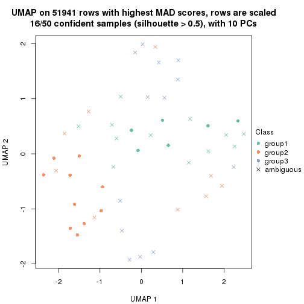</p>

</div>
<div id='tab-MAD-skmeans-dimension-reduction-3'>
<pre><code class="r">dimension_reduction(res, k = 4, method = &quot;UMAP&quot;)
</code></pre>

<p></p>

</div>
<div id='tab-MAD-skmeans-dimension-reduction-4'>
<pre><code class="r">dimension_reduction(res, k = 5, method = &quot;UMAP&quot;)
</code></pre>

<p></p>

</div>
<div id='tab-MAD-skmeans-dimension-reduction-5'>
<pre><code class="r">dimension_reduction(res, k = 6, method = &quot;UMAP&quot;)
</code></pre>

<p></p>

</div>
</div>


Following heatmap shows how subgroups are split when increasing `k`:

```r
collect_classes(res)
```


Test correlation between subgroups and known annotations. If the known
annotation is numeric, one-way ANOVA test is applied, and if the known
annotation is discrete, chi-squared contingency table test is applied.

```r
test_to_known_factors(res)
```

```
#>              n disease.state(p) gender(p) k
#> MAD:skmeans 39            0.722    0.0793 2
#> MAD:skmeans 16            0.497    0.0619 3
#> MAD:skmeans  3               NA        NA 4
#> MAD:skmeans  0               NA        NA 5
#> MAD:skmeans  0               NA        NA 6
```


If matrix rows can be associated to genes, consider to use `functional_enrichment(res,
...)` to perform function enrichment for the signature genes. See [this vignette](http://bioconductor.org/packages/devel/bioc/vignettes/cola/inst/doc/functional_enrichment.html) for more detailed explanations.


 

---------------------------------------------------


### MAD:pam


The object with results only for a single top-value method and a single partition method 
can be extracted as:

```r
res = res_list["MAD", "pam"]
# you can also extract it by
# res = res_list["MAD:pam"]
```

A summary of `res` and all the functions that can be applied to it:

```r
res
```

```
#> A 'ConsensusPartition' object with k = 2, 3, 4, 5, 6.
#>   On a matrix with 51941 rows and 50 columns.
#>   Top rows (1000, 2000, 3000, 4000, 5000) are extracted by 'MAD' method.
#>   Subgroups are detected by 'pam' method.
#>   Performed in total 1250 partitions by row resampling.
#>   Best k for subgroups seems to be 2.
#> 
#> Following methods can be applied to this 'ConsensusPartition' object:
#>  [1] "cola_report"             "collect_classes"         "collect_plots"          
#>  [4] "collect_stats"           "colnames"                "compare_signatures"     
#>  [7] "consensus_heatmap"       "dimension_reduction"     "functional_enrichment"  
#> [10] "get_anno_col"            "get_anno"                "get_classes"            
#> [13] "get_consensus"           "get_matrix"              "get_membership"         
#> [16] "get_param"               "get_signatures"          "get_stats"              
#> [19] "is_best_k"               "is_stable_k"             "membership_heatmap"     
#> [22] "ncol"                    "nrow"                    "plot_ecdf"              
#> [25] "rownames"                "select_partition_number" "show"                   
#> [28] "suggest_best_k"          "test_to_known_factors"
```

`collect_plots()` function collects all the plots made from `res` for all `k` (number of partitions)
into one single page to provide an easy and fast comparison between different `k`.

```r
collect_plots(res)
```


The plots are:

- The first row: a plot of the ECDF (empirical cumulative distribution
  function) curves of the consensus matrix for each `k` and the heatmap of
  predicted classes for each `k`.
- The second row: heatmaps of the consensus matrix for each `k`.
- The third row: heatmaps of the membership matrix for each `k`.
- The fouth row: heatmaps of the signatures for each `k`.

All the plots in panels can be made by individual functions and they are
plotted later in this section.

`select_partition_number()` produces several plots showing different
statistics for choosing "optimized" `k`. There are following statistics:

- ECDF curves of the consensus matrix for each `k`;
- 1-PAC. [The PAC
  score](https://en.wikipedia.org/wiki/Consensus_clustering#Over-interpretation_potential_of_consensus_clustering)
  measures the proportion of the ambiguous subgrouping.
- Mean silhouette score.
- Concordance. The mean probability of fiting the consensus class ids in all
  partitions.
- Area increased. Denote $A_k$ as the area under the ECDF curve for current
  `k`, the area increased is defined as $A_k - A_{k-1}$.
- Rand index. The percent of pairs of samples that are both in a same cluster
  or both are not in a same cluster in the partition of k and k-1.
- Jaccard index. The ratio of pairs of samples are both in a same cluster in
  the partition of k and k-1 and the pairs of samples are both in a same
  cluster in the partition k or k-1.

The detailed explanations of these statistics can be found in [the _cola_
vignette](http://bioconductor.org/packages/devel/bioc/vignettes/cola/inst/doc/cola.html#toc_13).

Generally speaking, lower PAC score, higher mean silhouette score or higher
concordance corresponds to better partition. Rand index and Jaccard index
measure how similar the current partition is compared to partition with `k-1`.
If they are too similar, we won't accept `k` is better than `k-1`.

```r
select_partition_number(res)
```


The numeric values for all these statistics can be obtained by `get_stats()`.

```r
get_stats(res)
```

```
#>   k 1-PAC mean_silhouette concordance area_increased  Rand Jaccard
#> 2 2 0.249           0.784       0.861         0.4113 0.607   0.607
#> 3 3 0.265           0.693       0.819         0.1991 0.971   0.952
#> 4 4 0.241           0.535       0.761         0.1377 0.961   0.932
#> 5 5 0.238           0.548       0.759         0.0538 0.962   0.929
#> 6 6 0.308           0.439       0.754         0.0499 0.924   0.850
```

`suggest_best_k()` suggests the best $k$ based on these statistics. The rules are as follows:

- All $k$ with Jaccard index larger than 0.95 are removed because increasing
  $k$ does not provide enough extra information. If all $k$ are removed, it is
  marked as no subgroup is detected.
- For all $k$ with 1-PAC score larger than 0.9, the maximal $k$ is taken as
  the best $k$, and other $k$ are marked as optional $k$.
- If it does not fit the second rule. The $k$ with the maximal vote of the
  highest 1-PAC score, highest mean silhouette, and highest concordance is
  taken as the best $k$.

```r
suggest_best_k(res)
```

```
#> [1] 2
```


Following shows the table of the partitions (You need to click the **show/hide
code output** link to see it). The membership matrix (columns with name `p*`)
is inferred by
[`clue::cl_consensus()`](https://www.rdocumentation.org/link/cl_consensus?package=clue)
function with the `SE` method. Basically the value in the membership matrix
represents the probability to belong to a certain group. The finall class
label for an item is determined with the group with highest probability it
belongs to.

In `get_classes()` function, the entropy is calculated from the membership
matrix and the silhouette score is calculated from the consensus matrix.


<script>
$( function() {
	$( '#tabs-MAD-pam-get-classes' ).tabs();
} );
</script>
<div id='tabs-MAD-pam-get-classes'>
<ul>
<li><a href='#tab-MAD-pam-get-classes-1'>k = 2</a></li>
<li><a href='#tab-MAD-pam-get-classes-2'>k = 3</a></li>
<li><a href='#tab-MAD-pam-get-classes-3'>k = 4</a></li>
<li><a href='#tab-MAD-pam-get-classes-4'>k = 5</a></li>
<li><a href='#tab-MAD-pam-get-classes-5'>k = 6</a></li>
</ul>

<div id='tab-MAD-pam-get-classes-1'>
<p><a id='tab-MAD-pam-get-classes-1-a' style='color:#0366d6' href='#'>show/hide code output</a></p>
<pre><code class="r">cbind(get_classes(res, k = 2), get_membership(res, k = 2))
</code></pre>

<pre><code>#&gt;           class entropy silhouette    p1    p2
#&gt; GSM624962     2  0.7219      0.827 0.200 0.800
#&gt; GSM624963     2  0.7219      0.825 0.200 0.800
#&gt; GSM624967     2  0.5842      0.849 0.140 0.860
#&gt; GSM624968     2  0.1633      0.862 0.024 0.976
#&gt; GSM624969     2  0.6887      0.833 0.184 0.816
#&gt; GSM624970     1  0.2778      0.817 0.952 0.048
#&gt; GSM624961     2  0.4562      0.857 0.096 0.904
#&gt; GSM624964     2  0.1843      0.857 0.028 0.972
#&gt; GSM624965     2  0.4431      0.859 0.092 0.908
#&gt; GSM624966     2  0.8443      0.589 0.272 0.728
#&gt; GSM624925     2  0.4431      0.857 0.092 0.908
#&gt; GSM624927     1  0.4022      0.823 0.920 0.080
#&gt; GSM624929     2  0.5946      0.848 0.144 0.856
#&gt; GSM624930     1  0.4815      0.822 0.896 0.104
#&gt; GSM624931     2  0.2236      0.859 0.036 0.964
#&gt; GSM624935     2  0.4562      0.868 0.096 0.904
#&gt; GSM624936     1  0.2423      0.812 0.960 0.040
#&gt; GSM624937     2  0.8016      0.802 0.244 0.756
#&gt; GSM624926     2  0.0938      0.859 0.012 0.988
#&gt; GSM624928     2  0.3584      0.863 0.068 0.932
#&gt; GSM624932     1  0.9909      0.106 0.556 0.444
#&gt; GSM624933     2  0.0376      0.856 0.004 0.996
#&gt; GSM624934     1  0.9248      0.585 0.660 0.340
#&gt; GSM624971     2  0.9427      0.372 0.360 0.640
#&gt; GSM624973     2  0.4431      0.809 0.092 0.908
#&gt; GSM624938     2  0.6531      0.840 0.168 0.832
#&gt; GSM624940     1  0.3584      0.825 0.932 0.068
#&gt; GSM624941     1  0.4161      0.820 0.916 0.084
#&gt; GSM624942     1  0.9044      0.629 0.680 0.320
#&gt; GSM624943     2  0.8813      0.644 0.300 0.700
#&gt; GSM624945     2  0.5519      0.850 0.128 0.872
#&gt; GSM624946     1  0.8386      0.610 0.732 0.268
#&gt; GSM624949     2  0.8267      0.764 0.260 0.740
#&gt; GSM624951     1  0.4298      0.819 0.912 0.088
#&gt; GSM624952     2  0.7139      0.826 0.196 0.804
#&gt; GSM624955     2  0.4298      0.858 0.088 0.912
#&gt; GSM624956     2  0.7219      0.827 0.200 0.800
#&gt; GSM624957     2  0.5178      0.793 0.116 0.884
#&gt; GSM624974     1  0.7745      0.762 0.772 0.228
#&gt; GSM624939     1  0.7950      0.762 0.760 0.240
#&gt; GSM624944     2  0.1184      0.861 0.016 0.984
#&gt; GSM624947     2  0.3733      0.863 0.072 0.928
#&gt; GSM624948     2  0.6887      0.833 0.184 0.816
#&gt; GSM624950     2  0.8144      0.518 0.252 0.748
#&gt; GSM624953     2  0.1184      0.861 0.016 0.984
#&gt; GSM624954     2  0.1414      0.858 0.020 0.980
#&gt; GSM624958     2  0.0672      0.858 0.008 0.992
#&gt; GSM624959     2  0.1414      0.861 0.020 0.980
#&gt; GSM624960     2  0.4939      0.868 0.108 0.892
#&gt; GSM624972     2  0.0672      0.857 0.008 0.992
</code></pre>

<script>
$('#tab-MAD-pam-get-classes-1-a').parent().next().next().hide();
$('#tab-MAD-pam-get-classes-1-a').click(function(){
  $('#tab-MAD-pam-get-classes-1-a').parent().next().next().toggle();
  return(false);
});
</script>
</div>

<div id='tab-MAD-pam-get-classes-2'>
<p><a id='tab-MAD-pam-get-classes-2-a' style='color:#0366d6' href='#'>show/hide code output</a></p>
<pre><code class="r">cbind(get_classes(res, k = 3), get_membership(res, k = 3))
</code></pre>

<pre><code>#&gt;           class entropy silhouette    p1    p2    p3
#&gt; GSM624962     2  0.6677     0.7211 0.024 0.652 0.324
#&gt; GSM624963     2  0.6161     0.7531 0.016 0.696 0.288
#&gt; GSM624967     2  0.5393     0.8214 0.044 0.808 0.148
#&gt; GSM624968     2  0.1182     0.8344 0.012 0.976 0.012
#&gt; GSM624969     2  0.5508     0.8035 0.028 0.784 0.188
#&gt; GSM624970     1  0.1636     0.6318 0.964 0.016 0.020
#&gt; GSM624961     2  0.4139     0.8298 0.016 0.860 0.124
#&gt; GSM624964     2  0.0661     0.8263 0.004 0.988 0.008
#&gt; GSM624965     2  0.3454     0.8352 0.008 0.888 0.104
#&gt; GSM624966     2  0.7222     0.6222 0.220 0.696 0.084
#&gt; GSM624925     2  0.3690     0.8311 0.016 0.884 0.100
#&gt; GSM624927     1  0.2663     0.6383 0.932 0.024 0.044
#&gt; GSM624929     2  0.6583     0.7889 0.108 0.756 0.136
#&gt; GSM624930     1  0.5408     0.6326 0.812 0.052 0.136
#&gt; GSM624931     2  0.3234     0.8312 0.072 0.908 0.020
#&gt; GSM624935     2  0.3989     0.8394 0.012 0.864 0.124
#&gt; GSM624936     1  0.5754     0.5231 0.700 0.004 0.296
#&gt; GSM624937     3  0.6587     0.0000 0.156 0.092 0.752
#&gt; GSM624926     2  0.0661     0.8321 0.004 0.988 0.008
#&gt; GSM624928     2  0.3293     0.8362 0.012 0.900 0.088
#&gt; GSM624932     1  0.9296     0.0832 0.436 0.404 0.160
#&gt; GSM624933     2  0.0237     0.8270 0.000 0.996 0.004
#&gt; GSM624934     1  0.8287     0.3836 0.616 0.256 0.128
#&gt; GSM624971     2  0.9112     0.3216 0.272 0.540 0.188
#&gt; GSM624973     2  0.3295     0.7875 0.096 0.896 0.008
#&gt; GSM624938     2  0.5737     0.7681 0.012 0.732 0.256
#&gt; GSM624940     1  0.2434     0.6515 0.940 0.036 0.024
#&gt; GSM624941     1  0.4121     0.6300 0.876 0.040 0.084
#&gt; GSM624942     1  0.5680     0.4652 0.764 0.212 0.024
#&gt; GSM624943     2  0.6497     0.5508 0.336 0.648 0.016
#&gt; GSM624945     2  0.4453     0.8177 0.012 0.836 0.152
#&gt; GSM624946     1  0.9326     0.3151 0.512 0.204 0.284
#&gt; GSM624949     2  0.7298     0.7465 0.088 0.692 0.220
#&gt; GSM624951     1  0.1182     0.6228 0.976 0.012 0.012
#&gt; GSM624952     2  0.6369     0.7272 0.016 0.668 0.316
#&gt; GSM624955     2  0.4526     0.8315 0.040 0.856 0.104
#&gt; GSM624956     2  0.6677     0.7235 0.024 0.652 0.324
#&gt; GSM624957     2  0.4094     0.7827 0.100 0.872 0.028
#&gt; GSM624974     1  0.3213     0.6334 0.900 0.092 0.008
#&gt; GSM624939     1  0.5072     0.5625 0.792 0.196 0.012
#&gt; GSM624944     2  0.1585     0.8315 0.008 0.964 0.028
#&gt; GSM624947     2  0.4094     0.8368 0.028 0.872 0.100
#&gt; GSM624948     2  0.5848     0.7806 0.012 0.720 0.268
#&gt; GSM624950     2  0.5325     0.5470 0.248 0.748 0.004
#&gt; GSM624953     2  0.1411     0.8354 0.000 0.964 0.036
#&gt; GSM624954     2  0.0829     0.8265 0.004 0.984 0.012
#&gt; GSM624958     2  0.0424     0.8276 0.000 0.992 0.008
#&gt; GSM624959     2  0.2200     0.8353 0.004 0.940 0.056
#&gt; GSM624960     2  0.3921     0.8406 0.016 0.872 0.112
#&gt; GSM624972     2  0.0475     0.8273 0.004 0.992 0.004
</code></pre>

<script>
$('#tab-MAD-pam-get-classes-2-a').parent().next().next().hide();
$('#tab-MAD-pam-get-classes-2-a').click(function(){
  $('#tab-MAD-pam-get-classes-2-a').parent().next().next().toggle();
  return(false);
});
</script>
</div>

<div id='tab-MAD-pam-get-classes-3'>
<p><a id='tab-MAD-pam-get-classes-3-a' style='color:#0366d6' href='#'>show/hide code output</a></p>
<pre><code class="r">cbind(get_classes(res, k = 4), get_membership(res, k = 4))
</code></pre>

<pre><code>#&gt;           class entropy silhouette    p1    p2    p3    p4
#&gt; GSM624962     2  0.7208     0.2400 0.004 0.452 0.424 0.120
#&gt; GSM624963     2  0.5126     0.4004 0.000 0.552 0.444 0.004
#&gt; GSM624967     2  0.6246     0.6649 0.024 0.712 0.136 0.128
#&gt; GSM624968     2  0.1191     0.7297 0.004 0.968 0.004 0.024
#&gt; GSM624969     2  0.4158     0.6824 0.008 0.768 0.224 0.000
#&gt; GSM624970     1  0.4955     0.3611 0.708 0.004 0.272 0.016
#&gt; GSM624961     2  0.5948     0.6565 0.000 0.696 0.160 0.144
#&gt; GSM624964     2  0.0524     0.7223 0.008 0.988 0.000 0.004
#&gt; GSM624965     2  0.4186     0.7129 0.004 0.808 0.164 0.024
#&gt; GSM624966     2  0.7608     0.3976 0.196 0.620 0.088 0.096
#&gt; GSM624925     2  0.4780     0.6952 0.000 0.788 0.096 0.116
#&gt; GSM624927     1  0.2864     0.6222 0.908 0.024 0.052 0.016
#&gt; GSM624929     2  0.5698     0.6669 0.060 0.716 0.212 0.012
#&gt; GSM624930     1  0.4960     0.5491 0.784 0.040 0.156 0.020
#&gt; GSM624931     2  0.3159     0.7313 0.068 0.892 0.012 0.028
#&gt; GSM624935     2  0.5015     0.7214 0.004 0.780 0.120 0.096
#&gt; GSM624936     1  0.5810     0.2352 0.580 0.004 0.388 0.028
#&gt; GSM624937     4  0.4364     0.0000 0.136 0.000 0.056 0.808
#&gt; GSM624926     2  0.0927     0.7292 0.000 0.976 0.008 0.016
#&gt; GSM624928     2  0.3128     0.7215 0.004 0.864 0.128 0.004
#&gt; GSM624932     1  0.8897    -0.3405 0.368 0.360 0.212 0.060
#&gt; GSM624933     2  0.0000     0.7212 0.000 1.000 0.000 0.000
#&gt; GSM624934     1  0.8017     0.0156 0.540 0.244 0.176 0.040
#&gt; GSM624971     3  0.7406     0.5595 0.160 0.332 0.504 0.004
#&gt; GSM624973     2  0.2466     0.6772 0.096 0.900 0.004 0.000
#&gt; GSM624938     2  0.5503    -0.0263 0.000 0.516 0.468 0.016
#&gt; GSM624940     1  0.1943     0.6278 0.944 0.032 0.016 0.008
#&gt; GSM624941     1  0.4882     0.5541 0.812 0.032 0.084 0.072
#&gt; GSM624942     1  0.4808     0.3565 0.760 0.208 0.020 0.012
#&gt; GSM624943     2  0.5247     0.4007 0.340 0.644 0.008 0.008
#&gt; GSM624945     2  0.4279     0.6790 0.004 0.780 0.204 0.012
#&gt; GSM624946     3  0.7112     0.4369 0.300 0.128 0.564 0.008
#&gt; GSM624949     2  0.5949     0.5827 0.068 0.668 0.260 0.004
#&gt; GSM624951     1  0.0657     0.6093 0.984 0.012 0.000 0.004
#&gt; GSM624952     2  0.6775     0.2786 0.000 0.492 0.412 0.096
#&gt; GSM624955     2  0.5720     0.6869 0.020 0.748 0.100 0.132
#&gt; GSM624956     2  0.7206     0.2559 0.004 0.456 0.420 0.120
#&gt; GSM624957     2  0.3837     0.6704 0.088 0.860 0.032 0.020
#&gt; GSM624974     1  0.2742     0.6213 0.900 0.076 0.000 0.024
#&gt; GSM624939     1  0.4201     0.5285 0.788 0.196 0.004 0.012
#&gt; GSM624944     2  0.2365     0.7250 0.004 0.920 0.064 0.012
#&gt; GSM624947     2  0.5181     0.7095 0.004 0.768 0.100 0.128
#&gt; GSM624948     2  0.6888     0.4964 0.004 0.564 0.320 0.112
#&gt; GSM624950     2  0.4400     0.3517 0.248 0.744 0.004 0.004
#&gt; GSM624953     2  0.2385     0.7344 0.000 0.920 0.052 0.028
#&gt; GSM624954     2  0.0564     0.7225 0.004 0.988 0.004 0.004
#&gt; GSM624958     2  0.0336     0.7223 0.000 0.992 0.008 0.000
#&gt; GSM624959     2  0.3526     0.7216 0.004 0.864 0.100 0.032
#&gt; GSM624960     2  0.4548     0.7194 0.008 0.804 0.144 0.044
#&gt; GSM624972     2  0.0188     0.7217 0.000 0.996 0.000 0.004
</code></pre>

<script>
$('#tab-MAD-pam-get-classes-3-a').parent().next().next().hide();
$('#tab-MAD-pam-get-classes-3-a').click(function(){
  $('#tab-MAD-pam-get-classes-3-a').parent().next().next().toggle();
  return(false);
});
</script>
</div>

<div id='tab-MAD-pam-get-classes-4'>
<p><a id='tab-MAD-pam-get-classes-4-a' style='color:#0366d6' href='#'>show/hide code output</a></p>
<pre><code class="r">cbind(get_classes(res, k = 5), get_membership(res, k = 5))
</code></pre>

<pre><code>#&gt;           class entropy silhouette    p1    p2    p3    p4    p5
#&gt; GSM624962     2  0.6833     0.2501 0.004 0.412 0.336 0.000 0.248
#&gt; GSM624963     2  0.5828     0.4011 0.000 0.520 0.380 0.000 0.100
#&gt; GSM624967     2  0.5863     0.5435 0.004 0.588 0.116 0.000 0.292
#&gt; GSM624968     2  0.0955     0.7470 0.004 0.968 0.000 0.000 0.028
#&gt; GSM624969     2  0.4145     0.7086 0.012 0.772 0.188 0.000 0.028
#&gt; GSM624970     5  0.5175     0.0000 0.420 0.004 0.020 0.008 0.548
#&gt; GSM624961     2  0.5243     0.6802 0.000 0.684 0.104 0.004 0.208
#&gt; GSM624964     2  0.0613     0.7410 0.008 0.984 0.000 0.004 0.004
#&gt; GSM624965     2  0.4224     0.7280 0.004 0.788 0.144 0.004 0.060
#&gt; GSM624966     2  0.6474     0.5018 0.196 0.620 0.040 0.004 0.140
#&gt; GSM624925     2  0.4017     0.7160 0.000 0.788 0.064 0.000 0.148
#&gt; GSM624927     1  0.2590     0.4618 0.908 0.020 0.028 0.004 0.040
#&gt; GSM624929     2  0.5558     0.6978 0.052 0.716 0.172 0.012 0.048
#&gt; GSM624930     1  0.4317     0.4645 0.796 0.028 0.136 0.004 0.036
#&gt; GSM624931     2  0.2609     0.7503 0.068 0.896 0.008 0.000 0.028
#&gt; GSM624935     2  0.4494     0.7395 0.004 0.772 0.084 0.004 0.136
#&gt; GSM624936     1  0.5798     0.2931 0.596 0.000 0.300 0.008 0.096
#&gt; GSM624937     4  0.1074     0.0000 0.016 0.000 0.012 0.968 0.004
#&gt; GSM624926     2  0.0771     0.7464 0.000 0.976 0.004 0.000 0.020
#&gt; GSM624928     2  0.2991     0.7404 0.004 0.860 0.120 0.004 0.012
#&gt; GSM624932     1  0.8053    -0.0693 0.364 0.360 0.160 0.004 0.112
#&gt; GSM624933     2  0.0162     0.7401 0.000 0.996 0.000 0.000 0.004
#&gt; GSM624934     1  0.7419     0.2599 0.536 0.248 0.124 0.012 0.080
#&gt; GSM624971     3  0.5036     0.6437 0.092 0.200 0.704 0.000 0.004
#&gt; GSM624973     2  0.2124     0.7027 0.096 0.900 0.004 0.000 0.000
#&gt; GSM624938     3  0.4213     0.5780 0.000 0.308 0.680 0.000 0.012
#&gt; GSM624940     1  0.1883     0.4653 0.940 0.028 0.012 0.012 0.008
#&gt; GSM624941     1  0.4339     0.4132 0.808 0.032 0.060 0.004 0.096
#&gt; GSM624942     1  0.4432     0.3022 0.752 0.208 0.012 0.012 0.016
#&gt; GSM624943     2  0.4812     0.5018 0.324 0.648 0.012 0.012 0.004
#&gt; GSM624945     2  0.3968     0.7029 0.004 0.776 0.196 0.004 0.020
#&gt; GSM624946     3  0.4114     0.4532 0.176 0.044 0.776 0.000 0.004
#&gt; GSM624949     2  0.5705     0.6332 0.072 0.676 0.208 0.000 0.044
#&gt; GSM624951     1  0.0693     0.4144 0.980 0.008 0.000 0.012 0.000
#&gt; GSM624952     2  0.6515     0.3067 0.000 0.464 0.328 0.000 0.208
#&gt; GSM624955     2  0.5283     0.6917 0.004 0.716 0.080 0.020 0.180
#&gt; GSM624956     2  0.6814     0.2749 0.004 0.420 0.332 0.000 0.244
#&gt; GSM624957     2  0.3610     0.7004 0.092 0.848 0.024 0.004 0.032
#&gt; GSM624974     1  0.2238     0.4753 0.912 0.064 0.000 0.004 0.020
#&gt; GSM624939     1  0.3575     0.4271 0.800 0.180 0.000 0.004 0.016
#&gt; GSM624944     2  0.2468     0.7436 0.004 0.908 0.048 0.004 0.036
#&gt; GSM624947     2  0.4510     0.7302 0.004 0.764 0.068 0.004 0.160
#&gt; GSM624948     2  0.6673     0.4986 0.004 0.528 0.228 0.008 0.232
#&gt; GSM624950     2  0.4065     0.4512 0.248 0.736 0.008 0.004 0.004
#&gt; GSM624953     2  0.2238     0.7528 0.000 0.912 0.020 0.004 0.064
#&gt; GSM624954     2  0.0451     0.7402 0.004 0.988 0.000 0.000 0.008
#&gt; GSM624958     2  0.0290     0.7400 0.000 0.992 0.008 0.000 0.000
#&gt; GSM624959     2  0.3654     0.7392 0.004 0.840 0.056 0.008 0.092
#&gt; GSM624960     2  0.4741     0.7120 0.008 0.756 0.148 0.004 0.084
#&gt; GSM624972     2  0.0162     0.7391 0.000 0.996 0.000 0.000 0.004
</code></pre>

<script>
$('#tab-MAD-pam-get-classes-4-a').parent().next().next().hide();
$('#tab-MAD-pam-get-classes-4-a').click(function(){
  $('#tab-MAD-pam-get-classes-4-a').parent().next().next().toggle();
  return(false);
});
</script>
</div>

<div id='tab-MAD-pam-get-classes-5'>
<p><a id='tab-MAD-pam-get-classes-5-a' style='color:#0366d6' href='#'>show/hide code output</a></p>
<pre><code class="r">cbind(get_classes(res, k = 6), get_membership(res, k = 6))
</code></pre>

<pre><code>#&gt;           class entropy silhouette    p1    p2    p3    p4    p5    p6
#&gt; GSM624962     6  0.5517      0.898 0.004 0.352 0.124 0.000 0.000 0.520
#&gt; GSM624963     2  0.6116     -0.536 0.012 0.480 0.216 0.000 0.000 0.292
#&gt; GSM624967     2  0.6258     -0.314 0.112 0.436 0.032 0.000 0.008 0.412
#&gt; GSM624968     2  0.0858      0.644 0.000 0.968 0.000 0.000 0.004 0.028
#&gt; GSM624969     2  0.4240      0.514 0.012 0.764 0.152 0.000 0.008 0.064
#&gt; GSM624970     1  0.3978      0.000 0.712 0.004 0.012 0.004 0.264 0.004
#&gt; GSM624961     2  0.3619      0.330 0.004 0.680 0.000 0.000 0.000 0.316
#&gt; GSM624964     2  0.0520      0.645 0.008 0.984 0.000 0.000 0.008 0.000
#&gt; GSM624965     2  0.4056      0.570 0.020 0.780 0.076 0.000 0.000 0.124
#&gt; GSM624966     2  0.5718      0.198 0.008 0.604 0.012 0.000 0.192 0.184
#&gt; GSM624925     2  0.2883      0.486 0.000 0.788 0.000 0.000 0.000 0.212
#&gt; GSM624927     5  0.2377      0.568 0.020 0.020 0.012 0.000 0.908 0.040
#&gt; GSM624929     2  0.5536      0.483 0.028 0.704 0.116 0.004 0.044 0.104
#&gt; GSM624930     5  0.3800      0.554 0.024 0.024 0.120 0.000 0.812 0.020
#&gt; GSM624931     2  0.2434      0.639 0.008 0.892 0.000 0.000 0.064 0.036
#&gt; GSM624935     2  0.4052      0.539 0.016 0.752 0.040 0.000 0.000 0.192
#&gt; GSM624936     5  0.5822      0.376 0.032 0.000 0.172 0.000 0.596 0.200
#&gt; GSM624937     4  0.0000      0.000 0.000 0.000 0.000 1.000 0.000 0.000
#&gt; GSM624926     2  0.0632      0.644 0.000 0.976 0.000 0.000 0.000 0.024
#&gt; GSM624928     2  0.2933      0.616 0.008 0.856 0.096 0.000 0.000 0.040
#&gt; GSM624932     5  0.7222     -0.206 0.008 0.352 0.076 0.000 0.360 0.204
#&gt; GSM624933     2  0.0146      0.643 0.000 0.996 0.000 0.000 0.000 0.004
#&gt; GSM624934     5  0.6801      0.324 0.032 0.244 0.084 0.000 0.544 0.096
#&gt; GSM624971     3  0.5186      0.673 0.020 0.136 0.720 0.000 0.072 0.052
#&gt; GSM624973     2  0.1918      0.600 0.000 0.904 0.008 0.000 0.088 0.000
#&gt; GSM624938     3  0.3245      0.611 0.000 0.228 0.764 0.000 0.000 0.008
#&gt; GSM624940     5  0.2065      0.565 0.032 0.024 0.004 0.004 0.924 0.012
#&gt; GSM624941     5  0.3626      0.521 0.020 0.032 0.000 0.000 0.800 0.148
#&gt; GSM624942     5  0.4297      0.405 0.036 0.204 0.000 0.004 0.736 0.020
#&gt; GSM624943     2  0.4596      0.307 0.036 0.648 0.008 0.004 0.304 0.000
#&gt; GSM624945     2  0.4123      0.529 0.016 0.772 0.164 0.000 0.016 0.032
#&gt; GSM624946     3  0.3550      0.575 0.000 0.020 0.816 0.000 0.120 0.044
#&gt; GSM624949     2  0.5458      0.368 0.004 0.676 0.168 0.000 0.072 0.080
#&gt; GSM624951     5  0.1003      0.529 0.028 0.004 0.000 0.004 0.964 0.000
#&gt; GSM624952     6  0.6055      0.849 0.008 0.412 0.144 0.000 0.008 0.428
#&gt; GSM624955     2  0.5967     -0.033 0.084 0.548 0.060 0.000 0.000 0.308
#&gt; GSM624956     6  0.5541      0.906 0.000 0.364 0.124 0.000 0.004 0.508
#&gt; GSM624957     2  0.3463      0.578 0.020 0.832 0.008 0.000 0.108 0.032
#&gt; GSM624974     5  0.1882      0.574 0.012 0.060 0.000 0.000 0.920 0.008
#&gt; GSM624939     5  0.3178      0.522 0.004 0.176 0.000 0.000 0.804 0.016
#&gt; GSM624944     2  0.2418      0.622 0.008 0.884 0.016 0.000 0.000 0.092
#&gt; GSM624947     2  0.3271      0.520 0.008 0.760 0.000 0.000 0.000 0.232
#&gt; GSM624948     2  0.5527     -0.487 0.016 0.484 0.084 0.000 0.000 0.416
#&gt; GSM624950     2  0.3938      0.338 0.012 0.728 0.008 0.000 0.244 0.008
#&gt; GSM624953     2  0.1757      0.636 0.008 0.916 0.000 0.000 0.000 0.076
#&gt; GSM624954     2  0.0260      0.643 0.000 0.992 0.000 0.000 0.000 0.008
#&gt; GSM624958     2  0.0146      0.642 0.000 0.996 0.000 0.000 0.000 0.004
#&gt; GSM624959     2  0.2996      0.596 0.016 0.832 0.008 0.000 0.000 0.144
#&gt; GSM624960     2  0.5666      0.119 0.028 0.588 0.116 0.000 0.000 0.268
#&gt; GSM624972     2  0.0146      0.641 0.000 0.996 0.000 0.000 0.000 0.004
</code></pre>

<script>
$('#tab-MAD-pam-get-classes-5-a').parent().next().next().hide();
$('#tab-MAD-pam-get-classes-5-a').click(function(){
  $('#tab-MAD-pam-get-classes-5-a').parent().next().next().toggle();
  return(false);
});
</script>
</div>
</div>

Heatmaps for the consensus matrix. It visualizes the probability of two
samples to be in a same group.


<script>
$( function() {
	$( '#tabs-MAD-pam-consensus-heatmap' ).tabs();
} );
</script>
<div id='tabs-MAD-pam-consensus-heatmap'>
<ul>
<li><a href='#tab-MAD-pam-consensus-heatmap-1'>k = 2</a></li>
<li><a href='#tab-MAD-pam-consensus-heatmap-2'>k = 3</a></li>
<li><a href='#tab-MAD-pam-consensus-heatmap-3'>k = 4</a></li>
<li><a href='#tab-MAD-pam-consensus-heatmap-4'>k = 5</a></li>
<li><a href='#tab-MAD-pam-consensus-heatmap-5'>k = 6</a></li>
</ul>
<div id='tab-MAD-pam-consensus-heatmap-1'>
<pre><code class="r">consensus_heatmap(res, k = 2)
</code></pre>

<p></p>

</div>
<div id='tab-MAD-pam-consensus-heatmap-2'>
<pre><code class="r">consensus_heatmap(res, k = 3)
</code></pre>

<p></p>

</div>
<div id='tab-MAD-pam-consensus-heatmap-3'>
<pre><code class="r">consensus_heatmap(res, k = 4)
</code></pre>

<p>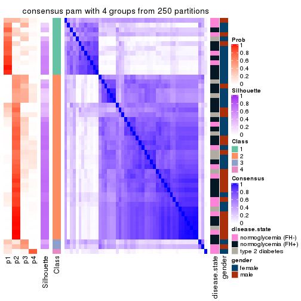</p>

</div>
<div id='tab-MAD-pam-consensus-heatmap-4'>
<pre><code class="r">consensus_heatmap(res, k = 5)
</code></pre>

<p></p>

</div>
<div id='tab-MAD-pam-consensus-heatmap-5'>
<pre><code class="r">consensus_heatmap(res, k = 6)
</code></pre>

<p></p>

</div>
</div>

Heatmaps for the membership of samples in all partitions to see how consistent they are:


<script>
$( function() {
	$( '#tabs-MAD-pam-membership-heatmap' ).tabs();
} );
</script>
<div id='tabs-MAD-pam-membership-heatmap'>
<ul>
<li><a href='#tab-MAD-pam-membership-heatmap-1'>k = 2</a></li>
<li><a href='#tab-MAD-pam-membership-heatmap-2'>k = 3</a></li>
<li><a href='#tab-MAD-pam-membership-heatmap-3'>k = 4</a></li>
<li><a href='#tab-MAD-pam-membership-heatmap-4'>k = 5</a></li>
<li><a href='#tab-MAD-pam-membership-heatmap-5'>k = 6</a></li>
</ul>
<div id='tab-MAD-pam-membership-heatmap-1'>
<pre><code class="r">membership_heatmap(res, k = 2)
</code></pre>

<p></p>

</div>
<div id='tab-MAD-pam-membership-heatmap-2'>
<pre><code class="r">membership_heatmap(res, k = 3)
</code></pre>

<p></p>

</div>
<div id='tab-MAD-pam-membership-heatmap-3'>
<pre><code class="r">membership_heatmap(res, k = 4)
</code></pre>

<p></p>

</div>
<div id='tab-MAD-pam-membership-heatmap-4'>
<pre><code class="r">membership_heatmap(res, k = 5)
</code></pre>

<p></p>

</div>
<div id='tab-MAD-pam-membership-heatmap-5'>
<pre><code class="r">membership_heatmap(res, k = 6)
</code></pre>

<p></p>

</div>
</div>

As soon as we have had the classes for columns, we can look for signatures
which are significantly different between classes which can be candidate marks
for certain classes. Following are the heatmaps for signatures.


Signature heatmaps where rows are scaled:


<script>
$( function() {
	$( '#tabs-MAD-pam-get-signatures' ).tabs();
} );
</script>
<div id='tabs-MAD-pam-get-signatures'>
<ul>
<li><a href='#tab-MAD-pam-get-signatures-1'>k = 2</a></li>
<li><a href='#tab-MAD-pam-get-signatures-2'>k = 3</a></li>
<li><a href='#tab-MAD-pam-get-signatures-3'>k = 4</a></li>
<li><a href='#tab-MAD-pam-get-signatures-4'>k = 5</a></li>
<li><a href='#tab-MAD-pam-get-signatures-5'>k = 6</a></li>
</ul>
<div id='tab-MAD-pam-get-signatures-1'>
<pre><code class="r">get_signatures(res, k = 2)
</code></pre>

<p></p>

</div>
<div id='tab-MAD-pam-get-signatures-2'>
<pre><code class="r">get_signatures(res, k = 3)
</code></pre>

<p></p>

</div>
<div id='tab-MAD-pam-get-signatures-3'>
<pre><code class="r">get_signatures(res, k = 4)
</code></pre>

<p></p>

</div>
<div id='tab-MAD-pam-get-signatures-4'>
<pre><code class="r">get_signatures(res, k = 5)
</code></pre>

<p></p>

</div>
<div id='tab-MAD-pam-get-signatures-5'>
<pre><code class="r">get_signatures(res, k = 6)
</code></pre>

<p></p>

</div>
</div>


Signature heatmaps where rows are not scaled:


<script>
$( function() {
	$( '#tabs-MAD-pam-get-signatures-no-scale' ).tabs();
} );
</script>
<div id='tabs-MAD-pam-get-signatures-no-scale'>
<ul>
<li><a href='#tab-MAD-pam-get-signatures-no-scale-1'>k = 2</a></li>
<li><a href='#tab-MAD-pam-get-signatures-no-scale-2'>k = 3</a></li>
<li><a href='#tab-MAD-pam-get-signatures-no-scale-3'>k = 4</a></li>
<li><a href='#tab-MAD-pam-get-signatures-no-scale-4'>k = 5</a></li>
<li><a href='#tab-MAD-pam-get-signatures-no-scale-5'>k = 6</a></li>
</ul>
<div id='tab-MAD-pam-get-signatures-no-scale-1'>
<pre><code class="r">get_signatures(res, k = 2, scale_rows = FALSE)
</code></pre>

<p></p>

</div>
<div id='tab-MAD-pam-get-signatures-no-scale-2'>
<pre><code class="r">get_signatures(res, k = 3, scale_rows = FALSE)
</code></pre>

<p></p>

</div>
<div id='tab-MAD-pam-get-signatures-no-scale-3'>
<pre><code class="r">get_signatures(res, k = 4, scale_rows = FALSE)
</code></pre>

<p></p>

</div>
<div id='tab-MAD-pam-get-signatures-no-scale-4'>
<pre><code class="r">get_signatures(res, k = 5, scale_rows = FALSE)
</code></pre>

<p></p>

</div>
<div id='tab-MAD-pam-get-signatures-no-scale-5'>
<pre><code class="r">get_signatures(res, k = 6, scale_rows = FALSE)
</code></pre>

<p></p>

</div>
</div>


Compare the overlap of signatures from different k:

```r
compare_signatures(res)
```


`get_signature()` returns a data frame invisibly. TO get the list of signatures, the function
call should be assigned to a variable explicitly. In following code, if `plot` argument is set
to `FALSE`, no heatmap is plotted while only the differential analysis is performed.

```r
# code only for demonstration
tb = get_signature(res, k = ..., plot = FALSE)
```

An example of the output of `tb` is:

```
#>   which_row         fdr    mean_1    mean_2 scaled_mean_1 scaled_mean_2 km
#> 1        38 0.042760348  8.373488  9.131774    -0.5533452     0.5164555  1
#> 2        40 0.018707592  7.106213  8.469186    -0.6173731     0.5762149  1
#> 3        55 0.019134737 10.221463 11.207825    -0.6159697     0.5749050  1
#> 4        59 0.006059896  5.921854  7.869574    -0.6899429     0.6439467  1
#> 5        60 0.018055526  8.928898 10.211722    -0.6204761     0.5791110  1
#> 6        98 0.009384629 15.714769 14.887706     0.6635654    -0.6193277  2
...
```

The columns in `tb` are:

1. `which_row`: row indices corresponding to the input matrix.
2. `fdr`: FDR for the differential test. 
3. `mean_x`: The mean value in group x.
4. `scaled_mean_x`: The mean value in group x after rows are scaled.
5. `km`: Row groups if k-means clustering is applied to rows.


UMAP plot which shows how samples are separated.


<script>
$( function() {
	$( '#tabs-MAD-pam-dimension-reduction' ).tabs();
} );
</script>
<div id='tabs-MAD-pam-dimension-reduction'>
<ul>
<li><a href='#tab-MAD-pam-dimension-reduction-1'>k = 2</a></li>
<li><a href='#tab-MAD-pam-dimension-reduction-2'>k = 3</a></li>
<li><a href='#tab-MAD-pam-dimension-reduction-3'>k = 4</a></li>
<li><a href='#tab-MAD-pam-dimension-reduction-4'>k = 5</a></li>
<li><a href='#tab-MAD-pam-dimension-reduction-5'>k = 6</a></li>
</ul>
<div id='tab-MAD-pam-dimension-reduction-1'>
<pre><code class="r">dimension_reduction(res, k = 2, method = &quot;UMAP&quot;)
</code></pre>

<p></p>

</div>
<div id='tab-MAD-pam-dimension-reduction-2'>
<pre><code class="r">dimension_reduction(res, k = 3, method = &quot;UMAP&quot;)
</code></pre>

<p></p>

</div>
<div id='tab-MAD-pam-dimension-reduction-3'>
<pre><code class="r">dimension_reduction(res, k = 4, method = &quot;UMAP&quot;)
</code></pre>

<p></p>

</div>
<div id='tab-MAD-pam-dimension-reduction-4'>
<pre><code class="r">dimension_reduction(res, k = 5, method = &quot;UMAP&quot;)
</code></pre>

<p></p>

</div>
<div id='tab-MAD-pam-dimension-reduction-5'>
<pre><code class="r">dimension_reduction(res, k = 6, method = &quot;UMAP&quot;)
</code></pre>

<p></p>

</div>
</div>


Following heatmap shows how subgroups are split when increasing `k`:

```r
collect_classes(res)
```


Test correlation between subgroups and known annotations. If the known
annotation is numeric, one-way ANOVA test is applied, and if the known
annotation is discrete, chi-squared contingency table test is applied.

```r
test_to_known_factors(res)
```

```
#>          n disease.state(p) gender(p) k
#> MAD:pam 48            0.461    0.0910 2
#> MAD:pam 44            0.604    0.0718 3
#> MAD:pam 34            0.339    0.0748 4
#> MAD:pam 30            0.673    1.0000 5
#> MAD:pam 32            0.657    0.0245 6
```


If matrix rows can be associated to genes, consider to use `functional_enrichment(res,
...)` to perform function enrichment for the signature genes. See [this vignette](http://bioconductor.org/packages/devel/bioc/vignettes/cola/inst/doc/functional_enrichment.html) for more detailed explanations.


 

---------------------------------------------------


### MAD:mclust


The object with results only for a single top-value method and a single partition method 
can be extracted as:

```r
res = res_list["MAD", "mclust"]
# you can also extract it by
# res = res_list["MAD:mclust"]
```

A summary of `res` and all the functions that can be applied to it:

```r
res
```

```
#> A 'ConsensusPartition' object with k = 2, 3, 4, 5, 6.
#>   On a matrix with 51941 rows and 50 columns.
#>   Top rows (1000, 2000, 3000, 4000, 5000) are extracted by 'MAD' method.
#>   Subgroups are detected by 'mclust' method.
#>   Performed in total 1250 partitions by row resampling.
#>   Best k for subgroups seems to be 4.
#> 
#> Following methods can be applied to this 'ConsensusPartition' object:
#>  [1] "cola_report"             "collect_classes"         "collect_plots"          
#>  [4] "collect_stats"           "colnames"                "compare_signatures"     
#>  [7] "consensus_heatmap"       "dimension_reduction"     "functional_enrichment"  
#> [10] "get_anno_col"            "get_anno"                "get_classes"            
#> [13] "get_consensus"           "get_matrix"              "get_membership"         
#> [16] "get_param"               "get_signatures"          "get_stats"              
#> [19] "is_best_k"               "is_stable_k"             "membership_heatmap"     
#> [22] "ncol"                    "nrow"                    "plot_ecdf"              
#> [25] "rownames"                "select_partition_number" "show"                   
#> [28] "suggest_best_k"          "test_to_known_factors"
```

`collect_plots()` function collects all the plots made from `res` for all `k` (number of partitions)
into one single page to provide an easy and fast comparison between different `k`.

```r
collect_plots(res)
```


The plots are:

- The first row: a plot of the ECDF (empirical cumulative distribution
  function) curves of the consensus matrix for each `k` and the heatmap of
  predicted classes for each `k`.
- The second row: heatmaps of the consensus matrix for each `k`.
- The third row: heatmaps of the membership matrix for each `k`.
- The fouth row: heatmaps of the signatures for each `k`.

All the plots in panels can be made by individual functions and they are
plotted later in this section.

`select_partition_number()` produces several plots showing different
statistics for choosing "optimized" `k`. There are following statistics:

- ECDF curves of the consensus matrix for each `k`;
- 1-PAC. [The PAC
  score](https://en.wikipedia.org/wiki/Consensus_clustering#Over-interpretation_potential_of_consensus_clustering)
  measures the proportion of the ambiguous subgrouping.
- Mean silhouette score.
- Concordance. The mean probability of fiting the consensus class ids in all
  partitions.
- Area increased. Denote $A_k$ as the area under the ECDF curve for current
  `k`, the area increased is defined as $A_k - A_{k-1}$.
- Rand index. The percent of pairs of samples that are both in a same cluster
  or both are not in a same cluster in the partition of k and k-1.
- Jaccard index. The ratio of pairs of samples are both in a same cluster in
  the partition of k and k-1 and the pairs of samples are both in a same
  cluster in the partition k or k-1.

The detailed explanations of these statistics can be found in [the _cola_
vignette](http://bioconductor.org/packages/devel/bioc/vignettes/cola/inst/doc/cola.html#toc_13).

Generally speaking, lower PAC score, higher mean silhouette score or higher
concordance corresponds to better partition. Rand index and Jaccard index
measure how similar the current partition is compared to partition with `k-1`.
If they are too similar, we won't accept `k` is better than `k-1`.

```r
select_partition_number(res)
```


The numeric values for all these statistics can be obtained by `get_stats()`.

```r
get_stats(res)
```

```
#>   k 1-PAC mean_silhouette concordance area_increased  Rand Jaccard
#> 2 2 0.271           0.656       0.733         0.3759 0.530   0.530
#> 3 3 0.303           0.673       0.782         0.6467 0.798   0.619
#> 4 4 0.623           0.777       0.867         0.1489 0.904   0.727
#> 5 5 0.593           0.572       0.749         0.0814 0.951   0.827
#> 6 6 0.639           0.628       0.768         0.0599 0.913   0.649
```

`suggest_best_k()` suggests the best $k$ based on these statistics. The rules are as follows:

- All $k$ with Jaccard index larger than 0.95 are removed because increasing
  $k$ does not provide enough extra information. If all $k$ are removed, it is
  marked as no subgroup is detected.
- For all $k$ with 1-PAC score larger than 0.9, the maximal $k$ is taken as
  the best $k$, and other $k$ are marked as optional $k$.
- If it does not fit the second rule. The $k$ with the maximal vote of the
  highest 1-PAC score, highest mean silhouette, and highest concordance is
  taken as the best $k$.

```r
suggest_best_k(res)
```

```
#> [1] 4
```


Following shows the table of the partitions (You need to click the **show/hide
code output** link to see it). The membership matrix (columns with name `p*`)
is inferred by
[`clue::cl_consensus()`](https://www.rdocumentation.org/link/cl_consensus?package=clue)
function with the `SE` method. Basically the value in the membership matrix
represents the probability to belong to a certain group. The finall class
label for an item is determined with the group with highest probability it
belongs to.

In `get_classes()` function, the entropy is calculated from the membership
matrix and the silhouette score is calculated from the consensus matrix.


<script>
$( function() {
	$( '#tabs-MAD-mclust-get-classes' ).tabs();
} );
</script>
<div id='tabs-MAD-mclust-get-classes'>
<ul>
<li><a href='#tab-MAD-mclust-get-classes-1'>k = 2</a></li>
<li><a href='#tab-MAD-mclust-get-classes-2'>k = 3</a></li>
<li><a href='#tab-MAD-mclust-get-classes-3'>k = 4</a></li>
<li><a href='#tab-MAD-mclust-get-classes-4'>k = 5</a></li>
<li><a href='#tab-MAD-mclust-get-classes-5'>k = 6</a></li>
</ul>

<div id='tab-MAD-mclust-get-classes-1'>
<p><a id='tab-MAD-mclust-get-classes-1-a' style='color:#0366d6' href='#'>show/hide code output</a></p>
<pre><code class="r">cbind(get_classes(res, k = 2), get_membership(res, k = 2))
</code></pre>

<pre><code>#&gt;           class entropy silhouette    p1    p2
#&gt; GSM624962     1  0.7219      0.664 0.800 0.200
#&gt; GSM624963     1  0.3431      0.815 0.936 0.064
#&gt; GSM624967     2  0.9732      0.711 0.404 0.596
#&gt; GSM624968     2  0.9754      0.708 0.408 0.592
#&gt; GSM624969     2  0.2043      0.580 0.032 0.968
#&gt; GSM624970     2  0.6973      0.665 0.188 0.812
#&gt; GSM624961     1  0.0672      0.801 0.992 0.008
#&gt; GSM624964     2  0.9686      0.714 0.396 0.604
#&gt; GSM624965     1  0.1843      0.812 0.972 0.028
#&gt; GSM624966     1  0.9996     -0.511 0.512 0.488
#&gt; GSM624925     1  0.4431      0.803 0.908 0.092
#&gt; GSM624927     2  0.1843      0.576 0.028 0.972
#&gt; GSM624929     1  0.2236      0.815 0.964 0.036
#&gt; GSM624930     2  0.3274      0.600 0.060 0.940
#&gt; GSM624931     2  0.2778      0.592 0.048 0.952
#&gt; GSM624935     2  0.9732      0.711 0.404 0.596
#&gt; GSM624936     1  0.9963     -0.379 0.536 0.464
#&gt; GSM624937     2  0.9552      0.715 0.376 0.624
#&gt; GSM624926     2  1.0000      0.517 0.496 0.504
#&gt; GSM624928     1  0.1184      0.807 0.984 0.016
#&gt; GSM624932     1  0.6623      0.721 0.828 0.172
#&gt; GSM624933     2  0.9922      0.650 0.448 0.552
#&gt; GSM624934     2  0.9710      0.705 0.400 0.600
#&gt; GSM624971     2  0.9896      0.660 0.440 0.560
#&gt; GSM624973     2  0.9754      0.708 0.408 0.592
#&gt; GSM624938     2  0.9909      0.661 0.444 0.556
#&gt; GSM624940     2  0.7602      0.678 0.220 0.780
#&gt; GSM624941     2  0.1843      0.576 0.028 0.972
#&gt; GSM624942     2  0.1184      0.564 0.016 0.984
#&gt; GSM624943     2  0.4431      0.621 0.092 0.908
#&gt; GSM624945     1  0.4298      0.806 0.912 0.088
#&gt; GSM624946     2  0.9850      0.682 0.428 0.572
#&gt; GSM624949     2  0.9795      0.699 0.416 0.584
#&gt; GSM624951     2  0.6801      0.665 0.180 0.820
#&gt; GSM624952     1  0.5737      0.769 0.864 0.136
#&gt; GSM624955     2  0.9754      0.708 0.408 0.592
#&gt; GSM624956     1  0.5946      0.763 0.856 0.144
#&gt; GSM624957     2  0.4562      0.623 0.096 0.904
#&gt; GSM624974     2  0.7745      0.678 0.228 0.772
#&gt; GSM624939     2  0.7453      0.674 0.212 0.788
#&gt; GSM624944     2  0.9732      0.711 0.404 0.596
#&gt; GSM624947     2  0.9661      0.712 0.392 0.608
#&gt; GSM624948     1  0.2423      0.815 0.960 0.040
#&gt; GSM624950     2  0.9661      0.712 0.392 0.608
#&gt; GSM624953     1  0.0672      0.801 0.992 0.008
#&gt; GSM624954     2  0.9170      0.708 0.332 0.668
#&gt; GSM624958     1  0.6531      0.707 0.832 0.168
#&gt; GSM624959     1  0.1414      0.809 0.980 0.020
#&gt; GSM624960     2  0.9775      0.701 0.412 0.588
#&gt; GSM624972     1  0.1633      0.812 0.976 0.024
</code></pre>

<script>
$('#tab-MAD-mclust-get-classes-1-a').parent().next().next().hide();
$('#tab-MAD-mclust-get-classes-1-a').click(function(){
  $('#tab-MAD-mclust-get-classes-1-a').parent().next().next().toggle();
  return(false);
});
</script>
</div>

<div id='tab-MAD-mclust-get-classes-2'>
<p><a id='tab-MAD-mclust-get-classes-2-a' style='color:#0366d6' href='#'>show/hide code output</a></p>
<pre><code class="r">cbind(get_classes(res, k = 3), get_membership(res, k = 3))
</code></pre>

<pre><code>#&gt;           class entropy silhouette    p1    p2    p3
#&gt; GSM624962     2  0.6274     0.4440 0.000 0.544 0.456
#&gt; GSM624963     2  0.4842     0.7836 0.000 0.776 0.224
#&gt; GSM624967     3  0.4902     0.7818 0.092 0.064 0.844
#&gt; GSM624968     3  0.2269     0.7702 0.016 0.040 0.944
#&gt; GSM624969     1  0.0592     0.7435 0.988 0.000 0.012
#&gt; GSM624970     3  0.6062     0.3045 0.384 0.000 0.616
#&gt; GSM624961     2  0.0829     0.7922 0.004 0.984 0.012
#&gt; GSM624964     3  0.6031     0.7709 0.096 0.116 0.788
#&gt; GSM624965     2  0.2066     0.8027 0.000 0.940 0.060
#&gt; GSM624966     2  0.6252     0.0879 0.000 0.556 0.444
#&gt; GSM624925     2  0.4195     0.8062 0.012 0.852 0.136
#&gt; GSM624927     1  0.0592     0.7448 0.988 0.000 0.012
#&gt; GSM624929     2  0.3995     0.8092 0.016 0.868 0.116
#&gt; GSM624930     1  0.2063     0.7580 0.948 0.008 0.044
#&gt; GSM624931     1  0.4110     0.7398 0.844 0.004 0.152
#&gt; GSM624935     3  0.5096     0.7877 0.080 0.084 0.836
#&gt; GSM624936     2  0.9625     0.1634 0.212 0.440 0.348
#&gt; GSM624937     3  0.5276     0.7625 0.128 0.052 0.820
#&gt; GSM624926     3  0.4887     0.7400 0.000 0.228 0.772
#&gt; GSM624928     2  0.0747     0.7948 0.000 0.984 0.016
#&gt; GSM624932     2  0.5331     0.7549 0.024 0.792 0.184
#&gt; GSM624933     3  0.6081     0.5598 0.004 0.344 0.652
#&gt; GSM624934     3  0.9948    -0.0155 0.352 0.284 0.364
#&gt; GSM624971     3  0.4172     0.6704 0.004 0.156 0.840
#&gt; GSM624973     3  0.6975     0.7226 0.124 0.144 0.732
#&gt; GSM624938     3  0.4784     0.6007 0.004 0.200 0.796
#&gt; GSM624940     1  0.6359     0.3858 0.592 0.004 0.404
#&gt; GSM624941     1  0.2537     0.7625 0.920 0.000 0.080
#&gt; GSM624942     1  0.1163     0.7535 0.972 0.000 0.028
#&gt; GSM624943     1  0.6008     0.5580 0.664 0.004 0.332
#&gt; GSM624945     2  0.4349     0.8061 0.020 0.852 0.128
#&gt; GSM624946     3  0.4399     0.7053 0.044 0.092 0.864
#&gt; GSM624949     3  0.5285     0.7901 0.064 0.112 0.824
#&gt; GSM624951     1  0.6625     0.2709 0.552 0.008 0.440
#&gt; GSM624952     2  0.5178     0.7606 0.000 0.744 0.256
#&gt; GSM624955     3  0.0829     0.7457 0.004 0.012 0.984
#&gt; GSM624956     2  0.5244     0.7724 0.004 0.756 0.240
#&gt; GSM624957     1  0.2860     0.7574 0.912 0.004 0.084
#&gt; GSM624974     1  0.7523     0.5928 0.660 0.080 0.260
#&gt; GSM624939     1  0.7145     0.6364 0.692 0.072 0.236
#&gt; GSM624944     3  0.5449     0.7785 0.068 0.116 0.816
#&gt; GSM624947     3  0.5449     0.7809 0.068 0.116 0.816
#&gt; GSM624948     2  0.2356     0.8027 0.000 0.928 0.072
#&gt; GSM624950     3  0.5449     0.7809 0.068 0.116 0.816
#&gt; GSM624953     2  0.0237     0.7927 0.000 0.996 0.004
#&gt; GSM624954     1  0.6710     0.6436 0.732 0.072 0.196
#&gt; GSM624958     2  0.4702     0.7013 0.000 0.788 0.212
#&gt; GSM624959     2  0.0892     0.7960 0.000 0.980 0.020
#&gt; GSM624960     3  0.5072     0.7683 0.012 0.196 0.792
#&gt; GSM624972     2  0.2261     0.8092 0.000 0.932 0.068
</code></pre>

<script>
$('#tab-MAD-mclust-get-classes-2-a').parent().next().next().hide();
$('#tab-MAD-mclust-get-classes-2-a').click(function(){
  $('#tab-MAD-mclust-get-classes-2-a').parent().next().next().toggle();
  return(false);
});
</script>
</div>

<div id='tab-MAD-mclust-get-classes-3'>
<p><a id='tab-MAD-mclust-get-classes-3-a' style='color:#0366d6' href='#'>show/hide code output</a></p>
<pre><code class="r">cbind(get_classes(res, k = 4), get_membership(res, k = 4))
</code></pre>

<pre><code>#&gt;           class entropy silhouette    p1    p2    p3    p4
#&gt; GSM624962     2  0.5021     0.7141 0.000 0.724 0.240 0.036
#&gt; GSM624963     2  0.4199     0.7925 0.000 0.804 0.164 0.032
#&gt; GSM624967     4  0.3739     0.7707 0.056 0.044 0.028 0.872
#&gt; GSM624968     4  0.2401     0.7365 0.000 0.004 0.092 0.904
#&gt; GSM624969     1  0.0000     0.9279 1.000 0.000 0.000 0.000
#&gt; GSM624970     4  0.4999     0.1594 0.492 0.000 0.000 0.508
#&gt; GSM624961     2  0.0376     0.8483 0.004 0.992 0.000 0.004
#&gt; GSM624964     4  0.5473     0.6810 0.152 0.100 0.004 0.744
#&gt; GSM624965     2  0.0779     0.8508 0.000 0.980 0.004 0.016
#&gt; GSM624966     2  0.2676     0.8400 0.000 0.896 0.012 0.092
#&gt; GSM624925     2  0.3505     0.8346 0.000 0.864 0.048 0.088
#&gt; GSM624927     1  0.0188     0.9286 0.996 0.000 0.000 0.004
#&gt; GSM624929     2  0.3769     0.8334 0.020 0.860 0.024 0.096
#&gt; GSM624930     1  0.0524     0.9279 0.988 0.000 0.004 0.008
#&gt; GSM624931     1  0.0000     0.9279 1.000 0.000 0.000 0.000
#&gt; GSM624935     4  0.4274     0.7495 0.028 0.116 0.024 0.832
#&gt; GSM624936     2  0.6891     0.1675 0.436 0.484 0.016 0.064
#&gt; GSM624937     4  0.4782     0.7244 0.140 0.036 0.024 0.800
#&gt; GSM624926     4  0.3625     0.7437 0.000 0.160 0.012 0.828
#&gt; GSM624928     2  0.0376     0.8482 0.000 0.992 0.004 0.004
#&gt; GSM624932     2  0.3852     0.8315 0.040 0.864 0.024 0.072
#&gt; GSM624933     2  0.5143     0.0179 0.000 0.540 0.004 0.456
#&gt; GSM624934     1  0.6254     0.6000 0.684 0.220 0.020 0.076
#&gt; GSM624971     3  0.2473     0.8723 0.000 0.012 0.908 0.080
#&gt; GSM624973     3  0.6863     0.5995 0.032 0.096 0.648 0.224
#&gt; GSM624938     3  0.1489     0.8635 0.000 0.004 0.952 0.044
#&gt; GSM624940     1  0.0779     0.9223 0.980 0.000 0.016 0.004
#&gt; GSM624941     1  0.0000     0.9279 1.000 0.000 0.000 0.000
#&gt; GSM624942     1  0.0000     0.9279 1.000 0.000 0.000 0.000
#&gt; GSM624943     1  0.1022     0.9229 0.968 0.000 0.000 0.032
#&gt; GSM624945     2  0.4037     0.8313 0.016 0.848 0.040 0.096
#&gt; GSM624946     3  0.2053     0.8748 0.000 0.004 0.924 0.072
#&gt; GSM624949     4  0.6080     0.5536 0.032 0.244 0.040 0.684
#&gt; GSM624951     1  0.0336     0.9285 0.992 0.000 0.000 0.008
#&gt; GSM624952     2  0.4332     0.7892 0.000 0.800 0.160 0.040
#&gt; GSM624955     4  0.3105     0.7077 0.000 0.004 0.140 0.856
#&gt; GSM624956     2  0.4307     0.7993 0.000 0.808 0.144 0.048
#&gt; GSM624957     1  0.1004     0.9244 0.972 0.000 0.004 0.024
#&gt; GSM624974     1  0.3761     0.8607 0.868 0.044 0.020 0.068
#&gt; GSM624939     1  0.3599     0.8664 0.876 0.040 0.020 0.064
#&gt; GSM624944     4  0.2714     0.7782 0.000 0.112 0.004 0.884
#&gt; GSM624947     4  0.2266     0.7817 0.000 0.084 0.004 0.912
#&gt; GSM624948     2  0.0336     0.8475 0.000 0.992 0.008 0.000
#&gt; GSM624950     4  0.1902     0.7800 0.000 0.064 0.004 0.932
#&gt; GSM624953     2  0.0188     0.8491 0.000 0.996 0.000 0.004
#&gt; GSM624954     1  0.3989     0.8508 0.856 0.048 0.020 0.076
#&gt; GSM624958     2  0.1807     0.8449 0.000 0.940 0.008 0.052
#&gt; GSM624959     2  0.0524     0.8489 0.000 0.988 0.004 0.008
#&gt; GSM624960     4  0.3224     0.7704 0.000 0.120 0.016 0.864
#&gt; GSM624972     2  0.1722     0.8457 0.000 0.944 0.008 0.048
</code></pre>

<script>
$('#tab-MAD-mclust-get-classes-3-a').parent().next().next().hide();
$('#tab-MAD-mclust-get-classes-3-a').click(function(){
  $('#tab-MAD-mclust-get-classes-3-a').parent().next().next().toggle();
  return(false);
});
</script>
</div>

<div id='tab-MAD-mclust-get-classes-4'>
<p><a id='tab-MAD-mclust-get-classes-4-a' style='color:#0366d6' href='#'>show/hide code output</a></p>
<pre><code class="r">cbind(get_classes(res, k = 5), get_membership(res, k = 5))
</code></pre>

<pre><code>#&gt;           class entropy silhouette    p1    p2    p3    p4    p5
#&gt; GSM624962     2  0.3203     0.5613 0.000 0.820 0.168 0.000 0.012
#&gt; GSM624963     2  0.5716     0.2769 0.000 0.628 0.128 0.004 0.240
#&gt; GSM624967     4  0.4433     0.7335 0.092 0.048 0.024 0.812 0.024
#&gt; GSM624968     4  0.3214     0.7092 0.000 0.008 0.104 0.856 0.032
#&gt; GSM624969     1  0.0865     0.8097 0.972 0.000 0.000 0.004 0.024
#&gt; GSM624970     4  0.4702     0.2632 0.432 0.000 0.000 0.552 0.016
#&gt; GSM624961     2  0.3123     0.4608 0.000 0.828 0.000 0.012 0.160
#&gt; GSM624964     4  0.4078     0.6882 0.156 0.040 0.000 0.792 0.012
#&gt; GSM624965     5  0.4746     0.5363 0.000 0.480 0.000 0.016 0.504
#&gt; GSM624966     2  0.3981     0.4926 0.000 0.800 0.004 0.136 0.060
#&gt; GSM624925     2  0.2965     0.5743 0.000 0.876 0.028 0.084 0.012
#&gt; GSM624927     1  0.1082     0.8136 0.964 0.008 0.000 0.000 0.028
#&gt; GSM624929     2  0.5099     0.4468 0.016 0.724 0.012 0.048 0.200
#&gt; GSM624930     1  0.1041     0.8153 0.964 0.004 0.000 0.000 0.032
#&gt; GSM624931     1  0.2813     0.7927 0.832 0.000 0.000 0.000 0.168
#&gt; GSM624935     4  0.5418     0.6946 0.040 0.044 0.016 0.724 0.176
#&gt; GSM624936     2  0.5598     0.2502 0.340 0.596 0.004 0.016 0.044
#&gt; GSM624937     4  0.4210     0.7066 0.132 0.040 0.012 0.804 0.012
#&gt; GSM624926     4  0.5263     0.4207 0.000 0.056 0.004 0.616 0.324
#&gt; GSM624928     2  0.4610    -0.4541 0.000 0.556 0.000 0.012 0.432
#&gt; GSM624932     2  0.3844     0.5732 0.036 0.848 0.016 0.032 0.068
#&gt; GSM624933     5  0.6667     0.2552 0.004 0.196 0.000 0.376 0.424
#&gt; GSM624934     1  0.6786     0.5356 0.596 0.196 0.020 0.024 0.164
#&gt; GSM624971     3  0.1750     0.8340 0.000 0.028 0.936 0.036 0.000
#&gt; GSM624973     3  0.7582     0.4362 0.020 0.052 0.500 0.276 0.152
#&gt; GSM624938     3  0.0955     0.8297 0.000 0.028 0.968 0.004 0.000
#&gt; GSM624940     1  0.4329     0.7098 0.672 0.000 0.016 0.000 0.312
#&gt; GSM624941     1  0.1410     0.8147 0.940 0.000 0.000 0.000 0.060
#&gt; GSM624942     1  0.1270     0.8148 0.948 0.000 0.000 0.000 0.052
#&gt; GSM624943     1  0.2751     0.7969 0.896 0.044 0.000 0.040 0.020
#&gt; GSM624945     2  0.2992     0.5863 0.016 0.892 0.020 0.048 0.024
#&gt; GSM624946     3  0.1564     0.8380 0.000 0.024 0.948 0.024 0.004
#&gt; GSM624949     4  0.6469     0.6218 0.072 0.168 0.040 0.668 0.052
#&gt; GSM624951     1  0.4127     0.7182 0.680 0.000 0.000 0.008 0.312
#&gt; GSM624952     2  0.2873     0.5730 0.000 0.856 0.128 0.000 0.016
#&gt; GSM624955     4  0.3711     0.6868 0.000 0.012 0.136 0.820 0.032
#&gt; GSM624956     2  0.2959     0.5768 0.000 0.864 0.112 0.008 0.016
#&gt; GSM624957     1  0.1830     0.8090 0.932 0.004 0.000 0.012 0.052
#&gt; GSM624974     1  0.5968     0.6771 0.560 0.024 0.020 0.028 0.368
#&gt; GSM624939     1  0.5852     0.6785 0.564 0.012 0.020 0.036 0.368
#&gt; GSM624944     4  0.1710     0.7528 0.004 0.040 0.000 0.940 0.016
#&gt; GSM624947     4  0.1116     0.7542 0.004 0.028 0.000 0.964 0.004
#&gt; GSM624948     5  0.4656     0.5320 0.000 0.480 0.000 0.012 0.508
#&gt; GSM624950     4  0.1267     0.7534 0.004 0.024 0.000 0.960 0.012
#&gt; GSM624953     2  0.2818     0.4954 0.000 0.856 0.000 0.012 0.132
#&gt; GSM624954     1  0.4747     0.7305 0.772 0.024 0.020 0.032 0.152
#&gt; GSM624958     5  0.5880     0.5444 0.000 0.416 0.000 0.100 0.484
#&gt; GSM624959     2  0.4907    -0.6494 0.000 0.488 0.000 0.024 0.488
#&gt; GSM624960     4  0.4000     0.6931 0.000 0.044 0.004 0.788 0.164
#&gt; GSM624972     2  0.5181     0.0196 0.000 0.652 0.000 0.080 0.268
</code></pre>

<script>
$('#tab-MAD-mclust-get-classes-4-a').parent().next().next().hide();
$('#tab-MAD-mclust-get-classes-4-a').click(function(){
  $('#tab-MAD-mclust-get-classes-4-a').parent().next().next().toggle();
  return(false);
});
</script>
</div>

<div id='tab-MAD-mclust-get-classes-5'>
<p><a id='tab-MAD-mclust-get-classes-5-a' style='color:#0366d6' href='#'>show/hide code output</a></p>
<pre><code class="r">cbind(get_classes(res, k = 6), get_membership(res, k = 6))
</code></pre>

<pre><code>#&gt;           class entropy silhouette    p1    p2    p3    p4    p5    p6
#&gt; GSM624962     2  0.2821     0.7008 0.000 0.832 0.152 0.000 0.016 0.000
#&gt; GSM624963     6  0.5112     0.2409 0.000 0.400 0.084 0.000 0.000 0.516
#&gt; GSM624967     4  0.5714     0.6852 0.132 0.072 0.028 0.704 0.028 0.036
#&gt; GSM624968     4  0.5636     0.6016 0.000 0.024 0.160 0.676 0.096 0.044
#&gt; GSM624969     1  0.0508     0.7689 0.984 0.000 0.000 0.004 0.012 0.000
#&gt; GSM624970     4  0.4994     0.2741 0.412 0.000 0.000 0.524 0.060 0.004
#&gt; GSM624961     2  0.3652     0.6154 0.000 0.672 0.000 0.004 0.000 0.324
#&gt; GSM624964     4  0.4475     0.5958 0.228 0.000 0.000 0.708 0.032 0.032
#&gt; GSM624965     6  0.2002     0.7246 0.000 0.076 0.004 0.012 0.000 0.908
#&gt; GSM624966     2  0.4763     0.6650 0.000 0.740 0.024 0.144 0.016 0.076
#&gt; GSM624925     2  0.3540     0.7404 0.008 0.848 0.040 0.036 0.008 0.060
#&gt; GSM624927     1  0.0547     0.7727 0.980 0.000 0.000 0.000 0.020 0.000
#&gt; GSM624929     2  0.4805     0.5120 0.020 0.636 0.000 0.004 0.032 0.308
#&gt; GSM624930     1  0.0993     0.7726 0.964 0.012 0.000 0.000 0.024 0.000
#&gt; GSM624931     1  0.3652     0.1127 0.672 0.000 0.004 0.000 0.324 0.000
#&gt; GSM624935     4  0.6369     0.6532 0.060 0.072 0.016 0.656 0.060 0.136
#&gt; GSM624936     2  0.5184     0.4269 0.300 0.616 0.004 0.000 0.060 0.020
#&gt; GSM624937     4  0.4918     0.6957 0.104 0.060 0.036 0.760 0.032 0.008
#&gt; GSM624926     6  0.5327     0.0814 0.000 0.016 0.004 0.456 0.052 0.472
#&gt; GSM624928     6  0.2520     0.6428 0.000 0.152 0.004 0.000 0.000 0.844
#&gt; GSM624932     2  0.3147     0.7308 0.016 0.868 0.008 0.008 0.060 0.040
#&gt; GSM624933     6  0.4295     0.5449 0.000 0.012 0.000 0.264 0.032 0.692
#&gt; GSM624934     1  0.5631     0.4283 0.652 0.096 0.000 0.004 0.188 0.060
#&gt; GSM624971     3  0.1225     0.8069 0.000 0.032 0.956 0.004 0.004 0.004
#&gt; GSM624973     3  0.7247     0.3568 0.004 0.012 0.416 0.244 0.268 0.056
#&gt; GSM624938     3  0.1204     0.8043 0.000 0.056 0.944 0.000 0.000 0.000
#&gt; GSM624940     5  0.4330     0.7182 0.328 0.004 0.016 0.008 0.644 0.000
#&gt; GSM624941     1  0.2260     0.6767 0.860 0.000 0.000 0.000 0.140 0.000
#&gt; GSM624942     1  0.1957     0.7085 0.888 0.000 0.000 0.000 0.112 0.000
#&gt; GSM624943     1  0.1977     0.7495 0.920 0.008 0.000 0.040 0.032 0.000
#&gt; GSM624945     2  0.2537     0.7382 0.020 0.896 0.004 0.000 0.032 0.048
#&gt; GSM624946     3  0.1554     0.8110 0.000 0.044 0.940 0.008 0.004 0.004
#&gt; GSM624949     4  0.6732     0.6017 0.068 0.176 0.064 0.616 0.024 0.052
#&gt; GSM624951     5  0.3706     0.7142 0.380 0.000 0.000 0.000 0.620 0.000
#&gt; GSM624952     2  0.2070     0.7226 0.000 0.896 0.092 0.000 0.012 0.000
#&gt; GSM624955     4  0.5752     0.5621 0.000 0.012 0.204 0.640 0.100 0.044
#&gt; GSM624956     2  0.1866     0.7260 0.000 0.908 0.084 0.000 0.008 0.000
#&gt; GSM624957     1  0.1282     0.7659 0.956 0.012 0.004 0.004 0.024 0.000
#&gt; GSM624974     5  0.3710     0.7365 0.292 0.000 0.000 0.012 0.696 0.000
#&gt; GSM624939     5  0.3555     0.7428 0.280 0.000 0.000 0.008 0.712 0.000
#&gt; GSM624944     4  0.1801     0.7081 0.000 0.004 0.000 0.924 0.016 0.056
#&gt; GSM624947     4  0.0858     0.7125 0.000 0.000 0.000 0.968 0.004 0.028
#&gt; GSM624948     6  0.1788     0.7209 0.000 0.076 0.004 0.004 0.000 0.916
#&gt; GSM624950     4  0.1167     0.7138 0.000 0.000 0.008 0.960 0.012 0.020
#&gt; GSM624953     2  0.3390     0.6458 0.000 0.704 0.000 0.000 0.000 0.296
#&gt; GSM624954     1  0.3284     0.5879 0.784 0.000 0.000 0.000 0.196 0.020
#&gt; GSM624958     6  0.3605     0.7052 0.000 0.060 0.000 0.096 0.024 0.820
#&gt; GSM624959     6  0.2162     0.7196 0.000 0.088 0.004 0.012 0.000 0.896
#&gt; GSM624960     4  0.4029     0.6193 0.000 0.012 0.004 0.772 0.052 0.160
#&gt; GSM624972     2  0.5499     0.3581 0.000 0.528 0.004 0.092 0.008 0.368
</code></pre>

<script>
$('#tab-MAD-mclust-get-classes-5-a').parent().next().next().hide();
$('#tab-MAD-mclust-get-classes-5-a').click(function(){
  $('#tab-MAD-mclust-get-classes-5-a').parent().next().next().toggle();
  return(false);
});
</script>
</div>
</div>

Heatmaps for the consensus matrix. It visualizes the probability of two
samples to be in a same group.


<script>
$( function() {
	$( '#tabs-MAD-mclust-consensus-heatmap' ).tabs();
} );
</script>
<div id='tabs-MAD-mclust-consensus-heatmap'>
<ul>
<li><a href='#tab-MAD-mclust-consensus-heatmap-1'>k = 2</a></li>
<li><a href='#tab-MAD-mclust-consensus-heatmap-2'>k = 3</a></li>
<li><a href='#tab-MAD-mclust-consensus-heatmap-3'>k = 4</a></li>
<li><a href='#tab-MAD-mclust-consensus-heatmap-4'>k = 5</a></li>
<li><a href='#tab-MAD-mclust-consensus-heatmap-5'>k = 6</a></li>
</ul>
<div id='tab-MAD-mclust-consensus-heatmap-1'>
<pre><code class="r">consensus_heatmap(res, k = 2)
</code></pre>

<p></p>

</div>
<div id='tab-MAD-mclust-consensus-heatmap-2'>
<pre><code class="r">consensus_heatmap(res, k = 3)
</code></pre>

<p></p>

</div>
<div id='tab-MAD-mclust-consensus-heatmap-3'>
<pre><code class="r">consensus_heatmap(res, k = 4)
</code></pre>

<p></p>

</div>
<div id='tab-MAD-mclust-consensus-heatmap-4'>
<pre><code class="r">consensus_heatmap(res, k = 5)
</code></pre>

<p></p>

</div>
<div id='tab-MAD-mclust-consensus-heatmap-5'>
<pre><code class="r">consensus_heatmap(res, k = 6)
</code></pre>

<p></p>

</div>
</div>

Heatmaps for the membership of samples in all partitions to see how consistent they are:


<script>
$( function() {
	$( '#tabs-MAD-mclust-membership-heatmap' ).tabs();
} );
</script>
<div id='tabs-MAD-mclust-membership-heatmap'>
<ul>
<li><a href='#tab-MAD-mclust-membership-heatmap-1'>k = 2</a></li>
<li><a href='#tab-MAD-mclust-membership-heatmap-2'>k = 3</a></li>
<li><a href='#tab-MAD-mclust-membership-heatmap-3'>k = 4</a></li>
<li><a href='#tab-MAD-mclust-membership-heatmap-4'>k = 5</a></li>
<li><a href='#tab-MAD-mclust-membership-heatmap-5'>k = 6</a></li>
</ul>
<div id='tab-MAD-mclust-membership-heatmap-1'>
<pre><code class="r">membership_heatmap(res, k = 2)
</code></pre>

<p></p>

</div>
<div id='tab-MAD-mclust-membership-heatmap-2'>
<pre><code class="r">membership_heatmap(res, k = 3)
</code></pre>

<p></p>

</div>
<div id='tab-MAD-mclust-membership-heatmap-3'>
<pre><code class="r">membership_heatmap(res, k = 4)
</code></pre>

<p></p>

</div>
<div id='tab-MAD-mclust-membership-heatmap-4'>
<pre><code class="r">membership_heatmap(res, k = 5)
</code></pre>

<p></p>

</div>
<div id='tab-MAD-mclust-membership-heatmap-5'>
<pre><code class="r">membership_heatmap(res, k = 6)
</code></pre>

<p></p>

</div>
</div>

As soon as we have had the classes for columns, we can look for signatures
which are significantly different between classes which can be candidate marks
for certain classes. Following are the heatmaps for signatures.


Signature heatmaps where rows are scaled:


<script>
$( function() {
	$( '#tabs-MAD-mclust-get-signatures' ).tabs();
} );
</script>
<div id='tabs-MAD-mclust-get-signatures'>
<ul>
<li><a href='#tab-MAD-mclust-get-signatures-1'>k = 2</a></li>
<li><a href='#tab-MAD-mclust-get-signatures-2'>k = 3</a></li>
<li><a href='#tab-MAD-mclust-get-signatures-3'>k = 4</a></li>
<li><a href='#tab-MAD-mclust-get-signatures-4'>k = 5</a></li>
<li><a href='#tab-MAD-mclust-get-signatures-5'>k = 6</a></li>
</ul>
<div id='tab-MAD-mclust-get-signatures-1'>
<pre><code class="r">get_signatures(res, k = 2)
</code></pre>

<p></p>

</div>
<div id='tab-MAD-mclust-get-signatures-2'>
<pre><code class="r">get_signatures(res, k = 3)
</code></pre>

<p></p>

</div>
<div id='tab-MAD-mclust-get-signatures-3'>
<pre><code class="r">get_signatures(res, k = 4)
</code></pre>

<p></p>

</div>
<div id='tab-MAD-mclust-get-signatures-4'>
<pre><code class="r">get_signatures(res, k = 5)
</code></pre>

<p></p>

</div>
<div id='tab-MAD-mclust-get-signatures-5'>
<pre><code class="r">get_signatures(res, k = 6)
</code></pre>

<p></p>

</div>
</div>


Signature heatmaps where rows are not scaled:


<script>
$( function() {
	$( '#tabs-MAD-mclust-get-signatures-no-scale' ).tabs();
} );
</script>
<div id='tabs-MAD-mclust-get-signatures-no-scale'>
<ul>
<li><a href='#tab-MAD-mclust-get-signatures-no-scale-1'>k = 2</a></li>
<li><a href='#tab-MAD-mclust-get-signatures-no-scale-2'>k = 3</a></li>
<li><a href='#tab-MAD-mclust-get-signatures-no-scale-3'>k = 4</a></li>
<li><a href='#tab-MAD-mclust-get-signatures-no-scale-4'>k = 5</a></li>
<li><a href='#tab-MAD-mclust-get-signatures-no-scale-5'>k = 6</a></li>
</ul>
<div id='tab-MAD-mclust-get-signatures-no-scale-1'>
<pre><code class="r">get_signatures(res, k = 2, scale_rows = FALSE)
</code></pre>

<p></p>

</div>
<div id='tab-MAD-mclust-get-signatures-no-scale-2'>
<pre><code class="r">get_signatures(res, k = 3, scale_rows = FALSE)
</code></pre>

<p></p>

</div>
<div id='tab-MAD-mclust-get-signatures-no-scale-3'>
<pre><code class="r">get_signatures(res, k = 4, scale_rows = FALSE)
</code></pre>

<p></p>

</div>
<div id='tab-MAD-mclust-get-signatures-no-scale-4'>
<pre><code class="r">get_signatures(res, k = 5, scale_rows = FALSE)
</code></pre>

<p></p>

</div>
<div id='tab-MAD-mclust-get-signatures-no-scale-5'>
<pre><code class="r">get_signatures(res, k = 6, scale_rows = FALSE)
</code></pre>

<p></p>

</div>
</div>


Compare the overlap of signatures from different k:

```r
compare_signatures(res)
```


`get_signature()` returns a data frame invisibly. TO get the list of signatures, the function
call should be assigned to a variable explicitly. In following code, if `plot` argument is set
to `FALSE`, no heatmap is plotted while only the differential analysis is performed.

```r
# code only for demonstration
tb = get_signature(res, k = ..., plot = FALSE)
```

An example of the output of `tb` is:

```
#>   which_row         fdr    mean_1    mean_2 scaled_mean_1 scaled_mean_2 km
#> 1        38 0.042760348  8.373488  9.131774    -0.5533452     0.5164555  1
#> 2        40 0.018707592  7.106213  8.469186    -0.6173731     0.5762149  1
#> 3        55 0.019134737 10.221463 11.207825    -0.6159697     0.5749050  1
#> 4        59 0.006059896  5.921854  7.869574    -0.6899429     0.6439467  1
#> 5        60 0.018055526  8.928898 10.211722    -0.6204761     0.5791110  1
#> 6        98 0.009384629 15.714769 14.887706     0.6635654    -0.6193277  2
...
```

The columns in `tb` are:

1. `which_row`: row indices corresponding to the input matrix.
2. `fdr`: FDR for the differential test. 
3. `mean_x`: The mean value in group x.
4. `scaled_mean_x`: The mean value in group x after rows are scaled.
5. `km`: Row groups if k-means clustering is applied to rows.


UMAP plot which shows how samples are separated.


<script>
$( function() {
	$( '#tabs-MAD-mclust-dimension-reduction' ).tabs();
} );
</script>
<div id='tabs-MAD-mclust-dimension-reduction'>
<ul>
<li><a href='#tab-MAD-mclust-dimension-reduction-1'>k = 2</a></li>
<li><a href='#tab-MAD-mclust-dimension-reduction-2'>k = 3</a></li>
<li><a href='#tab-MAD-mclust-dimension-reduction-3'>k = 4</a></li>
<li><a href='#tab-MAD-mclust-dimension-reduction-4'>k = 5</a></li>
<li><a href='#tab-MAD-mclust-dimension-reduction-5'>k = 6</a></li>
</ul>
<div id='tab-MAD-mclust-dimension-reduction-1'>
<pre><code class="r">dimension_reduction(res, k = 2, method = &quot;UMAP&quot;)
</code></pre>

<p></p>

</div>
<div id='tab-MAD-mclust-dimension-reduction-2'>
<pre><code class="r">dimension_reduction(res, k = 3, method = &quot;UMAP&quot;)
</code></pre>

<p>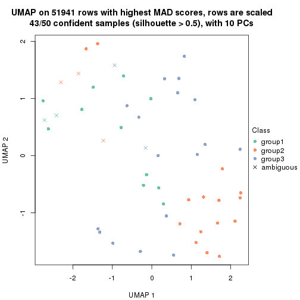</p>

</div>
<div id='tab-MAD-mclust-dimension-reduction-3'>
<pre><code class="r">dimension_reduction(res, k = 4, method = &quot;UMAP&quot;)
</code></pre>

<p></p>

</div>
<div id='tab-MAD-mclust-dimension-reduction-4'>
<pre><code class="r">dimension_reduction(res, k = 5, method = &quot;UMAP&quot;)
</code></pre>

<p></p>

</div>
<div id='tab-MAD-mclust-dimension-reduction-5'>
<pre><code class="r">dimension_reduction(res, k = 6, method = &quot;UMAP&quot;)
</code></pre>

<p></p>

</div>
</div>


Following heatmap shows how subgroups are split when increasing `k`:

```r
collect_classes(res)
```


Test correlation between subgroups and known annotations. If the known
annotation is numeric, one-way ANOVA test is applied, and if the known
annotation is discrete, chi-squared contingency table test is applied.

```r
test_to_known_factors(res)
```

```
#>             n disease.state(p) gender(p) k
#> MAD:mclust 48            0.718    0.3545 2
#> MAD:mclust 43            0.898    0.0851 3
#> MAD:mclust 47            0.635    0.2017 4
#> MAD:mclust 37            0.847    0.0877 5
#> MAD:mclust 42            0.806    0.0390 6
```


If matrix rows can be associated to genes, consider to use `functional_enrichment(res,
...)` to perform function enrichment for the signature genes. See [this vignette](http://bioconductor.org/packages/devel/bioc/vignettes/cola/inst/doc/functional_enrichment.html) for more detailed explanations.


 

---------------------------------------------------


### MAD:NMF


The object with results only for a single top-value method and a single partition method 
can be extracted as:

```r
res = res_list["MAD", "NMF"]
# you can also extract it by
# res = res_list["MAD:NMF"]
```

A summary of `res` and all the functions that can be applied to it:

```r
res
```

```
#> A 'ConsensusPartition' object with k = 2, 3, 4, 5, 6.
#>   On a matrix with 51941 rows and 50 columns.
#>   Top rows (1000, 2000, 3000, 4000, 5000) are extracted by 'MAD' method.
#>   Subgroups are detected by 'NMF' method.
#>   Performed in total 1250 partitions by row resampling.
#>   Best k for subgroups seems to be 2.
#> 
#> Following methods can be applied to this 'ConsensusPartition' object:
#>  [1] "cola_report"             "collect_classes"         "collect_plots"          
#>  [4] "collect_stats"           "colnames"                "compare_signatures"     
#>  [7] "consensus_heatmap"       "dimension_reduction"     "functional_enrichment"  
#> [10] "get_anno_col"            "get_anno"                "get_classes"            
#> [13] "get_consensus"           "get_matrix"              "get_membership"         
#> [16] "get_param"               "get_signatures"          "get_stats"              
#> [19] "is_best_k"               "is_stable_k"             "membership_heatmap"     
#> [22] "ncol"                    "nrow"                    "plot_ecdf"              
#> [25] "rownames"                "select_partition_number" "show"                   
#> [28] "suggest_best_k"          "test_to_known_factors"
```

`collect_plots()` function collects all the plots made from `res` for all `k` (number of partitions)
into one single page to provide an easy and fast comparison between different `k`.

```r
collect_plots(res)
```


The plots are:

- The first row: a plot of the ECDF (empirical cumulative distribution
  function) curves of the consensus matrix for each `k` and the heatmap of
  predicted classes for each `k`.
- The second row: heatmaps of the consensus matrix for each `k`.
- The third row: heatmaps of the membership matrix for each `k`.
- The fouth row: heatmaps of the signatures for each `k`.

All the plots in panels can be made by individual functions and they are
plotted later in this section.

`select_partition_number()` produces several plots showing different
statistics for choosing "optimized" `k`. There are following statistics:

- ECDF curves of the consensus matrix for each `k`;
- 1-PAC. [The PAC
  score](https://en.wikipedia.org/wiki/Consensus_clustering#Over-interpretation_potential_of_consensus_clustering)
  measures the proportion of the ambiguous subgrouping.
- Mean silhouette score.
- Concordance. The mean probability of fiting the consensus class ids in all
  partitions.
- Area increased. Denote $A_k$ as the area under the ECDF curve for current
  `k`, the area increased is defined as $A_k - A_{k-1}$.
- Rand index. The percent of pairs of samples that are both in a same cluster
  or both are not in a same cluster in the partition of k and k-1.
- Jaccard index. The ratio of pairs of samples are both in a same cluster in
  the partition of k and k-1 and the pairs of samples are both in a same
  cluster in the partition k or k-1.

The detailed explanations of these statistics can be found in [the _cola_
vignette](http://bioconductor.org/packages/devel/bioc/vignettes/cola/inst/doc/cola.html#toc_13).

Generally speaking, lower PAC score, higher mean silhouette score or higher
concordance corresponds to better partition. Rand index and Jaccard index
measure how similar the current partition is compared to partition with `k-1`.
If they are too similar, we won't accept `k` is better than `k-1`.

```r
select_partition_number(res)
```


The numeric values for all these statistics can be obtained by `get_stats()`.

```r
get_stats(res)
```

```
#>   k 1-PAC mean_silhouette concordance area_increased  Rand Jaccard
#> 2 2 0.508           0.852       0.917         0.5044 0.491   0.491
#> 3 3 0.332           0.575       0.763         0.3077 0.841   0.685
#> 4 4 0.343           0.382       0.637         0.1243 0.875   0.670
#> 5 5 0.426           0.305       0.580         0.0635 0.918   0.721
#> 6 6 0.465           0.255       0.533         0.0429 0.930   0.722
```

`suggest_best_k()` suggests the best $k$ based on these statistics. The rules are as follows:

- All $k$ with Jaccard index larger than 0.95 are removed because increasing
  $k$ does not provide enough extra information. If all $k$ are removed, it is
  marked as no subgroup is detected.
- For all $k$ with 1-PAC score larger than 0.9, the maximal $k$ is taken as
  the best $k$, and other $k$ are marked as optional $k$.
- If it does not fit the second rule. The $k$ with the maximal vote of the
  highest 1-PAC score, highest mean silhouette, and highest concordance is
  taken as the best $k$.

```r
suggest_best_k(res)
```

```
#> [1] 2
```


Following shows the table of the partitions (You need to click the **show/hide
code output** link to see it). The membership matrix (columns with name `p*`)
is inferred by
[`clue::cl_consensus()`](https://www.rdocumentation.org/link/cl_consensus?package=clue)
function with the `SE` method. Basically the value in the membership matrix
represents the probability to belong to a certain group. The finall class
label for an item is determined with the group with highest probability it
belongs to.

In `get_classes()` function, the entropy is calculated from the membership
matrix and the silhouette score is calculated from the consensus matrix.


<script>
$( function() {
	$( '#tabs-MAD-NMF-get-classes' ).tabs();
} );
</script>
<div id='tabs-MAD-NMF-get-classes'>
<ul>
<li><a href='#tab-MAD-NMF-get-classes-1'>k = 2</a></li>
<li><a href='#tab-MAD-NMF-get-classes-2'>k = 3</a></li>
<li><a href='#tab-MAD-NMF-get-classes-3'>k = 4</a></li>
<li><a href='#tab-MAD-NMF-get-classes-4'>k = 5</a></li>
<li><a href='#tab-MAD-NMF-get-classes-5'>k = 6</a></li>
</ul>

<div id='tab-MAD-NMF-get-classes-1'>
<p><a id='tab-MAD-NMF-get-classes-1-a' style='color:#0366d6' href='#'>show/hide code output</a></p>
<pre><code class="r">cbind(get_classes(res, k = 2), get_membership(res, k = 2))
</code></pre>

<pre><code>#&gt;           class entropy silhouette    p1    p2
#&gt; GSM624962     2  0.1184      0.906 0.016 0.984
#&gt; GSM624963     2  0.1184      0.909 0.016 0.984
#&gt; GSM624967     1  0.4939      0.886 0.892 0.108
#&gt; GSM624968     1  0.7056      0.821 0.808 0.192
#&gt; GSM624969     1  0.1184      0.912 0.984 0.016
#&gt; GSM624970     1  0.0672      0.912 0.992 0.008
#&gt; GSM624961     2  0.0376      0.908 0.004 0.996
#&gt; GSM624964     1  0.6623      0.837 0.828 0.172
#&gt; GSM624965     2  0.0938      0.908 0.012 0.988
#&gt; GSM624966     2  0.1843      0.901 0.028 0.972
#&gt; GSM624925     2  0.0938      0.907 0.012 0.988
#&gt; GSM624927     1  0.1184      0.912 0.984 0.016
#&gt; GSM624929     2  0.6247      0.808 0.156 0.844
#&gt; GSM624930     1  0.0672      0.911 0.992 0.008
#&gt; GSM624931     1  0.0938      0.908 0.988 0.012
#&gt; GSM624935     1  0.3431      0.900 0.936 0.064
#&gt; GSM624936     2  0.9323      0.518 0.348 0.652
#&gt; GSM624937     1  0.0672      0.912 0.992 0.008
#&gt; GSM624926     2  0.1414      0.908 0.020 0.980
#&gt; GSM624928     2  0.0938      0.908 0.012 0.988
#&gt; GSM624932     2  0.2948      0.889 0.052 0.948
#&gt; GSM624933     2  0.5737      0.820 0.136 0.864
#&gt; GSM624934     2  0.9996      0.120 0.488 0.512
#&gt; GSM624971     2  0.6247      0.789 0.156 0.844
#&gt; GSM624973     1  0.7815      0.784 0.768 0.232
#&gt; GSM624938     2  0.5737      0.835 0.136 0.864
#&gt; GSM624940     1  0.1633      0.908 0.976 0.024
#&gt; GSM624941     1  0.0000      0.911 1.000 0.000
#&gt; GSM624942     1  0.0000      0.911 1.000 0.000
#&gt; GSM624943     1  0.1633      0.911 0.976 0.024
#&gt; GSM624945     2  0.2043      0.900 0.032 0.968
#&gt; GSM624946     1  0.7139      0.789 0.804 0.196
#&gt; GSM624949     1  0.6801      0.791 0.820 0.180
#&gt; GSM624951     1  0.0672      0.909 0.992 0.008
#&gt; GSM624952     2  0.0938      0.906 0.012 0.988
#&gt; GSM624955     1  0.7376      0.806 0.792 0.208
#&gt; GSM624956     2  0.0672      0.905 0.008 0.992
#&gt; GSM624957     1  0.1184      0.912 0.984 0.016
#&gt; GSM624974     1  0.2423      0.910 0.960 0.040
#&gt; GSM624939     1  0.1414      0.910 0.980 0.020
#&gt; GSM624944     1  0.8016      0.760 0.756 0.244
#&gt; GSM624947     1  0.6247      0.848 0.844 0.156
#&gt; GSM624948     2  0.0938      0.908 0.012 0.988
#&gt; GSM624950     1  0.6048      0.855 0.852 0.148
#&gt; GSM624953     2  0.0376      0.908 0.004 0.996
#&gt; GSM624954     1  0.2236      0.911 0.964 0.036
#&gt; GSM624958     2  0.1414      0.907 0.020 0.980
#&gt; GSM624959     2  0.1184      0.908 0.016 0.984
#&gt; GSM624960     2  0.8763      0.555 0.296 0.704
#&gt; GSM624972     2  0.0938      0.908 0.012 0.988
</code></pre>

<script>
$('#tab-MAD-NMF-get-classes-1-a').parent().next().next().hide();
$('#tab-MAD-NMF-get-classes-1-a').click(function(){
  $('#tab-MAD-NMF-get-classes-1-a').parent().next().next().toggle();
  return(false);
});
</script>
</div>

<div id='tab-MAD-NMF-get-classes-2'>
<p><a id='tab-MAD-NMF-get-classes-2-a' style='color:#0366d6' href='#'>show/hide code output</a></p>
<pre><code class="r">cbind(get_classes(res, k = 3), get_membership(res, k = 3))
</code></pre>

<pre><code>#&gt;           class entropy silhouette    p1    p2    p3
#&gt; GSM624962     3  0.6252    0.38502 0.008 0.344 0.648
#&gt; GSM624963     2  0.6096    0.52071 0.016 0.704 0.280
#&gt; GSM624967     1  0.5608    0.74032 0.808 0.120 0.072
#&gt; GSM624968     1  0.7578    0.26837 0.500 0.040 0.460
#&gt; GSM624969     1  0.3623    0.76258 0.896 0.072 0.032
#&gt; GSM624970     1  0.2339    0.76710 0.940 0.012 0.048
#&gt; GSM624961     2  0.2959    0.65810 0.000 0.900 0.100
#&gt; GSM624964     1  0.5526    0.70950 0.792 0.172 0.036
#&gt; GSM624965     2  0.2313    0.68578 0.032 0.944 0.024
#&gt; GSM624966     3  0.5760    0.47678 0.000 0.328 0.672
#&gt; GSM624925     2  0.6299    0.00547 0.000 0.524 0.476
#&gt; GSM624927     1  0.2774    0.76912 0.920 0.072 0.008
#&gt; GSM624929     2  0.6455    0.58230 0.128 0.764 0.108
#&gt; GSM624930     1  0.3472    0.76760 0.904 0.040 0.056
#&gt; GSM624931     1  0.4654    0.67961 0.792 0.000 0.208
#&gt; GSM624935     1  0.6632    0.57147 0.692 0.272 0.036
#&gt; GSM624936     2  0.9394    0.26483 0.224 0.508 0.268
#&gt; GSM624937     1  0.2651    0.76979 0.928 0.012 0.060
#&gt; GSM624926     2  0.5719    0.63847 0.052 0.792 0.156
#&gt; GSM624928     2  0.1525    0.68442 0.004 0.964 0.032
#&gt; GSM624932     2  0.6282    0.40137 0.012 0.664 0.324
#&gt; GSM624933     2  0.6057    0.54347 0.196 0.760 0.044
#&gt; GSM624934     2  0.6482    0.45749 0.296 0.680 0.024
#&gt; GSM624971     3  0.3845    0.61460 0.012 0.116 0.872
#&gt; GSM624973     3  0.7617    0.47117 0.152 0.160 0.688
#&gt; GSM624938     3  0.3207    0.61701 0.012 0.084 0.904
#&gt; GSM624940     1  0.6647    0.32750 0.540 0.008 0.452
#&gt; GSM624941     1  0.2878    0.74690 0.904 0.000 0.096
#&gt; GSM624942     1  0.2301    0.76131 0.936 0.004 0.060
#&gt; GSM624943     1  0.3802    0.76385 0.888 0.080 0.032
#&gt; GSM624945     2  0.6742    0.44390 0.028 0.656 0.316
#&gt; GSM624946     3  0.3425    0.57888 0.112 0.004 0.884
#&gt; GSM624949     1  0.7479    0.61213 0.660 0.076 0.264
#&gt; GSM624951     1  0.3686    0.72618 0.860 0.000 0.140
#&gt; GSM624952     3  0.6057    0.39496 0.004 0.340 0.656
#&gt; GSM624955     3  0.6867    0.27448 0.288 0.040 0.672
#&gt; GSM624956     3  0.6154    0.24219 0.000 0.408 0.592
#&gt; GSM624957     1  0.4749    0.74718 0.844 0.116 0.040
#&gt; GSM624974     1  0.8503    0.50989 0.576 0.120 0.304
#&gt; GSM624939     1  0.7600    0.52807 0.612 0.060 0.328
#&gt; GSM624944     1  0.7622    0.52272 0.608 0.332 0.060
#&gt; GSM624947     1  0.6351    0.70078 0.760 0.168 0.072
#&gt; GSM624948     2  0.0829    0.68808 0.004 0.984 0.012
#&gt; GSM624950     1  0.5566    0.72917 0.812 0.108 0.080
#&gt; GSM624953     2  0.4399    0.59205 0.000 0.812 0.188
#&gt; GSM624954     1  0.6373    0.64543 0.704 0.268 0.028
#&gt; GSM624958     2  0.3683    0.67812 0.044 0.896 0.060
#&gt; GSM624959     2  0.1647    0.68063 0.036 0.960 0.004
#&gt; GSM624960     2  0.8645    0.39741 0.268 0.584 0.148
#&gt; GSM624972     2  0.4521    0.62297 0.004 0.816 0.180
</code></pre>

<script>
$('#tab-MAD-NMF-get-classes-2-a').parent().next().next().hide();
$('#tab-MAD-NMF-get-classes-2-a').click(function(){
  $('#tab-MAD-NMF-get-classes-2-a').parent().next().next().toggle();
  return(false);
});
</script>
</div>

<div id='tab-MAD-NMF-get-classes-3'>
<p><a id='tab-MAD-NMF-get-classes-3-a' style='color:#0366d6' href='#'>show/hide code output</a></p>
<pre><code class="r">cbind(get_classes(res, k = 4), get_membership(res, k = 4))
</code></pre>

<pre><code>#&gt;           class entropy silhouette    p1    p2    p3    p4
#&gt; GSM624962     3   0.649     0.5003 0.012 0.256 0.644 0.088
#&gt; GSM624963     2   0.777     0.2924 0.020 0.528 0.276 0.176
#&gt; GSM624967     1   0.727     0.0878 0.492 0.032 0.068 0.408
#&gt; GSM624968     4   0.699     0.3900 0.188 0.004 0.208 0.600
#&gt; GSM624969     1   0.457     0.5733 0.808 0.116 0.004 0.072
#&gt; GSM624970     1   0.478     0.5169 0.760 0.008 0.024 0.208
#&gt; GSM624961     2   0.367     0.5474 0.004 0.852 0.116 0.028
#&gt; GSM624964     1   0.727     0.2649 0.572 0.176 0.008 0.244
#&gt; GSM624965     2   0.484     0.5834 0.028 0.792 0.028 0.152
#&gt; GSM624966     3   0.693     0.4945 0.008 0.176 0.620 0.196
#&gt; GSM624925     3   0.790     0.1986 0.020 0.412 0.416 0.152
#&gt; GSM624927     1   0.426     0.5791 0.832 0.100 0.008 0.060
#&gt; GSM624929     2   0.657     0.4996 0.132 0.708 0.100 0.060
#&gt; GSM624930     1   0.502     0.5709 0.808 0.084 0.056 0.052
#&gt; GSM624931     1   0.599     0.4932 0.716 0.020 0.184 0.080
#&gt; GSM624935     1   0.760     0.1759 0.480 0.188 0.004 0.328
#&gt; GSM624936     2   0.875     0.1975 0.232 0.456 0.252 0.060
#&gt; GSM624937     1   0.578     0.4195 0.660 0.016 0.028 0.296
#&gt; GSM624926     4   0.641     0.1150 0.008 0.332 0.064 0.596
#&gt; GSM624928     2   0.286     0.6018 0.000 0.888 0.016 0.096
#&gt; GSM624932     2   0.745     0.2469 0.076 0.568 0.304 0.052
#&gt; GSM624933     2   0.651     0.1839 0.084 0.556 0.000 0.360
#&gt; GSM624934     2   0.677     0.3424 0.288 0.620 0.044 0.048
#&gt; GSM624971     3   0.352     0.5450 0.004 0.020 0.856 0.120
#&gt; GSM624973     3   0.824     0.1876 0.156 0.112 0.576 0.156
#&gt; GSM624938     3   0.264     0.5780 0.008 0.032 0.916 0.044
#&gt; GSM624940     1   0.733     0.2411 0.484 0.032 0.412 0.072
#&gt; GSM624941     1   0.338     0.5563 0.876 0.004 0.040 0.080
#&gt; GSM624942     1   0.335     0.5821 0.888 0.056 0.036 0.020
#&gt; GSM624943     1   0.575     0.5672 0.760 0.096 0.040 0.104
#&gt; GSM624945     2   0.759     0.2827 0.088 0.572 0.284 0.056
#&gt; GSM624946     3   0.378     0.4833 0.052 0.000 0.848 0.100
#&gt; GSM624949     4   0.889     0.1805 0.320 0.056 0.232 0.392
#&gt; GSM624951     1   0.461     0.5322 0.800 0.000 0.104 0.096
#&gt; GSM624952     3   0.613     0.4484 0.016 0.300 0.640 0.044
#&gt; GSM624955     4   0.671     0.1168 0.092 0.000 0.400 0.508
#&gt; GSM624956     3   0.669     0.4112 0.004 0.320 0.580 0.096
#&gt; GSM624957     1   0.638     0.5297 0.712 0.152 0.044 0.092
#&gt; GSM624974     1   0.860     0.3006 0.480 0.228 0.236 0.056
#&gt; GSM624939     1   0.808     0.3647 0.544 0.092 0.276 0.088
#&gt; GSM624944     4   0.715     0.3498 0.216 0.224 0.000 0.560
#&gt; GSM624947     1   0.737    -0.0486 0.452 0.124 0.008 0.416
#&gt; GSM624948     2   0.408     0.5988 0.008 0.832 0.032 0.128
#&gt; GSM624950     4   0.651    -0.1282 0.468 0.052 0.008 0.472
#&gt; GSM624953     2   0.477     0.5188 0.012 0.792 0.152 0.044
#&gt; GSM624954     1   0.645     0.3326 0.544 0.380 0.000 0.076
#&gt; GSM624958     2   0.608     0.3185 0.004 0.580 0.044 0.372
#&gt; GSM624959     2   0.361     0.5903 0.024 0.844 0.000 0.132
#&gt; GSM624960     4   0.706     0.3469 0.088 0.232 0.044 0.636
#&gt; GSM624972     2   0.701     0.4252 0.024 0.612 0.100 0.264
</code></pre>

<script>
$('#tab-MAD-NMF-get-classes-3-a').parent().next().next().hide();
$('#tab-MAD-NMF-get-classes-3-a').click(function(){
  $('#tab-MAD-NMF-get-classes-3-a').parent().next().next().toggle();
  return(false);
});
</script>
</div>

<div id='tab-MAD-NMF-get-classes-4'>
<p><a id='tab-MAD-NMF-get-classes-4-a' style='color:#0366d6' href='#'>show/hide code output</a></p>
<pre><code class="r">cbind(get_classes(res, k = 5), get_membership(res, k = 5))
</code></pre>

<pre><code>#&gt;           class entropy silhouette    p1    p2    p3    p4    p5
#&gt; GSM624962     3   0.755     0.3024 0.000 0.252 0.480 0.080 0.188
#&gt; GSM624963     2   0.782     0.3270 0.008 0.476 0.156 0.096 0.264
#&gt; GSM624967     5   0.816     0.5449 0.272 0.016 0.056 0.324 0.332
#&gt; GSM624968     4   0.678     0.1860 0.148 0.000 0.216 0.580 0.056
#&gt; GSM624969     1   0.639     0.2553 0.612 0.088 0.008 0.040 0.252
#&gt; GSM624970     1   0.638     0.1532 0.592 0.012 0.008 0.148 0.240
#&gt; GSM624961     2   0.267     0.5601 0.008 0.900 0.052 0.004 0.036
#&gt; GSM624964     1   0.758    -0.0308 0.500 0.148 0.012 0.272 0.068
#&gt; GSM624965     2   0.504     0.5228 0.000 0.724 0.008 0.144 0.124
#&gt; GSM624966     3   0.743     0.3748 0.020 0.184 0.532 0.220 0.044
#&gt; GSM624925     2   0.758    -0.0410 0.020 0.440 0.344 0.160 0.036
#&gt; GSM624927     1   0.523     0.3691 0.708 0.064 0.000 0.028 0.200
#&gt; GSM624929     2   0.586     0.4730 0.072 0.652 0.032 0.004 0.240
#&gt; GSM624930     1   0.558     0.3668 0.648 0.064 0.016 0.004 0.268
#&gt; GSM624931     1   0.488     0.3846 0.752 0.020 0.168 0.008 0.052
#&gt; GSM624935     1   0.824    -0.2266 0.304 0.112 0.000 0.284 0.300
#&gt; GSM624936     2   0.826     0.1283 0.140 0.376 0.252 0.000 0.232
#&gt; GSM624937     5   0.683     0.5690 0.356 0.000 0.016 0.176 0.452
#&gt; GSM624926     4   0.464     0.3500 0.000 0.216 0.008 0.728 0.048
#&gt; GSM624928     2   0.246     0.5731 0.004 0.892 0.000 0.092 0.012
#&gt; GSM624932     2   0.670     0.3435 0.044 0.596 0.204 0.004 0.152
#&gt; GSM624933     4   0.752     0.1307 0.092 0.360 0.000 0.424 0.124
#&gt; GSM624934     2   0.700     0.0816 0.284 0.504 0.024 0.004 0.184
#&gt; GSM624971     3   0.322     0.5337 0.004 0.012 0.860 0.104 0.020
#&gt; GSM624973     3   0.756     0.2718 0.172 0.100 0.588 0.080 0.060
#&gt; GSM624938     3   0.269     0.5706 0.016 0.028 0.908 0.020 0.028
#&gt; GSM624940     1   0.701     0.2174 0.496 0.024 0.348 0.020 0.112
#&gt; GSM624941     1   0.414     0.3870 0.828 0.016 0.036 0.032 0.088
#&gt; GSM624942     1   0.365     0.4270 0.848 0.040 0.016 0.008 0.088
#&gt; GSM624943     1   0.599     0.3252 0.644 0.076 0.000 0.048 0.232
#&gt; GSM624945     2   0.676     0.3518 0.036 0.580 0.196 0.004 0.184
#&gt; GSM624946     3   0.318     0.5021 0.048 0.000 0.868 0.072 0.012
#&gt; GSM624949     4   0.885    -0.1127 0.204 0.028 0.224 0.380 0.164
#&gt; GSM624951     1   0.439     0.3807 0.800 0.000 0.072 0.036 0.092
#&gt; GSM624952     3   0.637     0.3023 0.004 0.316 0.560 0.024 0.096
#&gt; GSM624955     4   0.662     0.1679 0.060 0.000 0.348 0.520 0.072
#&gt; GSM624956     3   0.701     0.2629 0.000 0.320 0.508 0.072 0.100
#&gt; GSM624957     1   0.727     0.2827 0.516 0.072 0.036 0.052 0.324
#&gt; GSM624974     1   0.770     0.2970 0.504 0.240 0.164 0.012 0.080
#&gt; GSM624939     1   0.712     0.3492 0.604 0.092 0.196 0.028 0.080
#&gt; GSM624944     4   0.637     0.2947 0.064 0.196 0.000 0.632 0.108
#&gt; GSM624947     4   0.747     0.0868 0.284 0.076 0.044 0.532 0.064
#&gt; GSM624948     2   0.513     0.5487 0.000 0.732 0.024 0.148 0.096
#&gt; GSM624950     4   0.643    -0.0876 0.320 0.016 0.020 0.564 0.080
#&gt; GSM624953     2   0.367     0.5478 0.008 0.852 0.076 0.036 0.028
#&gt; GSM624954     1   0.684     0.2287 0.504 0.344 0.000 0.060 0.092
#&gt; GSM624958     2   0.555     0.1704 0.004 0.524 0.004 0.420 0.048
#&gt; GSM624959     2   0.337     0.5420 0.016 0.840 0.000 0.128 0.016
#&gt; GSM624960     4   0.586     0.3261 0.028 0.128 0.024 0.708 0.112
#&gt; GSM624972     2   0.691     0.3635 0.048 0.592 0.056 0.256 0.048
</code></pre>

<script>
$('#tab-MAD-NMF-get-classes-4-a').parent().next().next().hide();
$('#tab-MAD-NMF-get-classes-4-a').click(function(){
  $('#tab-MAD-NMF-get-classes-4-a').parent().next().next().toggle();
  return(false);
});
</script>
</div>

<div id='tab-MAD-NMF-get-classes-5'>
<p><a id='tab-MAD-NMF-get-classes-5-a' style='color:#0366d6' href='#'>show/hide code output</a></p>
<pre><code class="r">cbind(get_classes(res, k = 6), get_membership(res, k = 6))
</code></pre>

<pre><code>#&gt;           class entropy silhouette    p1    p2    p3    p4    p5    p6
#&gt; GSM624962     3   0.699     0.0930 0.008 0.288 0.460 0.012 0.040 0.192
#&gt; GSM624963     2   0.804     0.1914 0.036 0.392 0.228 0.040 0.044 0.260
#&gt; GSM624967     6   0.817     0.5227 0.264 0.016 0.056 0.236 0.064 0.364
#&gt; GSM624968     4   0.773     0.0990 0.100 0.004 0.308 0.424 0.064 0.100
#&gt; GSM624969     1   0.566     0.2529 0.692 0.068 0.000 0.028 0.104 0.108
#&gt; GSM624970     1   0.692     0.2660 0.552 0.008 0.012 0.104 0.188 0.136
#&gt; GSM624961     2   0.325     0.5530 0.004 0.868 0.028 0.036 0.040 0.024
#&gt; GSM624964     1   0.694    -0.0374 0.484 0.080 0.016 0.340 0.036 0.044
#&gt; GSM624965     2   0.618     0.4631 0.036 0.652 0.024 0.108 0.024 0.156
#&gt; GSM624966     3   0.762     0.2775 0.000 0.188 0.448 0.116 0.216 0.032
#&gt; GSM624925     2   0.844     0.1757 0.040 0.408 0.268 0.080 0.120 0.084
#&gt; GSM624927     1   0.588     0.3639 0.644 0.040 0.000 0.024 0.184 0.108
#&gt; GSM624929     2   0.665     0.4706 0.104 0.616 0.048 0.024 0.036 0.172
#&gt; GSM624930     1   0.643     0.3332 0.544 0.020 0.008 0.012 0.232 0.184
#&gt; GSM624931     1   0.611    -0.0611 0.448 0.020 0.044 0.008 0.444 0.036
#&gt; GSM624935     1   0.766    -0.0464 0.440 0.100 0.004 0.168 0.032 0.256
#&gt; GSM624936     5   0.791    -0.0270 0.108 0.324 0.068 0.004 0.388 0.108
#&gt; GSM624937     6   0.697     0.5253 0.332 0.004 0.012 0.152 0.056 0.444
#&gt; GSM624926     4   0.539     0.3991 0.004 0.224 0.068 0.664 0.012 0.028
#&gt; GSM624928     2   0.330     0.5317 0.004 0.848 0.008 0.096 0.016 0.028
#&gt; GSM624932     2   0.714     0.2076 0.012 0.468 0.092 0.012 0.312 0.104
#&gt; GSM624933     4   0.755     0.2151 0.136 0.300 0.008 0.432 0.024 0.100
#&gt; GSM624934     2   0.847    -0.0824 0.216 0.344 0.016 0.044 0.244 0.136
#&gt; GSM624971     3   0.434     0.4069 0.000 0.012 0.740 0.060 0.184 0.004
#&gt; GSM624973     3   0.701     0.0588 0.024 0.060 0.428 0.088 0.388 0.012
#&gt; GSM624938     3   0.408     0.3959 0.000 0.020 0.744 0.008 0.212 0.016
#&gt; GSM624940     5   0.582     0.3389 0.208 0.004 0.112 0.008 0.632 0.036
#&gt; GSM624941     1   0.557     0.3479 0.668 0.024 0.024 0.020 0.220 0.044
#&gt; GSM624942     1   0.483     0.3120 0.672 0.036 0.008 0.004 0.264 0.016
#&gt; GSM624943     1   0.454     0.3419 0.776 0.048 0.008 0.020 0.028 0.120
#&gt; GSM624945     2   0.734     0.3765 0.048 0.564 0.148 0.020 0.120 0.100
#&gt; GSM624946     3   0.376     0.3734 0.004 0.000 0.740 0.016 0.236 0.004
#&gt; GSM624949     3   0.862    -0.1654 0.212 0.032 0.356 0.220 0.040 0.140
#&gt; GSM624951     1   0.545     0.2042 0.544 0.000 0.028 0.020 0.380 0.028
#&gt; GSM624952     3   0.691     0.0705 0.004 0.340 0.452 0.008 0.116 0.080
#&gt; GSM624955     3   0.705    -0.1011 0.056 0.004 0.480 0.308 0.032 0.120
#&gt; GSM624956     3   0.649     0.0549 0.004 0.352 0.480 0.008 0.044 0.112
#&gt; GSM624957     1   0.720     0.2930 0.528 0.044 0.004 0.064 0.184 0.176
#&gt; GSM624974     5   0.626     0.3879 0.184 0.176 0.016 0.024 0.592 0.008
#&gt; GSM624939     5   0.526     0.4022 0.204 0.060 0.040 0.008 0.684 0.004
#&gt; GSM624944     4   0.552     0.3754 0.036 0.120 0.012 0.712 0.028 0.092
#&gt; GSM624947     4   0.754     0.2260 0.220 0.044 0.084 0.532 0.064 0.056
#&gt; GSM624948     2   0.554     0.4922 0.012 0.700 0.044 0.112 0.012 0.120
#&gt; GSM624950     4   0.681     0.0792 0.312 0.000 0.056 0.500 0.040 0.092
#&gt; GSM624953     2   0.482     0.5236 0.020 0.776 0.052 0.044 0.084 0.024
#&gt; GSM624954     1   0.783     0.0730 0.420 0.276 0.004 0.096 0.156 0.048
#&gt; GSM624958     2   0.589     0.0733 0.004 0.492 0.048 0.408 0.012 0.036
#&gt; GSM624959     2   0.436     0.4863 0.032 0.768 0.004 0.156 0.020 0.020
#&gt; GSM624960     4   0.580     0.4025 0.016 0.112 0.072 0.700 0.028 0.072
#&gt; GSM624972     2   0.771     0.2101 0.076 0.488 0.056 0.260 0.088 0.032
</code></pre>

<script>
$('#tab-MAD-NMF-get-classes-5-a').parent().next().next().hide();
$('#tab-MAD-NMF-get-classes-5-a').click(function(){
  $('#tab-MAD-NMF-get-classes-5-a').parent().next().next().toggle();
  return(false);
});
</script>
</div>
</div>

Heatmaps for the consensus matrix. It visualizes the probability of two
samples to be in a same group.


<script>
$( function() {
	$( '#tabs-MAD-NMF-consensus-heatmap' ).tabs();
} );
</script>
<div id='tabs-MAD-NMF-consensus-heatmap'>
<ul>
<li><a href='#tab-MAD-NMF-consensus-heatmap-1'>k = 2</a></li>
<li><a href='#tab-MAD-NMF-consensus-heatmap-2'>k = 3</a></li>
<li><a href='#tab-MAD-NMF-consensus-heatmap-3'>k = 4</a></li>
<li><a href='#tab-MAD-NMF-consensus-heatmap-4'>k = 5</a></li>
<li><a href='#tab-MAD-NMF-consensus-heatmap-5'>k = 6</a></li>
</ul>
<div id='tab-MAD-NMF-consensus-heatmap-1'>
<pre><code class="r">consensus_heatmap(res, k = 2)
</code></pre>

<p></p>

</div>
<div id='tab-MAD-NMF-consensus-heatmap-2'>
<pre><code class="r">consensus_heatmap(res, k = 3)
</code></pre>

<p></p>

</div>
<div id='tab-MAD-NMF-consensus-heatmap-3'>
<pre><code class="r">consensus_heatmap(res, k = 4)
</code></pre>

<p></p>

</div>
<div id='tab-MAD-NMF-consensus-heatmap-4'>
<pre><code class="r">consensus_heatmap(res, k = 5)
</code></pre>

<p></p>

</div>
<div id='tab-MAD-NMF-consensus-heatmap-5'>
<pre><code class="r">consensus_heatmap(res, k = 6)
</code></pre>

<p></p>

</div>
</div>

Heatmaps for the membership of samples in all partitions to see how consistent they are:


<script>
$( function() {
	$( '#tabs-MAD-NMF-membership-heatmap' ).tabs();
} );
</script>
<div id='tabs-MAD-NMF-membership-heatmap'>
<ul>
<li><a href='#tab-MAD-NMF-membership-heatmap-1'>k = 2</a></li>
<li><a href='#tab-MAD-NMF-membership-heatmap-2'>k = 3</a></li>
<li><a href='#tab-MAD-NMF-membership-heatmap-3'>k = 4</a></li>
<li><a href='#tab-MAD-NMF-membership-heatmap-4'>k = 5</a></li>
<li><a href='#tab-MAD-NMF-membership-heatmap-5'>k = 6</a></li>
</ul>
<div id='tab-MAD-NMF-membership-heatmap-1'>
<pre><code class="r">membership_heatmap(res, k = 2)
</code></pre>

<p></p>

</div>
<div id='tab-MAD-NMF-membership-heatmap-2'>
<pre><code class="r">membership_heatmap(res, k = 3)
</code></pre>

<p></p>

</div>
<div id='tab-MAD-NMF-membership-heatmap-3'>
<pre><code class="r">membership_heatmap(res, k = 4)
</code></pre>

<p></p>

</div>
<div id='tab-MAD-NMF-membership-heatmap-4'>
<pre><code class="r">membership_heatmap(res, k = 5)
</code></pre>

<p></p>

</div>
<div id='tab-MAD-NMF-membership-heatmap-5'>
<pre><code class="r">membership_heatmap(res, k = 6)
</code></pre>

<p></p>

</div>
</div>

As soon as we have had the classes for columns, we can look for signatures
which are significantly different between classes which can be candidate marks
for certain classes. Following are the heatmaps for signatures.


Signature heatmaps where rows are scaled:


<script>
$( function() {
	$( '#tabs-MAD-NMF-get-signatures' ).tabs();
} );
</script>
<div id='tabs-MAD-NMF-get-signatures'>
<ul>
<li><a href='#tab-MAD-NMF-get-signatures-1'>k = 2</a></li>
<li><a href='#tab-MAD-NMF-get-signatures-2'>k = 3</a></li>
<li><a href='#tab-MAD-NMF-get-signatures-3'>k = 4</a></li>
<li><a href='#tab-MAD-NMF-get-signatures-4'>k = 5</a></li>
<li><a href='#tab-MAD-NMF-get-signatures-5'>k = 6</a></li>
</ul>
<div id='tab-MAD-NMF-get-signatures-1'>
<pre><code class="r">get_signatures(res, k = 2)
</code></pre>

<p>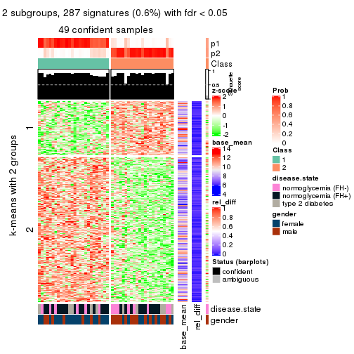</p>

</div>
<div id='tab-MAD-NMF-get-signatures-2'>
<pre><code class="r">get_signatures(res, k = 3)
</code></pre>

<p>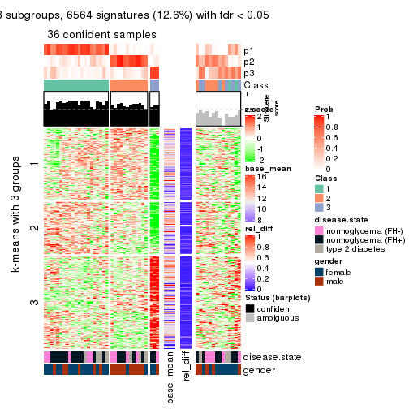</p>

</div>
<div id='tab-MAD-NMF-get-signatures-3'>
<pre><code class="r">get_signatures(res, k = 4)
</code></pre>

<p>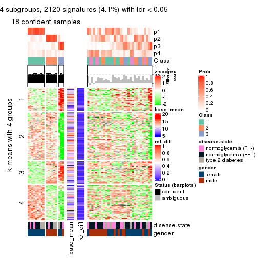</p>

</div>
<div id='tab-MAD-NMF-get-signatures-4'>
<pre><code class="r">get_signatures(res, k = 5)
</code></pre>

<p></p>

</div>
<div id='tab-MAD-NMF-get-signatures-5'>
<pre><code class="r">get_signatures(res, k = 6)
</code></pre>

<p></p>

</div>
</div>


Signature heatmaps where rows are not scaled:


<script>
$( function() {
	$( '#tabs-MAD-NMF-get-signatures-no-scale' ).tabs();
} );
</script>
<div id='tabs-MAD-NMF-get-signatures-no-scale'>
<ul>
<li><a href='#tab-MAD-NMF-get-signatures-no-scale-1'>k = 2</a></li>
<li><a href='#tab-MAD-NMF-get-signatures-no-scale-2'>k = 3</a></li>
<li><a href='#tab-MAD-NMF-get-signatures-no-scale-3'>k = 4</a></li>
<li><a href='#tab-MAD-NMF-get-signatures-no-scale-4'>k = 5</a></li>
<li><a href='#tab-MAD-NMF-get-signatures-no-scale-5'>k = 6</a></li>
</ul>
<div id='tab-MAD-NMF-get-signatures-no-scale-1'>
<pre><code class="r">get_signatures(res, k = 2, scale_rows = FALSE)
</code></pre>

<p></p>

</div>
<div id='tab-MAD-NMF-get-signatures-no-scale-2'>
<pre><code class="r">get_signatures(res, k = 3, scale_rows = FALSE)
</code></pre>

<p></p>

</div>
<div id='tab-MAD-NMF-get-signatures-no-scale-3'>
<pre><code class="r">get_signatures(res, k = 4, scale_rows = FALSE)
</code></pre>

<p></p>

</div>
<div id='tab-MAD-NMF-get-signatures-no-scale-4'>
<pre><code class="r">get_signatures(res, k = 5, scale_rows = FALSE)
</code></pre>

<p></p>

</div>
<div id='tab-MAD-NMF-get-signatures-no-scale-5'>
<pre><code class="r">get_signatures(res, k = 6, scale_rows = FALSE)
</code></pre>

<p></p>

</div>
</div>


Compare the overlap of signatures from different k:

```r
compare_signatures(res)
```

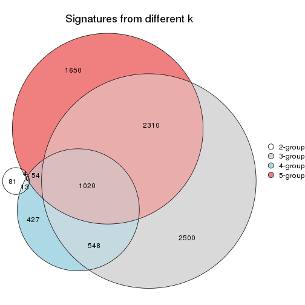

`get_signature()` returns a data frame invisibly. TO get the list of signatures, the function
call should be assigned to a variable explicitly. In following code, if `plot` argument is set
to `FALSE`, no heatmap is plotted while only the differential analysis is performed.

```r
# code only for demonstration
tb = get_signature(res, k = ..., plot = FALSE)
```

An example of the output of `tb` is:

```
#>   which_row         fdr    mean_1    mean_2 scaled_mean_1 scaled_mean_2 km
#> 1        38 0.042760348  8.373488  9.131774    -0.5533452     0.5164555  1
#> 2        40 0.018707592  7.106213  8.469186    -0.6173731     0.5762149  1
#> 3        55 0.019134737 10.221463 11.207825    -0.6159697     0.5749050  1
#> 4        59 0.006059896  5.921854  7.869574    -0.6899429     0.6439467  1
#> 5        60 0.018055526  8.928898 10.211722    -0.6204761     0.5791110  1
#> 6        98 0.009384629 15.714769 14.887706     0.6635654    -0.6193277  2
...
```

The columns in `tb` are:

1. `which_row`: row indices corresponding to the input matrix.
2. `fdr`: FDR for the differential test. 
3. `mean_x`: The mean value in group x.
4. `scaled_mean_x`: The mean value in group x after rows are scaled.
5. `km`: Row groups if k-means clustering is applied to rows.


UMAP plot which shows how samples are separated.


<script>
$( function() {
	$( '#tabs-MAD-NMF-dimension-reduction' ).tabs();
} );
</script>
<div id='tabs-MAD-NMF-dimension-reduction'>
<ul>
<li><a href='#tab-MAD-NMF-dimension-reduction-1'>k = 2</a></li>
<li><a href='#tab-MAD-NMF-dimension-reduction-2'>k = 3</a></li>
<li><a href='#tab-MAD-NMF-dimension-reduction-3'>k = 4</a></li>
<li><a href='#tab-MAD-NMF-dimension-reduction-4'>k = 5</a></li>
<li><a href='#tab-MAD-NMF-dimension-reduction-5'>k = 6</a></li>
</ul>
<div id='tab-MAD-NMF-dimension-reduction-1'>
<pre><code class="r">dimension_reduction(res, k = 2, method = &quot;UMAP&quot;)
</code></pre>

<p></p>

</div>
<div id='tab-MAD-NMF-dimension-reduction-2'>
<pre><code class="r">dimension_reduction(res, k = 3, method = &quot;UMAP&quot;)
</code></pre>

<p></p>

</div>
<div id='tab-MAD-NMF-dimension-reduction-3'>
<pre><code class="r">dimension_reduction(res, k = 4, method = &quot;UMAP&quot;)
</code></pre>

<p></p>

</div>
<div id='tab-MAD-NMF-dimension-reduction-4'>
<pre><code class="r">dimension_reduction(res, k = 5, method = &quot;UMAP&quot;)
</code></pre>

<p></p>

</div>
<div id='tab-MAD-NMF-dimension-reduction-5'>
<pre><code class="r">dimension_reduction(res, k = 6, method = &quot;UMAP&quot;)
</code></pre>

<p>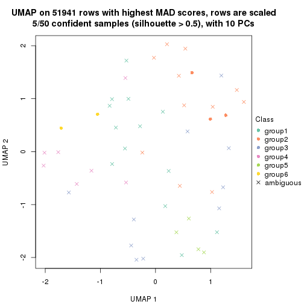</p>

</div>
</div>


Following heatmap shows how subgroups are split when increasing `k`:

```r
collect_classes(res)
```


Test correlation between subgroups and known annotations. If the known
annotation is numeric, one-way ANOVA test is applied, and if the known
annotation is discrete, chi-squared contingency table test is applied.

```r
test_to_known_factors(res)
```

```
#>          n disease.state(p) gender(p) k
#> MAD:NMF 49            0.575  0.035104 2
#> MAD:NMF 36            0.822  0.008907 3
#> MAD:NMF 18            0.955  0.000502 4
#> MAD:NMF 11            0.529  0.017257 5
#> MAD:NMF  5            0.659  0.192106 6
```


If matrix rows can be associated to genes, consider to use `functional_enrichment(res,
...)` to perform function enrichment for the signature genes. See [this vignette](http://bioconductor.org/packages/devel/bioc/vignettes/cola/inst/doc/functional_enrichment.html) for more detailed explanations.


 

---------------------------------------------------


### ATC:hclust


The object with results only for a single top-value method and a single partition method 
can be extracted as:

```r
res = res_list["ATC", "hclust"]
# you can also extract it by
# res = res_list["ATC:hclust"]
```

A summary of `res` and all the functions that can be applied to it:

```r
res
```

```
#> A 'ConsensusPartition' object with k = 2, 3, 4, 5, 6.
#>   On a matrix with 51941 rows and 50 columns.
#>   Top rows (1000, 2000, 3000, 4000, 5000) are extracted by 'ATC' method.
#>   Subgroups are detected by 'hclust' method.
#>   Performed in total 1250 partitions by row resampling.
#>   Best k for subgroups seems to be 4.
#> 
#> Following methods can be applied to this 'ConsensusPartition' object:
#>  [1] "cola_report"             "collect_classes"         "collect_plots"          
#>  [4] "collect_stats"           "colnames"                "compare_signatures"     
#>  [7] "consensus_heatmap"       "dimension_reduction"     "functional_enrichment"  
#> [10] "get_anno_col"            "get_anno"                "get_classes"            
#> [13] "get_consensus"           "get_matrix"              "get_membership"         
#> [16] "get_param"               "get_signatures"          "get_stats"              
#> [19] "is_best_k"               "is_stable_k"             "membership_heatmap"     
#> [22] "ncol"                    "nrow"                    "plot_ecdf"              
#> [25] "rownames"                "select_partition_number" "show"                   
#> [28] "suggest_best_k"          "test_to_known_factors"
```

`collect_plots()` function collects all the plots made from `res` for all `k` (number of partitions)
into one single page to provide an easy and fast comparison between different `k`.

```r
collect_plots(res)
```


The plots are:

- The first row: a plot of the ECDF (empirical cumulative distribution
  function) curves of the consensus matrix for each `k` and the heatmap of
  predicted classes for each `k`.
- The second row: heatmaps of the consensus matrix for each `k`.
- The third row: heatmaps of the membership matrix for each `k`.
- The fouth row: heatmaps of the signatures for each `k`.

All the plots in panels can be made by individual functions and they are
plotted later in this section.

`select_partition_number()` produces several plots showing different
statistics for choosing "optimized" `k`. There are following statistics:

- ECDF curves of the consensus matrix for each `k`;
- 1-PAC. [The PAC
  score](https://en.wikipedia.org/wiki/Consensus_clustering#Over-interpretation_potential_of_consensus_clustering)
  measures the proportion of the ambiguous subgrouping.
- Mean silhouette score.
- Concordance. The mean probability of fiting the consensus class ids in all
  partitions.
- Area increased. Denote $A_k$ as the area under the ECDF curve for current
  `k`, the area increased is defined as $A_k - A_{k-1}$.
- Rand index. The percent of pairs of samples that are both in a same cluster
  or both are not in a same cluster in the partition of k and k-1.
- Jaccard index. The ratio of pairs of samples are both in a same cluster in
  the partition of k and k-1 and the pairs of samples are both in a same
  cluster in the partition k or k-1.

The detailed explanations of these statistics can be found in [the _cola_
vignette](http://bioconductor.org/packages/devel/bioc/vignettes/cola/inst/doc/cola.html#toc_13).

Generally speaking, lower PAC score, higher mean silhouette score or higher
concordance corresponds to better partition. Rand index and Jaccard index
measure how similar the current partition is compared to partition with `k-1`.
If they are too similar, we won't accept `k` is better than `k-1`.

```r
select_partition_number(res)
```


The numeric values for all these statistics can be obtained by `get_stats()`.

```r
get_stats(res)
```

```
#>   k 1-PAC mean_silhouette concordance area_increased  Rand Jaccard
#> 2 2 0.598           0.806       0.924         0.3450 0.673   0.673
#> 3 3 0.395           0.611       0.754         0.4509 0.758   0.657
#> 4 4 0.498           0.692       0.812         0.2618 0.626   0.401
#> 5 5 0.529           0.604       0.783         0.1398 0.873   0.677
#> 6 6 0.582           0.654       0.784         0.0447 0.962   0.870
```

`suggest_best_k()` suggests the best $k$ based on these statistics. The rules are as follows:

- All $k$ with Jaccard index larger than 0.95 are removed because increasing
  $k$ does not provide enough extra information. If all $k$ are removed, it is
  marked as no subgroup is detected.
- For all $k$ with 1-PAC score larger than 0.9, the maximal $k$ is taken as
  the best $k$, and other $k$ are marked as optional $k$.
- If it does not fit the second rule. The $k$ with the maximal vote of the
  highest 1-PAC score, highest mean silhouette, and highest concordance is
  taken as the best $k$.

```r
suggest_best_k(res)
```

```
#> [1] 4
```


Following shows the table of the partitions (You need to click the **show/hide
code output** link to see it). The membership matrix (columns with name `p*`)
is inferred by
[`clue::cl_consensus()`](https://www.rdocumentation.org/link/cl_consensus?package=clue)
function with the `SE` method. Basically the value in the membership matrix
represents the probability to belong to a certain group. The finall class
label for an item is determined with the group with highest probability it
belongs to.

In `get_classes()` function, the entropy is calculated from the membership
matrix and the silhouette score is calculated from the consensus matrix.


<script>
$( function() {
	$( '#tabs-ATC-hclust-get-classes' ).tabs();
} );
</script>
<div id='tabs-ATC-hclust-get-classes'>
<ul>
<li><a href='#tab-ATC-hclust-get-classes-1'>k = 2</a></li>
<li><a href='#tab-ATC-hclust-get-classes-2'>k = 3</a></li>
<li><a href='#tab-ATC-hclust-get-classes-3'>k = 4</a></li>
<li><a href='#tab-ATC-hclust-get-classes-4'>k = 5</a></li>
<li><a href='#tab-ATC-hclust-get-classes-5'>k = 6</a></li>
</ul>

<div id='tab-ATC-hclust-get-classes-1'>
<p><a id='tab-ATC-hclust-get-classes-1-a' style='color:#0366d6' href='#'>show/hide code output</a></p>
<pre><code class="r">cbind(get_classes(res, k = 2), get_membership(res, k = 2))
</code></pre>

<pre><code>#&gt;           class entropy silhouette    p1    p2
#&gt; GSM624962     2   0.961     0.3200 0.384 0.616
#&gt; GSM624963     2   0.000     0.9205 0.000 1.000
#&gt; GSM624967     2   0.000     0.9205 0.000 1.000
#&gt; GSM624968     2   0.745     0.6894 0.212 0.788
#&gt; GSM624969     2   0.000     0.9205 0.000 1.000
#&gt; GSM624970     2   0.000     0.9205 0.000 1.000
#&gt; GSM624961     2   0.000     0.9205 0.000 1.000
#&gt; GSM624964     2   0.000     0.9205 0.000 1.000
#&gt; GSM624965     2   0.000     0.9205 0.000 1.000
#&gt; GSM624966     1   0.917     0.5253 0.668 0.332
#&gt; GSM624925     2   0.000     0.9205 0.000 1.000
#&gt; GSM624927     2   0.000     0.9205 0.000 1.000
#&gt; GSM624929     2   0.000     0.9205 0.000 1.000
#&gt; GSM624930     2   0.876     0.5286 0.296 0.704
#&gt; GSM624931     2   0.978     0.2288 0.412 0.588
#&gt; GSM624935     2   0.000     0.9205 0.000 1.000
#&gt; GSM624936     2   0.993     0.0812 0.452 0.548
#&gt; GSM624937     2   0.000     0.9205 0.000 1.000
#&gt; GSM624926     2   0.000     0.9205 0.000 1.000
#&gt; GSM624928     2   0.000     0.9205 0.000 1.000
#&gt; GSM624932     2   0.978     0.2288 0.412 0.588
#&gt; GSM624933     2   0.000     0.9205 0.000 1.000
#&gt; GSM624934     2   0.311     0.8762 0.056 0.944
#&gt; GSM624971     1   0.000     0.8428 1.000 0.000
#&gt; GSM624973     1   0.000     0.8428 1.000 0.000
#&gt; GSM624938     1   0.000     0.8428 1.000 0.000
#&gt; GSM624940     1   0.469     0.8522 0.900 0.100
#&gt; GSM624941     2   0.000     0.9205 0.000 1.000
#&gt; GSM624942     2   0.000     0.9205 0.000 1.000
#&gt; GSM624943     2   0.000     0.9205 0.000 1.000
#&gt; GSM624945     2   0.327     0.8736 0.060 0.940
#&gt; GSM624946     1   0.000     0.8428 1.000 0.000
#&gt; GSM624949     2   0.343     0.8700 0.064 0.936
#&gt; GSM624951     1   0.469     0.8522 0.900 0.100
#&gt; GSM624952     1   1.000     0.0570 0.512 0.488
#&gt; GSM624955     2   0.821     0.6199 0.256 0.744
#&gt; GSM624956     2   0.000     0.9205 0.000 1.000
#&gt; GSM624957     2   0.000     0.9205 0.000 1.000
#&gt; GSM624974     1   0.469     0.8522 0.900 0.100
#&gt; GSM624939     1   0.469     0.8522 0.900 0.100
#&gt; GSM624944     2   0.000     0.9205 0.000 1.000
#&gt; GSM624947     2   0.000     0.9205 0.000 1.000
#&gt; GSM624948     2   0.000     0.9205 0.000 1.000
#&gt; GSM624950     2   0.000     0.9205 0.000 1.000
#&gt; GSM624953     2   0.000     0.9205 0.000 1.000
#&gt; GSM624954     2   0.000     0.9205 0.000 1.000
#&gt; GSM624958     2   0.000     0.9205 0.000 1.000
#&gt; GSM624959     2   0.000     0.9205 0.000 1.000
#&gt; GSM624960     2   0.000     0.9205 0.000 1.000
#&gt; GSM624972     2   0.000     0.9205 0.000 1.000
</code></pre>

<script>
$('#tab-ATC-hclust-get-classes-1-a').parent().next().next().hide();
$('#tab-ATC-hclust-get-classes-1-a').click(function(){
  $('#tab-ATC-hclust-get-classes-1-a').parent().next().next().toggle();
  return(false);
});
</script>
</div>

<div id='tab-ATC-hclust-get-classes-2'>
<p><a id='tab-ATC-hclust-get-classes-2-a' style='color:#0366d6' href='#'>show/hide code output</a></p>
<pre><code class="r">cbind(get_classes(res, k = 3), get_membership(res, k = 3))
</code></pre>

<pre><code>#&gt;           class entropy silhouette    p1    p2    p3
#&gt; GSM624962     1  0.4842     0.4655 0.776 0.224 0.000
#&gt; GSM624963     2  0.0592     0.7302 0.012 0.988 0.000
#&gt; GSM624967     2  0.0000     0.7274 0.000 1.000 0.000
#&gt; GSM624968     1  0.6111    -0.0124 0.604 0.396 0.000
#&gt; GSM624969     2  0.0000     0.7274 0.000 1.000 0.000
#&gt; GSM624970     2  0.0000     0.7274 0.000 1.000 0.000
#&gt; GSM624961     2  0.5529     0.7128 0.296 0.704 0.000
#&gt; GSM624964     2  0.5291     0.7261 0.268 0.732 0.000
#&gt; GSM624965     2  0.5760     0.6901 0.328 0.672 0.000
#&gt; GSM624966     1  0.2066     0.4563 0.940 0.000 0.060
#&gt; GSM624925     2  0.6045     0.6374 0.380 0.620 0.000
#&gt; GSM624927     2  0.5529     0.7156 0.296 0.704 0.000
#&gt; GSM624929     2  0.5529     0.7128 0.296 0.704 0.000
#&gt; GSM624930     1  0.5650     0.3029 0.688 0.312 0.000
#&gt; GSM624931     1  0.4504     0.5536 0.804 0.196 0.000
#&gt; GSM624935     2  0.0000     0.7274 0.000 1.000 0.000
#&gt; GSM624936     1  0.3941     0.5897 0.844 0.156 0.000
#&gt; GSM624937     2  0.0000     0.7274 0.000 1.000 0.000
#&gt; GSM624926     2  0.5621     0.7070 0.308 0.692 0.000
#&gt; GSM624928     2  0.5591     0.7087 0.304 0.696 0.000
#&gt; GSM624932     1  0.4504     0.5536 0.804 0.196 0.000
#&gt; GSM624933     2  0.0000     0.7274 0.000 1.000 0.000
#&gt; GSM624934     2  0.5948     0.6404 0.360 0.640 0.000
#&gt; GSM624971     3  0.0000     0.9122 0.000 0.000 1.000
#&gt; GSM624973     3  0.5363     0.6886 0.276 0.000 0.724
#&gt; GSM624938     3  0.0000     0.9122 0.000 0.000 1.000
#&gt; GSM624940     1  0.5497     0.0958 0.708 0.000 0.292
#&gt; GSM624941     2  0.0237     0.7293 0.004 0.996 0.000
#&gt; GSM624942     2  0.0237     0.7293 0.004 0.996 0.000
#&gt; GSM624943     2  0.5497     0.7180 0.292 0.708 0.000
#&gt; GSM624945     2  0.6244     0.5254 0.440 0.560 0.000
#&gt; GSM624946     3  0.0000     0.9122 0.000 0.000 1.000
#&gt; GSM624949     2  0.6252     0.5155 0.444 0.556 0.000
#&gt; GSM624951     1  0.5497     0.0958 0.708 0.000 0.292
#&gt; GSM624952     1  0.2878     0.5946 0.904 0.096 0.000
#&gt; GSM624955     1  0.5905     0.1600 0.648 0.352 0.000
#&gt; GSM624956     2  0.5760     0.6901 0.328 0.672 0.000
#&gt; GSM624957     2  0.5621     0.7070 0.308 0.692 0.000
#&gt; GSM624974     1  0.5497     0.0958 0.708 0.000 0.292
#&gt; GSM624939     1  0.5497     0.0958 0.708 0.000 0.292
#&gt; GSM624944     2  0.0237     0.7293 0.004 0.996 0.000
#&gt; GSM624947     2  0.0237     0.7293 0.004 0.996 0.000
#&gt; GSM624948     2  0.0000     0.7274 0.000 1.000 0.000
#&gt; GSM624950     2  0.5591     0.7096 0.304 0.696 0.000
#&gt; GSM624953     2  0.5760     0.6901 0.328 0.672 0.000
#&gt; GSM624954     2  0.0237     0.7293 0.004 0.996 0.000
#&gt; GSM624958     2  0.5591     0.7087 0.304 0.696 0.000
#&gt; GSM624959     2  0.0000     0.7274 0.000 1.000 0.000
#&gt; GSM624960     2  0.5497     0.7154 0.292 0.708 0.000
#&gt; GSM624972     2  0.6045     0.6374 0.380 0.620 0.000
</code></pre>

<script>
$('#tab-ATC-hclust-get-classes-2-a').parent().next().next().hide();
$('#tab-ATC-hclust-get-classes-2-a').click(function(){
  $('#tab-ATC-hclust-get-classes-2-a').parent().next().next().toggle();
  return(false);
});
</script>
</div>

<div id='tab-ATC-hclust-get-classes-3'>
<p><a id='tab-ATC-hclust-get-classes-3-a' style='color:#0366d6' href='#'>show/hide code output</a></p>
<pre><code class="r">cbind(get_classes(res, k = 4), get_membership(res, k = 4))
</code></pre>

<pre><code>#&gt;           class entropy silhouette    p1    p2    p3    p4
#&gt; GSM624962     2  0.4018     0.3189 0.224 0.772 0.000 0.004
#&gt; GSM624963     4  0.1557     0.9172 0.000 0.056 0.000 0.944
#&gt; GSM624967     4  0.0188     0.9712 0.000 0.004 0.000 0.996
#&gt; GSM624968     2  0.0469     0.5549 0.012 0.988 0.000 0.000
#&gt; GSM624969     4  0.0000     0.9711 0.000 0.000 0.000 1.000
#&gt; GSM624970     4  0.0000     0.9711 0.000 0.000 0.000 1.000
#&gt; GSM624961     2  0.4679     0.6414 0.000 0.648 0.000 0.352
#&gt; GSM624964     2  0.4830     0.6072 0.000 0.608 0.000 0.392
#&gt; GSM624965     2  0.4477     0.6674 0.000 0.688 0.000 0.312
#&gt; GSM624966     1  0.4730     0.4609 0.636 0.364 0.000 0.000
#&gt; GSM624925     2  0.3837     0.6988 0.000 0.776 0.000 0.224
#&gt; GSM624927     2  0.4888     0.5889 0.000 0.588 0.000 0.412
#&gt; GSM624929     2  0.4679     0.6414 0.000 0.648 0.000 0.352
#&gt; GSM624930     2  0.6430     0.3709 0.312 0.596 0.000 0.092
#&gt; GSM624931     2  0.5070     0.1215 0.372 0.620 0.000 0.008
#&gt; GSM624935     4  0.0000     0.9711 0.000 0.000 0.000 1.000
#&gt; GSM624936     2  0.5050     0.0065 0.408 0.588 0.000 0.004
#&gt; GSM624937     4  0.0469     0.9702 0.000 0.012 0.000 0.988
#&gt; GSM624926     2  0.4776     0.6214 0.000 0.624 0.000 0.376
#&gt; GSM624928     2  0.4679     0.6441 0.000 0.648 0.000 0.352
#&gt; GSM624932     2  0.5070     0.1215 0.372 0.620 0.000 0.008
#&gt; GSM624933     4  0.0000     0.9711 0.000 0.000 0.000 1.000
#&gt; GSM624934     2  0.4522     0.6372 0.000 0.680 0.000 0.320
#&gt; GSM624971     3  0.0000     0.8883 0.000 0.000 1.000 0.000
#&gt; GSM624973     3  0.4741     0.5485 0.328 0.004 0.668 0.000
#&gt; GSM624938     3  0.0000     0.8883 0.000 0.000 1.000 0.000
#&gt; GSM624940     1  0.0000     0.8516 1.000 0.000 0.000 0.000
#&gt; GSM624941     4  0.0707     0.9668 0.000 0.020 0.000 0.980
#&gt; GSM624942     4  0.0707     0.9668 0.000 0.020 0.000 0.980
#&gt; GSM624943     2  0.4898     0.5874 0.000 0.584 0.000 0.416
#&gt; GSM624945     2  0.3625     0.6962 0.012 0.828 0.000 0.160
#&gt; GSM624946     3  0.0000     0.8883 0.000 0.000 1.000 0.000
#&gt; GSM624949     2  0.3695     0.6957 0.016 0.828 0.000 0.156
#&gt; GSM624951     1  0.0000     0.8516 1.000 0.000 0.000 0.000
#&gt; GSM624952     2  0.4981    -0.1702 0.464 0.536 0.000 0.000
#&gt; GSM624955     2  0.1557     0.5191 0.056 0.944 0.000 0.000
#&gt; GSM624956     2  0.4454     0.6699 0.000 0.692 0.000 0.308
#&gt; GSM624957     2  0.4776     0.6214 0.000 0.624 0.000 0.376
#&gt; GSM624974     1  0.0000     0.8516 1.000 0.000 0.000 0.000
#&gt; GSM624939     1  0.0000     0.8516 1.000 0.000 0.000 0.000
#&gt; GSM624944     4  0.1792     0.9191 0.000 0.068 0.000 0.932
#&gt; GSM624947     4  0.1792     0.9191 0.000 0.068 0.000 0.932
#&gt; GSM624948     4  0.0000     0.9711 0.000 0.000 0.000 1.000
#&gt; GSM624950     2  0.4790     0.6190 0.000 0.620 0.000 0.380
#&gt; GSM624953     2  0.4477     0.6674 0.000 0.688 0.000 0.312
#&gt; GSM624954     4  0.0592     0.9686 0.000 0.016 0.000 0.984
#&gt; GSM624958     2  0.4679     0.6441 0.000 0.648 0.000 0.352
#&gt; GSM624959     4  0.0000     0.9711 0.000 0.000 0.000 1.000
#&gt; GSM624960     2  0.4855     0.5976 0.000 0.600 0.000 0.400
#&gt; GSM624972     2  0.3837     0.6988 0.000 0.776 0.000 0.224
</code></pre>

<script>
$('#tab-ATC-hclust-get-classes-3-a').parent().next().next().hide();
$('#tab-ATC-hclust-get-classes-3-a').click(function(){
  $('#tab-ATC-hclust-get-classes-3-a').parent().next().next().toggle();
  return(false);
});
</script>
</div>

<div id='tab-ATC-hclust-get-classes-4'>
<p><a id='tab-ATC-hclust-get-classes-4-a' style='color:#0366d6' href='#'>show/hide code output</a></p>
<pre><code class="r">cbind(get_classes(res, k = 5), get_membership(res, k = 5))
</code></pre>

<pre><code>#&gt;           class entropy silhouette    p1    p2    p3    p4    p5
#&gt; GSM624962     1  0.5558    -0.5677 0.560 0.360 0.000 0.000 0.080
#&gt; GSM624963     4  0.1792     0.8649 0.000 0.084 0.000 0.916 0.000
#&gt; GSM624967     4  0.0798     0.9146 0.000 0.008 0.000 0.976 0.016
#&gt; GSM624968     2  0.6783    -0.6564 0.336 0.380 0.000 0.000 0.284
#&gt; GSM624969     4  0.0162     0.9137 0.000 0.004 0.000 0.996 0.000
#&gt; GSM624970     4  0.1965     0.8249 0.000 0.000 0.000 0.904 0.096
#&gt; GSM624961     2  0.3109     0.6605 0.000 0.800 0.000 0.200 0.000
#&gt; GSM624964     2  0.3424     0.6430 0.000 0.760 0.000 0.240 0.000
#&gt; GSM624965     2  0.2648     0.6732 0.000 0.848 0.000 0.152 0.000
#&gt; GSM624966     1  0.1117     0.3503 0.964 0.016 0.000 0.000 0.020
#&gt; GSM624925     2  0.1043     0.6617 0.000 0.960 0.000 0.040 0.000
#&gt; GSM624927     2  0.6032     0.6324 0.040 0.660 0.000 0.164 0.136
#&gt; GSM624929     2  0.3109     0.6605 0.000 0.800 0.000 0.200 0.000
#&gt; GSM624930     2  0.4262     0.0826 0.440 0.560 0.000 0.000 0.000
#&gt; GSM624931     1  0.3949     0.2922 0.668 0.332 0.000 0.000 0.000
#&gt; GSM624935     4  0.0162     0.9137 0.000 0.004 0.000 0.996 0.000
#&gt; GSM624936     1  0.3395     0.3210 0.764 0.236 0.000 0.000 0.000
#&gt; GSM624937     4  0.2278     0.8992 0.000 0.032 0.000 0.908 0.060
#&gt; GSM624926     2  0.5541     0.6418 0.044 0.712 0.000 0.112 0.132
#&gt; GSM624928     2  0.3242     0.6543 0.000 0.784 0.000 0.216 0.000
#&gt; GSM624932     1  0.3949     0.2922 0.668 0.332 0.000 0.000 0.000
#&gt; GSM624933     4  0.0162     0.9137 0.000 0.004 0.000 0.996 0.000
#&gt; GSM624934     2  0.6236     0.6065 0.096 0.664 0.000 0.104 0.136
#&gt; GSM624971     3  0.0000     0.8821 0.000 0.000 1.000 0.000 0.000
#&gt; GSM624973     3  0.5571     0.6081 0.176 0.008 0.668 0.000 0.148
#&gt; GSM624938     3  0.0000     0.8821 0.000 0.000 1.000 0.000 0.000
#&gt; GSM624940     1  0.4201     0.4789 0.592 0.000 0.000 0.000 0.408
#&gt; GSM624941     4  0.2067     0.9048 0.000 0.048 0.000 0.920 0.032
#&gt; GSM624942     4  0.2067     0.9048 0.000 0.048 0.000 0.920 0.032
#&gt; GSM624943     2  0.5961     0.6439 0.040 0.668 0.000 0.156 0.136
#&gt; GSM624945     2  0.2100     0.6111 0.048 0.924 0.000 0.016 0.012
#&gt; GSM624946     3  0.0000     0.8821 0.000 0.000 1.000 0.000 0.000
#&gt; GSM624949     2  0.1996     0.6059 0.048 0.928 0.000 0.012 0.012
#&gt; GSM624951     1  0.4201     0.4789 0.592 0.000 0.000 0.000 0.408
#&gt; GSM624952     1  0.2813     0.3223 0.832 0.168 0.000 0.000 0.000
#&gt; GSM624955     5  0.6779     0.0000 0.360 0.276 0.000 0.000 0.364
#&gt; GSM624956     2  0.2605     0.6743 0.000 0.852 0.000 0.148 0.000
#&gt; GSM624957     2  0.5536     0.6409 0.044 0.712 0.000 0.108 0.136
#&gt; GSM624974     1  0.4201     0.4789 0.592 0.000 0.000 0.000 0.408
#&gt; GSM624939     1  0.4201     0.4789 0.592 0.000 0.000 0.000 0.408
#&gt; GSM624944     4  0.4307     0.7659 0.000 0.128 0.000 0.772 0.100
#&gt; GSM624947     4  0.4307     0.7659 0.000 0.128 0.000 0.772 0.100
#&gt; GSM624948     4  0.0162     0.9137 0.000 0.004 0.000 0.996 0.000
#&gt; GSM624950     2  0.5512     0.6433 0.040 0.712 0.000 0.112 0.136
#&gt; GSM624953     2  0.2648     0.6732 0.000 0.848 0.000 0.152 0.000
#&gt; GSM624954     4  0.1915     0.9075 0.000 0.040 0.000 0.928 0.032
#&gt; GSM624958     2  0.3242     0.6543 0.000 0.784 0.000 0.216 0.000
#&gt; GSM624959     4  0.0162     0.9137 0.000 0.004 0.000 0.996 0.000
#&gt; GSM624960     2  0.5602     0.6415 0.040 0.704 0.000 0.136 0.120
#&gt; GSM624972     2  0.1043     0.6617 0.000 0.960 0.000 0.040 0.000
</code></pre>

<script>
$('#tab-ATC-hclust-get-classes-4-a').parent().next().next().hide();
$('#tab-ATC-hclust-get-classes-4-a').click(function(){
  $('#tab-ATC-hclust-get-classes-4-a').parent().next().next().toggle();
  return(false);
});
</script>
</div>

<div id='tab-ATC-hclust-get-classes-5'>
<p><a id='tab-ATC-hclust-get-classes-5-a' style='color:#0366d6' href='#'>show/hide code output</a></p>
<pre><code class="r">cbind(get_classes(res, k = 6), get_membership(res, k = 6))
</code></pre>

<pre><code>#&gt;           class entropy silhouette    p1    p2    p3    p4    p5    p6
#&gt; GSM624962     6  0.6864     0.0696 0.000 0.156 0.192 0.144 0.000 0.508
#&gt; GSM624963     1  0.1984     0.8505 0.912 0.032 0.056 0.000 0.000 0.000
#&gt; GSM624967     1  0.0713     0.9030 0.972 0.028 0.000 0.000 0.000 0.000
#&gt; GSM624968     4  0.4871     0.5099 0.000 0.244 0.000 0.644 0.000 0.112
#&gt; GSM624969     1  0.0000     0.9013 1.000 0.000 0.000 0.000 0.000 0.000
#&gt; GSM624970     1  0.2377     0.7897 0.868 0.004 0.000 0.004 0.000 0.124
#&gt; GSM624961     2  0.5612     0.6485 0.176 0.524 0.300 0.000 0.000 0.000
#&gt; GSM624964     2  0.5722     0.6339 0.216 0.516 0.268 0.000 0.000 0.000
#&gt; GSM624965     2  0.5322     0.6574 0.128 0.556 0.316 0.000 0.000 0.000
#&gt; GSM624966     5  0.5218    -0.2347 0.000 0.048 0.000 0.020 0.484 0.448
#&gt; GSM624925     2  0.4438     0.6299 0.016 0.640 0.324 0.000 0.000 0.020
#&gt; GSM624927     2  0.2593     0.4831 0.148 0.844 0.000 0.000 0.000 0.008
#&gt; GSM624929     2  0.5612     0.6485 0.176 0.524 0.300 0.000 0.000 0.000
#&gt; GSM624930     2  0.5170    -0.2999 0.000 0.576 0.000 0.000 0.312 0.112
#&gt; GSM624931     6  0.6126     0.6481 0.000 0.344 0.000 0.000 0.312 0.344
#&gt; GSM624935     1  0.0000     0.9013 1.000 0.000 0.000 0.000 0.000 0.000
#&gt; GSM624936     6  0.6358     0.6258 0.000 0.248 0.000 0.016 0.312 0.424
#&gt; GSM624937     1  0.1765     0.8867 0.904 0.096 0.000 0.000 0.000 0.000
#&gt; GSM624926     2  0.2170     0.4841 0.100 0.888 0.000 0.000 0.000 0.012
#&gt; GSM624928     2  0.5697     0.6395 0.200 0.516 0.284 0.000 0.000 0.000
#&gt; GSM624932     6  0.6126     0.6481 0.000 0.344 0.000 0.000 0.312 0.344
#&gt; GSM624933     1  0.0000     0.9013 1.000 0.000 0.000 0.000 0.000 0.000
#&gt; GSM624934     2  0.3118     0.4147 0.092 0.836 0.000 0.000 0.000 0.072
#&gt; GSM624971     3  0.3515     0.8842 0.000 0.000 0.676 0.000 0.000 0.324
#&gt; GSM624973     3  0.6266     0.6123 0.000 0.004 0.400 0.012 0.188 0.396
#&gt; GSM624938     3  0.3515     0.8842 0.000 0.000 0.676 0.000 0.000 0.324
#&gt; GSM624940     5  0.0000     0.8291 0.000 0.000 0.000 0.000 1.000 0.000
#&gt; GSM624941     1  0.1806     0.8908 0.908 0.088 0.004 0.000 0.000 0.000
#&gt; GSM624942     1  0.1806     0.8908 0.908 0.088 0.004 0.000 0.000 0.000
#&gt; GSM624943     2  0.2615     0.4958 0.136 0.852 0.004 0.000 0.000 0.008
#&gt; GSM624945     2  0.5228     0.5922 0.000 0.600 0.316 0.044 0.000 0.040
#&gt; GSM624946     3  0.3515     0.8842 0.000 0.000 0.676 0.000 0.000 0.324
#&gt; GSM624949     2  0.5287     0.5883 0.000 0.596 0.316 0.044 0.000 0.044
#&gt; GSM624951     5  0.0000     0.8291 0.000 0.000 0.000 0.000 1.000 0.000
#&gt; GSM624952     6  0.6163     0.5256 0.000 0.184 0.000 0.020 0.312 0.484
#&gt; GSM624955     4  0.0146     0.5415 0.000 0.000 0.004 0.996 0.000 0.000
#&gt; GSM624956     2  0.5289     0.6578 0.124 0.560 0.316 0.000 0.000 0.000
#&gt; GSM624957     2  0.2214     0.4784 0.096 0.888 0.000 0.000 0.000 0.016
#&gt; GSM624974     5  0.0000     0.8291 0.000 0.000 0.000 0.000 1.000 0.000
#&gt; GSM624939     5  0.0000     0.8291 0.000 0.000 0.000 0.000 1.000 0.000
#&gt; GSM624944     1  0.3076     0.7525 0.760 0.240 0.000 0.000 0.000 0.000
#&gt; GSM624947     1  0.3076     0.7525 0.760 0.240 0.000 0.000 0.000 0.000
#&gt; GSM624948     1  0.0000     0.9013 1.000 0.000 0.000 0.000 0.000 0.000
#&gt; GSM624950     2  0.2020     0.4871 0.096 0.896 0.000 0.000 0.000 0.008
#&gt; GSM624953     2  0.5322     0.6574 0.128 0.556 0.316 0.000 0.000 0.000
#&gt; GSM624954     1  0.1700     0.8936 0.916 0.080 0.004 0.000 0.000 0.000
#&gt; GSM624958     2  0.5697     0.6395 0.200 0.516 0.284 0.000 0.000 0.000
#&gt; GSM624959     1  0.0000     0.9013 1.000 0.000 0.000 0.000 0.000 0.000
#&gt; GSM624960     2  0.2191     0.4909 0.120 0.876 0.000 0.000 0.000 0.004
#&gt; GSM624972     2  0.4438     0.6299 0.016 0.640 0.324 0.000 0.000 0.020
</code></pre>

<script>
$('#tab-ATC-hclust-get-classes-5-a').parent().next().next().hide();
$('#tab-ATC-hclust-get-classes-5-a').click(function(){
  $('#tab-ATC-hclust-get-classes-5-a').parent().next().next().toggle();
  return(false);
});
</script>
</div>
</div>

Heatmaps for the consensus matrix. It visualizes the probability of two
samples to be in a same group.


<script>
$( function() {
	$( '#tabs-ATC-hclust-consensus-heatmap' ).tabs();
} );
</script>
<div id='tabs-ATC-hclust-consensus-heatmap'>
<ul>
<li><a href='#tab-ATC-hclust-consensus-heatmap-1'>k = 2</a></li>
<li><a href='#tab-ATC-hclust-consensus-heatmap-2'>k = 3</a></li>
<li><a href='#tab-ATC-hclust-consensus-heatmap-3'>k = 4</a></li>
<li><a href='#tab-ATC-hclust-consensus-heatmap-4'>k = 5</a></li>
<li><a href='#tab-ATC-hclust-consensus-heatmap-5'>k = 6</a></li>
</ul>
<div id='tab-ATC-hclust-consensus-heatmap-1'>
<pre><code class="r">consensus_heatmap(res, k = 2)
</code></pre>

<p></p>

</div>
<div id='tab-ATC-hclust-consensus-heatmap-2'>
<pre><code class="r">consensus_heatmap(res, k = 3)
</code></pre>

<p></p>

</div>
<div id='tab-ATC-hclust-consensus-heatmap-3'>
<pre><code class="r">consensus_heatmap(res, k = 4)
</code></pre>

<p></p>

</div>
<div id='tab-ATC-hclust-consensus-heatmap-4'>
<pre><code class="r">consensus_heatmap(res, k = 5)
</code></pre>

<p></p>

</div>
<div id='tab-ATC-hclust-consensus-heatmap-5'>
<pre><code class="r">consensus_heatmap(res, k = 6)
</code></pre>

<p></p>

</div>
</div>

Heatmaps for the membership of samples in all partitions to see how consistent they are:


<script>
$( function() {
	$( '#tabs-ATC-hclust-membership-heatmap' ).tabs();
} );
</script>
<div id='tabs-ATC-hclust-membership-heatmap'>
<ul>
<li><a href='#tab-ATC-hclust-membership-heatmap-1'>k = 2</a></li>
<li><a href='#tab-ATC-hclust-membership-heatmap-2'>k = 3</a></li>
<li><a href='#tab-ATC-hclust-membership-heatmap-3'>k = 4</a></li>
<li><a href='#tab-ATC-hclust-membership-heatmap-4'>k = 5</a></li>
<li><a href='#tab-ATC-hclust-membership-heatmap-5'>k = 6</a></li>
</ul>
<div id='tab-ATC-hclust-membership-heatmap-1'>
<pre><code class="r">membership_heatmap(res, k = 2)
</code></pre>

<p></p>

</div>
<div id='tab-ATC-hclust-membership-heatmap-2'>
<pre><code class="r">membership_heatmap(res, k = 3)
</code></pre>

<p></p>

</div>
<div id='tab-ATC-hclust-membership-heatmap-3'>
<pre><code class="r">membership_heatmap(res, k = 4)
</code></pre>

<p></p>

</div>
<div id='tab-ATC-hclust-membership-heatmap-4'>
<pre><code class="r">membership_heatmap(res, k = 5)
</code></pre>

<p></p>

</div>
<div id='tab-ATC-hclust-membership-heatmap-5'>
<pre><code class="r">membership_heatmap(res, k = 6)
</code></pre>

<p></p>

</div>
</div>

As soon as we have had the classes for columns, we can look for signatures
which are significantly different between classes which can be candidate marks
for certain classes. Following are the heatmaps for signatures.


Signature heatmaps where rows are scaled:


<script>
$( function() {
	$( '#tabs-ATC-hclust-get-signatures' ).tabs();
} );
</script>
<div id='tabs-ATC-hclust-get-signatures'>
<ul>
<li><a href='#tab-ATC-hclust-get-signatures-1'>k = 2</a></li>
<li><a href='#tab-ATC-hclust-get-signatures-2'>k = 3</a></li>
<li><a href='#tab-ATC-hclust-get-signatures-3'>k = 4</a></li>
<li><a href='#tab-ATC-hclust-get-signatures-4'>k = 5</a></li>
<li><a href='#tab-ATC-hclust-get-signatures-5'>k = 6</a></li>
</ul>
<div id='tab-ATC-hclust-get-signatures-1'>
<pre><code class="r">get_signatures(res, k = 2)
</code></pre>

<p></p>

</div>
<div id='tab-ATC-hclust-get-signatures-2'>
<pre><code class="r">get_signatures(res, k = 3)
</code></pre>

<p></p>

</div>
<div id='tab-ATC-hclust-get-signatures-3'>
<pre><code class="r">get_signatures(res, k = 4)
</code></pre>

<p></p>

</div>
<div id='tab-ATC-hclust-get-signatures-4'>
<pre><code class="r">get_signatures(res, k = 5)
</code></pre>

<p></p>

</div>
<div id='tab-ATC-hclust-get-signatures-5'>
<pre><code class="r">get_signatures(res, k = 6)
</code></pre>

<p></p>

</div>
</div>


Signature heatmaps where rows are not scaled:


<script>
$( function() {
	$( '#tabs-ATC-hclust-get-signatures-no-scale' ).tabs();
} );
</script>
<div id='tabs-ATC-hclust-get-signatures-no-scale'>
<ul>
<li><a href='#tab-ATC-hclust-get-signatures-no-scale-1'>k = 2</a></li>
<li><a href='#tab-ATC-hclust-get-signatures-no-scale-2'>k = 3</a></li>
<li><a href='#tab-ATC-hclust-get-signatures-no-scale-3'>k = 4</a></li>
<li><a href='#tab-ATC-hclust-get-signatures-no-scale-4'>k = 5</a></li>
<li><a href='#tab-ATC-hclust-get-signatures-no-scale-5'>k = 6</a></li>
</ul>
<div id='tab-ATC-hclust-get-signatures-no-scale-1'>
<pre><code class="r">get_signatures(res, k = 2, scale_rows = FALSE)
</code></pre>

<p></p>

</div>
<div id='tab-ATC-hclust-get-signatures-no-scale-2'>
<pre><code class="r">get_signatures(res, k = 3, scale_rows = FALSE)
</code></pre>

<p></p>

</div>
<div id='tab-ATC-hclust-get-signatures-no-scale-3'>
<pre><code class="r">get_signatures(res, k = 4, scale_rows = FALSE)
</code></pre>

<p></p>

</div>
<div id='tab-ATC-hclust-get-signatures-no-scale-4'>
<pre><code class="r">get_signatures(res, k = 5, scale_rows = FALSE)
</code></pre>

<p></p>

</div>
<div id='tab-ATC-hclust-get-signatures-no-scale-5'>
<pre><code class="r">get_signatures(res, k = 6, scale_rows = FALSE)
</code></pre>

<p></p>

</div>
</div>


Compare the overlap of signatures from different k:

```r
compare_signatures(res)
```


`get_signature()` returns a data frame invisibly. TO get the list of signatures, the function
call should be assigned to a variable explicitly. In following code, if `plot` argument is set
to `FALSE`, no heatmap is plotted while only the differential analysis is performed.

```r
# code only for demonstration
tb = get_signature(res, k = ..., plot = FALSE)
```

An example of the output of `tb` is:

```
#>   which_row         fdr    mean_1    mean_2 scaled_mean_1 scaled_mean_2 km
#> 1        38 0.042760348  8.373488  9.131774    -0.5533452     0.5164555  1
#> 2        40 0.018707592  7.106213  8.469186    -0.6173731     0.5762149  1
#> 3        55 0.019134737 10.221463 11.207825    -0.6159697     0.5749050  1
#> 4        59 0.006059896  5.921854  7.869574    -0.6899429     0.6439467  1
#> 5        60 0.018055526  8.928898 10.211722    -0.6204761     0.5791110  1
#> 6        98 0.009384629 15.714769 14.887706     0.6635654    -0.6193277  2
...
```

The columns in `tb` are:

1. `which_row`: row indices corresponding to the input matrix.
2. `fdr`: FDR for the differential test. 
3. `mean_x`: The mean value in group x.
4. `scaled_mean_x`: The mean value in group x after rows are scaled.
5. `km`: Row groups if k-means clustering is applied to rows.


UMAP plot which shows how samples are separated.


<script>
$( function() {
	$( '#tabs-ATC-hclust-dimension-reduction' ).tabs();
} );
</script>
<div id='tabs-ATC-hclust-dimension-reduction'>
<ul>
<li><a href='#tab-ATC-hclust-dimension-reduction-1'>k = 2</a></li>
<li><a href='#tab-ATC-hclust-dimension-reduction-2'>k = 3</a></li>
<li><a href='#tab-ATC-hclust-dimension-reduction-3'>k = 4</a></li>
<li><a href='#tab-ATC-hclust-dimension-reduction-4'>k = 5</a></li>
<li><a href='#tab-ATC-hclust-dimension-reduction-5'>k = 6</a></li>
</ul>
<div id='tab-ATC-hclust-dimension-reduction-1'>
<pre><code class="r">dimension_reduction(res, k = 2, method = &quot;UMAP&quot;)
</code></pre>

<p></p>

</div>
<div id='tab-ATC-hclust-dimension-reduction-2'>
<pre><code class="r">dimension_reduction(res, k = 3, method = &quot;UMAP&quot;)
</code></pre>

<p></p>

</div>
<div id='tab-ATC-hclust-dimension-reduction-3'>
<pre><code class="r">dimension_reduction(res, k = 4, method = &quot;UMAP&quot;)
</code></pre>

<p></p>

</div>
<div id='tab-ATC-hclust-dimension-reduction-4'>
<pre><code class="r">dimension_reduction(res, k = 5, method = &quot;UMAP&quot;)
</code></pre>

<p></p>

</div>
<div id='tab-ATC-hclust-dimension-reduction-5'>
<pre><code class="r">dimension_reduction(res, k = 6, method = &quot;UMAP&quot;)
</code></pre>

<p></p>

</div>
</div>


Following heatmap shows how subgroups are split when increasing `k`:

```r
collect_classes(res)
```

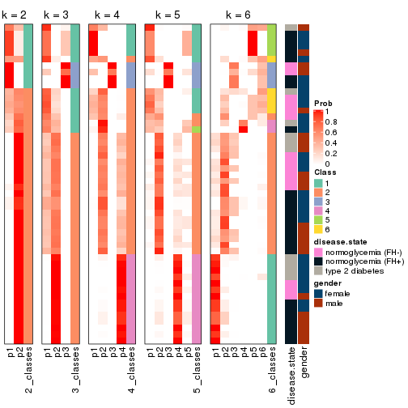


Test correlation between subgroups and known annotations. If the known
annotation is numeric, one-way ANOVA test is applied, and if the known
annotation is discrete, chi-squared contingency table test is applied.

```r
test_to_known_factors(res)
```

```
#>             n disease.state(p) gender(p) k
#> ATC:hclust 45            0.637     1.000 2
#> ATC:hclust 41            0.296     0.605 3
#> ATC:hclust 43            0.433     0.770 4
#> ATC:hclust 37            0.652     0.693 5
#> ATC:hclust 40            0.273     0.578 6
```


If matrix rows can be associated to genes, consider to use `functional_enrichment(res,
...)` to perform function enrichment for the signature genes. See [this vignette](http://bioconductor.org/packages/devel/bioc/vignettes/cola/inst/doc/functional_enrichment.html) for more detailed explanations.


 

---------------------------------------------------


### ATC:kmeans*


The object with results only for a single top-value method and a single partition method 
can be extracted as:

```r
res = res_list["ATC", "kmeans"]
# you can also extract it by
# res = res_list["ATC:kmeans"]
```

A summary of `res` and all the functions that can be applied to it:

```r
res
```

```
#> A 'ConsensusPartition' object with k = 2, 3, 4, 5, 6.
#>   On a matrix with 51941 rows and 50 columns.
#>   Top rows (1000, 2000, 3000, 4000, 5000) are extracted by 'ATC' method.
#>   Subgroups are detected by 'kmeans' method.
#>   Performed in total 1250 partitions by row resampling.
#>   Best k for subgroups seems to be 3.
#> 
#> Following methods can be applied to this 'ConsensusPartition' object:
#>  [1] "cola_report"             "collect_classes"         "collect_plots"          
#>  [4] "collect_stats"           "colnames"                "compare_signatures"     
#>  [7] "consensus_heatmap"       "dimension_reduction"     "functional_enrichment"  
#> [10] "get_anno_col"            "get_anno"                "get_classes"            
#> [13] "get_consensus"           "get_matrix"              "get_membership"         
#> [16] "get_param"               "get_signatures"          "get_stats"              
#> [19] "is_best_k"               "is_stable_k"             "membership_heatmap"     
#> [22] "ncol"                    "nrow"                    "plot_ecdf"              
#> [25] "rownames"                "select_partition_number" "show"                   
#> [28] "suggest_best_k"          "test_to_known_factors"
```

`collect_plots()` function collects all the plots made from `res` for all `k` (number of partitions)
into one single page to provide an easy and fast comparison between different `k`.

```r
collect_plots(res)
```


The plots are:

- The first row: a plot of the ECDF (empirical cumulative distribution
  function) curves of the consensus matrix for each `k` and the heatmap of
  predicted classes for each `k`.
- The second row: heatmaps of the consensus matrix for each `k`.
- The third row: heatmaps of the membership matrix for each `k`.
- The fouth row: heatmaps of the signatures for each `k`.

All the plots in panels can be made by individual functions and they are
plotted later in this section.

`select_partition_number()` produces several plots showing different
statistics for choosing "optimized" `k`. There are following statistics:

- ECDF curves of the consensus matrix for each `k`;
- 1-PAC. [The PAC
  score](https://en.wikipedia.org/wiki/Consensus_clustering#Over-interpretation_potential_of_consensus_clustering)
  measures the proportion of the ambiguous subgrouping.
- Mean silhouette score.
- Concordance. The mean probability of fiting the consensus class ids in all
  partitions.
- Area increased. Denote $A_k$ as the area under the ECDF curve for current
  `k`, the area increased is defined as $A_k - A_{k-1}$.
- Rand index. The percent of pairs of samples that are both in a same cluster
  or both are not in a same cluster in the partition of k and k-1.
- Jaccard index. The ratio of pairs of samples are both in a same cluster in
  the partition of k and k-1 and the pairs of samples are both in a same
  cluster in the partition k or k-1.

The detailed explanations of these statistics can be found in [the _cola_
vignette](http://bioconductor.org/packages/devel/bioc/vignettes/cola/inst/doc/cola.html#toc_13).

Generally speaking, lower PAC score, higher mean silhouette score or higher
concordance corresponds to better partition. Rand index and Jaccard index
measure how similar the current partition is compared to partition with `k-1`.
If they are too similar, we won't accept `k` is better than `k-1`.

```r
select_partition_number(res)
```


The numeric values for all these statistics can be obtained by `get_stats()`.

```r
get_stats(res)
```

```
#>   k 1-PAC mean_silhouette concordance area_increased  Rand Jaccard
#> 2 2 0.806           0.950       0.965         0.4254 0.542   0.542
#> 3 3 0.947           0.924       0.972         0.2380 0.886   0.797
#> 4 4 0.590           0.637       0.649         0.2858 0.928   0.862
#> 5 5 0.590           0.640       0.734         0.1075 0.692   0.408
#> 6 6 0.660           0.610       0.765         0.0677 0.891   0.593
```

`suggest_best_k()` suggests the best $k$ based on these statistics. The rules are as follows:

- All $k$ with Jaccard index larger than 0.95 are removed because increasing
  $k$ does not provide enough extra information. If all $k$ are removed, it is
  marked as no subgroup is detected.
- For all $k$ with 1-PAC score larger than 0.9, the maximal $k$ is taken as
  the best $k$, and other $k$ are marked as optional $k$.
- If it does not fit the second rule. The $k$ with the maximal vote of the
  highest 1-PAC score, highest mean silhouette, and highest concordance is
  taken as the best $k$.

```r
suggest_best_k(res)
```

```
#> [1] 3
```


Following shows the table of the partitions (You need to click the **show/hide
code output** link to see it). The membership matrix (columns with name `p*`)
is inferred by
[`clue::cl_consensus()`](https://www.rdocumentation.org/link/cl_consensus?package=clue)
function with the `SE` method. Basically the value in the membership matrix
represents the probability to belong to a certain group. The finall class
label for an item is determined with the group with highest probability it
belongs to.

In `get_classes()` function, the entropy is calculated from the membership
matrix and the silhouette score is calculated from the consensus matrix.


<script>
$( function() {
	$( '#tabs-ATC-kmeans-get-classes' ).tabs();
} );
</script>
<div id='tabs-ATC-kmeans-get-classes'>
<ul>
<li><a href='#tab-ATC-kmeans-get-classes-1'>k = 2</a></li>
<li><a href='#tab-ATC-kmeans-get-classes-2'>k = 3</a></li>
<li><a href='#tab-ATC-kmeans-get-classes-3'>k = 4</a></li>
<li><a href='#tab-ATC-kmeans-get-classes-4'>k = 5</a></li>
<li><a href='#tab-ATC-kmeans-get-classes-5'>k = 6</a></li>
</ul>

<div id='tab-ATC-kmeans-get-classes-1'>
<p><a id='tab-ATC-kmeans-get-classes-1-a' style='color:#0366d6' href='#'>show/hide code output</a></p>
<pre><code class="r">cbind(get_classes(res, k = 2), get_membership(res, k = 2))
</code></pre>

<pre><code>#&gt;           class entropy silhouette    p1    p2
#&gt; GSM624962     1  0.7299      0.841 0.796 0.204
#&gt; GSM624963     2  0.0000      0.999 0.000 1.000
#&gt; GSM624967     2  0.0000      0.999 0.000 1.000
#&gt; GSM624968     1  0.7674      0.823 0.776 0.224
#&gt; GSM624969     2  0.0000      0.999 0.000 1.000
#&gt; GSM624970     2  0.0000      0.999 0.000 1.000
#&gt; GSM624961     2  0.0000      0.999 0.000 1.000
#&gt; GSM624964     2  0.0000      0.999 0.000 1.000
#&gt; GSM624965     2  0.0000      0.999 0.000 1.000
#&gt; GSM624966     1  0.0000      0.886 1.000 0.000
#&gt; GSM624925     2  0.0000      0.999 0.000 1.000
#&gt; GSM624927     2  0.0000      0.999 0.000 1.000
#&gt; GSM624929     2  0.0000      0.999 0.000 1.000
#&gt; GSM624930     1  0.7674      0.823 0.776 0.224
#&gt; GSM624931     1  0.8909      0.702 0.692 0.308
#&gt; GSM624935     2  0.0000      0.999 0.000 1.000
#&gt; GSM624936     1  0.6973      0.850 0.812 0.188
#&gt; GSM624937     2  0.0000      0.999 0.000 1.000
#&gt; GSM624926     2  0.0000      0.999 0.000 1.000
#&gt; GSM624928     2  0.0000      0.999 0.000 1.000
#&gt; GSM624932     1  0.7453      0.835 0.788 0.212
#&gt; GSM624933     2  0.0000      0.999 0.000 1.000
#&gt; GSM624934     2  0.0000      0.999 0.000 1.000
#&gt; GSM624971     1  0.0000      0.886 1.000 0.000
#&gt; GSM624973     1  0.0000      0.886 1.000 0.000
#&gt; GSM624938     1  0.0000      0.886 1.000 0.000
#&gt; GSM624940     1  0.0000      0.886 1.000 0.000
#&gt; GSM624941     2  0.0000      0.999 0.000 1.000
#&gt; GSM624942     2  0.0000      0.999 0.000 1.000
#&gt; GSM624943     2  0.0000      0.999 0.000 1.000
#&gt; GSM624945     2  0.0672      0.991 0.008 0.992
#&gt; GSM624946     1  0.0000      0.886 1.000 0.000
#&gt; GSM624949     2  0.0672      0.991 0.008 0.992
#&gt; GSM624951     1  0.0000      0.886 1.000 0.000
#&gt; GSM624952     1  0.6973      0.850 0.812 0.188
#&gt; GSM624955     1  0.7219      0.844 0.800 0.200
#&gt; GSM624956     2  0.0000      0.999 0.000 1.000
#&gt; GSM624957     2  0.0000      0.999 0.000 1.000
#&gt; GSM624974     1  0.0000      0.886 1.000 0.000
#&gt; GSM624939     1  0.0000      0.886 1.000 0.000
#&gt; GSM624944     2  0.0000      0.999 0.000 1.000
#&gt; GSM624947     2  0.0000      0.999 0.000 1.000
#&gt; GSM624948     2  0.0000      0.999 0.000 1.000
#&gt; GSM624950     2  0.0000      0.999 0.000 1.000
#&gt; GSM624953     2  0.0000      0.999 0.000 1.000
#&gt; GSM624954     2  0.0000      0.999 0.000 1.000
#&gt; GSM624958     2  0.0000      0.999 0.000 1.000
#&gt; GSM624959     2  0.0000      0.999 0.000 1.000
#&gt; GSM624960     2  0.0000      0.999 0.000 1.000
#&gt; GSM624972     2  0.0000      0.999 0.000 1.000
</code></pre>

<script>
$('#tab-ATC-kmeans-get-classes-1-a').parent().next().next().hide();
$('#tab-ATC-kmeans-get-classes-1-a').click(function(){
  $('#tab-ATC-kmeans-get-classes-1-a').parent().next().next().toggle();
  return(false);
});
</script>
</div>

<div id='tab-ATC-kmeans-get-classes-2'>
<p><a id='tab-ATC-kmeans-get-classes-2-a' style='color:#0366d6' href='#'>show/hide code output</a></p>
<pre><code class="r">cbind(get_classes(res, k = 3), get_membership(res, k = 3))
</code></pre>

<pre><code>#&gt;           class entropy silhouette    p1    p2    p3
#&gt; GSM624962     1  0.0000      0.911 1.000 0.000 0.000
#&gt; GSM624963     2  0.0000      0.989 0.000 1.000 0.000
#&gt; GSM624967     2  0.0000      0.989 0.000 1.000 0.000
#&gt; GSM624968     1  0.0424      0.906 0.992 0.000 0.008
#&gt; GSM624969     2  0.0000      0.989 0.000 1.000 0.000
#&gt; GSM624970     2  0.0237      0.986 0.000 0.996 0.004
#&gt; GSM624961     2  0.0000      0.989 0.000 1.000 0.000
#&gt; GSM624964     2  0.0000      0.989 0.000 1.000 0.000
#&gt; GSM624965     2  0.0000      0.989 0.000 1.000 0.000
#&gt; GSM624966     1  0.0000      0.911 1.000 0.000 0.000
#&gt; GSM624925     2  0.0000      0.989 0.000 1.000 0.000
#&gt; GSM624927     2  0.0000      0.989 0.000 1.000 0.000
#&gt; GSM624929     2  0.0000      0.989 0.000 1.000 0.000
#&gt; GSM624930     1  0.0000      0.911 1.000 0.000 0.000
#&gt; GSM624931     1  0.0000      0.911 1.000 0.000 0.000
#&gt; GSM624935     2  0.0000      0.989 0.000 1.000 0.000
#&gt; GSM624936     1  0.0000      0.911 1.000 0.000 0.000
#&gt; GSM624937     2  0.0000      0.989 0.000 1.000 0.000
#&gt; GSM624926     2  0.0424      0.983 0.000 0.992 0.008
#&gt; GSM624928     2  0.0000      0.989 0.000 1.000 0.000
#&gt; GSM624932     1  0.0000      0.911 1.000 0.000 0.000
#&gt; GSM624933     2  0.0000      0.989 0.000 1.000 0.000
#&gt; GSM624934     2  0.5216      0.629 0.260 0.740 0.000
#&gt; GSM624971     3  0.0592      0.915 0.012 0.000 0.988
#&gt; GSM624973     3  0.5016      0.673 0.240 0.000 0.760
#&gt; GSM624938     3  0.0592      0.915 0.012 0.000 0.988
#&gt; GSM624940     1  0.5591      0.463 0.696 0.000 0.304
#&gt; GSM624941     2  0.0000      0.989 0.000 1.000 0.000
#&gt; GSM624942     2  0.0000      0.989 0.000 1.000 0.000
#&gt; GSM624943     2  0.0000      0.989 0.000 1.000 0.000
#&gt; GSM624945     1  0.5098      0.560 0.752 0.248 0.000
#&gt; GSM624946     3  0.0592      0.915 0.012 0.000 0.988
#&gt; GSM624949     1  0.5178      0.546 0.744 0.256 0.000
#&gt; GSM624951     1  0.0000      0.911 1.000 0.000 0.000
#&gt; GSM624952     1  0.0000      0.911 1.000 0.000 0.000
#&gt; GSM624955     1  0.0424      0.906 0.992 0.000 0.008
#&gt; GSM624956     2  0.0000      0.989 0.000 1.000 0.000
#&gt; GSM624957     2  0.0424      0.982 0.008 0.992 0.000
#&gt; GSM624974     1  0.0000      0.911 1.000 0.000 0.000
#&gt; GSM624939     1  0.0000      0.911 1.000 0.000 0.000
#&gt; GSM624944     2  0.0000      0.989 0.000 1.000 0.000
#&gt; GSM624947     2  0.0000      0.989 0.000 1.000 0.000
#&gt; GSM624948     2  0.0000      0.989 0.000 1.000 0.000
#&gt; GSM624950     2  0.0000      0.989 0.000 1.000 0.000
#&gt; GSM624953     2  0.0000      0.989 0.000 1.000 0.000
#&gt; GSM624954     2  0.0000      0.989 0.000 1.000 0.000
#&gt; GSM624958     2  0.0000      0.989 0.000 1.000 0.000
#&gt; GSM624959     2  0.0000      0.989 0.000 1.000 0.000
#&gt; GSM624960     2  0.0237      0.986 0.000 0.996 0.004
#&gt; GSM624972     2  0.0000      0.989 0.000 1.000 0.000
</code></pre>

<script>
$('#tab-ATC-kmeans-get-classes-2-a').parent().next().next().hide();
$('#tab-ATC-kmeans-get-classes-2-a').click(function(){
  $('#tab-ATC-kmeans-get-classes-2-a').parent().next().next().toggle();
  return(false);
});
</script>
</div>

<div id='tab-ATC-kmeans-get-classes-3'>
<p><a id='tab-ATC-kmeans-get-classes-3-a' style='color:#0366d6' href='#'>show/hide code output</a></p>
<pre><code class="r">cbind(get_classes(res, k = 4), get_membership(res, k = 4))
</code></pre>

<pre><code>#&gt;           class entropy silhouette    p1    p2    p3    p4
#&gt; GSM624962     1  0.5498      0.562 0.680 0.048 0.000 0.272
#&gt; GSM624963     2  0.4500      0.591 0.000 0.684 0.000 0.316
#&gt; GSM624967     2  0.4981      0.563 0.000 0.536 0.000 0.464
#&gt; GSM624968     1  0.4893      0.688 0.772 0.052 0.004 0.172
#&gt; GSM624969     2  0.4977      0.563 0.000 0.540 0.000 0.460
#&gt; GSM624970     2  0.4992      0.553 0.000 0.524 0.000 0.476
#&gt; GSM624961     2  0.3764      0.574 0.000 0.784 0.000 0.216
#&gt; GSM624964     2  0.3688      0.584 0.000 0.792 0.000 0.208
#&gt; GSM624965     2  0.3764      0.571 0.000 0.784 0.000 0.216
#&gt; GSM624966     1  0.2216      0.828 0.908 0.000 0.000 0.092
#&gt; GSM624925     2  0.4103      0.547 0.000 0.744 0.000 0.256
#&gt; GSM624927     2  0.3942      0.623 0.000 0.764 0.000 0.236
#&gt; GSM624929     2  0.3610      0.582 0.000 0.800 0.000 0.200
#&gt; GSM624930     1  0.0336      0.845 0.992 0.000 0.000 0.008
#&gt; GSM624931     1  0.0469      0.843 0.988 0.000 0.000 0.012
#&gt; GSM624935     2  0.4981      0.563 0.000 0.536 0.000 0.464
#&gt; GSM624936     1  0.0000      0.846 1.000 0.000 0.000 0.000
#&gt; GSM624937     2  0.4843      0.593 0.000 0.604 0.000 0.396
#&gt; GSM624926     2  0.5833      0.485 0.084 0.700 0.004 0.212
#&gt; GSM624928     2  0.0188      0.635 0.000 0.996 0.000 0.004
#&gt; GSM624932     1  0.0188      0.846 0.996 0.000 0.000 0.004
#&gt; GSM624933     2  0.4981      0.563 0.000 0.536 0.000 0.464
#&gt; GSM624934     2  0.5369      0.499 0.112 0.744 0.000 0.144
#&gt; GSM624971     3  0.0188      0.913 0.004 0.000 0.996 0.000
#&gt; GSM624973     3  0.5436      0.669 0.176 0.000 0.732 0.092
#&gt; GSM624938     3  0.0188      0.913 0.004 0.000 0.996 0.000
#&gt; GSM624940     1  0.4879      0.705 0.780 0.000 0.128 0.092
#&gt; GSM624941     2  0.4843      0.593 0.000 0.604 0.000 0.396
#&gt; GSM624942     2  0.4522      0.611 0.000 0.680 0.000 0.320
#&gt; GSM624943     2  0.1557      0.633 0.000 0.944 0.000 0.056
#&gt; GSM624945     2  0.7118      0.353 0.168 0.548 0.000 0.284
#&gt; GSM624946     3  0.0188      0.913 0.004 0.000 0.996 0.000
#&gt; GSM624949     2  0.7118      0.353 0.168 0.548 0.000 0.284
#&gt; GSM624951     1  0.2216      0.828 0.908 0.000 0.000 0.092
#&gt; GSM624952     1  0.0000      0.846 1.000 0.000 0.000 0.000
#&gt; GSM624955     1  0.6127      0.490 0.600 0.052 0.004 0.344
#&gt; GSM624956     2  0.4103      0.547 0.000 0.744 0.000 0.256
#&gt; GSM624957     2  0.5427      0.514 0.100 0.736 0.000 0.164
#&gt; GSM624974     1  0.2216      0.828 0.908 0.000 0.000 0.092
#&gt; GSM624939     1  0.2216      0.828 0.908 0.000 0.000 0.092
#&gt; GSM624944     2  0.4855      0.593 0.000 0.600 0.000 0.400
#&gt; GSM624947     2  0.4948      0.581 0.000 0.560 0.000 0.440
#&gt; GSM624948     2  0.4981      0.563 0.000 0.536 0.000 0.464
#&gt; GSM624950     2  0.3625      0.583 0.012 0.828 0.000 0.160
#&gt; GSM624953     2  0.4103      0.547 0.000 0.744 0.000 0.256
#&gt; GSM624954     2  0.4843      0.593 0.000 0.604 0.000 0.396
#&gt; GSM624958     2  0.0188      0.635 0.000 0.996 0.000 0.004
#&gt; GSM624959     2  0.4981      0.563 0.000 0.536 0.000 0.464
#&gt; GSM624960     2  0.4832      0.543 0.056 0.768 0.000 0.176
#&gt; GSM624972     2  0.4134      0.544 0.000 0.740 0.000 0.260
</code></pre>

<script>
$('#tab-ATC-kmeans-get-classes-3-a').parent().next().next().hide();
$('#tab-ATC-kmeans-get-classes-3-a').click(function(){
  $('#tab-ATC-kmeans-get-classes-3-a').parent().next().next().toggle();
  return(false);
});
</script>
</div>

<div id='tab-ATC-kmeans-get-classes-4'>
<p><a id='tab-ATC-kmeans-get-classes-4-a' style='color:#0366d6' href='#'>show/hide code output</a></p>
<pre><code class="r">cbind(get_classes(res, k = 5), get_membership(res, k = 5))
</code></pre>

<pre><code>#&gt;           class entropy silhouette    p1    p2    p3    p4    p5
#&gt; GSM624962     2  0.4879      0.201 0.228 0.696 0.000 0.000 0.076
#&gt; GSM624963     4  0.5834      0.121 0.000 0.348 0.000 0.544 0.108
#&gt; GSM624967     4  0.0000      0.749 0.000 0.000 0.000 1.000 0.000
#&gt; GSM624968     5  0.5628      0.109 0.244 0.132 0.000 0.000 0.624
#&gt; GSM624969     4  0.0162      0.750 0.000 0.004 0.000 0.996 0.000
#&gt; GSM624970     4  0.2011      0.713 0.000 0.004 0.000 0.908 0.088
#&gt; GSM624961     2  0.5452      0.700 0.000 0.656 0.000 0.200 0.144
#&gt; GSM624964     2  0.5565      0.677 0.000 0.640 0.000 0.216 0.144
#&gt; GSM624965     2  0.5268      0.724 0.000 0.680 0.000 0.172 0.148
#&gt; GSM624966     1  0.0000      0.785 1.000 0.000 0.000 0.000 0.000
#&gt; GSM624925     2  0.5043      0.737 0.000 0.704 0.000 0.160 0.136
#&gt; GSM624927     4  0.5603      0.101 0.000 0.072 0.000 0.476 0.452
#&gt; GSM624929     2  0.5482      0.695 0.000 0.652 0.000 0.204 0.144
#&gt; GSM624930     1  0.5192      0.722 0.664 0.092 0.000 0.000 0.244
#&gt; GSM624931     1  0.5488      0.650 0.608 0.092 0.000 0.000 0.300
#&gt; GSM624935     4  0.0703      0.749 0.000 0.000 0.000 0.976 0.024
#&gt; GSM624936     1  0.4883      0.756 0.708 0.092 0.000 0.000 0.200
#&gt; GSM624937     4  0.1774      0.749 0.000 0.016 0.000 0.932 0.052
#&gt; GSM624926     5  0.2914      0.795 0.000 0.076 0.000 0.052 0.872
#&gt; GSM624928     4  0.6368      0.097 0.000 0.356 0.000 0.472 0.172
#&gt; GSM624932     1  0.5060      0.741 0.684 0.092 0.000 0.000 0.224
#&gt; GSM624933     4  0.0703      0.749 0.000 0.000 0.000 0.976 0.024
#&gt; GSM624934     5  0.4158      0.814 0.004 0.120 0.000 0.084 0.792
#&gt; GSM624971     3  0.0162      0.878 0.000 0.004 0.996 0.000 0.000
#&gt; GSM624973     3  0.6430      0.566 0.252 0.156 0.572 0.000 0.020
#&gt; GSM624938     3  0.0000      0.878 0.000 0.000 1.000 0.000 0.000
#&gt; GSM624940     1  0.1502      0.730 0.940 0.004 0.056 0.000 0.000
#&gt; GSM624941     4  0.2676      0.732 0.000 0.036 0.000 0.884 0.080
#&gt; GSM624942     4  0.3932      0.667 0.000 0.064 0.000 0.796 0.140
#&gt; GSM624943     4  0.6638      0.149 0.000 0.224 0.000 0.412 0.364
#&gt; GSM624945     2  0.1408      0.546 0.000 0.948 0.000 0.008 0.044
#&gt; GSM624946     3  0.0000      0.878 0.000 0.000 1.000 0.000 0.000
#&gt; GSM624949     2  0.1251      0.542 0.000 0.956 0.000 0.008 0.036
#&gt; GSM624951     1  0.0162      0.784 0.996 0.004 0.000 0.000 0.000
#&gt; GSM624952     1  0.4417      0.773 0.760 0.092 0.000 0.000 0.148
#&gt; GSM624955     2  0.5747      0.145 0.212 0.620 0.000 0.000 0.168
#&gt; GSM624956     2  0.5043      0.737 0.000 0.704 0.000 0.160 0.136
#&gt; GSM624957     5  0.3916      0.823 0.000 0.092 0.000 0.104 0.804
#&gt; GSM624974     1  0.0000      0.785 1.000 0.000 0.000 0.000 0.000
#&gt; GSM624939     1  0.0000      0.785 1.000 0.000 0.000 0.000 0.000
#&gt; GSM624944     4  0.2172      0.745 0.000 0.016 0.000 0.908 0.076
#&gt; GSM624947     4  0.3849      0.600 0.000 0.016 0.000 0.752 0.232
#&gt; GSM624948     4  0.0703      0.749 0.000 0.000 0.000 0.976 0.024
#&gt; GSM624950     5  0.4355      0.752 0.000 0.076 0.000 0.164 0.760
#&gt; GSM624953     2  0.5043      0.737 0.000 0.704 0.000 0.160 0.136
#&gt; GSM624954     4  0.1725      0.751 0.000 0.020 0.000 0.936 0.044
#&gt; GSM624958     4  0.6368      0.097 0.000 0.356 0.000 0.472 0.172
#&gt; GSM624959     4  0.0703      0.749 0.000 0.000 0.000 0.976 0.024
#&gt; GSM624960     5  0.3731      0.818 0.000 0.072 0.000 0.112 0.816
#&gt; GSM624972     2  0.4808      0.726 0.000 0.728 0.000 0.136 0.136
</code></pre>

<script>
$('#tab-ATC-kmeans-get-classes-4-a').parent().next().next().hide();
$('#tab-ATC-kmeans-get-classes-4-a').click(function(){
  $('#tab-ATC-kmeans-get-classes-4-a').parent().next().next().toggle();
  return(false);
});
</script>
</div>

<div id='tab-ATC-kmeans-get-classes-5'>
<p><a id='tab-ATC-kmeans-get-classes-5-a' style='color:#0366d6' href='#'>show/hide code output</a></p>
<pre><code class="r">cbind(get_classes(res, k = 6), get_membership(res, k = 6))
</code></pre>

<pre><code>#&gt;           class entropy silhouette    p1    p2    p3    p4    p5    p6
#&gt; GSM624962     6  0.5311     0.5965 0.000 0.380 0.000 0.008 0.084 0.528
#&gt; GSM624963     2  0.5071     0.3279 0.376 0.556 0.000 0.012 0.000 0.056
#&gt; GSM624967     1  0.0260     0.8130 0.992 0.008 0.000 0.000 0.000 0.000
#&gt; GSM624968     4  0.5216     0.0113 0.000 0.020 0.000 0.532 0.052 0.396
#&gt; GSM624969     1  0.0717     0.8129 0.976 0.008 0.000 0.000 0.000 0.016
#&gt; GSM624970     1  0.3927     0.7325 0.776 0.032 0.000 0.028 0.000 0.164
#&gt; GSM624961     2  0.1757     0.7497 0.076 0.916 0.000 0.008 0.000 0.000
#&gt; GSM624964     2  0.1858     0.7491 0.076 0.912 0.000 0.012 0.000 0.000
#&gt; GSM624965     2  0.1787     0.7491 0.068 0.920 0.000 0.008 0.000 0.004
#&gt; GSM624966     5  0.0000     0.6626 0.000 0.000 0.000 0.000 1.000 0.000
#&gt; GSM624925     2  0.2499     0.7354 0.072 0.880 0.000 0.000 0.000 0.048
#&gt; GSM624927     4  0.5508     0.1328 0.384 0.104 0.000 0.504 0.000 0.008
#&gt; GSM624929     2  0.1858     0.7491 0.076 0.912 0.000 0.012 0.000 0.000
#&gt; GSM624930     5  0.5719     0.5929 0.000 0.000 0.000 0.232 0.520 0.248
#&gt; GSM624931     5  0.5958     0.5086 0.000 0.000 0.000 0.304 0.448 0.248
#&gt; GSM624935     1  0.3230     0.8027 0.836 0.024 0.000 0.024 0.000 0.116
#&gt; GSM624936     5  0.5579     0.6107 0.000 0.000 0.000 0.204 0.548 0.248
#&gt; GSM624937     1  0.2506     0.7828 0.880 0.052 0.000 0.068 0.000 0.000
#&gt; GSM624926     4  0.1707     0.6640 0.004 0.056 0.000 0.928 0.000 0.012
#&gt; GSM624928     2  0.4448     0.5944 0.216 0.708 0.000 0.068 0.000 0.008
#&gt; GSM624932     5  0.5622     0.6072 0.000 0.000 0.000 0.212 0.540 0.248
#&gt; GSM624933     1  0.3230     0.8027 0.836 0.024 0.000 0.024 0.000 0.116
#&gt; GSM624934     4  0.2879     0.6566 0.008 0.056 0.000 0.864 0.000 0.072
#&gt; GSM624971     3  0.0146     0.8253 0.000 0.000 0.996 0.004 0.000 0.000
#&gt; GSM624973     3  0.6610     0.2754 0.000 0.036 0.472 0.004 0.248 0.240
#&gt; GSM624938     3  0.0000     0.8261 0.000 0.000 1.000 0.000 0.000 0.000
#&gt; GSM624940     5  0.0935     0.6339 0.000 0.000 0.032 0.000 0.964 0.004
#&gt; GSM624941     1  0.3575     0.7300 0.796 0.128 0.000 0.076 0.000 0.000
#&gt; GSM624942     1  0.3928     0.6844 0.760 0.160 0.000 0.080 0.000 0.000
#&gt; GSM624943     4  0.6074     0.1387 0.272 0.340 0.000 0.388 0.000 0.000
#&gt; GSM624945     2  0.3819    -0.1450 0.000 0.624 0.000 0.004 0.000 0.372
#&gt; GSM624946     3  0.0000     0.8261 0.000 0.000 1.000 0.000 0.000 0.000
#&gt; GSM624949     2  0.3907    -0.2690 0.000 0.588 0.000 0.004 0.000 0.408
#&gt; GSM624951     5  0.0146     0.6605 0.000 0.000 0.000 0.000 0.996 0.004
#&gt; GSM624952     5  0.5436     0.6124 0.000 0.000 0.000 0.180 0.572 0.248
#&gt; GSM624955     6  0.5441     0.5899 0.000 0.184 0.000 0.072 0.080 0.664
#&gt; GSM624956     2  0.2585     0.7395 0.068 0.880 0.000 0.004 0.000 0.048
#&gt; GSM624957     4  0.2889     0.6620 0.016 0.048 0.000 0.868 0.000 0.068
#&gt; GSM624974     5  0.0000     0.6626 0.000 0.000 0.000 0.000 1.000 0.000
#&gt; GSM624939     5  0.0000     0.6626 0.000 0.000 0.000 0.000 1.000 0.000
#&gt; GSM624944     1  0.4136     0.7191 0.760 0.036 0.000 0.172 0.000 0.032
#&gt; GSM624947     1  0.5023     0.4367 0.604 0.036 0.000 0.328 0.000 0.032
#&gt; GSM624948     1  0.3230     0.8027 0.836 0.024 0.000 0.024 0.000 0.116
#&gt; GSM624950     4  0.2875     0.6660 0.052 0.096 0.000 0.852 0.000 0.000
#&gt; GSM624953     2  0.2585     0.7395 0.068 0.880 0.000 0.004 0.000 0.048
#&gt; GSM624954     1  0.1995     0.7989 0.912 0.052 0.000 0.036 0.000 0.000
#&gt; GSM624958     2  0.4718     0.5712 0.220 0.684 0.000 0.088 0.000 0.008
#&gt; GSM624959     1  0.3230     0.8027 0.836 0.024 0.000 0.024 0.000 0.116
#&gt; GSM624960     4  0.1923     0.6767 0.016 0.064 0.000 0.916 0.000 0.004
#&gt; GSM624972     2  0.2384     0.7271 0.064 0.888 0.000 0.000 0.000 0.048
</code></pre>

<script>
$('#tab-ATC-kmeans-get-classes-5-a').parent().next().next().hide();
$('#tab-ATC-kmeans-get-classes-5-a').click(function(){
  $('#tab-ATC-kmeans-get-classes-5-a').parent().next().next().toggle();
  return(false);
});
</script>
</div>
</div>

Heatmaps for the consensus matrix. It visualizes the probability of two
samples to be in a same group.


<script>
$( function() {
	$( '#tabs-ATC-kmeans-consensus-heatmap' ).tabs();
} );
</script>
<div id='tabs-ATC-kmeans-consensus-heatmap'>
<ul>
<li><a href='#tab-ATC-kmeans-consensus-heatmap-1'>k = 2</a></li>
<li><a href='#tab-ATC-kmeans-consensus-heatmap-2'>k = 3</a></li>
<li><a href='#tab-ATC-kmeans-consensus-heatmap-3'>k = 4</a></li>
<li><a href='#tab-ATC-kmeans-consensus-heatmap-4'>k = 5</a></li>
<li><a href='#tab-ATC-kmeans-consensus-heatmap-5'>k = 6</a></li>
</ul>
<div id='tab-ATC-kmeans-consensus-heatmap-1'>
<pre><code class="r">consensus_heatmap(res, k = 2)
</code></pre>

<p></p>

</div>
<div id='tab-ATC-kmeans-consensus-heatmap-2'>
<pre><code class="r">consensus_heatmap(res, k = 3)
</code></pre>

<p></p>

</div>
<div id='tab-ATC-kmeans-consensus-heatmap-3'>
<pre><code class="r">consensus_heatmap(res, k = 4)
</code></pre>

<p></p>

</div>
<div id='tab-ATC-kmeans-consensus-heatmap-4'>
<pre><code class="r">consensus_heatmap(res, k = 5)
</code></pre>

<p></p>

</div>
<div id='tab-ATC-kmeans-consensus-heatmap-5'>
<pre><code class="r">consensus_heatmap(res, k = 6)
</code></pre>

<p></p>

</div>
</div>

Heatmaps for the membership of samples in all partitions to see how consistent they are:


<script>
$( function() {
	$( '#tabs-ATC-kmeans-membership-heatmap' ).tabs();
} );
</script>
<div id='tabs-ATC-kmeans-membership-heatmap'>
<ul>
<li><a href='#tab-ATC-kmeans-membership-heatmap-1'>k = 2</a></li>
<li><a href='#tab-ATC-kmeans-membership-heatmap-2'>k = 3</a></li>
<li><a href='#tab-ATC-kmeans-membership-heatmap-3'>k = 4</a></li>
<li><a href='#tab-ATC-kmeans-membership-heatmap-4'>k = 5</a></li>
<li><a href='#tab-ATC-kmeans-membership-heatmap-5'>k = 6</a></li>
</ul>
<div id='tab-ATC-kmeans-membership-heatmap-1'>
<pre><code class="r">membership_heatmap(res, k = 2)
</code></pre>

<p></p>

</div>
<div id='tab-ATC-kmeans-membership-heatmap-2'>
<pre><code class="r">membership_heatmap(res, k = 3)
</code></pre>

<p></p>

</div>
<div id='tab-ATC-kmeans-membership-heatmap-3'>
<pre><code class="r">membership_heatmap(res, k = 4)
</code></pre>

<p></p>

</div>
<div id='tab-ATC-kmeans-membership-heatmap-4'>
<pre><code class="r">membership_heatmap(res, k = 5)
</code></pre>

<p></p>

</div>
<div id='tab-ATC-kmeans-membership-heatmap-5'>
<pre><code class="r">membership_heatmap(res, k = 6)
</code></pre>

<p></p>

</div>
</div>

As soon as we have had the classes for columns, we can look for signatures
which are significantly different between classes which can be candidate marks
for certain classes. Following are the heatmaps for signatures.


Signature heatmaps where rows are scaled:


<script>
$( function() {
	$( '#tabs-ATC-kmeans-get-signatures' ).tabs();
} );
</script>
<div id='tabs-ATC-kmeans-get-signatures'>
<ul>
<li><a href='#tab-ATC-kmeans-get-signatures-1'>k = 2</a></li>
<li><a href='#tab-ATC-kmeans-get-signatures-2'>k = 3</a></li>
<li><a href='#tab-ATC-kmeans-get-signatures-3'>k = 4</a></li>
<li><a href='#tab-ATC-kmeans-get-signatures-4'>k = 5</a></li>
<li><a href='#tab-ATC-kmeans-get-signatures-5'>k = 6</a></li>
</ul>
<div id='tab-ATC-kmeans-get-signatures-1'>
<pre><code class="r">get_signatures(res, k = 2)
</code></pre>

<p></p>

</div>
<div id='tab-ATC-kmeans-get-signatures-2'>
<pre><code class="r">get_signatures(res, k = 3)
</code></pre>

<p></p>

</div>
<div id='tab-ATC-kmeans-get-signatures-3'>
<pre><code class="r">get_signatures(res, k = 4)
</code></pre>

<p></p>

</div>
<div id='tab-ATC-kmeans-get-signatures-4'>
<pre><code class="r">get_signatures(res, k = 5)
</code></pre>

<p></p>

</div>
<div id='tab-ATC-kmeans-get-signatures-5'>
<pre><code class="r">get_signatures(res, k = 6)
</code></pre>

<p></p>

</div>
</div>


Signature heatmaps where rows are not scaled:


<script>
$( function() {
	$( '#tabs-ATC-kmeans-get-signatures-no-scale' ).tabs();
} );
</script>
<div id='tabs-ATC-kmeans-get-signatures-no-scale'>
<ul>
<li><a href='#tab-ATC-kmeans-get-signatures-no-scale-1'>k = 2</a></li>
<li><a href='#tab-ATC-kmeans-get-signatures-no-scale-2'>k = 3</a></li>
<li><a href='#tab-ATC-kmeans-get-signatures-no-scale-3'>k = 4</a></li>
<li><a href='#tab-ATC-kmeans-get-signatures-no-scale-4'>k = 5</a></li>
<li><a href='#tab-ATC-kmeans-get-signatures-no-scale-5'>k = 6</a></li>
</ul>
<div id='tab-ATC-kmeans-get-signatures-no-scale-1'>
<pre><code class="r">get_signatures(res, k = 2, scale_rows = FALSE)
</code></pre>

<p></p>

</div>
<div id='tab-ATC-kmeans-get-signatures-no-scale-2'>
<pre><code class="r">get_signatures(res, k = 3, scale_rows = FALSE)
</code></pre>

<p></p>

</div>
<div id='tab-ATC-kmeans-get-signatures-no-scale-3'>
<pre><code class="r">get_signatures(res, k = 4, scale_rows = FALSE)
</code></pre>

<p></p>

</div>
<div id='tab-ATC-kmeans-get-signatures-no-scale-4'>
<pre><code class="r">get_signatures(res, k = 5, scale_rows = FALSE)
</code></pre>

<p></p>

</div>
<div id='tab-ATC-kmeans-get-signatures-no-scale-5'>
<pre><code class="r">get_signatures(res, k = 6, scale_rows = FALSE)
</code></pre>

<p></p>

</div>
</div>


Compare the overlap of signatures from different k:

```r
compare_signatures(res)
```


`get_signature()` returns a data frame invisibly. TO get the list of signatures, the function
call should be assigned to a variable explicitly. In following code, if `plot` argument is set
to `FALSE`, no heatmap is plotted while only the differential analysis is performed.

```r
# code only for demonstration
tb = get_signature(res, k = ..., plot = FALSE)
```

An example of the output of `tb` is:

```
#>   which_row         fdr    mean_1    mean_2 scaled_mean_1 scaled_mean_2 km
#> 1        38 0.042760348  8.373488  9.131774    -0.5533452     0.5164555  1
#> 2        40 0.018707592  7.106213  8.469186    -0.6173731     0.5762149  1
#> 3        55 0.019134737 10.221463 11.207825    -0.6159697     0.5749050  1
#> 4        59 0.006059896  5.921854  7.869574    -0.6899429     0.6439467  1
#> 5        60 0.018055526  8.928898 10.211722    -0.6204761     0.5791110  1
#> 6        98 0.009384629 15.714769 14.887706     0.6635654    -0.6193277  2
...
```

The columns in `tb` are:

1. `which_row`: row indices corresponding to the input matrix.
2. `fdr`: FDR for the differential test. 
3. `mean_x`: The mean value in group x.
4. `scaled_mean_x`: The mean value in group x after rows are scaled.
5. `km`: Row groups if k-means clustering is applied to rows.


UMAP plot which shows how samples are separated.


<script>
$( function() {
	$( '#tabs-ATC-kmeans-dimension-reduction' ).tabs();
} );
</script>
<div id='tabs-ATC-kmeans-dimension-reduction'>
<ul>
<li><a href='#tab-ATC-kmeans-dimension-reduction-1'>k = 2</a></li>
<li><a href='#tab-ATC-kmeans-dimension-reduction-2'>k = 3</a></li>
<li><a href='#tab-ATC-kmeans-dimension-reduction-3'>k = 4</a></li>
<li><a href='#tab-ATC-kmeans-dimension-reduction-4'>k = 5</a></li>
<li><a href='#tab-ATC-kmeans-dimension-reduction-5'>k = 6</a></li>
</ul>
<div id='tab-ATC-kmeans-dimension-reduction-1'>
<pre><code class="r">dimension_reduction(res, k = 2, method = &quot;UMAP&quot;)
</code></pre>

<p></p>

</div>
<div id='tab-ATC-kmeans-dimension-reduction-2'>
<pre><code class="r">dimension_reduction(res, k = 3, method = &quot;UMAP&quot;)
</code></pre>

<p></p>

</div>
<div id='tab-ATC-kmeans-dimension-reduction-3'>
<pre><code class="r">dimension_reduction(res, k = 4, method = &quot;UMAP&quot;)
</code></pre>

<p></p>

</div>
<div id='tab-ATC-kmeans-dimension-reduction-4'>
<pre><code class="r">dimension_reduction(res, k = 5, method = &quot;UMAP&quot;)
</code></pre>

<p></p>

</div>
<div id='tab-ATC-kmeans-dimension-reduction-5'>
<pre><code class="r">dimension_reduction(res, k = 6, method = &quot;UMAP&quot;)
</code></pre>

<p></p>

</div>
</div>


Following heatmap shows how subgroups are split when increasing `k`:

```r
collect_classes(res)
```


Test correlation between subgroups and known annotations. If the known
annotation is numeric, one-way ANOVA test is applied, and if the known
annotation is discrete, chi-squared contingency table test is applied.

```r
test_to_known_factors(res)
```

```
#>             n disease.state(p) gender(p) k
#> ATC:kmeans 50            0.837     0.234 2
#> ATC:kmeans 49            0.838     0.111 3
#> ATC:kmeans 45            0.721     0.285 4
#> ATC:kmeans 42            0.783     0.495 5
#> ATC:kmeans 42            0.860     0.180 6
```


If matrix rows can be associated to genes, consider to use `functional_enrichment(res,
...)` to perform function enrichment for the signature genes. See [this vignette](http://bioconductor.org/packages/devel/bioc/vignettes/cola/inst/doc/functional_enrichment.html) for more detailed explanations.


 

---------------------------------------------------


### ATC:skmeans**


The object with results only for a single top-value method and a single partition method 
can be extracted as:

```r
res = res_list["ATC", "skmeans"]
# you can also extract it by
# res = res_list["ATC:skmeans"]
```

A summary of `res` and all the functions that can be applied to it:

```r
res
```

```
#> A 'ConsensusPartition' object with k = 2, 3, 4, 5, 6.
#>   On a matrix with 51941 rows and 50 columns.
#>   Top rows (1000, 2000, 3000, 4000, 5000) are extracted by 'ATC' method.
#>   Subgroups are detected by 'skmeans' method.
#>   Performed in total 1250 partitions by row resampling.
#>   Best k for subgroups seems to be 2.
#> 
#> Following methods can be applied to this 'ConsensusPartition' object:
#>  [1] "cola_report"             "collect_classes"         "collect_plots"          
#>  [4] "collect_stats"           "colnames"                "compare_signatures"     
#>  [7] "consensus_heatmap"       "dimension_reduction"     "functional_enrichment"  
#> [10] "get_anno_col"            "get_anno"                "get_classes"            
#> [13] "get_consensus"           "get_matrix"              "get_membership"         
#> [16] "get_param"               "get_signatures"          "get_stats"              
#> [19] "is_best_k"               "is_stable_k"             "membership_heatmap"     
#> [22] "ncol"                    "nrow"                    "plot_ecdf"              
#> [25] "rownames"                "select_partition_number" "show"                   
#> [28] "suggest_best_k"          "test_to_known_factors"
```

`collect_plots()` function collects all the plots made from `res` for all `k` (number of partitions)
into one single page to provide an easy and fast comparison between different `k`.

```r
collect_plots(res)
```


The plots are:

- The first row: a plot of the ECDF (empirical cumulative distribution
  function) curves of the consensus matrix for each `k` and the heatmap of
  predicted classes for each `k`.
- The second row: heatmaps of the consensus matrix for each `k`.
- The third row: heatmaps of the membership matrix for each `k`.
- The fouth row: heatmaps of the signatures for each `k`.

All the plots in panels can be made by individual functions and they are
plotted later in this section.

`select_partition_number()` produces several plots showing different
statistics for choosing "optimized" `k`. There are following statistics:

- ECDF curves of the consensus matrix for each `k`;
- 1-PAC. [The PAC
  score](https://en.wikipedia.org/wiki/Consensus_clustering#Over-interpretation_potential_of_consensus_clustering)
  measures the proportion of the ambiguous subgrouping.
- Mean silhouette score.
- Concordance. The mean probability of fiting the consensus class ids in all
  partitions.
- Area increased. Denote $A_k$ as the area under the ECDF curve for current
  `k`, the area increased is defined as $A_k - A_{k-1}$.
- Rand index. The percent of pairs of samples that are both in a same cluster
  or both are not in a same cluster in the partition of k and k-1.
- Jaccard index. The ratio of pairs of samples are both in a same cluster in
  the partition of k and k-1 and the pairs of samples are both in a same
  cluster in the partition k or k-1.

The detailed explanations of these statistics can be found in [the _cola_
vignette](http://bioconductor.org/packages/devel/bioc/vignettes/cola/inst/doc/cola.html#toc_13).

Generally speaking, lower PAC score, higher mean silhouette score or higher
concordance corresponds to better partition. Rand index and Jaccard index
measure how similar the current partition is compared to partition with `k-1`.
If they are too similar, we won't accept `k` is better than `k-1`.

```r
select_partition_number(res)
```


The numeric values for all these statistics can be obtained by `get_stats()`.

```r
get_stats(res)
```

```
#>   k 1-PAC mean_silhouette concordance area_increased  Rand Jaccard
#> 2 2 1.000           0.986       0.994         0.4839 0.519   0.519
#> 3 3 0.633           0.679       0.803         0.2539 0.936   0.878
#> 4 4 0.695           0.747       0.845         0.1486 0.856   0.696
#> 5 5 0.677           0.758       0.851         0.0818 0.890   0.681
#> 6 6 0.714           0.668       0.811         0.0480 0.996   0.983
```

`suggest_best_k()` suggests the best $k$ based on these statistics. The rules are as follows:

- All $k$ with Jaccard index larger than 0.95 are removed because increasing
  $k$ does not provide enough extra information. If all $k$ are removed, it is
  marked as no subgroup is detected.
- For all $k$ with 1-PAC score larger than 0.9, the maximal $k$ is taken as
  the best $k$, and other $k$ are marked as optional $k$.
- If it does not fit the second rule. The $k$ with the maximal vote of the
  highest 1-PAC score, highest mean silhouette, and highest concordance is
  taken as the best $k$.

```r
suggest_best_k(res)
```

```
#> [1] 2
```


Following shows the table of the partitions (You need to click the **show/hide
code output** link to see it). The membership matrix (columns with name `p*`)
is inferred by
[`clue::cl_consensus()`](https://www.rdocumentation.org/link/cl_consensus?package=clue)
function with the `SE` method. Basically the value in the membership matrix
represents the probability to belong to a certain group. The finall class
label for an item is determined with the group with highest probability it
belongs to.

In `get_classes()` function, the entropy is calculated from the membership
matrix and the silhouette score is calculated from the consensus matrix.


<script>
$( function() {
	$( '#tabs-ATC-skmeans-get-classes' ).tabs();
} );
</script>
<div id='tabs-ATC-skmeans-get-classes'>
<ul>
<li><a href='#tab-ATC-skmeans-get-classes-1'>k = 2</a></li>
<li><a href='#tab-ATC-skmeans-get-classes-2'>k = 3</a></li>
<li><a href='#tab-ATC-skmeans-get-classes-3'>k = 4</a></li>
<li><a href='#tab-ATC-skmeans-get-classes-4'>k = 5</a></li>
<li><a href='#tab-ATC-skmeans-get-classes-5'>k = 6</a></li>
</ul>

<div id='tab-ATC-skmeans-get-classes-1'>
<p><a id='tab-ATC-skmeans-get-classes-1-a' style='color:#0366d6' href='#'>show/hide code output</a></p>
<pre><code class="r">cbind(get_classes(res, k = 2), get_membership(res, k = 2))
</code></pre>

<pre><code>#&gt;           class entropy silhouette    p1    p2
#&gt; GSM624962     1   0.000      1.000 1.000 0.000
#&gt; GSM624963     2   0.000      0.990 0.000 1.000
#&gt; GSM624967     2   0.000      0.990 0.000 1.000
#&gt; GSM624968     1   0.000      1.000 1.000 0.000
#&gt; GSM624969     2   0.000      0.990 0.000 1.000
#&gt; GSM624970     2   0.000      0.990 0.000 1.000
#&gt; GSM624961     2   0.000      0.990 0.000 1.000
#&gt; GSM624964     2   0.000      0.990 0.000 1.000
#&gt; GSM624965     2   0.000      0.990 0.000 1.000
#&gt; GSM624966     1   0.000      1.000 1.000 0.000
#&gt; GSM624925     2   0.000      0.990 0.000 1.000
#&gt; GSM624927     2   0.000      0.990 0.000 1.000
#&gt; GSM624929     2   0.000      0.990 0.000 1.000
#&gt; GSM624930     1   0.000      1.000 1.000 0.000
#&gt; GSM624931     1   0.000      1.000 1.000 0.000
#&gt; GSM624935     2   0.000      0.990 0.000 1.000
#&gt; GSM624936     1   0.000      1.000 1.000 0.000
#&gt; GSM624937     2   0.000      0.990 0.000 1.000
#&gt; GSM624926     2   0.000      0.990 0.000 1.000
#&gt; GSM624928     2   0.000      0.990 0.000 1.000
#&gt; GSM624932     1   0.000      1.000 1.000 0.000
#&gt; GSM624933     2   0.000      0.990 0.000 1.000
#&gt; GSM624934     2   0.866      0.596 0.288 0.712
#&gt; GSM624971     1   0.000      1.000 1.000 0.000
#&gt; GSM624973     1   0.000      1.000 1.000 0.000
#&gt; GSM624938     1   0.000      1.000 1.000 0.000
#&gt; GSM624940     1   0.000      1.000 1.000 0.000
#&gt; GSM624941     2   0.000      0.990 0.000 1.000
#&gt; GSM624942     2   0.000      0.990 0.000 1.000
#&gt; GSM624943     2   0.000      0.990 0.000 1.000
#&gt; GSM624945     1   0.000      1.000 1.000 0.000
#&gt; GSM624946     1   0.000      1.000 1.000 0.000
#&gt; GSM624949     1   0.000      1.000 1.000 0.000
#&gt; GSM624951     1   0.000      1.000 1.000 0.000
#&gt; GSM624952     1   0.000      1.000 1.000 0.000
#&gt; GSM624955     1   0.000      1.000 1.000 0.000
#&gt; GSM624956     2   0.000      0.990 0.000 1.000
#&gt; GSM624957     2   0.000      0.990 0.000 1.000
#&gt; GSM624974     1   0.000      1.000 1.000 0.000
#&gt; GSM624939     1   0.000      1.000 1.000 0.000
#&gt; GSM624944     2   0.000      0.990 0.000 1.000
#&gt; GSM624947     2   0.000      0.990 0.000 1.000
#&gt; GSM624948     2   0.000      0.990 0.000 1.000
#&gt; GSM624950     2   0.000      0.990 0.000 1.000
#&gt; GSM624953     2   0.000      0.990 0.000 1.000
#&gt; GSM624954     2   0.000      0.990 0.000 1.000
#&gt; GSM624958     2   0.000      0.990 0.000 1.000
#&gt; GSM624959     2   0.000      0.990 0.000 1.000
#&gt; GSM624960     2   0.000      0.990 0.000 1.000
#&gt; GSM624972     2   0.000      0.990 0.000 1.000
</code></pre>

<script>
$('#tab-ATC-skmeans-get-classes-1-a').parent().next().next().hide();
$('#tab-ATC-skmeans-get-classes-1-a').click(function(){
  $('#tab-ATC-skmeans-get-classes-1-a').parent().next().next().toggle();
  return(false);
});
</script>
</div>

<div id='tab-ATC-skmeans-get-classes-2'>
<p><a id='tab-ATC-skmeans-get-classes-2-a' style='color:#0366d6' href='#'>show/hide code output</a></p>
<pre><code class="r">cbind(get_classes(res, k = 3), get_membership(res, k = 3))
</code></pre>

<pre><code>#&gt;           class entropy silhouette    p1    p2    p3
#&gt; GSM624962     1  0.0237      0.628 0.996 0.000 0.004
#&gt; GSM624963     2  0.3192      0.821 0.000 0.888 0.112
#&gt; GSM624967     2  0.0000      0.858 0.000 1.000 0.000
#&gt; GSM624968     3  0.6299     -0.463 0.476 0.000 0.524
#&gt; GSM624969     2  0.0000      0.858 0.000 1.000 0.000
#&gt; GSM624970     2  0.0000      0.858 0.000 1.000 0.000
#&gt; GSM624961     2  0.4346      0.790 0.000 0.816 0.184
#&gt; GSM624964     2  0.4346      0.790 0.000 0.816 0.184
#&gt; GSM624965     2  0.4504      0.783 0.000 0.804 0.196
#&gt; GSM624966     1  0.5948      0.647 0.640 0.000 0.360
#&gt; GSM624925     2  0.4504      0.783 0.000 0.804 0.196
#&gt; GSM624927     2  0.5621      0.536 0.000 0.692 0.308
#&gt; GSM624929     2  0.4346      0.790 0.000 0.816 0.184
#&gt; GSM624930     1  0.5948      0.647 0.640 0.000 0.360
#&gt; GSM624931     1  0.5948      0.647 0.640 0.000 0.360
#&gt; GSM624935     2  0.0000      0.858 0.000 1.000 0.000
#&gt; GSM624936     1  0.5948      0.647 0.640 0.000 0.360
#&gt; GSM624937     2  0.0000      0.858 0.000 1.000 0.000
#&gt; GSM624926     2  0.6252      0.270 0.000 0.556 0.444
#&gt; GSM624928     2  0.0000      0.858 0.000 1.000 0.000
#&gt; GSM624932     1  0.5948      0.647 0.640 0.000 0.360
#&gt; GSM624933     2  0.0000      0.858 0.000 1.000 0.000
#&gt; GSM624934     3  0.4808      0.621 0.008 0.188 0.804
#&gt; GSM624971     1  0.0000      0.631 1.000 0.000 0.000
#&gt; GSM624973     1  0.0000      0.631 1.000 0.000 0.000
#&gt; GSM624938     1  0.0000      0.631 1.000 0.000 0.000
#&gt; GSM624940     1  0.5948      0.647 0.640 0.000 0.360
#&gt; GSM624941     2  0.0000      0.858 0.000 1.000 0.000
#&gt; GSM624942     2  0.0000      0.858 0.000 1.000 0.000
#&gt; GSM624943     2  0.0000      0.858 0.000 1.000 0.000
#&gt; GSM624945     1  0.4452      0.435 0.808 0.000 0.192
#&gt; GSM624946     1  0.0000      0.631 1.000 0.000 0.000
#&gt; GSM624949     1  0.4399      0.440 0.812 0.000 0.188
#&gt; GSM624951     1  0.5948      0.647 0.640 0.000 0.360
#&gt; GSM624952     1  0.5948      0.647 0.640 0.000 0.360
#&gt; GSM624955     1  0.0237      0.628 0.996 0.000 0.004
#&gt; GSM624956     2  0.4399      0.788 0.000 0.812 0.188
#&gt; GSM624957     3  0.4504      0.619 0.000 0.196 0.804
#&gt; GSM624974     1  0.5948      0.647 0.640 0.000 0.360
#&gt; GSM624939     1  0.5948      0.647 0.640 0.000 0.360
#&gt; GSM624944     2  0.0237      0.856 0.000 0.996 0.004
#&gt; GSM624947     2  0.4178      0.717 0.000 0.828 0.172
#&gt; GSM624948     2  0.0000      0.858 0.000 1.000 0.000
#&gt; GSM624950     2  0.6252      0.270 0.000 0.556 0.444
#&gt; GSM624953     2  0.4504      0.783 0.000 0.804 0.196
#&gt; GSM624954     2  0.0000      0.858 0.000 1.000 0.000
#&gt; GSM624958     2  0.0000      0.858 0.000 1.000 0.000
#&gt; GSM624959     2  0.0000      0.858 0.000 1.000 0.000
#&gt; GSM624960     2  0.6252      0.270 0.000 0.556 0.444
#&gt; GSM624972     2  0.4504      0.783 0.000 0.804 0.196
</code></pre>

<script>
$('#tab-ATC-skmeans-get-classes-2-a').parent().next().next().hide();
$('#tab-ATC-skmeans-get-classes-2-a').click(function(){
  $('#tab-ATC-skmeans-get-classes-2-a').parent().next().next().toggle();
  return(false);
});
</script>
</div>

<div id='tab-ATC-skmeans-get-classes-3'>
<p><a id='tab-ATC-skmeans-get-classes-3-a' style='color:#0366d6' href='#'>show/hide code output</a></p>
<pre><code class="r">cbind(get_classes(res, k = 4), get_membership(res, k = 4))
</code></pre>

<pre><code>#&gt;           class entropy silhouette    p1    p2    p3    p4
#&gt; GSM624962     3  0.4431      0.842 0.304 0.000 0.696 0.000
#&gt; GSM624963     2  0.3479      0.743 0.000 0.840 0.012 0.148
#&gt; GSM624967     2  0.0707      0.796 0.000 0.980 0.000 0.020
#&gt; GSM624968     1  0.5112      0.310 0.608 0.000 0.008 0.384
#&gt; GSM624969     2  0.0188      0.799 0.000 0.996 0.000 0.004
#&gt; GSM624970     2  0.1118      0.791 0.000 0.964 0.000 0.036
#&gt; GSM624961     2  0.5395      0.693 0.000 0.736 0.092 0.172
#&gt; GSM624964     2  0.4735      0.719 0.000 0.784 0.068 0.148
#&gt; GSM624965     2  0.6078      0.657 0.000 0.684 0.152 0.164
#&gt; GSM624966     1  0.0000      0.950 1.000 0.000 0.000 0.000
#&gt; GSM624925     2  0.7369      0.473 0.000 0.496 0.324 0.180
#&gt; GSM624927     2  0.4996     -0.212 0.000 0.516 0.000 0.484
#&gt; GSM624929     2  0.5186      0.702 0.000 0.752 0.084 0.164
#&gt; GSM624930     1  0.0000      0.950 1.000 0.000 0.000 0.000
#&gt; GSM624931     1  0.0000      0.950 1.000 0.000 0.000 0.000
#&gt; GSM624935     2  0.0707      0.796 0.000 0.980 0.000 0.020
#&gt; GSM624936     1  0.0000      0.950 1.000 0.000 0.000 0.000
#&gt; GSM624937     2  0.0188      0.799 0.000 0.996 0.000 0.004
#&gt; GSM624926     4  0.3444      0.856 0.000 0.184 0.000 0.816
#&gt; GSM624928     2  0.0336      0.798 0.000 0.992 0.000 0.008
#&gt; GSM624932     1  0.0000      0.950 1.000 0.000 0.000 0.000
#&gt; GSM624933     2  0.0707      0.796 0.000 0.980 0.000 0.020
#&gt; GSM624934     4  0.5090      0.471 0.324 0.016 0.000 0.660
#&gt; GSM624971     3  0.4543      0.841 0.324 0.000 0.676 0.000
#&gt; GSM624973     3  0.4543      0.841 0.324 0.000 0.676 0.000
#&gt; GSM624938     3  0.4543      0.841 0.324 0.000 0.676 0.000
#&gt; GSM624940     1  0.0000      0.950 1.000 0.000 0.000 0.000
#&gt; GSM624941     2  0.0188      0.799 0.000 0.996 0.000 0.004
#&gt; GSM624942     2  0.0469      0.798 0.000 0.988 0.000 0.012
#&gt; GSM624943     2  0.1474      0.781 0.000 0.948 0.000 0.052
#&gt; GSM624945     3  0.0524      0.615 0.004 0.000 0.988 0.008
#&gt; GSM624946     3  0.4543      0.841 0.324 0.000 0.676 0.000
#&gt; GSM624949     3  0.0927      0.629 0.016 0.000 0.976 0.008
#&gt; GSM624951     1  0.0000      0.950 1.000 0.000 0.000 0.000
#&gt; GSM624952     1  0.0000      0.950 1.000 0.000 0.000 0.000
#&gt; GSM624955     3  0.4690      0.832 0.276 0.000 0.712 0.012
#&gt; GSM624956     2  0.6826      0.584 0.000 0.600 0.228 0.172
#&gt; GSM624957     4  0.4525      0.822 0.080 0.116 0.000 0.804
#&gt; GSM624974     1  0.0000      0.950 1.000 0.000 0.000 0.000
#&gt; GSM624939     1  0.0000      0.950 1.000 0.000 0.000 0.000
#&gt; GSM624944     2  0.2814      0.696 0.000 0.868 0.000 0.132
#&gt; GSM624947     2  0.4761      0.209 0.000 0.628 0.000 0.372
#&gt; GSM624948     2  0.0707      0.796 0.000 0.980 0.000 0.020
#&gt; GSM624950     4  0.3649      0.841 0.000 0.204 0.000 0.796
#&gt; GSM624953     2  0.7220      0.515 0.000 0.532 0.292 0.176
#&gt; GSM624954     2  0.0188      0.799 0.000 0.996 0.000 0.004
#&gt; GSM624958     2  0.0592      0.797 0.000 0.984 0.000 0.016
#&gt; GSM624959     2  0.0707      0.796 0.000 0.980 0.000 0.020
#&gt; GSM624960     4  0.3400      0.857 0.000 0.180 0.000 0.820
#&gt; GSM624972     2  0.7369      0.473 0.000 0.496 0.324 0.180
</code></pre>

<script>
$('#tab-ATC-skmeans-get-classes-3-a').parent().next().next().hide();
$('#tab-ATC-skmeans-get-classes-3-a').click(function(){
  $('#tab-ATC-skmeans-get-classes-3-a').parent().next().next().toggle();
  return(false);
});
</script>
</div>

<div id='tab-ATC-skmeans-get-classes-4'>
<p><a id='tab-ATC-skmeans-get-classes-4-a' style='color:#0366d6' href='#'>show/hide code output</a></p>
<pre><code class="r">cbind(get_classes(res, k = 5), get_membership(res, k = 5))
</code></pre>

<pre><code>#&gt;           class entropy silhouette    p1    p2    p3    p4    p5
#&gt; GSM624962     3  0.2886      0.885 0.148 0.000 0.844 0.000 0.008
#&gt; GSM624963     2  0.3906      0.500 0.000 0.744 0.000 0.016 0.240
#&gt; GSM624967     2  0.1442      0.805 0.000 0.952 0.004 0.012 0.032
#&gt; GSM624968     4  0.6753      0.259 0.404 0.000 0.080 0.460 0.056
#&gt; GSM624969     2  0.1618      0.799 0.000 0.944 0.008 0.008 0.040
#&gt; GSM624970     2  0.2228      0.796 0.000 0.916 0.008 0.020 0.056
#&gt; GSM624961     5  0.4876      0.426 0.000 0.436 0.008 0.012 0.544
#&gt; GSM624964     2  0.4518      0.300 0.000 0.660 0.004 0.016 0.320
#&gt; GSM624965     5  0.4390      0.546 0.000 0.428 0.000 0.004 0.568
#&gt; GSM624966     1  0.0000      0.997 1.000 0.000 0.000 0.000 0.000
#&gt; GSM624925     5  0.4126      0.718 0.000 0.156 0.056 0.004 0.784
#&gt; GSM624927     2  0.5280      0.484 0.000 0.652 0.012 0.280 0.056
#&gt; GSM624929     2  0.4574     -0.048 0.000 0.576 0.000 0.012 0.412
#&gt; GSM624930     1  0.0162      0.994 0.996 0.000 0.000 0.000 0.004
#&gt; GSM624931     1  0.0566      0.984 0.984 0.000 0.000 0.004 0.012
#&gt; GSM624935     2  0.1386      0.797 0.000 0.952 0.000 0.016 0.032
#&gt; GSM624936     1  0.0000      0.997 1.000 0.000 0.000 0.000 0.000
#&gt; GSM624937     2  0.2173      0.797 0.000 0.920 0.012 0.016 0.052
#&gt; GSM624926     4  0.3294      0.740 0.000 0.028 0.048 0.868 0.056
#&gt; GSM624928     2  0.2685      0.754 0.000 0.880 0.000 0.028 0.092
#&gt; GSM624932     1  0.0162      0.995 0.996 0.000 0.000 0.000 0.004
#&gt; GSM624933     2  0.1310      0.798 0.000 0.956 0.000 0.020 0.024
#&gt; GSM624934     4  0.4666      0.560 0.284 0.000 0.000 0.676 0.040
#&gt; GSM624971     3  0.3074      0.881 0.196 0.000 0.804 0.000 0.000
#&gt; GSM624973     3  0.2773      0.887 0.164 0.000 0.836 0.000 0.000
#&gt; GSM624938     3  0.3074      0.881 0.196 0.000 0.804 0.000 0.000
#&gt; GSM624940     1  0.0000      0.997 1.000 0.000 0.000 0.000 0.000
#&gt; GSM624941     2  0.2466      0.789 0.000 0.900 0.012 0.012 0.076
#&gt; GSM624942     2  0.2586      0.784 0.000 0.892 0.012 0.012 0.084
#&gt; GSM624943     2  0.3377      0.762 0.000 0.856 0.012 0.056 0.076
#&gt; GSM624945     3  0.2806      0.740 0.000 0.000 0.844 0.004 0.152
#&gt; GSM624946     3  0.3074      0.881 0.196 0.000 0.804 0.000 0.000
#&gt; GSM624949     3  0.2392      0.777 0.004 0.000 0.888 0.004 0.104
#&gt; GSM624951     1  0.0000      0.997 1.000 0.000 0.000 0.000 0.000
#&gt; GSM624952     1  0.0000      0.997 1.000 0.000 0.000 0.000 0.000
#&gt; GSM624955     3  0.2889      0.843 0.084 0.000 0.880 0.016 0.020
#&gt; GSM624956     5  0.4869      0.689 0.000 0.344 0.028 0.004 0.624
#&gt; GSM624957     4  0.2684      0.741 0.032 0.024 0.000 0.900 0.044
#&gt; GSM624974     1  0.0000      0.997 1.000 0.000 0.000 0.000 0.000
#&gt; GSM624939     1  0.0000      0.997 1.000 0.000 0.000 0.000 0.000
#&gt; GSM624944     2  0.2812      0.757 0.000 0.876 0.004 0.096 0.024
#&gt; GSM624947     2  0.4037      0.608 0.000 0.752 0.004 0.224 0.020
#&gt; GSM624948     2  0.1485      0.796 0.000 0.948 0.000 0.020 0.032
#&gt; GSM624950     4  0.2660      0.674 0.000 0.128 0.000 0.864 0.008
#&gt; GSM624953     5  0.3675      0.753 0.000 0.188 0.024 0.000 0.788
#&gt; GSM624954     2  0.1808      0.798 0.000 0.936 0.012 0.008 0.044
#&gt; GSM624958     2  0.2511      0.766 0.000 0.892 0.000 0.028 0.080
#&gt; GSM624959     2  0.1485      0.796 0.000 0.948 0.000 0.020 0.032
#&gt; GSM624960     4  0.2701      0.746 0.000 0.032 0.032 0.900 0.036
#&gt; GSM624972     5  0.4150      0.702 0.000 0.140 0.068 0.004 0.788
</code></pre>

<script>
$('#tab-ATC-skmeans-get-classes-4-a').parent().next().next().hide();
$('#tab-ATC-skmeans-get-classes-4-a').click(function(){
  $('#tab-ATC-skmeans-get-classes-4-a').parent().next().next().toggle();
  return(false);
});
</script>
</div>

<div id='tab-ATC-skmeans-get-classes-5'>
<p><a id='tab-ATC-skmeans-get-classes-5-a' style='color:#0366d6' href='#'>show/hide code output</a></p>
<pre><code class="r">cbind(get_classes(res, k = 6), get_membership(res, k = 6))
</code></pre>

<pre><code>#&gt;           class entropy silhouette    p1    p2    p3    p4    p5    p6
#&gt; GSM624962     3  0.2032    0.86992 0.000 0.004 0.912 0.004 0.068 0.012
#&gt; GSM624963     1  0.5372    0.34320 0.576 0.160 0.000 0.000 0.000 0.264
#&gt; GSM624967     1  0.2007    0.75036 0.916 0.036 0.000 0.004 0.000 0.044
#&gt; GSM624968     6  0.6546    0.00000 0.000 0.000 0.024 0.296 0.280 0.400
#&gt; GSM624969     1  0.2190    0.74441 0.908 0.040 0.000 0.008 0.000 0.044
#&gt; GSM624970     1  0.2325    0.74536 0.900 0.008 0.000 0.048 0.000 0.044
#&gt; GSM624961     2  0.5519    0.38651 0.332 0.520 0.000 0.000 0.000 0.148
#&gt; GSM624964     1  0.5999   -0.00448 0.476 0.276 0.004 0.000 0.000 0.244
#&gt; GSM624965     2  0.6038    0.40832 0.308 0.456 0.000 0.004 0.000 0.232
#&gt; GSM624966     5  0.0146    0.97900 0.000 0.000 0.004 0.000 0.996 0.000
#&gt; GSM624925     2  0.2565    0.62185 0.040 0.892 0.028 0.000 0.000 0.040
#&gt; GSM624927     1  0.4552    0.49303 0.640 0.000 0.000 0.300 0.000 0.060
#&gt; GSM624929     1  0.6020   -0.23563 0.420 0.372 0.004 0.000 0.000 0.204
#&gt; GSM624930     5  0.1092    0.94392 0.000 0.000 0.000 0.020 0.960 0.020
#&gt; GSM624931     5  0.1636    0.91795 0.000 0.004 0.000 0.024 0.936 0.036
#&gt; GSM624935     1  0.2508    0.73493 0.884 0.016 0.000 0.016 0.000 0.084
#&gt; GSM624936     5  0.0146    0.97551 0.000 0.000 0.000 0.004 0.996 0.000
#&gt; GSM624937     1  0.2910    0.73611 0.868 0.044 0.000 0.020 0.000 0.068
#&gt; GSM624926     4  0.4102    0.24533 0.012 0.000 0.004 0.628 0.000 0.356
#&gt; GSM624928     1  0.4306    0.66163 0.752 0.112 0.000 0.012 0.000 0.124
#&gt; GSM624932     5  0.0551    0.96798 0.000 0.004 0.000 0.004 0.984 0.008
#&gt; GSM624933     1  0.2195    0.73936 0.904 0.016 0.000 0.012 0.000 0.068
#&gt; GSM624934     4  0.5317    0.18098 0.008 0.008 0.000 0.644 0.212 0.128
#&gt; GSM624971     3  0.1957    0.87740 0.000 0.000 0.888 0.000 0.112 0.000
#&gt; GSM624973     3  0.1765    0.87891 0.000 0.000 0.904 0.000 0.096 0.000
#&gt; GSM624938     3  0.1957    0.87740 0.000 0.000 0.888 0.000 0.112 0.000
#&gt; GSM624940     5  0.0146    0.97900 0.000 0.000 0.004 0.000 0.996 0.000
#&gt; GSM624941     1  0.2604    0.73860 0.888 0.032 0.000 0.024 0.000 0.056
#&gt; GSM624942     1  0.2724    0.73598 0.880 0.024 0.000 0.032 0.000 0.064
#&gt; GSM624943     1  0.4265    0.67120 0.772 0.032 0.000 0.088 0.000 0.108
#&gt; GSM624945     3  0.4079    0.68436 0.000 0.140 0.760 0.004 0.000 0.096
#&gt; GSM624946     3  0.1957    0.87740 0.000 0.000 0.888 0.000 0.112 0.000
#&gt; GSM624949     3  0.2344    0.79530 0.000 0.048 0.896 0.004 0.000 0.052
#&gt; GSM624951     5  0.0146    0.97900 0.000 0.000 0.004 0.000 0.996 0.000
#&gt; GSM624952     5  0.0291    0.97741 0.000 0.000 0.004 0.000 0.992 0.004
#&gt; GSM624955     3  0.3940    0.75154 0.000 0.004 0.776 0.012 0.044 0.164
#&gt; GSM624956     2  0.5296    0.61284 0.200 0.656 0.012 0.008 0.000 0.124
#&gt; GSM624957     4  0.2766    0.49182 0.012 0.000 0.000 0.868 0.028 0.092
#&gt; GSM624974     5  0.0146    0.97900 0.000 0.000 0.004 0.000 0.996 0.000
#&gt; GSM624939     5  0.0146    0.97900 0.000 0.000 0.004 0.000 0.996 0.000
#&gt; GSM624944     1  0.3850    0.69064 0.792 0.016 0.000 0.128 0.000 0.064
#&gt; GSM624947     1  0.4448    0.60612 0.708 0.008 0.000 0.216 0.000 0.068
#&gt; GSM624948     1  0.2829    0.72990 0.864 0.024 0.000 0.016 0.000 0.096
#&gt; GSM624950     4  0.3083    0.46514 0.132 0.000 0.000 0.828 0.000 0.040
#&gt; GSM624953     2  0.2360    0.64337 0.044 0.900 0.012 0.000 0.000 0.044
#&gt; GSM624954     1  0.2186    0.74302 0.908 0.036 0.000 0.008 0.000 0.048
#&gt; GSM624958     1  0.4123    0.66385 0.772 0.088 0.000 0.016 0.000 0.124
#&gt; GSM624959     1  0.2898    0.73222 0.864 0.024 0.000 0.024 0.000 0.088
#&gt; GSM624960     4  0.3807    0.42477 0.028 0.004 0.000 0.740 0.000 0.228
#&gt; GSM624972     2  0.2467    0.59554 0.020 0.896 0.048 0.000 0.000 0.036
</code></pre>

<script>
$('#tab-ATC-skmeans-get-classes-5-a').parent().next().next().hide();
$('#tab-ATC-skmeans-get-classes-5-a').click(function(){
  $('#tab-ATC-skmeans-get-classes-5-a').parent().next().next().toggle();
  return(false);
});
</script>
</div>
</div>

Heatmaps for the consensus matrix. It visualizes the probability of two
samples to be in a same group.


<script>
$( function() {
	$( '#tabs-ATC-skmeans-consensus-heatmap' ).tabs();
} );
</script>
<div id='tabs-ATC-skmeans-consensus-heatmap'>
<ul>
<li><a href='#tab-ATC-skmeans-consensus-heatmap-1'>k = 2</a></li>
<li><a href='#tab-ATC-skmeans-consensus-heatmap-2'>k = 3</a></li>
<li><a href='#tab-ATC-skmeans-consensus-heatmap-3'>k = 4</a></li>
<li><a href='#tab-ATC-skmeans-consensus-heatmap-4'>k = 5</a></li>
<li><a href='#tab-ATC-skmeans-consensus-heatmap-5'>k = 6</a></li>
</ul>
<div id='tab-ATC-skmeans-consensus-heatmap-1'>
<pre><code class="r">consensus_heatmap(res, k = 2)
</code></pre>

<p></p>

</div>
<div id='tab-ATC-skmeans-consensus-heatmap-2'>
<pre><code class="r">consensus_heatmap(res, k = 3)
</code></pre>

<p></p>

</div>
<div id='tab-ATC-skmeans-consensus-heatmap-3'>
<pre><code class="r">consensus_heatmap(res, k = 4)
</code></pre>

<p>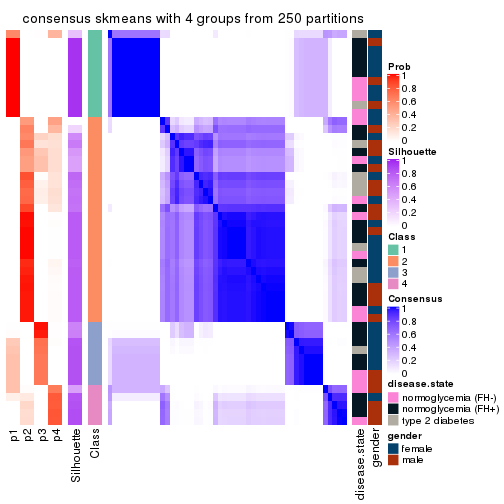</p>

</div>
<div id='tab-ATC-skmeans-consensus-heatmap-4'>
<pre><code class="r">consensus_heatmap(res, k = 5)
</code></pre>

<p></p>

</div>
<div id='tab-ATC-skmeans-consensus-heatmap-5'>
<pre><code class="r">consensus_heatmap(res, k = 6)
</code></pre>

<p></p>

</div>
</div>

Heatmaps for the membership of samples in all partitions to see how consistent they are:


<script>
$( function() {
	$( '#tabs-ATC-skmeans-membership-heatmap' ).tabs();
} );
</script>
<div id='tabs-ATC-skmeans-membership-heatmap'>
<ul>
<li><a href='#tab-ATC-skmeans-membership-heatmap-1'>k = 2</a></li>
<li><a href='#tab-ATC-skmeans-membership-heatmap-2'>k = 3</a></li>
<li><a href='#tab-ATC-skmeans-membership-heatmap-3'>k = 4</a></li>
<li><a href='#tab-ATC-skmeans-membership-heatmap-4'>k = 5</a></li>
<li><a href='#tab-ATC-skmeans-membership-heatmap-5'>k = 6</a></li>
</ul>
<div id='tab-ATC-skmeans-membership-heatmap-1'>
<pre><code class="r">membership_heatmap(res, k = 2)
</code></pre>

<p></p>

</div>
<div id='tab-ATC-skmeans-membership-heatmap-2'>
<pre><code class="r">membership_heatmap(res, k = 3)
</code></pre>

<p></p>

</div>
<div id='tab-ATC-skmeans-membership-heatmap-3'>
<pre><code class="r">membership_heatmap(res, k = 4)
</code></pre>

<p></p>

</div>
<div id='tab-ATC-skmeans-membership-heatmap-4'>
<pre><code class="r">membership_heatmap(res, k = 5)
</code></pre>

<p></p>

</div>
<div id='tab-ATC-skmeans-membership-heatmap-5'>
<pre><code class="r">membership_heatmap(res, k = 6)
</code></pre>

<p></p>

</div>
</div>

As soon as we have had the classes for columns, we can look for signatures
which are significantly different between classes which can be candidate marks
for certain classes. Following are the heatmaps for signatures.


Signature heatmaps where rows are scaled:


<script>
$( function() {
	$( '#tabs-ATC-skmeans-get-signatures' ).tabs();
} );
</script>
<div id='tabs-ATC-skmeans-get-signatures'>
<ul>
<li><a href='#tab-ATC-skmeans-get-signatures-1'>k = 2</a></li>
<li><a href='#tab-ATC-skmeans-get-signatures-2'>k = 3</a></li>
<li><a href='#tab-ATC-skmeans-get-signatures-3'>k = 4</a></li>
<li><a href='#tab-ATC-skmeans-get-signatures-4'>k = 5</a></li>
<li><a href='#tab-ATC-skmeans-get-signatures-5'>k = 6</a></li>
</ul>
<div id='tab-ATC-skmeans-get-signatures-1'>
<pre><code class="r">get_signatures(res, k = 2)
</code></pre>

<p></p>

</div>
<div id='tab-ATC-skmeans-get-signatures-2'>
<pre><code class="r">get_signatures(res, k = 3)
</code></pre>

<p></p>

</div>
<div id='tab-ATC-skmeans-get-signatures-3'>
<pre><code class="r">get_signatures(res, k = 4)
</code></pre>

<p></p>

</div>
<div id='tab-ATC-skmeans-get-signatures-4'>
<pre><code class="r">get_signatures(res, k = 5)
</code></pre>

<p></p>

</div>
<div id='tab-ATC-skmeans-get-signatures-5'>
<pre><code class="r">get_signatures(res, k = 6)
</code></pre>

<p></p>

</div>
</div>


Signature heatmaps where rows are not scaled:


<script>
$( function() {
	$( '#tabs-ATC-skmeans-get-signatures-no-scale' ).tabs();
} );
</script>
<div id='tabs-ATC-skmeans-get-signatures-no-scale'>
<ul>
<li><a href='#tab-ATC-skmeans-get-signatures-no-scale-1'>k = 2</a></li>
<li><a href='#tab-ATC-skmeans-get-signatures-no-scale-2'>k = 3</a></li>
<li><a href='#tab-ATC-skmeans-get-signatures-no-scale-3'>k = 4</a></li>
<li><a href='#tab-ATC-skmeans-get-signatures-no-scale-4'>k = 5</a></li>
<li><a href='#tab-ATC-skmeans-get-signatures-no-scale-5'>k = 6</a></li>
</ul>
<div id='tab-ATC-skmeans-get-signatures-no-scale-1'>
<pre><code class="r">get_signatures(res, k = 2, scale_rows = FALSE)
</code></pre>

<p></p>

</div>
<div id='tab-ATC-skmeans-get-signatures-no-scale-2'>
<pre><code class="r">get_signatures(res, k = 3, scale_rows = FALSE)
</code></pre>

<p></p>

</div>
<div id='tab-ATC-skmeans-get-signatures-no-scale-3'>
<pre><code class="r">get_signatures(res, k = 4, scale_rows = FALSE)
</code></pre>

<p></p>

</div>
<div id='tab-ATC-skmeans-get-signatures-no-scale-4'>
<pre><code class="r">get_signatures(res, k = 5, scale_rows = FALSE)
</code></pre>

<p>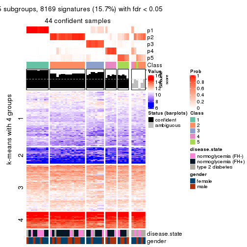</p>

</div>
<div id='tab-ATC-skmeans-get-signatures-no-scale-5'>
<pre><code class="r">get_signatures(res, k = 6, scale_rows = FALSE)
</code></pre>

<p>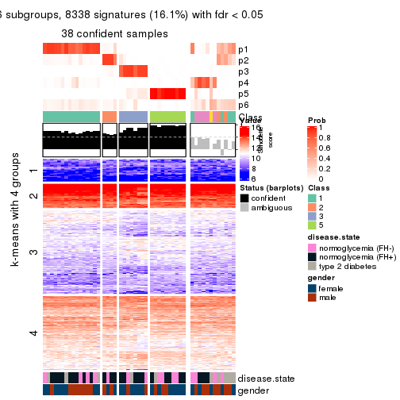</p>

</div>
</div>


Compare the overlap of signatures from different k:

```r
compare_signatures(res)
```


`get_signature()` returns a data frame invisibly. TO get the list of signatures, the function
call should be assigned to a variable explicitly. In following code, if `plot` argument is set
to `FALSE`, no heatmap is plotted while only the differential analysis is performed.

```r
# code only for demonstration
tb = get_signature(res, k = ..., plot = FALSE)
```

An example of the output of `tb` is:

```
#>   which_row         fdr    mean_1    mean_2 scaled_mean_1 scaled_mean_2 km
#> 1        38 0.042760348  8.373488  9.131774    -0.5533452     0.5164555  1
#> 2        40 0.018707592  7.106213  8.469186    -0.6173731     0.5762149  1
#> 3        55 0.019134737 10.221463 11.207825    -0.6159697     0.5749050  1
#> 4        59 0.006059896  5.921854  7.869574    -0.6899429     0.6439467  1
#> 5        60 0.018055526  8.928898 10.211722    -0.6204761     0.5791110  1
#> 6        98 0.009384629 15.714769 14.887706     0.6635654    -0.6193277  2
...
```

The columns in `tb` are:

1. `which_row`: row indices corresponding to the input matrix.
2. `fdr`: FDR for the differential test. 
3. `mean_x`: The mean value in group x.
4. `scaled_mean_x`: The mean value in group x after rows are scaled.
5. `km`: Row groups if k-means clustering is applied to rows.


UMAP plot which shows how samples are separated.


<script>
$( function() {
	$( '#tabs-ATC-skmeans-dimension-reduction' ).tabs();
} );
</script>
<div id='tabs-ATC-skmeans-dimension-reduction'>
<ul>
<li><a href='#tab-ATC-skmeans-dimension-reduction-1'>k = 2</a></li>
<li><a href='#tab-ATC-skmeans-dimension-reduction-2'>k = 3</a></li>
<li><a href='#tab-ATC-skmeans-dimension-reduction-3'>k = 4</a></li>
<li><a href='#tab-ATC-skmeans-dimension-reduction-4'>k = 5</a></li>
<li><a href='#tab-ATC-skmeans-dimension-reduction-5'>k = 6</a></li>
</ul>
<div id='tab-ATC-skmeans-dimension-reduction-1'>
<pre><code class="r">dimension_reduction(res, k = 2, method = &quot;UMAP&quot;)
</code></pre>

<p></p>

</div>
<div id='tab-ATC-skmeans-dimension-reduction-2'>
<pre><code class="r">dimension_reduction(res, k = 3, method = &quot;UMAP&quot;)
</code></pre>

<p></p>

</div>
<div id='tab-ATC-skmeans-dimension-reduction-3'>
<pre><code class="r">dimension_reduction(res, k = 4, method = &quot;UMAP&quot;)
</code></pre>

<p></p>

</div>
<div id='tab-ATC-skmeans-dimension-reduction-4'>
<pre><code class="r">dimension_reduction(res, k = 5, method = &quot;UMAP&quot;)
</code></pre>

<p></p>

</div>
<div id='tab-ATC-skmeans-dimension-reduction-5'>
<pre><code class="r">dimension_reduction(res, k = 6, method = &quot;UMAP&quot;)
</code></pre>

<p></p>

</div>
</div>


Following heatmap shows how subgroups are split when increasing `k`:

```r
collect_classes(res)
```


Test correlation between subgroups and known annotations. If the known
annotation is numeric, one-way ANOVA test is applied, and if the known
annotation is discrete, chi-squared contingency table test is applied.

```r
test_to_known_factors(res)
```

```
#>              n disease.state(p) gender(p) k
#> ATC:skmeans 50            0.844    0.0932 2
#> ATC:skmeans 44            0.729    0.4822 3
#> ATC:skmeans 44            0.605    0.2777 4
#> ATC:skmeans 44            0.972    0.2598 5
#> ATC:skmeans 38            0.928    0.5714 6
```


If matrix rows can be associated to genes, consider to use `functional_enrichment(res,
...)` to perform function enrichment for the signature genes. See [this vignette](http://bioconductor.org/packages/devel/bioc/vignettes/cola/inst/doc/functional_enrichment.html) for more detailed explanations.


 

---------------------------------------------------


### ATC:pam**


The object with results only for a single top-value method and a single partition method 
can be extracted as:

```r
res = res_list["ATC", "pam"]
# you can also extract it by
# res = res_list["ATC:pam"]
```

A summary of `res` and all the functions that can be applied to it:

```r
res
```

```
#> A 'ConsensusPartition' object with k = 2, 3, 4, 5, 6.
#>   On a matrix with 51941 rows and 50 columns.
#>   Top rows (1000, 2000, 3000, 4000, 5000) are extracted by 'ATC' method.
#>   Subgroups are detected by 'pam' method.
#>   Performed in total 1250 partitions by row resampling.
#>   Best k for subgroups seems to be 3.
#> 
#> Following methods can be applied to this 'ConsensusPartition' object:
#>  [1] "cola_report"             "collect_classes"         "collect_plots"          
#>  [4] "collect_stats"           "colnames"                "compare_signatures"     
#>  [7] "consensus_heatmap"       "dimension_reduction"     "functional_enrichment"  
#> [10] "get_anno_col"            "get_anno"                "get_classes"            
#> [13] "get_consensus"           "get_matrix"              "get_membership"         
#> [16] "get_param"               "get_signatures"          "get_stats"              
#> [19] "is_best_k"               "is_stable_k"             "membership_heatmap"     
#> [22] "ncol"                    "nrow"                    "plot_ecdf"              
#> [25] "rownames"                "select_partition_number" "show"                   
#> [28] "suggest_best_k"          "test_to_known_factors"
```

`collect_plots()` function collects all the plots made from `res` for all `k` (number of partitions)
into one single page to provide an easy and fast comparison between different `k`.

```r
collect_plots(res)
```


The plots are:

- The first row: a plot of the ECDF (empirical cumulative distribution
  function) curves of the consensus matrix for each `k` and the heatmap of
  predicted classes for each `k`.
- The second row: heatmaps of the consensus matrix for each `k`.
- The third row: heatmaps of the membership matrix for each `k`.
- The fouth row: heatmaps of the signatures for each `k`.

All the plots in panels can be made by individual functions and they are
plotted later in this section.

`select_partition_number()` produces several plots showing different
statistics for choosing "optimized" `k`. There are following statistics:

- ECDF curves of the consensus matrix for each `k`;
- 1-PAC. [The PAC
  score](https://en.wikipedia.org/wiki/Consensus_clustering#Over-interpretation_potential_of_consensus_clustering)
  measures the proportion of the ambiguous subgrouping.
- Mean silhouette score.
- Concordance. The mean probability of fiting the consensus class ids in all
  partitions.
- Area increased. Denote $A_k$ as the area under the ECDF curve for current
  `k`, the area increased is defined as $A_k - A_{k-1}$.
- Rand index. The percent of pairs of samples that are both in a same cluster
  or both are not in a same cluster in the partition of k and k-1.
- Jaccard index. The ratio of pairs of samples are both in a same cluster in
  the partition of k and k-1 and the pairs of samples are both in a same
  cluster in the partition k or k-1.

The detailed explanations of these statistics can be found in [the _cola_
vignette](http://bioconductor.org/packages/devel/bioc/vignettes/cola/inst/doc/cola.html#toc_13).

Generally speaking, lower PAC score, higher mean silhouette score or higher
concordance corresponds to better partition. Rand index and Jaccard index
measure how similar the current partition is compared to partition with `k-1`.
If they are too similar, we won't accept `k` is better than `k-1`.

```r
select_partition_number(res)
```


The numeric values for all these statistics can be obtained by `get_stats()`.

```r
get_stats(res)
```

```
#>   k 1-PAC mean_silhouette concordance area_increased  Rand Jaccard
#> 2 2 1.000           0.953       0.982         0.4457 0.542   0.542
#> 3 3 0.970           0.943       0.978         0.1975 0.886   0.797
#> 4 4 0.772           0.823       0.871         0.1429 0.959   0.913
#> 5 5 0.612           0.424       0.752         0.1899 0.797   0.544
#> 6 6 0.652           0.688       0.816         0.0584 0.805   0.442
```

`suggest_best_k()` suggests the best $k$ based on these statistics. The rules are as follows:

- All $k$ with Jaccard index larger than 0.95 are removed because increasing
  $k$ does not provide enough extra information. If all $k$ are removed, it is
  marked as no subgroup is detected.
- For all $k$ with 1-PAC score larger than 0.9, the maximal $k$ is taken as
  the best $k$, and other $k$ are marked as optional $k$.
- If it does not fit the second rule. The $k$ with the maximal vote of the
  highest 1-PAC score, highest mean silhouette, and highest concordance is
  taken as the best $k$.

```r
suggest_best_k(res)
```

```
#> [1] 3
#> attr(,"optional")
#> [1] 2
```

There is also optional best $k$ = 2 that is worth to check.

Following shows the table of the partitions (You need to click the **show/hide
code output** link to see it). The membership matrix (columns with name `p*`)
is inferred by
[`clue::cl_consensus()`](https://www.rdocumentation.org/link/cl_consensus?package=clue)
function with the `SE` method. Basically the value in the membership matrix
represents the probability to belong to a certain group. The finall class
label for an item is determined with the group with highest probability it
belongs to.

In `get_classes()` function, the entropy is calculated from the membership
matrix and the silhouette score is calculated from the consensus matrix.


<script>
$( function() {
	$( '#tabs-ATC-pam-get-classes' ).tabs();
} );
</script>
<div id='tabs-ATC-pam-get-classes'>
<ul>
<li><a href='#tab-ATC-pam-get-classes-1'>k = 2</a></li>
<li><a href='#tab-ATC-pam-get-classes-2'>k = 3</a></li>
<li><a href='#tab-ATC-pam-get-classes-3'>k = 4</a></li>
<li><a href='#tab-ATC-pam-get-classes-4'>k = 5</a></li>
<li><a href='#tab-ATC-pam-get-classes-5'>k = 6</a></li>
</ul>

<div id='tab-ATC-pam-get-classes-1'>
<p><a id='tab-ATC-pam-get-classes-1-a' style='color:#0366d6' href='#'>show/hide code output</a></p>
<pre><code class="r">cbind(get_classes(res, k = 2), get_membership(res, k = 2))
</code></pre>

<pre><code>#&gt;           class entropy silhouette    p1    p2
#&gt; GSM624962     1  0.9998     0.0862 0.508 0.492
#&gt; GSM624963     2  0.0000     1.0000 0.000 1.000
#&gt; GSM624967     2  0.0000     1.0000 0.000 1.000
#&gt; GSM624968     1  0.0672     0.9380 0.992 0.008
#&gt; GSM624969     2  0.0000     1.0000 0.000 1.000
#&gt; GSM624970     2  0.0000     1.0000 0.000 1.000
#&gt; GSM624961     2  0.0000     1.0000 0.000 1.000
#&gt; GSM624964     2  0.0000     1.0000 0.000 1.000
#&gt; GSM624965     2  0.0000     1.0000 0.000 1.000
#&gt; GSM624966     1  0.0000     0.9441 1.000 0.000
#&gt; GSM624925     2  0.0000     1.0000 0.000 1.000
#&gt; GSM624927     2  0.0000     1.0000 0.000 1.000
#&gt; GSM624929     2  0.0000     1.0000 0.000 1.000
#&gt; GSM624930     1  0.0000     0.9441 1.000 0.000
#&gt; GSM624931     1  0.0000     0.9441 1.000 0.000
#&gt; GSM624935     2  0.0000     1.0000 0.000 1.000
#&gt; GSM624936     1  0.0000     0.9441 1.000 0.000
#&gt; GSM624937     2  0.0000     1.0000 0.000 1.000
#&gt; GSM624926     2  0.0000     1.0000 0.000 1.000
#&gt; GSM624928     2  0.0000     1.0000 0.000 1.000
#&gt; GSM624932     1  0.0000     0.9441 1.000 0.000
#&gt; GSM624933     2  0.0000     1.0000 0.000 1.000
#&gt; GSM624934     2  0.0000     1.0000 0.000 1.000
#&gt; GSM624971     1  0.0000     0.9441 1.000 0.000
#&gt; GSM624973     1  0.0000     0.9441 1.000 0.000
#&gt; GSM624938     1  0.0000     0.9441 1.000 0.000
#&gt; GSM624940     1  0.0000     0.9441 1.000 0.000
#&gt; GSM624941     2  0.0000     1.0000 0.000 1.000
#&gt; GSM624942     2  0.0000     1.0000 0.000 1.000
#&gt; GSM624943     2  0.0000     1.0000 0.000 1.000
#&gt; GSM624945     2  0.0000     1.0000 0.000 1.000
#&gt; GSM624946     1  0.0000     0.9441 1.000 0.000
#&gt; GSM624949     2  0.0000     1.0000 0.000 1.000
#&gt; GSM624951     1  0.0000     0.9441 1.000 0.000
#&gt; GSM624952     1  0.0000     0.9441 1.000 0.000
#&gt; GSM624955     1  0.9580     0.4119 0.620 0.380
#&gt; GSM624956     2  0.0000     1.0000 0.000 1.000
#&gt; GSM624957     2  0.0000     1.0000 0.000 1.000
#&gt; GSM624974     1  0.0000     0.9441 1.000 0.000
#&gt; GSM624939     1  0.0000     0.9441 1.000 0.000
#&gt; GSM624944     2  0.0000     1.0000 0.000 1.000
#&gt; GSM624947     2  0.0000     1.0000 0.000 1.000
#&gt; GSM624948     2  0.0000     1.0000 0.000 1.000
#&gt; GSM624950     2  0.0000     1.0000 0.000 1.000
#&gt; GSM624953     2  0.0000     1.0000 0.000 1.000
#&gt; GSM624954     2  0.0000     1.0000 0.000 1.000
#&gt; GSM624958     2  0.0000     1.0000 0.000 1.000
#&gt; GSM624959     2  0.0000     1.0000 0.000 1.000
#&gt; GSM624960     2  0.0000     1.0000 0.000 1.000
#&gt; GSM624972     2  0.0000     1.0000 0.000 1.000
</code></pre>

<script>
$('#tab-ATC-pam-get-classes-1-a').parent().next().next().hide();
$('#tab-ATC-pam-get-classes-1-a').click(function(){
  $('#tab-ATC-pam-get-classes-1-a').parent().next().next().toggle();
  return(false);
});
</script>
</div>

<div id='tab-ATC-pam-get-classes-2'>
<p><a id='tab-ATC-pam-get-classes-2-a' style='color:#0366d6' href='#'>show/hide code output</a></p>
<pre><code class="r">cbind(get_classes(res, k = 3), get_membership(res, k = 3))
</code></pre>

<pre><code>#&gt;           class entropy silhouette    p1    p2    p3
#&gt; GSM624962     1   0.000      0.958 1.000 0.000 0.000
#&gt; GSM624963     2   0.000      0.981 0.000 1.000 0.000
#&gt; GSM624967     2   0.000      0.981 0.000 1.000 0.000
#&gt; GSM624968     1   0.000      0.958 1.000 0.000 0.000
#&gt; GSM624969     2   0.000      0.981 0.000 1.000 0.000
#&gt; GSM624970     2   0.000      0.981 0.000 1.000 0.000
#&gt; GSM624961     2   0.000      0.981 0.000 1.000 0.000
#&gt; GSM624964     2   0.000      0.981 0.000 1.000 0.000
#&gt; GSM624965     2   0.000      0.981 0.000 1.000 0.000
#&gt; GSM624966     1   0.000      0.958 1.000 0.000 0.000
#&gt; GSM624925     2   0.000      0.981 0.000 1.000 0.000
#&gt; GSM624927     2   0.000      0.981 0.000 1.000 0.000
#&gt; GSM624929     2   0.000      0.981 0.000 1.000 0.000
#&gt; GSM624930     1   0.000      0.958 1.000 0.000 0.000
#&gt; GSM624931     1   0.000      0.958 1.000 0.000 0.000
#&gt; GSM624935     2   0.000      0.981 0.000 1.000 0.000
#&gt; GSM624936     1   0.000      0.958 1.000 0.000 0.000
#&gt; GSM624937     2   0.000      0.981 0.000 1.000 0.000
#&gt; GSM624926     2   0.000      0.981 0.000 1.000 0.000
#&gt; GSM624928     2   0.000      0.981 0.000 1.000 0.000
#&gt; GSM624932     1   0.000      0.958 1.000 0.000 0.000
#&gt; GSM624933     2   0.000      0.981 0.000 1.000 0.000
#&gt; GSM624934     1   0.000      0.958 1.000 0.000 0.000
#&gt; GSM624971     3   0.000      0.944 0.000 0.000 1.000
#&gt; GSM624973     3   0.394      0.806 0.156 0.000 0.844
#&gt; GSM624938     3   0.000      0.944 0.000 0.000 1.000
#&gt; GSM624940     1   0.429      0.757 0.820 0.000 0.180
#&gt; GSM624941     2   0.000      0.981 0.000 1.000 0.000
#&gt; GSM624942     2   0.000      0.981 0.000 1.000 0.000
#&gt; GSM624943     2   0.000      0.981 0.000 1.000 0.000
#&gt; GSM624945     2   0.502      0.669 0.240 0.760 0.000
#&gt; GSM624946     3   0.000      0.944 0.000 0.000 1.000
#&gt; GSM624949     2   0.525      0.631 0.264 0.736 0.000
#&gt; GSM624951     1   0.000      0.958 1.000 0.000 0.000
#&gt; GSM624952     1   0.000      0.958 1.000 0.000 0.000
#&gt; GSM624955     1   0.000      0.958 1.000 0.000 0.000
#&gt; GSM624956     2   0.000      0.981 0.000 1.000 0.000
#&gt; GSM624957     1   0.502      0.562 0.760 0.240 0.000
#&gt; GSM624974     1   0.000      0.958 1.000 0.000 0.000
#&gt; GSM624939     1   0.000      0.958 1.000 0.000 0.000
#&gt; GSM624944     2   0.000      0.981 0.000 1.000 0.000
#&gt; GSM624947     2   0.000      0.981 0.000 1.000 0.000
#&gt; GSM624948     2   0.000      0.981 0.000 1.000 0.000
#&gt; GSM624950     2   0.000      0.981 0.000 1.000 0.000
#&gt; GSM624953     2   0.000      0.981 0.000 1.000 0.000
#&gt; GSM624954     2   0.000      0.981 0.000 1.000 0.000
#&gt; GSM624958     2   0.000      0.981 0.000 1.000 0.000
#&gt; GSM624959     2   0.000      0.981 0.000 1.000 0.000
#&gt; GSM624960     2   0.000      0.981 0.000 1.000 0.000
#&gt; GSM624972     2   0.000      0.981 0.000 1.000 0.000
</code></pre>

<script>
$('#tab-ATC-pam-get-classes-2-a').parent().next().next().hide();
$('#tab-ATC-pam-get-classes-2-a').click(function(){
  $('#tab-ATC-pam-get-classes-2-a').parent().next().next().toggle();
  return(false);
});
</script>
</div>

<div id='tab-ATC-pam-get-classes-3'>
<p><a id='tab-ATC-pam-get-classes-3-a' style='color:#0366d6' href='#'>show/hide code output</a></p>
<pre><code class="r">cbind(get_classes(res, k = 4), get_membership(res, k = 4))
</code></pre>

<pre><code>#&gt;           class entropy silhouette    p1    p2    p3    p4
#&gt; GSM624962     1  0.1867      0.750 0.928 0.072 0.000 0.000
#&gt; GSM624963     2  0.0000      0.879 0.000 1.000 0.000 0.000
#&gt; GSM624967     2  0.4356      0.772 0.000 0.708 0.000 0.292
#&gt; GSM624968     1  0.1867      0.779 0.928 0.000 0.000 0.072
#&gt; GSM624969     2  0.4356      0.772 0.000 0.708 0.000 0.292
#&gt; GSM624970     2  0.4356      0.772 0.000 0.708 0.000 0.292
#&gt; GSM624961     2  0.0188      0.880 0.000 0.996 0.000 0.004
#&gt; GSM624964     2  0.0000      0.879 0.000 1.000 0.000 0.000
#&gt; GSM624965     2  0.0000      0.879 0.000 1.000 0.000 0.000
#&gt; GSM624966     4  0.4730      1.000 0.364 0.000 0.000 0.636
#&gt; GSM624925     2  0.0000      0.879 0.000 1.000 0.000 0.000
#&gt; GSM624927     2  0.4103      0.787 0.000 0.744 0.000 0.256
#&gt; GSM624929     2  0.0000      0.879 0.000 1.000 0.000 0.000
#&gt; GSM624930     1  0.0000      0.803 1.000 0.000 0.000 0.000
#&gt; GSM624931     1  0.0000      0.803 1.000 0.000 0.000 0.000
#&gt; GSM624935     2  0.1716      0.870 0.000 0.936 0.000 0.064
#&gt; GSM624936     1  0.0000      0.803 1.000 0.000 0.000 0.000
#&gt; GSM624937     2  0.4164      0.782 0.000 0.736 0.000 0.264
#&gt; GSM624926     2  0.1867      0.836 0.000 0.928 0.000 0.072
#&gt; GSM624928     2  0.0000      0.879 0.000 1.000 0.000 0.000
#&gt; GSM624932     1  0.0000      0.803 1.000 0.000 0.000 0.000
#&gt; GSM624933     2  0.0921      0.874 0.000 0.972 0.000 0.028
#&gt; GSM624934     1  0.1867      0.750 0.928 0.072 0.000 0.000
#&gt; GSM624971     3  0.0000      0.902 0.000 0.000 1.000 0.000
#&gt; GSM624973     3  0.4382      0.620 0.000 0.000 0.704 0.296
#&gt; GSM624938     3  0.0000      0.902 0.000 0.000 1.000 0.000
#&gt; GSM624940     4  0.4730      1.000 0.364 0.000 0.000 0.636
#&gt; GSM624941     2  0.4164      0.782 0.000 0.736 0.000 0.264
#&gt; GSM624942     2  0.4164      0.782 0.000 0.736 0.000 0.264
#&gt; GSM624943     2  0.4164      0.782 0.000 0.736 0.000 0.264
#&gt; GSM624945     2  0.3975      0.612 0.240 0.760 0.000 0.000
#&gt; GSM624946     3  0.0000      0.902 0.000 0.000 1.000 0.000
#&gt; GSM624949     2  0.4164      0.571 0.264 0.736 0.000 0.000
#&gt; GSM624951     4  0.4730      1.000 0.364 0.000 0.000 0.636
#&gt; GSM624952     1  0.0000      0.803 1.000 0.000 0.000 0.000
#&gt; GSM624955     1  0.1867      0.779 0.928 0.000 0.000 0.072
#&gt; GSM624956     2  0.0000      0.879 0.000 1.000 0.000 0.000
#&gt; GSM624957     1  0.7753      0.103 0.432 0.312 0.000 0.256
#&gt; GSM624974     4  0.4730      1.000 0.364 0.000 0.000 0.636
#&gt; GSM624939     4  0.4730      1.000 0.364 0.000 0.000 0.636
#&gt; GSM624944     2  0.0817      0.875 0.000 0.976 0.000 0.024
#&gt; GSM624947     2  0.0707      0.876 0.000 0.980 0.000 0.020
#&gt; GSM624948     2  0.0921      0.874 0.000 0.972 0.000 0.028
#&gt; GSM624950     2  0.4072      0.790 0.000 0.748 0.000 0.252
#&gt; GSM624953     2  0.0000      0.879 0.000 1.000 0.000 0.000
#&gt; GSM624954     2  0.4040      0.792 0.000 0.752 0.000 0.248
#&gt; GSM624958     2  0.0000      0.879 0.000 1.000 0.000 0.000
#&gt; GSM624959     2  0.0921      0.874 0.000 0.972 0.000 0.028
#&gt; GSM624960     2  0.0469      0.879 0.000 0.988 0.000 0.012
#&gt; GSM624972     2  0.0000      0.879 0.000 1.000 0.000 0.000
</code></pre>

<script>
$('#tab-ATC-pam-get-classes-3-a').parent().next().next().hide();
$('#tab-ATC-pam-get-classes-3-a').click(function(){
  $('#tab-ATC-pam-get-classes-3-a').parent().next().next().toggle();
  return(false);
});
</script>
</div>

<div id='tab-ATC-pam-get-classes-4'>
<p><a id='tab-ATC-pam-get-classes-4-a' style='color:#0366d6' href='#'>show/hide code output</a></p>
<pre><code class="r">cbind(get_classes(res, k = 5), get_membership(res, k = 5))
</code></pre>

<pre><code>#&gt;           class entropy silhouette    p1    p2   p3    p4    p5
#&gt; GSM624962     1  0.2891     0.7226 0.824 0.176 0.00 0.000 0.000
#&gt; GSM624963     4  0.4306    -0.2050 0.000 0.492 0.00 0.508 0.000
#&gt; GSM624967     4  0.3932     0.2270 0.000 0.328 0.00 0.672 0.000
#&gt; GSM624968     1  0.2852     0.8209 0.828 0.000 0.00 0.000 0.172
#&gt; GSM624969     4  0.4210     0.1511 0.000 0.412 0.00 0.588 0.000
#&gt; GSM624970     4  0.3837     0.2374 0.000 0.308 0.00 0.692 0.000
#&gt; GSM624961     4  0.4235    -0.1092 0.000 0.424 0.00 0.576 0.000
#&gt; GSM624964     4  0.4302    -0.1904 0.000 0.480 0.00 0.520 0.000
#&gt; GSM624965     2  0.4307     0.1172 0.000 0.504 0.00 0.496 0.000
#&gt; GSM624966     5  0.2852     1.0000 0.172 0.000 0.00 0.000 0.828
#&gt; GSM624925     4  0.4306    -0.2050 0.000 0.492 0.00 0.508 0.000
#&gt; GSM624927     4  0.0404     0.4283 0.000 0.012 0.00 0.988 0.000
#&gt; GSM624929     4  0.4306    -0.2050 0.000 0.492 0.00 0.508 0.000
#&gt; GSM624930     1  0.0000     0.8824 1.000 0.000 0.00 0.000 0.000
#&gt; GSM624931     1  0.0000     0.8824 1.000 0.000 0.00 0.000 0.000
#&gt; GSM624935     2  0.2516     0.3320 0.000 0.860 0.00 0.140 0.000
#&gt; GSM624936     1  0.0000     0.8824 1.000 0.000 0.00 0.000 0.000
#&gt; GSM624937     4  0.0609     0.4271 0.000 0.020 0.00 0.980 0.000
#&gt; GSM624926     4  0.6317    -0.1329 0.000 0.332 0.00 0.496 0.172
#&gt; GSM624928     4  0.4306    -0.2050 0.000 0.492 0.00 0.508 0.000
#&gt; GSM624932     1  0.0000     0.8824 1.000 0.000 0.00 0.000 0.000
#&gt; GSM624933     2  0.0880     0.4570 0.000 0.968 0.00 0.032 0.000
#&gt; GSM624934     1  0.2890     0.7689 0.836 0.004 0.00 0.160 0.000
#&gt; GSM624971     3  0.0000     0.8888 0.000 0.000 1.00 0.000 0.000
#&gt; GSM624973     3  0.3895     0.5376 0.000 0.000 0.68 0.000 0.320
#&gt; GSM624938     3  0.0000     0.8888 0.000 0.000 1.00 0.000 0.000
#&gt; GSM624940     5  0.2852     1.0000 0.172 0.000 0.00 0.000 0.828
#&gt; GSM624941     4  0.0609     0.4271 0.000 0.020 0.00 0.980 0.000
#&gt; GSM624942     4  0.0404     0.4290 0.000 0.012 0.00 0.988 0.000
#&gt; GSM624943     4  0.0162     0.4293 0.000 0.004 0.00 0.996 0.000
#&gt; GSM624945     2  0.6296     0.3435 0.172 0.504 0.00 0.324 0.000
#&gt; GSM624946     3  0.0000     0.8888 0.000 0.000 1.00 0.000 0.000
#&gt; GSM624949     2  0.6491     0.3405 0.228 0.488 0.00 0.284 0.000
#&gt; GSM624951     5  0.2852     1.0000 0.172 0.000 0.00 0.000 0.828
#&gt; GSM624952     1  0.0000     0.8824 1.000 0.000 0.00 0.000 0.000
#&gt; GSM624955     1  0.3242     0.8162 0.816 0.012 0.00 0.000 0.172
#&gt; GSM624956     2  0.4307     0.1172 0.000 0.504 0.00 0.496 0.000
#&gt; GSM624957     4  0.3966     0.0526 0.336 0.000 0.00 0.664 0.000
#&gt; GSM624974     5  0.2852     1.0000 0.172 0.000 0.00 0.000 0.828
#&gt; GSM624939     5  0.2852     1.0000 0.172 0.000 0.00 0.000 0.828
#&gt; GSM624944     2  0.3210     0.4647 0.000 0.788 0.00 0.212 0.000
#&gt; GSM624947     2  0.4030     0.3533 0.000 0.648 0.00 0.352 0.000
#&gt; GSM624948     2  0.0404     0.4683 0.000 0.988 0.00 0.012 0.000
#&gt; GSM624950     4  0.0510     0.4270 0.000 0.016 0.00 0.984 0.000
#&gt; GSM624953     4  0.4306    -0.2050 0.000 0.492 0.00 0.508 0.000
#&gt; GSM624954     4  0.1341     0.4161 0.000 0.056 0.00 0.944 0.000
#&gt; GSM624958     4  0.4306    -0.2050 0.000 0.492 0.00 0.508 0.000
#&gt; GSM624959     2  0.0703     0.4715 0.000 0.976 0.00 0.024 0.000
#&gt; GSM624960     4  0.4249    -0.1203 0.000 0.432 0.00 0.568 0.000
#&gt; GSM624972     2  0.4307     0.1172 0.000 0.504 0.00 0.496 0.000
</code></pre>

<script>
$('#tab-ATC-pam-get-classes-4-a').parent().next().next().hide();
$('#tab-ATC-pam-get-classes-4-a').click(function(){
  $('#tab-ATC-pam-get-classes-4-a').parent().next().next().toggle();
  return(false);
});
</script>
</div>

<div id='tab-ATC-pam-get-classes-5'>
<p><a id='tab-ATC-pam-get-classes-5-a' style='color:#0366d6' href='#'>show/hide code output</a></p>
<pre><code class="r">cbind(get_classes(res, k = 6), get_membership(res, k = 6))
</code></pre>

<pre><code>#&gt;           class entropy silhouette    p1    p2   p3    p4   p5    p6
#&gt; GSM624962     6  0.2854      0.518 0.000 0.000 0.00 0.208 0.00 0.792
#&gt; GSM624963     2  0.0146      0.727 0.004 0.996 0.00 0.000 0.00 0.000
#&gt; GSM624967     1  0.3418      0.668 0.784 0.184 0.00 0.032 0.00 0.000
#&gt; GSM624968     6  0.2793      0.604 0.000 0.000 0.00 0.200 0.00 0.800
#&gt; GSM624969     1  0.4685      0.327 0.664 0.096 0.00 0.240 0.00 0.000
#&gt; GSM624970     1  0.2994      0.699 0.788 0.208 0.00 0.004 0.00 0.000
#&gt; GSM624961     2  0.2340      0.565 0.148 0.852 0.00 0.000 0.00 0.000
#&gt; GSM624964     2  0.0713      0.711 0.028 0.972 0.00 0.000 0.00 0.000
#&gt; GSM624965     2  0.2454      0.710 0.000 0.840 0.00 0.160 0.00 0.000
#&gt; GSM624966     5  0.0000      1.000 0.000 0.000 0.00 0.000 1.00 0.000
#&gt; GSM624925     2  0.0000      0.727 0.000 1.000 0.00 0.000 0.00 0.000
#&gt; GSM624927     1  0.3769      0.761 0.640 0.356 0.00 0.004 0.00 0.000
#&gt; GSM624929     2  0.0000      0.727 0.000 1.000 0.00 0.000 0.00 0.000
#&gt; GSM624930     6  0.0000      0.906 0.000 0.000 0.00 0.000 0.00 1.000
#&gt; GSM624931     6  0.0000      0.906 0.000 0.000 0.00 0.000 0.00 1.000
#&gt; GSM624935     1  0.6010     -0.356 0.400 0.360 0.00 0.240 0.00 0.000
#&gt; GSM624936     6  0.0000      0.906 0.000 0.000 0.00 0.000 0.00 1.000
#&gt; GSM624937     1  0.3531      0.772 0.672 0.328 0.00 0.000 0.00 0.000
#&gt; GSM624926     2  0.3288      0.553 0.000 0.724 0.00 0.276 0.00 0.000
#&gt; GSM624928     2  0.0146      0.727 0.004 0.996 0.00 0.000 0.00 0.000
#&gt; GSM624932     6  0.0000      0.906 0.000 0.000 0.00 0.000 0.00 1.000
#&gt; GSM624933     2  0.6001      0.312 0.348 0.412 0.00 0.240 0.00 0.000
#&gt; GSM624934     6  0.0000      0.906 0.000 0.000 0.00 0.000 0.00 1.000
#&gt; GSM624971     3  0.0000      0.864 0.000 0.000 1.00 0.000 0.00 0.000
#&gt; GSM624973     3  0.3499      0.529 0.000 0.000 0.68 0.000 0.32 0.000
#&gt; GSM624938     3  0.0000      0.864 0.000 0.000 1.00 0.000 0.00 0.000
#&gt; GSM624940     5  0.0000      1.000 0.000 0.000 0.00 0.000 1.00 0.000
#&gt; GSM624941     1  0.3531      0.772 0.672 0.328 0.00 0.000 0.00 0.000
#&gt; GSM624942     1  0.3563      0.771 0.664 0.336 0.00 0.000 0.00 0.000
#&gt; GSM624943     1  0.3742      0.765 0.648 0.348 0.00 0.004 0.00 0.000
#&gt; GSM624945     2  0.2854      0.679 0.000 0.792 0.00 0.208 0.00 0.000
#&gt; GSM624946     3  0.0000      0.864 0.000 0.000 1.00 0.000 0.00 0.000
#&gt; GSM624949     2  0.3602      0.658 0.000 0.760 0.00 0.208 0.00 0.032
#&gt; GSM624951     5  0.0000      1.000 0.000 0.000 0.00 0.000 1.00 0.000
#&gt; GSM624952     6  0.0000      0.906 0.000 0.000 0.00 0.000 0.00 1.000
#&gt; GSM624955     4  0.3126      0.000 0.000 0.000 0.00 0.752 0.00 0.248
#&gt; GSM624956     2  0.2631      0.698 0.000 0.820 0.00 0.180 0.00 0.000
#&gt; GSM624957     1  0.5144      0.621 0.640 0.188 0.00 0.004 0.00 0.168
#&gt; GSM624974     5  0.0000      1.000 0.000 0.000 0.00 0.000 1.00 0.000
#&gt; GSM624939     5  0.0000      1.000 0.000 0.000 0.00 0.000 1.00 0.000
#&gt; GSM624944     2  0.5032      0.569 0.196 0.640 0.00 0.164 0.00 0.000
#&gt; GSM624947     2  0.3370      0.662 0.064 0.812 0.00 0.124 0.00 0.000
#&gt; GSM624948     2  0.6001      0.312 0.348 0.412 0.00 0.240 0.00 0.000
#&gt; GSM624950     1  0.3782      0.758 0.636 0.360 0.00 0.004 0.00 0.000
#&gt; GSM624953     2  0.0000      0.727 0.000 1.000 0.00 0.000 0.00 0.000
#&gt; GSM624954     1  0.3659      0.743 0.636 0.364 0.00 0.000 0.00 0.000
#&gt; GSM624958     2  0.0146      0.726 0.000 0.996 0.00 0.004 0.00 0.000
#&gt; GSM624959     2  0.5992      0.320 0.340 0.420 0.00 0.240 0.00 0.000
#&gt; GSM624960     2  0.2053      0.624 0.108 0.888 0.00 0.004 0.00 0.000
#&gt; GSM624972     2  0.2854      0.679 0.000 0.792 0.00 0.208 0.00 0.000
</code></pre>

<script>
$('#tab-ATC-pam-get-classes-5-a').parent().next().next().hide();
$('#tab-ATC-pam-get-classes-5-a').click(function(){
  $('#tab-ATC-pam-get-classes-5-a').parent().next().next().toggle();
  return(false);
});
</script>
</div>
</div>

Heatmaps for the consensus matrix. It visualizes the probability of two
samples to be in a same group.


<script>
$( function() {
	$( '#tabs-ATC-pam-consensus-heatmap' ).tabs();
} );
</script>
<div id='tabs-ATC-pam-consensus-heatmap'>
<ul>
<li><a href='#tab-ATC-pam-consensus-heatmap-1'>k = 2</a></li>
<li><a href='#tab-ATC-pam-consensus-heatmap-2'>k = 3</a></li>
<li><a href='#tab-ATC-pam-consensus-heatmap-3'>k = 4</a></li>
<li><a href='#tab-ATC-pam-consensus-heatmap-4'>k = 5</a></li>
<li><a href='#tab-ATC-pam-consensus-heatmap-5'>k = 6</a></li>
</ul>
<div id='tab-ATC-pam-consensus-heatmap-1'>
<pre><code class="r">consensus_heatmap(res, k = 2)
</code></pre>

<p></p>

</div>
<div id='tab-ATC-pam-consensus-heatmap-2'>
<pre><code class="r">consensus_heatmap(res, k = 3)
</code></pre>

<p></p>

</div>
<div id='tab-ATC-pam-consensus-heatmap-3'>
<pre><code class="r">consensus_heatmap(res, k = 4)
</code></pre>

<p></p>

</div>
<div id='tab-ATC-pam-consensus-heatmap-4'>
<pre><code class="r">consensus_heatmap(res, k = 5)
</code></pre>

<p></p>

</div>
<div id='tab-ATC-pam-consensus-heatmap-5'>
<pre><code class="r">consensus_heatmap(res, k = 6)
</code></pre>

<p></p>

</div>
</div>

Heatmaps for the membership of samples in all partitions to see how consistent they are:


<script>
$( function() {
	$( '#tabs-ATC-pam-membership-heatmap' ).tabs();
} );
</script>
<div id='tabs-ATC-pam-membership-heatmap'>
<ul>
<li><a href='#tab-ATC-pam-membership-heatmap-1'>k = 2</a></li>
<li><a href='#tab-ATC-pam-membership-heatmap-2'>k = 3</a></li>
<li><a href='#tab-ATC-pam-membership-heatmap-3'>k = 4</a></li>
<li><a href='#tab-ATC-pam-membership-heatmap-4'>k = 5</a></li>
<li><a href='#tab-ATC-pam-membership-heatmap-5'>k = 6</a></li>
</ul>
<div id='tab-ATC-pam-membership-heatmap-1'>
<pre><code class="r">membership_heatmap(res, k = 2)
</code></pre>

<p></p>

</div>
<div id='tab-ATC-pam-membership-heatmap-2'>
<pre><code class="r">membership_heatmap(res, k = 3)
</code></pre>

<p></p>

</div>
<div id='tab-ATC-pam-membership-heatmap-3'>
<pre><code class="r">membership_heatmap(res, k = 4)
</code></pre>

<p></p>

</div>
<div id='tab-ATC-pam-membership-heatmap-4'>
<pre><code class="r">membership_heatmap(res, k = 5)
</code></pre>

<p></p>

</div>
<div id='tab-ATC-pam-membership-heatmap-5'>
<pre><code class="r">membership_heatmap(res, k = 6)
</code></pre>

<p></p>

</div>
</div>

As soon as we have had the classes for columns, we can look for signatures
which are significantly different between classes which can be candidate marks
for certain classes. Following are the heatmaps for signatures.


Signature heatmaps where rows are scaled:


<script>
$( function() {
	$( '#tabs-ATC-pam-get-signatures' ).tabs();
} );
</script>
<div id='tabs-ATC-pam-get-signatures'>
<ul>
<li><a href='#tab-ATC-pam-get-signatures-1'>k = 2</a></li>
<li><a href='#tab-ATC-pam-get-signatures-2'>k = 3</a></li>
<li><a href='#tab-ATC-pam-get-signatures-3'>k = 4</a></li>
<li><a href='#tab-ATC-pam-get-signatures-4'>k = 5</a></li>
<li><a href='#tab-ATC-pam-get-signatures-5'>k = 6</a></li>
</ul>
<div id='tab-ATC-pam-get-signatures-1'>
<pre><code class="r">get_signatures(res, k = 2)
</code></pre>

<p></p>

</div>
<div id='tab-ATC-pam-get-signatures-2'>
<pre><code class="r">get_signatures(res, k = 3)
</code></pre>

<p></p>

</div>
<div id='tab-ATC-pam-get-signatures-3'>
<pre><code class="r">get_signatures(res, k = 4)
</code></pre>

<p></p>

</div>
<div id='tab-ATC-pam-get-signatures-4'>
<pre><code class="r">get_signatures(res, k = 5)
</code></pre>

<p>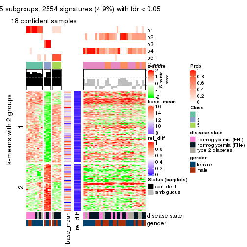</p>

</div>
<div id='tab-ATC-pam-get-signatures-5'>
<pre><code class="r">get_signatures(res, k = 6)
</code></pre>

<p></p>

</div>
</div>


Signature heatmaps where rows are not scaled:


<script>
$( function() {
	$( '#tabs-ATC-pam-get-signatures-no-scale' ).tabs();
} );
</script>
<div id='tabs-ATC-pam-get-signatures-no-scale'>
<ul>
<li><a href='#tab-ATC-pam-get-signatures-no-scale-1'>k = 2</a></li>
<li><a href='#tab-ATC-pam-get-signatures-no-scale-2'>k = 3</a></li>
<li><a href='#tab-ATC-pam-get-signatures-no-scale-3'>k = 4</a></li>
<li><a href='#tab-ATC-pam-get-signatures-no-scale-4'>k = 5</a></li>
<li><a href='#tab-ATC-pam-get-signatures-no-scale-5'>k = 6</a></li>
</ul>
<div id='tab-ATC-pam-get-signatures-no-scale-1'>
<pre><code class="r">get_signatures(res, k = 2, scale_rows = FALSE)
</code></pre>

<p></p>

</div>
<div id='tab-ATC-pam-get-signatures-no-scale-2'>
<pre><code class="r">get_signatures(res, k = 3, scale_rows = FALSE)
</code></pre>

<p></p>

</div>
<div id='tab-ATC-pam-get-signatures-no-scale-3'>
<pre><code class="r">get_signatures(res, k = 4, scale_rows = FALSE)
</code></pre>

<p></p>

</div>
<div id='tab-ATC-pam-get-signatures-no-scale-4'>
<pre><code class="r">get_signatures(res, k = 5, scale_rows = FALSE)
</code></pre>

<p>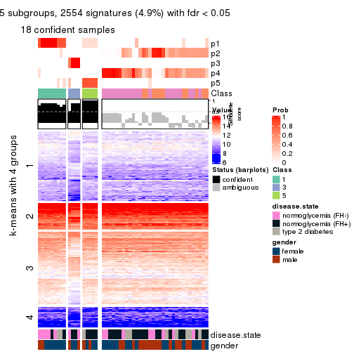</p>

</div>
<div id='tab-ATC-pam-get-signatures-no-scale-5'>
<pre><code class="r">get_signatures(res, k = 6, scale_rows = FALSE)
</code></pre>

<p></p>

</div>
</div>


Compare the overlap of signatures from different k:

```r
compare_signatures(res)
```


`get_signature()` returns a data frame invisibly. TO get the list of signatures, the function
call should be assigned to a variable explicitly. In following code, if `plot` argument is set
to `FALSE`, no heatmap is plotted while only the differential analysis is performed.

```r
# code only for demonstration
tb = get_signature(res, k = ..., plot = FALSE)
```

An example of the output of `tb` is:

```
#>   which_row         fdr    mean_1    mean_2 scaled_mean_1 scaled_mean_2 km
#> 1        38 0.042760348  8.373488  9.131774    -0.5533452     0.5164555  1
#> 2        40 0.018707592  7.106213  8.469186    -0.6173731     0.5762149  1
#> 3        55 0.019134737 10.221463 11.207825    -0.6159697     0.5749050  1
#> 4        59 0.006059896  5.921854  7.869574    -0.6899429     0.6439467  1
#> 5        60 0.018055526  8.928898 10.211722    -0.6204761     0.5791110  1
#> 6        98 0.009384629 15.714769 14.887706     0.6635654    -0.6193277  2
...
```

The columns in `tb` are:

1. `which_row`: row indices corresponding to the input matrix.
2. `fdr`: FDR for the differential test. 
3. `mean_x`: The mean value in group x.
4. `scaled_mean_x`: The mean value in group x after rows are scaled.
5. `km`: Row groups if k-means clustering is applied to rows.


UMAP plot which shows how samples are separated.


<script>
$( function() {
	$( '#tabs-ATC-pam-dimension-reduction' ).tabs();
} );
</script>
<div id='tabs-ATC-pam-dimension-reduction'>
<ul>
<li><a href='#tab-ATC-pam-dimension-reduction-1'>k = 2</a></li>
<li><a href='#tab-ATC-pam-dimension-reduction-2'>k = 3</a></li>
<li><a href='#tab-ATC-pam-dimension-reduction-3'>k = 4</a></li>
<li><a href='#tab-ATC-pam-dimension-reduction-4'>k = 5</a></li>
<li><a href='#tab-ATC-pam-dimension-reduction-5'>k = 6</a></li>
</ul>
<div id='tab-ATC-pam-dimension-reduction-1'>
<pre><code class="r">dimension_reduction(res, k = 2, method = &quot;UMAP&quot;)
</code></pre>

<p></p>

</div>
<div id='tab-ATC-pam-dimension-reduction-2'>
<pre><code class="r">dimension_reduction(res, k = 3, method = &quot;UMAP&quot;)
</code></pre>

<p>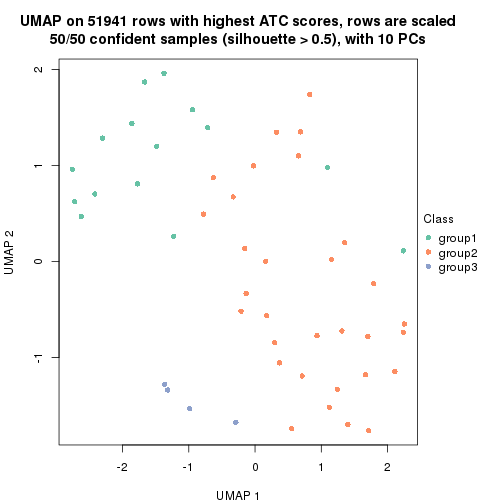</p>

</div>
<div id='tab-ATC-pam-dimension-reduction-3'>
<pre><code class="r">dimension_reduction(res, k = 4, method = &quot;UMAP&quot;)
</code></pre>

<p></p>

</div>
<div id='tab-ATC-pam-dimension-reduction-4'>
<pre><code class="r">dimension_reduction(res, k = 5, method = &quot;UMAP&quot;)
</code></pre>

<p></p>

</div>
<div id='tab-ATC-pam-dimension-reduction-5'>
<pre><code class="r">dimension_reduction(res, k = 6, method = &quot;UMAP&quot;)
</code></pre>

<p></p>

</div>
</div>


Following heatmap shows how subgroups are split when increasing `k`:

```r
collect_classes(res)
```


Test correlation between subgroups and known annotations. If the known
annotation is numeric, one-way ANOVA test is applied, and if the known
annotation is discrete, chi-squared contingency table test is applied.

```r
test_to_known_factors(res)
```

```
#>          n disease.state(p) gender(p) k
#> ATC:pam 48            0.630     0.390 2
#> ATC:pam 50            0.786     0.270 3
#> ATC:pam 49            0.291     0.471 4
#> ATC:pam 18            0.197     0.577 5
#> ATC:pam 44            0.275     0.160 6
```


If matrix rows can be associated to genes, consider to use `functional_enrichment(res,
...)` to perform function enrichment for the signature genes. See [this vignette](http://bioconductor.org/packages/devel/bioc/vignettes/cola/inst/doc/functional_enrichment.html) for more detailed explanations.


 

---------------------------------------------------


### ATC:mclust


The object with results only for a single top-value method and a single partition method 
can be extracted as:

```r
res = res_list["ATC", "mclust"]
# you can also extract it by
# res = res_list["ATC:mclust"]
```

A summary of `res` and all the functions that can be applied to it:

```r
res
```

```
#> A 'ConsensusPartition' object with k = 2, 3, 4, 5, 6.
#>   On a matrix with 51941 rows and 50 columns.
#>   Top rows (1000, 2000, 3000, 4000, 5000) are extracted by 'ATC' method.
#>   Subgroups are detected by 'mclust' method.
#>   Performed in total 1250 partitions by row resampling.
#>   Best k for subgroups seems to be 4.
#> 
#> Following methods can be applied to this 'ConsensusPartition' object:
#>  [1] "cola_report"             "collect_classes"         "collect_plots"          
#>  [4] "collect_stats"           "colnames"                "compare_signatures"     
#>  [7] "consensus_heatmap"       "dimension_reduction"     "functional_enrichment"  
#> [10] "get_anno_col"            "get_anno"                "get_classes"            
#> [13] "get_consensus"           "get_matrix"              "get_membership"         
#> [16] "get_param"               "get_signatures"          "get_stats"              
#> [19] "is_best_k"               "is_stable_k"             "membership_heatmap"     
#> [22] "ncol"                    "nrow"                    "plot_ecdf"              
#> [25] "rownames"                "select_partition_number" "show"                   
#> [28] "suggest_best_k"          "test_to_known_factors"
```

`collect_plots()` function collects all the plots made from `res` for all `k` (number of partitions)
into one single page to provide an easy and fast comparison between different `k`.

```r
collect_plots(res)
```


The plots are:

- The first row: a plot of the ECDF (empirical cumulative distribution
  function) curves of the consensus matrix for each `k` and the heatmap of
  predicted classes for each `k`.
- The second row: heatmaps of the consensus matrix for each `k`.
- The third row: heatmaps of the membership matrix for each `k`.
- The fouth row: heatmaps of the signatures for each `k`.

All the plots in panels can be made by individual functions and they are
plotted later in this section.

`select_partition_number()` produces several plots showing different
statistics for choosing "optimized" `k`. There are following statistics:

- ECDF curves of the consensus matrix for each `k`;
- 1-PAC. [The PAC
  score](https://en.wikipedia.org/wiki/Consensus_clustering#Over-interpretation_potential_of_consensus_clustering)
  measures the proportion of the ambiguous subgrouping.
- Mean silhouette score.
- Concordance. The mean probability of fiting the consensus class ids in all
  partitions.
- Area increased. Denote $A_k$ as the area under the ECDF curve for current
  `k`, the area increased is defined as $A_k - A_{k-1}$.
- Rand index. The percent of pairs of samples that are both in a same cluster
  or both are not in a same cluster in the partition of k and k-1.
- Jaccard index. The ratio of pairs of samples are both in a same cluster in
  the partition of k and k-1 and the pairs of samples are both in a same
  cluster in the partition k or k-1.

The detailed explanations of these statistics can be found in [the _cola_
vignette](http://bioconductor.org/packages/devel/bioc/vignettes/cola/inst/doc/cola.html#toc_13).

Generally speaking, lower PAC score, higher mean silhouette score or higher
concordance corresponds to better partition. Rand index and Jaccard index
measure how similar the current partition is compared to partition with `k-1`.
If they are too similar, we won't accept `k` is better than `k-1`.

```r
select_partition_number(res)
```


The numeric values for all these statistics can be obtained by `get_stats()`.

```r
get_stats(res)
```

```
#>   k 1-PAC mean_silhouette concordance area_increased  Rand Jaccard
#> 2 2 0.205           0.314       0.684         0.4180 0.497   0.497
#> 3 3 0.451           0.586       0.822         0.4085 0.689   0.491
#> 4 4 0.637           0.729       0.873         0.1507 0.783   0.532
#> 5 5 0.681           0.680       0.850         0.1117 0.899   0.684
#> 6 6 0.657           0.503       0.717         0.0428 0.900   0.639
```

`suggest_best_k()` suggests the best $k$ based on these statistics. The rules are as follows:

- All $k$ with Jaccard index larger than 0.95 are removed because increasing
  $k$ does not provide enough extra information. If all $k$ are removed, it is
  marked as no subgroup is detected.
- For all $k$ with 1-PAC score larger than 0.9, the maximal $k$ is taken as
  the best $k$, and other $k$ are marked as optional $k$.
- If it does not fit the second rule. The $k$ with the maximal vote of the
  highest 1-PAC score, highest mean silhouette, and highest concordance is
  taken as the best $k$.

```r
suggest_best_k(res)
```

```
#> [1] 4
```


Following shows the table of the partitions (You need to click the **show/hide
code output** link to see it). The membership matrix (columns with name `p*`)
is inferred by
[`clue::cl_consensus()`](https://www.rdocumentation.org/link/cl_consensus?package=clue)
function with the `SE` method. Basically the value in the membership matrix
represents the probability to belong to a certain group. The finall class
label for an item is determined with the group with highest probability it
belongs to.

In `get_classes()` function, the entropy is calculated from the membership
matrix and the silhouette score is calculated from the consensus matrix.


<script>
$( function() {
	$( '#tabs-ATC-mclust-get-classes' ).tabs();
} );
</script>
<div id='tabs-ATC-mclust-get-classes'>
<ul>
<li><a href='#tab-ATC-mclust-get-classes-1'>k = 2</a></li>
<li><a href='#tab-ATC-mclust-get-classes-2'>k = 3</a></li>
<li><a href='#tab-ATC-mclust-get-classes-3'>k = 4</a></li>
<li><a href='#tab-ATC-mclust-get-classes-4'>k = 5</a></li>
<li><a href='#tab-ATC-mclust-get-classes-5'>k = 6</a></li>
</ul>

<div id='tab-ATC-mclust-get-classes-1'>
<p><a id='tab-ATC-mclust-get-classes-1-a' style='color:#0366d6' href='#'>show/hide code output</a></p>
<pre><code class="r">cbind(get_classes(res, k = 2), get_membership(res, k = 2))
</code></pre>

<pre><code>#&gt;           class entropy silhouette    p1    p2
#&gt; GSM624962     1   0.999     -0.335 0.520 0.480
#&gt; GSM624963     2   0.925      0.598 0.340 0.660
#&gt; GSM624967     2   0.961      0.554 0.384 0.616
#&gt; GSM624968     1   0.802      0.451 0.756 0.244
#&gt; GSM624969     2   0.946      0.578 0.364 0.636
#&gt; GSM624970     2   1.000      0.289 0.500 0.500
#&gt; GSM624961     2   0.925      0.598 0.340 0.660
#&gt; GSM624964     2   0.925      0.598 0.340 0.660
#&gt; GSM624965     2   0.925      0.598 0.340 0.660
#&gt; GSM624966     1   0.680      0.438 0.820 0.180
#&gt; GSM624925     2   0.925      0.598 0.340 0.660
#&gt; GSM624927     1   0.242      0.539 0.960 0.040
#&gt; GSM624929     2   0.925      0.598 0.340 0.660
#&gt; GSM624930     1   0.000      0.550 1.000 0.000
#&gt; GSM624931     1   0.000      0.550 1.000 0.000
#&gt; GSM624935     2   0.980      0.504 0.416 0.584
#&gt; GSM624936     1   0.000      0.550 1.000 0.000
#&gt; GSM624937     1   1.000     -0.333 0.504 0.496
#&gt; GSM624926     1   0.802      0.451 0.756 0.244
#&gt; GSM624928     2   0.975      0.518 0.408 0.592
#&gt; GSM624932     1   0.000      0.550 1.000 0.000
#&gt; GSM624933     2   0.998      0.364 0.476 0.524
#&gt; GSM624934     1   0.000      0.550 1.000 0.000
#&gt; GSM624971     2   0.996     -0.163 0.464 0.536
#&gt; GSM624973     2   0.994     -0.162 0.456 0.544
#&gt; GSM624938     2   0.996     -0.163 0.464 0.536
#&gt; GSM624940     1   0.827      0.357 0.740 0.260
#&gt; GSM624941     1   1.000     -0.333 0.504 0.496
#&gt; GSM624942     1   1.000     -0.315 0.512 0.488
#&gt; GSM624943     1   0.949      0.036 0.632 0.368
#&gt; GSM624945     1   0.999     -0.335 0.520 0.480
#&gt; GSM624946     2   0.996     -0.163 0.464 0.536
#&gt; GSM624949     2   0.999      0.270 0.484 0.516
#&gt; GSM624951     1   0.671      0.442 0.824 0.176
#&gt; GSM624952     1   0.000      0.550 1.000 0.000
#&gt; GSM624955     1   0.998      0.108 0.528 0.472
#&gt; GSM624956     2   0.925      0.598 0.340 0.660
#&gt; GSM624957     1   0.000      0.550 1.000 0.000
#&gt; GSM624974     1   0.662      0.445 0.828 0.172
#&gt; GSM624939     1   0.662      0.445 0.828 0.172
#&gt; GSM624944     1   0.760      0.411 0.780 0.220
#&gt; GSM624947     1   0.697      0.451 0.812 0.188
#&gt; GSM624948     2   0.995      0.406 0.460 0.540
#&gt; GSM624950     1   0.697      0.451 0.812 0.188
#&gt; GSM624953     2   0.925      0.598 0.340 0.660
#&gt; GSM624954     2   0.929      0.595 0.344 0.656
#&gt; GSM624958     1   1.000     -0.345 0.500 0.500
#&gt; GSM624959     1   1.000     -0.333 0.504 0.496
#&gt; GSM624960     1   0.697      0.451 0.812 0.188
#&gt; GSM624972     2   0.978      0.471 0.412 0.588
</code></pre>

<script>
$('#tab-ATC-mclust-get-classes-1-a').parent().next().next().hide();
$('#tab-ATC-mclust-get-classes-1-a').click(function(){
  $('#tab-ATC-mclust-get-classes-1-a').parent().next().next().toggle();
  return(false);
});
</script>
</div>

<div id='tab-ATC-mclust-get-classes-2'>
<p><a id='tab-ATC-mclust-get-classes-2-a' style='color:#0366d6' href='#'>show/hide code output</a></p>
<pre><code class="r">cbind(get_classes(res, k = 3), get_membership(res, k = 3))
</code></pre>

<pre><code>#&gt;           class entropy silhouette    p1    p2    p3
#&gt; GSM624962     2  0.3539     0.7832 0.012 0.888 0.100
#&gt; GSM624963     2  0.0000     0.8491 0.000 1.000 0.000
#&gt; GSM624967     2  0.4504     0.8097 0.196 0.804 0.000
#&gt; GSM624968     1  0.3879    -0.0838 0.848 0.000 0.152
#&gt; GSM624969     2  0.0424     0.8493 0.008 0.992 0.000
#&gt; GSM624970     2  0.4702     0.7988 0.212 0.788 0.000
#&gt; GSM624961     2  0.0000     0.8491 0.000 1.000 0.000
#&gt; GSM624964     2  0.0000     0.8491 0.000 1.000 0.000
#&gt; GSM624965     2  0.0000     0.8491 0.000 1.000 0.000
#&gt; GSM624966     1  0.6252     0.6414 0.556 0.000 0.444
#&gt; GSM624925     2  0.0000     0.8491 0.000 1.000 0.000
#&gt; GSM624927     1  0.6779     0.6292 0.544 0.012 0.444
#&gt; GSM624929     2  0.0000     0.8491 0.000 1.000 0.000
#&gt; GSM624930     1  0.6252     0.6414 0.556 0.000 0.444
#&gt; GSM624931     1  0.6252     0.6414 0.556 0.000 0.444
#&gt; GSM624935     2  0.4605     0.8053 0.204 0.796 0.000
#&gt; GSM624936     1  0.6252     0.6414 0.556 0.000 0.444
#&gt; GSM624937     2  0.4931     0.7793 0.232 0.768 0.000
#&gt; GSM624926     1  0.4110    -0.0863 0.844 0.004 0.152
#&gt; GSM624928     2  0.4605     0.8053 0.204 0.796 0.000
#&gt; GSM624932     1  0.6252     0.6414 0.556 0.000 0.444
#&gt; GSM624933     2  0.4605     0.8053 0.204 0.796 0.000
#&gt; GSM624934     1  0.6252     0.6414 0.556 0.000 0.444
#&gt; GSM624971     3  0.6252     0.4859 0.444 0.000 0.556
#&gt; GSM624973     2  0.5884     0.5752 0.012 0.716 0.272
#&gt; GSM624938     3  0.6252     0.4859 0.444 0.000 0.556
#&gt; GSM624940     3  0.5905    -0.4339 0.352 0.000 0.648
#&gt; GSM624941     2  0.4291     0.8162 0.180 0.820 0.000
#&gt; GSM624942     2  0.4702     0.7988 0.212 0.788 0.000
#&gt; GSM624943     3  0.9514    -0.4986 0.364 0.192 0.444
#&gt; GSM624945     2  0.3539     0.7832 0.012 0.888 0.100
#&gt; GSM624946     3  0.6252     0.4859 0.444 0.000 0.556
#&gt; GSM624949     2  0.3539     0.7832 0.012 0.888 0.100
#&gt; GSM624951     1  0.6302     0.5946 0.520 0.000 0.480
#&gt; GSM624952     1  0.6252     0.6414 0.556 0.000 0.444
#&gt; GSM624955     1  0.9241    -0.2992 0.456 0.388 0.156
#&gt; GSM624956     2  0.0000     0.8491 0.000 1.000 0.000
#&gt; GSM624957     1  0.6252     0.6414 0.556 0.000 0.444
#&gt; GSM624974     1  0.6252     0.6414 0.556 0.000 0.444
#&gt; GSM624939     1  0.6252     0.6414 0.556 0.000 0.444
#&gt; GSM624944     1  0.6701    -0.1957 0.576 0.412 0.012
#&gt; GSM624947     1  0.5497     0.0400 0.708 0.292 0.000
#&gt; GSM624948     2  0.4605     0.8053 0.204 0.796 0.000
#&gt; GSM624950     1  0.6404     0.5414 0.644 0.012 0.344
#&gt; GSM624953     2  0.0000     0.8491 0.000 1.000 0.000
#&gt; GSM624954     2  0.0000     0.8491 0.000 1.000 0.000
#&gt; GSM624958     2  0.4702     0.7988 0.212 0.788 0.000
#&gt; GSM624959     2  0.4605     0.8053 0.204 0.796 0.000
#&gt; GSM624960     1  0.0424     0.1416 0.992 0.008 0.000
#&gt; GSM624972     2  0.0000     0.8491 0.000 1.000 0.000
</code></pre>

<script>
$('#tab-ATC-mclust-get-classes-2-a').parent().next().next().hide();
$('#tab-ATC-mclust-get-classes-2-a').click(function(){
  $('#tab-ATC-mclust-get-classes-2-a').parent().next().next().toggle();
  return(false);
});
</script>
</div>

<div id='tab-ATC-mclust-get-classes-3'>
<p><a id='tab-ATC-mclust-get-classes-3-a' style='color:#0366d6' href='#'>show/hide code output</a></p>
<pre><code class="r">cbind(get_classes(res, k = 4), get_membership(res, k = 4))
</code></pre>

<pre><code>#&gt;           class entropy silhouette    p1    p2    p3    p4
#&gt; GSM624962     2  0.0000      0.863 0.000 1.000 0.000 0.000
#&gt; GSM624963     2  0.0000      0.863 0.000 1.000 0.000 0.000
#&gt; GSM624967     4  0.4713      0.578 0.000 0.360 0.000 0.640
#&gt; GSM624968     4  0.2973      0.459 0.144 0.000 0.000 0.856
#&gt; GSM624969     2  0.2401      0.810 0.004 0.904 0.000 0.092
#&gt; GSM624970     2  0.4800      0.627 0.044 0.760 0.000 0.196
#&gt; GSM624961     2  0.0707      0.857 0.020 0.980 0.000 0.000
#&gt; GSM624964     2  0.0000      0.863 0.000 1.000 0.000 0.000
#&gt; GSM624965     2  0.0000      0.863 0.000 1.000 0.000 0.000
#&gt; GSM624966     1  0.0000      0.868 1.000 0.000 0.000 0.000
#&gt; GSM624925     2  0.1118      0.844 0.000 0.964 0.000 0.036
#&gt; GSM624927     1  0.4164      0.741 0.736 0.000 0.000 0.264
#&gt; GSM624929     2  0.0000      0.863 0.000 1.000 0.000 0.000
#&gt; GSM624930     1  0.2589      0.829 0.884 0.000 0.000 0.116
#&gt; GSM624931     1  0.0707      0.864 0.980 0.000 0.000 0.020
#&gt; GSM624935     4  0.4961      0.432 0.000 0.448 0.000 0.552
#&gt; GSM624936     1  0.0000      0.868 1.000 0.000 0.000 0.000
#&gt; GSM624937     4  0.5105      0.459 0.004 0.432 0.000 0.564
#&gt; GSM624926     4  0.0817      0.560 0.024 0.000 0.000 0.976
#&gt; GSM624928     2  0.4235      0.746 0.092 0.824 0.000 0.084
#&gt; GSM624932     1  0.0000      0.868 1.000 0.000 0.000 0.000
#&gt; GSM624933     4  0.4985      0.382 0.000 0.468 0.000 0.532
#&gt; GSM624934     1  0.3311      0.801 0.828 0.000 0.000 0.172
#&gt; GSM624971     3  0.0000      1.000 0.000 0.000 1.000 0.000
#&gt; GSM624973     2  0.4746      0.425 0.000 0.688 0.304 0.008
#&gt; GSM624938     3  0.0000      1.000 0.000 0.000 1.000 0.000
#&gt; GSM624940     1  0.0000      0.868 1.000 0.000 0.000 0.000
#&gt; GSM624941     2  0.3505      0.785 0.048 0.864 0.000 0.088
#&gt; GSM624942     2  0.3587      0.782 0.052 0.860 0.000 0.088
#&gt; GSM624943     1  0.6536      0.218 0.560 0.352 0.000 0.088
#&gt; GSM624945     2  0.0000      0.863 0.000 1.000 0.000 0.000
#&gt; GSM624946     3  0.0000      1.000 0.000 0.000 1.000 0.000
#&gt; GSM624949     2  0.0336      0.859 0.000 0.992 0.000 0.008
#&gt; GSM624951     1  0.0000      0.868 1.000 0.000 0.000 0.000
#&gt; GSM624952     1  0.0000      0.868 1.000 0.000 0.000 0.000
#&gt; GSM624955     4  0.4722      0.528 0.000 0.300 0.008 0.692
#&gt; GSM624956     2  0.4564      0.170 0.000 0.672 0.000 0.328
#&gt; GSM624957     1  0.4222      0.733 0.728 0.000 0.000 0.272
#&gt; GSM624974     1  0.0000      0.868 1.000 0.000 0.000 0.000
#&gt; GSM624939     1  0.0000      0.868 1.000 0.000 0.000 0.000
#&gt; GSM624944     4  0.2216      0.626 0.000 0.092 0.000 0.908
#&gt; GSM624947     4  0.0469      0.573 0.000 0.012 0.000 0.988
#&gt; GSM624948     4  0.4916      0.483 0.000 0.424 0.000 0.576
#&gt; GSM624950     1  0.4193      0.738 0.732 0.000 0.000 0.268
#&gt; GSM624953     2  0.0000      0.863 0.000 1.000 0.000 0.000
#&gt; GSM624954     2  0.1637      0.836 0.000 0.940 0.000 0.060
#&gt; GSM624958     2  0.4655      0.707 0.116 0.796 0.000 0.088
#&gt; GSM624959     4  0.4477      0.616 0.000 0.312 0.000 0.688
#&gt; GSM624960     4  0.0817      0.560 0.024 0.000 0.000 0.976
#&gt; GSM624972     2  0.0336      0.859 0.000 0.992 0.000 0.008
</code></pre>

<script>
$('#tab-ATC-mclust-get-classes-3-a').parent().next().next().hide();
$('#tab-ATC-mclust-get-classes-3-a').click(function(){
  $('#tab-ATC-mclust-get-classes-3-a').parent().next().next().toggle();
  return(false);
});
</script>
</div>

<div id='tab-ATC-mclust-get-classes-4'>
<p><a id='tab-ATC-mclust-get-classes-4-a' style='color:#0366d6' href='#'>show/hide code output</a></p>
<pre><code class="r">cbind(get_classes(res, k = 5), get_membership(res, k = 5))
</code></pre>

<pre><code>#&gt;           class entropy silhouette    p1    p2    p3    p4    p5
#&gt; GSM624962     2  0.0162     0.8520 0.000 0.996 0.000 0.000 0.004
#&gt; GSM624963     2  0.0510     0.8504 0.000 0.984 0.000 0.000 0.016
#&gt; GSM624967     4  0.0693     0.7056 0.000 0.012 0.000 0.980 0.008
#&gt; GSM624968     5  0.3327     0.7429 0.144 0.000 0.000 0.028 0.828
#&gt; GSM624969     2  0.3081     0.8066 0.000 0.832 0.000 0.156 0.012
#&gt; GSM624970     2  0.4607     0.6364 0.020 0.692 0.000 0.276 0.012
#&gt; GSM624961     2  0.0671     0.8496 0.016 0.980 0.000 0.000 0.004
#&gt; GSM624964     2  0.0771     0.8535 0.000 0.976 0.000 0.020 0.004
#&gt; GSM624965     2  0.0000     0.8524 0.000 1.000 0.000 0.000 0.000
#&gt; GSM624966     1  0.2439     0.8180 0.876 0.000 0.000 0.004 0.120
#&gt; GSM624925     2  0.4252     0.4912 0.000 0.700 0.000 0.280 0.020
#&gt; GSM624927     1  0.6288     0.0579 0.472 0.000 0.000 0.372 0.156
#&gt; GSM624929     2  0.0404     0.8543 0.000 0.988 0.000 0.012 0.000
#&gt; GSM624930     1  0.2605     0.7486 0.852 0.000 0.000 0.000 0.148
#&gt; GSM624931     1  0.0880     0.8216 0.968 0.000 0.000 0.000 0.032
#&gt; GSM624935     4  0.0992     0.7091 0.000 0.024 0.000 0.968 0.008
#&gt; GSM624936     1  0.0000     0.8325 1.000 0.000 0.000 0.000 0.000
#&gt; GSM624937     4  0.2293     0.6830 0.000 0.084 0.000 0.900 0.016
#&gt; GSM624926     5  0.3400     0.7456 0.136 0.000 0.000 0.036 0.828
#&gt; GSM624928     2  0.3912     0.7916 0.028 0.808 0.000 0.144 0.020
#&gt; GSM624932     1  0.0000     0.8325 1.000 0.000 0.000 0.000 0.000
#&gt; GSM624933     4  0.2037     0.6944 0.012 0.064 0.000 0.920 0.004
#&gt; GSM624934     1  0.2719     0.7501 0.852 0.000 0.000 0.004 0.144
#&gt; GSM624971     3  0.0000     0.7347 0.000 0.000 1.000 0.000 0.000
#&gt; GSM624973     3  0.4813     0.0317 0.000 0.476 0.508 0.008 0.008
#&gt; GSM624938     3  0.0000     0.7347 0.000 0.000 1.000 0.000 0.000
#&gt; GSM624940     1  0.2439     0.8180 0.876 0.000 0.000 0.004 0.120
#&gt; GSM624941     2  0.3694     0.7997 0.020 0.820 0.000 0.140 0.020
#&gt; GSM624942     2  0.3694     0.7997 0.020 0.820 0.000 0.140 0.020
#&gt; GSM624943     4  0.5824     0.3217 0.076 0.344 0.000 0.568 0.012
#&gt; GSM624945     2  0.0162     0.8520 0.000 0.996 0.000 0.000 0.004
#&gt; GSM624946     3  0.0000     0.7347 0.000 0.000 1.000 0.000 0.000
#&gt; GSM624949     2  0.0579     0.8439 0.000 0.984 0.000 0.008 0.008
#&gt; GSM624951     1  0.2439     0.8180 0.876 0.000 0.000 0.004 0.120
#&gt; GSM624952     1  0.0000     0.8325 1.000 0.000 0.000 0.000 0.000
#&gt; GSM624955     5  0.4609     0.3760 0.000 0.280 0.008 0.024 0.688
#&gt; GSM624956     4  0.4849     0.4276 0.000 0.360 0.000 0.608 0.032
#&gt; GSM624957     1  0.3081     0.7345 0.832 0.000 0.000 0.012 0.156
#&gt; GSM624974     1  0.2439     0.8180 0.876 0.000 0.000 0.004 0.120
#&gt; GSM624939     1  0.2439     0.8180 0.876 0.000 0.000 0.004 0.120
#&gt; GSM624944     4  0.4644    -0.0209 0.000 0.012 0.000 0.528 0.460
#&gt; GSM624947     4  0.4296     0.5209 0.012 0.012 0.000 0.720 0.256
#&gt; GSM624948     4  0.0671     0.7083 0.000 0.016 0.000 0.980 0.004
#&gt; GSM624950     4  0.6215     0.1461 0.336 0.000 0.000 0.508 0.156
#&gt; GSM624953     2  0.0162     0.8520 0.000 0.996 0.000 0.000 0.004
#&gt; GSM624954     2  0.2798     0.8118 0.000 0.852 0.000 0.140 0.008
#&gt; GSM624958     2  0.5388     0.3559 0.028 0.568 0.000 0.384 0.020
#&gt; GSM624959     4  0.0807     0.7045 0.000 0.012 0.000 0.976 0.012
#&gt; GSM624960     5  0.5222     0.6126 0.124 0.000 0.000 0.196 0.680
#&gt; GSM624972     2  0.0451     0.8457 0.000 0.988 0.000 0.008 0.004
</code></pre>

<script>
$('#tab-ATC-mclust-get-classes-4-a').parent().next().next().hide();
$('#tab-ATC-mclust-get-classes-4-a').click(function(){
  $('#tab-ATC-mclust-get-classes-4-a').parent().next().next().toggle();
  return(false);
});
</script>
</div>

<div id='tab-ATC-mclust-get-classes-5'>
<p><a id='tab-ATC-mclust-get-classes-5-a' style='color:#0366d6' href='#'>show/hide code output</a></p>
<pre><code class="r">cbind(get_classes(res, k = 6), get_membership(res, k = 6))
</code></pre>

<pre><code>#&gt;           class entropy silhouette    p1    p2    p3    p4    p5    p6
#&gt; GSM624962     2  0.4958    0.45859 0.000 0.560 0.000 0.076 0.000 0.364
#&gt; GSM624963     2  0.0000    0.76926 0.000 1.000 0.000 0.000 0.000 0.000
#&gt; GSM624967     1  0.7125   -0.75285 0.356 0.092 0.000 0.200 0.000 0.352
#&gt; GSM624968     4  0.3269    0.54354 0.184 0.000 0.000 0.792 0.024 0.000
#&gt; GSM624969     2  0.2905    0.73031 0.012 0.836 0.000 0.008 0.000 0.144
#&gt; GSM624970     2  0.4738    0.55196 0.000 0.684 0.000 0.200 0.004 0.112
#&gt; GSM624961     2  0.1501    0.76652 0.000 0.924 0.000 0.000 0.000 0.076
#&gt; GSM624964     2  0.0790    0.76893 0.000 0.968 0.000 0.000 0.000 0.032
#&gt; GSM624965     2  0.0713    0.76944 0.000 0.972 0.000 0.000 0.000 0.028
#&gt; GSM624966     5  0.0000    0.78706 0.000 0.000 0.000 0.000 1.000 0.000
#&gt; GSM624925     2  0.4812    0.33710 0.264 0.640 0.000 0.000 0.000 0.096
#&gt; GSM624927     1  0.3319    0.24759 0.836 0.096 0.000 0.016 0.052 0.000
#&gt; GSM624929     2  0.1327    0.76794 0.000 0.936 0.000 0.000 0.000 0.064
#&gt; GSM624930     1  0.4062   -0.32928 0.552 0.000 0.000 0.008 0.440 0.000
#&gt; GSM624931     5  0.3961    0.46204 0.440 0.000 0.000 0.004 0.556 0.000
#&gt; GSM624935     6  0.6666    0.70299 0.364 0.048 0.000 0.188 0.000 0.400
#&gt; GSM624936     5  0.3528    0.69227 0.296 0.000 0.000 0.004 0.700 0.000
#&gt; GSM624937     6  0.7013    0.60613 0.364 0.136 0.000 0.116 0.000 0.384
#&gt; GSM624926     4  0.3230    0.56332 0.212 0.000 0.000 0.776 0.012 0.000
#&gt; GSM624928     2  0.2450    0.73721 0.016 0.868 0.000 0.000 0.000 0.116
#&gt; GSM624932     5  0.3547    0.68821 0.300 0.000 0.000 0.004 0.696 0.000
#&gt; GSM624933     6  0.6677    0.70239 0.364 0.052 0.000 0.180 0.000 0.404
#&gt; GSM624934     1  0.5520   -0.14702 0.488 0.020 0.000 0.076 0.416 0.000
#&gt; GSM624971     3  0.0000    1.00000 0.000 0.000 1.000 0.000 0.000 0.000
#&gt; GSM624973     6  0.6105   -0.39195 0.000 0.132 0.268 0.048 0.000 0.552
#&gt; GSM624938     3  0.0000    1.00000 0.000 0.000 1.000 0.000 0.000 0.000
#&gt; GSM624940     5  0.0790    0.77606 0.000 0.000 0.032 0.000 0.968 0.000
#&gt; GSM624941     2  0.2766    0.73650 0.020 0.852 0.000 0.004 0.000 0.124
#&gt; GSM624942     2  0.2688    0.74144 0.064 0.868 0.000 0.000 0.000 0.068
#&gt; GSM624943     1  0.5022   -0.16727 0.496 0.440 0.000 0.000 0.004 0.060
#&gt; GSM624945     2  0.3732    0.67682 0.000 0.780 0.000 0.076 0.000 0.144
#&gt; GSM624946     3  0.0000    1.00000 0.000 0.000 1.000 0.000 0.000 0.000
#&gt; GSM624949     2  0.5002    0.44229 0.000 0.556 0.000 0.080 0.000 0.364
#&gt; GSM624951     5  0.0000    0.78706 0.000 0.000 0.000 0.000 1.000 0.000
#&gt; GSM624952     5  0.3528    0.69227 0.296 0.000 0.000 0.004 0.700 0.000
#&gt; GSM624955     4  0.4644    0.39561 0.000 0.076 0.012 0.696 0.000 0.216
#&gt; GSM624956     2  0.6240   -0.00878 0.316 0.484 0.000 0.028 0.000 0.172
#&gt; GSM624957     1  0.5802   -0.10593 0.472 0.020 0.000 0.108 0.400 0.000
#&gt; GSM624974     5  0.0000    0.78706 0.000 0.000 0.000 0.000 1.000 0.000
#&gt; GSM624939     5  0.0000    0.78706 0.000 0.000 0.000 0.000 1.000 0.000
#&gt; GSM624944     4  0.5259    0.09000 0.036 0.092 0.000 0.660 0.000 0.212
#&gt; GSM624947     4  0.7090   -0.46398 0.364 0.092 0.000 0.380 0.004 0.160
#&gt; GSM624948     6  0.6666    0.70299 0.364 0.048 0.000 0.188 0.000 0.400
#&gt; GSM624950     1  0.3431    0.23595 0.840 0.060 0.000 0.052 0.048 0.000
#&gt; GSM624953     2  0.1498    0.76664 0.000 0.940 0.000 0.028 0.000 0.032
#&gt; GSM624954     2  0.2308    0.74244 0.008 0.880 0.000 0.004 0.000 0.108
#&gt; GSM624958     2  0.4434    0.57829 0.172 0.712 0.000 0.000 0.000 0.116
#&gt; GSM624959     6  0.6917    0.68995 0.364 0.072 0.000 0.188 0.000 0.376
#&gt; GSM624960     4  0.4176    0.55109 0.252 0.020 0.000 0.708 0.000 0.020
#&gt; GSM624972     2  0.3062    0.70844 0.000 0.824 0.000 0.032 0.000 0.144
</code></pre>

<script>
$('#tab-ATC-mclust-get-classes-5-a').parent().next().next().hide();
$('#tab-ATC-mclust-get-classes-5-a').click(function(){
  $('#tab-ATC-mclust-get-classes-5-a').parent().next().next().toggle();
  return(false);
});
</script>
</div>
</div>

Heatmaps for the consensus matrix. It visualizes the probability of two
samples to be in a same group.


<script>
$( function() {
	$( '#tabs-ATC-mclust-consensus-heatmap' ).tabs();
} );
</script>
<div id='tabs-ATC-mclust-consensus-heatmap'>
<ul>
<li><a href='#tab-ATC-mclust-consensus-heatmap-1'>k = 2</a></li>
<li><a href='#tab-ATC-mclust-consensus-heatmap-2'>k = 3</a></li>
<li><a href='#tab-ATC-mclust-consensus-heatmap-3'>k = 4</a></li>
<li><a href='#tab-ATC-mclust-consensus-heatmap-4'>k = 5</a></li>
<li><a href='#tab-ATC-mclust-consensus-heatmap-5'>k = 6</a></li>
</ul>
<div id='tab-ATC-mclust-consensus-heatmap-1'>
<pre><code class="r">consensus_heatmap(res, k = 2)
</code></pre>

<p></p>

</div>
<div id='tab-ATC-mclust-consensus-heatmap-2'>
<pre><code class="r">consensus_heatmap(res, k = 3)
</code></pre>

<p></p>

</div>
<div id='tab-ATC-mclust-consensus-heatmap-3'>
<pre><code class="r">consensus_heatmap(res, k = 4)
</code></pre>

<p></p>

</div>
<div id='tab-ATC-mclust-consensus-heatmap-4'>
<pre><code class="r">consensus_heatmap(res, k = 5)
</code></pre>

<p></p>

</div>
<div id='tab-ATC-mclust-consensus-heatmap-5'>
<pre><code class="r">consensus_heatmap(res, k = 6)
</code></pre>

<p></p>

</div>
</div>

Heatmaps for the membership of samples in all partitions to see how consistent they are:


<script>
$( function() {
	$( '#tabs-ATC-mclust-membership-heatmap' ).tabs();
} );
</script>
<div id='tabs-ATC-mclust-membership-heatmap'>
<ul>
<li><a href='#tab-ATC-mclust-membership-heatmap-1'>k = 2</a></li>
<li><a href='#tab-ATC-mclust-membership-heatmap-2'>k = 3</a></li>
<li><a href='#tab-ATC-mclust-membership-heatmap-3'>k = 4</a></li>
<li><a href='#tab-ATC-mclust-membership-heatmap-4'>k = 5</a></li>
<li><a href='#tab-ATC-mclust-membership-heatmap-5'>k = 6</a></li>
</ul>
<div id='tab-ATC-mclust-membership-heatmap-1'>
<pre><code class="r">membership_heatmap(res, k = 2)
</code></pre>

<p></p>

</div>
<div id='tab-ATC-mclust-membership-heatmap-2'>
<pre><code class="r">membership_heatmap(res, k = 3)
</code></pre>

<p></p>

</div>
<div id='tab-ATC-mclust-membership-heatmap-3'>
<pre><code class="r">membership_heatmap(res, k = 4)
</code></pre>

<p></p>

</div>
<div id='tab-ATC-mclust-membership-heatmap-4'>
<pre><code class="r">membership_heatmap(res, k = 5)
</code></pre>

<p></p>

</div>
<div id='tab-ATC-mclust-membership-heatmap-5'>
<pre><code class="r">membership_heatmap(res, k = 6)
</code></pre>

<p></p>

</div>
</div>

As soon as we have had the classes for columns, we can look for signatures
which are significantly different between classes which can be candidate marks
for certain classes. Following are the heatmaps for signatures.


Signature heatmaps where rows are scaled:


<script>
$( function() {
	$( '#tabs-ATC-mclust-get-signatures' ).tabs();
} );
</script>
<div id='tabs-ATC-mclust-get-signatures'>
<ul>
<li><a href='#tab-ATC-mclust-get-signatures-1'>k = 2</a></li>
<li><a href='#tab-ATC-mclust-get-signatures-2'>k = 3</a></li>
<li><a href='#tab-ATC-mclust-get-signatures-3'>k = 4</a></li>
<li><a href='#tab-ATC-mclust-get-signatures-4'>k = 5</a></li>
<li><a href='#tab-ATC-mclust-get-signatures-5'>k = 6</a></li>
</ul>
<div id='tab-ATC-mclust-get-signatures-1'>
<pre><code class="r">get_signatures(res, k = 2)
</code></pre>

<p></p>

</div>
<div id='tab-ATC-mclust-get-signatures-2'>
<pre><code class="r">get_signatures(res, k = 3)
</code></pre>

<p></p>

</div>
<div id='tab-ATC-mclust-get-signatures-3'>
<pre><code class="r">get_signatures(res, k = 4)
</code></pre>

<p></p>

</div>
<div id='tab-ATC-mclust-get-signatures-4'>
<pre><code class="r">get_signatures(res, k = 5)
</code></pre>

<p></p>

</div>
<div id='tab-ATC-mclust-get-signatures-5'>
<pre><code class="r">get_signatures(res, k = 6)
</code></pre>

<p></p>

</div>
</div>


Signature heatmaps where rows are not scaled:


<script>
$( function() {
	$( '#tabs-ATC-mclust-get-signatures-no-scale' ).tabs();
} );
</script>
<div id='tabs-ATC-mclust-get-signatures-no-scale'>
<ul>
<li><a href='#tab-ATC-mclust-get-signatures-no-scale-1'>k = 2</a></li>
<li><a href='#tab-ATC-mclust-get-signatures-no-scale-2'>k = 3</a></li>
<li><a href='#tab-ATC-mclust-get-signatures-no-scale-3'>k = 4</a></li>
<li><a href='#tab-ATC-mclust-get-signatures-no-scale-4'>k = 5</a></li>
<li><a href='#tab-ATC-mclust-get-signatures-no-scale-5'>k = 6</a></li>
</ul>
<div id='tab-ATC-mclust-get-signatures-no-scale-1'>
<pre><code class="r">get_signatures(res, k = 2, scale_rows = FALSE)
</code></pre>

<p></p>

</div>
<div id='tab-ATC-mclust-get-signatures-no-scale-2'>
<pre><code class="r">get_signatures(res, k = 3, scale_rows = FALSE)
</code></pre>

<p></p>

</div>
<div id='tab-ATC-mclust-get-signatures-no-scale-3'>
<pre><code class="r">get_signatures(res, k = 4, scale_rows = FALSE)
</code></pre>

<p>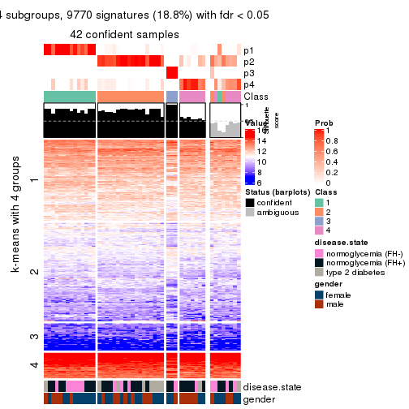</p>

</div>
<div id='tab-ATC-mclust-get-signatures-no-scale-4'>
<pre><code class="r">get_signatures(res, k = 5, scale_rows = FALSE)
</code></pre>

<p></p>

</div>
<div id='tab-ATC-mclust-get-signatures-no-scale-5'>
<pre><code class="r">get_signatures(res, k = 6, scale_rows = FALSE)
</code></pre>

<p></p>

</div>
</div>


Compare the overlap of signatures from different k:

```r
compare_signatures(res)
```


`get_signature()` returns a data frame invisibly. TO get the list of signatures, the function
call should be assigned to a variable explicitly. In following code, if `plot` argument is set
to `FALSE`, no heatmap is plotted while only the differential analysis is performed.

```r
# code only for demonstration
tb = get_signature(res, k = ..., plot = FALSE)
```

An example of the output of `tb` is:

```
#>   which_row         fdr    mean_1    mean_2 scaled_mean_1 scaled_mean_2 km
#> 1        38 0.042760348  8.373488  9.131774    -0.5533452     0.5164555  1
#> 2        40 0.018707592  7.106213  8.469186    -0.6173731     0.5762149  1
#> 3        55 0.019134737 10.221463 11.207825    -0.6159697     0.5749050  1
#> 4        59 0.006059896  5.921854  7.869574    -0.6899429     0.6439467  1
#> 5        60 0.018055526  8.928898 10.211722    -0.6204761     0.5791110  1
#> 6        98 0.009384629 15.714769 14.887706     0.6635654    -0.6193277  2
...
```

The columns in `tb` are:

1. `which_row`: row indices corresponding to the input matrix.
2. `fdr`: FDR for the differential test. 
3. `mean_x`: The mean value in group x.
4. `scaled_mean_x`: The mean value in group x after rows are scaled.
5. `km`: Row groups if k-means clustering is applied to rows.


UMAP plot which shows how samples are separated.


<script>
$( function() {
	$( '#tabs-ATC-mclust-dimension-reduction' ).tabs();
} );
</script>
<div id='tabs-ATC-mclust-dimension-reduction'>
<ul>
<li><a href='#tab-ATC-mclust-dimension-reduction-1'>k = 2</a></li>
<li><a href='#tab-ATC-mclust-dimension-reduction-2'>k = 3</a></li>
<li><a href='#tab-ATC-mclust-dimension-reduction-3'>k = 4</a></li>
<li><a href='#tab-ATC-mclust-dimension-reduction-4'>k = 5</a></li>
<li><a href='#tab-ATC-mclust-dimension-reduction-5'>k = 6</a></li>
</ul>
<div id='tab-ATC-mclust-dimension-reduction-1'>
<pre><code class="r">dimension_reduction(res, k = 2, method = &quot;UMAP&quot;)
</code></pre>

<p></p>

</div>
<div id='tab-ATC-mclust-dimension-reduction-2'>
<pre><code class="r">dimension_reduction(res, k = 3, method = &quot;UMAP&quot;)
</code></pre>

<p></p>

</div>
<div id='tab-ATC-mclust-dimension-reduction-3'>
<pre><code class="r">dimension_reduction(res, k = 4, method = &quot;UMAP&quot;)
</code></pre>

<p></p>

</div>
<div id='tab-ATC-mclust-dimension-reduction-4'>
<pre><code class="r">dimension_reduction(res, k = 5, method = &quot;UMAP&quot;)
</code></pre>

<p></p>

</div>
<div id='tab-ATC-mclust-dimension-reduction-5'>
<pre><code class="r">dimension_reduction(res, k = 6, method = &quot;UMAP&quot;)
</code></pre>

<p></p>

</div>
</div>


Following heatmap shows how subgroups are split when increasing `k`:

```r
collect_classes(res)
```


Test correlation between subgroups and known annotations. If the known
annotation is numeric, one-way ANOVA test is applied, and if the known
annotation is discrete, chi-squared contingency table test is applied.

```r
test_to_known_factors(res)
```

```
#>             n disease.state(p) gender(p) k
#> ATC:mclust 21           0.0569     0.612 2
#> ATC:mclust 39           0.2241     0.909 3
#> ATC:mclust 42           0.2321     0.453 4
#> ATC:mclust 41           0.4387     0.771 5
#> ATC:mclust 34           0.4258     0.838 6
```


If matrix rows can be associated to genes, consider to use `functional_enrichment(res,
...)` to perform function enrichment for the signature genes. See [this vignette](http://bioconductor.org/packages/devel/bioc/vignettes/cola/inst/doc/functional_enrichment.html) for more detailed explanations.


 

---------------------------------------------------


### ATC:NMF**


The object with results only for a single top-value method and a single partition method 
can be extracted as:

```r
res = res_list["ATC", "NMF"]
# you can also extract it by
# res = res_list["ATC:NMF"]
```

A summary of `res` and all the functions that can be applied to it:

```r
res
```

```
#> A 'ConsensusPartition' object with k = 2, 3, 4, 5, 6.
#>   On a matrix with 51941 rows and 50 columns.
#>   Top rows (1000, 2000, 3000, 4000, 5000) are extracted by 'ATC' method.
#>   Subgroups are detected by 'NMF' method.
#>   Performed in total 1250 partitions by row resampling.
#>   Best k for subgroups seems to be 3.
#> 
#> Following methods can be applied to this 'ConsensusPartition' object:
#>  [1] "cola_report"             "collect_classes"         "collect_plots"          
#>  [4] "collect_stats"           "colnames"                "compare_signatures"     
#>  [7] "consensus_heatmap"       "dimension_reduction"     "functional_enrichment"  
#> [10] "get_anno_col"            "get_anno"                "get_classes"            
#> [13] "get_consensus"           "get_matrix"              "get_membership"         
#> [16] "get_param"               "get_signatures"          "get_stats"              
#> [19] "is_best_k"               "is_stable_k"             "membership_heatmap"     
#> [22] "ncol"                    "nrow"                    "plot_ecdf"              
#> [25] "rownames"                "select_partition_number" "show"                   
#> [28] "suggest_best_k"          "test_to_known_factors"
```

`collect_plots()` function collects all the plots made from `res` for all `k` (number of partitions)
into one single page to provide an easy and fast comparison between different `k`.

```r
collect_plots(res)
```


The plots are:

- The first row: a plot of the ECDF (empirical cumulative distribution
  function) curves of the consensus matrix for each `k` and the heatmap of
  predicted classes for each `k`.
- The second row: heatmaps of the consensus matrix for each `k`.
- The third row: heatmaps of the membership matrix for each `k`.
- The fouth row: heatmaps of the signatures for each `k`.

All the plots in panels can be made by individual functions and they are
plotted later in this section.

`select_partition_number()` produces several plots showing different
statistics for choosing "optimized" `k`. There are following statistics:

- ECDF curves of the consensus matrix for each `k`;
- 1-PAC. [The PAC
  score](https://en.wikipedia.org/wiki/Consensus_clustering#Over-interpretation_potential_of_consensus_clustering)
  measures the proportion of the ambiguous subgrouping.
- Mean silhouette score.
- Concordance. The mean probability of fiting the consensus class ids in all
  partitions.
- Area increased. Denote $A_k$ as the area under the ECDF curve for current
  `k`, the area increased is defined as $A_k - A_{k-1}$.
- Rand index. The percent of pairs of samples that are both in a same cluster
  or both are not in a same cluster in the partition of k and k-1.
- Jaccard index. The ratio of pairs of samples are both in a same cluster in
  the partition of k and k-1 and the pairs of samples are both in a same
  cluster in the partition k or k-1.

The detailed explanations of these statistics can be found in [the _cola_
vignette](http://bioconductor.org/packages/devel/bioc/vignettes/cola/inst/doc/cola.html#toc_13).

Generally speaking, lower PAC score, higher mean silhouette score or higher
concordance corresponds to better partition. Rand index and Jaccard index
measure how similar the current partition is compared to partition with `k-1`.
If they are too similar, we won't accept `k` is better than `k-1`.

```r
select_partition_number(res)
```

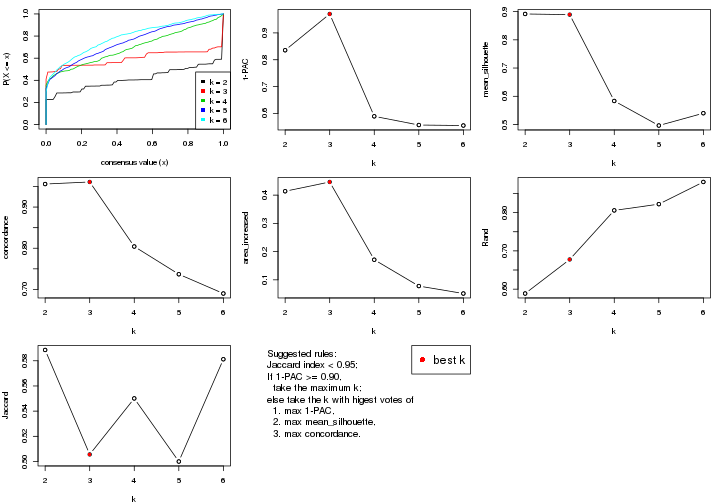

The numeric values for all these statistics can be obtained by `get_stats()`.

```r
get_stats(res)
```

```
#>   k 1-PAC mean_silhouette concordance area_increased  Rand Jaccard
#> 2 2 0.835           0.892       0.956         0.4137 0.589   0.589
#> 3 3 0.970           0.889       0.961         0.4466 0.678   0.506
#> 4 4 0.589           0.583       0.804         0.1712 0.806   0.550
#> 5 5 0.557           0.497       0.737         0.0779 0.822   0.500
#> 6 6 0.555           0.540       0.690         0.0515 0.880   0.581
```

`suggest_best_k()` suggests the best $k$ based on these statistics. The rules are as follows:

- All $k$ with Jaccard index larger than 0.95 are removed because increasing
  $k$ does not provide enough extra information. If all $k$ are removed, it is
  marked as no subgroup is detected.
- For all $k$ with 1-PAC score larger than 0.9, the maximal $k$ is taken as
  the best $k$, and other $k$ are marked as optional $k$.
- If it does not fit the second rule. The $k$ with the maximal vote of the
  highest 1-PAC score, highest mean silhouette, and highest concordance is
  taken as the best $k$.

```r
suggest_best_k(res)
```

```
#> [1] 3
```


Following shows the table of the partitions (You need to click the **show/hide
code output** link to see it). The membership matrix (columns with name `p*`)
is inferred by
[`clue::cl_consensus()`](https://www.rdocumentation.org/link/cl_consensus?package=clue)
function with the `SE` method. Basically the value in the membership matrix
represents the probability to belong to a certain group. The finall class
label for an item is determined with the group with highest probability it
belongs to.

In `get_classes()` function, the entropy is calculated from the membership
matrix and the silhouette score is calculated from the consensus matrix.


<script>
$( function() {
	$( '#tabs-ATC-NMF-get-classes' ).tabs();
} );
</script>
<div id='tabs-ATC-NMF-get-classes'>
<ul>
<li><a href='#tab-ATC-NMF-get-classes-1'>k = 2</a></li>
<li><a href='#tab-ATC-NMF-get-classes-2'>k = 3</a></li>
<li><a href='#tab-ATC-NMF-get-classes-3'>k = 4</a></li>
<li><a href='#tab-ATC-NMF-get-classes-4'>k = 5</a></li>
<li><a href='#tab-ATC-NMF-get-classes-5'>k = 6</a></li>
</ul>

<div id='tab-ATC-NMF-get-classes-1'>
<p><a id='tab-ATC-NMF-get-classes-1-a' style='color:#0366d6' href='#'>show/hide code output</a></p>
<pre><code class="r">cbind(get_classes(res, k = 2), get_membership(res, k = 2))
</code></pre>

<pre><code>#&gt;           class entropy silhouette    p1    p2
#&gt; GSM624962     1   0.760      0.733 0.780 0.220
#&gt; GSM624963     2   0.000      0.958 0.000 1.000
#&gt; GSM624967     2   0.000      0.958 0.000 1.000
#&gt; GSM624968     2   0.973      0.284 0.404 0.596
#&gt; GSM624969     2   0.000      0.958 0.000 1.000
#&gt; GSM624970     2   0.000      0.958 0.000 1.000
#&gt; GSM624961     2   0.000      0.958 0.000 1.000
#&gt; GSM624964     2   0.000      0.958 0.000 1.000
#&gt; GSM624965     2   0.000      0.958 0.000 1.000
#&gt; GSM624966     1   0.000      0.926 1.000 0.000
#&gt; GSM624925     2   0.000      0.958 0.000 1.000
#&gt; GSM624927     2   0.000      0.958 0.000 1.000
#&gt; GSM624929     2   0.000      0.958 0.000 1.000
#&gt; GSM624930     2   0.971      0.296 0.400 0.600
#&gt; GSM624931     2   0.895      0.519 0.312 0.688
#&gt; GSM624935     2   0.000      0.958 0.000 1.000
#&gt; GSM624936     1   0.706      0.771 0.808 0.192
#&gt; GSM624937     2   0.000      0.958 0.000 1.000
#&gt; GSM624926     2   0.000      0.958 0.000 1.000
#&gt; GSM624928     2   0.000      0.958 0.000 1.000
#&gt; GSM624932     1   0.955      0.420 0.624 0.376
#&gt; GSM624933     2   0.000      0.958 0.000 1.000
#&gt; GSM624934     2   0.000      0.958 0.000 1.000
#&gt; GSM624971     1   0.000      0.926 1.000 0.000
#&gt; GSM624973     1   0.000      0.926 1.000 0.000
#&gt; GSM624938     1   0.000      0.926 1.000 0.000
#&gt; GSM624940     1   0.000      0.926 1.000 0.000
#&gt; GSM624941     2   0.000      0.958 0.000 1.000
#&gt; GSM624942     2   0.000      0.958 0.000 1.000
#&gt; GSM624943     2   0.000      0.958 0.000 1.000
#&gt; GSM624945     2   0.311      0.905 0.056 0.944
#&gt; GSM624946     1   0.000      0.926 1.000 0.000
#&gt; GSM624949     2   0.595      0.803 0.144 0.856
#&gt; GSM624951     1   0.000      0.926 1.000 0.000
#&gt; GSM624952     1   0.311      0.899 0.944 0.056
#&gt; GSM624955     1   0.260      0.907 0.956 0.044
#&gt; GSM624956     2   0.000      0.958 0.000 1.000
#&gt; GSM624957     2   0.000      0.958 0.000 1.000
#&gt; GSM624974     1   0.000      0.926 1.000 0.000
#&gt; GSM624939     1   0.000      0.926 1.000 0.000
#&gt; GSM624944     2   0.000      0.958 0.000 1.000
#&gt; GSM624947     2   0.000      0.958 0.000 1.000
#&gt; GSM624948     2   0.000      0.958 0.000 1.000
#&gt; GSM624950     2   0.000      0.958 0.000 1.000
#&gt; GSM624953     2   0.000      0.958 0.000 1.000
#&gt; GSM624954     2   0.000      0.958 0.000 1.000
#&gt; GSM624958     2   0.000      0.958 0.000 1.000
#&gt; GSM624959     2   0.000      0.958 0.000 1.000
#&gt; GSM624960     2   0.000      0.958 0.000 1.000
#&gt; GSM624972     2   0.000      0.958 0.000 1.000
</code></pre>

<script>
$('#tab-ATC-NMF-get-classes-1-a').parent().next().next().hide();
$('#tab-ATC-NMF-get-classes-1-a').click(function(){
  $('#tab-ATC-NMF-get-classes-1-a').parent().next().next().toggle();
  return(false);
});
</script>
</div>

<div id='tab-ATC-NMF-get-classes-2'>
<p><a id='tab-ATC-NMF-get-classes-2-a' style='color:#0366d6' href='#'>show/hide code output</a></p>
<pre><code class="r">cbind(get_classes(res, k = 3), get_membership(res, k = 3))
</code></pre>

<pre><code>#&gt;           class entropy silhouette    p1    p2    p3
#&gt; GSM624962     3  0.2625     0.8538 0.000 0.084 0.916
#&gt; GSM624963     2  0.0000     0.9764 0.000 1.000 0.000
#&gt; GSM624967     2  0.0000     0.9764 0.000 1.000 0.000
#&gt; GSM624968     1  0.0000     0.9156 1.000 0.000 0.000
#&gt; GSM624969     2  0.0000     0.9764 0.000 1.000 0.000
#&gt; GSM624970     2  0.0000     0.9764 0.000 1.000 0.000
#&gt; GSM624961     2  0.0000     0.9764 0.000 1.000 0.000
#&gt; GSM624964     2  0.0000     0.9764 0.000 1.000 0.000
#&gt; GSM624965     2  0.0000     0.9764 0.000 1.000 0.000
#&gt; GSM624966     1  0.0237     0.9145 0.996 0.000 0.004
#&gt; GSM624925     2  0.0000     0.9764 0.000 1.000 0.000
#&gt; GSM624927     1  0.6235     0.2564 0.564 0.436 0.000
#&gt; GSM624929     2  0.0000     0.9764 0.000 1.000 0.000
#&gt; GSM624930     1  0.0000     0.9156 1.000 0.000 0.000
#&gt; GSM624931     1  0.0000     0.9156 1.000 0.000 0.000
#&gt; GSM624935     2  0.0000     0.9764 0.000 1.000 0.000
#&gt; GSM624936     1  0.0000     0.9156 1.000 0.000 0.000
#&gt; GSM624937     2  0.0000     0.9764 0.000 1.000 0.000
#&gt; GSM624926     1  0.6225     0.2766 0.568 0.432 0.000
#&gt; GSM624928     2  0.0000     0.9764 0.000 1.000 0.000
#&gt; GSM624932     1  0.0000     0.9156 1.000 0.000 0.000
#&gt; GSM624933     2  0.0000     0.9764 0.000 1.000 0.000
#&gt; GSM624934     1  0.0000     0.9156 1.000 0.000 0.000
#&gt; GSM624971     3  0.0000     0.9097 0.000 0.000 1.000
#&gt; GSM624973     3  0.0000     0.9097 0.000 0.000 1.000
#&gt; GSM624938     3  0.0000     0.9097 0.000 0.000 1.000
#&gt; GSM624940     1  0.1643     0.8842 0.956 0.000 0.044
#&gt; GSM624941     2  0.0000     0.9764 0.000 1.000 0.000
#&gt; GSM624942     2  0.0000     0.9764 0.000 1.000 0.000
#&gt; GSM624943     2  0.2625     0.8760 0.084 0.916 0.000
#&gt; GSM624945     2  0.6252     0.0989 0.000 0.556 0.444
#&gt; GSM624946     3  0.0000     0.9097 0.000 0.000 1.000
#&gt; GSM624949     3  0.5835     0.4828 0.000 0.340 0.660
#&gt; GSM624951     1  0.0237     0.9145 0.996 0.000 0.004
#&gt; GSM624952     1  0.0000     0.9156 1.000 0.000 0.000
#&gt; GSM624955     3  0.0237     0.9087 0.000 0.004 0.996
#&gt; GSM624956     2  0.0000     0.9764 0.000 1.000 0.000
#&gt; GSM624957     1  0.0000     0.9156 1.000 0.000 0.000
#&gt; GSM624974     1  0.0237     0.9145 0.996 0.000 0.004
#&gt; GSM624939     1  0.0237     0.9145 0.996 0.000 0.004
#&gt; GSM624944     2  0.0000     0.9764 0.000 1.000 0.000
#&gt; GSM624947     2  0.0000     0.9764 0.000 1.000 0.000
#&gt; GSM624948     2  0.0000     0.9764 0.000 1.000 0.000
#&gt; GSM624950     1  0.2165     0.8513 0.936 0.064 0.000
#&gt; GSM624953     2  0.0000     0.9764 0.000 1.000 0.000
#&gt; GSM624954     2  0.0000     0.9764 0.000 1.000 0.000
#&gt; GSM624958     2  0.0000     0.9764 0.000 1.000 0.000
#&gt; GSM624959     2  0.0000     0.9764 0.000 1.000 0.000
#&gt; GSM624960     1  0.0237     0.9132 0.996 0.004 0.000
#&gt; GSM624972     2  0.0000     0.9764 0.000 1.000 0.000
</code></pre>

<script>
$('#tab-ATC-NMF-get-classes-2-a').parent().next().next().hide();
$('#tab-ATC-NMF-get-classes-2-a').click(function(){
  $('#tab-ATC-NMF-get-classes-2-a').parent().next().next().toggle();
  return(false);
});
</script>
</div>

<div id='tab-ATC-NMF-get-classes-3'>
<p><a id='tab-ATC-NMF-get-classes-3-a' style='color:#0366d6' href='#'>show/hide code output</a></p>
<pre><code class="r">cbind(get_classes(res, k = 4), get_membership(res, k = 4))
</code></pre>

<pre><code>#&gt;           class entropy silhouette    p1    p2    p3    p4
#&gt; GSM624962     3  0.5678    0.25480 0.004 0.480 0.500 0.016
#&gt; GSM624963     2  0.2760    0.66207 0.000 0.872 0.000 0.128
#&gt; GSM624967     4  0.4776    0.37654 0.000 0.376 0.000 0.624
#&gt; GSM624968     4  0.3672    0.47412 0.164 0.000 0.012 0.824
#&gt; GSM624969     2  0.4134    0.57619 0.000 0.740 0.000 0.260
#&gt; GSM624970     2  0.5962    0.52476 0.080 0.660 0.000 0.260
#&gt; GSM624961     2  0.0707    0.63473 0.000 0.980 0.000 0.020
#&gt; GSM624964     2  0.1022    0.65674 0.000 0.968 0.000 0.032
#&gt; GSM624965     2  0.1211    0.66479 0.000 0.960 0.000 0.040
#&gt; GSM624966     1  0.0188    0.92303 0.996 0.000 0.000 0.004
#&gt; GSM624925     2  0.4250    0.57905 0.000 0.724 0.000 0.276
#&gt; GSM624927     1  0.7187   -0.30612 0.440 0.136 0.000 0.424
#&gt; GSM624929     2  0.1118    0.66404 0.000 0.964 0.000 0.036
#&gt; GSM624930     1  0.1022    0.92026 0.968 0.000 0.000 0.032
#&gt; GSM624931     1  0.1637    0.90475 0.940 0.000 0.000 0.060
#&gt; GSM624935     2  0.4948    0.18746 0.000 0.560 0.000 0.440
#&gt; GSM624936     1  0.0000    0.92403 1.000 0.000 0.000 0.000
#&gt; GSM624937     4  0.4761    0.37773 0.000 0.372 0.000 0.628
#&gt; GSM624926     4  0.2124    0.59201 0.040 0.028 0.000 0.932
#&gt; GSM624928     2  0.4643    0.45806 0.000 0.656 0.000 0.344
#&gt; GSM624932     1  0.0188    0.92303 0.996 0.000 0.000 0.004
#&gt; GSM624933     2  0.4996    0.00776 0.000 0.516 0.000 0.484
#&gt; GSM624934     1  0.0707    0.92327 0.980 0.000 0.000 0.020
#&gt; GSM624971     3  0.0000    0.83077 0.000 0.000 1.000 0.000
#&gt; GSM624973     3  0.0707    0.82506 0.000 0.020 0.980 0.000
#&gt; GSM624938     3  0.0000    0.83077 0.000 0.000 1.000 0.000
#&gt; GSM624940     1  0.2313    0.89094 0.924 0.000 0.032 0.044
#&gt; GSM624941     2  0.3528    0.63813 0.000 0.808 0.000 0.192
#&gt; GSM624942     2  0.4088    0.64065 0.040 0.820 0.000 0.140
#&gt; GSM624943     2  0.7588    0.13784 0.312 0.468 0.000 0.220
#&gt; GSM624945     2  0.4543    0.23755 0.000 0.676 0.324 0.000
#&gt; GSM624946     3  0.0000    0.83077 0.000 0.000 1.000 0.000
#&gt; GSM624949     2  0.4776    0.07536 0.000 0.624 0.376 0.000
#&gt; GSM624951     1  0.0921    0.92182 0.972 0.000 0.000 0.028
#&gt; GSM624952     1  0.0188    0.92303 0.996 0.000 0.000 0.004
#&gt; GSM624955     3  0.5343    0.53778 0.000 0.028 0.656 0.316
#&gt; GSM624956     4  0.4967    0.09569 0.000 0.452 0.000 0.548
#&gt; GSM624957     1  0.1022    0.92060 0.968 0.000 0.000 0.032
#&gt; GSM624974     1  0.0188    0.92418 0.996 0.000 0.000 0.004
#&gt; GSM624939     1  0.0000    0.92403 1.000 0.000 0.000 0.000
#&gt; GSM624944     4  0.2973    0.60684 0.000 0.144 0.000 0.856
#&gt; GSM624947     4  0.3355    0.60561 0.004 0.160 0.000 0.836
#&gt; GSM624948     4  0.4977    0.11576 0.000 0.460 0.000 0.540
#&gt; GSM624950     4  0.5062    0.39032 0.300 0.020 0.000 0.680
#&gt; GSM624953     2  0.1867    0.65160 0.000 0.928 0.000 0.072
#&gt; GSM624954     2  0.4040    0.60034 0.000 0.752 0.000 0.248
#&gt; GSM624958     2  0.4804    0.36459 0.000 0.616 0.000 0.384
#&gt; GSM624959     4  0.4304    0.52207 0.000 0.284 0.000 0.716
#&gt; GSM624960     4  0.3659    0.57176 0.136 0.024 0.000 0.840
#&gt; GSM624972     2  0.1940    0.65405 0.000 0.924 0.000 0.076
</code></pre>

<script>
$('#tab-ATC-NMF-get-classes-3-a').parent().next().next().hide();
$('#tab-ATC-NMF-get-classes-3-a').click(function(){
  $('#tab-ATC-NMF-get-classes-3-a').parent().next().next().toggle();
  return(false);
});
</script>
</div>

<div id='tab-ATC-NMF-get-classes-4'>
<p><a id='tab-ATC-NMF-get-classes-4-a' style='color:#0366d6' href='#'>show/hide code output</a></p>
<pre><code class="r">cbind(get_classes(res, k = 5), get_membership(res, k = 5))
</code></pre>

<pre><code>#&gt;           class entropy silhouette    p1    p2    p3    p4    p5
#&gt; GSM624962     2  0.5946   -0.13863 0.004 0.588 0.132 0.000 0.276
#&gt; GSM624963     2  0.6047    0.24054 0.000 0.532 0.000 0.136 0.332
#&gt; GSM624967     4  0.4397    0.46295 0.000 0.276 0.000 0.696 0.028
#&gt; GSM624968     4  0.6685   -0.18653 0.188 0.000 0.008 0.464 0.340
#&gt; GSM624969     2  0.4674    0.09831 0.000 0.568 0.000 0.416 0.016
#&gt; GSM624970     4  0.7668    0.17235 0.060 0.216 0.000 0.384 0.340
#&gt; GSM624961     2  0.2777    0.45198 0.000 0.864 0.000 0.016 0.120
#&gt; GSM624964     2  0.5808    0.46367 0.000 0.608 0.000 0.232 0.160
#&gt; GSM624965     2  0.5659    0.50343 0.000 0.632 0.000 0.164 0.204
#&gt; GSM624966     1  0.1270    0.92964 0.948 0.000 0.000 0.000 0.052
#&gt; GSM624925     2  0.3492    0.48169 0.000 0.796 0.000 0.188 0.016
#&gt; GSM624927     4  0.5412    0.48719 0.172 0.108 0.000 0.700 0.020
#&gt; GSM624929     2  0.5016    0.52661 0.000 0.704 0.000 0.120 0.176
#&gt; GSM624930     1  0.1877    0.92836 0.924 0.000 0.000 0.012 0.064
#&gt; GSM624931     1  0.2513    0.90398 0.876 0.000 0.000 0.008 0.116
#&gt; GSM624935     4  0.5728    0.45147 0.000 0.200 0.000 0.624 0.176
#&gt; GSM624936     1  0.0510    0.93631 0.984 0.000 0.000 0.000 0.016
#&gt; GSM624937     4  0.5039    0.13665 0.000 0.456 0.000 0.512 0.032
#&gt; GSM624926     4  0.4815    0.26094 0.064 0.000 0.000 0.692 0.244
#&gt; GSM624928     4  0.5143    0.11715 0.000 0.428 0.000 0.532 0.040
#&gt; GSM624932     1  0.1608    0.92274 0.928 0.000 0.000 0.000 0.072
#&gt; GSM624933     4  0.4818    0.50285 0.000 0.212 0.000 0.708 0.080
#&gt; GSM624934     1  0.1740    0.93036 0.932 0.000 0.000 0.012 0.056
#&gt; GSM624971     3  0.0000    0.81826 0.000 0.000 1.000 0.000 0.000
#&gt; GSM624973     3  0.0510    0.81147 0.000 0.000 0.984 0.000 0.016
#&gt; GSM624938     3  0.0404    0.81522 0.000 0.000 0.988 0.000 0.012
#&gt; GSM624940     1  0.2653    0.89438 0.880 0.000 0.024 0.000 0.096
#&gt; GSM624941     2  0.4498    0.37039 0.000 0.688 0.000 0.280 0.032
#&gt; GSM624942     2  0.6766    0.30164 0.084 0.568 0.000 0.264 0.084
#&gt; GSM624943     2  0.7351   -0.04407 0.328 0.352 0.000 0.296 0.024
#&gt; GSM624945     2  0.5808    0.00277 0.000 0.576 0.320 0.004 0.100
#&gt; GSM624946     3  0.0162    0.81852 0.000 0.000 0.996 0.000 0.004
#&gt; GSM624949     3  0.5486    0.14761 0.000 0.288 0.624 0.004 0.084
#&gt; GSM624951     1  0.1410    0.93294 0.940 0.000 0.000 0.000 0.060
#&gt; GSM624952     1  0.1270    0.92792 0.948 0.000 0.000 0.000 0.052
#&gt; GSM624955     5  0.8489    0.00000 0.036 0.212 0.276 0.076 0.400
#&gt; GSM624956     2  0.6497    0.23218 0.000 0.476 0.000 0.312 0.212
#&gt; GSM624957     1  0.3906    0.82642 0.812 0.004 0.000 0.104 0.080
#&gt; GSM624974     1  0.0880    0.93262 0.968 0.000 0.000 0.000 0.032
#&gt; GSM624939     1  0.0404    0.93504 0.988 0.000 0.000 0.000 0.012
#&gt; GSM624944     4  0.2616    0.54176 0.000 0.036 0.000 0.888 0.076
#&gt; GSM624947     4  0.1557    0.54872 0.000 0.008 0.000 0.940 0.052
#&gt; GSM624948     4  0.4575    0.48110 0.000 0.236 0.000 0.712 0.052
#&gt; GSM624950     4  0.4106    0.51465 0.136 0.004 0.000 0.792 0.068
#&gt; GSM624953     2  0.2909    0.41203 0.000 0.848 0.000 0.012 0.140
#&gt; GSM624954     2  0.4626    0.22138 0.000 0.616 0.000 0.364 0.020
#&gt; GSM624958     4  0.5218    0.32016 0.000 0.336 0.000 0.604 0.060
#&gt; GSM624959     4  0.2929    0.54827 0.000 0.152 0.000 0.840 0.008
#&gt; GSM624960     4  0.3868    0.42160 0.060 0.000 0.000 0.800 0.140
#&gt; GSM624972     2  0.2833    0.50871 0.000 0.888 0.020 0.068 0.024
</code></pre>

<script>
$('#tab-ATC-NMF-get-classes-4-a').parent().next().next().hide();
$('#tab-ATC-NMF-get-classes-4-a').click(function(){
  $('#tab-ATC-NMF-get-classes-4-a').parent().next().next().toggle();
  return(false);
});
</script>
</div>

<div id='tab-ATC-NMF-get-classes-5'>
<p><a id='tab-ATC-NMF-get-classes-5-a' style='color:#0366d6' href='#'>show/hide code output</a></p>
<pre><code class="r">cbind(get_classes(res, k = 6), get_membership(res, k = 6))
</code></pre>

<pre><code>#&gt;           class entropy silhouette    p1    p2    p3    p4    p5    p6
#&gt; GSM624962     2  0.2731     0.4818 0.036 0.892 0.020 0.008 0.004 0.040
#&gt; GSM624963     2  0.5947     0.4737 0.152 0.612 0.000 0.172 0.000 0.064
#&gt; GSM624967     1  0.4472     0.4962 0.496 0.000 0.000 0.476 0.000 0.028
#&gt; GSM624968     6  0.6609     0.0000 0.012 0.056 0.008 0.176 0.176 0.572
#&gt; GSM624969     1  0.4356     0.7108 0.608 0.032 0.000 0.360 0.000 0.000
#&gt; GSM624970     4  0.6920     0.2272 0.352 0.072 0.000 0.432 0.012 0.132
#&gt; GSM624961     2  0.5289     0.4472 0.244 0.628 0.000 0.112 0.000 0.016
#&gt; GSM624964     4  0.6740    -0.2450 0.248 0.328 0.000 0.384 0.000 0.040
#&gt; GSM624965     2  0.6081     0.3706 0.124 0.500 0.008 0.348 0.000 0.020
#&gt; GSM624966     5  0.2373     0.8563 0.008 0.008 0.000 0.000 0.880 0.104
#&gt; GSM624925     1  0.5373     0.6627 0.596 0.152 0.000 0.248 0.000 0.004
#&gt; GSM624927     4  0.4279     0.4039 0.088 0.000 0.000 0.756 0.140 0.016
#&gt; GSM624929     2  0.6000     0.3900 0.168 0.524 0.000 0.288 0.000 0.020
#&gt; GSM624930     5  0.1926     0.8718 0.020 0.000 0.000 0.000 0.912 0.068
#&gt; GSM624931     5  0.3252     0.8056 0.008 0.000 0.000 0.048 0.832 0.112
#&gt; GSM624935     4  0.4856     0.4640 0.200 0.076 0.000 0.696 0.000 0.028
#&gt; GSM624936     5  0.0806     0.8798 0.008 0.000 0.000 0.000 0.972 0.020
#&gt; GSM624937     1  0.4514     0.7037 0.632 0.012 0.000 0.328 0.000 0.028
#&gt; GSM624926     4  0.5211    -0.2571 0.016 0.004 0.000 0.504 0.044 0.432
#&gt; GSM624928     4  0.4745     0.1293 0.204 0.124 0.000 0.672 0.000 0.000
#&gt; GSM624932     5  0.2265     0.8660 0.008 0.004 0.000 0.008 0.896 0.084
#&gt; GSM624933     4  0.2639     0.4944 0.064 0.048 0.000 0.880 0.000 0.008
#&gt; GSM624934     5  0.1426     0.8784 0.008 0.000 0.000 0.016 0.948 0.028
#&gt; GSM624971     3  0.0291     0.9101 0.000 0.004 0.992 0.000 0.000 0.004
#&gt; GSM624973     3  0.0653     0.9079 0.004 0.012 0.980 0.000 0.000 0.004
#&gt; GSM624938     3  0.0363     0.9094 0.000 0.000 0.988 0.000 0.000 0.012
#&gt; GSM624940     5  0.3381     0.7887 0.004 0.000 0.040 0.000 0.808 0.148
#&gt; GSM624941     1  0.4900     0.7322 0.624 0.080 0.000 0.292 0.004 0.000
#&gt; GSM624942     1  0.6017     0.6671 0.608 0.052 0.000 0.248 0.064 0.028
#&gt; GSM624943     1  0.7123     0.2710 0.384 0.036 0.000 0.304 0.256 0.020
#&gt; GSM624945     2  0.6921     0.2596 0.144 0.420 0.336 0.100 0.000 0.000
#&gt; GSM624946     3  0.0405     0.9087 0.004 0.000 0.988 0.000 0.000 0.008
#&gt; GSM624949     3  0.4914     0.6192 0.112 0.164 0.704 0.012 0.000 0.008
#&gt; GSM624951     5  0.1732     0.8709 0.004 0.004 0.000 0.000 0.920 0.072
#&gt; GSM624952     5  0.2680     0.8407 0.004 0.016 0.000 0.000 0.856 0.124
#&gt; GSM624955     2  0.6845    -0.0637 0.084 0.500 0.064 0.020 0.012 0.320
#&gt; GSM624956     2  0.5709     0.4066 0.032 0.568 0.000 0.300 0.000 0.100
#&gt; GSM624957     5  0.4573     0.5558 0.012 0.004 0.000 0.216 0.708 0.060
#&gt; GSM624974     5  0.1297     0.8772 0.012 0.000 0.000 0.000 0.948 0.040
#&gt; GSM624939     5  0.1334     0.8774 0.020 0.000 0.000 0.000 0.948 0.032
#&gt; GSM624944     4  0.4613     0.4139 0.116 0.000 0.000 0.688 0.000 0.196
#&gt; GSM624947     4  0.3864     0.4199 0.048 0.000 0.000 0.744 0.000 0.208
#&gt; GSM624948     4  0.2703     0.5196 0.052 0.064 0.000 0.876 0.000 0.008
#&gt; GSM624950     4  0.4623     0.3871 0.036 0.004 0.000 0.748 0.080 0.132
#&gt; GSM624953     2  0.4593     0.4965 0.208 0.700 0.000 0.084 0.000 0.008
#&gt; GSM624954     1  0.4903     0.7304 0.600 0.056 0.000 0.336 0.004 0.004
#&gt; GSM624958     4  0.3838     0.4407 0.096 0.116 0.000 0.784 0.000 0.004
#&gt; GSM624959     4  0.2137     0.5072 0.048 0.028 0.000 0.912 0.000 0.012
#&gt; GSM624960     4  0.4661     0.0928 0.012 0.000 0.000 0.620 0.036 0.332
#&gt; GSM624972     1  0.5354     0.5473 0.608 0.212 0.004 0.176 0.000 0.000
</code></pre>

<script>
$('#tab-ATC-NMF-get-classes-5-a').parent().next().next().hide();
$('#tab-ATC-NMF-get-classes-5-a').click(function(){
  $('#tab-ATC-NMF-get-classes-5-a').parent().next().next().toggle();
  return(false);
});
</script>
</div>
</div>

Heatmaps for the consensus matrix. It visualizes the probability of two
samples to be in a same group.


<script>
$( function() {
	$( '#tabs-ATC-NMF-consensus-heatmap' ).tabs();
} );
</script>
<div id='tabs-ATC-NMF-consensus-heatmap'>
<ul>
<li><a href='#tab-ATC-NMF-consensus-heatmap-1'>k = 2</a></li>
<li><a href='#tab-ATC-NMF-consensus-heatmap-2'>k = 3</a></li>
<li><a href='#tab-ATC-NMF-consensus-heatmap-3'>k = 4</a></li>
<li><a href='#tab-ATC-NMF-consensus-heatmap-4'>k = 5</a></li>
<li><a href='#tab-ATC-NMF-consensus-heatmap-5'>k = 6</a></li>
</ul>
<div id='tab-ATC-NMF-consensus-heatmap-1'>
<pre><code class="r">consensus_heatmap(res, k = 2)
</code></pre>

<p></p>

</div>
<div id='tab-ATC-NMF-consensus-heatmap-2'>
<pre><code class="r">consensus_heatmap(res, k = 3)
</code></pre>

<p></p>

</div>
<div id='tab-ATC-NMF-consensus-heatmap-3'>
<pre><code class="r">consensus_heatmap(res, k = 4)
</code></pre>

<p></p>

</div>
<div id='tab-ATC-NMF-consensus-heatmap-4'>
<pre><code class="r">consensus_heatmap(res, k = 5)
</code></pre>

<p></p>

</div>
<div id='tab-ATC-NMF-consensus-heatmap-5'>
<pre><code class="r">consensus_heatmap(res, k = 6)
</code></pre>

<p></p>

</div>
</div>

Heatmaps for the membership of samples in all partitions to see how consistent they are:


<script>
$( function() {
	$( '#tabs-ATC-NMF-membership-heatmap' ).tabs();
} );
</script>
<div id='tabs-ATC-NMF-membership-heatmap'>
<ul>
<li><a href='#tab-ATC-NMF-membership-heatmap-1'>k = 2</a></li>
<li><a href='#tab-ATC-NMF-membership-heatmap-2'>k = 3</a></li>
<li><a href='#tab-ATC-NMF-membership-heatmap-3'>k = 4</a></li>
<li><a href='#tab-ATC-NMF-membership-heatmap-4'>k = 5</a></li>
<li><a href='#tab-ATC-NMF-membership-heatmap-5'>k = 6</a></li>
</ul>
<div id='tab-ATC-NMF-membership-heatmap-1'>
<pre><code class="r">membership_heatmap(res, k = 2)
</code></pre>

<p></p>

</div>
<div id='tab-ATC-NMF-membership-heatmap-2'>
<pre><code class="r">membership_heatmap(res, k = 3)
</code></pre>

<p></p>

</div>
<div id='tab-ATC-NMF-membership-heatmap-3'>
<pre><code class="r">membership_heatmap(res, k = 4)
</code></pre>

<p></p>

</div>
<div id='tab-ATC-NMF-membership-heatmap-4'>
<pre><code class="r">membership_heatmap(res, k = 5)
</code></pre>

<p></p>

</div>
<div id='tab-ATC-NMF-membership-heatmap-5'>
<pre><code class="r">membership_heatmap(res, k = 6)
</code></pre>

<p></p>

</div>
</div>

As soon as we have had the classes for columns, we can look for signatures
which are significantly different between classes which can be candidate marks
for certain classes. Following are the heatmaps for signatures.


Signature heatmaps where rows are scaled:


<script>
$( function() {
	$( '#tabs-ATC-NMF-get-signatures' ).tabs();
} );
</script>
<div id='tabs-ATC-NMF-get-signatures'>
<ul>
<li><a href='#tab-ATC-NMF-get-signatures-1'>k = 2</a></li>
<li><a href='#tab-ATC-NMF-get-signatures-2'>k = 3</a></li>
<li><a href='#tab-ATC-NMF-get-signatures-3'>k = 4</a></li>
<li><a href='#tab-ATC-NMF-get-signatures-4'>k = 5</a></li>
<li><a href='#tab-ATC-NMF-get-signatures-5'>k = 6</a></li>
</ul>
<div id='tab-ATC-NMF-get-signatures-1'>
<pre><code class="r">get_signatures(res, k = 2)
</code></pre>

<p></p>

</div>
<div id='tab-ATC-NMF-get-signatures-2'>
<pre><code class="r">get_signatures(res, k = 3)
</code></pre>

<p></p>

</div>
<div id='tab-ATC-NMF-get-signatures-3'>
<pre><code class="r">get_signatures(res, k = 4)
</code></pre>

<p></p>

</div>
<div id='tab-ATC-NMF-get-signatures-4'>
<pre><code class="r">get_signatures(res, k = 5)
</code></pre>

<p></p>

</div>
<div id='tab-ATC-NMF-get-signatures-5'>
<pre><code class="r">get_signatures(res, k = 6)
</code></pre>

<p></p>

</div>
</div>


Signature heatmaps where rows are not scaled:


<script>
$( function() {
	$( '#tabs-ATC-NMF-get-signatures-no-scale' ).tabs();
} );
</script>
<div id='tabs-ATC-NMF-get-signatures-no-scale'>
<ul>
<li><a href='#tab-ATC-NMF-get-signatures-no-scale-1'>k = 2</a></li>
<li><a href='#tab-ATC-NMF-get-signatures-no-scale-2'>k = 3</a></li>
<li><a href='#tab-ATC-NMF-get-signatures-no-scale-3'>k = 4</a></li>
<li><a href='#tab-ATC-NMF-get-signatures-no-scale-4'>k = 5</a></li>
<li><a href='#tab-ATC-NMF-get-signatures-no-scale-5'>k = 6</a></li>
</ul>
<div id='tab-ATC-NMF-get-signatures-no-scale-1'>
<pre><code class="r">get_signatures(res, k = 2, scale_rows = FALSE)
</code></pre>

<p></p>

</div>
<div id='tab-ATC-NMF-get-signatures-no-scale-2'>
<pre><code class="r">get_signatures(res, k = 3, scale_rows = FALSE)
</code></pre>

<p></p>

</div>
<div id='tab-ATC-NMF-get-signatures-no-scale-3'>
<pre><code class="r">get_signatures(res, k = 4, scale_rows = FALSE)
</code></pre>

<p></p>

</div>
<div id='tab-ATC-NMF-get-signatures-no-scale-4'>
<pre><code class="r">get_signatures(res, k = 5, scale_rows = FALSE)
</code></pre>

<p></p>

</div>
<div id='tab-ATC-NMF-get-signatures-no-scale-5'>
<pre><code class="r">get_signatures(res, k = 6, scale_rows = FALSE)
</code></pre>

<p></p>

</div>
</div>


Compare the overlap of signatures from different k:

```r
compare_signatures(res)
```


`get_signature()` returns a data frame invisibly. TO get the list of signatures, the function
call should be assigned to a variable explicitly. In following code, if `plot` argument is set
to `FALSE`, no heatmap is plotted while only the differential analysis is performed.

```r
# code only for demonstration
tb = get_signature(res, k = ..., plot = FALSE)
```

An example of the output of `tb` is:

```
#>   which_row         fdr    mean_1    mean_2 scaled_mean_1 scaled_mean_2 km
#> 1        38 0.042760348  8.373488  9.131774    -0.5533452     0.5164555  1
#> 2        40 0.018707592  7.106213  8.469186    -0.6173731     0.5762149  1
#> 3        55 0.019134737 10.221463 11.207825    -0.6159697     0.5749050  1
#> 4        59 0.006059896  5.921854  7.869574    -0.6899429     0.6439467  1
#> 5        60 0.018055526  8.928898 10.211722    -0.6204761     0.5791110  1
#> 6        98 0.009384629 15.714769 14.887706     0.6635654    -0.6193277  2
...
```

The columns in `tb` are:

1. `which_row`: row indices corresponding to the input matrix.
2. `fdr`: FDR for the differential test. 
3. `mean_x`: The mean value in group x.
4. `scaled_mean_x`: The mean value in group x after rows are scaled.
5. `km`: Row groups if k-means clustering is applied to rows.


UMAP plot which shows how samples are separated.


<script>
$( function() {
	$( '#tabs-ATC-NMF-dimension-reduction' ).tabs();
} );
</script>
<div id='tabs-ATC-NMF-dimension-reduction'>
<ul>
<li><a href='#tab-ATC-NMF-dimension-reduction-1'>k = 2</a></li>
<li><a href='#tab-ATC-NMF-dimension-reduction-2'>k = 3</a></li>
<li><a href='#tab-ATC-NMF-dimension-reduction-3'>k = 4</a></li>
<li><a href='#tab-ATC-NMF-dimension-reduction-4'>k = 5</a></li>
<li><a href='#tab-ATC-NMF-dimension-reduction-5'>k = 6</a></li>
</ul>
<div id='tab-ATC-NMF-dimension-reduction-1'>
<pre><code class="r">dimension_reduction(res, k = 2, method = &quot;UMAP&quot;)
</code></pre>

<p></p>

</div>
<div id='tab-ATC-NMF-dimension-reduction-2'>
<pre><code class="r">dimension_reduction(res, k = 3, method = &quot;UMAP&quot;)
</code></pre>

<p></p>

</div>
<div id='tab-ATC-NMF-dimension-reduction-3'>
<pre><code class="r">dimension_reduction(res, k = 4, method = &quot;UMAP&quot;)
</code></pre>

<p></p>

</div>
<div id='tab-ATC-NMF-dimension-reduction-4'>
<pre><code class="r">dimension_reduction(res, k = 5, method = &quot;UMAP&quot;)
</code></pre>

<p>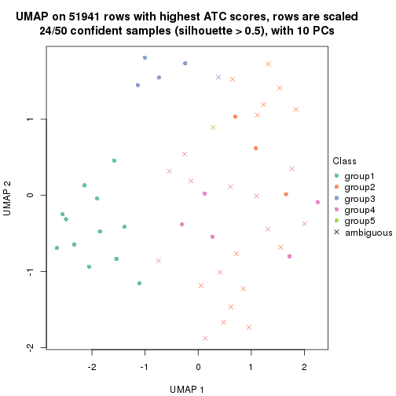</p>

</div>
<div id='tab-ATC-NMF-dimension-reduction-5'>
<pre><code class="r">dimension_reduction(res, k = 6, method = &quot;UMAP&quot;)
</code></pre>

<p></p>

</div>
</div>


Following heatmap shows how subgroups are split when increasing `k`:

```r
collect_classes(res)
```


Test correlation between subgroups and known annotations. If the known
annotation is numeric, one-way ANOVA test is applied, and if the known
annotation is discrete, chi-squared contingency table test is applied.

```r
test_to_known_factors(res)
```

```
#>          n disease.state(p) gender(p) k
#> ATC:NMF 47            0.777    0.3908 2
#> ATC:NMF 46            0.842    0.6169 3
#> ATC:NMF 35            0.108    0.0863 4
#> ATC:NMF 24            0.602    0.0879 5
#> ATC:NMF 26            0.849    0.3046 6
```


If matrix rows can be associated to genes, consider to use `functional_enrichment(res,
...)` to perform function enrichment for the signature genes. See [this vignette](http://bioconductor.org/packages/devel/bioc/vignettes/cola/inst/doc/functional_enrichment.html) for more detailed explanations.


 

## Session info


```r
sessionInfo()
```

```
#> R version 3.6.0 (2019-04-26)
#> Platform: x86_64-pc-linux-gnu (64-bit)
#> Running under: CentOS Linux 7 (Core)
#> 
#> Matrix products: default
#> BLAS:   /usr/lib64/libblas.so.3.4.2
#> LAPACK: /usr/lib64/liblapack.so.3.4.2
#> 
#> locale:
#>  [1] LC_CTYPE=en_GB.UTF-8       LC_NUMERIC=C               LC_TIME=en_GB.UTF-8       
#>  [4] LC_COLLATE=en_GB.UTF-8     LC_MONETARY=en_GB.UTF-8    LC_MESSAGES=en_GB.UTF-8   
#>  [7] LC_PAPER=en_GB.UTF-8       LC_NAME=C                  LC_ADDRESS=C              
#> [10] LC_TELEPHONE=C             LC_MEASUREMENT=en_GB.UTF-8 LC_IDENTIFICATION=C       
#> 
#> attached base packages:
#> [1] grid      stats     graphics  grDevices utils     datasets  methods   base     
#> 
#> other attached packages:
#> [1] genefilter_1.66.0    ComplexHeatmap_2.3.1 markdown_1.1         knitr_1.26          
#> [5] GetoptLong_0.1.7     cola_1.3.2          
#> 
#> loaded via a namespace (and not attached):
#>  [1] circlize_0.4.8       shape_1.4.4          xfun_0.11            slam_0.1-46         
#>  [5] lattice_0.20-38      splines_3.6.0        colorspace_1.4-1     vctrs_0.2.0         
#>  [9] stats4_3.6.0         blob_1.2.0           XML_3.98-1.20        survival_2.44-1.1   
#> [13] rlang_0.4.2          pillar_1.4.2         DBI_1.0.0            BiocGenerics_0.30.0 
#> [17] bit64_0.9-7          RColorBrewer_1.1-2   matrixStats_0.55.0   stringr_1.4.0       
#> [21] GlobalOptions_0.1.1  evaluate_0.14        memoise_1.1.0        Biobase_2.44.0      
#> [25] IRanges_2.18.3       parallel_3.6.0       AnnotationDbi_1.46.1 highr_0.8           
#> [29] Rcpp_1.0.3           xtable_1.8-4         backports_1.1.5      S4Vectors_0.22.1    
#> [33] annotate_1.62.0      skmeans_0.2-11       bit_1.1-14           microbenchmark_1.4-7
#> [37] brew_1.0-6           impute_1.58.0        rjson_0.2.20         png_0.1-7           
#> [41] digest_0.6.23        stringi_1.4.3        polyclip_1.10-0      clue_0.3-57         
#> [45] tools_3.6.0          bitops_1.0-6         magrittr_1.5         eulerr_6.0.0        
#> [49] RCurl_1.95-4.12      RSQLite_2.1.4        tibble_2.1.3         cluster_2.1.0       
#> [53] crayon_1.3.4         pkgconfig_2.0.3      zeallot_0.1.0        Matrix_1.2-17       
#> [57] xml2_1.2.2           httr_1.4.1           R6_2.4.1             mclust_5.4.5        
#> [61] compiler_3.6.0
```


